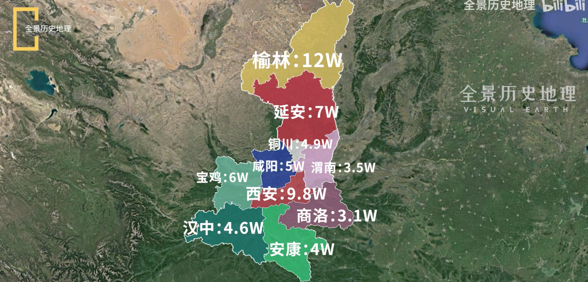

# 排名

## 排名1

北京、上海、重庆、天津、广州、深圳、南京、杭州、武汉、成都

 

四大直辖市：北京、上海、重庆、天津

> 重庆的人均经济一直被诟病，但主城区还是拿得出手的，没有明显短板，近些年发展势头也很好；
>
> 天津虽然经济有掉队迹象，但靠着直辖市优势和吃老本，目前还是可以稳居前十。

两大一线城市：广州、深圳

四大强省会城市：南京、杭州、武汉、成都 

> 武汉目前来看在中部一枝独秀，人均GDP也远高于成都。
>
> 南京虽然经济总量暂不如杭州，但近些年发展迅猛，加上综合区位和历史优势

苏州经济强势无比，工业发达，但城市功能单一，偏科严重

西安综合实力深厚，但是经济短板

其他城市离四大传统一线都有至少10年以上的差距，目前看不到任何迹象。

大都市 + 城市群 的城市发展路线

从政治、经济、人口等综合因素来看，长三角（华东/沪宁杭）＞珠三角（华南/港穗深）＞环渤海（华北/京津沈）≥华中（汉郑长）＞华西（成渝西）

## 排名2

| 排名 | 城市 | 概述                                                         |
| ---- | ---- | ------------------------------------------------------------ |
| 1    | 北京 | 政治&文化中心，世界500强企业总部数量世界第一                 |
| 2    | 上海 | 财政收入跟江苏省并驾齐驱，仅次于广东省                       |
| 3    | 广州 | 贸易之都，广东省会                                           |
| 4    | 深圳 | 中国经济第三大城市，地位不如广州                             |
| 5    | 重庆 | 直辖市，西南老大，人口基数大，发展潜力大，人口规模和城市规模优势明显），第五城实际上是最难排的 |
| 6    | 武汉 | 华中第一大城市，经济规模和战略地位，经济质量不及华东诸城     |
| 7    | 杭州 | 浙江省省会，后劲足，区域好，互联网大厂基地                   |
| 8    | 南京 | 江苏省省会，教育、医疗实力在江苏绝对第一，市区GDP1.4万亿，省内位居第一 |
| 9    | 成都 | 西南中心城市，人口众多，发展潜力大，省内独孤求败             |
| 10   | 天津 | 直辖市，北方第二大城市，GDP总量跌出中国前10，但是体量与底蕴不是一般中等省省会可以匹敌的 |

## 排名3（取前20）

上海、北京、深圳、广州、重庆、苏州（江苏）、成都、杭州（浙江）、武汉、南京（江苏）、

天津、宁波（浙江）、青岛（山东）、无锡（江苏）、长沙、郑州、佛山（广东）、泉州（福建）、济南（山东）、合肥

# 各省杂记

## 1 广东省

- 中国第一经济大省，经济总量占全国的1/8，地区生产总值为124369.67亿元（2021年）
- 广东省下辖21个地级市、65个市辖区、20个县级市、34个县、3个自治县。省会广州市。
  - 广州、深圳、珠海、汕头、佛山、韶关、惠州、中山

### 广州市

### 深圳市

### 珠海市

### 汕头市

### 佛山市

### 惠州市

- 惠城区：经济、政治和文化中心。半城江景半城湖。
  - 惠州西湖就在市区，湖周边就是繁华的城市，东江穿城而过，风景优美，气候宜人。
  - 气候温润。除了潮湿可能需要适应一下，其他方面非常舒适。
  - 位置优势。临着广深莞，四个一线城市惠州靠着两个。
  - 教育资源尤其是中小学资源：一般，只能说和经济水平相适应。
  - https://www.zhihu.com/question/316038790/answer/1000252589

| 类别         | 具体内容                               | 注   |
| ------------ | -------------------------------------- | ---- |
| 定位         | 广东省地级市、Ⅱ型大城市                |      |
| 区划         | 惠城区、惠阳区、惠东县、博罗县和龙门县 |      |
| 人口         | 606万                                  |      |
| 面积         | 11347 km²                              |      |
| 地区生产总值 | 4977.36 亿元(2021年)                   |      |
| 车站         | 惠州站、惠州西站、惠州南站、惠州北站   |      |
| 机场         | 惠州机场                               |      |
| 著名景点     |                                        |      |

### 顺德市

- 美的、海信、碧桂园、格兰仕

### 中山市

- 广东四小虎之一
- 区域特色经济模式，一堆专业镇
- 品牌：欧普照明、乐百氏饮料
- 散装：15个镇8个街道

## 2 江苏省

- 江苏省共辖13个设区市，95个县（市、区），其中19个县、21个县级市、55个市辖区

### 南京市

### 苏州市

### 无锡市

### 徐州市

- 曾叫彭城：西楚霸王项羽的都城，荆楚文化。军事重镇。
- 徐州适合做都城吗？
  - 标准的四战之地（苏鲁豫皖四省交界），既无山川险要之势，又无江河阻隔之便。
- 第一大产业：机械制造。南有三一重工，北有徐工机械。

## 3 山东省

- 山东省辖16个地级市，58个市辖区、26个县级市、52个县

### 济南市

### 青岛市

### 威海市

### 菏泽市

## 4 浙江省

- 浙江省辖11个地级市，37个市辖区、20个县级市、33个县（其中1个自治县）

### 杭州市

### 宁波市

### 嘉兴市

## 5 河南省

### 郑州市

## 6 四川省

### 成都市

## 7 湖北省

### 武汉市

- 大武汉（仅有的2个被冠以大字的城市）
- 武汉就是湖北，湖北就是武汉。
  - 占全省总人口1/5，GDP超1/3，高校总数超1/2。
- 最难修建、成本最高的城市：长江和汉江的存在，11座长江大桥，12座汉江大桥
  - 武汉的长江大桥：桥梁界的天花板
- 高校：汤逊湖、东湖（武大、华科、华师、地大）、南湖（武汉理工大学、民大、中南财经政法、华中农业大学）三个大学城
- 东湖高新区
- 中国米字型铁路枢纽
  - 武汉站（负责高铁）（票价贵）：高铁站。京广高铁，曾中国最美的高铁站。
  - 武昌站（负责普铁）（体验差）：特等站，京广铁路上，全国数一数二的大战（绿皮车和红皮车时代，可达中国所有省会城市）
  - 汉口站（负责动车）（更亲民）：特等站，京广铁路上。取代武昌站，成为武汉客流量最多的火车站。
  - 新规划：新汉阳、武汉东、天河北（武汉天河国际机场附近）三个火车站。四主二辅的铁路枢纽格局

- 满城挖：武汉每天不一样
  - 地铁：2012年开始，平均每年开通一条地铁。国内仅次于上海、北京、广州、成都。城建速度全国前三。

## 8 台湾

## 9 福建省

- 厦门鼓浪屿、武夷山、沙县小吃、晋江鞋厂、莆田医院、宁德时代
- 4187 万、124000 km²
- 区划：福州、泉州、厦门、漳州、三明、莆田、南平、龙岩、宁德9个设区市、平潭综合实验区

### 福州市（省会）

- 论经济，不如泉州。论名气，不如厦门。
- 八山一水一分田。
  - 福建母亲河：闽江。闽江塑造了省会福州。
  - 四周被鼓山、旗山、五虎山和莲花山围住，中间是福州平原（地理空间狭小，被闽江分割地支离破碎，限制城市规划建设）。

- 城市规划用一句话概括：南下东进。闽江北岸是福州老城区，南下指往闽江南岸发展，找到CBD就能找到城市的发展方向，7个CBD，四个在闽江北岸，分别是五四路、金融街（规模最大实力也并不突出）、晋安湖、闽江北；三个在闽江南岸，分别是江南、三江口、滨海新城。
- 道路规划建设困难：福州市区相当于两江三岸，需要大量桥梁来连通，30座左右，和重庆武汉这些“桥梁之都”有的一比。
- 福州南站：中国最尴尬的省会高铁站。左右靠山，前后邻水，犹如一个孤岛，站台规模仅7台14线，省会城市中排名倒数，福州可是“万亿俱乐部”成员。
- 长乐国际机场：距离市区50公里。
- 福州，简称榕，榕树多。森林覆盖率高达58.36%，位居全国省会城市第二（中国最绿，空气质量最好的城市之一）。
- GDP：2020年，泉州和福州GDP双双突破万亿，虽说泉州高于福州但只有不到200亿的优势

### 泉州市

### 厦门市

## 10 湖南省

### 长沙市

## 11 上海

## 12 安徽省

### 合肥市

### 安庆市

- 省会：安庆（政治，人文）、蚌埠（经济，交通）、芜湖、合肥（军事）

### 黄山市

- 以前的徽州

## 13 河北省

### 石家庄市

## 14 北京

## 15 陕西省

- 陕西看上去更像是三个省份：人文地理差异很大的陕北、关中和陕南。分别对应黄土高原、关中平原及秦巴山地各具特色的三大自然区。
- 北京时间，来自陕西。我国版图地理几何中心。西安、黄土高原、黄河、窑洞、肉夹馍、臊子面。
- 位于我国中部黄河中游地区，南部兼跨长江支流汉江流域，形状像英国。

### 西安市

### 宝鸡市

### 榆林市

- 土豪、有钱人、煤老板
- GDP
  - 陕西11市（区），陕北榆林人最富有，人均GDP近12万，比肩一线城市。
  - 第二是省会西安人均8.9万。第三是陕北延安和关中杨凌7W。
  - 陕南三兄弟垫底：汉中4.6W，安康4W，商洛3.1W。
- 神府煤田：我国最大的煤田，世界七大煤田之一。
- 历来为边塞要地。能源拉来的城市。和隔壁的鄂尔多斯被称为“高原双雄”。呼包鄂榆城市群群主。

### 延安市

- 红色之都、瓦窑堡会议、西安事变、论持久战整风运动、南泥湾、中共七大、论联合政府、转战陕北
- 支撑了中国革命最关键的十三年，第二个红色之都（第一个是江西瑞金）
- 山地河谷型城市，受自然地形条件限制，城市化进程缓慢。特别是东北郊的二十里铺机场，严重阻碍了城市的建设。延安选择上山建城，再造一个新延安。
- 延安新区，规划北东西三大片区。北区位于清凉山以北，为新区核心区域。东区位于宝塔山东南，为休闲、旅游、住宅区。西区位于凤凰山西北，为红色旅游核心区。2018年南泥湾机场投入运营，二十里铺机场停止使用。
- 国内如此大规模的填山造城，估计只有延安新区一家。

### 汉中市

- 身在陕西，心在川？
- 人口386 W，面积2.7万平方公里，GDP 1500亿元。
- 西成高铁（2017年，全长658千米）、兰州至汉中至十堰高铁（一座西部交通中心城市在崛起）

### 商洛市

- 综述
  - 因境内有商山、洛水而得名
- 山阳县
  - GDP 171亿、人口36万
- 商州区
  - 151亿、47万
- 洛南县
  - 137亿、37万
- 镇安县
  - 100亿、25万
- 丹凤县
  - 99亿、25万
- 柞水县
  - 97亿、14万
- 商南县
  - 94亿、20万

| 类别         | 具体内容                                                     | 注   |
| ------------ | ------------------------------------------------------------ | ---- |
| 定位         | 陕西省地级市                                                 |      |
| 区划         | 商州区、                                                     |      |
| 人口         | 202万                                                        |      |
| 面积         | 19292 km²                                                    |      |
| 地区生产总值 | 852.29 亿元(2021年)                                          |      |
| 车站         | 商洛站、惠州西站、惠州南站、惠州北站                         |      |
| 机场         | 商洛机场                                                     |      |
| 著名景点     | 金丝峡、柞水溶洞、牛背梁国家森林公园                         |      |
| 特产         | 镇安大板栗、豆腐干、孝义湾柿饼、镇安象园茶、柞水腊肉、板栗、核桃、黑木耳 |      |

## 16 江西省

- 11个地级市
  - 南昌（省会）
  - 赣州、吉安（大块头城市）
  - 萍乡、新余、鹰潭（袖珍城市）
  - 宜春、、上饶、抚州、九江、景德镇
- 降雨丰富、赣江径流量大
- 周边六个省会城市都是“万亿俱乐部”的成员

### 南昌市

- 四大火炉之一
- 襟三江而带五湖，是历代兵家必争之地
- 八一大道：城市的主干道之一
- 教育
  - 仅1所211大学：南昌大学

## 17 重庆

## 18 辽宁省

- 共辖14个地级市

### 沈阳市

### 大连市

### 鞍山市

## 19 云南省

- 云南省辖8个地级市、8个自治州（合计16个地级行政区划单位），17个市辖区、18个县级市、65个县、29个民族自治县（合计129个县级行政区划单位）

### 昆明

### 丽江

## 20 广西省

- 广西壮族自治区行政区划为14个设区市，10个县级市，60个县（含12个民族自治县），41个市辖区

### 南宁市

### 桂林市

## 21 香港

## 22 山西

- 山西省共辖11个地级市，市辖区26个、县级市11个、县80个

### 太原市

### 大同市

### 运城市

## 23 内蒙古

## 24 贵州省

- 辖贵阳、遵义、六盘水、安顺、毕节、铜仁6个地级市，黔东南、黔南、黔西南3个民族自治州。
- 位于中国西南地区，地处云贵平原东部。92.5%为山地和丘陵。理论上来说，贵州不存在平原。
- 贵阳盆地（贵州的地理中心）、安顺盆地。贵阳得名：贵山之阳。

### 贵阳市

- 贵阳市总面积 8034 平方千米，城区面积608 平方千米。
- 三山将城区分割为两大部分。
  - 黔灵山中部有全国最大的棚户区改造项目——花果园。
- 观山湖区（贵阳市政府）：高新技术区
- 老城区（贵州省政府）：科技创新区
- 贵安新区：贵阳市最大的一块平地（贵阳市、安顺市结合部），中国第八个国家级新区，中国南方大数据中心。

### 遵义市

### 安顺市

## 25 新疆

## 26 天津

- 中国北方对外开放的门户，中国北方的航运中心、物流中心和现代制造业基地
- 全市下辖16个区，总面积11966.45平方千米，常住人口1373万人
- 辖16个区，和平区、河东区、河西区、南开区、河北区、红桥区、滨海新区

## 27 黑龙江省

- 黑龙江省共辖12个地级市、1个地区行署；有67个县(市)，其中县级市21个。

### 哈尔滨市

- 位于黑龙江省西南部，黑龙江省省会，副省级市，中国省辖市陆地面积最大的特大城市，古称会宁府、上京、阿勒锦、滨江，素有“冰城”、“东方莫斯科”、“东方小巴黎”之称。

### 齐齐哈尔市

- 位于中国东北松嫩平原，黑龙江省第二大城市，国家重要的装备工业基地、商品粮基地和畜牧业基地。

## 28 吉林省

- 吉林省辖8个地级市、1个自治州，21个市辖区、20个县级市、19个县（其中3个自治县）。

### 长春市

### 吉林市

## 29 甘肃省

- 甘肃省下辖14个市（州），其中有2个民族自治州 [145] ；共有86个县（市、区），其中县57个、自治县7个、县级市5个、市辖区17个。

### 兰州市

### 嘉峪关市

## 30 海南省

## 31 宁夏

## 32 青海省

## 33 西藏

## 34 澳门

