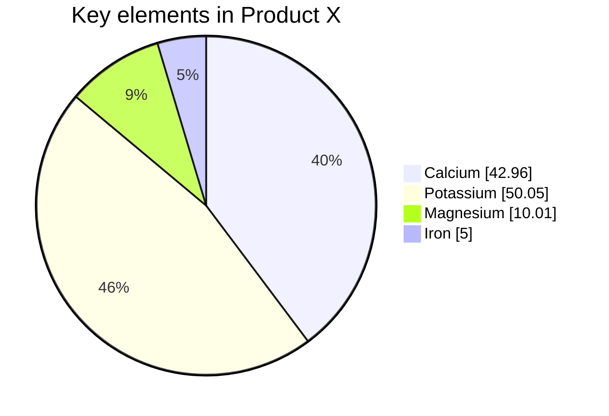

## 基础使用

- 标题 CTRL + n
- 无序列表
- 有序列表
- 引用
- 代码块```
- 行内代码 `
- 表格
- 图片
- 超链接


## 图表

https://mermaid-js.github.io/mermaid/#/


### 饼状图


```mermaid-example
pie showData
    title Key elements in Product X
    "Calcium" : 42.96
    "Potassium" : 50.05
    "Magnesium" : 10.01
    "Iron" :  5
```

