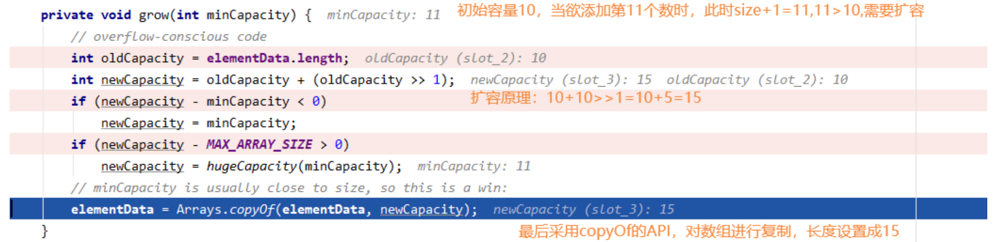
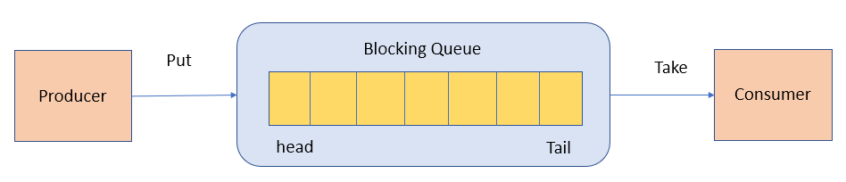
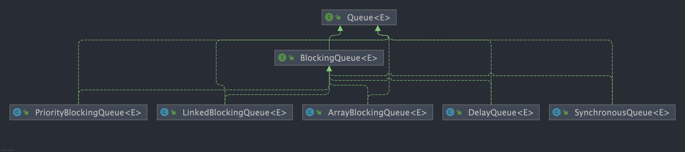
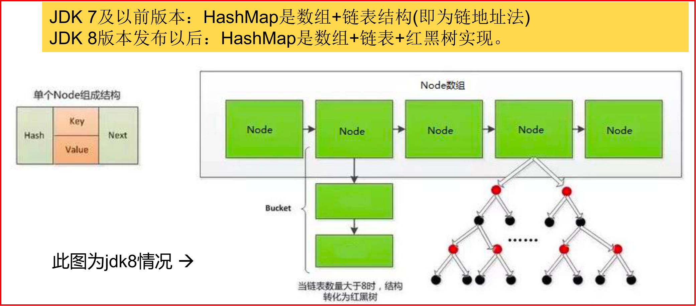
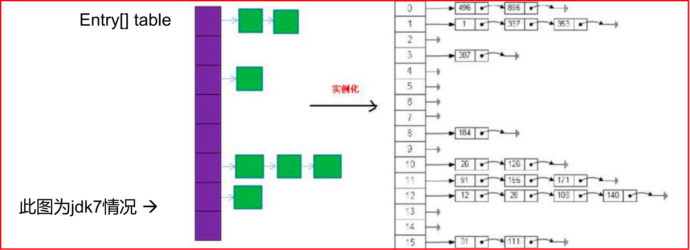
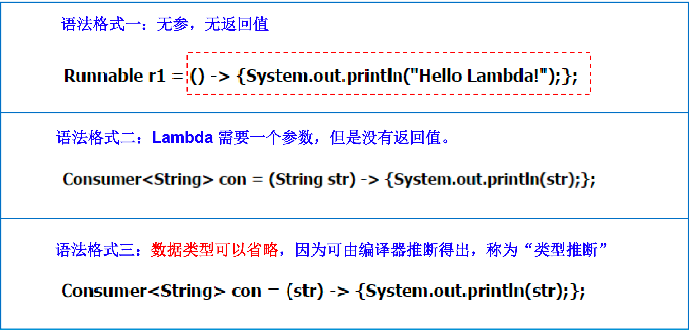
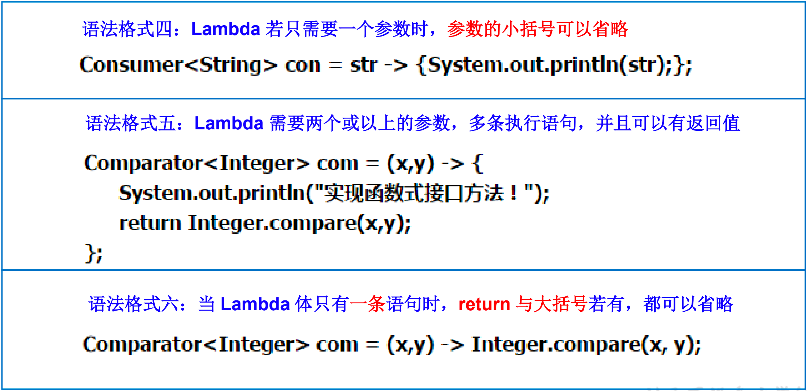

# 写在前面


```bash
# 尚硅谷宋红康课程目录
1.概述
2.Java基本语法
3.数组
4.面向对象（上）
5.面向对象（中）
6.面向对象（下）
7.异常处理
8.多线程
9.Java常用类
10.枚举类与注解
11.Java集合
12.泛型
13.IO流
14.网络编程
15.Java反射机制
16.Java8的其它特性
17.Java9&Java10&Java11新特性
```


# 一、Java基本语法

## 1 [关键字与保留字](https://docs.oracle.com/javase/tutorial/java/nutsandbolts/_keywords.html)


| 分类                 | 关键字   |            |          |              |            |           |        |
| :------------------- | -------- | ---------- | -------- | ------------ | ---------- | --------- | ------ |
| 访问控制             | private  | protected  | public   |              |            |           |        |
| 类，方法和变量修饰符 | abstract | class      | extends  | final        | implements | interface | native |
|                      | new      | static     | strictfp | synchronized | transient  | volatile  | enum   |
| 程序控制             | break    | continue   | return   | do           | while      | if        | else   |
|                      | for      | instanceof | switch   | case         | default    | assert    |        |
| 错误处理             | try      | catch      | throw    | throws       | finally    |           |        |
| 包相关               | import   | package    |          |              |            |           |        |
| 基本类型             | boolean  | byte       | char     | double       | float      | int       | long   |
|                      | short    |            |          |              |            |           |        |
| 变量引用             | super    | this       | void     |              |            |           |        |
| 保留字               | goto     | const      |          |              |            |           |        |


## 2 标识符

```bash
# 命名规范
- 包名：多单词组成时所有字母都小写：xxxyyyzzz
- 类名、接口名：多单词组成时，所有单词的首字母大写：XxxYyyZzz
- 变量名、方法名：多单词组成时，第一个单词首字母小写，第二个单词开始每个单词首字母大写：xxxYyyZzz
- 常量名：所有字母都大写。多单词时每个单词用下划线连接：XXX_YYY_ZZZ
# 更多细节详见《代码整洁之道.pdf》
```


## 3 变量

```bash
# 概念
- 内存中的一个存储区域
- 该区域的数据可以在同一类型范围内不断变化
- 变量是程序中最基本的存储单元。包括变量类型、变量名、存储的值

# 变量的作用
- 用于在内存中保存数据

# 注意
- 使用变量名来访问这块区域的数据
- 在作用域内才有效
# 变量的声明和赋值
```


### 3.1 变量的分类

#### 按数据类型

对于每一种数据都定义了明确的具体数据类型（强类型语言），在内存中分配了不同大小的内存空间。


#### 按声明的位置

方法体外类体内声明的变量称为成员变量。 

方法体内部声明的变量称为局部变量。


### 3.2 整数类型（4种）✔

```bash
- Java各整数类型有固定的表数范围和字段长度，不受具体OS的影响，以保证java程序的可移植性。
- java的整型常量默认为 int 型，声明long型常量须后加‘l’或‘L’
- java程序中变量通常声明为int型，除非不足以表示较大的数，才使用long
```


| 类型  | 占用存储空间 | 表数范围                                          | 默认值 |
| ----- | ------------ | ------------------------------------------------- | ------ |
| byte  | 1字节=8bit位 | -128 ~ 127                                        | 0      |
| short | 2字节        | -32768 ~ 32767                                    | 0      |
| int   | 4字节        | -2^31 ~ 2^31-1 (-2147483648 ~ 2147483647、约21亿) | 0      |
| long  | 8字节        | -2^63 ~ 2^63-1                                    | 0L     |

>  Ps：
>
>  - bit：计算机中的最小存储单位。
>
>  - byte：计算机中基本存储单元。


### 3.3 浮点类型（2种）✔

- 与整数类型类似，Java 浮点类型也有固定的表数范围和字段长度，不受具体操作系统的影响。

- 浮点型常量有两种表示形式：

  - 十进制数形式。如，5.12 512.0f .512 (必须有小数点）


  - 科学计数法形式。如，5.12e2 512E2 100E-2


- Java 的浮点型常量默认为 `double` 型，声明 float 型常量，须后加 ‘f’ 或 ‘F’ 。

| 类型          | 占用存储空间  | 表数范围                          | 默认值 | 注                                                        |
| ------------- | ------------- | --------------------------------- | ------ | --------------------------------------------------------- |
| float 单精度  | 4字节=32bit位 | 1.4E-45 ~ 3.4028235E38            | 0f     | 尾数可以精确到7位有效数字。很多情况下，精度很难满足需求。 |
| double 双精度 | 8字节         | 4.9E-324 ~ 1.7976931348623157E308 | 0d     | 精度是float的两倍。**通常采用此类型**。                   |


### 3.4 字符类型char（1种）✔

| 类型   | 占用存储空间 | 表数范围  | 默认值  |
| ------ | ------------ | --------- | ------- |
| `char` | 2字节        | 0 ~ 65535 | 'u0000' |


### 3.5 布尔类型boolean（1种）✔

| 类型      | 占用存储空间 | 表数范围    | 默认值 |
| --------- | ------------ | ----------- | ------ |
| `boolean` | 1位          | true、false | false  |

Java虚拟机中没有任何供 boolean 值专用的字节码指令，Java语言表达所操作的 boolean 值，在编译之后都使用java虚拟机中的 `int` 数据类型来代替：`true` 用1表示，`false` 用0表示。———《java虚拟机规范 8版》


- Java 的每种基本类型所占存储空间的大小不会像其他大多数语言那样随机器硬件架构的变化而变化。这种所占存储空间大小的不变性是 Java 程序比用其他大多数语言编写的程序更具可移植性的原因之一（《Java 编程思想》2.2 节有提到）。

- 这八种基本类型都有对应的包装类分别为：`Byte`、`Short`、`Integer`、`Long`、`Float`、`Double`、`Character`、`Boolean` 。

  - 包装类型不赋值就是 `Null` ，而基本类型有默认值且不是 `Null`。

  - 从 JVM 层面来分析。基本数据类型直接存放在 Java 虚拟机**栈中的局部变量表中**，而包装类型属于对象类型，我们知道对象实例都存在于**堆**中。相比于对象类型， 基本数据类型占用的空间非常小。

  - > 《深入理解 Java 虚拟机》 ：局部变量表主要存放了编译期可知的基本数据类型 **（boolean、byte、char、short、int、float、long、double）**、**对象引用**（reference 类型，它不同于对象本身，可能是一个指向对象起始地址的引用指针，也可能是指向一个代表对象的句柄或其他与此对象相关的位置）。


### 3.6 基本数据类型转换

#### 自动类型转换

容量小的类型自动转换为容量大的数据类型。数据类型按容量大小排序为


- byte,short,char之间不会相互转换，他们三者在计算时首先转换为 int 类型。

- 当把任何基本数据类型的值和字符串(String)进行连接运算时(+)，基本数据类型的值将自动转化为字符串(String)类型。

### 3.7 字符串类型String

String不是基本数据类型，属于引用数据类型

### 3.8 强制类型转换

字符串不能直接转换为基本类型，但通过基本类型对应的包装类则可以实现把字符串转换成基本类型。 

```java
String a = "43"; 
int i = Integer.parseInt(a);
```

### 3.9 二进制

所有数字在计算机底层都以**二进制**形式存在。 

对于整数，有四种表示方式：

- 二进制(binary)：0,1 ，满2进1，以0b或0B开头。

- 十进制(decimal)：0-9 ，满10进1。

- 八进制(octal)：0-7 ，满8进1， 以数字0开头表示。

- 十六进制(hex)：0-9及A-F，满16进1， 以0x或0X开头表示。此处的A-F不区分大小写。如：0x21AF +1= 0X21B0

<br>

计算机以二进制补码的形式保存所有的整数。

- 正数的原码、反码、补码都相同
- 负数的补码是其反码+1

Java整数常量默认是int类型，当用二进制定义整数时，其第32位是符号位；当是long类型时，二进制默认占64位，第64位是符号位。


## 4 运算符

### 算术运算符

### 赋值运算符

### 比较运算符（关系运算符）

比较运算符 == 不能误写成 = 


### 逻辑运算符

| 符号 | 说明                 | 注          |
| ---- | -------------------- | ----------- |
| &    | 与，全true则true     | && 短路与   |
| \|   | 或，有一个true则true | \|\| 短路或 |
| !    | 非                   |             |
| ^    | 异或                 |             |


### 位运算符

位运算是直接对整数的二进制进行的运算

| 运算符 | 运算       | 示例 | 细节                                            |
| ------ | ---------- | ---- | ----------------------------------------------- |
| <<     | 左移       |      |                                                 |
| >>     | 右移       |      |                                                 |
| >>>    | 无符号右移 |      |                                                 |
| &      | 与运算     |      | 二进制位进行&运算，只有1&1时结果是1，否则是0;   |
| \|     | 或运算     |      | 二进制位进行\|运算，只有0\|0时结果是0，否则是1; |
| ^      | 异或运算   |      |                                                 |
| ~      | 取反运算   |      |                                                 |


### 三元运算符

 (条件表达式) ? 表达式1：表达式2；

三元运算符与if-else的联系与区别：

- 三元运算符可简化if-else语句

- if后的代码块可有多个语句


## 5 程序流程控制

### 顺序

程序从上到下逐行地执行，中间没有任何判断和跳转。

### 分支

根据条件，选择性地执行某段代码。

有if…else和switch-case两种分支语句。

#### if-else

#### switch-case

```java
String season = "summer";
switch (season) {
case "spring":
		System.out.println("春暖花开");
		break;
case "summer":
		System.out.println("夏日炎炎");
		break;
case "autumn":
		System.out.println("秋高气爽");
		break;
case "winter":
		System.out.println("冬雪皑皑");
		break;
default:
		System.out.println("季节输入有误");
		break; 
}
```

break语句用来在执行完一个case分支后使程序跳出switch语句块；如果没有break，程序会顺序执行到switch结尾（case穿越）

default子句是**可任选的**。同时，位置也是灵活的。当没有匹配的case时，执行default

```java
// 编写程序：从键盘上输入2019年的“month”和“day”，要求通过程序输出输入的日期为2019年的第几天。

```


```java
// CTJ

Session session = getSession();
//获取角色所属租户ID
long tenantId;
switch (roleCate) {
    case CommonCateEnum.TENANT:
        tenantId = session.getTenantId();
        break;
    case CommonCateEnum.PUBLIC:
        tenantId = 0L;
        break;
    case CommonCateEnum.ADMIN:
        tenantId = 0L;
        orgTypeId = "0";
        break;
    default:
        logger.error("getRoleListWithOrgType()-----> 无效的角色分类");
        throw new InvalidParamException("无效的角色分类");
}
```


### 循环

根据循环条件，重复性的执行某段代码。

有while、do…while、for三种循环语句。

注：JDK1.5提供了foreach循环，方便的遍历集合、数组元素。

循环语句的四个组成部分：

- 初始化部分(init_statement)
- 循环条件部分(test_exp) 
- 循环体部分(body_statement) 
- 迭代部分(alter_statement)

#### for循环

#### while循环

注意不要忘记声明④迭代部分。否则，循环将不能结束，变成死循环。 

for循环和while循环可以相互转换

```java
①初始化部分
while(②循环条件部分)｛
	③循环体部分
	④迭代部分
}
```

#### do-while循环

```java
①初始化部分;
do{
	③循环体部分
	④迭代部分
}while(②循环条件部分);
```


do-while循环至少执行一次循环体。

#### 嵌套循环（多重循环）

设外层循环次数为m次，内层为n次，则内层循环体实际上需要执行m*n次。


#### 特殊关键字的使用：break、continue

break语句用于终止某个语句块的执行。只能用于switch语句和循环语句中。

continue只能使用在循环结构中。用于跳过其所在循环语句块的一次执行，继续下一次循环。

二者功能类似，但continue是终止本次循环，break是终止本层循环。

<br>

return：并非专门用于结束循环的，它的功能是结束一个方法。当一个方法执行到一个return语句时，这个方法将被结束。


# 二、数组

## 1 概述

- 常见概念：数组名、下标（或索引）、元素、数组的长度
- 数组本身是**引用数据类型**，而数组中的元素可以是任何数据类型，包括基本数据类型和引用数据类型。
- 创建数组对象会在内存中开辟**一整块连续的空间**，而数组名中引用的是这块连续空间的首地址。
- 数组的**长度一旦确定，就不能修改**。 
  - 如果程序运行中需要经常扩展数组的大小，应该使用另一种数据结构——数组列表（array list）。

- 我们可以直接通过下标(或索引)的方式调用指定位置的元素，速度很快。


## 2 一维数组的使用

### 声明和初始化

```java
// （1）动态初始化：数组声明且为数组元素分配空间与赋值的操作分开进行
int[] arr1 = new int[10];

for (int i = 0; i < arr1.length; i++) {
  arr1[i] = i;
}

// （2）静态初始化：定义数组的同时就分配空间并赋值
int[] arr = new int[]{1,2,3,4,5};

// 简写形式
int[] smallPrimes = {2, 3, 5, 7, 11, 13};

// 匿名数组
int[] a;
a = new int[] {17, 19, 23, 29};
```


- 数组本身属于引用数据类型，那么一定可以发生引用传递，引用传递的本质是：同一块堆内存空间可以被不同的栈内存所指向。

- 若采用动态初始化开辟空间后，数组里面的每一个元素都是该数组对应数据类型的默认值

- 数组的访问：类似于`C/C++`语言访问形式，数组下标从0开始。超过了数组的索引范围，会产

  生`java.lang.ArrayIndexOutOfBoundsException` 异常信息；

- 数组的数组就是二维数组。


### 数组元素的引用（访问数组元素）

- 数组名 [数组元素下标]
- 注意 `array index out of bounds` 异常

### 数组元素的默认初始化值

- 数组是引用类型，它的元素**相当于类的成员变量**，因此数组一经分配空间，其中的每个元素也被按照成员变量同样的方式被隐式初始化。

- **对于基本数据类型而言，默认初始化值各有不同，对于引用数据类型而言，默认初始化值为null(注意与0不同！)**

### for each循环

- 处理一个集合中的所有元素
- 很多情况下还是需要使用传统的for循环，如不希望遍历整个集合，或者在循环内部需要使用下标值。
- 对于打印数组中的所有值：可以使用Arrays类的toString方法。
  - Arrays.toString(a)返回一个包含数组元素的字符串，如"[2, 3, 5, 7, 11, 13]"

### 数组拷贝

- 允许将一个数组变量拷贝到另一个数组变量。这时，两个变量将引用同一个数组。
- 如果希望将一个数组的所有值拷贝到一个新的数组中，就要使用Arrays类的copyOf方法

```java
// 两个变量引用同一个数组
int[] luckNumbers = smallPrimes;

// 拷贝到新数组
// 参数2：新数组的长度，这个方法通常用来增加数组的大小
int[] copiedLuckyNumbers = Arrays.copyOf(luckNumbers, 2 * luckNumbers.length);
```

### 命令行参数

- String[] arg 参数表示main方法接收一个字符串数组

### 数组排序

- 对数值型数组排序，可以使用`Arrays`类的sort方法
  - 这个方法使用了优化的快速排序（QuickSort）算法

- Arrays类还提供了另外一些很便捷的方法


## 3 多维数组的使用

- 可以使用嵌套的for（for each）循环访问多维数组中的元素

- 要想快速打印一个二维数组的数据元素列表，可以调用

```java
System.out.println(Arrays.deepHashCode(a));
```


## 4 数组常见算法

## 5 Arrays工具类使用

java.util.Arrays类即为操作数组的工具类，包含了用来操作数组（比如排序和搜索）的各种方法。


## 6 数组使用中的常见异常

数组脚标越界异常(ArrayIndexOutOfBoundsException)

空指针异常(NullPointerException)


# 三、面向对象

```bash
# Java核心技术卷1第四章

面向对象程序设计概述
使用预定义类
用户自定义类
静态字段与静态方法
方法参数
对象构造
包
JAR文件
文档注释
类设计技巧
```


## 1 面向对象OOP和面向过程POP

- 面向过程，**强调的是功能行为，以函数为最小单位，考虑怎么做**。

- 面向对象，将功能封装进对象，**强调具备了功能的对象，以类/对象为最小单位，考虑谁来做**。
- 两者的主要区别在于解决问题的方式不同
  - 面向过程把解决问题的过程拆成一个个方法，通过一个个方法的执行解决问题。
  - 面向对象会先抽象出对象，然后用对象执行方法的方式解决问题。
  - 另外，面向对象开发的程序一般更易维护、易复用、易扩展。

- 面向对象的三大特征：

  - 封装 (Encapsulation)


  - 继承 (Inheritance)


  - 多态 (Polymorphism)


## 2 类 (Class) 和对象(Object)（面向对象的核心概念）

- 类是对一类事物的描述，是构造对象的模板或蓝图。
  - 由类构造（construct）对象的过程称为创建类的实例（instance）

  - 标准Java库提供了几千个类，我们也可以根据需要创建一些自己的类。

  - 类之间的关系有：
    - 依赖（"uses-a"）：一个类的方法使用或操作另一个类的对象

    - 聚合（"has-a"）：如一个Order对象包含一些Item对象

    - 继承（"is-a"）：一个更特殊的类与一个更一般的类之间的关系

- 对象是实际存在的该类事物的每个个体，因而也称为实例(instance)。

- 封装（Encapsulation，有时称为数据隐藏）：将程序和行为组合在一个类中，并对对象的使用者隐藏具体的实现方式。
  - 实现封装的关键在于只能通过对象的方法与对象数据进行交互。
  - 封装给对象赋予了黑盒特征，这是提高重用性和可靠性的关键

- 继承(Inheritance)：可以通过扩展其它类来构建新类。事实上，所有的类都源自Object类。
  - 扩展后的新类具有被扩展的类的全部属性和方法。


万事万物皆对象


```java
import java.time.*;

/**
 * This program tests the Employee class.
 * @version 1.13 2018-04-10
 * @author Cay Horstmann
 */
public class EmployeeTest
{
   public static void main(String[] args)
   {
      // fill the staff array with three Employee objects
      Employee2[] staff = new Employee2[3];

      staff[0] = new Employee2("Carl Cracker", 75000, 1987, 12, 15);
      staff[1] = new Employee2("Harry Hacker", 50000, 1989, 10, 1);
      staff[2] = new Employee2("Tony Tester", 40000, 1990, 3, 15);

      // raise everyone's salary by 5%
      for (Employee2 e : staff)
         e.raiseSalary(5);

      // print out information about all Employee objects
      for (Employee2 e : staff)
         System.out.println("name=" + e.getName() + ",salary=" + e.getSalary() + ",hireDay=" 
            + e.getHireDay());
   }
}

class Employee2
{
   private String name;
   private double salary;
   private LocalDate hireDay;

   public Employee2(String n, double s, int year, int month, int day)
   {
      name = n;
      salary = s;
      hireDay = LocalDate.of(year, month, day);
   }

   public String getName()
   {
      return name;
   }

   public double getSalary()
   {
      return salary;
   }

   public LocalDate getHireDay()
   {
      return hireDay;
   }

   public void raiseSalary(double byPercent)
   {
      double raise = salary * byPercent / 100;
      salary += raise;
   }
}

```


- 使用null 引用
  - 如果对null值应用一个方法，会产生一个NullPointException异常。

- 隐式参数与显式参数
  - raiseSalary 方法有两个参数：第一个称为隐式参数，是出现在方法名前的Employee2类型的参数。第二个是显式参数，列在方法声明中。

```java
   public void raiseSalary(double byPercent)
   {
      double raise = salary * byPercent / 100;
      salary += raise;
   }
```

可以改写如下：

```java
   public void raiseSalary(double byPercent)
   {
      double raise = this.salary * byPercent / 100;
      this.salary += raise;
   }
```


- 基于类的访问权限
  - 一个方法可以访问所属类的所有对象的私有数据。

- 私有方法
  - 只要方法是私有的，类的设计者就可以确信它不会在别处使用，所以可以随时将其删去。

- final实例字段
  - 必须在构造对象时初始化。即确保每一个构造器执行之后这个字段的值已经设置，并且之后不能再修改这个字段。


- 常见的类关系：泛化=实现>组合>聚合>关联>依赖


### 对象的创建和使用

JVM部分内容

### 类成员一：属性field

```bash
# 修饰符 数据类型 属性名 = 初始化值 ;
- 常用的权限修饰符有：private、缺省、protected、public
```


成员变量（属性）和局部变量的区别？


### 类成员二：方法method

方法是类或对象行为特征的抽象，用来完成某个功能操作。在某些语言中也称为函数或过程。

将功能封装为方法的目的是，可以**实现代码重用，简化代码**。

#### 内存解析

#### 方法的重载（overload）

在同一个类中，允许存在一个以上的同名方法，只要它们的**参数个数或者参数类型不同即可**。

与返回值类型无关，只看参数列表，且参数列表必须不同。(参数个数或参数类型)。调用时，根据方法参数列表的不同来区别。

#### 可变个数的形参

JavaSE 5.0 中提供了Varargs(variable number of arguments)机制，允许直接定义能和多个实参相匹配的形参。从而，可以用一种更简

单的方式，来传递个数可变的实参。

```bash
# JDK 5.0以前：采用数组形参来定义方法，传入多个同一类型变量
public static void test(int a ,String[] books);
# JDK5.0：采用可变个数形参来定义方法，传入多个同一类型变量
public static void test(int a ,String…books);
```

声明格式：方法名(参数的类型名 ...参数名)

在一个方法的形参位置，最多只能声明一个可变个数形参。方法的参数部分有可变形参，需要放在形参声明的最后。

#### 方法参数的 [ 值 ]传递机制


Java里方法的参数传递方式只有一种：值传递。 即将实际参数值的副本（复制品）传入方法内，而参数本身不受影响。

- 形参是基本数据类型：将实参基本数据类型变量的“数据值”传递给形参

- 形参是引用数据类型：将实参引用数据类型变量的“地址值”传递给形参


Java 中对方法参数能做什么和不能做什么？

- 不能修改基本数据类型的参数
  - 试图将一个数值参数的值增加三倍，不会成功
- 能改变对象参数的状态
  - 成功将一个员工的工资增加三倍
- 不能让一个对象参数引用一个新的对象
  - swap方法交换失败
  - 方法结束时参数变量x和y被丢弃了，原来的变量a和b仍然引用调用之前所引用的对象。


#### 递归(recursion)方法

递归方法：一个方法体内调用它自身。

递归一定要向已知方向递归，否则这种递归就变成了无穷递归，类似于死循环。


#### 方法的重写（override/overwrite）


在子类中可以根据需要对从父类中继承来的方法进行改造，也称为方法的重置、覆盖。在程序执行时，子类的方法将覆盖父类的方法。

要求

- 子类方法抛出的异常不能大于父类被重写方法的异常

注意

- 子类与父类中同名同参数的方法必须同时声明为非static的(即为重写)，或者同时声明为static的（不是重写）。因为static方法是属于

  类的，子类无法覆盖父类的方法。


### 类成员三：构造器（构造方法）

```java
public Employee2(String n, double s, int year, int month, int day)
{
  name = n;
  salary = s;
  hireDay = LocalDate.of(year, month, day);
}
```

#### 作用

创建对象，给对象进行初始化（定义对象的初始状态）。

#### Java提供了多种编写构造器的机制

##### （1）重载

多个方法有相同的名字、不同的参数便出现了重载。

编译器挑选具体调用哪个方法。

##### （2）默认字段初始化

如果构造器中没有显式地为字段设置初值，那么就会被自动地赋为默认值：数值为`0`、布尔值为 `false`、对象引用为 `null`。

##### （3）无参的构造器

仅当类没有任何其它构造器的时候，你才会得到一个默认的无参构造器。

建议提供其它构造器的时候，提供一个无参数的构造器。

##### （4）显式字段初始化

直接为字段赋值

##### （5）关于参数名的建议

参数变量会屏蔽同名的实例字段。但是可以使用this.x访问实例字段。

```java
   public Employee(String name, double salary) {
      this.name = name;
      this.salary = salary;
   }
```

##### （6）调用另一个构造器

关键字this指示一个方法的隐式参数。

不过，这个关键字还有另外一个含义。即调用同一个类的另一个构造器。

##### （7）初始化块

初始化数据字段的方法：

- 构造器中设置值
- 声明中赋值
- 初始化块
  - 一个类的声明中，可以包含任意多个代码块。
  - 只要构造这个类的对象，这些块就会被执行。

#### 注意

- Java语言中，每个类都至少有一个构造器

- 一旦显式定义了构造器，则系统**不再**提供默认构造器

- 一个类可以创建多个**重载**的构造器

- 父类的构造器不可被子类继承


### 类成员四：代码块(或初始化块)

#### 作用：对Java类或对象进行初始化

#### 分类

一个类中代码块若有修饰符，则只能被static修饰，称为**静态代码块**(static block)，没有使用static修饰的，为**非静态代码块。**

static代码块通常用于初始化static的属性

|      | static静态代码块                                             | 非静态代码块                                             |
| ---- | ------------------------------------------------------------ | -------------------------------------------------------- |
|      | 可以有输出语句                                               | 可以有输出语句                                           |
|      | 可以对类的属性、类的声明进行初始化操作                       | 可以对类的属性、类的声明进行初始化操作                   |
|      | 不可以对非静态的属性初始化。即：不可以调用非静态的属性和方法。 | 除了调用非静态的结构外，还可以调用静态的变量或方法。     |
|      | 若有多个静态的代码块，那么按照从上到下的顺序依次执行。       | 若有多个非静态的代码块，那么按照从上到下的顺序依次执行。 |
|      | 静态代码块的执行要先于非静态代码块。                         |                                                          |
|      | 静态代码块随着类的加载而加载，且只执行一次                   | 每次创建对象的时候，都会执行一次。且先于构造器执行。     |


```bash
# 程序中成员变量赋值的执行顺序
声明成员变量的默认初始化
显式初始化、多个初始化块依次被执行（同级别下按先后顺序执行）
构造器再对成员进行初始化操作
通过”对象.属性”或”对象.方法”的方式，可多次给属性赋值
```


### 四种访问权限修饰符


## 3 面向对象特征1：封装和隐藏（好处是什么？需要补充）

我们程序设计追求“高内聚，低耦合”。

- 高内聚 ：类的内部数据操作细节自己完成，不允许外部干涉；

- 低耦合 ：仅对外暴露少量的方法用于使用。 


隐藏对象内部的复杂性，只对外公开简单的接口。便于外界调用，从而提高系统的可扩展性、可维护性。通俗的说，**把该隐藏的隐藏起**

**来，该暴露的暴露出来。这就是封装性的设计思想**。

<br>

Java中通过将数据声明为私有的(private)，再提供公共的（public）方法**getXxx()和setXxx()** 实现对该属性的操作，以实现下述目的：

- 隐藏一个类中不需要对外提供的实现细节。改变内部实现不会影响其它代码。

- 使用者只能通过事先定制好的方法来访问数据，可以方便地加入控制逻辑，限制对属性的不合理操作。可以完成错误检查。


## 4 this的使用

在Java中，this关键字比较难理解，它的作用和其词义很接近。

- 它在方法内部使用，即这个方法所属对象的引用
- 它在构造器内部使用，表示该构造器正在初始化的对象

this 可以调用类的属性、方法和构造器

什么时候使用this关键字呢？

- 当在方法内需要用到调用该方法的对象时，就用this。

- 具体的：我们可以用this来区分属性和局部变量。比如：this.name = name

使用this，调用属性、方法


## 5 package和import的使用

- package语句作为Java源文件的第一条语句，指明该文件中定义的类所在的包。(若缺省该语句，则指定为无名包)。

MVC是常用的设计模式之一，将整个程序分为三个层次：视图模型层，控制器层，与数据模型层。

```bash
1. java.lang----包含一些Java语言的核心类，如String、Math、Integer、 System和Thread，提供常用功能
2. java.net----包含执行与网络相关的操作的类和接口。
3. java.io ----包含能提供多种输入/输出功能的类。
4. java.util----包含一些实用工具类，如定义系统特性、接口的集合框架类、使用与日期日历相关的函数。
5. java.text----包含了一些java格式化相关的类
6. java.sql----包含了java进行JDBC数据库编程的相关类/接口
7. java.awt----包含了构成抽象窗口工具集（abstract window toolkits）的多个类。
- 这些类被用来构建和管理应用程序的图形用户界面(GUI)。 B/S C/S
```

- import 语句告诉编译器去哪寻找类。


## 6 面向对象特征2：继承（inheritance）

```bash
# Java 核心技术卷1 第五章 继承

1 类、超类和子类
2 Object：所有类的超类
3 泛型数组列表
4 对象包装器和自动装箱
5 参数数量可变的方法
6 枚举类
7 反射
8 继承的设计技巧

继承的基本思想是，可以基于已有的类创建新的类。
反射是指在程序运行期间更多地了解类及其属性的能力。
```


### 定义子类

- 使用关键字 `extends` 表示继承

```java
// Manager 称为子类（派生类），Employee 称为父类（基类或超类）。
public class Manager extends Employee {
		added methods and fields
}
```

- 继承后：成员变量、成员方法的访问特点
  - 就近原则：子类有找子类、子类没有找父类、父类没有就报错。
  - 如果子父类中，出现了重名的成员，会优先使用子类的，此时如果一定要在子类中使用父类的怎么办

```java
格式：super.父类成员变量/父类成员方法
```

- 子类不能直接访问父类中私有的即 private 的成员变量和方法。


### 覆盖方法

- 指子类中提供一个新的方法来覆盖（override）超类中的方法

- 如果希望调用超类中的方法而不是当前类的方法
  - 使用关键字 **super** 调用超类的方法


### 子类构造器

```java
public Manager(String name, double salary, int year, int month, int day)
{
    super(name, salary, year, month, day);
    bonus = 0;
}
```

- Manager 类的构造器不能访问 Employee类的私有字段，所以必须使用一个构造器来初始化这些私有字段。利用特殊的 super 语法调用这个构造器。
  - 使用 super 调用构造器的语句必须是子类构造器的第一条语句。
- 继承后：子类构造器的特点
  - 子类中所有的构造器默认都会先访问父类中无参的构造器，再执行自己。
    - 如果子类构造器中既未显式调用父类或本类的构造器，且父类中又没有无参的构造器，则**编译出错**。

```bash
# 为什么？
子类在初始化的时候，有可能会使用到父类中的数据，如果父类没有完成初始化，子类将无法使用父类的数据。
子类初始化之前，一定要调用父类构造器先完成父类数据空间的初始化。

# 怎么调用父类构造器的？
子类构造器的第一行语句默认都是：super()，不写也存在。
```


### 继承层次

- Java 支持单继承和多层继承，不允许多重继承，但提供了一些类似多重继承的功能。
  - 一个子类只能有一个直接父类
  - 一个父类可以派生出多个子类（继承层次）
  - 所有的类都是Object类的子类

### 强制类型转换

- 一个良好的程序设计习惯
  - 进行强制类型转换之前，先使用 instanceof 操作符判断是否能够成功转换。
- 总结一下
  - 只能在继承层次内进行强制类型转换
  - 在超类强制转换成子类之前，应该使用 instanceof 进行检查


### 受保护访问（4个访问控制修饰符）

- 仅本类可见——private
- 对外部完全可见——public
- 对本包和所有子类可见——protected
- 对本包可见——默认，不需要修饰符


### 作用（复用、扩展、多态前提）

- 减少了代码冗余，提高了代码的复用性。
- 更有利于功能的扩展，子类更强大。
- 让类与类之间产生了关系，提供了多态的前提。


## 7 super（调用父类中的属性/方法/构造器）

```java
   public double getSalary()
   {
      double baseSalary = super.getSalary();
      return baseSalary + bonus;
   }
```


- 用于访问父类中定义的属性
- 用于调用父类中定义的成员方法（如上）
- 用于在子类构造器中调用父类的构造器


## 8 面向对象特征3：多态(Polymorphism)

- 是指父类的引用指向子类的对象。
  - 子类可看做是特殊的父类，所以父类类型的引用可以指向子类的对象：向上转型 upcasting
  - 一个 Employee 类型的变量既可以引用一个Employee类型的对象，也可以引用 Employee类的任何一个子类的对象。

```java
Manager boss = new Manager(...);
Employee[] staff = new Employee[3];
staff[0] = boss;
```


- Java引用变量有两个类型：**编译时类型和运行时类型**。
  - 编译时类型由声明该变量时使用的类型决定，运行时类型由实际赋给该变量的对象决定。简称：**编译时，看左边；运行时，看右边**。

- 若编译时类型和运行时类型不一致，就出现了对象的多态性(Polymorphism)。多态情况下：
  - 看左边：看的是父类的引用（父类中不具备子类特有的方法） 
  - 看右边：看的是子类的对象（实际运行的是子类重写父类的方法）


- 作用：提高了代码的通用性，常称作接口重用。


## 9 Object类（所有Java类的根父类）

| NO.  | 方法名称                          | 类型 | 描述           |
| ---- | --------------------------------- | ---- | -------------- |
| 1    | public Object()                   | 构造 | 构造器         |
| 2    | public boolean equals(Object obj) | 普通 | 对象比较       |
| 3    | public int hashCode()             | 普通 | 取得Hash码     |
| 4    | public String toString()          | 普通 | 对象打印时调用 |

Object 类是一个特殊的类，是所有类的父类。它主要提供了以下 11 个方法：

```java
public final native Class<?> getClass()//native方法，用于返回当前运行时对象的Class对象，使用了final关键字修饰，故不允许子类重写。

public native int hashCode() //native方法，用于返回对象的哈希码，主要使用在哈希表中，比如JDK中的HashMap。
public boolean equals(Object obj)//用于比较2个对象的内存地址是否相等，String类对该方法进行了重写用户比较字符串的值是否相等。

protected native Object clone() throws CloneNotSupportedException//naitive方法，用于创建并返回当前对象的一份拷贝。一般情况下，对于任何对象 x，表达式 x.clone() != x 为true，x.clone().getClass() == x.getClass() 为true。Object本身没有实现Cloneable接口，所以不重写clone方法并且进行调用的话会发生CloneNotSupportedException异常。

public String toString()//返回类的名字@实例的哈希码的16进制的字符串。建议Object所有的子类都重写这个方法。

public final native void notify()//native方法，并且不能重写。唤醒一个在此对象监视器上等待的线程(监视器相当于就是锁的概念)。如果有多个线程在等待只会任意唤醒一个。

public final native void notifyAll()//native方法，并且不能重写。跟notify一样，唯一的区别就是会唤醒在此对象监视器上等待的所有线程，而不是一个线程。

public final native void wait(long timeout) throws InterruptedException//native方法，并且不能重写。暂停线程的执行。注意：sleep方法没有释放锁，而wait方法释放了锁 。timeout是等待时间。

public final void wait(long timeout, int nanos) throws InterruptedException//多了nanos参数，这个参数表示额外时间（以毫微秒为单位，范围是 0-999999）。 所以超时的时间还需要加上nanos毫秒。

public final void wait() throws InterruptedException//跟之前的2个wait方法一样，只不过该方法一直等待，没有超时时间这个概念

protected void finalize() throws Throwable { }//实例被垃圾回收器回收的时候触发的操作
```


### Object类型的变量

- 可以使用Object 类型的变量引用任何类型的对象
  - Java 中只有基本类型不是对象，如数值、字符和布尔类型的值
  - 所有的数组，不管是对象数组还是基本类型的数组都扩展了Object 类


### equals方法


```java
# java.util.Arrays
// 如果两个数组长度相同，并且在对应位置上数据元素也相同，将返回 true  
static boolean equals(xxx[] a, xxx[] b)  
  
# java.util.Objects
// a和b都为null返回true,其中之一为null返回false,否则返回a.equals(b)
static boolean equals(Object a, Object b)  
```


### toString方法

- 返回表示对象的一个字符串。
- 数组继承了Object类的toString方法，建议使用静态方法 Arrays.toString 打印字符串。多维数组则调用Arrays.deepToString

- 建议为自定义的每一个类添加 toString 方法


## 10 final 类和方法

final 关键字是最终的意思，可以修饰（方法，变量，类）

- 修饰方法：表明该方法是最终方法，**不能被重写**。
- 修饰变量：表示该变量第一次赋值后，**不能再次被赋值(有且仅能被赋值一次)**。
- 修饰类：表明该类是最终类，**不能被继承（不允许扩展）**。

<br>

final修饰变量的区别

- final修饰的变量是基本类型：那么**变量存储的数据值**不能发生改变。

- final修饰的变量是引用类型：那么**变量存储的地址值**不能发生改变，但是地址指向的对象内容是可以发生变化的。


## 11 包装类Wrapper的使用

针对八种基本数据类型定义相应的引用类型，即包装类（封装类）

### 自动装箱和拆箱

 **JDK1.5**之后，支持自动装箱，自动拆箱。但类型必须匹配。

- 装箱：自动将基本类型⽤它们对应的引⽤类型包装起来。

- 拆箱：自动将包装类型转换为基本数据类型。

[参考](https://www.cnblogs.com/dolphin0520/p/3780005.html)

举例：

```java
Integer i = 10;  //装箱
int n = i;   //拆箱
```


从字节码中，我们发现装箱其实就是调用了 包装类的`valueOf()`方法，拆箱其实就是调用了 `xxxValue()`方法。

因此，

- `Integer i = 10` 等价于 `Integer i = Integer.valueOf(10)`
- `int n = i` 等价于 `int n = i.intValue()`;


注意：**如果频繁拆装箱的话，也会严重影响系统的性能。我们应该尽量避免不必要的拆装箱操作。**

```java
private static long sum() {
    // 应该使用 long 而不是 Long
    Long sum = 0L;
    for (long i = 0; i <= Integer.MAX_VALUE; i++)
        sum += i;
    return sum;
}
```


| 基本数据类型    | 包装类    |
| --------------- | --------- |
| int（4字节）    | Integer   |
| byte（1字节）   | Byte      |
| short（2字节）  | Short     |
| long（8字节）   | Long      |
| float（4字节）  | Float     |
| double（8字节） | Double    |
| char（2字节）   | Character |
| boolean（未定） | Boolean   |


### 包装类型的常量池技术了解么？

Java 基本类型的包装类的大部分都实现了常量池技术。

`Byte`,`Short`,`Integer`,`Long` 这 4 种包装类默认创建了数值 **[-128，127]** 的相应类型的缓存数据，`Character` 创建了数值在 **[0,127]** 范围的缓存数据，`Boolean` 直接返回 `True` or `False`。

Integer 缓存源码：

```java
public static Integer valueOf(int i) {
    if (i >= IntegerCache.low && i <= IntegerCache.high)
        return IntegerCache.cache[i + (-IntegerCache.low)];
    return new Integer(i);
}
private static class IntegerCache {
    static final int low = -128;
    static final int high;
    static {
        // high value may be configured by property
        int h = 127;
    }
}
```


下面我们来看一下问题。下面的代码的输出结果是 `true` 还是 `false` 呢？

```java
Integer i1 = 40;
Integer i2 = new Integer(40);
System.out.println(i1==i2);
```

`Integer i1=40` 这一行代码会发生装箱，也就是说这行代码等价于 `Integer i1=Integer.valueOf(40)` 。因此，`i1` 直接使用的是常量池中的对象。而`Integer i2 = new Integer(40)` 会直接创建新的对象。

因此，答案是 `false` 。你答对了吗？


### 深入剖析Java中的装箱和拆箱

#### （1）什么是装箱？什么是拆箱？

Java为每种基本数据类型都提供了对应的包装器类型，在Java SE  5之前，如果要生成一个数值为10的Integer对象，必须这样进行：

```java
Integer i = new Integer(10);
```

而在从Java SE5开始就提供了自动装箱的特性，如果要生成一个数值为10的Integer对象，只需要这样就可以了：

```java
Integer i = 10;
```

这个过程中会自动根据数值创建对应的 Integer对象，这就是装箱。

那什么是拆箱呢？顾名思义，跟装箱对应，就是自动将包装器类型转换为基本数据类型：

```java
Integer i = 10;  //装箱
int n = i;   //拆箱
```

<br>

#### （2）装箱和拆箱是如何实现的？

以Interger类为例，装箱自动调用Integer的 **valueOf(int)** 方法，拆箱自动调用Integer的 **intValue()** 方法。

#### （3）面试中相关的问题

虽然大多数人对装箱和拆箱的概念都清楚，但是在面试和笔试中遇到了与装箱和拆箱的问题却不一定会答得上来。（切身体会）下面列举一些常见的与装箱 / 拆箱有关的面试题。

1. 下面这段代码的输出结果是什么？

```java
public class Main {
    public static void main(String[] args) {
         
        Integer i1 = 100;
        Integer i2 = 100;
        Integer i3 = 200;
        Integer i4 = 200;
         
        System.out.println(i1==i2);
        System.out.println(i3==i4);
    }
}
```

也许有些朋友会说都会输出false，或者也有朋友会说都会输出true。但是事实上输出结果是：

```bash
true
false
```

为什么会出现这样的结果？输出结果表明i1和i2指向的是同一个对象，而i3和i4指向的是不同的对象。此时只需一看源码便知究竟，下面这段代码是 Integer 的 valueOf() 方法的具体实现：

```java
public static Integer valueOf(int i) {
  if(i >= -128 && i <= IntegerCache.high)
    return IntegerCache.cache[i + 128];
  else
    return new Integer(i);
}
```

而其中IntegerCache类的实现为：

```java
private static class IntegerCache {
  static final int high;
  static final Integer cache[];

  static {
    final int low = -128;

    // high value may be configured by property
    int h = 127;
    if (integerCacheHighPropValue != null) {
      // Use Long.decode here to avoid invoking methods that
      // require Integer's autoboxing cache to be initialized
      int i = Long.decode(integerCacheHighPropValue).intValue();
      i = Math.max(i, 127);
      // Maximum array size is Integer.MAX_VALUE
      h = Math.min(i, Integer.MAX_VALUE - -low);
    }
    high = h;

    cache = new Integer[(high - low) + 1];
    int j = low;
    for(int k = 0; k < cache.length; k++)
      cache[k] = new Integer(j++);
  }

  private IntegerCache() {}
  
}
```

从这2段代码可以看出，在通过valueOf方法创建Integer对象的时候，如果数值在 [-128,127] 之间，便返回指向IntegerCache.cache中已经存在的对象的引用；否则创建一个新的Integer对象。

上面的代码中i1和i2的数值为100，因此会直接从cache中取已经存在的对象，所以i1和i2指向的是同一个对象，而i3和i4则是分别指向不同的对象。

2. 下面这段代码的输出结果是什么？

```java
public class Main {
    public static void main(String[] args) {
         
        Double i1 = 100.0;
        Double i2 = 100.0;
        Double i3 = 200.0;
        Double i4 = 200.0;
         
        System.out.println(i1==i2);
        System.out.println(i3==i4);
    }
}
```

也许有的朋友会认为跟上面一道题目的输出结果相同，但是事实上却不是。实际输出结果为：

```bash
false
false
```

至于具体为什么，读者可以去查看Double类的valueOf的实现。

在这里只解释一下为什么Double类的valueOf方法会采用与Integer类的valueOf方法不同的实现。很简单：**在某个范围内的整型数值的个数是有限的，而浮点数却不是。**

> 注意，Integer、Short、Byte、Character、Long这几个类的valueOf方法的实现是类似的。
>
> Double、Float的valueOf方法的实现是类似的。


<br>

3. 谈谈 Integer i = new Integer(xxx) 和 Integer i =xxx; 这两种方式的区别。

当然，这个题目属于比较宽泛类型的。但是要点一定要答上，我总结一下主要有以下这两点区别：

1）第一种方式不会触发自动装箱的过程；而第二种方式会触发；

2）在执行效率和资源占用上的区别。第二种方式的执行效率和资源占用在一般性情况下要优于第一种情况（注意这并不是绝对的）。


## 12 static 静态

**某些特定的数据在内存空间里只有一份**，例如所有的中国人都有个国家名称，每一个中国人都共享这个国家名称，不必在每一个中国人的

实例对象中都单独分配一个用于代表国家名称的变量。


```java
public class StaticTest {
    public static void main(String[] args) {
        // fill the staff array with three Employee objects
        //var staff = new Employee[3];
        Employee[] staff = new Employee[3];

        staff[0] = new Employee("Tom", 40000);
        staff[1] = new Employee("Dick", 60000);
        staff[2] = new Employee("Harry", 65000);

        // print out information about all Employee objects
        for (Employee e : staff) {
            e.setId();
            System.out.println("name=" + e.getName() + ",id=" + e.getId() + ",salary="
                    + e.getSalary());
        }

        int n = Employee.getNextId(); // calls static method
        System.out.println("Next available id=" + n);
    }
}

class Employee {
    private static int nextId = 1;

    private String name;
    private double salary;
    private int id;

    public Employee(String n, double s) {
        name = n;
        salary = s;
        id = 0;
    }

    public String getName() {
        return name;
    }

    public double getSalary() {
        return salary;
    }

    public int getId() {
        return id;
    }

    public void setId() {
        id = nextId; // set id to next available id
        nextId++;
    }

    public static int getNextId() {
        return nextId; // returns static field
    }

    // unit test
    public static void main(String[] args) {
        Employee e = new Employee("Harry", 50000);
        System.out.println(e.getName() + " " + e.getSalary());
    }
}

```


结果

```java
name=Tom,id=1,salary=40000.0
name=Dick,id=2,salary=60000.0
name=Harry,id=3,salary=65000.0
Next available id=4
```


### 使用范围

可以修饰**成员变量**和**成员方法**。


### 成员变量可以分为2类

静态成员变量（有static修饰，**属于类，内存中加载一次**）: 常表示如在线人数信息等**需要被共享的信息，可以被共享访问**。


实例成员变量（无static修饰，存在于每个对象中）：常表示姓名name、年龄age、等**属于每个对象的信息**。


### 被修饰成员的特点

- 随着类的加载而加载
- 修饰成员变量表示该成员变量只在内存中**存储一份**，可以**被共享访问、修改**。
- 访问权限允许时，可不创建对象，直接被类调用
- static修饰的方法不能被重写

### 类变量&实例变量内存解析

```bash
# 堆：new出来的结构：对象、数组
# 栈：局部变量
# 方法区：类的加载信息、静态变量、常量。
```


#### static修饰成员变量的内存原理

如果将一个字段定义为static，每个类只有一个这样的字段。

而对于非静态的字段，每个对象都有自己的一个副本。


#### static修饰成员方法的基本用法和内存原理

静态成员方法（有static修饰，属于类），建议用类名访问，也可以用对象访问。

实例成员方法（无static修饰，属于对象），只能用对象触发访问。


> 表示对象自己的行为的，且方法中需要访问实例成员的，则该方法必须申明成实例方法。
>
> 如果该方法是以执行一个共用功能为目的，则可以申明成静态方法。

<br>


### static实际应用案例：定义工具类

工具类中定义的都是一些静态方法，每个方法都是以完成一个共用的功能为目的。

工具类的好处：一是调用方便，二是提高了代码复用（一次编写，处处可用）

<br>

建议将工具类的**构造器进行私有**，工具类无需创建对象。

建议里面**都是静态方法**，直接用类名访问即可。


### static应用知识：代码块

##### 代码块的分类、作用

代码块是类的5大成分之一（成员变量、构造器，方法，代码块，内部类），定义在类中方法外。

在Java类下，使用 { } 括起来的代码被称为代码块 。

<br>

静态代码块：

- 格式：static{}
- 特点：需要通过static关键字修饰，随着类的加载而加载，并且自动触发、只执行一次
- 使用场景：在类加载的时候做一些静态数据初始化的操作，以便后续使用。


构造代码块（了解，用的少）

- 格式：{}
- 特点：每次创建对象，调用构造器执行时，都会执行该代码块中的代码，并且在构造器执行前执行
- 使用场景：初始化实例资源。


##### 静态代码块的应用案例


**如果要在启动系统时对数据进行初始化。建议使用静态代码块完成数据的初始化操作，代码优雅。**


### static应用知识：单例设计模式

开发中经常遇到一些问题，一个问题通常有n种解法的，但其中肯定有一种解法是最优的，这个最优的解法被人总结出来了，称之为设计

模式。

设计模式有20多种，对应20多种软件开发中会遇到的问题，学设计模式主要是学2点：

- 第一：这种模式用来解决什么问题。

- 第二：遇到这种问题了，该模式是怎么写的，他是如何解决这个问题的。

<br>

所谓单例模式：

- 可以保证系统中，应用该模式的这个类永远只有一个实例，即一个类永远只能创建一个对象。
- 例如任务管理器对象我们只需要一个就可以解决问题了，这样可以节省内存空间。减少了系统性能开销。


#### 应用场景

```bash
# 网站的计数器，一般也是单例模式实现，否则难以同步。
# 应用程序的日志应用，一般都使用单例模式实现，这一般是由于共享的日志文件一直处于打开状态，因为只能有一个实例去操作，否则内容不好追加。
# 数据库连接池的设计一般也是采用单例模式，因为数据库连接是一种数据库资源。 
# 项目中，读取配置文件的类，一般也只有一个对象。没有必要每次使用配置文件数据，都生成一个对象去读取。 
# Application 也是单例的典型应用
# Windows的Task Manager (任务管理器)就是很典型的单例模式
# Windows的Recycle Bin (回收站)也是典型的单例应用。在整个系统运行过程中，回收站一直维护着仅有的一个实例。
```


#### 单例实现之饿汉单例设计模式

在用类获取对象的时候，对象已经提前为你创建好了。

- 定义一个类，把构造器私有。
- 定义一个静态变量存储一个对象。

```java
/** a、定义一个单例类 */
public class SingleInstance {
  /** c.定义一个静态变量存储一个对象即可 :属于类，与类一起加载一次 */
  public static SingleInstance instance = new SingleInstance ();
  
  /** b.单例必须私有构造器*/
  private SingleInstance (){
    System.out.println("创建了一个对象");
    return instance;
  }
}

```


#### 单例实现之懒汉单例设计模式

在真正需要该对象的时候，才去创建一个对象(延迟加载对象)。

- 定义一个类，把构造器私有。
- 定义一个静态变量存储一个对象。
- 提供一个返回单例对象的方法。


```java
/** 定义一个单例类 */
class SingleInstance{
  /** 定义一个静态变量存储一个对象即可 :属于类，与类一起加载一次 */
  public static SingleInstance instance ; // null
  /** 单例必须私有构造器*/
  private SingleInstance(){
    
  }
  /** 必须提供一个方法返回一个单例对象  */
  public static SingleInstance getInstance(){
    ...
    return ...;
  }
}

```


## 13 抽象类与抽象方法 abstract（p168-173）

- 类的设计应该保证父类和子类能够共享特征。有时将一个父类设计得非常抽象，以至于它没有具体的实例，这样的类叫做抽象类。
  - 用 **abstract** 关键字来修饰一个类/方法，这个类/方法叫做抽象类/抽象方法。
  - 包含一个或多个抽象方法的类本身必须被声明为抽象的。
  - 除了抽象方法之外，抽象类**还可以包含字段和具体方法**。
  - 抽象方法充当着**占位方法的角色**，它们在子类中具体实现。

```java

public abstract class Person
{  
	 # 抽象方法：只有方法的声明，没有方法的实现。以分号结束：
   public abstract String getDescription();
   private String name;

   public Person(String name)
   {
      this.name = name;
   }

   public String getName()
   {
      return name;
   }
}
```


- 抽象类不能被实例化。
  - 抽象类**是用来被继承的**
  - 抽象类的子类必须重写父类的抽象方法，并提供方法体。若没有重写全部的抽象方法，仍为抽象类。


- 抽象类体现的是模板模式（TemplateMethod）的设计，抽象类作为多个子类的通用模板，子类在抽象类的基础上进行扩展、改造，但子类总体上会保留抽象类的行为方式。

<br>

模板方法设计模式是编程中经常用得到的模式。各个框架、类库中都有他的影子，比如常见的有：

- 数据库访问的封装
- Junit单元测试
- JavaWeb的Servlet中关于doGet/doPost方法调用
- Hibernate中模板程序
- Spring中 JDBCTemlate、HibernateTemplate等


## 14 接口 interface

### 概述

接口的本质是契约，标准，规范，就像我们的法律一样。制定好后大家都要遵守。

接口(interface)是**抽象方法**和**常量值**定义的集合。

定义Java类的语法格式：先写 `extends`，后写 `implements`

接口的主要用途就是被实现类实现。（面向接口编程）

接口和类是并列关系，或者可以理解为一种特殊的类。从本质上讲，接口是一种特殊的抽象类，这种抽象类中**只包含常量和方法的定义**

(JDK7.0及之前)，而没有变量和方法的实现。

### 接口的应用：代理模式(Proxy)


## 15 内部类

在Java中，允许一个类的定义位于另一个类的内部，前者称为内部类，后者称为外部类。


## 16 main方法的语法理解 public static

由于Java虚拟机需要调用类的main()方法，所以该方法的访问权限必须是public。

又因为Java虚拟机在执行main()方法时不必创建对象，所以该方法必须是static的，

该方法接收一个String类型的数组参数，该数组中保存执行Java命令时传递给所运行的类的参数。 


## 17 文档注释 Javadoc

注释的插入

类注释

方法注释

字段注释

包注释

注释抽取

## 18 类设计技巧

- 一定要保证数据私有
- 一定要对数据进行初始化
- 不要在类中使用过多的基本类型
- 不是所有的字段都需要单独的字段访问器和字段更改器
- 分解有过多职责的类
- 类名和方法名要能够体现它们的职责
- 优先使用不可变的类


# 四、异常类

## 1 异常概述与异常体系结构（Throwable 顶级父类）


- `java.lang.Throwable` 顶级父类（所有异常共同的祖先）
  - **`java.lang.Error`**（属于程序无法处理的错误，Java虚拟机无法解决的严重问题，如 StackOverflowError 和 OOM等 。这些异常发生时，Java 虚拟机（JVM）一般会选择线程终止。）
  - **`java.lang.Exception`**（可以使用针对性的代码进行处理，可以通过 `catch` 来进行捕获使程序继续运行，是必须要处理的。）
    - **RuntimeException**（运行时异常，程序员应积极避免）
    - 受检异常（编译器要求必须处置的异常）


- 分类：异常可分为受检异常与非受检异常（Error 和 RuntimeException类及其子类 ）
  - `RuntimeException` 是非受检异常的子集
- 理解
  - 异常处理的根本目的，还是想让程序继续运行下去。比如，某一块代码出现了异常，但是我想看一下后面的代码运行情况，就可以先处理掉异常，让后面的程序继续运行。


- Throwable 类常用方法
  - `public void printStackTrace()`：打印异常的详细信息。异常的类型,异常的原因,还包括异常出现的位置,在开发和调试阶段,都得使用printStackTrace。
  - `public String getMessage()` ：获取发生异常的原因。提示给用户的时候,就提示错误原因。
  - `public String toString()` ：获取异常的类型和异常描述信息。
  - `printStackTrace(PrintStream s)` ：使用IO流，将异常内容保存在日志文件中，以便查阅(过时的日志处理方式)


## 2 常见异常

`Exception` 异常（平常所说的异常）主要包含 `IOException`与`RuntimeException`，并不只是这两种，只是这两种占比较大。

-  java.lang.RuntimeException（非受检异常）
   - ClassCastException
   - ArrayIndexOutOfBoundsException
   - NullPointerException
   - ArithmeticException
   - NumberFormatException
   - InputMismatchException

-  java.io.IOExeption
   - FileNotFoundException
   - EOFException
   - java.lang.ClassNotFound

<br>

- java.lang.ClassNotFoundException
- java.lang.InterruptedException 
- java.io.FileNotFoundException
- java.sql.SQLException

### Unchecked Exception 非受检异常

Java 代码在编译过程中 ，我们即使不处理不受检查异常也可以正常通过编译。

`RuntimeException` 及其子类都统称为非受检查异常，例如：`NullPointerException`、`NumberFormatException`（字符串转换为数字）、`ArrayIndexOutOfBoundsException`（数组越界）、`ClassCastException`（类型转换错误）、`ArithmeticException`（算术错误）等。


### Checked Exception 受检异常

Java 代码在编译过程中，如果受检查异常没有被 `catch`/`throw` 处理的话，就没办法通过编译 。

比如下面这段 IO 操作的代码：


除了`RuntimeException`及其子类以外，其他的`Exception`类及其子类都属于受检查异常 。

常见的受检查异常有： IO 相关的异常、`ClassNotFoundException` 、`SQLException`...。


## 3 异常处理机制一：try-catch-finally 捕获异常

- **`try`块：** 用于捕获异常。其后可接零个或多个 `catch` 块，如果没有 `catch` 块，则必须跟一个 `finally` 块。
- **`catch`块：** 用于处理 try 捕获到的异常。
- **`finally` 块：** 无论是否捕获或处理异常，`finally` 块里的语句都会被执行。当在 `try` 块或 `catch` 块中遇到 `return` 语句时，`finally` 语句块将在方法返回之前被执行。

示例：

```java
try {
    System.out.println("Try to do something");
    throw new RuntimeException("RuntimeException");
} catch (Exception e) {
    System.out.println("Catch Exception -> " + e.getMessage());
} finally {
    System.out.println("Finally");
}
```

输出：

```text
Try to do something
Catch Exception -> RuntimeException
Finally
```


Java采用的异常处理机制，是将异常处理的程序代码集中在一起，与正常的程序代码分开，使得程序简洁、优雅，并易于维护。

- 如果一个方法内抛出异常，该异常对象会被抛给调用者方法中处理。如果异常没有在调用者方法中处理，它继续被抛给这个调用方法的上层方法。这个过程将一直继续下去，直到异常被处理。这一过程称为捕获(catch)异常。

- 如果一个异常回到main()方法，并且main()也不处理，则程序运行终止。 

- 程序员通常只能处理Exception，而对Error无能为力。


###  finally 中的代码一定会执行吗？

不一定的！在某些情况下，finally 中的代码不会被执行。

就比如说 `finally` 之前虚拟机被终止运行的话，finally 中的代码就不会被执行。

```java
try {
    System.out.println("Try to do something");
    throw new RuntimeException("RuntimeException");
} catch (Exception e) {
    System.out.println("Catch Exception -> " + e.getMessage());
    // 终止当前正在运行的Java虚拟机
    System.exit(1);
} finally {
    System.out.println("Finally");
}
```

输出：

```text
Try to do something
Catch Exception -> RuntimeException
```


另外，在以下 2 种特殊情况下，`finally` 块的代码也不会被执行：

1. 程序所在的线程死亡。
2. 关闭 CPU。

相关 issue： [https://github.com/Snailclimb/JavaGuide/issues/190open in new window](https://github.com/Snailclimb/JavaGuide/issues/190)。

🧗🏻进阶一下：从字节码角度分析`try catch finally`这个语法糖背后的实现原理。


## 4 异常处理机制二：throws声明抛出异常

如果一个方法（中的语句执行时）可能生成某种异常，但是并不能确定如何处理这种异常，则此方法应**显示地声明抛出异常**，表明该方法将不对这些异常进行处理，而由该方法的**调用者**负责处理。 

在方法声明中**用 throws 语句可以声明抛出异常的列表**，throws后面的异常类型可以是方法中产生的异常类型，也可以是它的父类。

重写方法不能抛出比被重写方法范围更大的异常类型。在多态的情况下， 对 methodA() 方法的调用-异常的捕获按父类声明的异常处理。


## 5 手动抛出异常 throw 和声明异常 throws

- 在java程序中，我们需要判断用户输入数据的合法性等等。因此，Java提供了一个 `throw` 关键字，它用来抛出一个指定的异常对象。
  - 创建一个异常对象。封装一些提示信息(信息可以自己编写)。
  - 需要将这个异常对象告知给调用者。通过关键字 throw 就可以完成。 throw用在方法内，用来抛出一个异常对象，将这个异常对象传递到调用者处，并结束当前方法的执行。

```java
throw new 异常类名(参数);

//例如：
throw new NullPointerException("要访问的arr数组不存在");
throw new ArrayIndexOutOfBoundsException("该索引在数组中不存在，已超出范围");

//throw异常 举例
public class ThrowDemo {
    public static void main(String[] args) {
        //创建一个数组
        int[] arr = {2, 4, 52, 2};
        //根据索引找对应的元素
        int index = 4;
        int element = getElement(arr, index);
        System.out.println(element);
        System.out.println("over");
    }

    /*
     * 根据 索引找到数组中对应的元素
     */
    public static int getElement(int[] arr, int index) {
        //判断 索引是否越界
        if (index < 0 || index > arr.length - 1) {
        /*
        判断条件如果满足，当执行完throw抛出异常对象后，方法已经无法继续运算。
        这时就会结束当前方法的执行，并将异常告知给调用者。这时就需要通过异常来解决。
        */
            throw new ArrayIndexOutOfBoundsException("角标越界");
        }
        int element = arr[index];
        return element;
    }
}
```


可以抛出的异常必须是Throwable或其子类的实例。下面的语句在编译时将会产生语法错误：

```java
throw new String("want to throw");
```

- 声明异常：如果方法内通过 `throw` 抛出了编译时异常，而没有捕获处理，那么必须通过 `throws` 进行声明，让调用者去处理。
- 关键字 `throws` 运用于方法声明之上，用于表示当前方法不处理异常，提醒该方法的调用者来处理异常(抛出异常)。
  - 异常列表可以是多个异常类，但是注意用逗号隔开
  - 列表中出现的异常如果有父子关系，那么编译器只会强制要求处理父类，所以尽量抛出同级别的异常

```java
//修饰符 返回值类型 方法名(参数) throws 异常类名1,异常类名2…{ }

public class ThrowsDemo {
    public static void main(String[] args) throws IOException {
    	read("a.txt");
    }
    public static void read(String path)throws FileNotFoundException, IOException {
        if (!path.equals("a.txt")) {//如果不是 a.txt这个文件
            
            //如果不是a.txt这个路径，那么我认为该文件不存在，假设它是一个异常。
            throw new FileNotFoundException("文件不存在");
        }
        if (!path.equals("b.txt")) {
        	throw new IOException();
        }
    }
}
```


## 6 用户自定义异常

- 在开发中根据自己业务的异常情况来定义异常类，比如年龄负数问题，考试成绩负数问题，等等。
- 一般情况
  - 用户自定义异常类都是 **RuntimeException **的子类。
  - 自定义异常类通常需要编写几个**重载的构造器**。 
  - 自定义异常需要提供 **serialVersionUID**
  - 自定义的异常通过 **throw 抛出**。
  - 自定义异常最重要的是异常类的名字，当异常出现时，可以根据名字判断异常类型。

```java
// 业务逻辑异常
public class RegisterException extends Exception {
    
    // 空参构造
    public RegisterException() {}
    // @param message 表示异常提示
    public RegisterException(String message) {
    	super(message);
    }
}

//模拟登陆操作，使用数组模拟数据库中存储的数据，并提供当前注册账号是否存在方法用于判断。
public class Demo {
    // 模拟数据库中已存在账号
    private static String[] names = {"bill","hill","jill"};
    public static void main(String[] args) {
		//调用方法
        try{
			// 可能出现异常的代码
            checkUsername("nill");
            System.out.println("注册成功");//如果没有异常就是注册成功
        }catch(RegisterException e){
			//处理异常
            e.printStackTrace();
        }
    }
    //判断当前注册账号是否存在
	//因为是编译期异常，又想调用者去处理 所以声明该异常
    public static boolean checkUsername(String uname) throws RegisterException {
        for (String name : names) {
            if(name.equals(uname)){//如果名字在这里面 就抛出登陆异常
                throw new RegisterException("亲"+name+"已经被注册了！");
            }
        }
        return true;
    }
}
```


## 7 常见问题

- Exception 和 Error 有什么区别？
- Checked Exception 和 Unchecked Exception 有什么区别？


# 五、多线程

## 1 概述

- 线程(thread)是一个程序内部的一条执行路径。

  - 我们之前启动程序执行后，main方法的执行其实就是一条单独的执行路径。

  - 程序中如果只有一条执行路径，那么这个程序就是单线程的程序。

- 多线程是指从软硬件上实现多条执行流程的技术。
  - 再例如：消息通信、淘宝、京东系统都离不开多线程技术。


## 2 多线程的创建

### 方式一：继承Thread类

- Java是通过`java.lang.Thread` 类来代表线程的。 
  - 按照面向对象的思想，Thread类应该提供了实现多线程的方式。

- 实现

  - 定义一个子类MyThread**继承**线程类java.lang.Thread，重写 `run()` 方法

  - 创建MyThread类的对象


  - 调用线程对象的 `start()` 方法启动线程（启动后还是执行run方法的）

- 优缺点
  - 优点：编码简单
  - 缺点：线程类已经继承Thread，无法继承其他类，不利于扩展。


### 方式二：实现Runnable接口

- 实现

  - 定义一个线程任务类MyRunnable**实现**`Runnable` 接口，重写 `run()` 方法


  - 创建MyRunnable任务对象


  - 把MyRunnable任务对象交给Thread处理


  - 调用线程对象的 `start()` 方法启动线程


- Thread的构造器

| 构造器                                        | 说明                                         |
| --------------------------------------------- | -------------------------------------------- |
| public Thread(String name)                    | 可以为当前线程指定名称                       |
| public Thread(Runnable target)                | 封装Runnable对象成为线程对象                 |
| public Thread(Runnable target ，String name ) | 封装Runnable对象成为线程对象，并指定线程名称 |


优点：线程任务类只是实现接口，可以接着继承类和实现接口，扩展性强。

缺点：编程多一层对象包装，如果线程有执行结果是不可以直接返回的（不满足）。


```java
package thread_app;

public class ThreadDemo22 {
    public static void main(String[] args) {

        // 实现Runnable接口(匿名内部类形式)
        Runnable target = new Runnable(){
            @Override
            public void run() {
                for (int i = 0; i < 10; i++) {
                    System.out.println("子线程1执行输出..." + i);
                }
            }
        };

        Thread t = new Thread(target);
        t.start();

        // ------------------------------------------
        new Thread(new Runnable(){
            @Override
            public void run() {
                for (int i = 0; i < 10; i++) {
                    System.out.println("子线程2执行输出..." + i);
                }
            }
        }).start();

        // ------------------------------------------lambda
        new Thread(() -> {
            for (int i = 0; i < 10; i++) {
                System.out.println("子线程3执行输出..." + i);
            }
        }).start();

        for (int i = 0; i < 10; i++) {
            System.out.println("主线程执行输出..." + i);
        }
    }
}
```


### 方式三：JDK 5.0新增：实现Callable接口（Callable——FutureTask——Thread）

- 前2种线程创建方式都存在一个问题：

  - 他们重写的run方法均不能直接返回结果。


  - 不适合需要返回线程执行结果的业务场景。


- 怎么解决这个问题呢？

  - JDK 5.0提供了Callable和FutureTask来实现。

  - **这种方式的优点是：可以得到线程执行的结果。**


- 实现步骤

  - 得到任务对象
    - 定义类实现 `Callable` 接口，重写 `call` 方法，封装要做的事情。
    - 用 `FutureTask` 把 `Callable` 对象封装成线程任务对象。


  - 把线程任务对象交给 `Thread` 处理。

  - 调用 Thread 的 `start()` 方法启动线程，执行任务

  - 线程执行完毕后、通过 FutureTask 的 `get()` 方法去获取任务执行的结果。


```java
package thread_app;

import java.util.concurrent.Callable;
import java.util.concurrent.FutureTask;

/**
 * @author cat
 * @description
 * @date 2022/4/11 下午10:22
 */
public class ThreadDemo3 {
    public static void main(String[] args) {
        // 3, 创建Callable任务对象
        Callable<String> myCallable = new MyCallable(100);
        // 4, 把Callable任务对象  交给FutureTask 任务对象
        // FutureTask对象的作用1是：是Runnable的对象（实现了Runnable接口），可以交给Thread了
        // FutureTask对象的作用2是：线程执行完毕之后通过调用其get方法得到线程执行完成的结果
        FutureTask<String> futureTask = new FutureTask<>(myCallable);
        // 5, 交给线程处理
        Thread thread = new Thread(futureTask);
        thread.start();

        // 获取返回值
        try {
            // 如果futureTask任务没有执行完，这里的代码会等待，直到线程1跑完才提取结果
            String s = futureTask.get();
            System.out.println(s);
        } catch (Exception e) {
            e.printStackTrace();
        }

    }
}

// 1, 定义一个任务类，实现Callable接口，应该申明线程任务执行完毕后返回结果的数据类型
class MyCallable implements Callable<String>{
    private final int n;

    public MyCallable(int n) {
        this.n = n;
    }

    // 2, 重写call()方法（任务方法）
    @Override
    public String call() throws Exception {
        int sum = 0;
        for (int i = 1; i <= n; i++) {
            sum += i;
        }
        return "子线程执行结果是：" + sum + "";
    }
}

```


| 方法名称                           | 说明                                 |
| ---------------------------------- | ------------------------------------ |
| public FutureTask<>(Callable call) | 把Callable对象封装成FutureTask对象。 |
| public V get() throws Exception    | 获取线程执行call方法返回的结果。     |


- 优点：

  - 线程任务类只是实现接口，可以继续继承类和实现接口，扩展性强。


  - 可以在线程执行完毕后去获取线程执行的结果。


- 缺点：
  - 编码复杂一点。


- 对比下3种方式

| 方式             | 优点                                                         | 缺点                                                   |
| ---------------- | ------------------------------------------------------------ | ------------------------------------------------------ |
| 继承Thread类     | 编程比较简单，可以直接使用Thread类中的方法                   | 扩展性较差，不能再继承其他的类，不能返回线程执行的结果 |
| 实现Runnable接口 | 扩展性强，实现该接口的同时还可以继承其他的类。               | 编程相对复杂，不能返回线程执行的结果                   |
| 实现Callable接口 | 扩展性强，实现该接口的同时还可以继承其他的类。可以得到线程执行的结果 | 编程相对复杂                                           |


## 3 常用API

Thread常用方法：

- `getName()`：获取线程名称
- `setName()`：设置名称
- `currentThread()`：获取当前线程对象

至于Thread类提供的诸如：yield、join、interrupt、不推荐的方法 stop 、守护线程、线程优先级等线程的控制方法，在开发中很少使用，这些方法会在高级篇以及后续需要用到的时候再为大家讲解。


# 六、常用类


## 1 字符串相关的类

### 1 String

- Java 程序中的所有字符串字面值（如 "abc" ）都作为此类的实例实现。
- String是一个 final 类，代表不可变的字符序列。 
  - 字符串是常量，用双引号引起来表示。它们的值在创建之后不能更改。
- String 对象的字符内容是存储在一个 字符数组 **value[]** 中的。


<br>


```bash
# 特性
常量与常量的拼接结果在常量池。且常量池中不会存在相同内容的常量。
只要其中有一个是变量，结果就在堆中
如果拼接的结果调用intern()方法，返回值就在常量池中
```


### 2 String与基本数据类型、字符数组、字节数组的转换

```bash
# 字符串——>基本数据类型、包装类
Integer包装类的public static int parseInt(String s)：可以将由“数字”字符组成的字符串转换为整型。
类似地,使用java.lang包中的Byte、Short、Long、Float、Double类调相应的类方法可以将由“数字”字符组成的字符串，转化为相应的基本数据类型。
# 基本数据类型、包装类——>字符串
调用String类的public String valueOf(int n)可将int型转换为字符串
相应的valueOf(byte b)、valueOf(long l)、valueOf(float f)、valueOf(double d)、valueOf(boolean b)可由参数的相应类型到字符串的转换

# 字符数组——>字符串
String 类的构造器：String(char[]) 和 String(char[]，int offset，intlength) 分别用字符数组中的全部字符和部分字符创建字符串对象。
# 字符串——>字符数组
public char[] toCharArray()：将字符串中的全部字符存放在一个字符数组中的方法。
public void getChars(int srcBegin, int srcEnd, char[] dst, int dstBegin)：提供了将指定索引范围内的字符串存放到数组中的方法。

# 字节数组——>字符串
# 字符串——>字节数组
```


### 3 StringBuffer 可变的字符序列

- JDK1.0中声明，**可以对字符串内容进行增删，此时不会产生新的对象**。

- 很多方法与String相同。


StringBuffer类不同于String，其对象必须使用构造器生成。有三个构造器：

- StringBuffer()：初始容量为16的字符串缓冲区
- StringBuffer(int size)：构造指定容量的字符串缓冲区
- StringBuffer(String str)：将内容初始化为指定字符串内容


| 方法                                                 | 说明                                         |
| ---------------------------------------------------- | -------------------------------------------- |
| StringBuffer append(xxx)                             | 提供了很多的append()方法，用于进行字符串拼接 |
| StringBuffer delete(int start,int end)               | 删除指定位置的内容                           |
| StringBuffer replace(int start, int end, String str) | 把[start,end)位置替换为str                   |
| StringBuffer insert(int offset, xxx)                 | 在指定位置插入xxx                            |
| StringBuffer reverse()                               | 把当前字符序列逆转                           |


### 4 StringBuilder

StringBuilder 和 StringBuffer 非常类似，均代表可变的字符序列，而且提供相关功能的方法也一样。


### 5 面试题：对比String、StringBuffer、StringBuilder（可变？线程安全？）

- 对比

  - String(JDK1.0)：**不可变字符序列**

  - StringBuffer(JDK1.0)：可变字符序列、效率低、**线程安全**
  - StringBuilder(JDK 5.0)：可变字符序列、效率高、线程不安全

> 注意：作为参数传递的话，方法内部String不会改变其值，StringBuffer和StringBuilder会改变其值。

- **对于三者使用的总结：**
  - 操作少量的数据: 适用 `String`
  - 单线程操作字符串缓冲区下操作大量数据: 适用 `StringBuilder`
  - 多线程操作字符串缓冲区下操作大量数据: 适用 `StringBuffer`


**可变性**

简单的来说：`String` 类中使用 `final` 关键字修饰字符数组来保存字符串，所以`String` 对象是不可变的。

```java
public final class String implements java.io.Serializable, Comparable<String>, CharSequence {
    private final char value[];
	//...
}
```


`StringBuilder` 与 `StringBuffer` 都继承自 `AbstractStringBuilder` 类，在 `AbstractStringBuilder` 中也是使用字符数组保存字符串，不过没有使用 `final` 和 `private` 关键字修饰，最关键的是这个 `AbstractStringBuilder` 类还提供了很多修改字符串的方法比如 `append` 方法。

```java
abstract class AbstractStringBuilder implements Appendable, CharSequence {
    char[] value;
    public AbstractStringBuilder append(String str) {
        if (str == null)
            return appendNull();
        int len = str.length();
        ensureCapacityInternal(count + len);
        str.getChars(0, len, value, count);
        count += len;
        return this;
    }
  	//...
}
```


**线程安全性**

`String` 中的对象是不可变的，也就可以理解为常量，线程安全。`AbstractStringBuilder` 是 `StringBuilder` 与 `StringBuffer` 的公共父类，定义了一些字符串的基本操作，如 `expandCapacity`、`append`、`insert`、`indexOf` 等公共方法。`StringBuffer` 对方法加了同步锁或者对调用的方法加了同步锁，所以是线程安全的。`StringBuilder` 并没有对方法进行加同步锁，所以是非线程安全的。

**性能**

每次对 `String` 类型进行改变的时候，都会生成一个新的 `String` 对象，然后将指针指向新的 `String` 对象。`StringBuffer` 每次都会对 `StringBuffer` 对象本身进行操作，而不是生成新的对象并改变对象引用。相同情况下使用 `StringBuilder` 相比使用 `StringBuffer` 仅能获得 10%~15% 左右的性能提升，但却要冒多线程不安全的风险。


### 字符串拼接用“+” 还是 StringBuilder?

Java 语言本身并不支持运算符重载，“+”和“+=”是专门为 String 类重载过的运算符，也是 Java 中仅有的两个重载过的元素符。

```java
String str1 = "he";
String str2 = "llo";
String str3 = "world";
String str4 = str1 + str2 + str3;
```


对象引用和“+”的字符串拼接方式，实际上是通过 `StringBuilder` 调用 `append()` 方法实现的，拼接完成之后调用 `toString()` 得到一个 `String` 对象 。


### String#equals() 和 Object#equals() 有何区别？

`String` 中的 `equals` 方法是被重写过的，比较的是 String 字符串的值是否相等。 `Object` 的 `equals` 方法是比较的对象的内存地址。


### 字符串常量池的作用了解吗？

**字符串常量池** 是 JVM 为了提升性能和减少内存消耗针对字符串（String 类）专门开辟的一块区域，主要目的是为了避免字符串的重复创建。


```java
String aa = "ab"; // 放在常量池中
String bb = "ab"; // 从常量池中查找
System.out.println(aa==bb);// true
```


JDK1.7 之前运行时常量池逻辑包含字符串常量池存放在方法区。JDK1.7 的时候，字符串常量池被从方法区拿到了堆中。

你可以在 JVM 部分找到更多关于字符串常量池的介绍。


# 七、枚举类与注解

## 1 枚举类 enum

类的对象只有有限个，确定的。举例如下：

- 星期：Monday(星期一)、......、Sunday(星期天) 
- 性别：Man(男)、Woman(女) 
- 季节：Spring(春节)......Winter(冬天) 
- 支付方式：Cash（现金）、WeChatPay（微信）、Alipay(支付宝)、BankCard(银行卡)、CreditCard(信用卡) 
- 就职状态：Busy、Free、Vocation、Dimission
- 订单状态：Nonpayment（未付款）、Paid（已付款）、Delivered（已发货）、Return（退货）、Checked（已确认）Fulfilled（已配货）
- 线程状态：创建、就绪、运行、阻塞、死亡

<br>

当需要定义一组常量时，强烈建议使用枚举类！

<br>

JDK1.5之前需要自定义枚举类

JDK 1.5 新增的 enum 关键字用于定义枚举类

```java
class Season{
    private final String SEASONNAME;//季节的名称
    private final String SEASONDESC;//季节的描述
    private Season(String seasonName,String seasonDesc){
    		this.SEASONNAME = seasonName;
    		this.SEASONDESC = seasonDesc; 
    }
    public static final Season SPRING = new Season("春天", "春暖花开");
    public static final Season SUMMER = new Season("夏天", "夏日炎炎");
    public static final Season AUTUMN = new Season("秋天", "秋高气爽");
    public static final Season WINTER = new Season("冬天", "白雪皑皑");
}
```


## 2 注解


未来的开发模式都是基于注解的，JPA是基于注解的，Spring2.5以上都是基于注解的，Hibernate3.x以后也是基于注解的，现在的Struts2有一部分也是基于注解的了，注解是一种趋势，一定程度上可以说：**框架 = 注解 + 反射 + 设计模式**。


自定义 Annotation


定义新的 Annotation 类型使用 @interface 关键字


@Retention: 只能用于修饰一个 Annotation 定义, 用于指定该 Annotation 的生命周期, @Rentention 包含一个 RetentionPolicy 类型的成员变量, 使用@Rentention 时必须为该 value 成员变量指定值:

- RetentionPolicy.SOURCE:在源文件中有效（即源文件保留），编译器直接丢弃这种策略的注释
- RetentionPolicy.CLASS:在class文件中有效（即class保留） ， 当运行 Java 程序时, JVM 不会保留注解。 这是默认值
- RetentionPolicy.RUNTIME:在运行时有效（即运行时保留），当运行 Java 程序时, JVM 会保留注释。程序可以通过反射获取该注释。


@Target: 用于修饰 Annotation 定义, 用于指定被修饰的 Annotation 能用于修饰哪些程序元素。 @Target 也包含一个名为 value 的成员变量。

<hr>


`Annontation` （注解） 是Java5 开始引入的新特性，可以看作是一种特殊的注释，主要用于修饰类、方法或者变量。

注解本质是一个继承了`Annotation` 的特殊接口：


```java
@Target(ElementType.METHOD)
@Retention(RetentionPolicy.SOURCE)
public @interface Override {

}

public interface Override extends Annotation{
    
}
```

<br>

注解只有被解析之后才会生效，常见的解析方法有两种：

- **编译期直接扫描** ：编译器在编译 Java 代码的时候扫描对应的注解并处理，比如某个方法使用`@Override` 注解，编译器在编译的时候就会检测当前的方法是否重写了父类对应的方法。
- **运行期通过反射处理** ：像框架中自带的注解(比如 Spring 框架的 `@Value` 、`@Component`)都是通过反射来进行处理的。

JDK 提供了很多内置的注解（比如 `@Override` 、`@Deprecated`），同时，我们还可以自定义注解。


# 八、Collection接口系列集合、Map接口系列集合

Java 集合， 也叫作容器，主要是由两大接口派生而来：一个是 `Collection`接口，主要用于存放单一元素；另一个是 `Map` 接口，主要用于存放键值对。对于`Collection` 接口，下面又有三个主要的子接口：`List`、`Set` 和 `Queue`。


------

## 0 集合概述

### 说说 List, Set, Queue, Map 四者的区别？

- `List`(对付顺序的好帮手): 存储的元素是有序的、可重复的。

- `Set`(注重独一无二的性质): 存储的元素是不可重复的。

- `Queue`(实现排队功能的叫号机): 按特定的排队规则来确定先后顺序，存储的元素是有序的、可重复的。

- `Map`(用 key 来搜索的专家): 使用键值对（key-value）存储，类似于数学上的函数 y=f(x)，"x" 代表 key，"y" 代表 value，key 是无序的、不可重复的，value 是无序的、可重复的，每个键最多映射到一个值。


### 集合框架底层数据结构总结

#### [#](#list) List

- `ArrayList`：`Object[]` 数组
- `Vector`：`Object[]` 数组
- `LinkedList`：双向链表(JDK1.6 之前为循环链表，JDK1.7 取消了循环)

#### [#](#set) Set

- `HashSet`(无序，唯一): 基于 `HashMap` 实现的，底层采用 `HashMap` 来保存元素
- `LinkedHashSet`: `LinkedHashSet` 是 `HashSet` 的子类，并且其内部是通过 `LinkedHashMap` 来实现的。有点类似于我们之前说的 `LinkedHashMap` 其内部是基于 `HashMap` 实现一样，不过还是有一点点区别的
- `TreeSet`(有序，唯一): 红黑树(自平衡的排序二叉树)

#### [#](#queue) Queue

- `PriorityQueue`: `Object[]` 数组来实现二叉堆
- `ArrayQueue`: `Object[]` 数组 + 双指针

再来看看 `Map` 接口下面的集合。

#### [#](#map) Map

- `HashMap`：JDK1.8 之前 `HashMap` 由数组+链表组成的，数组是 `HashMap` 的主体，链表则是主要为了解决哈希冲突而存在的（“拉链法”解决冲突）。JDK1.8 以后在解决哈希冲突时有了较大的变化，当链表长度大于阈值（默认为 8）（将链表转换成红黑树前会判断，如果当前数组的长度小于 64，那么会选择先进行数组扩容，而不是转换为红黑树）时，将链表转化为红黑树，以减少搜索时间
- `LinkedHashMap`：`LinkedHashMap` 继承自 `HashMap`，所以它的底层仍然是基于拉链式散列结构即由数组和链表或红黑树组成。另外，`LinkedHashMap` 在上面结构的基础上，增加了一条双向链表，使得上面的结构可以保持键值对的插入顺序。同时通过对链表进行相应的操作，实现了访问顺序相关逻辑。详细可以查看：[《LinkedHashMap 源码详细分析（JDK1.8）》](https://www.imooc.com/article/22931)
- `Hashtable`：数组+链表组成的，数组是 `Hashtable` 的主体，链表则是主要为了解决哈希冲突而存在的
- `TreeMap`：红黑树（自平衡的排序二叉树）


## 1 Collection接口


Collection 接口是 List、Set 和 Queue 接口的父接口，该接口里定义的方法可用于操作 Set 集合、List 集合 和 Queue 集合。


| 方法                                                         | 说明                 |                                            |
| ------------------------------------------------------------ | -------------------- | ------------------------------------------ |
| add(Object obj)、addAll(Collection coll)                     | 添加                 |                                            |
| int size()                                                   | 获取有效元素的个数   |                                            |
| void clear()                                                 | 清空集合             |                                            |
| boolean isEmpty()                                            | 是否是空集合         |                                            |
| boolean contains(Object obj)、boolean containsAll(Collection c) | 是否包含某个元素     | 通过元素的equals方法来判断是否是同一个对象 |
| boolean remove(Object obj)                                   | 删除                 |                                            |
| boolean retainAll(Collection c)                              | 取两个集合的交集     |                                            |
| boolean equals(Object obj)                                   | 集合是否相等         |                                            |
| Object[] toArray()                                           | 转成对象数组         |                                            |
| hashCode()                                                   | 获取集合对象的哈希值 |                                            |
| iterator()                                                   | 遍历                 | 返回迭代器对象，用于集合遍历               |


```bash
#### Collection体系的特点、使用场景总结

如果希望元素可以重复，又有索引，索引查询要快？
- 用ArrayList集合，基于数组的。（用的最多）

如果希望元素可以重复，又有索引，增删首尾操作快？
- 用LinkedList集合，基于链表的。

如果希望增删改查都快，但是元素不重复、无序、无索引。
- 用HashSet集合，基于哈希表的。

如果希望增删改查都快，但是元素不重复、有序、无索引。
- 用LinkedHashSet集合，基于哈希表和双链表。

如果要对对象进行排序。
- 用TreeSet集合，基于红黑树。后续也可以用List集合实现排序。
```


## 2 Iterator迭代器接口 （用于遍历）

Iterator对象称为迭代器(设计模式的一种)，主要用于遍历 Collection 集合中的元素。

Collection接口继承了java.lang.Iterable接口，该接口有一个iterator()方法，那么所有实现了Collection接口的集合类都有一个iterator()方法，用以返回一个实现了Iterator接口的对象。 

**Iterator 仅用于遍历集合**，Iterator 本身并不提供承装对象的能力。如果需要创建Iterator 对象，则必须有一个被迭代的集合。

**集合对象每次调用iterator()方法都得到一个全新的迭代器对象**，默认游标都在集合的第一个元素之前。

## 3 （一）List接口（可重复）🎈

- 鉴于 Java 中数组用来存储数据的局限性，我们通常使用 List 替代数组。
- List 集合类中**元素有序、且可重复**，集合中的每个元素都有其对应的顺序索引。
- List 除了从 Collection 接口继承的方法外，List 集合里添加了一些根据索引来操作集合元素的方法。


### List实现类之一：ArrayList（基于数组）

- 底层是数组
- 构造方法有3个
  - 无参构造
  - 基于给定初始容量构造
  - 基于集合

```java
// 默认初始容量为10
private static final int DEFAULT_CAPACITY = 10;

private static final Object[] EMPTY_ELEMENTDATA = {};

private static final Object[] DEFAULTCAPACITY_EMPTY_ELEMENTDATA = {};

transient Object[] elementData;

// 无参构造
public ArrayList() {
  	this.elementData = DEFAULTCAPACITY_EMPTY_ELEMENTDATA;
}

// 给定初始容量的构造方法
public ArrayList(int initialCapacity) {
  	// 情况1：自定义长度>0，数组长度=自定义长度
    if (initialCapacity > 0) {
        this.elementData = new Object[initialCapacity];
    // 情况2：自定义长度=0，空数组  
    } else if (initialCapacity == 0) {
        this.elementData = EMPTY_ELEMENTDATA;
    // 否则，抛出不合法异常  
    } else {
        throw new IllegalArgumentException("Illegal Capacity: "+ initialCapacity);
    }
}

public ArrayList(Collection<? extends E> c) {
    elementData = c.toArray();
    if ((size = elementData.length) != 0) {
        // c.toArray might (incorrectly) not return Object[] (see 6260652)
        if (elementData.getClass() != Object[].class)
            elementData = Arrays.copyOf(elementData, size, Object[].class);
    } else {
        // replace with empty array.
        this.elementData = EMPTY_ELEMENTDATA;
    }
}
```

- `EMPTY_ELEMENTDATA` 和 `DEFAULTCAPACITY_EMPTY_ELEMENTDATA` 两个空数组的区别
  - `EMPTY_ELEMENTDATA` 用在有参构造函数初始容量为0时共享赋值用
  - `DEFAULTCAPACITY_EMPTY_ELEMENTDATA` 用在无参构造函数赋值用
  - 两者都是用来减少空数组的创建，所有空 ArrayList 都共享空数组


- ArrayList 在 JDK1.8之前与之后的实现区别？
  - JDK1.7：ArrayList 像饿汉式，直接创建一个初始容量为10的数组
  - JDK1.8：ArrayList 像懒汉式，一开始创建一个长度为 0 的数组，当添加第一个元素时再创建一个始容量为 10 的数组


```bash
Arrays.asList(…) 方法返回的 List 集合，既不是 ArrayList 实例，也不是Vector 实例。 
Arrays.asList(…) 返回值是一个固定长度的 List 集合。
```


- 关于扩容
  - 利用无参构造创建ArrayList则初始容量为0，第一次扩容：容量变为10；第二次及往后扩容：容量变为原来的3/2。
  - 利用有参构造指定容量，则初始容量就是指定的容量，每次扩容时容量变为原来的3/2。



[ArrayList扩容算法及底层实现](https://juejin.cn/post/7106168465211260942)


### List实现类之二：LinkedList（基于双向链表）（插入和删除快、查询慢）

- 对于频繁的插入或删除元素的操作，建议使用LinkedList类，效率较高。
  - 只用修改指针即可
- 提供有操作链表头部和尾部的元素，故可被当做堆栈和队列使用。

- 内部没有声明数组，而是定义了 `Node` 类型的 `first` 和 `last` ，用于记录首末元素。

```java
transient int size = 0;

/**
 * Pointer to first node.
 * Invariant: (first == null && last == null) ||
 *            (first.prev == null && first.item != null)
 */
transient Node<E> first;

/**
 * Pointer to last node.
 * Invariant: (first == null && last == null) ||
 *            (last.next == null && last.item != null)
 */
transient Node<E> last;

/**
 * Constructs an empty list.
 */
public LinkedList() {
}
```

- 同时，定义内部类Node，作为LinkedList中保存数据的基本结构。Node除了保存数据，还定义了两个变量：

  - prev 变量记录前一个元素的位置


  - next 变量记录后一个元素的位置


### List 实现类之三：Vector（基于数组，线程安全）

Vector 是一个古老的集合，JDK1.0就有了。大多数操作与ArrayList相同，区别之处在于Vector是线程安全的。


### 面试题


## 4 （二）set接口（不可重复）

Set接口是 `Collection` 的子接口，set接口没有提供额外的方法。


### Set系列集合特点

- 无序：存取顺序不一致
- 不重复：可以去除重复（不允许包含相同的元素，根据 equals() 方法判断两个对象是否相同）
- 无索引：没有带索引的方法，所以不能使用普通for循环遍历，也不能通过索引来获取元素。

<br>

### Set集合实现类特点

-  HashSet : 无序、不重复、无索引。
-  LinkedHashSet：有序、不重复、无索引。
-  TreeSet：排序、不重复、无索引。

<br>

Set集合的功能上基本上与Collection的API一致。


### Set实现类之一：HashSet（HashMap实现、无序）

- 底层基于 HashMap

```java
private transient HashMap<E,Object> map;

// Dummy value to associate with an Object in the backing Map
private static final Object PRESENT = new Object();

public HashSet() {
    map = new HashMap<>();
}

public HashSet(int initialCapacity) {
    map = new HashMap<>(initialCapacity);
}
```


- 存放元素
  - 按 **Hash 算法**来存储集合中的元素，因此具有很好的存取、查找、删除性能。
  - 不能保证元素的排列顺序
  - 线程不安全
  - 集合元素可以是 null

```java
public boolean add(E e) {
    return map.put(e, PRESENT)==null;
}

public V put(K key, V value) {
    return putVal(hash(key), key, value, false, true);
}
```


- HashSet 集合判断两个元素相等的标准
  - 两个对象通过 hashCode() 方法比较相等，并且两个对象的 equals() 方法返回值也相等。
  - 对于存放在Set容器中的对象，对应的类一定要重写equals()和hashCode(Object obj)方法，以实现对象相等规则。


### Set实现类之二：LinkedHashSet（继承HashSet）

- 继承HashSet，所有方法和操作同HashSet，其实现只提供了4个构造方法

- 底层使用 LinkedHashMap存储元素

```java
// @param      initialCapacity the initial capacity of the linked hash set
// @param      loadFactor      the load factor of the linked hash set
public LinkedHashSet(int initialCapacity, float loadFactor) {
    super(initialCapacity, loadFactor, true);
}

// 父类中
HashSet(int initialCapacity, float loadFactor, boolean dummy) {
    map = new LinkedHashMap<>(initialCapacity, loadFactor);
}
```


## 5（三）Queue 接口

### 什么是 BlockingQueue？

`BlockingQueue` （阻塞队列）是一个接口，继承自 `Queue`。`BlockingQueue`阻塞的原因是其支持当队列没有元素时一直阻塞，直到有元素；还支持如果队列已满，一直等到队列可以放入新元素时再放入。




### BlockingQueue 的实现类有哪些？





## 6 map接口🎈


### 概述

- 与 `Collection` 接口并列存在。保存 `key-value` 数据。
- key （常用 `String` ）和 value 可以是任何引用类型的数据。
- key 用 Set 来存放，**不允许重复**。对于指定 key，存在唯一确定的 value。（单向一对一关系）
  - 即同一个 Map 对象所对应的类，须重写 hashCode() 和 equals() 方法。

Map接口的常用实现类：`HashMap`（使用频率最高）、`TreeMap`、`LinkedHashMap` 和 `Properties`。


常用方法

| 方法                                | 说明                                       |      |
| ----------------------------------- | ------------------------------------------ | ---- |
| Object put(Object key,Object value) | 将指定key-value添加到(或修改)当前map对象中 |      |
| void putAll(Map m)                  | 将m中的所有key-value对存放到当前map中      |      |
| Object remove(Object key)           | 移除指定key的key-value对，并返回value      |      |
| void clear()                        | 清空当前map中的所有数据                    |      |
| Object get(Object key)              | 获取指定key对应的value                     |      |
| boolean containsKey(Object key)     | 是否包含指定的key                          |      |
| boolean containsValue(Object value) | 是否包含指定的value                        |      |
| int size()                          | 返回map中key-value对的个数                 |      |
| boolean isEmpty()                   | 判断当前map是否为空                        |      |
| boolean equals(Object obj)          | 判断当前map和参数对象obj是否相等           |      |
| Set keySet()                        | 返回所有key构成的Set集合                   |      |
| Collection values()                 | 返回所有value构成的Collection集合          |      |
| Set entrySet()                      | 返回所有key-value对构成的Set集合           |      |


### 常见问题

#### HashMap 的长度为什么是 2 的幂次方

Hash 值的范围值-2147483648 到 2147483647，前后加起来大概 40 亿的映射空间，只要哈希函数映射得比较均匀松散，一般应用是很难出现碰撞的。但问题是一个 40 亿长度的数组，内存是放不下的。所以这个散列值是不能直接拿来用的。用之前还要先做对数组的长度取模运算，得到的余数才能用来要存放的位置也就是对应的数组下标。这个数组下标的计算方法是“ `(n - 1) & hash`”。（n 代表数组长度）。这也就解释了 HashMap 的长度为什么是 2 的幂次方。


#### HashMap 多线程操作导致死循环问题

JDK1.7 及之前版本的 `HashMap` 在多线程环境下扩容操作可能存在死循环问题，这是由于当一个桶位中有多个元素需要进行扩容时，多个线程同时对链表进行操作，头插法可能会导致链表中的节点指向错误的位置，从而形成一个环形链表，进而使得查询元素的操作陷入死循环无法结束。

为了解决这个问题，JDK1.8 版本的 HashMap 采用了尾插法而不是头插法来避免链表倒置，使得插入的节点永远都是放在链表的末尾，避免了链表中的环形结构。但是还是不建议在多线程下使用 `HashMap`，因为多线程下使用 `HashMap` 还是会存在数据覆盖的问题。并发环境下，推荐使用 `ConcurrentHashMap` 。


#### ConcurrentHashMap 线程安全的具体实现方式/底层具体实现


Java 8 几乎完全重写了 `ConcurrentHashMap`，代码量从原来 Java 7 中的 1000 多行，变成了现在的 6000 多行。

`ConcurrentHashMap` 取消了 `Segment` 分段锁，采用 `Node + CAS + synchronized` 来保证并发安全。数据结构跟 `HashMap` 1.8 的结构类似，数组+链表/红黑二叉树。Java 8 在链表长度超过一定阈值（8）时将链表（寻址时间复杂度为 O(N)）转换为红黑树（寻址时间复杂度为 O(log(N))）。

Java 8 中，锁粒度更细，`synchronized` 只锁定当前链表或红黑二叉树的首节点，这样只要 hash 不冲突，就不会产生并发，就不会影响其他 Node 的读写，效率大幅提升。


### Map实现类之一：HashMap（数组+链表+红黑树、线程不安全）（使用频率最高）⭐️

- 基于键的 HashCode 值唯一标识一条数据，同时基于HashCode值进行存取。
  - 因此可以快速查询和更新数据
  - key 和 value允许为 `null`，与HashSet一样，不保证映射的顺序。

- 非线程安全。同一时刻多个线程写 HashMap 可能导致数据的不一致。
  - 可以使用 `Collections.synchronizedMap(  )`
  - 或者使用 `ConcurrentHashMap`

<br>

- 所有的 key 和 value
  - 所有的key构成的集合是 `Set`：无序的、不可重复的。所以，key所在的类要重写：equals()和hashCode()
  - 所有的value构成的集合是 `Collection`：无序的、可以重复的。所以，value所在的类要重写：equals()
  - 一个key-value构成一个 `entry`，所有的entry构成的集合是Set（无序的、不可重复的）。
- 判断 key 或 value 相等
  - HashMap **判断两个** **key** **相等的标准**是：两个 key 通过 equals() 方法返回 true，hashCode 值也相等。
  - HashMap **判断两个** **value相等的标准**是：两个 value 通过 equals() 方法返回 true。

<br>



<br>




- 构造方法

（1）无参构造

```java
/**
 * The load factor used when none specified in constructor.
 */
static final float DEFAULT_LOAD_FACTOR = 0.75f;

/**
 * The load factor for the hash table.
 *
 * @serial
 */
final float loadFactor;


public HashMap() {
    this.loadFactor = DEFAULT_LOAD_FACTOR; // all other fields defaulted
}
```

（2）给定初始容量的有参构造

```java
/**
 * Returns a power of two size for the given target capacity.
 * 返回给定目标容量的2次方
 */
static final int tableSizeFor(int cap) {
    int n = cap - 1;
    n |= n >>> 1;
    n |= n >>> 2;
    n |= n >>> 4;
    n |= n >>> 8;
    n |= n >>> 16;
    return (n < 0) ? 1 : (n >= MAXIMUM_CAPACITY) ? MAXIMUM_CAPACITY : n + 1;
}
```


HashMap源码中的重要常量

| 常量                     | 说明                                                         |      |
| ------------------------ | ------------------------------------------------------------ | ---- |
| DEFAULT_INITIAL_CAPACITY | HashMap的默认容量，16 ⭐️                                      |      |
| MAXIMUM_CAPACITY         | HashMap的最大支持容量，2^30                                  |      |
| DEFAULT_LOAD_FACTOR      | HashMap的默认加载因子 0.75f ⭐️                                |      |
| TREEIFY_THRESHOLD        | Bucket中链表长度大于该默认值，转化为红黑树 ⭐️                 |      |
| UNTREEIFY_THRESHOLD      | Bucket中红黑树存储的Node小于该默认值，转化为链表             |      |
| MIN_TREEIFY_CAPACITY     | 桶中的Node被树化时最小的hash表容量。（当桶中Node的数量大到需要变红黑树时，若hash表容量小于MIN_TREEIFY_CAPACITY时，此时应执行resize扩容操作这个MIN_TREEIFY_CAPACITY的值至少是TREEIFY_THRESHOLD的4倍。） |      |
| table                    | 存储元素的数组，总是2的n次幂                                 |      |
| entrySet                 | 存储具体元素的集                                             |      |
| size                     | HashMap中存储的键值对的数量                                  |      |
| modCount                 | HashMap扩容和结构改变的次数                                  |      |
| threshold                | 扩容的临界值，= 容量 * 填充因子                              |      |
| loadFactor               | 填充因子                                                     |      |


https://juejin.cn/post/6844903744711163911


### ConcurrentHashMap

- JDK1.7及之前：采用分段锁的思想实现并发操作。由多个 Segment 组成
- 1.8：弃用了 `Segment` 分段锁，改用 `Synchronized + CAS` 实现多线程安全操作。同时引入了红黑树。


### Map实现类之二：LinkedHashMap（继承HashMap）

- 在HashMap存储结构的基础上，使用了**一对双向链表**来**记录添加元素的顺序**
  - 与 LinkedHashSet 类似，LinkedHashMap 可以维护 Map 的迭代顺序：迭代顺序与 Key-Value 对的插入顺序一致


### Map实现类之三：TreeMap（基于二叉树）

- 实现了 `SortedMap` 接口以保障元素的顺序存放，默认按键值的升序排序
  - TreeMap存储 Key-Value 对时，需要根据 key-value 对进行排序。TreeMap 可以保证所有的 Key-Value 对处于**有序**状态。

- TreeSet底层使用**红黑树**结构存储数据
- TreeMap判断**两个key相等的标准**：两个key通过 `compareTo()`方法或者compare()方法返回0。


### Map实现类之四：Hashtable（古老、线程安全）

 Hashtable是个古老的 Map 实现类，JDK1.0就提供了。不同于HashMap，Hashtable是线程安全的。


### Map实现类之五：Properties（用于处理属性文件）

- extends Hashtable

- 由于属性文件里的 key、value 都是字符串类型，所以 Properties 里的 key 和 value 都是字符串类型

- 存取数据时，建议使用 setProperty(String key,String value) 方法和 getProperty(String key) 方法


## 7 Collections工具类（操作 Set、List 和 Map 等集合）

- Collections 中提供了一系列静态的方法对集合元素进行排序、查询和修改等操作，
- 还提供了对集合对象设置不可变、对集合对象实现同步控制等方法。

### 排序（均为static方法）

| 方法                   | 说明                                                     |
| ---------------------- | -------------------------------------------------------- |
| reverse(List)          | 反转 List 中元素的顺序                                   |
| shuffle(List)          | 对 List 集合元素进行随机排序                             |
| sort(List)             | 根据元素的自然顺序对指定 List 集合元素按升序排序         |
| sort(List，Comparator) | 根据指定的 Comparator 产生的顺序对 List 集合元素进行排序 |
| swap(List，int， int)  | 将指定 list 集合中的 i 处元素和 j 处元素进行交换         |


### 查找、替换

| 方法                                                        | 说明                                                    |
| ----------------------------------------------------------- | ------------------------------------------------------- |
| Object max/min(Collection)                                  | 根据元素的自然顺序，返回给定集合中的最大/小元素         |
| Object max/min(Collection，Comparator)                      | 根据 Comparator 指定的顺序，返回给定集合中的最大/小元素 |
| int frequency(Collection，Object)                           | 返回指定集合中指定元素的出现次数                        |
| void copy(List dest,List src)                               | 将src中的内容复制到dest中                               |
| boolean replaceAll(List list，Object oldVal，Object newVal) | 使用新值替换 List 对象的所有旧值                        |

得益于JDK 8开始的新技术Lambda表达式，提供了一种更简单、更直接的遍历集合的方式。

### 同步控制（不推荐）

Collections 类中提供了多个 `synchronizedXxx()` 方法，该方法可使将指定集合包装成线程同步的集合，从而可以解决多线程并发访问集合时的线程安全问题


```java
# 为什么每一个基本数据类型都要封装一个包装类？
  
Java是一个面向对象的编程语言，使它具有了对象的性质，并且为其添加了属性和方法，丰富了基本类型的操作。

当需要往ArrayList，HashMap中放东西时，像int，double这种基本类型是放不进去的，因为容器都是装object的，这是就需要这些基本类型的包装器类了。  
```


# 九、泛型

## 概述

- 泛型是 JDK5 中引入的特性，可以在编译阶段约束操作的数据类型，并进行检查。

- 泛型的格式：<数据类型>
  - 注意：泛型只能支持**引用**数据类型。

- 集合体系的全部接口和实现类都是支持泛型的使用的。


## 好处

- **统一数据类型**。

- 把运行时期的**问题提前到了编译期间**，避免了强制类型转换可能出现的异常，因为编译阶段类型就能确定下来。


## 可以定义的地方

- 类后面——>泛型类

- 方法申明上——>泛型方法

- 接口后面——>泛型接口


### 自定义泛型类

定义类时同时定义了泛型的类就是泛型类。格式：

```java
// 修饰符 class 类名<泛型变量>{  }
// 范例
public class MyArrayList<T> {  }
```


 此处泛型变量T可以随便写为任意标识，常见的如E、T、K、V等。


作用：编译阶段可以指定数据类型，类似于集合的作用。

泛型类的原理：把出现泛型变量的地方全部替换成传输的真实数据类型。


### 自定义泛型方法

定义方法时同时定义了泛型的方法就是泛型方法。

格式：修饰符 <泛型变量> 方法返回值 方法名称(形参列表){}

```java
// 范例： 
public <T> void show(T t) {  }
```

作用：方法中可以使用泛型接收一切实际类型的参数，方法更具备通用性。


### 自定义泛型接口

使用了泛型定义的接口就是泛型接口。

泛型接口的格式：修饰符 interface 接口名称<泛型变量>{}

```java
// 范例： 
public interface Data<E>{}
```

作用：泛型接口可以让实现类选择当前功能需要操作的数据类型

泛型接口原理：实现类可以在实现接口的时候传入自己操作的数据类型，这样重写的方法都将是针对于该类型的操作。


## 泛型通配符? 和上下限（面试题）

```java
// 我们使用泛型的上限进行限定
public static void go(ArrayList<? extends Car> cars){
}

// ? extends genericity_limit.Car: ?必须是Car或者其子类   泛型上限
// ? super genericity_limit.Car ： ?必须是Car或者其父类   泛型下限
```


`?` 可以在 使用泛型 的时候代表一切类型。

E T K V 是在定义泛型的时候使用的。


```bash
# 案例：开发一个极品飞车的游戏，所有的汽车都能一起参与比赛。

```

<br>

```java
package genericity_limit;

import java.util.ArrayList;
/**
 * @author cat
 * @description
 * @date 2022/4/11 下午9:00
 */

// https://www.bilibili.com/video/BV1Cv411372m?p=132
// 黑马讲的很不错，理解了泛型的概述和优势、自定义泛型类/泛型方法/泛型接口、泛型通配符以及上下限（4月11日面试考题）
public class GenericDemo {
    public static void main(String[] args) {
        ArrayList<BMW> bmws = new ArrayList<>();
        bmws.add(new BMW());
        bmws.add(new BMW());
        bmws.add(new BMW());
        go(bmws);

        ArrayList<BENZ> benzs = new ArrayList<>();
        benzs.add(new BENZ());
        benzs.add(new BENZ());
        benzs.add(new BENZ());
        go(benzs);

        // 不符合，狗不应该能够比赛
        //ArrayList<genericity_limit.Dog> dogs = new ArrayList<>();
        //dogs.add(new genericity_limit.Dog());
        //dogs.add(new genericity_limit.Dog());
        //dogs.add(new genericity_limit.Dog());
        //go(dogs);
    }

    /**
     * 所有车比赛
     * @param cars
     */
    // 虽然BMW和BENZ都继承了Car, 但是ArrayList<genericity_limit.BMW>和ArrayList<genericity_limit.BENZ>与ArrayList<genericity_limit.Car>没有关系的！
    // (1)类有继承关系，但是父子类各自的集合没有关系
    //public static void go(ArrayList<genericity_limit.Car> cars){
  	//}
  
    // (2)使用泛型可以，但是狗不应该能够比赛，所以下面我们使用泛型的上下限
            // ? extends genericity_limit.Car: ?必须是Car或者其子类   泛型上限
            // ? super genericity_limit.Car ： ?必须是Car或者其父类   泛型下限
  
  	// 狗不应该可以比赛
    public static void go2(ArrayList<?> cars){
	}
  	
  	// 我们使用泛型的上限进行限定
    public static void go(ArrayList<? extends Car> cars){
    }

}

// -------------------------------------
// 不应该能比赛的狗
class Dog{
}

class BENZ extends Car{
}

class BMW extends Car{
}

class Car{
}
```


# 十、I/O流 Stream

Java程序中，对于数据的输入/输出操作以“流(stream)” 的方式进行。

`java.io` 包下提供了各种“流”类和接口，用以获取不同种类的数据，并通过标准的方法输入或输出数据。

## 分类

- 按操作数据单位不同分为：字节流（8 bit，以字节为单位），字符流（16 bit，以字符为单位）

- 按流的流向不同分为：输入流（数据从其他设备上读取到内存），输出流

- 按流的角色不同分为：节点流，处理流


Java的IO流共涉及 40 多个类，看上去很杂乱，实际上非常有规则，而且彼此之间存在非常紧密的联系，都是从如下4个抽象基类派生的。

由这四个类派生出来的子类名称都是以其父类名作为子类名后缀。

| 抽象基类 | 字节流       | 字符流 |
| -------- | ------------ | ------ |
| 输入流   | InputStream  | Reader |
| 输出流   | OutputStream | Writer |

- IO 流体系

| 分类       | 字节输入流           | 字节输出流            | 字符输入流        | 字符输出流         |
| ---------- | -------------------- | --------------------- | ----------------- | ------------------ |
| 抽象基类   | InputStream          | OutputStream          | Reader            | Writer             |
| 访问文件   | FileInputStream      | FileOutputStream      | FileReader        | FileWriter         |
| 访问数组   | ByteArraylnputStream | ByteArrayOutputStream | CharArrayReader   | CharArrayWriter    |
| 访问管道   | PipedlnputStream     | PipedOutputStream     | PipedReader       | PipedWriter        |
| 访问字符串 |                      |                       | StringReader      | StringWriter       |
| 缓冲流     | BufferedlnputStream  | BufferedOutputStream  | BufferedReader    | BufferedWriter     |
| 转换流     |                      |                       | lnputStreamReader | OutputStreamWriter |
| 对象流     | ObjectlnputStream    | ObjectOutputStream    |                   |                    |
|            | FilterlnputStream    | FilterOutputStream    | FilterReader      | FilterWriter       |
| 打印流     |                      | PrintStream           |                   | PrintWriter        |
| 推回输入流 | PushbackInputStream  |                       | PushbackReader    |                    |
| 数据流     | DatalnputStream      | DataOutputStream      |                   |                    |

<br>

| 方法                                   | 说明                                                         |
| -------------------------------------- | ------------------------------------------------------------ |
| int read()                             | 从输入流中读取数据的下一个字节。返回 0 到 255 范围内的 int 字节值。如果因为已经到达流末尾而没有可用的字节，则返回值 -1。 |
| int read(byte[] b)                     | 从此输入流中将最多 b.length 个字节的数据读入一个 byte 数组中。 |
| int read(byte[] b, int off,int len)    | 将输入流中最多 len 个数据字节读入 byte 数组。                |
| public void close() throws IOException | 关闭此输入流并释放与该流关联的所有系统资源。                 |


## 字节流

### 字节

- 一切文件数据(文本、图片、视频等)在存储时，都是以二进制数字的形式保存，都是一个一个的字节，那么传输时一样如此。所以，字节流可以传输任意文件数据。
  - 在操作流的时候，我们要时刻明确，无论使用什么样的流对象，底层传输的始终为二进制数据。


### 字节输出流

- java.io.OutputStream 抽象类是所有字节输出流的超类，将指定的字节信息写出到目的地。它定义了字节输出流的一些功能方法。
- 一连串的 0 1 二进制数据字节序列，以字节为单位，如0000 0000八位。

- 常用方法

| 方法                                          | 说明                                                         |
| --------------------------------------------- | ------------------------------------------------------------ |
| public void close() ★                         | 关闭此输出流并释放与此流相关联的任何系统资源。               |
| public void flush()                           | 刷新此输出流并强制任何缓冲的输出字节被写出。                 |
| public void write(byte[] b)                   | 将 b.length字节从指定的字节数组写入此输出流。                |
| public void write(byte[] b, int off, int len) | 从指定的字节数组写入 len字节，从偏移量 off开始输出到此输出流。 |
| public abstract void write(int b)             | 将指定的字节输出流。                                         |


### FileOutputStream类（文件输出流，用于将数据写出到文件。）

- 构造方法写入文件
  - public FileOutputStream(File file) ：创建文件输出流 以写入由指定的 `File` 对象表示的文件。
  - public FileOutputStream(String name) ： 创建文件输出流以指定的名称写入文件。

- 构造方法续写文件

  - public FileOutputStream(File file, boolean append) ： 创建文件输出流以写入由指定的 File对象表示的文件。

  - public FileOutputStream(String name, boolean append) ： 创建文件输出流以指定的名称写入文件。

```java
// 常用方法
public class FOSWrite {
    //虽然参数为int类型四个字节，但是只会保留一个字节的信息写出。
    //流操作完毕后，必须释放系统资源，调用close方法，千万记得
    public static void main(String[] args) throws IOException {
        // 使用文件名称创建流对象
        //创建一个流对象时，必须传入一个文件路径。该路径下，如果没有这个文件，会创建该文件。如果有这个文件，会清空这个文件的数据。
        FileOutputStream fos = new FileOutputStream("C:\\fos.txt");
        // 写出数据
        fos.write(97); // 写出第1个字节
        fos.write(98); // 写出第2个字节
        fos.write(99); // 写出第3个字节  //abc

        byte[] b1 = "黑马程序员".getBytes();
        // 写出字节数组数据
        fos.write(b1);  //abc黑马程序员

        byte[] b2 = "abcde".getBytes();
        // 写出从索引2开始，2个字节。索引2是c，两个字节，也就是cd。
        fos.write(b2, 2, 2);    //abc黑马程序员cd
        // 关闭资源
        fos.close();


        FileOutputStream fos1 = new FileOutputStream("C:\\fos.txt", true);
        // 字符串转换为字节数组
        byte[] b3 = "cd".getBytes();
        fos1.write(b3);  //abc黑马程序员cdcd
        // 关闭资源
        fos1.close();


        FileOutputStream fos2 = new FileOutputStream("fos.txt");
        // 定义字节数组
        byte[] words = {97, 98, 99, 100, 102};
        // 遍历数组
        for (int i = 0; i < words.length; i++) {
            // 写出一个字节
            fos2.write(words[i]);
            // 写出一个换行, 换行符号转成数组写出
            fos2.write("\r\n".getBytes());
        }
        //a
        //b
        //c
        //d
        //f

        // 关闭资源
        fos2.close();
    }
}
```

- 异常处理

```java
public static void main(String[] args) {
    FileOutputStream out = null;
    try {
        out = new FileOutputStream("a.txt");
        out.write("hello world".getBytes());
    } catch (IOException e) {
    	e.printStackTrace();
    } finally { // 为什么finally? 前面代码有问题 开启的io一定要关闭
        try {
            // 不等于null才关闭
            if (out != null) {
            	out.close();
        	}
        } catch (IOException e) {
        	e.printStackTrace();
        }
    }
}
```


## 字符流

### 既然有了字节流,为什么还要有字符流?

问题本质想问：**不管是文件读写还是网络发送接收，信息的最小存储单元都是字节，那为什么 I/O 流操作要分为字节流操作和字符流操作呢？**

回答1：字符流是由 Java 虚拟机将字节转换得到的，问题就出在这个过程还算是非常耗时，并且，如果我们不知道编码类型就很容易出现乱码问题。所以， I/O 流就干脆提供了一个直接操作字符的接口，方便我们平时对字符进行流操作。如果音频文件、图片等媒体文件用字节流比较好，如果涉及到字符的话使用字符流比较好。

回答2：因为字节流转换成字符流，过程很耗时。如果你必须要使用字符流，但你只得到了字节流，就要经历这个转换，其中编码也容易出问题。所以就直接把字符流单独作为了一个部分，从而提高使用字符流的效率。


### 字符

- Java提供一些字符流类，以字符为单位读写数据，专门用于处理文本文件。
  - 当使用字节流读取文本文件时，可能会有一个小问题。就是遇到中文字符时，可能不会显示完整的字符，那是因为一个中文字符可能占用多个字节存储。

### 字符输出流


## 1 节点流（文件流）

读取文件

```bash
# 1.建立一个流对象，将已存在的一个文件加载进流。
FileReader fr = new FileReader(new File(“Test.txt”));
# 2.创建一个临时存放数据的数组。
char[] ch = new char[1024];
# 3.调用流对象的读取方法将流中的数据读入到数组中。
fr.read(ch);
# 4. 关闭资源。
fr.close();
```

<br>

```java
FileReader fr = null;
try {
    fr = new FileReader(new File("c:\\test.txt"));
    char[] buf = new char[1024];
    int len;
    while ((len = fr.read(buf)) != -1) {
    		System.out.print(new String(buf, 0, len));
    }
} catch (IOException e) {
		System.out.println("read-Exception :" + e.getMessage());
} finally {
    if (fr != null) {
        try {
        		fr.close();
        } catch (IOException e) {
        		System.out.println("close-Exception :" + e.getMessage());
        } 
    } 
}
```


写入文件

```bash
# 1.创建流对象，建立数据存放文件
FileWriter fw = new FileWriter(new File(“Test.txt”));
# 2.调用流对象的写入方法，将数据写入流
fw.write(“atguigu-songhongkang”);
# 3.关闭流资源，并将流中的数据清空到文件中。
fw.close();
```

<br>

```java
FileWriter fw = null;
try {
    fw = new FileWriter(new File("Test.txt"));
    fw.write("atguigu-songhongkang");
} catch (IOException e) {
    e.printStackTrace();
} finally {
    if (fw != null){
    		try {
    				fw.close();
    		} catch (IOException e) {
    				e.printStackTrace();
    		} 
    }
}
```


定义文件路径时，可以用“/”或者“\\”。 

在写入一个文件时，如果使用构造器 `FileOutputStream(file)` ，则**目录下有同名文件将被覆盖。**如果使用构造器 `FileOutputStream(file,true)`，则目录下的同名文件不会被覆盖，**在文件内容末尾追加内容。**

字节流操作字节，比如：.mp3，.avi，.rmvb，mp4，.jpg，.doc，.ppt


## 2 处理流之一：缓冲流

为了提高数据读写的速度，Java API提供了带缓冲功能的流类，在使用这些流类时，会创建一个内部缓冲区数组，缺省使用8192个字节(8Kb)的缓冲区。

缓冲流要“套接”在相应的节点流之上，根据数据操作单位可以把缓冲流分为：


- BufferedInputStream 和 BufferedOutputStream
- BufferedReader 和 BufferedWriter


## 3 处理流之二：转换流


## 4 处理流之三：标准输入、输出流


## 5 处理流之四：打印流


## 6 处理流之五：数据流


## 7 处理流之六：对象流


## NIO


# 十一、网络编程


# 十二、反射机制

## 何为反射？

框架的底层原理。

反射之所以被称为框架的灵魂，主要是因为它赋予了我们在运行时分析类以及执行类中方法的能力。

通过反射你可以获取任意一个类的所有属性和方法，你还可以调用这些方法和属性。


## 反射机制优缺点

- **优点** ： 可以让咱们的代码更加灵活、为各种框架提供开箱即用的功能提供了便利
- **缺点** ：让我们在运行时有了分析操作类的能力，这同样也增加了**安全**问题。比如可以无视泛型参数的安全检查（泛型参数的安全检查发生在编译时）。另外，反射的**性能**也要稍差点，不过，对于框架来说实际是影响不大的。[Java Reflection: Why is it so slow?open in new window](https://stackoverflow.com/questions/1392351/java-reflection-why-is-it-so-slow)


## 反射的应用场景

平时大部分时候都是在写业务代码，很少会接触到直接使用反射机制的场景。

但是，这并不代表反射没有用。相反，正是因为反射，你才能这么轻松地使用各种框架。像 Spring/Spring Boot、MyBatis 等等框架中都大量使用了反射机制。

**这些框架中也大量使用了动态代理，而动态代理的实现也依赖反射。**


比如下面是通过 JDK 实现动态代理的示例代码，其中就使用了反射类 `Method` 来调用指定的方法。

```java
public class DebugInvocationHandler implements InvocationHandler {
    /**
     * 代理类中的真实对象
     */
    private final Object target;

    public DebugInvocationHandler(Object target) {
        this.target = target;
    }


    public Object invoke(Object proxy, Method method, Object[] args) throws InvocationTargetException, IllegalAccessException {
        System.out.println("before method " + method.getName());
        Object result = method.invoke(target, args);
        System.out.println("after method " + method.getName());
        return result;
    }
}
```


另外，像 Java 中的一大利器 **注解** 的实现也用到了反射。

为什么你使用 Spring 的时候 ，一个`@Component`注解就声明了一个类为 Spring Bean 呢？为什么你通过一个 `@Value`注解就读取到配置文件中的值呢？究竟是怎么起作用的呢？

这些都是因为你可以基于反射分析类，然后获取到类/属性/方法/方法的参数上的注解。你获取到注解之后，就可以做进一步的处理。

## 反射实战

### 获取 Class 对象的四种方式

**1. 知道具体类的情况下可以使用：**

```java
Class alunbarClass = TargetObject.class;
```

但是我们一般是不知道具体类的，基本都是通过遍历包下面的类来获取 Class 对象，通过此方式获取 Class 对象不会进行初始化


**2. 通过 `Class.forName()`传入类的全路径获取：**

```java
Class alunbarClass1 = Class.forName("cn.javaguide.TargetObject");
```


**3. 通过对象实例`instance.getClass()`获取：**

```java
TargetObject o = new TargetObject();
Class alunbarClass2 = o.getClass();
```


**4. 通过类加载器`xxxClassLoader.loadClass()`传入类路径获取:**

```java
Class clazz = ClassLoader.loadClass("cn.javaguide.TargetObject");
```

通过类加载器获取 Class 对象不会进行初始化，意味着不进行包括初始化等一系列步骤，静态代码块和静态对象不会得到执行

### 反射的一些基本操作

1. 创建一个我们要使用反射操作的类 `TargetObject`。

```java
package cn.javaguide;

public class TargetObject {
    private String value;

    public TargetObject() {
        value = "JavaGuide";
    }

    public void publicMethod(String s) {
        System.out.println("I love " + s);
    }

    private void privateMethod() {
        System.out.println("value is " + value);
    }
}
```

2. 使用反射操作这个类的方法以及参数

```java
package cn.javaguide;

import java.lang.reflect.Field;
import java.lang.reflect.InvocationTargetException;
import java.lang.reflect.Method;

public class Main {
    public static void main(String[] args) throws ClassNotFoundException, NoSuchMethodException, IllegalAccessException, InstantiationException, InvocationTargetException, NoSuchFieldException {
        /**
         * 获取 TargetObject 类的 Class 对象并且创建 TargetObject 类实例
         */
        Class<?> tagetClass = Class.forName("cn.javaguide.TargetObject");
        TargetObject targetObject = (TargetObject) tagetClass.newInstance();
        /**
         * 获取 TargetObject 类中定义的所有方法
         */
        Method[] methods = targetClass.getDeclaredMethods();
        for (Method method : methods) {
            System.out.println(method.getName());
        }

        /**
         * 获取指定方法并调用
         */
        Method publicMethod = targetClass.getDeclaredMethod("publicMethod",
                String.class);

        publicMethod.invoke(targetObject, "JavaGuide");

        /**
         * 获取指定参数并对参数进行修改
         */
        Field field = targetClass.getDeclaredField("value");
        //为了对类中的参数进行修改我们取消安全检查
        field.setAccessible(true);
        field.set(targetObject, "JavaGuide");

        /**
         * 调用 private 方法
         */
        Method privateMethod = targetClass.getDeclaredMethod("privateMethod");
        //为了调用private方法我们取消安全检查
        privateMethod.setAccessible(true);
        privateMethod.invoke(targetObject);
    }
}
```


输出内容：

```text
publicMethod
privateMethod
I love JavaGuide
value is JavaGuide
```


**注意** : 有读者提到上面代码运行会抛出 `ClassNotFoundException` 异常,具体原因是你没有下面把这段代码的包名替换成自己创建的 `TargetObject` 所在的包 。

```java
Class<?> targetClass = Class.forName("cn.javaguide.TargetObject");
```


# 十三、Java8 新特性

Java 8 是oracle公司于2014年3月发布，可以看成是自Java 5 以来最具革命性的版本。

Java 8为 Java语言、编译器、类库、开发工具与JVM带来了大量新特性。

```java
# Java8新特性

Lambda表达式（核心1）
函数式接口  
Stream API（核心2）⭐️
  filter 过滤
  distinct 去重
  limit 截取
  map 映射
  anyMatch
  allMatch
方法引用  
```


## 1 Lambda表达式（核心1）⭐️

https://blog.csdn.net/weixin_45630258/article/details/121575795

- 使用前提
  - （1）使用 `Lambda` 必须有接口，且接口只有一个抽象方法（即函数式接口）。
  - （2）Lambda 必须可以“上下文推断”（就是依据语境推断出参数类型，这也是Lambda的一个优点，使得参数类型得以省略，更加简洁）

- Lambda 表达式是一个可传递的代码块，可以在以后执行一次或多次。
  - 将一个代码块传递到某个对象（一个定时器，或者一个 `sort` 方法），这个方法会在将来某个时间调用。
  - Lambda 表达式本质是一个**匿名函数**，可以替代我们以前经常写的匿名内部类。

- 使用它可以写出更简洁、更灵活的代码。作为一种更紧凑的代码风格，使Java的语言表达能力得到了提升。

```java
// 传统写法
Arrays.sort(planets, new Comparator<String>(){
  @Override
  public int compare(String o1, String o2) {
    return o1.length() - o2.length();
  }
});
// Lambda写法
Arrays.sort(planets, (first, second) -> first.length() - second.length());
```


- 使用：如何对一个比较器和一个动作监听器使用 Lambda 表达式

```java
public class LambdaTest
{
    public static void main(String[] args)
    {
        String[] planets = new String[] { "Mercury", "Venus", "Earth", "Mars",
                "Jupiter", "Saturn", "Uranus", "Neptune" };
        System.out.println(Arrays.toString(planets));

        System.out.println("Sorted in dictionary order:");
        Arrays.sort(planets);
        System.out.println(Arrays.toString(planets));

        System.out.println("Sorted by length:");
      	// 这里
        Arrays.sort(planets, (first, second) -> first.length() - second.length());
        System.out.println(Arrays.toString(planets));

        Timer timer = new Timer(1000, event ->
                System.out.println("The time is " + new Date()));
        timer.start();

        // keep program running until user selects "OK"
        JOptionPane.showMessageDialog(null, "Quit program?");
        System.exit(0);
    }
}
```


### 语法

-  Lambda 操作符或箭头操作符：`->`
- 参数列表（左侧）
- Lambda 体（右侧）：是抽象方法的实现逻辑，也即Lambda 表达式要执行的功能。




<br>




上述 Lambda 表达式中的参数类型都是由编译器推断得出的。

Lambda 表达式中无需指定类型，程序依然可以编译，这是因为 `javac` 根据程序的上下文，在后台推断出了参数的类型。

Lambda 表达式的类型依赖于上下文环境，是由编译器推断出来的，这就是所谓的“类型推断”。


## 2 函数式(Functional)接口

[Java 函数式编程](https://blog.csdn.net/hua226/article/details/124409889)

- 只包含一个抽象方法的接口，称为函数式接口。
  - 在 `java.util.function `包下定义了Java 8 的丰富的函数式接口  


- Java 内置四大核心函数式接口


## 3 方法引用与构造器引用


方法引用可以看做是Lambda表达式深层次的表达。换句话说，方法引用就是Lambda表达式，也就是函数式接口的一个实例，通过方法的名字来指向一个方法，可以认为是 Lambda表达式的一个语法糖。


格式：使用操作符 `::` 将类(或对象) 与 方法名分隔开来。分以下三种主要使用情况：

- 对象::实例方法名
- 类::静态方法名
- 类::实例方法名


## 4 强大的Stream API（核心2）⭐️


Java8中有两大最为重要的改变。第一个是 `Lambda` 表达式；另外一个则是 `Stream API`。

Stream API ( java.util.stream) 把真正的函数式编程风格引入到 Java 中。这是目前为止对 Java 类库最好的补充，因为 Stream API 可以极大提高Java程序员的生产力，让程序员写出高效率、干净、简洁的代码。


### Stream 的操作三个步骤

```bash
# 1- 创建 Stream
一个数据源（如：集合、数组），获取一个流

# 2- 中间操作
一个中间操作链，对数据源的数据进行处理

# 3- 终止操作(终端操作) 
一旦执行终止操作，就执行中间操作链，并产生结果。之后，不会再被使用。
```


### 获取流

- 根据 `Collection` 获取流：`java.util.Collection` 接口中加入了default方法 `stream()` 用来获取流，所以其所有实现类均可获取流。
- 根据 `Map` 获取流：`java.util.Map` 接口不是 Collection 的子接口，`K-V` 数据结构不符合流元素的单一特征，故获取对应的流需要分 key、value 或 entry 等情况

```java
import java.util.HashMap;
import java.util.Map;
import java.util.stream.Stream;
public class MapGetStream {
    public static void main(String[] args) {
        Map<String, String> map = new HashMap<>();
        // ...
        Stream<String> keyStream = map.keySet().stream();
        Stream<String> valueStream = map.values().stream();
        Stream<Map.Entry<String, String>> entryStream = map.entrySet().stream();
    }
}
```


- 根据数组获取流：由于数组对象不可能添加默认方法，所以 Stream 接口中提供了静态方法 `of()`

```java
import java.util.stream.Stream;
public class ArrayGetStream {
    public static void main(String[] args) {
        String[] array = { "张无忌", "张翠山", "张三丰", "张一元" };
        Stream<String> stream = Stream.of(array);
    }
}
```

### 常用方法

| 方法    | 作用     |
| ------- | -------- |
| foreach | 逐一处理 |
| filter  | 过滤     |
| map     | 映射     |
| limit   | 截取     |
| skip    | 跳过     |
| concat  | 合并     |


可参考：[Stream 流的常用方法](https://blog.csdn.net/qq_43386944/article/details/122606088)

#### 逐一处理：forEach

```java
//void forEach(Consumer<? super T> action);
//java.util.function.Consumer<T>接口是一个消费型接口。
//Consumer接口中包含抽象方法void accept(T t)，意为消费一个指定泛型的数据。

//基本使用
import java.util.stream.Stream;

public class StreamForEach {
    public static void main(String[] args) {
        Stream<String> stream = Stream.of("张无忌", "张三丰", "周芷若");
        stream.forEach(System.out::println);
    }
}
```


#### 过滤：filter

- 可以通过 filter 方法将一个流转换成另一个子集流

```java
//Stream<T> filter(Predicate<? super T> predicate);
//Predicate接口:boolean test(T t);方法将会产生一个boolean值结果，代表指定的条件是否满足。
// 如果结果为true，那么Stream流的filter方法将会留用元素；如果结果为false，那么 filter 方法将会舍弃元素。

public class StreamFilter {
    public static void main(String[] args) {
        Stream<String> stream = Stream.of("张无忌", "张三丰", "周芷若");
        // stream.forEach(System.out::println);

        Stream<String> result = stream.filter(s -> s.startsWith("张"));
        List<String> stringList = result.collect(Collectors.toList());
        System.out.println(stringList);
    }
}
```

#### 映射：map

- 如果需要将流中的元素映射到另一个流中，可以使用 map 方法

```java
//<R> Stream<R> map(Function<? super T, ? extends R> mapper);
//Function接口:R apply(T t);可以将一种T类型转换成为R类型，而这种转换的动作，就称为“映射”。

//基本使用
import java.util.stream.Stream;
public class StreamMap {
    public static void main(String[] args) {
        Stream<String> original = Stream.of("10", "12", "18");
        Stream<Integer> result = original.map(str->Integer.parseInt(str));
    }
}
```

#### 截取前几个：limit

- 对流进行截取，只取用前n个

```java
//Stream<T> limit(long maxSize);
//参数是一个long型，如果集合当前长度大于参数则进行截取；否则不进行操作


//基本使用
import java.util.stream.Stream;
public class StreamLimit {
    public static void main(String[] args) {
        Stream<String> original = Stream.of("张无忌", "张三丰", "周芷若");
        Stream<String> result = original.limit(2);
        System.out.println(result.count()); // 2
    }
}
```

#### 流的合并：concat

- 如果有两个流，希望合并成为一个流，那么可以使用 Stream 接口的静态方法 concat

```java
//static <T> Stream<T> concat(Stream<? extends T> a, Stream<? extends T> b)

//基本使用
import java.util.stream.Stream;
public class StreamConcat {
    public static void main(String[] args) {
        Stream<String> streamA = Stream.of("张无忌");
        Stream<String> streamB = Stream.of("张翠山");
        Stream<String> result = Stream.concat(streamA, streamB);
    }
}
```


#### 统计个数：count（终止操作）

- 提供 `long count()` 方法来数一数其中的元素个数，该方法返回一个 long 值代表元素个数

```java
//基本使用
import java.util.stream.Stream;
public class StreamCount {
    public static void main(String[] args) {
        Stream<String> original = Stream.of("张无忌", "张三丰", "周芷若");
        Stream<String> result = original.filter(s -> s.startsWith("张"));
        System.out.println(result.count()); // 2
    }
}
```


### Stream 的实现原理

jdk 的 `Stream` 源码是高度工程化的代码，工程化的代码为了效率和满足各式各样的需求，会将代码实现的极其复杂，不易理解。

https://www.cnblogs.com/xiaoxiongcanguan/p/10511233.html


## 5 Optional类

到目前为止，臭名昭著的空指针异常是导致Java应用程序失败的最常见原因。

以前，为了解决空指针异常，Google公司著名的 `Guava` 项目引入了 `Optional` 类，Guava通过使用检查空值的方式来防止代码污染，它鼓励程序员写更干净的代码。受到Google Guava的启发，Optional类已经成为Java 8类库的一部分。


Optional<T> 类(java.util.Optional) 是一个容器类，它可以保存类型 `T` 的值，代表这个值存在。或者仅仅保存`null`，表示这个值不存在。原来用 null 表示一个值不存在，现在 Optional 可以更好的表达这个概念。并且可以避免空指针异常。


Optional提供很多有用的方法，这样我们就不用显式进行空值检测。

### 创建Optional类对象的方法

| 方法                     | 说明                                |
| ------------------------ | ----------------------------------- |
| Optional.of(T t)         | 创建一个 Optional 实例，t必须非空； |
| Optional.empty()         | 创建一个空的 Optional 实例          |
| Optional.ofNullable(T t) | t可以为null                         |

### 判断Optional容器中是否包含对象

| 方法                                         | 说明                                                         |
| -------------------------------------------- | ------------------------------------------------------------ |
| boolean isPresent()                          | 判断是否包含对象                                             |
| void ifPresent(Consumer<? super T> consumer) | 如果有值，就执行Consumer接口的实现代码，并且该值会作为参数传给它。 |

### 获取Optional容器的对象

| 方法                                                   | 说明                                                       |
| ------------------------------------------------------ | ---------------------------------------------------------- |
| T get()                                                | 如果调用对象包含值，返回该值，否则抛异常                   |
| T orElse(T other)                                      | 如果有值则将其返回，否则返回指定的other对象。              |
| T orElseGet(Supplier<? extends T> other)               | 如果有值则将其返回，否则返回由Supplier接口实现提供的对象。 |
| T orElseThrow(Supplier<? extends X> exceptionSupplier) | 如果有值则将其返回，否则抛出由Supplier接口实现提供的异常。 |


```java
@Test
public void test1() {
    Boy b = new Boy("张三");
    Optional<Girl> opt = Optional.ofNullable(b.getGrilFriend());
    // 如果女朋友存在就打印女朋友的信息
    opt.ifPresent(System.out::println);
}
@Test
public void test2() {
    Boy b = new Boy("张三");
    Optional<Girl> opt = Optional.ofNullable(b.getGrilFriend());
    // 如果有女朋友就返回他的女朋友，否则只能欣赏“嫦娥”了
    Girl girl = opt.orElse(new Girl("嫦娥"));
    System.out.println("他的女朋友是：" + girl.getName());
}
```


# 十四、Java9&Java10&Java11新特性

自从 2017 年 9 月 21 日 Java 9 正式发布之时，Oracle 就宣布今后会按照每六个月一次的节奏进行更新，在过去的几个月中，我们见证了其兑现了诺言，但万万没想到，苦了大批迎头而上的开发者们。


## Java9新特性

经过4次跳票，历经曲折的 Java 9 终于在2017年9月21日发布。 

### 集合工厂方法

- List，Set 和 Map 接口中，新的静态工厂方法可以创建这些集合的不可变实例。（以更简洁的方式来创建集合）

```java
static <E> List<E> of(E e1, E e2, E e3);
static <E> Set<E>  of(E e1, E e2, E e3);
static <K,V> Map<K,V> of(K k1, V v1, K k2, V v2, K k3, V v3);
static <K,V> Map<K,V> ofEntries(Map.Entry<? extends K,? extends V>... entries)
```

- 实例

```java
public class Tester {
 
   public static void main(String []args) {
      Set<String> set = Set.of("A", "B", "C");      
      System.out.println(set);
      List<String> list = List.of("A", "B", "C");
      System.out.println(list);
      Map<String, String> map = Map.of("A","Apple","B","Boy","C","Cat");
      System.out.println(map);
  
      Map<String, String> map1 = Map.ofEntries (
         new AbstractMap.SimpleEntry<>("A","Apple"),
         new AbstractMap.SimpleEntry<>("B","Boy"),
         new AbstractMap.SimpleEntry<>("C","Cat"));
      System.out.println(map1);
   }
}
```

打印结果

```bash
[A, B, C]
[A, B, C]
{A=Apple, B=Boy, C=Cat}
{A=Apple, B=Boy, C=Cat}
```


## Java10新特性

需要注意的是： Java 9 和 Java 10 都不是 LTS (Long-Term-Support) 版本。和过去的 Java 大版本升级不同，这两个只有半年左右的开发和维护期。

而未来的 **Java 11**，也就是 18.9 LTS，才是 Java 8 之后第一个 LTS 版本。

如果可以从变量的初始值推导出它们的类型，那么可以用var关键字声明局部变量，而无须指定类型。

```java
var harry = new Employee2("Carl Cracker", 75000, 1987, 12, 15);
```


## Java11新特性⭐️

北京时间 2018年9 月 26 日，Oracle 官方宣布 Java 11 正式发布。这是 Java 大版本周期变化后的第一个长期支持版本，非常值得关注。


# 十五、一些重要问题

## 等等与equals的区别

### 前言

我们都知道， **==** 是比较内存地址，`equals` 是比较值

但这是非常错误的一种观点

- ==：比较基本数据类型的时候，比较的是值，引用数据类型比较的是地址（**new的对象，==比较永远是false**）
- equals：属于Object类的方法，如果我们没有重写过equals方法，那么它就是 ==，但是字符串里面的equals被重写过了，比较的是值

### 代码一

```java
/**
 * equals和等等的区别
 * @create: 2020-04-03-8:50
 */
public class EqualsDemo {

    static class Person {
        private String name;

        public Person(String name) {
            this.name = name;
        }
    }
    public static void main(String[] args) {
        String s1 = new String("abc");
        String s2 = new String("abc");

        System.out.println(s1 == s2);
        System.out.println(s1.equals(s2));
        Set<String> set1 = new HashSet<>();
        set1.add(s1);
        set1.add(s2);
        System.out.println(set1.size());

        System.out.println("==============");

        String s3 = "cbd";
        String s4 = "cbd";

        System.out.println(s3 == s4);
        System.out.println(s3.equals(s4));
        Set<String> set3 = new HashSet<>();
        set3.add(s3);
        set3.add(s3);
        System.out.println(set3.size());

        System.out.println("==============");

        Person person1 = new Person("abc");
        Person person2 = new Person("abc");
        System.out.println(person1 == person2);
        System.out.println(person1.equals(person2));
        Set<Person> set2 = new HashSet<>();
        set2.add(person1);
        set2.add(person2);
        System.out.println(set2.size());
    }
}
```

最后结果

```java
false（==：如果是new出来的对象，比较的时候永远是false）
true：（字符串中的equals被重写过，比较的是值）
1：（HashSet底层是HashMap，HashMap内部是调用equals 和 HashCode，但是String内部的HashCode和equals也被复写）
==============
true（我们通过这种方式创建的会放在一个字符串常量池中，相同的字符串，会指向常量池中同一个对象，因此他们的地址是一样的）
true（字符串中的equals被重写过，比较的是值）
1
==============
false（==：如果是new出来的对象，比较的时候永远是false）
false（Person中的equals没有被重写，相当于等等）
2
```


### 代码二

```java
String str1 = "abc";
String str2 = new String("abc");
String str3 = "abc";
String str4 =  "xxx";
String str5 = "abc" + "xxx";
String str6 = s3 + s4;

System.out.println("str1 == str2：" + (str1 == str2));
System.out.println("str1.equals(str2)：" + (str1.equals(str2)));
System.out.println("str1 == str5：" + (str1 == str5));
System.out.println("str1 == str6：" + (str1 == str6));
System.out.println("str5 == str6：" + (str5 == str6));
System.out.println("str5.equals(str6)：" + (str5.equals(str6)));
System.out.println("str1 == str6.intern()：" + (str1 == str6.intern()));
System.out.println("str1 == str2.intern()：" + (str1 == str2.intern()));
```

运行结果：

```java
str1 == str2：false
str1.equals(str2)：true
str1 == str5：false
str1 == str6：false
str5 == str6：false
str5.equals(str6)：true
str1 == str6.intern()：false
str1 == str2.intern()：true
```

下面解释关于 `intern` 方法

```java
一句话，intern方法就是从常量池中获取对象
返回字符串对象的规范表示形式
字符串池最初为空，由类字符串私下维护
调用intern方法时，如果池中已包含由equals(Object)方法确定的与此String对象相等的字符串，则返回池中的字符串
否者，此字符串添加到池中，并返回对此字符串对象的引用
因此，对于任意两个字符串s和t，s.intern() == t.intern() 在且仅当 s.equals(t) 为 true时候,所有文字字符串和字符串值常量表达式都会被插入
```


## 代码块

**静态代码块（类加载时优先完成且只加载一次） > 构造代码块（每次创建对象调用） > 构造函数 > 普通代码块（属于方法）**


静态代码块：静态代码块有且仅加载一次，也就是在这个类被加载至内存的时候

普通代码块：属于方法。和一般语句执行顺序由他们在代码中出现的次序决定，先出现先执行

### 代码一：普通代码块和一般语句

```java
public class CodeBlock {
    public static void main(String[] args) {

        System.out.println("普通代码块前的一般语句");
        
        {
            int x = 11;
            System.out.println("普通代码块中的变量X=" + x);
        }

        {
            int y = 13;
            System.out.println("普通代码块中的变量y=" + y);
        }

        int x = 12;
        System.out.println("主方法中的变量x=" + x);
    }
}
```

输出结果

```java
普通代码块前的一般语句
普通代码块中的变量X=11
普通代码块中的变量y=13
主方法中的变量x=12
```


### 代码二：构造代码块（优先）和构造方法

对于下面的代码，我们调用了类的初始化，同时在类里也写了两个代码块

```java
public class CodeBlock02 {
    {
        System.out.println("第二构造块33333");
    }

    public  CodeBlock02() {
        System.out.println("构造方法2222");
    }

    {
        System.out.println("第一构造块33333");
    }

    public static void main(String[] args) {
        new CodeBlock02();
        System.out.println("==========");
        new CodeBlock02();
    }
}
```

输出结果如下

```java
第二构造块33333
第一构造块33333
构造方法2222
==========
第二构造块33333
第一构造块33333
构造方法2222
```

> 构造代码块在每次创建对象的时候都会被调用，并且构造代码块的执行次序优先于构造方法


### 代码三：静态代码块（优先1且加载一次）、构造代码块（优先2）和构造方法（优先3）

```java
class Code {
    public Code() {
        System.out.println("Code的构造方法1111");//5 8
    }

    {
        System.out.println("Code的构造代码块22222");//4 7
    }

    static {
        System.out.println("Code的静态代码块33333");//3
    }
}
public class CodeBlock03 {

    {
        System.out.println("CodeBlock03的构造代码块22222");
    }

    static {
        System.out.println("CodeBlock03的静态代码块33333");//1
    }

    public CodeBlock03() {
        System.out.println("CodeBlock03的构造方法33333");
    }

    public static void main(String[] args) {

        System.out.println("我是主类======");//2
        new Code();
        System.out.println("======");//6
        new Code();
        System.out.println("======");
        new CodeBlock03();
    }
}
```


输出结果如下

```java
CodeBlock03的静态代码块33333
我是主类======
Code的静态代码块33333
Code的构造代码块22222
Code的构造方法1111
======
Code的构造代码块22222
Code的构造方法1111
======
CodeBlock03的构造代码块22222
CodeBlock03的构造方法33333
```


### 代码四：父子类（静态先行执行一次，从父到子）

```java
class Father {
    {
        System.out.println("我是父亲代码块");
    }
    public Father() {
        System.out.println("我是父亲构造");
    }
    static {
        System.out.println("我是父亲静态代码块");
    }
}
class Son extends Father{
    public Son() {
        System.out.println("我是儿子构造");
    }
    {
        System.out.println("我是儿子代码块");
    }

    static {
        System.out.println("我是儿子静态代码块");
    }
}
public class CodeBlock04 {

    public static void main(String[] args) {

        System.out.println("我是主类======");
        new Son();
        System.out.println("======");
        new Son();
        System.out.println("======");
        new Father();
    }
}
```

输出结果如下

```java
我是主类======
我是父亲静态代码块
我是儿子静态代码块
我是父亲代码块
我是父亲构造
我是儿子代码块
我是儿子构造
======
我是父亲代码块
我是父亲构造
我是儿子代码块
我是儿子构造
======
我是父亲代码块
我是父亲构造
```

如果存在父子关系，调用子类的构造方法会在最顶部调用super()，也就是父类的构造方法，一般这个是被省略的。

```java
public Son() {
     super();
     System.out.println("我是儿子构造");
 }
```


# 参考与推荐

- [JDK8新特性详解](https://blog.csdn.net/LXYDSF/article/details/125919046)
- 《Java 核心技术》


