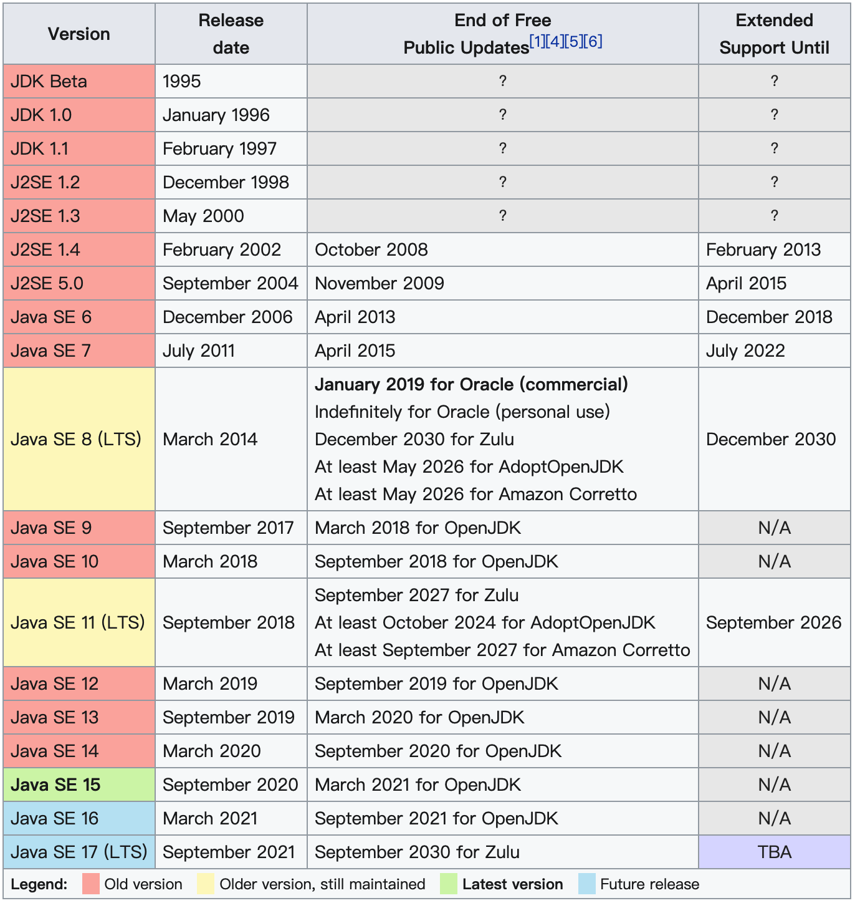
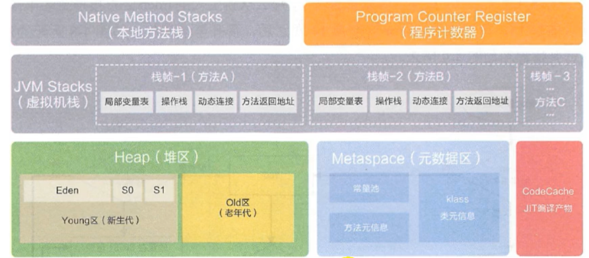
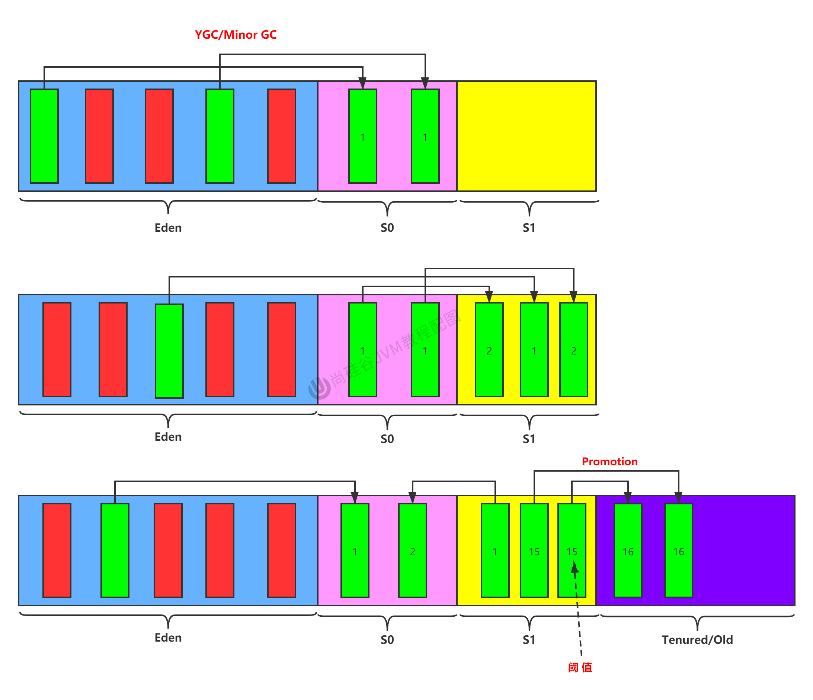
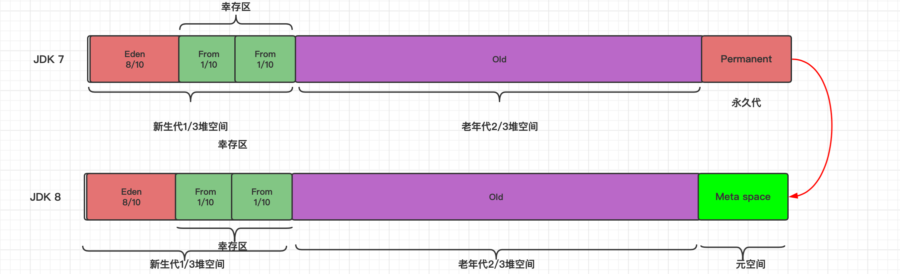
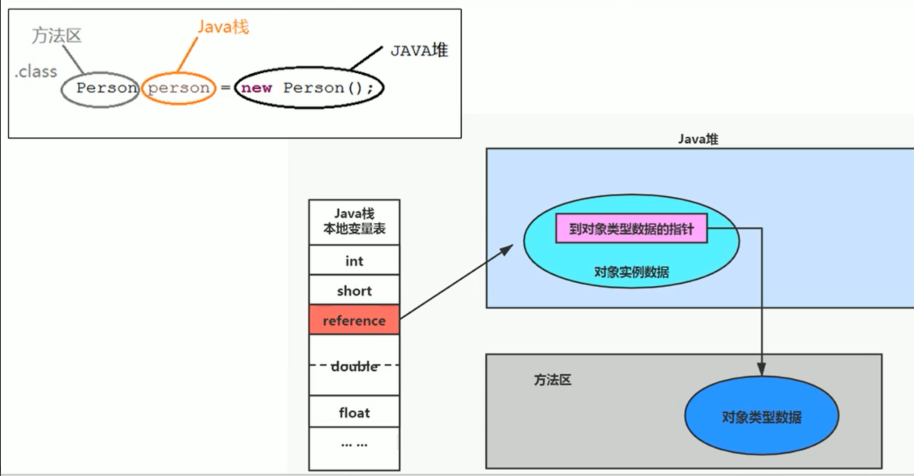
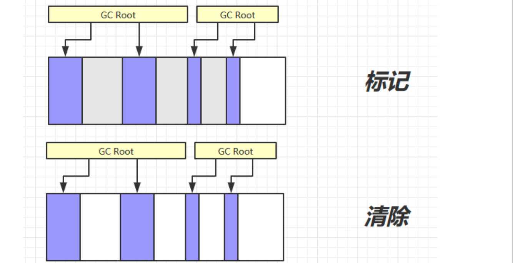

# 写在前面

## 推荐

### 视频

- [尚硅谷宋红康JVM全套教程（详解java虚拟机）](https://www.bilibili.com/video/BV1PJ411n7xZ?p=1)

  - 内存与垃圾回收篇

  - 字节码与类的加载篇

  - 性能监控与调优篇


### 书籍

- 《offer 来了》

- 《深入理解java虚拟机》（周志明）
  - Java内存区域与内存溢出异常

### 博客

- [宋红康JVM语雀笔记📒](https://www.yuque.com/u21195183/jvm/lep6m9)


## 总结（核心点简述）


<hr>


# 🎈🎈🎈尚硅谷宋红康JVM部分


# 内存与垃圾回收篇（上）

## 1 JVM与Java体系结构

### 1.1 前言

你是否也遇到过这些问题？

- 运行着的线上系统突然卡死，系统无法访问，甚至直接OOM

- 想解决线上JVM GC问题，但却无从下手
- 新项目上线，对各种JVM参数设置一脸茫然，直接默认吧然后就JJ了
- 每次面试之前都要重新背一遍JVM的一些原理概念性的东西，然而面试官却经常问你在实际项目中如何调优VM参数，如何解决GC、OOM等问题，一脸懵逼

大部分Java开发人员，除会在项目中使用到与Java平台相关的各种高精尖技术，对于Java技术的核心Java虚拟机了解甚少。

<br>

我们为什么要学习JVM？

- 面试的需要（BATJ、TMD，PKQ等面试都爱问）
- 中高级程序员必备技能
  - 项目管理、调优的需求
- 追求极客的精神
  - 比如：垃圾回收算法、JIT、底层原理


垃圾收集机制为我们打理了很多繁琐的工作，大大提高了开发的效率。但是，垃圾收集也不是万能的，懂得JVM内部的内存结构、工作机制，是设计高扩展性应用和诊断运行时问题的基础，也是Java工程师进阶的必备能力。

### 1.2 参考书目

《深入理解Java 虚拟机》


### 1.3 Java及JVM简介

**TIOBE语言热度排行榜：**[**index | TIOBE - The Software Quality Company**](https://tiobe.com/tiobe-index/)

| Programming Language | 2021 | 2016 | 2011 | 2006 | 2001 | 1996 | 1991 | 1986 |
| -------------------- | ---- | ---- | ---- | ---- | ---- | ---- | ---- | ---- |
| C                    | 1    | 2    | 2    | 2    | 1    | 1    | 1    | 1    |
| Java                 | 2    | 1    | 1    | 1    | 3    | 26   | -    | -    |
| Python               | 3    | 5    | 6    | 8    | 27   | 19   | -    | -    |
| C++                  | 4    | 3    | 3    | 3    | 2    | 2    | 2    | 8    |
| C#                   | 5    | 4    | 5    | 7    | 13   | -    | -    | -    |
| Visual Basic         | 6    | 13   | -    | -    | -    | -    | -    | -    |
| JavaScript           | 7    | 8    | 10   | 9    | 10   | 32   | -    | -    |
| PHP                  | 8    | 6    | 4    | 4    | 11   | -    | -    | -    |
| SQL                  | 9    | -    | -    | -    | -    | -    | -    | -    |
| R                    | 10   | 17   | 31   | -    | -    | -    | -    | -    |
| Lisp                 | 34   | 27   | 13   | 14   | 17   | 7    | 4    | 2    |
| Ada                  | 36   | 28   | 17   | 16   | 20   | 8    | 5    | 3    |
| (Visual) Basic       | -    | -    | 7    | 6    | 4    | 3    | 3    | 5    |

世界上没有最好的编程语言，只有最适用于具体应用场景的编程语言


字节码

- 我们平时说的java字节码，指的是用java语言编译成的字节码。准确的说任何能在jvm平台上执行的字节码格式都是一样的。所以应该统称为：jvm字节码。

如何真正搞懂JVM？

- Java虚拟机非常复杂，要想真正理解它的工作原理，最好的方式就是自己动手编写一个！
- 天下事有难易乎？ 为之，则难者亦易矣；不为，则易者亦难矣
- 推荐书籍《自己动手写Java虚拟机》

### 1.4 Java发展的重大事件





### 1.5 虚拟机与Java虚拟机


Java虚拟机

- Java技术的核心就是Java虚拟机（JVM，Java Virtual Machine），因为所有的Java程序都运行在Java虚拟机内部。
- 作用：Java虚拟机就是二进制字节码的运行环境，负责**装载**字节码到其内部，**解释/编译**为对应平台上的机器指令执行。每一条Java指令，Java虚拟机规范中都有详细定义，如怎么取操作数，怎么处理操作数，处理结果放在哪里。

- 特点
  - 一次编译，到处运行
  - 自动内存管理
  - 自动垃圾回收功能


### 1.6 JVM的整体结构


- HotSpot VM是目前市面上高性能虚拟机的代表作之一。

- 它采用解释器与即时编译器并存的架构。

- 在今天，Java程序的运行性能早已脱胎换骨，已经达到了可以和C/C++程序一较高下的地步。


### 1.7 Java代码执行流程 ⭐️

### 1.8 JVM的架构模型

### 1.9 JVM的生命周期

#### 虚拟机的启动

Java虚拟机的启动是通过引导类加载器（bootstrap class loader）创建一个初始类（initial class）来完成的，这个类是由虚拟机的具体实现指定的。

#### 虚拟机的运行

- 一个运行中的Java虚拟机有着一个清晰的任务：执行Java程序。

- 程序开始执行时他才运行，程序结束时他就停止。

- **执行一个所谓的Java程序的时候，真真正正在执行的是一个叫做Java虚拟机的进程。**

#### 虚拟机的退出

有如下的几种情况：

- 程序正常执行结束

- 程序在执行过程中遇到了异常或错误而异常终止

- 由于操作系统出现错误而导致Java虚拟机进程终止

- 某线程调用Runtime类或system类的exit方法，或Runtime类的halt方法，并且Java安全管理器也允许这次exit或halt操作。

- 除此之外，JNI（Java Native Interface）规范描述了用JNI Invocation API来加载或卸载 Java虚拟机时，Java虚拟机的退出情况。

### 1.10 JVM的发展历程

后续补充。。。


主要以Oracle HotSpot VM为默认虚拟机。


## 2 类加载子系统

### 2.1 内存结构概述

- Class文件
- 类加载子系统
- 运行时数据区 （五大部分）
  - 方法区
  - 堆
  - 程序计数器
  - 虚拟机栈
  - 本地方法栈
- 执行引擎
- 本地方法接口
- 本地方法库


如果自己想手写一个Java虚拟机的话，主要考虑哪些结构呢？

- 类加载器

- 执行引擎


### 2.2 类加载器与类的加载过程

#### 类加载器子系统作用


- 类加载器子系统负责从文件系统或者网络中加载Class文件，class文件在**文件开头有特定的文件标识**。

- ClassLoader只负责class文件的加载，至于它是否可以运行，则由Execution Engine决定。

- 加载的类信息存放于一块称为方法区的内存空间。除了类的信息外，方法区中还会存放运行时常量池信息，可能还包括字符串字面量和数字常量（这部分常量信息是Class文件中常量池部分的内存映射）

#### 类加载器ClasLoader角色

快递员角色

- class file存在于本地硬盘上
- class file加载到JVM中，被称为DNA元数据模板，放在方法区。
- 实例化出多个实例

#### 加载阶段

#### 链接阶段

#### 初始化阶段

### 2.3 类加载器分类

JVM支持两种类型的类加载器 。分别为引导类加载器（Bootstrap ClassLoader）和自定义类加载器（User-Defined ClassLoader）。

无论类加载器的类型如何划分，在程序中我们最常见的类加载器始终只有3个，如下所示：


这里的四者之间的关系是包含关系。不是上层下层，也不是子父类的继承关系。


#### 虚拟机自带的加载器 ⭐️

##### 启动类加载器（引导类加载器，Bootstrap ClassLoader）

- 并不继承自ava.lang.ClassLoader，没有父加载器。
- 出于安全考虑，Bootstrap启动类加载器只加载包名为 `java`、`javax`、`sun`等开头的类


##### 扩展类加载器（Extension ClassLoader）

- 父类加载器为启动类加载器

##### 应用程序类加载器（系统类加载器，AppClassLoader）

- 父类加载器为扩展类加载器

- 该类加载器是程序中默认的类加载器，一般来说，Java应用的类都是由它来完成加载

### 2.4 ClassLoader 使用说明

ClassLoader类是一个抽象类，其后所有的类加载器都继承自ClassLoader（不包括启动类加载器）


### 2.5 双亲委派机制

Java虚拟机对class文件采用的是**按需加载**的方式，也就是说当需要使用该类时才会将它的class文件加载到内存生成class对象。

而且加载某个类的class文件时，Java虚拟机采用的是双亲委派模式，即把请求交由父类处理，它是一种任务委派模式。

#### 工作原理

- 1）如果一个类加载器收到了类加载请求，它并不会自己先去加载，而是把这个请求委托给父类的加载器去执行；

- 2）如果父类加载器还存在其父类加载器，则进一步向上委托，依次递归，请求最终将到达顶层的启动类加载器；

- 3）如果父类加载器可以完成类加载任务，就成功返回，倘若父类加载器无法完成此加载任务，子加载器才会尝试自己去加载，这就是双亲委派模式。
  - 父类加载器加载完成了，就不会向下委托


#### 优势

- 避免类的重复加载

- 保护程序安全，防止核心API被随意篡改 
  - 自定义类：java.lang.String
  - 自定义类：java.lang.ShkStart（报错：阻止创建 java.lang开头的类）

#### 沙箱安全机制

自定义String类，但是在加载自定义String类的时候会率先使用引导类加载器加载，而引导类加载器在加载的过程中会先加载jdk自带的文件（rt.jar包中java\lang\String.class），报错信息说没有main方法，就是因为加载的是rt.jar包中的string类。

这样可以保证对java核心源代码的保护，这就是沙箱安全机制。


## 3 运行时数据区之程序计数器（PC寄存器）

PC寄存器用来存储指向下一条指令的地址。



字节码解释器工作时就是通过改变这个计数器的值来选取下一条需要执行的字节码指令。

它是唯一一个在Java虚拟机规范中没有规定任何OutofMemoryError情况的区域。


## 4 虚拟机栈 ⭐️⭐️⭐️⭐️⭐️

### 4.1 虚拟机栈概述

#### 虚拟机栈出现的背景

由于跨平台性的设计，Java的指令都是根据栈来设计的。不同平台CPU架构不同，所以不能设计为基于寄存器的。

**优点是跨平台，指令集小，编译器容易实现，缺点是性能下降，实现同样的功能需要更多的指令。**

#### 初步印象

有不少Java开发人员一提到Java内存结构，就会非常粗粒度地将JVM中的内存区理解为仅有Java堆（heap）和Java栈（stack）？为什么？

- 这种说法不全面。
- 栈和堆确实是最重要的2部分。
- C++中的类似观点。

#### 内存中的栈与堆

栈是运行时的单位，而堆是存储的单位。

- 栈解决程序的运行问题，即程序如何执行，或者说如何处理数据。

- 堆解决的是数据存储的问题，即数据怎么放，放哪里。

#### 虚拟机栈基本内容

（1）Java虚拟机栈是什么？

- Java虚拟机栈（Java Virtual Machine Stack），早期也叫 Java 栈。

- 每个线程在创建时都会创建一个虚拟机栈，其内部保存一个个的**栈帧**（Stack Frame），对应着一次次的Java方法调用，是线程私有的。

（2）生命周期

- 生命周期和线程一致

（3）作用

- 主管Java程序的运行，它保存方法的局部变量、部分结果，并参与方法的调用和返回。

（4）栈的特点

- JVM直接对Java栈的操作只有两个：

  - 每个方法执行，伴随着进栈（入栈、压栈）

  - 执行结束后的出栈工作

- 对于栈来说不存在垃圾回收问题（栈存在溢出的情况）


（5）面试题：开发中遇到哪些异常？


<br>

**栈中可能出现的异常**

Java 虚拟机规范允许 **Java栈的大小是动态的或者是固定不变的**。

- 如果采用固定大小的Java虚拟机栈，那每一个线程的Java虚拟机栈容量可以在线程创建的时候独立选定。如果线程请求分配的栈容量超过Java虚拟机栈允许的最大容量，Java虚拟机将会抛出一个**StackOverflowError** 异常。 

- 如果Java虚拟机栈可以动态扩展，并且在尝试扩展的时候无法申请到足够的内存，或者在创建新的线程时没有足够的内存去创建对应的虚拟机栈，那Java虚拟机将会抛出一个 **OutOfMemoryError** 异常。 

```java
public static void main(String[] args) {
    test();
}
public static void test() {
    test();
}
//抛出异常：Exception in thread"main"java.lang.StackoverflowError
//程序不断的进行递归调用，而且没有退出条件，就会导致不断地进行压栈。
```

<br>


**设置栈内存大小**

我们可以使用参数 -Xss选项来设置线程的最大栈空间，栈的大小直接决定了函数调用的最大可达深度

```java
public class StackDeepTest{ 
    private static int count=0; 
  
    public static void recursion(){
        count++; 
        recursion(); 
    }
  
    public static void main(String args[]){
        try{
            recursion();
        } catch (Throwable e){
            System.out.println("deep of calling="+count); 
            e.printstackTrace();
        }
    }
}
```


### 4.2 栈的存储单位

#### 栈中存储什么？

每个线程都有自己的栈，栈中的数据都是以栈帧（Stack Frame）的格式存在。

在这个线程上正在执行的每个方法都各自对应一个栈帧（Stack Frame）。

栈帧是一个内存区块，是一个数据集，维系着方法执行过程中的各种数据信息。


#### 栈运行原理

JVM直接对Java栈的操作只有两个，就是对**栈帧的压栈和出栈，遵循“先进后出”/“后进先出”原则**。


如果在该方法中调用了其他方法，对应的新的栈帧会被创建出来，放在栈的顶端，成为新的当前帧。


不同线程中所包含的栈帧是不允许存在相互引用的，即不可能在一个栈帧之中引用另外一个线程的栈帧。

如果当前方法调用了其他方法，方法返回之际，当前栈帧会传回此方法的执行结果给前一个栈帧，接着，虚拟机会丢弃当前栈帧，使得前一个栈帧重新成为当前栈帧。

Java方法有两种返回函数的方式，一种是正常的函数返回，使用return指令；另外一种是抛出异常。不管使用哪种方式，都会导致栈帧被弹出。

```java
public class CurrentFrameTest{
    public void methodA(){
        system.out.println（"当前栈帧对应的方法->methodA");
        methodB();
        system.out.println（"当前栈帧对应的方法->methodA");
    }
    public void methodB(){
        System.out.println（"当前栈帧对应的方法->methodB");
    }
}
```


#### 栈帧的内部结构

每个栈帧中存储着：

- 局部变量表（Local Variables）

- 操作数栈（operand Stack）（或表达式栈）

- 动态链接（DynamicLinking）（或指向运行时常量池的方法引用）

- 方法返回地址（Return Address）（或方法正常退出或者异常退出的定义）

- 一些附加信息


### 4.3 局部变量表(Local Variables)

局部变量表也被称之为局部变量数组或本地变量表

- **定义为一个数字数组，主要用于存储方法参数和定义在方法体内的局部变量**，这些数据类型包括各类基本数据类型、对象引用（reference），以及returnAddress类型。 
-  **局部变量表所需的容量大小是在编译期确定下来的**，并保存在方法的Code属性的`maximum local variables`数据项中。在方法运行期间是不会改变局部变量表的大小的。 


-  **方法嵌套调用的次数由栈的大小决定。**一般来说，栈越大，方法嵌套调用次数越多。对一个函数而言，它的参数和局部变量越多，使得局部变量表膨胀，它的栈帧就越大，以满足方法调用所需传递的信息增大的需求。进而函数调用就会占用更多的栈空间，导致其嵌套调用次数就会减少。 

- **局部变量表中的变量只在当前方法调用中有效。**在方法执行时，虚拟机通过使用局部变量表完成参数值到参数变量列表的传递过程。当方法调用结束后，随着方法栈帧的销毁，局部变量表也会随之销毁。 


#### 静态变量与局部变量的对比

我们知道类变量表有两次初始化的机会，第一次是在“准备阶段”，执行系统初始化，对类变量设置零值，另一次则是在“初始化”阶段，赋予程序员在代码中定义的初始值。

和类变量初始化不同的是，局部变量表不存在系统初始化的过程，这意味着一旦定义了局部变量则必须人为的初始化，否则无法使用。

```java
public void test(){
    int i;
    System. out. println(i);
}
```

这样的代码是错误的，没有赋值不能够使用。


#### 补充说明

在栈帧中，与性能调优关系最为密切的部分就是前面提到的局部变量表。在方法执行时，虚拟机使用局部变量表完成方法的传递。

**局部变量表中的变量也是重要的垃圾回收根节点，只要被局部变量表中直接或间接引用的对象都不会被回收。**


### 4.4 操作数栈（Operand Stack）

每一个独立的栈帧除了包含局部变量表以外，还包含一个后进先出（Last-In-First-Out）的 操作数栈，也可以称之为表达式栈（Expression Stack）

操作数栈，在方法执行过程中，根据字节码指令，往栈中写入数据或提取数据，即入栈（push）和 出栈（pop）

- 某些字节码指令将值压入操作数栈，其余的字节码指令将操作数取出栈。使用它们后再把结果压入栈
- 比如：执行复制、交换、求和等操作


### 4.5 代码追踪

代码

```java
public void testAddOperation(){
    byte i = 15; 
    int j = 8; 
    int k = i + j;
}
```

字节码指令信息

> 使用javap 命令反编译class文件：`javap -v 类名.class`

```shell
public void testAddOperation(); 
    Code:
    0: bipush 15
    2: istore_1 
    3: bipush 8
    5: istore_2 
    6:iload_1 
    7:iload_2 
    8:iadd
    9:istore_3 
    10:return
```

操作数栈，主要用于保存计算过程的中间结果，同时作为计算过程中变量临时的存储空间。


### 栈的相关面试题

- 举例栈溢出的情况？（StackOverflowError） 
  -   通过 -Xss设置栈的大小

- 调整栈大小，就能保证不出现溢出么？
  -   不能保证不溢出

- 分配的栈内存越大越好么？
  -   不是，一定时间内降低了OOM概率，但是会挤占其它的线程空间，因为整个空间是有限的。

- 垃圾回收是否涉及到虚拟机栈？ 
  - 不会
- 方法中定义的局部变量是否线程安全？
  -   具体问题具体分析。如果对象是在内部产生，并在内部消亡，没有返回到外部，那么它就是线程安全的，反之则是线程不安全的。

| 运行时数据区 | 是否存在Error | 是否存在GC |
| ------------ | ------------- | ---------- |
| 程序计数器   | 否            | 否         |
| 虚拟机栈     | 是（SOE）     | 否         |
| 本地方法栈   | 是            | 否         |
| 方法区       | 是（OOM）     | 是         |
| 堆           | 是            | 是         |


## 5 本地方法接口和本地方法栈

本地接口的作用是融合不同的编程语言为Java所用，它的初衷是融合C/C++程序。


### 5.2 本地方法栈（线程私有）

**Java虚拟机栈于管理Java方法的调用，而本地方法栈用于管理本地方法的调用。**

本地方法是使用C语言实现的。

它的具体做法是Native Method Stack中登记native方法，在Execution Engine 执行时加载本地方法库。

<br>

在Hotspot JVM中，直接将本地方法栈和虚拟机栈合二为一。


## 6 堆 Heap⭐️⭐️⭐️⭐️⭐️

### 6.1 核心概述

- 一个JVM实例只存在一个堆内存，堆也是Java内存管理的核心区域。

- Java 堆区在JVM启动的时候即被创建，其空间大小也就确定了。是JVM管理的**最大一块内存空间**。

- 堆是GC（Garbage Collection，垃圾收集器）**执行垃圾回收的重点区域**。


#### 堆内存细分

Java 7及之前堆内存逻辑上分为三部分：新生区 + 养老区 + **永久区**

- Young Generation Space 新生区 Young/New 
  - 又被划分为Eden区和Survivor区

- Tenure generation space 养老区 Old/Tenure

- Permanent Space 永久区 Perm

<br>

Java 8及之后堆内存逻辑上分为三部分：新生区 + 养老区 + **元空间**

- Young Generation Space 新生区 Young/New 
  - 又被划分为Eden区和Survivor区

- Tenure generation space 养老区 Old/Tenure

- Meta Space 元空间 Meta

约定：新生区（代）<=>年轻代 、 养老区<=>老年区（代）、 永久区<=>永久代


### 6.2 设置堆内存大小与OOM

#### 堆空间大小设置

Java堆区用于存储Java对象实例，堆的大小在JVM启动时就已经设定好了，大家可以通过选项"-Xmx"和"-Xms"来进行设置。

通常会将-Xms和-Xmx两个参数配置相同的值，其目的是**为了能够在 Java垃圾回收机制清理完堆区后不需要重新分隔计算堆区的大小，从而提高性能**。

默认情况下

- 初始内存大小：物理电脑内存大小 / 64

- 最大内存大小：物理电脑内存大小 / 4


```java
public class HeapTest {
    public static void main(String[] args) {
        // Java虚拟机中的堆内存容量
        long initialMemory = Runtime.getRuntime().totalMemory() / 1024 / 1024;
        // Java虚拟机中的最大堆内存容量
        long maxMemory = Runtime.getRuntime().maxMemory() / 1024 / 1024;

        System.out.println("-Xms: " + initialMemory + "M");
        System.out.println("-Xmx: " + maxMemory + "M");
    }
}
```

查看设置的参数

- 方式1：jps / jstat -gc 进程id
- 方式2：-XX:+PrintFCDetails

#### OutOfMemory举例

```java
public class OOMTest {
    public static void main(String[]args){
        ArrayList<Picture> list = new ArrayList<>();
        while(true){
            try {
                Thread.sleep(20);
            } catch (InterruptedException e){
                e.printStackTrace();
            }
            list.add(new Picture(new Random().nextInt(1024*1024)));
        }
    }
}
```

打印结果

```java
Exception in thread "main" java.lang.OutofMemoryError: Java heap space
    at com.atguigu. java.Picture.<init>(OOMTest. java:25)
    at com.atguigu.java.O0MTest.main(OOMTest.java:16)
```


### 6.3 年轻代与老年代

存储在JVM中的Java对象可以被划分为两类：

- 一类是生命周期较短的瞬时对象，这类对象的创建和消亡都非常迅速

- 另外一类对象的生命周期却非常长，在某些极端的情况下还能够与JVM的生命周期保持一致


- 默认`-XX:NewRatio=2`，表示新生代占1，老年代占2，新生代占整个堆的1/3

<br>

**几乎所有的 Java对象都是在Eden区被new出来的**。绝大部分的Java对象的销毁都在新生代进行了。


### 6.4 图解对象分配过程

```bash
1.  new的对象先放伊甸园区。此区有大小限制。 
2.  当伊甸园的空间填满时，程序又需要创建对象，JVM的垃圾回收器将对伊甸园区进行垃圾回收（MinorGC），将伊甸园区中的不再被其他对象所引用的对象进行销毁。再加载新的对象放到伊甸园区。 
3.  然后将伊甸园中的剩余对象移动到幸存者0区。 
4.  如果再次触发垃圾回收，此时上次幸存下来的放到幸存者0区的，如果没有回收，就会放到幸存者1区。 
5.  如果再次经历垃圾回收，此时会重新放回幸存者0区，接着再去幸存者1区。 

6.  啥时候能去养老区呢？可以设置次数。默认是15次。 
  ○ 可以设置参数：进行设置-Xx:MaxTenuringThreshold= N
7.  在养老区，相对悠闲。当养老区内存不足时，再次触发GC：Major GC，进行养老区的内存清理 
8.  若养老区执行了Major GC之后，发现依然无法进行对象的保存，就会产生OOM异常。 
```




- 伊甸园区的对象先往to区放（空的）

- 年龄计数器达到15晋升老年代

- 总结
  - 针对幸存者s0，s1区的总结：复制之后有交换，谁空谁是to
  - 关于垃圾回收：频繁在新生区收集，很少在老年代收集，几乎不再永久代和元空间进行收集


流程图


**常用调优工具（在JVM下篇：性能监控与调优篇会详细介绍）**

- JDK命令行

- Eclipse:Memory Analyzer Tool

- Jconsole

- VisualVM

- Jprofiler

- Java Flight Recorder

- GCViewer

- GC Easy


### 6.5 Minor GC、MajorGC、Full GC

JVM在进行GC时，并非每次都对上面三个内存区域一起回收的，大部分时候回收的都是指新生代。

针对Hotspot VM的实现，它里面的GC按照回收区域又分为两大种类型：一种是部分收集（Partial GC），一种是整堆收集（FullGC）

- 部分收集：不是完整收集整个Java堆的垃圾收集。其中又分为： 

- - 新生代收集（Minor GC / Young GC）：只是新生代的垃圾收集

- - 老年代收集（Major GC / Old GC）：只是老年代的圾收集。 

- - - 目前，只有CMSGC会有单独收集老年代的行为。

- - - 注意，很多时候Major GC会和Full GC混淆使用，需要具体分辨是老年代回收还是整堆回收。

- - 混合收集（MixedGC）：收集整个新生代以及部分老年代的垃圾收集。 

- - - 目前，只有G1 GC会有这种行为

- 整堆收集（Full GC）：收集整个java堆和方法区的垃圾收集。


### 6.6 堆空间分代思想

分代的唯一理由就是优化GC性能。

如果没有分代，GC的时候要找到哪些对象没用，就会对堆的所有区域进行扫描。而很多对象都是朝生夕死的，如果分代的话，把新创建的对象放到某一地方，当GC的时候先把这块存储“朝生夕死”对象的区域进行回收，这样就会腾出很大的空间出来。





### 6.7 内存分配策略

针对不同年龄段的对象分配原则如下所示：

- 优先分配到Eden

- 大对象直接分配到老年代（尽量避免程序中出现过多的大对象）

- 长期存活的对象分配到老年代

- 动态对象年龄判断：如果survivor区中相同年龄的所有对象大小的总和大于Survivor空间的一半，年龄大于或等于该年龄的对象可以直接进入老年代，无须等到`MaxTenuringThreshold`中要求的年龄。

- 空间分配担保： `-XX:HandlePromotionFailure`

### 6.8 为对象分配内存：TLAB


### 6.9 小结：堆空间的参数设置

```java
// 详细的参数内容会在JVM下篇：性能监控与调优篇中进行详细介绍，这里先熟悉下
-XX:+PrintFlagsInitial  //查看所有的参数的默认初始值
-XX:+PrintFlagsFinal  //查看所有的参数的最终值（可能会存在修改，不再是初始值）
-Xms  //初始堆空间内存（默认为物理内存的1/64）
-Xmx  //最大堆空间内存（默认为物理内存的1/4）
-Xmn  //设置新生代的大小。（初始值及最大值）
-XX:NewRatio  //配置新生代与老年代在堆结构的占比
-XX:SurvivorRatio  //设置新生代中Eden和S0/S1空间的比例
-XX:MaxTenuringThreshold  //设置新生代垃圾的最大年龄
-XX:+PrintGCDetails //输出详细的GC处理日志
//打印gc简要信息：①-Xx：+PrintGC ② - verbose:gc
-XX:HandlePromotionFalilure：//是否设置空间分配担保
```


### 堆是分配对象的唯一选择么？

在Java虚拟机中，对象是在Java堆中分配内存的，这是一个普遍的常识。

但是，有一种特殊情况，那就是如果经过逃逸分析（Escape Analysis）后发现，一个对象并没有逃逸出方法的话，那么就可能被优化成栈上分配。这样就无需在堆上分配内存，也无须进行垃圾回收了。这也是最常见的堆外存储技术。


## 7 方法区⭐️⭐️⭐️⭐️⭐️

### 7.1 栈、堆、方法区的交互关系


从线程共享与否的角度来看


举个例子🌰





### 7.2 方法区的理解

官方文档：[Chapter 2. The Structure of the Java Virtual Machine (oracle.com)](https://docs.oracle.com/javase/specs/jvms/se8/html/jvms-2.html#jvms-2.5.4)


所以，**方法区看作是一块独立于Java堆的内存空间。**


- 方法区（Method Area）与Java堆一样，是各个线程共享的内存区域。
- 方法区在JVM启动的时候被创建，并且它的实际的物理内存空间中和Java堆区一样都可以是不连续的。
- 方法区的大小，跟堆空间一样，可以选择固定大小或者可扩展。
- 方法区的大小决定了系统可以保存多少个类，如果系统定义了太多的类，导致方法区溢出，虚拟机同样会抛出内存溢出错误：`java.lang.OutOfMemoryError: PermGen space` 或者`java.lang.OutOfMemoryError: Metaspace`

- 关闭JVM就会释放这个区域的内存。

#### HotSpot中方法区的演进

在jdk7及以前，习惯上把方法区，称为永久代。jdk8开始，使用元空间取代了永久代。

而到了JDK8，终于完全废弃了永久代的概念，改用与JRockit、J9一样在本地内存中实现的元空间（Metaspace）来代替

元空间的本质和永久代类似，都是对JVM规范中方法区的实现。不过元空间与永久代最大的区别在于：**元空间不在虚拟机设置的内存中，而是使用本地内存**


### 7.3 设置方法区大小与OOM

方法区的大小不必是固定的，JVM可以根据应用的需要动态调整。


- 元数据区大小可以使用参数 `-XX:MetaspaceSize` 和 `-XX:MaxMetaspaceSize`指定


### 7.4 方法区的内部结构

#### 方法区（Method Area）存储什么？

《深入理解Java虚拟机》书中对方法区（Method Area）存储内容描述如下：

- 它用于存储已被虚拟机加载的类型信息、常量、静态变量、即时编译器编译后的代码缓存等。


#### 方法区的内部结构

##### （1）类型信息

对每个加载的类型（类class、接口interface、枚举enum、注解annotation），JVM必须在方法区中存储以下类型信息：

- 这个类型的完整有效名称（全名=包名.类名）
- 这个类型直接父类的完整有效名（对于interface或是java.lang.object，都没有父类）
- 这个类型的修饰符（public，abstract，final的某个子集）
- 这个类型直接接口的一个有序列表

##### （2）域（Field）信息

域的相关信息包括：域名称、域类型、域修饰符（public，private，protected，static，final，volatile，transient的某个子集）

##### （3）方法（Method）信息

JVM必须保存所有方法的以下信息，同域信息一样包括声明顺序：

- 方法名称
- 方法的返回类型（或void）
- 方法参数的数量和类型（按顺序）
- 方法的修饰符（public，private，protected，static，final，synchronized，native，abstract的一个子集）
- 方法的字节码（bytecodes）、操作数栈、局部变量表及大小（abstract和native方法除外）
- 异常表（abstract和native方法除外） 
  -   每个异常处理的开始位置、结束位置、代码处理在程序计数器中的偏移地址、被捕获的异常类的常量池索引


#### 运行时常量池 VS 常量池

几种常量池内存储的数据类型包括：

- 数量值

- 字符串值

- 类引用

- 字段引用

- 方法引用


常量池、可以看做是一张表，虚拟机指令根据这张常量表找到要执行的类名、方法名、参数类型、字面量等类型

#### 运行时常量池

- 运行时常量池（Runtime Constant Pool）是方法区的一部分。
- **常量池表（Constant Pool Table）是Class文件的一部分，用于存放编译期生成的各种字面量与符号引用，这部分内容将在类加载后存放到方法区的运行时常量池中。**
- 运行时常量池，在加载类和接口到虚拟机后，就会创建对应的运行时常量池。
- 运行时常量池，相对于Class文件常量池的另一重要特征是：具备动态性。


### 7.5 方法区使用举例


```java
public class MethodAreaDemo {
    public static void main(String args[]) {
        int x = 500;
        int y = 100;
        int a = x / y;
        int b = 50;
        System.out.println(a+b);
    }
}
```


### 7.6 方法区的演进细节


| JDK1.6及之前 | 有永久代（permanet），静态变量存储在永久代上                 |
| ------------ | ------------------------------------------------------------ |
| **JDK1.7**   | **有永久代，但已经逐步 “去永久代”，字符串常量池，静态变量移除，保存在堆中** |
| **JDK1.8**   | **无永久代，类型信息，字段，方法，常量保存在本地内存的元空间，但字符串常量池、静态变量仍然在堆中。** |


#### StringTable为什么要调整位置？

jdk7中将StringTable放到了堆空间中。

因为永久代的回收效率很低，在full gc的时候才会触发。而full gc是老年代的空间不足、永久代不足时才会触发。这就导致StringTable回收效率不高。

而我们开发中会有大量的字符串被创建，回收效率低，导致永久代内存不足。**放到堆里，能及时回收内存。**

### 7.7 方法区的垃圾回收


### 总结


### 面试题 🎈

#### 百度：说一下JVM内存模型吧，有哪些区？分别干什么的？


#### 蚂蚁金服：Java8的内存分代改进 JVM内存分哪几个区，每个区的作用是什么？

一面：JVM内存分布/内存结构？栈和堆的区别？堆的结构？为什么两个survivor区？


二面：Eden和survior的比例分配

#### 小米：jvm内存分区，为什么要有新生代和老年代


#### 字节跳动

一面：Java的内存分区


二面：讲讲 jvm运行时数据库区 什么时候对象会进入老年代？

#### 京东

JVM的内存结构，Eden和Survivor比例。

 

JVM内存为什么要分成新生代，老年代，持久代。

 

新生代中为什么要分为Eden和survivor


 

#### 天猫

一面：Jvm内存模型以及分区，需要详细到每个区放什么。

一面：JVM的内存模型，Java8做了什么改

 

#### 拼多多

JVM内存分哪几个区，每个区的作用是什么？

 

#### 美团

java内存分配 jvm的永久代中会发生垃圾回收吗？

一面：jvm内存分区，为什么要有新生代和老年代？


## 8 对象实例化及直接内存

### 对象实例化

创建对象的方式

- new：最常见的方式、Xxx的静态方法，XxxBuilder/XxxFactory的静态方法

- Class的newInstance方法：反射的方式，只能调用空参的构造器，权限必须是public

- Constructor的newInstance(XXX)：反射的方式，可以调用空参、带参的构造器，权限没有要求

- 使用clone()：不调用任何的构造器，要求当前的类需要实现Cloneable接口，实现clone()

- 使用序列化：从文件中、从网络中获取一个对象的二进制流

- 第三方库 Objenesis

### 对象内存布局


### 对象的访问定位

## 9 执行引擎

## 10 StringTable

## 11 垃圾回收概述及算法

## 垃圾回收器


### 直接内存（Direct Memory）


# 字节码与类的加载篇（中）

# 性能监控与调优篇（下）


# 🎈🎈🎈《Offer来了》JVM部分


# 1 JVM的运行机制

JVM（Java Virtual Machine）是用于运行Java字节码的虚拟机，包括一套字节码指令集、一组程序寄存器、一个虚拟机栈、一个虚拟机堆、一个方法区和一个垃圾回收器。JVM运行在操作系统之上，不与硬件设备直接交互。


<br>

Java程序的具体运行过程如下。

- Java源文件被编译器编译成**字节码文件**。
- JVM将字节码文件编译成**相应操作系统的机器码**。

- 机器码调用相应操作系统的**本地方法库执行相应的方法**。

 Java虚拟机如图所示：


其中：

- 类加载器子系统：用于将编译好的.Class文件加载到JVM中；

- 运行时数据区：用于存储在JVM运行过程中产生的数据，包括程序计数器、方法区、本地方法区、虚拟机栈和虚拟机堆；

- 执行引擎包括即时编译器和垃圾回收器：即时编译器用于将Java字节码编译成具体的机器码，垃圾回收器用于回收在运行过程中不再使用的对象；

- 本地接口库用于调用操作系统的本地方法库完成具体的指令操作。


# 2 所谓多线程

在多核操作系统上，JVM允许在一个进程内同时并发执行多个线程。


# 3 JVM的内存区域

JVM的内存区域分为线程私有区域（程序计数器、虚拟机栈、本地方法区）、线程共享区域（堆、方法区）和直接内存，如图所示。


线程私有区域的生命周期与线程相同，随线程的启动而创建，随线程的结束而销毁。

线程共享区域随虚拟机的启动而创建，随虚拟机的关闭而销毁。


## 3.1 程序计数器：线程私有，无内存溢出问题

程序计数器是一块很小的内存空间，用于存储当前运行的线程所执行的字节码的行号指示器。

程序计数器属于“线程私有”的内存区域，它是唯一没有Out Of Memory（内存溢出）的区域。

## 3.2 虚拟机栈：线程私有，描述**Java**方法的执行过程

栈帧用来记录方法的执行过程，在方法被执行时虚拟机会为其创建一个与之对应的栈帧，方法的执行和返回对应栈帧在虚拟机栈中的入栈和出栈。无论方法是正常运行完成还是异常完成（抛出了在方法内未被捕获的异常），都视为方法运行结束。

每个运行中的线程当前只有一个栈帧处于活动状态。

## 3.3 本地方法区：线程私有

本地方法区和虚拟机栈的作用类似，区别是虚拟机栈为执行Java方法服务，本地方法栈为Native方法服务。

## 3.4 堆：也叫作运行时数据区，线程共享

在JVM运行过程中**创建的对象和产生的数据**都被存储在堆中，堆是被**线程共享的内存区域**，也是**垃圾收集器进行垃圾回收的最主要的内存**

**区域**。

由于现代JVM采用**分代收集算法** ，因此Java堆从GC（GarbageCollection，垃圾回收）的角度还可以细分为：**新生代、老年代和永久代**。

## 3.5 方法区：线程共享

方法区也被称为永久代，用于**存储常量、静态变量、类信息、即时编译器编译后的机器码、运行时常量池等**数据


# 4 JVM的运行时内存（新生代+老年代+永久代）

JVM的运行时内存也叫作JVM堆，从GC的角度可以将JVM堆分为新生代、老年代和永久代。

- 其中新生代默认占 1/3堆空间，老年代默认占2/3堆空间，永久代占非常少的堆空间。

- 新生代又分为Eden区、ServivorFrom区和ServivorTo区，Eden区默认占8/10新生代空间，ServivorFrom区和ServivorTo区默认分别占 1/10新生代空间，

## 4.1 新生代：Eden**区、**ServivorTo**区和**ServivorFrom区（MinorGC）

JVM新创建的对象（除了大对象外）会被存放在新生代。

由于JVM会频繁创建对象，所以新生代会频繁触发MinorGC进行垃圾回收。

### Eden区

- Java新创建的对象首先会被存放在Eden区，如果新创建的对象属于大对象，则直接将其分配到老年代。
  - 大对象的定义和具体的JVM版本、堆大小和垃圾回收策略有关，一般为 2KB～128KB，可通过XX:PretenureSizeThreshold设置其大小。
- 在Eden区的内存空间不足时会触发MinorGC，对新生代进行一次垃圾回收。

### ServivorTo区

- 保留上一次MinorGC时的幸存者。

### ServivorFrom区

- 将上一次MinorGC时的幸存者作为这一次MinorGC的被扫描者。

<br>

新生代的GC过程叫作MinorGC，采用复制算法实现，具体过程如下。

（1）把在Eden区和ServivorFrom区中存活的对象**复制到ServivorTo区**。出现如下情况则将其复制到老年代：

- 如果某对象的年龄达到老年代的标准（对象晋升老年代的标准由XX:MaxTenuringThreshold设置，默认为 15）

- 如果ServivorTo区的内存空间不够
- 如果对象属于大对象（大小为 2KB～128KB的对象属于大对象，例如通过XX:PretenureSizeThreshold=2097152设置大对象为 2MB，1024×1024×2Byte=2097152Byte=2MB）

（2）**清空Eden区和ServivorFrom区**中的对象。

（3）将ServivorTo区和ServivorFrom区互换，原来的ServivorTo区成为下一次GC时的ServivorFrom区。

## 4.2 老年代（存放有长生命周期的对象和大对象）（MajorGC + 标记清除算法）

老年代主要存放有长生命周期的对象和大对象。

<br>

老年代的GC过程叫作MajorGC。在老年代，对象比较稳定，MajorGC不会被频繁触发。

在进行MajorGC前，**JVM会先进行一次MinorGC**，在MinorGC过后仍然出现老年代空间不足或无法找到足够大的连续空间分配给新创建的大对象时，会触发MajorGC进行垃圾回收，释放JVM的内存空间。

<br>

MajorGC采用标记清除算法，该算法首先会扫描所有对象并标记存活的对象，然后回收未被标记的对象，并释放内存空间。

因为要先扫描老年代的所有对象再回收，所以MajorGC的耗时较长。MajorGC的标记清除算法容易产生内存碎片。在老年代没有内存空间可分配时，会抛出Out Of Memory异常。

## 4.3 永久代


需要注意的是，在Java 8中永久代已经被元数据区（也叫作元空间）取代。元数据区的作用和永久代类似，二者最大的区别在于：元数据区并没有使用虚拟机的内存，而是直接使用操作系统的本地内存。因此，元空间的大小不受JVM内存的限制，只和操作系统的内存有关。


# 5 垃圾回收与算法


## 5.1 如何确定垃圾

Java采用引用计数法和可达性分析来确定对象是否应该被回收。

### （1）引用计数法

在Java中如果要操作对象，就必须先获取该对象的引用，因此可以通过引用计数法来判断一个对象是否可以被回收。

在为对象添加一个引用时，引用计数加 1；在为对象删除一个引用时，引进计数减 1；如果一个对象的引用计数为 0，则表示此刻该对象没有被引用，可以被回收。

<br>

引用计数法容易产生循环引用问题。循环引用指两个对象相互引用，导致它们的引用一直存在，而不能被回收


### （2）可达性分析

为了解决引用计数法的循环引用问题，Java还采用了可达性分析来判断对象是否可以被回收。

- 不可达
  - 首先定义一些GC Roots对象，然后以这些GC Roots对象作为起点向下搜索，如果在GC roots和一个对象之间没有可达路径，则称该对象是不可达的。

- 两次标记
  - 不可达对象要经过至少两次标记才能判定其是否可以被回收，如果在两次标记后该对象仍然是不可达的，则将被垃圾收集器回收。

## 5.2 Java中常用的4种垃圾回收算法

### （1）标记清除算法（快、但是存在碎片）




### （2）复制算法（无碎片、但要占用双倍内存空间）⭐️


### （3）标记整理算法（慢、无碎片）⭐️


### （4）分代收集算法


- 对象首先分配在伊甸园区域
- 新生代空间不足时，触发 minor gc，伊甸园和 from 存活的对象使用 copy 复制到 to 中，存活的对象年龄加 1并且交换 from to

- minor gc 会引发 stop the world，暂停其它用户的线程，等垃圾回收结束，用户线程才恢复运行

- 当对象寿命超过阈值时，会晋升至老年代，最大寿命是15（4bit）

- 当老年代空间不足，会先尝试触发 minor gc，如果之后空间仍不足，那么触发 full gc，STW的时间更长


# 6 Java中的4种引用类型

在Java中一切皆对象，对象的操作是通过该对象的引用（Reference）实现的。

Java中的引用类型有4种，分别为强引用、软引用、弱引用和虚引用。

## 强（最常见）

在把一个对象赋给一个引用变量时，这个引用变量就是一个强引用。

有强引用的对象一定为可达性状态，所以不会被垃圾回收机制回收。

因此，强引用是造成Java内存泄漏（Memory Link）的主要原因。

## 软（通过SoftReference类实现）

如果一个对象只有软引用，则在系统内存空间不足时该对象将被回收。

## 弱（通过WeakReference类实现）

如果一个对象只有弱引用，则在垃圾回收过程中一定会被回收。

## 虚（通过PhantomReference类实现）

虚引用和引用队列联合使用，主要用于跟踪对象的垃圾回收状态。


# 7 分代收集算法和分区收集算法

## 分代收集

JVM根据对象存活周期的不同将内存划分为新生代、老年代和永久代，并根据各年代的特点分别采用不同的GC算法。

- 新生代（1/3堆，复制算法）
  - 主要存储短生命周期的对象。
  - 因此在垃圾回收的标记阶段会标记大量已死亡的对象及少量存活的对象，因此只需选用复制算法将少量存活的对象复制到内存的另一端并清理原区域的内存即可。
- 老年代（2/3堆，标记整理算法）
  - 主要存放长生命周期的对象和大对象。
  - 可回收的对象一般较少，因此JVM采用标记整理算法进行垃圾回收，直接释放死亡状态的对象所占用的内存空间即可。


## 分区收集

分区算法将整个堆空间划分为连续的大小不同的小区域，对每个小区域都单独进行内存使用和垃圾回收，这样做的好处是可以根据每个小区域内存的大小灵活使用和释放内存。


# 8 垃圾收集器


# 9 Java网络编程模型


# 10 JVM的类加载机制


