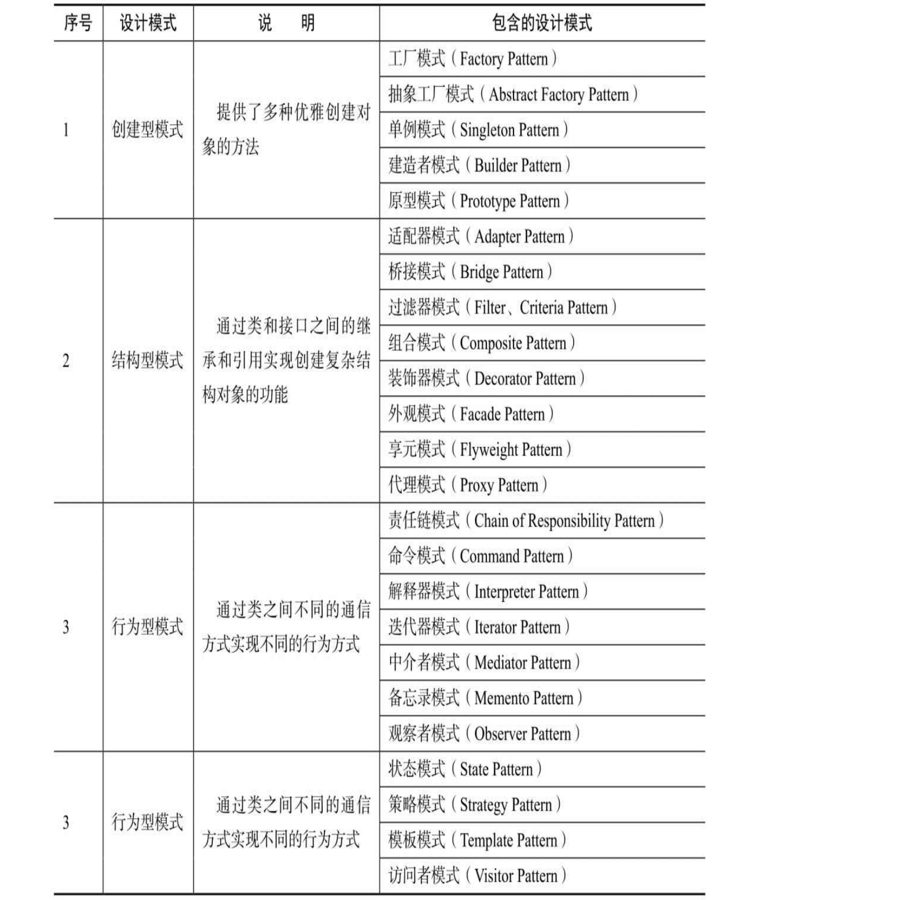
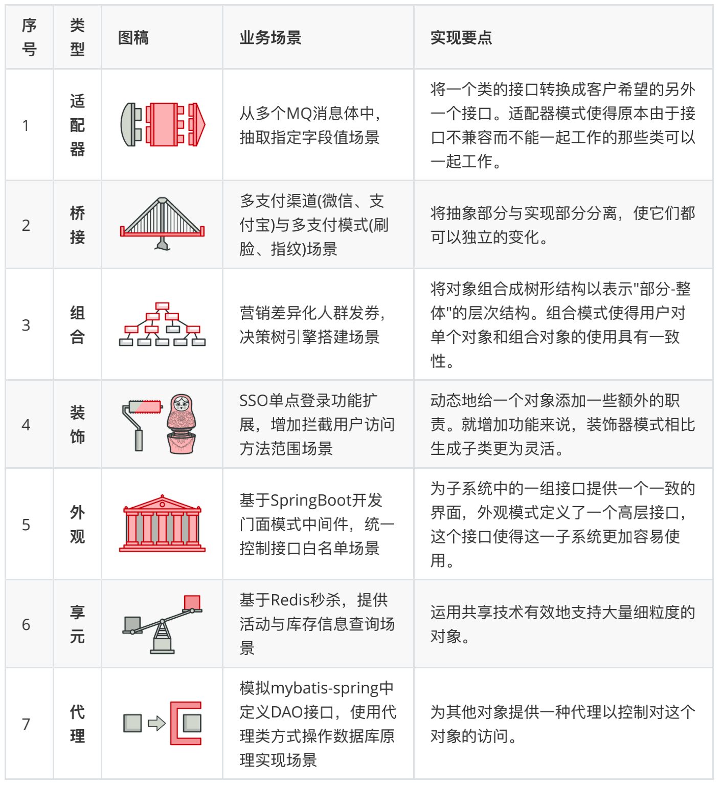

#

# 写在前面

## question

- （1）你开发中都用到了什么设计模式？ 
- （2）工厂模式的设计理念是什么？有什么好处？体现了什么编程思想？
- （3）适配器模式了解吗？策略和适配器模式有什么区别，你为什么选择用策略模式而不是适配器原因是什么？


## 推荐

- [《重学 Java 设计模式》](https://github.com/cat0501/Java_notes/blob/master/%E6%8E%A8%E8%8D%90%E8%B5%84%E6%96%99/%E8%AE%BE%E8%AE%A1%E6%A8%A1%E5%BC%8F.pdf)

- https://refactoringguru.cn/
  - 这是一本图文设计模式资料，里面的图稿非常助于理解。

- [菜鸟设计模式 - RUNOOB.COM](https://www.runoob.com/design-pattern/design-pattern-tutorial.html)
  - 菜鸟设计模式属于比较简单的资料内容，比较适合还没有接触过设计模式的研发人员。


## 六大原则

设计模式遵循六大原则

- 单一职责（一个类和方法只做一件事）
- 里式替换（多态，子类可扩展父类）
- 依赖倒置（细节依赖抽象，下层依赖上层）
- 接口隔离（建立单一接口）
- 迪米特原则（最少知道，降低耦合）
- 开闭原则（抽象架构，扩展实现）

会在具体的设计模式章节中，进行体现。





# 创建者模式（5类）

这类模式提供创建对象的机制， 能够提升已有代码的灵活性和可复用性。


## 1 工厂方法模式

- 工厂类根据不同的参数创建不同的实例
- 避免创建者与具体的产品逻辑耦合，满足单一职责，每一个业务逻辑实现都在所属自己的类中完成、满足开闭原则，无需更改使用调用方就可以在程序中引入新的产品类型。

### 前言

- 好的代码不只为了完成现有功能，也会考虑后续扩展。
  - 在结构设计上松耦合易读易扩展，在领域实现上高内聚不对外暴漏实现细节不被外部干扰。
  - 像家里三居(MVC)室、四居(DDD)室的装修，你不会允许几十万的房子把走线水管裸漏在外面，也不会允许把马桶放到厨房，炉灶安装到卫生间。

- 使用设计模式的思想去优化代码。

### 要点

- 工厂模式在接口中定义了创建对象的方法，而将具体的创建对象的过程在子类中实现，用户只需通过接口创建需要的对象即可，不用关注对象的具体创建过程。
  - 同时，不同的子类可根据需求灵活实现创建对象的不同方法。

### 业务场景：模拟发奖多种商品


- 假如现在我们有如下三种类型的商品接口；

| 序号 | 类型               | 接口                                                         |
| ---- | ------------------ | ------------------------------------------------------------ |
| 1    | 优惠券             | `CouponResult sendCoupon(String uId, String couponNumber, String uuid)` |
| 2    | 实物商品           | `Boolean deliverGoods(DeliverReq req)`                       |
| 3    | 第三方爱奇艺兑换卡 | `void grantToken(String bindMobileNumber, String cardId)`    |

- **从以上接口来看有如下信息：**

  - 三个接口返回类型不同，有对象类型、布尔类型、还有一个空类型。

  - 入参不同，发放优惠券需要仿重、兑换卡需要卡ID、实物商品需要发货位置(对象中含有)。

  - 另外可能会随着后续的业务发展，新增其他商品类型。因为你所有的开发需求都是随着业务对市场的拓展而带来的。

- 需求实现

  - 工程结构

  ```java
  itstack-demo-design-1-02
  └── src
      ├── main
      │   └── java
      │       └── org.itstack.demo.design
      │           ├── store    
      │           │   ├── impl
      │           │   │   ├── CardCommodityService.java
      │           │   │   ├── CouponCommodityService.java 
      │           │   │   └── GoodsCommodityService.java  
      │           │   └── ICommodity.java
      │           └── StoreFactory.java 
      └── test
           └── java
               └── org.itstack.demo.design.test
                   └── ApiTest.java
  ```

  - ① 定义发奖接口
    - 接口的入参包括；`用户ID`、`奖品ID`、`业务ID`以及`扩展字段`用于处理发放实物商品时的收获地址。

  ```java
  public interface ICommodity {
      void sendCommodity(String uId, String commodityId, String bizId, Map<String, String> extMap) throws Exception;
  }
  ```

  - ② 定义接口实现
    - 每一种奖品的实现都包括在自己的类中，新增、修改或者删除都不会影响其他奖品功能。
    - 后续新增的奖品只需要按照此结构进行填充即可，非常易于维护和扩展。

  ```java
  // 优惠券
  public class CouponCommodityService implements ICommodity {
  
      private Logger logger = LoggerFactory.getLogger(CouponCommodityService.class);
      private CouponService couponService = new CouponService();
  
      public void sendCommodity(String uId, String commodityId, String bizId, Map<String, String> extMap) throws Exception {
          //...
      }
  }
  
  // 实物商品
  public class GoodsCommodityService implements ICommodity {
      //...
      public void sendCommodity(String uId, String commodityId, String bizId, Map<String, String> extMap) throws Exception {
          //...
      }
  }
  
  // 第三方兑换卡
  public class CardCommodityService implements ICommodity {
      //...
      public void sendCommodity(String uId, String commodityId, String bizId, Map<String, String> extMap) throws Exception {
          //...
      }
  }
  ```

  - ③ 创建商店工厂

  ```java
  public class StoreFactory {
      public ICommodity getCommodityService(Integer commodityType) {
          if (null == commodityType) return null;
          if (1 == commodityType) return new CouponCommodityService();
          if (2 == commodityType) return new GoodsCommodityService();
          if (3 == commodityType) return new CardCommodityService();
          throw new RuntimeException("不存在的商品服务类型");
      }
  }
  ```

  - ④ 测试

  ```java
  @Test
  public void test_commodity() throws Exception {
      StoreFactory storeFactory = new StoreFactory();
      // 1. 优惠券
      ICommodity commodityService_1 = storeFactory.getCommodityService(1);
      commodityService_1.sendCommodity("10001", "EGM1023938910232121323432", "791098764902132", null);
      // 2. 实物商品
      ICommodity commodityService_2 = storeFactory.getCommodityService(2);
      
      Map<String,String> extMap = new HashMap<String,String>();
      extMap.put("consigneeUserName", "谢飞机");
      extMap.put("consigneeUserPhone", "15200292123");
      extMap.put("consigneeUserAddress", "吉林省.长春市.双阳区.XX街道.檀溪苑小区.#18-2109");
  
      commodityService_2.sendCommodity("10001","9820198721311","1023000020112221113", extMap);
      // 3. 第三方兑换卡(爱奇艺)
      ICommodity commodityService_3 = storeFactory.getCommodityService(3);
      commodityService_3.sendCommodity("10001","AQY1xjkUodl8LO975GdfrYUio",null,null);
  }
  ```

  

## 2 抽象工厂模式

- 在工厂模式上添加了一个创建不同工厂的抽象抽象类。
  - 使用时，先创建出不同的工厂对象；
  - 再根据不同的工厂对象创建不同的对象。


（1）手机接口及实现类定义

```java
public interface Phone {
    String call();
}

public class PhoneApple implements Phone {
    @Override
    public String call() {
        return "call somebody by apple phone";
    }
}

public class PhoneHuawei implements Phone {
    @Override
    public String call() {
        return "call somebody by huawei phone";
    }
}
```


（2）手机工厂类定义

```java
public class PhoneFactory extends AbstractFactory {

    public Phone createPhone(String phoneName) {
        if (phoneName.equals("HuaWei")) {
            return new PhoneHuawei();
        } else if (phoneName.equals("Apple")) {
            return new PhoneApple();
        } else {
            return null;
        }
    }

    @Override
    public Computer createComputer(String brand) {
        return null;
    }
}
```

（3）电脑接口及实现类定义

```java
public interface Computer {
    String internet();
}

public class ComputerApple implements Computer{
    @Override
    public String internet() {
        return "苹果电脑";
    }
}

public class ComputerHuawei implements Computer{
    @Override
    public String internet() {
        return "华为电脑";
    }
}
```

（4）电脑工厂类定义

```java
public class ComputerFactory extends AbstractFactory {
    @Override
    public Phone createPhone(String brand) {
        return null;
    }

    @Override
    public Computer createComputer(String brand) {
        if ("HuaWei".equals(brand)) {
            return new ComputerHuawei();
        } else if ("Apple".equals(brand)) {
            return new ComputerApple();
        } else {
            return null;
        }
    }
}
```

（5）抽象工厂类定义

```java
// 用户在需要手机时调用其createPhone()构造一个手机（华为或者苹 果品牌）即可，
// 用户在需要电脑时调用其createComputer()构造一个电脑（华为或者苹果品牌）即可。
public abstract class AbstractFactory {

    public abstract Phone createPhone(String brand);
    public abstract Computer createComputer(String brand);
}
```

（6）测试

```java
public class Test {
    // 使用工厂类
    // 在需要生产产品时，首先需要定义一个抽象的工厂类AbstractFactory，
    // 然后使用抽象的工厂类生产不同的工厂类，最终根据不同的工厂生产不同的产品。
    public static void main(String[] args) {

        // 工厂类1
        AbstractFactory phoneFactory = new PhoneFactory();
        Phone apple = phoneFactory.createPhone("Apple");
        Phone huaWei = phoneFactory.createPhone("HuaWei");
        System.out.println(apple.call());
        System.out.println(huaWei.call());

        // 工厂类2
        AbstractFactory computerFactory = new ComputerFactory();
        Computer computerApple = computerFactory.createComputer("Apple");
        Computer computerHuaWei = computerFactory.createComputer("HuaWei");
        System.out.println(computerApple.internet());
        System.out.println(computerHuaWei.internet());
    }
}
```


## 3 建造者模式


- 建造者模式（Builder Pattern）**使用多个简单的对象创建一个复杂的对象**，用于将一个复杂的构建与其表示分离，使得同样的构建过程可以创建不同的表示，然后通过一个Builder类（该Builder类是独立于其他对象的）创建最终的对象。
- 注意，建造者模式与工厂模式的最大区别是，建造者模式更关注**产品的组合方式和装配顺序**，而工厂模式关注产品的**生产本身**。

### 业务场景：装饰物料组合

- 装饰接口

```java
public interface IMenu {
    IMenu appendCeiling(Matter matter); // 吊顶
    IMenu appendCoat(Matter matter);    // 涂料
    IMenu appendFloor(Matter matter);   // 地板
    IMenu appendTile(Matter matter);    // 地砖
    String getDetail();                 // 明细 
}
```

- 装饰接口实现

- 建造者方法
  - 通过不同物料填充出不同的装修风格。后续可扩展！

```java
public class Builder {
    public IMenu levelOne(Double area) {
        return new DecorationPackageMenu(area, "豪华欧式")
                .appendCeiling(new LevelTwoCeiling())    // 吊顶，二级顶
                .appendCoat(new DuluxCoat())             // 涂料，多乐士
                .appendFloor(new ShengXiangFloor());     // 地板，圣象
    }

    public IMenu levelTwo(Double area){
        return new DecorationPackageMenu(area, "轻奢田园")
                .appendCeiling(new LevelTwoCeiling())   // 吊顶，二级顶
                .appendCoat(new LiBangCoat())           // 涂料，立邦
                .appendTile(new MarcoPoloTile());       // 地砖，马可波罗
    }

    public IMenu levelThree(Double area){
        return new DecorationPackageMenu(area, "现代简约")
                .appendCeiling(new LevelOneCeiling())   // 吊顶，二级顶
                .appendCoat(new LiBangCoat())           // 涂料，立邦
                .appendTile(new DongPengTile());        // 地砖，东鹏
    }
}
```

- 测试

```java
@Test
public void test_Builder(){
    Builder builder = new Builder();
    // 豪华欧式
    System.out.println(builder.levelOne(132.52D).getDetail());
    // 轻奢田园
    System.out.println(builder.levelTwo(98.25D).getDetail());
    // 现代简约
    System.out.println(builder.levelThree(85.43D).getDetail());
}
```


## 4 原型模式

- 主要解决的问题就是创建重复对象。
  - 创建对象有很多种方式，如构造方法、clone 方法、反射、序列化反序列化等，这里采取复制即 `clone() `的方法，比较节省时间。


## 5 单例模式

- 单例模式是保证实例唯一性的重要手段。

- 单例模式首先通过**将类的实例化方法私有化**来防止程序通过其他方式创建该类的实例，然后通过**提供一个全局唯一获取该类实例的方法**帮助用户获取类的实例，用户只需也只能通过调用该方法获取类的实例。

- 单例模式的常见写法有懒汉模式（线程安全）、饿汉模式、静态内部类、双重校验锁，如下。

### 5.1 懒汉模式（线程安全）

- 定义一个私有的静态对象 instance，之所以定义instance为静态，是因为静态属性或方法是属于类的，能够很好地保障单例对象的唯一性；
- 然后定义一个加锁的静态方法获取该对象，如果该对象为null，则定义一个对象实例并将其赋值给instance，这样下次再获取该对象时便能够直接获取了。
  - 懒汉模式在获取对象实例时做了加锁操作，因此是线程安全的。

```java
public class LazySingleton {
    // 定义一个私有的静态对象
    private static LazySingleton instance;

    public LazySingleton() {
    }

    // 懒汉模式在获取对象实例时做了加锁操作，因此是线程安全的
    public static synchronized LazySingleton getInstance() {
        if (instance == null) {
            instance = new LazySingleton();
        }
        return instance;
    }
}
```


### 5.2 饿汉模式

- 在类中**直接定义全局的静态对象的实例并初始化**，然后提供一个方法获取该实例对象。

- 在饿汉模式下，在 `Class Loader` 完成后该类的实例便已经存在于 JVM 中了。

```java
public class HungrySingleton {
    
    // 饿汉模式是在定义单例对象的同时将其实例化的，直接使用便可。
    // 也就是说，在饿汉模式下，在Class Loader完成后该类的实例便已经存在于JVM中了
    private static HungrySingleton instance = new HungrySingleton();

    public HungrySingleton() {
    }
    public static HungrySingleton getInstance() {
        return instance;
    }
}
```


### 5.3 静态内部类

- 在类中定义一个静态内部类，将对象实例的定义和初始化放在内部类中完成， 我们在获取对象时要通过静态内部类调用其单例对象。

- 之所以这样设计，是因为类的静态内部类在 JVM 中是唯一的，这很好地保障了单例对象的唯一性。

```java
// 之所以这样设计，是因为类的静态内部类在JVM中是唯一的，这很好地保障了单例对象的唯一性
public class Singleton {

    // 在类中定义一个静态内部类，将对象实例的定义和初始化放在内部类中完成
    private static class SingletonHolder {
        private static final Singleton INSTANCE = new Singleton();
    }

    public Singleton() {
    }

    public static final Singleton getInstance() {
        return SingletonHolder.INSTANCE;
    }
}
```


### 5.4 双重校验锁

- 在懒汉模式的基础上做进一步优化，给静态对象的定义加上 `volatile` 锁来保障初始化时对象的唯一性，在获取对象时通过 synchronized (Singleton.class) 给单例类加锁来保障操作的唯一性。

```java
public class Lock2Singleton {

    private volatile static Lock2Singleton singleton;//对象锁

    public Lock2Singleton() {
    }
    public static Lock2Singleton getInstance() {
        if (singleton == null) {
            synchronized (Lock2Singleton.class){//方法锁
                if (singleton == null){
                    singleton = new Lock2Singleton();
                }
            }
        }
        return singleton;
    }
}
```


# 结构型模式（7类）




## 6 代理模式⭐️

### 介绍

- 在代理模式下有两种角色，一种是被代理者，一种是代理（Proxy）。
  - 被代理者需要做一项工作时，不用自己做，而是交给代理做。

- 使用代理对象来代替对真实对象（real object）的访问，这样就可以在不修改原目标对象的前提下，提供额外的功能操作，扩展目标对象的功能。
  - 代理模式的主要作用是扩展目标对象的功能，比如说在目标对象的某个方法执行前后你可以增加一些自定义的操作。


- 举个例子：你找了小红来帮你问话，小红就可以看作是代理你的代理对象，代理的行为（方法）是问话。


- 分类
  - 静态代理
  - JDK / CGLIB 动态代理

- 动态代理
  - 相比于静态代理来说，动态代理更加灵活。我们不需要针对每个目标类都单独创建一个代理类，并且也不需要我们必须实现接口，我们可以直接代理实现类( CGLIB 动态代理机制)。
  - 从 JVM 角度来说，动态代理是在运行时动态生成类字节码，并加载到 JVM 中的。
  - 动态代理在我们日常开发中使用的相对较少，但是在框架中几乎是必用的一门技术。
    - 学会了动态代理之后，对于我们理解和学习各种框架的原理也非常有帮助。
    - 说到动态代理，Spring AOP、RPC 框架应该是两个不得不提的，它们的实现都依赖了动态代理。

### 静态代理


### JDK 动态代理

- 介绍
  -  `InvocationHandler` 接口和 `Proxy` 类是核心。

```java
// Proxy 类中使用频率最高的方法是：`newProxyInstance()` ，这个方法主要用来生成一个代理对象。

// loader：类加载器，用于加载代理对象
// interfaces: 被代理类实现的一些接口
// h: 实现了 `InvocationHandler` 接口的对象。
public static Object newProxyInstance(ClassLoader loader, 
                                      Class<?>[] interfaces,
                                      InvocationHandler h)
    throws IllegalArgumentException{
    //......
}
```


要实现动态代理的话，还必须需要实现`InvocationHandler` 来自定义处理逻辑。 <font color=red>当我们的动态代理对象调用一个方法时，这个方法的调用就会被转发到实现`InvocationHandler` 接口类的 `invoke` 方法来调用。</font>


```java
public interface InvocationHandler {

    /**
     * 当你使用代理对象调用方法的时候实际会调用到这个方法
     */
    // proxy：动态生成的代理类
    // method：与代理类对象调用的方法相对应
    // args：当前 method 方法的参数
    public Object invoke(Object proxy, Method method, Object[] args)
        throws Throwable;
}
```

也就是说：**你通过`Proxy` 类的 `newProxyInstance()` 创建的代理对象在调用方法的时候，实际会调用到实现`InvocationHandler` 接口的类的 `invoke()`方法。** 你可以在 `invoke()` 方法中自定义处理逻辑，比如在方法执行前后做什么事情。


- JDK 动态代理类使用步骤
  - 定义一个接口及其实现类；
  - 自定义` InvocationHandler `并重写`invoke`方法，在` invoke `方法中我们会调用原生方法（被代理类的方法）并自定义一些处理逻辑；
  - 通过` Proxy.newProxyInstance(ClassLoader loader,Class<?>[] interfaces,InvocationHandler h) `方法创建代理对象；


- 代码示例

  - 定义发送短信的接口

  ```java
  public interface SmsService {
      String send(String message);
  }
  ```

  - 实现发送短信的接口

  ```java
  public class SmsServiceImpl implements SmsService {
      public String send(String message) {
          System.out.println("send message:" + message);
          return message;
      }
  }
  ```

  - 定义一个 JDK 动态代理类

  ```java
  import java.lang.reflect.InvocationHandler;
  import java.lang.reflect.InvocationTargetException;
  import java.lang.reflect.Method;
  
  public class DebugInvocationHandler implements InvocationHandler {
  
      // 代理类中的真实对象
      private final Object target;
  
      public DebugInvocationHandler(Object target) {
          this.target = target;
      }
  	
  	/**当我们的动态代理对象调用原生方法的时候，最终实际上调用到的是 invoke() 方法，然后 invoke() 方法代替我们去调用了被代理对象的原生方法。
  	*/
      public Object invoke(Object proxy, Method method, Object[] args) throws InvocationTargetException, IllegalAccessException {
          //调用方法之前，我们可以添加自己的操作
          System.out.println("before method " + method.getName());
          
          Object result = method.invoke(target, args);
          
          //调用方法之后，我们同样可以添加自己的操作
          System.out.println("after method " + method.getName());
          return result;
      }
  }
  ```

  - 获取代理对象的工厂类

  ```java
  public class JdkProxyFactory {
      // 主要通过`Proxy.newProxyInstance（）`方法获取某个类的代理对象
      public static Object getProxy(Object target) {
          return Proxy.newProxyInstance(
                  target.getClass().getClassLoader(), // 目标类的类加载
                  target.getClass().getInterfaces(),  // 代理需要实现的接口，可指定多个
                  new DebugInvocationHandler(target)   // 代理对象对应的自定义 InvocationHandler
          );
      }
  }
  ```

  - 实际使用

  ```java
  SmsService smsService = (SmsService) JdkProxyFactory.getProxy(new SmsServiceImpl());
  smsService.send("java");
  ```

  - 运行上述代码之后，控制台打印出：

  ```java
  before method send
  send message:java
  after method send
  ```

  

###  CGLIB 动态代理

- 介绍

  - JDK 动态代理有一个最致命的问题是**其只能代理实现了接口的类**。
  -  `MethodInterceptor` 接口和 `Enhancer` 类是核心。
  - 你需要自定义 `MethodInterceptor` 并重写 `intercept()` 方法，`intercept()` 用于拦截增强被代理类的方法。
  - 你可以通过 `Enhancer` 类来动态获取被代理类，当代理类调用方法的时候，实际调用的是`MethodInterceptor` 中的 `intercept()` 方法。

  ```java
  public interface MethodInterceptor extends Callback{
      // 拦截增强被代理类中的方法
      
      // obj：被代理的对象（需要增强的对象）
  	// method：被拦截的方法（需要增强的方法）
  	// args：方法入参
  	// proxy：用于调用原始方法
      public Object intercept(Object obj, java.lang.reflect.Method method, Object[] args,
                                 MethodProxy proxy) throws Throwable;
  }
  ```

  

  - 不需要额外的依赖（不同于 JDK 动态代理）。[CGLIB](https://github.com/cglib/cglib)(*Code Generation Library*) 属于一个开源项目，如果你要使用它的话，需要手动添加相关依赖。

  ```xml
  <dependency>
    <groupId>cglib</groupId>
    <artifactId>cglib</artifactId>
    <version>3.3.0</version>
  </dependency>
  ```

- CGLIB 动态代理类使用步骤
  - 定义一个类；
  - 自定义 `MethodInterceptor` 并重写 `intercept()` 方法，`intercept()` 用于拦截增强被代理类的方法，和 JDK 动态代理中的 `invoke()` 方法类似；
  - 通过 `Enhancer` 类的 `create()`创建代理类；

- 代码示例

  - 实现一个使用阿里云发送短信的类

  ```java
  package github.javaguide.dynamicProxy.cglibDynamicProxy;
  
  public class AliSmsService {
      public String send(String message) {
          System.out.println("send message:" + message);
          return message;
      }
  }
  ```

  - 自定义 `MethodInterceptor`（方法拦截器）

  ```java
  import net.sf.cglib.proxy.MethodInterceptor;
  import net.sf.cglib.proxy.MethodProxy;
  
  import java.lang.reflect.Method;
  
  /**
   * 自定义MethodInterceptor
   */
  public class DebugMethodInterceptor implements MethodInterceptor {
  
      /**
       * @param o           代理对象（增强的对象）
       * @param method      被拦截的方法（需要增强的方法）
       * @param args        方法入参
       * @param methodProxy 用于调用原始方法
       */
      @Override
      public Object intercept(Object o, Method method, Object[] args, MethodProxy methodProxy) throws Throwable {
          //调用方法之前，我们可以添加自己的操作
          System.out.println("before method " + method.getName());
          
          Object object = methodProxy.invokeSuper(o, args);
          
          //调用方法之后，我们同样可以添加自己的操作
          System.out.println("after method " + method.getName());
          return object;
      }
  }
  ```

  

### 对比

- **JDK 动态代理只能代理实现了接口的类或者直接代理接口，而 CGLIB 可以代理未实现任何接口的类。** 另外， CGLIB 动态代理是通过生成一个被代理类的子类来拦截被代理类的方法调用，因此不能代理声明为 final 类型的类和方法。
- 就二者的效率来说，大部分情况都是 JDK 动态代理更优秀，随着 JDK 版本的升级，这个优势更加明显。


## 7 适配器模式

适配器模式主要通过 适配器类 实现各个接口之间的兼容，该类通过依赖注入或者继承实现各个接口的功能并对外统一提供服务。

### 类适配器模式

- 通过创建一个继承原有类（需要扩展的类）并实现新接口的适配器类来实现。

- 具体实现


```java
class Source{
    public void editTextFile(){
        System.out.println("a text file editing");// text文件编辑
    }
}
interface Targetable{
    void editTextFile();
    void editWordFile();
}
// 以完成对Source类的适配。适配后的类既可以编辑文本文件，也可以编辑Word文件。
class Adapter extends Source implements Targetable{

    @Override
    public void editWordFile() {
        System.out.println("a word file editing");
    }
}

// 使用类的适配器
public class AdapterPattern {
    public static void main(String[] args) {
        Targetable targetable = new Adapter();
        targetable.editTextFile();
        targetable.editWordFile();
    }
}
```

### 对象适配器模式

- 具体实现

```java
interface Targetable{
    void editTextFile();
    void editWordFile();
}
class Source{
    public void editTextFile(){
        System.out.println("a text file editing");// text文件编辑
    }
}

class ObjectAdapter implements Targetable{
    // Adapter不再继承Source类，而是持有Source类的实例，以解决兼容性问题。
    private Source source;
    public ObjectAdapter(Source source){
        super();
        this.source =source;
    }
    
    // 在适配editTextFile()的方法时调用Source实例提供的方法即可
    @Override
    public void editTextFile() {
        this.source.editTextFile();
    }
    @Override
    public void editWordFile() {
        System.out.println("a word file editing");
    }
}
```

### 接口适配器模式

- 在不希望实现一个接口中的所有方法时，可以创建一个抽象类 `AbstractAdapter` 实现所有方法，在使用时继承该抽象类按需实现方法即可。

- 具体实现

```java
interface Sourceable{
    void editTextFile();
    void editWordFile();
}

abstract class AbstractAdapter implements Sourceable{
    @Override
    public void editTextFile() {
    }
    @Override
    public void editWordFile() {
    }
}

// 按需实现方法即可
class SourceSub1 extends AbstractAdapter{
    @Override
    public void editTextFile() {
        System.out.println("a text file editing");
    }
}
class SourceSub2 extends AbstractAdapter{
    @Override
    public void editWordFile() {
        System.out.println("a word file editing");
    }
}
```


## 8 桥接模式

- 通过定义一个桥接者将抽象及其实现解耦，使二者可以根据需求独立变化。
- 我们常用的 `JDBC` 和 `DriverManager` 就使用了桥接模式，JDBC在连接数据库时，在各个数据库之间进行切换而不需要修改代码，因为 `JDBC` 提供了统一的接口，每个数据库都提供了各自的实现，**通过一个叫作数据库驱动的程序来桥接即可**。下面以数据库连接为例介绍桥接模式。

- 实现

```java
interface Driver{
    void executeSQL();
}
class MysqlDriver implements Driver{
    @Override
    public void executeSQL() {
        System.out.println("execute sql by mysql driver");//基于MySQL实现了其执行SQL语句的方法
    }
}
class OracleDriver implements Driver{
    @Override
    public void executeSQL() {
        System.out.println("execute sql by oracle driver");//基于Oracle实现了其执行SQL语句的方法
    }
}

abstract class DriverManagerBridge{
    private Driver driver;
    public void execute(){
        this.driver.executeSQL();
    }
    public Driver getDriver(){
        return driver;
    }
    public void setDriver(Driver driver){
        this.driver = driver;
    }
}
class MyDriverBridge extends DriverManagerBridge{
    public void execute(){
        getDriver().executeSQL();
    }
}

public class BridgePattern {
    public static void main(String[] args) {
        DriverManagerBridge driverManagerBridge = new MyDriverBridge();
        // 设置Mysql驱动
        driverManagerBridge.setDriver(new MysqlDriver());
        driverManagerBridge.execute();
        // 切换到Oracle驱动
        driverManagerBridge.setDriver(new OracleDriver());
        driverManagerBridge.execute();
    }
}
```


## 9 装饰器模式

- 指在无须改变原有类及类的继承关系的情况下，动态扩展一个类的功能。它通过装饰者来包裹真实的对象，并动态地向对象添加或者撤销功能。
- 实现

```java
interface Sourceable{
    public void createComputer();
}

class Source implements Sourceable{
    @Override
    public void createComputer() {
        System.out.println("create computer by Source");
    }
}
class Decorator implements Sourceable{
    private Sourceable source;
    // 装饰者类通过构造函数将Sourceable实例初始化到内部
    public Decorator(Sourceable source){
        super();
        this.source = source;
    }
    // 调用原方法后加上了装饰者逻辑
    @Override
    public void createComputer() {
        source.createComputer();
        System.out.println("make system");
    }
}
```


## 总结

代理、桥接、装饰器、适配器，这 4 种模式是比较常用的结构型设计模式。它们的代码结构非常相似。笼统来说，它们都可以称为 `Wrapper` 模式，也就是通过 Wrapper 类二次封装原始类，尽管代码结构相似，但这 4 种设计模式的用意完全不同，也就是说要解决的问题、应用场景不同：

- 适配器模式：适配器模式是一种事后的补救策略。适配器提供跟原始类不同的接口，而代理模式、装饰器模式提供的都是跟原始类相同的接口。
- 桥接模式：桥接模式的目的是将接口部分和实现部分分离，从而让它们可以较为容易、也相对独立地加以改变。


## 10 组合模式

- 可以统一单个对象和组合对象的处理逻辑。

- 实现：设计一个类来表示文件系统中的目录，能方便地实现下面这些功能
  - 动态地添加、删除某个目录下的子目录或文件；
  - 统计指定目录下的文件个数；
  - 统计指定目录下的文件总大小。

```java
public abstract class FileSystemNode {
    protected String path;
    public FileSystemNode(String path) {
        this.path = path;
    }
    public abstract int countNumOfFiles();
    public abstract long countSizeOfFiles();
    public String getPath() {
        return path;
    }
}
public class File extends FileSystemNode {
    public File(String path) {
        super(path);
    }
    @Override
    public int countNumOfFiles() {
        return 1;
    }
    @Override
    public long countSizeOfFiles() {
        java.io.File file = new java.io.File(path);
        if (!file.exists()) return 0;
        return file.length();
    }
}
public class Directory extends FileSystemNode {
    private List<FileSystemNode> subNodes = new ArrayList<>();
    public Directory(String path) {
        super(path);
    }
    @Override
    public int countNumOfFiles() {
        int numOfFiles = 0;
        for (FileSystemNode fileOrDir : subNodes) {
            numOfFiles += fileOrDir.countNumOfFiles();
        }
        return numOfFiles;
    }
    @Override
    public long countSizeOfFiles() {
        long sizeofFiles = 0;
        for (FileSystemNode fileOrDir : subNodes) {
            sizeofFiles += fileOrDir.countSizeOfFiles();
        }
        return sizeofFiles;
    }
    public void addSubNode(FileSystemNode fileOrDir) {
        subNodes.add(fileOrDir);
    }
    public void removeSubNode(FileSystemNode fileOrDir) {
        int size = subNodes.size();
        int i = 0;
        for (; i < size; ++i) {
            if (subNodes.get(i).getPath().equalsIgnoreCase(fileOrDir.getPath())) {
                break;
            }
        }
        if (i < size) {
            subNodes.remove(i);
        }
    }
}
```

文件和目录类都设计好了，继而使用它们来表示一个文件系统中的目录树结构。具体的代码示例如下所示：

```java
public class Demo {
    public static void main(String[] args) {
        /**
		 * /
		 * /wz/
		 * /wz/a.txt
		 * /wz/b.txt
		 * /wz/movies/
		 * /wz/movies/c.avi
		 * /xzg/
		 * /xzg/docs/
		 * /xzg/docs/d.txt
		 */
        Directory fileSystemTree = new Directory("/");
        Directory node_wz = new Directory("/wz/");
        Directory node_xzg = new Directory("/xzg/");
        fileSystemTree.addSubNode(node_wz);
        fileSystemTree.addSubNode(node_xzg);
        
        File node_wz_a = new File("/wz/a.txt");
        File node_wz_b = new File("/wz/b.txt");
        Directory node_wz_movies = new Directory("/wz/movies/");
        node_wz.addSubNode(node_wz_a);
        node_wz.addSubNode(node_wz_b);
        node_wz.addSubNode(node_wz_movies);
        
        File node_wz_movies_c = new File("/wz/movies/c.avi");
        node_wz_movies.addSubNode(node_wz_movies_c);
        Directory node_xzg_docs = new Directory("/xzg/docs/");
        node_xzg.addSubNode(node_xzg_docs);
        File node_xzg_docs_d = new File("/xzg/docs/d.txt");
        node_xzg_docs.addSubNode(node_xzg_docs_d);
        
        System.out.println("/ files num:" + fileSystemTree.countNumOfFiles());
        System.out.println("/wz/ files num:" + node_wz.countNumOfFiles());
    }
}
```

- 组合模式，将一组对象组织成树形结构，将单个对象和组合对象都看做树中的节点，以统一处理逻辑，并且它利用树形结构的特点，递归地处理每个子树，依次简化代码实现。使用组合模式的前提在于，业务场景必须能够表示成树形结构。所以，组合模式的应用场景也比较局限，它并不是一种很常用的设计模式。


## 11 外观模式（门面模式）

- 将多个子系统及其之间的复杂关系和调用流程封装到一个统一的接口或类中以对外提供服务。

- 实现

```java
class Dashboard{ //仪表盘的启动和关闭
    public void startup(){
        System.out.println("dashboard startup...");
    }
    public void shutdown(){
        System.out.println("dashboard shutdown...");
    }
}
class Engine{ //发动机的启动和关闭
    public void startup(){
        System.out.println("engine startup...");
    }
    public void shutdown(){
        System.out.println("engine shutdown...");
    }
}
class SelfCheck{ // 汽车启动后的自检和关闭前的自检
    public void startupCheck(){
        System.out.println("startup check finished...");
    }
    public void shutdownCheck(){
        System.out.println("shutdown check finished...");
    }
}

class Starter{ // 门面类
    private Dashboard dashboard;
    private Engine engine;
    private SelfCheck selfCheck;
    public Starter(){
        this.dashboard = new Dashboard();
        this.engine = new Engine();
        this.selfCheck = new SelfCheck();
    }
    public void startup(){
        System.out.println("car startup");
        engine.startup();//先调用engine的启动方法 启动引擎
        dashboard.startup();// 再调用dashboard的启动方法 启动仪表盘
        selfCheck.startupCheck();// 最后调用selfCheck的启动自检方法完成 启动自检
        System.out.println("car startup finished");
    }
    public void shutdown(){
        System.out.println("car shutdown");
        engine.shutdown();
        dashboard.shutdown();
        selfCheck.shutdownCheck();
        System.out.println("car shutdown finished");
    }
}

public class FacadePattern {
    public static void main(String[] args) {
        Starter starter = new Starter();
        starter.startup(); // 调用封装好的方法或接口即可
        starter.shutdown();
    }
}
```


## 12 享元模式


# 行为模式（10类）


## 13 责任链模式


## 14 命令模式

## 15 迭代器模式

## 16 中介者模式

## 17 备忘录模式

## 18 观察者模式

## 19 状态模式

## 20 策略模式

## 21 模板模式

## 22 访问者模式


