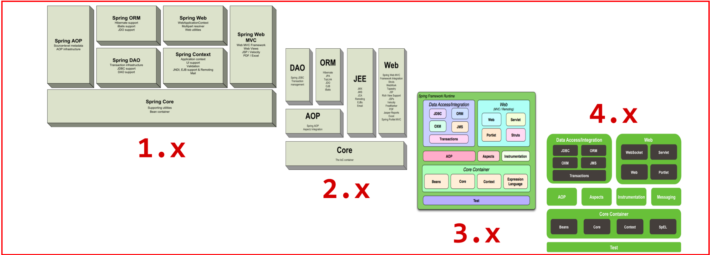

# 

# 写在前面

## question


```bash
# 容器与bean（01-08）

@Autowired 先按照类型
@Resource 按照 bean名字

# AOP（09-19）


# Web MVC（20-36）


# Spring Boot（37-42）


# 其它（43-49）
```


## 推荐

### 黑马程序员

[spring 高级49讲220323](https://www.bilibili.com/video/BV1P44y1N7QG?spm_id_from=333.999.0.0)

- 整个 Java 体系最核心的框架，没有之一	

- 面试必备 / 热点（从Spring的核心原理，到SpringMVC的执行流程，再到SpringBoot的自动配置）

- 技术、思想提升（大量设计模式的应用和体现）（应用了很多技术）


- 步骤（重在梳理线索，源码自己阅读）
  - 了解欲研究的组件（类）的基本使用
  - 用单元测试研究组件的特性
  - 试着自己实现类似功能
  - 最后再深入阅读该组件的源码
- 内容（五大篇章，49讲）
  - 容器与Bean（1-8）
  - AOP（9-19）
  - Web MVC（20-36）
  - Spring Boot（37-42）
  - 其它（43-49）


[黑马程序员20220420最新SSM框架教程_Spring+SpringMVC+Maven高级+SpringBoot+MyBatisPlus企业实用开发技术](https://www.bilibili.com/video/BV1Fi4y1S7ix?spm_id_from=333.999.0.0)


### 官方文档

`spring4`官方文档

https://docs.spring.io/spring-framework/docs/4.3.9.RELEASE/spring-framework-reference/html/overview.html

`spring5.2.19` 官方文档

https://docs.spring.io/spring-framework/docs/5.2.19.RELEASE/spring-framework-reference/index.html


### 极客时间丁雪丰


<br>


```bash
掌握Spring相关概念
完成IOC/DI的入门案例编写
掌握IOC的相关配置与使用
掌握DI的相关配置与使用
```


# 一、Spring相关概念

## 1 介绍

### 1.1 为什么学

- Spring技术是JavaEE开发必备技能，企业开发技术选型命中率>90%

- 专业角度
  - **简化开发**，降低企业级开发的复杂性
  - **框架整合**，高效整合其它技术，提高企业级应用开发与运行效率

### 1.2 学什么

Spring 框架的主要优势在于简化开发和框架整合上

```bash
# 简化开发
- IOC
- AOP
	- 事务处理（Spring中AOP的具体应用，可以简化项目中的事务管理，也是Spring技术中的一大亮点。事务处理更简单更高效更强大。）

# 框架整合（Spring在框架整合这块已经做到了极致，它可以整合市面上几乎所有主流框架）
- MyBatis
- MyBatis-plus
- Struts
- Struts2
- Hibernate

# 综上，主要分为4部分
(1)IOC
(2)整合Mybatis(IOC的具体应用)
(3)AOP
(4)声明式事务(AOP的具体应用)
```

### 1.3 怎么学

```bash
# 学习Spring框架设计思想
对于Spring来说，它能迅速占领全球市场，不只是说它的某个功能比较强大，更重要是在它的思想上。
# 学习基础操作，思考操作与思想间的联系
掌握了Spring的设计思想，然后就需要通过一些基础操作来思考操作与思想之间的关联关系。
# 学习案例，熟练应用操作的同时，体会思想
会了基础操作后，就需要通过大量案例来熟练掌握框架的具体应用，加深对设计思想的理解。
```


## 2 Spring家族和Spring发展史

官网：https://spring.io/


重点关注 Spring Framework、SpringBoot和 SpringCloud :


```bash
# Spring Framework:Spring框架，是Spring中最早最核心的技术，也是所有其他技术的基础。
Spring最早出现的技术，本笔记的内容。
Spring全家桶中的地位：其它所有的技术都是依赖它执行的，是一个底层的框架，是一个设计型的框架，具有举足轻重的地位。

# SpringBoot:Spring是来简化开发，而SpringBoot是来帮助Spring在简化的基础上能更快速进行开发。
简化开发的基础上加速开发，提高开发速度。

# SpringCloud:这个是用来做分布式之微服务架构的相关开发。
分布式开发技术

# 还有很多其他的技术，也比较流行，如SpringData,SpringSecurity等，这些都可以被应用在我们的项目中。
# 我们今天所学习的Spring其实指的是Spring Framework。
```


```bash
# Spring1.0是[ 纯配置文件] 开发
# Spring2.0为了简化开发[ 引入了注解开发 ]，此时是配置文件加注解的开发方式
# Spring3.0已经可以进行[ 纯注解开发 ]，使开发效率大幅提升，我们的课程会以注解开发为主
# Spring4.0根据JDK的版本升级对个别API进行了调整

# Spring5.0已经全面支持JDK8，现在Spring最新的是5系列所以建议大家把JDK安装成1.8版
```


## 3 Spring系统架构



Spring Framework的5版本目前没有最新的架构图，而最新的是4版本，所以接下来主要研究的是4的架构图


```bash
# Core Container核心层
核心容器，这个模块是Spring最核心的模块，其他的都需要依赖该模块

# AOP层
AOP:面向切面编程（设计概念），它依赖核心层容器，目的是在不改变原有代码的前提下对其进行功能增强
Aspects:AOP是思想,Aspects是对AOP思想的具体实现

Spring：Aspects已经做的非常好了，告诉大家Aspects比我做得好，建议大家使用Aspects。
所以后面开发的时候，大家发现，除了要导AOP的坐标，还要导Aspects的坐标。

# 数据层
Data Access:数据访问，Spring全家桶中有对数据访问的具体实现技术
Data Integration:数据集成，Spring支持整合其他的数据层解决方案，比如Mybatis
Transactions:事务，Spring中事务管理是Spring AOP的一个具体实现，也是后期学习的重点内容

事务这一块做了非常大的突破，提供了效率非常高的事务控制方案。

# web层
这一层的内容将在SpringMVC框架具体学习

# test层
Spring主要整合了Junit来完成单元测试和集成测试

架构图讲究上层依赖下层，如AOP依赖核心容器的执行
```


## 4 Spring核心概念

目前项目中的问题：

- 耦合度偏高


针对这个问题，该如何解决呢?


```bash
我们就想，如果能把框中的内容给去掉，不就可以降低依赖了么，但是又会引入新的问题，去掉以后程序能运行么?
答案肯定是不行，因为bookDao没有赋值为Null，强行运行就会出空指针异常。

所以现在的问题就是，业务层不想new对象，运行的时候又需要这个对象，该咋办呢?
针对这个问题，Spring就提出了一个解决方案:
- 使用对象时，在程序中不要主动使用new产生对象，转换为由外部提供对象
```


提出一个概念必定要解决一些问题，针对如上问题有下面3个关键性概念：

### IoC（Inversion of Control）（由IOC容器提供对象）/DI

### IoC容器

### Bean

IoC（Inversion of Control）控制反转

- 使用对象时，由主动new产生对象转换为由**外部**提供对象，此过程中对象创建控制权由程序转移到外部，此思想称为控制反转。

Spring技术对IOC思想进行了实现

- Spring提供了一个容器，称为**IOC容器**，用来充当IOC思想中的"外部"

- IOC容器负责对象的创建、初始化等一系列工作，被创建或被管理的对象在IOC容器中统称为**Bean**

DI（Dependency Injection）依赖注入

- 在容器中建立bean与bean之间的依赖关系的整个过程，称为依赖注入


```bash
# 目标：充分解耦
使用IOC容器管理bean（IOC)
在IOC容器内将有依赖关系的bean进行关系绑定（DI）

# 最终效果
使用对象时不仅可以直接从IOC容器中获取，并且获取到的bean已经绑定了所有的依赖关系
```


# 二、入门案例

## 5 IOC入门案例

IOC思路分析

```bash
# 1.管理什么？（Service与Dao）
# 2.如何将被管理的对象告知IoC容器？（配置）
# 3.被管理的对象交给IoC容器，如何获取到IoC容器？（接口）
# 4.IoC容器得到后，如何从坐标中获取IoC容器？（接口方法）
# 5.使用Spring导入哪些坐标？（pom.xml）
```


## 6 DI入门案例

DI思路分析

```bash
# 1.基于IOC管理Bean
# 2.Service中使用new形式创建的Dao对象是否保留?（否）
# 3.Service中需要的Dao对象如何进入到Service中?（提供方法）
# 4.Service与Dao间的关系如何描述?（配置）
```


代码详见 spring_01_quickstart

```java
// 1.导入spring的坐标spring-context，对应版本是5.2.10.RELEASE
// 添加spring配置文件applicationContext.xml，并完成bean的配置
<!--2.配置bean-->
<!--bean标签表示配置bean
id属性表示给bean起名字
class属性表示给bean定义类型-->
<bean id="bookDao" class="com.itheima.dao.impl.BookDaoImpl"/>
  
<bean id="bookService" class="com.itheima.service.impl.BookServiceImpl">
    <!--7.配置server与dao的关系-->
    <!--property标签表示配置当前bean的属性
    name属性表示配置哪一个具体的属性
    ref属性表示参照哪一个bean-->
    <property name="bookDao" ref="bookDao"/>
</bean>

// 3.获取IoC容器
 ApplicationContext ctx = new ClassPathXmlApplicationContext("applicationContext.xml");
// 4.获取bean（根据bean配置id获取）
BookService bookService = (BookService) ctx.getBean("bookService");
bookService.save();

public class BookServiceImpl implements BookService {
    // DI入门案例部分开始
    //5.删除业务层中使用new的方式创建的dao对象
    private BookDao bookDao;

    public void save() {
        System.out.println("book service save ...");
        bookDao.save();
    }
    //6.提供对应的set方法
    public void setBookDao(BookDao bookDao) {
        this.bookDao = bookDao;
    }
}
```


# 三、IoC/DI相关内容

## 7 IOC相关内容

### 7.1 bean基础配置

获取 `bean` 无论是通过 `id` 还是 `name` 获取，如果无法获取到，将抛出异常  `NoSuchBeanDefinitionException`


#### 7.1.1 bean基础配置（id与class）

bean标签的功能、使用方式以及id和class属性的作用，我们通过一张图来描述下


```bash
# class 属性能不能写接口如BookDao的类全名呢?
不行，因为接口是没办法创建对象的。

# 前面提过为bean设置id时，id必须唯一，但是如果由于命名习惯而产生了分歧后，该如何解决?
配置别名
```

#### 7.1.2 bean 的name 属性指定别名

```xml
<!--name:为bean指定别名，别名可以有多个，使用逗号，分号，空格进行分隔-->
<bean id="bookService" name="service service4 bookEbi" class="com.itheima.service.impl.BookServiceImpl">
    <property name="bookDao" ref="bookDao"/>
</bean>
```


#### 7.1.3 bean作用范围scope配置

```xml
<!--scope：为bean设置作用范围，可选值为单例singloton，非单例prototype-->
<bean id="bookDao" name="dao" class="com.itheima.dao.impl.BookDaoImpl" scope="prototype"/>
```


```bash
# 为什么bean默认为单例?
bean为单例即在 Spring 的 IOC 容器中只会有该类的一个对象
bean对象只有一个就避免了对象的频繁创建与销毁，达到了bean对象的复用，性能高

# 哪些bean对象适合交给容器进行管理?
表现层对象
业务层对象
数据层对象
工具对象

# 哪些bean对象不适合交给容器进行管理?
封装实例的域对象，因为会引发线程安全问题，所以不适合。
```


### 7.2 bean实例化

`bean` 本质上就是对象，对象在 `new` 的时候会使用构造方法完成，那创建 `bean` 也是使用构造方法完成的。

- 构造方法（常用）
- 静态工厂（了解）
- 实例工厂（了解）
	- FactoryBean（实用）


代码详见 spring_03_bean_instance

#### 7.2.1 方法1：构造方法（常用）

```java
public class BookDaoImpl implements BookDao {
    // 类中提供构造函数测试
    public BookDaoImpl() {
        System.out.println("book dao constructor is running ....");
    }

    public void save() {
        System.out.println("book dao save ...");
    }

}
```

Spring 底层用的是反射。底层使用类的无参构造方法。

> 因为每一个类默认都会提供一个无参构造函数，所以真正在使用这种方式的时候，我们什么也不需要做。这也是我们以后比较常用的一种方式。

分析Spring的错误信息时：错误信息从下往上依次查看，因为上面的错误大都是对下面错误的一个包装，最核心错误是在最下面。


#### 7.2.2 方法2：静态工厂（了解）

```java
//静态工厂创建对象
public class OrderDaoFactory {
    public static OrderDao getOrderDao(){
        System.out.println("factory setup....");
        return new OrderDaoImpl();
    }
}
```

在 `Spring` 的配置文件 `applicationContext.xml` 中

```xml
<!--方式二：使用静态工厂实例化bean-->
<bean id="orderDao" class="com.itheima.factory.OrderDaoFactory" factory-method="getOrderDao"/>
```


这种方式一般是用来兼容早期的一些老系统，了解为主。


#### 7.2.3 方法3：使用实例工厂实例化bean（了解）

```java
//实例工厂创建对象
public class UserDaoFactory {
    public UserDao getUserDao(){
        return new UserDaoImpl();
    }
}
```

配置

```xml
<!--方式三：使用实例工厂实例化bean-->
<bean id="userFactory" class="com.itheima.factory.UserDaoFactory"/>
<bean id="userDao" factory-method="getUserDao" factory-bean="userFactory"/>
```

配置过程复杂，所以 `Spring` 为了简化这种配置方式就提供了一种叫 `FactoryBean` 的方式来简化开发。


#### 7.2.4 方法4：使用FactoryBean实例化bean（务必掌握）

```java
//FactoryBean创建对象
public class UserDaoFactoryBean implements FactoryBean<UserDao> {
    //代替原始实例工厂中创建对象的方法
    public UserDao getObject() throws Exception {
        return new UserDaoImpl();
    }
		// bean类型
    public Class<?> getObjectType() {
        return UserDao.class;
    }
}
```

配置

```xml
<!--方式四：使用FactoryBean实例化bean-->
<bean id="userDao" class="com.itheima.factory.UserDaoFactoryBean"/>
```


这种方式在 `Spring` 去整合其他框架的时候会被用到，所以这种方式需要理解掌握。


### 7.3 bean的生命周期

主要是bean生命周期控制

```bash
# 生命周期
从创建到消亡的完整过程

# bean生命周期
bean对象从创建到销毁的整体过程

# bean生命周期控制
在bean创建后到销毁前做一些事情
```

添加初始化和销毁方法

```java
public class BookDaoImpl implements BookDao {
    public void save() {
        System.out.println("book dao save ...");
    }
    //表示bean初始化后对应的操作
    public void init(){
        System.out.println("init...");
    }
    //表示bean销毁前对应的操作
    public void destroy(){
        System.out.println("destroy...");
    }
}
```

配置生命周期

```xml
<!--init-method：设置bean初始化生命周期回调函数-->
<!--destroy-method：设置bean销毁生命周期回调函数，仅适用于单例对象-->
<bean id="bookDao" class="com.itheima.dao.impl.BookDaoImpl" init-method="init" destroy-method="destroy"/>
```


测试

```bash
# 从结果中可以看出，init方法执行了，但是destroy方法却未执行，这是为什么呢?
- Spring的IOC容器是运行在JVM中
- 运行main方法后,JVM启动,Spring加载配置文件生成IOC容器,从容器获取bean对象，然后调方法执行
- main方法执行完后，JVM退出，这个时候IOC容器中的bean还没有来得及销毁就已经结束了
- 所以没有调用对应的destroy方法

# 知道了出现问题的原因，具体该如何解决呢?
- ApplicationContext中没有close方法,需要将ApplicationContext更换成ClassPathXmlApplicationContext,
调用ctx的close()方法
- 调用ctx的registerShutdownHook()方法
在容器未关闭之前，提前设置好回调函数，让JVM在退出之前回调此函数来关闭容器
```


```java
public class AppForLifeCycle {
    public static void main( String[] args ) {
        ClassPathXmlApplicationContext ctx = new ClassPathXmlApplicationContext("applicationContext.xml");

        BookDao bookDao = (BookDao) ctx.getBean("bookDao");
        bookDao.save();
        //注册关闭钩子函数，在虚拟机退出之前回调此函数，关闭容器
        //ctx.registerShutdownHook();
        //关闭容器
        ctx.close();
    }
}
```


```bash
# 分析上面的实现过程，会发现添加初始化和销毁方法，即需要编码也需要配置，实现起来步骤比较多也比较乱。
# Spring提供了两个接口来完成生命周期的控制，好处是可以不用再进行配置init-method和 destroy-method
修改BookServiceImpl类，添加两个接口InitializingBean， DisposableBean
并实现接口中的两个方法afterPropertiesSet和destroy
```

实现2个接口

```java
public class BookServiceImpl implements BookService, InitializingBean, DisposableBean {
    private BookDao bookDao;

    public void setBookDao(BookDao bookDao) {
        System.out.println("set .....");
        this.bookDao = bookDao;
    }

    public void save() {
        System.out.println("book service save ...");
        bookDao.save();
    }

    public void destroy() throws Exception {
        System.out.println("service destroy");
    }

    public void afterPropertiesSet() throws Exception {
        System.out.println("service init");
    }
}
```

输出

```bash
init...
set .....
service init
book dao save ...
service destroy
destroy...
```


总结一下：

```bash
初始化容器
1.创建对象(内存分配)
2.执行构造方法
3.执行属性注入(set操作)
4.[ 执行bean初始化方法 ]
使用bean
1.执行业务操作
关闭/销毁容器
1.[ 执行bean销毁方法 ]
```


## 8 DI相关内容

第二个大的模块 `DI` 依赖注入

```bash
# 思考🤔：向一个类中传递数据的方式有几种?
- 普通方法(set方法)
- 构造方法

# 思考🤔：依赖注入描述了在容器中建立bean与bean之间的依赖关系的过程，如果bean运行需要的是数字或字符串呢?
- 引用类型
- 简单类型(基本数据类型与String)

# Spring就是基于上面这些知识点，为我们提供了两种注入方式，分别是:
- setter注入
	-简单类型
	-引用类型

- 构造器注入
	-简单类型
	-引用类型
```


### 8.1 setter注入 property

#### 注入引用数据类型

步骤1：声明属性并提供setter方法

```java
public class BookServiceImpl implements BookService{
    private BookDao bookDao;
    private UserDao userDao;
    //setter注入需要提供要注入对象的set方法
    public void setUserDao(UserDao userDao) {
        this.userDao = userDao;
    }
    //setter注入需要提供要注入对象的set方法
    public void setBookDao(BookDao bookDao) {
        this.bookDao = bookDao;
    }

    public void save() {
        System.out.println("book service save ...");
        bookDao.save();
        userDao.save();
    }
}
```

步骤2：配置文件中进行注入配置

```xml
<!--注入简单类型-->
<bean id="bookDao" class="com.itheima.dao.impl.BookDaoImpl"/>
<bean id="userDao" class="com.itheima.dao.impl.UserDaoImpl"/>

<!--注入引用类型-->
<bean id="bookService" class="com.itheima.service.impl.BookServiceImpl">
  <!--property标签：设置注入属性-->
  <!--name属性：设置注入的属性名，实际是set方法对应的名称-->
  <!--ref属性：设置注入引用类型bean的id或name-->
  <property name="bookDao" ref="bookDao"/>
  <property name="userDao" ref="userDao"/>
</bean>
```


#### 注入基本数据类型

步骤1：声明属性并提供setter方法

```java
public class BookDaoImpl implements BookDao {

    private String databaseName;
    private int connectionNum;
    //setter注入需要提供要注入对象的set方法
    public void setConnectionNum(int connectionNum) {
        this.connectionNum = connectionNum;
    }
    //setter注入需要提供要注入对象的set方法
    public void setDatabaseName(String databaseName) {
        this.databaseName = databaseName;
    }

    public void save() {
        System.out.println("book dao save ..."+databaseName+","+connectionNum);
    }
}
```


步骤2：配置文件中进行注入配置

```xml
    <!--注入简单类型-->
    <bean id="bookDao" class="com.itheima.dao.impl.BookDaoImpl">
        <!--property标签：设置注入属性-->
        <!--name属性：设置注入的属性名，实际是set方法对应的名称-->
        <!--value属性：设置注入简单类型数据值-->
        <property name="connectionNum" value="100"/>
        <property name="databaseName" value="mysql"/>
    </bean>

    <bean id="userDao" class="com.itheima.dao.impl.UserDaoImpl"/>

    <!--注入引用类型-->
    <bean id="bookService" class="com.itheima.service.impl.BookServiceImpl">
        <!--property标签：设置注入属性-->
        <!--name属性：设置注入的属性名，实际是set方法对应的名称-->
        <!--ref属性：设置注入引用类型bean的id或name-->
        <property name="bookDao" ref="bookDao"/>
        <property name="userDao" ref="userDao"/>
    </bean>
```


需要注意的是：

```bash
- 对于引用数据类型使用的是<property name="" ref=""/>
- 对于简单数据类型使用的是<property name="" value=""/>
```


### 8.2 构造器（构造方法）注入 constructor-arg

#### 构造器注入引用数据类型

#### 构造器注入多个引用数据类型

步骤1：删除setter方法并提供构造方法

```java
public class BookServiceImpl implements BookService{
    private BookDao bookDao;
    private UserDao userDao;

    public BookServiceImpl(BookDao bookDao, UserDao userDao) {
        this.bookDao = bookDao;
        this.userDao = userDao;
    }

    public void save() {
        System.out.println("book service save ...");
        bookDao.save();
        userDao.save();
    }
}
```


步骤2：配置文件中进行配置构造方式注入

```xml
<!--解决参数类型重复问题，使用位置解决参数匹配-->
<bean id="bookDao" class="com.itheima.dao.impl.BookDaoImpl"/>
<bean id="userDao" class="com.itheima.dao.impl.UserDaoImpl"/>

<bean id="bookService" class="com.itheima.service.impl.BookServiceImpl">
  <constructor-arg name="userDao" ref="userDao"/>
  <constructor-arg name="bookDao" ref="bookDao"/>
</bean>
```

- name属性对应的值为构造函数中方法形参的参数名，必须要保持一致。
- ref属性指向的是spring的IOC容器中其他bean对象。


#### 构造器注入多个简单数据类型

步骤1：添加多个简单属性并提供构造方法

```java
public class BookDaoImpl implements BookDao {
    private String databaseName;
    private int connectionNum;

    public BookDaoImpl(String databaseName, int connectionNum) {
        this.databaseName = databaseName;
        this.connectionNum = connectionNum;
    }

    public void save() {
        System.out.println("book dao save ..."+databaseName+","+connectionNum);
    }
}
```

步骤2：配置完成多个属性构造器注入

```xml
<!--
    标准书写
    <bean id="bookDao" class="com.itheima.dao.impl.BookDaoImpl">
        根据构造方法参数名称注入
        <constructor-arg name="connectionNum" value="10"/>
        <constructor-arg name="databaseName" value="mysql"/>
    </bean>
    <bean id="userDao" class="com.itheima.dao.impl.UserDaoImpl"/>

    <bean id="bookService" class="com.itheima.service.impl.BookServiceImpl">
        <constructor-arg name="userDao" ref="userDao"/>
        <constructor-arg name="bookDao" ref="bookDao"/>
    </bean>
-->
<!--
    解决形参名称的问题，与形参名不耦合
    <bean id="bookDao" class="com.itheima.dao.impl.BookDaoImpl">
        根据构造方法参数类型注入
        <constructor-arg type="int" value="10"/>
        <constructor-arg type="java.lang.String" value="mysql"/>
    </bean>
    <bean id="userDao" class="com.itheima.dao.impl.UserDaoImpl"/>

    <bean id="bookService" class="com.itheima.service.impl.BookServiceImpl">
        <constructor-arg name="userDao" ref="userDao"/>
        <constructor-arg name="bookDao" ref="bookDao"/>
    </bean>-->

    <!--解决参数类型重复问题，使用位置解决参数匹配-->
    <bean id="bookDao" class="com.itheima.dao.impl.BookDaoImpl">
        <!--根据构造方法参数位置注入-->
        <constructor-arg index="0" value="mysql"/>
        <constructor-arg index="1" value="100"/>
    </bean>
    <bean id="userDao" class="com.itheima.dao.impl.UserDaoImpl"/>

    <bean id="bookService" class="com.itheima.service.impl.BookServiceImpl">
        <constructor-arg name="userDao" ref="userDao"/>
        <constructor-arg name="bookDao" ref="bookDao"/>
    </bean>
</beans>
```


上面已经完成了构造函数注入的基本使用，但是会存在一些问题：


- 当构造函数中方法的参数名发生变化后，配置文件中的name属性也需要跟着变
- 这两块存在紧耦合，具体该如何解决?


在解决这个问题之前，需要提前说明的是，这个参数名发生变化的情况并不多，所以上面的还是比较主流的配置方式，下面介绍的，大家

都以了解为主。

```bash
# 方式一:删除name属性，添加type属性，按照类型注入
- 这种方式可以解决构造函数形参名发生变化带来的耦合问题
- 但是如果构造方法参数中有类型相同的参数，这种方式就不太好实现了
# 方式二:删除type属性，添加index属性，按照索引下标注入，下标从0开始
- 这种方式可以解决参数类型重复问题
- 但是如果构造方法参数顺序发生变化后，这种方式又带来了耦合问题
```

介绍完两种参数的注入方式，具体我们该如何选择呢? 

```bash
# 1.强制依赖使用构造器进行，使用setter注入有概率不进行注入导致null对象出现
- 强制依赖指对象在创建的过程中必须要注入指定的参数
# 2.可选依赖使用setter注入进行，灵活性强
- 可选依赖指对象在创建过程中注入的参数可有可无
# 3.Spring框架倡导使用构造器，第三方框架内部大多数采用构造器注入的形式进行数据初始化，相对严谨
# 4.如果有必要可以两者同时使用，使用构造器注入完成强制依赖的注入，使用setter注入完成可选依赖的注入
# 5.实际开发过程中还要根据实际情况分析，如果受控对象没有提供setter方法就必须使用构造器注入

# 6.[ 自己开发的模块推荐使用setter注入 ]
```


### 8.3 自动配置 autowire属性

以上的 Spring 注入，很麻烦。


#### 8.3.1 什么是依赖自动装配?

`IoC` 容器根据 `bean` 所依赖的资源在容器中自动查找并注入到 `bean` 中的过程，称为自动装配。


#### 8.3.2 自动装配方式有哪些？

- 按类型（常用）
- 按名称
- 按构造方法
- 不启用自动装配


```xml
<bean class="com.itheima.dao.impl.BookDaoImpl"/>
<!--autowire属性：开启自动装配，通常使用按类型装配-->

<bean id="bookService" class="com.itheima.service.impl.BookServiceImpl" autowire="byType"/>
```

注意事项：
```bash
# 需要注入属性的类中对应属性的 setter 方法不能省略
# 被注入的对象必须要被 Spring 的 IOC 容器管理

# 按照类型在 Spring 的 IOC 容器中如果找到多个对象，会报 NoUniqueBeanDefinitionException 异常
## 一个类型在 IOC 中有多个对象，还想要注入成功，这个时候就需要按照名称注入 byName
## 按照名称注入中的名称指的是什么？ 对外部类来说，setBookDao方法名，去掉set后首字母小写是其属性名

# 两种方式介绍完后，以后用的更多的是按照类型注入
```


```bash
1. 自动装配用于引用类型依赖注入，不能对简单类型进行操作
2. 使用按类型装配时（byType）必须保障容器中相同类型的 bean唯一（推荐使用）
3. 使用按名称装配时（byName）必须保障容器中具有指定名称的 bean，因变量名与配置耦合（不推荐使用）
4. 自动装配优先级低于 setter 注入与构造器注入，同时出现时自动装配配置失效
```


### 8.4 集合注入

以上，完成引用数据类型和简单数据类型的注入。但集合中既可以装简单数据类型也可以装引用数据，在 Spring 中该如何注入呢?


```bash
# 先来回顾下，常见的集合类型有哪些?
数组
List
Set
Map
Properties

# 针对不同的集合类型，该如何实现注入呢?
```

下面的所有配置方式，都是在 `bookDao` 的 `bean` 标签中进行注入

```xml
<bean id="bookDao" class="com.itheima.dao.impl.BookDaoImpl"> 
</bean>
```

#### 8.4.1 注入数组类型数据

```xml
<!--数组注入-->
<property name="array">
  <array>
    <value>100</value>
    <value>200</value>
    <value>300</value>
  </array>
</property>
```


#### 8.4.2 注入List 类型数据

```xml
<!--list集合注入-->
<property name="list">
  <list>
    <value>itcast</value>
    <value>itheima</value>
    <value>boxuegu</value>
    <value>chuanzhihui</value>
  </list>
</property>
```


#### 8.4.3 注入Set类型数据

```xml
<!--set集合注入-->
<property name="set">
  <set>
    <value>itcast</value>
    <value>itheima</value>
    <value>boxuegu</value>
    <value>boxuegu</value>
  </set>
</property>
```


#### 8.4.4 注入 map 类型数据

```xml
<!--map集合注入-->
<property name="map">
  <map>
    <entry key="country" value="china"/>
    <entry key="province" value="henan"/>
    <entry key="city" value="kaifeng"/>
  </map>
</property>
```


#### 8.4.5 注入 Properties 类型数据

```xml
<!--Properties注入-->
<property name="properties">
  <props>
    <prop key="country">china</prop>
    <prop key="province">henan</prop>
    <prop key="city">kaifeng</prop>
  </props>
</property>
```


输出结果

```bash
book dao save ...
遍历数组:[100, 200, 300]
遍历 List[itcast, itheima, boxuegu, chuanzhihui]
遍历 Set[itcast, itheima, boxuegu]
遍历 Map{country=china, province=henan, city=kaifeng}
遍历 Properties{province=henan, city=kaifeng, country=china}
```

说明

```bash
# property 标签表示 setter 方式注入，构造方式注入 constructor-arg 标签内部也可以写<array>、<list>、<set>、<map>、<props>标签
# List 的底层也是通过数组实现的，所以 <list> 和 <array> 标签是可以混用
# 集合中要添加引用类型，只需要把<value>标签改成<ref>标签，这种方式用的比较少
```


<br>

```bash
# day02
掌握IOC/DI配置管理第三方bean
掌握IOC/DI的注解开发
掌握IOC/DI注解管理第三方bean
完成Spring与Mybatis及Junit的整合开发
```


## 9 IOC/DI配置管理第三方bean

以上都是基于我们自己写的类，如何管理第三方 `jar` 包中的类？

### 9.1 案例：数据源对象管理

通过一个案例来学习对于第三方bean该如何进行配置管理。以后我们会用到很多第三方的bean。

如下配置数据源 `Druid`（德鲁伊）和 `C3P0`：

#### 思路分析

```bash
# 需求:使用Spring的IOC容器来管理Druid连接池对象

1.使用第三方的技术，需要在 pom.xml 添加依赖
2.在配置文件中将【第三方的类】制作成一个bean，让 IOC 容器进行管理
3.数据库连接需要基础的四要素驱动、连接、用户名和密码，【如何注入】到对应的bean中
4.从IOC容器中获取对应的bean对象，将其打印到控制台查看结果
```


#### 实现Druid的管理

1）导入 `druid` 依赖

```xml
<dependency>
    <groupId>com.alibaba</groupId>
    <artifactId>druid</artifactId>
    <version>1.1.16</version>
</dependency>
```

2）配置第三方bean

在applicationContext.xml配置文件中添加DruidDataSource的配置

```xml
<!--    管理DruidDataSource对象-->
<bean class="com.alibaba.druid.pool.DruidDataSource">
    <property name="driverClassName" value="com.mysql.jdbc.Driver"/>
    <property name="url" value="jdbc:mysql://localhost:3306/spring_db"/>
    <property name="username" value="root"/>
    <property name="password" value="root"/>
</bean>
```

3）从IOC容器中获取对应的bean对象

4）运行程序

```bash
# 思考🤔
# 第三方的类指的是什么?
DruidDataSource
# 如何注入数据库连接四要素?
setter注入
```


#### 实现C3P0 管理

同上

```xml
<bean id="dataSource" class="com.mchange.v2.c3p0.ComboPooledDataSource">
    <property name="driverClass" value="com.mysql.jdbc.Driver"/>
    <property name="jdbcUrl" value="jdbc:mysql://localhost:3306/spring_db"/>
    <property name="user" value="root"/>
    <property name="password" value="root"/>
    <property name="maxPoolSize" value="1000"/>
</bean>
```


### 9.2 加载properties文件

```bash
# 上节中我们已经完成两个数据源druid和C3P0的配置，但是其中包含了一些问题，我们来分析下:
- 这两个数据源中都使用到了一些固定的常量如数据库连接四要素，把这些值写在Spring的配置文件中不利于后期维护
- 需要将这些值提取到一个外部的properties配置文件中
- Spring框架如何从配置文件中读取属性值来配置就是接下来要解决的问题。
```

#### 第三方bean属性优化

```bash
# 需求:将数据库连接四要素提取到properties配置文件，spring来加载配置信息并使用这些信息来完成属性注入。
1.在resources下创建一个jdbc.properties(文件的名称可以任意) 
2.将数据库连接四要素配置到配置文件中
3.在Spring的配置文件中[ 加载properties文件 ]
4.使用加载到的值实现属性注入
其中第3，4步骤是需要大家重点关注，具体是如何实现。
```


（1）准备properties配置文件

```properties
jdbc.driver=com.mysql.jdbc.Driver 
jdbc.url=jdbc:mysql://127.0.0.1:3306/spring_db 
jdbc.username=root 
jdbc.password=root
```


（2）在applicationContext.xml中开context命名空间

（3）加载properties配置文件

```xml
<context:property-placeholder location="jdbc.properties"/>
```

（4）完成属性注入

使用 ${key} 来读取properties配置文件中的内容并完成属性注入

```xml
<!--    3.使用属性占位符${}读取properties文件中的属性-->
<!--    说明：idea自动识别${}加载的属性值，需要手工点击才可以查阅原始书写格式-->
<bean class="com.alibaba.druid.pool.DruidDataSource">
    <property name="driverClassName" value="${jdbc.driver}"/>
    <property name="url" value="${jdbc.url}"/>
    <property name="username" value="${jdbc.username}"/>
    <property name="password" value="${jdbc.password}"/>
</bean>
```


#### 读取单个属性

```bash
# 需求:从properties配置文件中读取key为name的值，并将其注入到BookDao中并在save方法中进行打印。
1.在项目中添加BookDao和BookDaoImpl类
2.为BookDaoImpl添加一个name属性并提供setter方法
3.在jdbc.properties中添加数据注入到bookDao中打印方便查询结果
4.在applicationContext.xml添加配置完成配置文件加载、属性注入(${key})
```

1,2

```java
public class BookDaoImpl implements BookDao {
    private String name;

    public void setName(String name) {
        this.name = name;
    }

    public void save() {
        System.out.println("book dao save ..." + name);
    }
}
```

3

```properties
username=root666
```

4

```xml
<bean id="bookDao" class="com.itheima.dao.impl.BookDaoImpl">
  	<property name="name" value="${username}"/>
</bean>
```


## 10 核心容器

```bash
这里所说的核心容器，大家可以把它简单的理解为ApplicationContext，前面虽然已经用到过，但是并没有系统的学习。
接下来咱们从以下几个问题入手来学习下容器的相关知识:
- 如何创建容器?
- 创建好容器后，如何从容器中获取bean对象?
- 容器类的层次结构是什么?
- BeanFactory是什么?
```

### 10.1 创建容器

```java
//1.加载类路径下的配置文件
ApplicationContext ctx = new ClassPathXmlApplicationContext("applicationContext.xml");
//2.从文件系统下加载配置文件
//ApplicationContext ctx = new FileSystemXmlApplicationContext("D:\\workspace\\spring\\spring_10_container\\src\\main\\resources\\applicationContext.xml");
```

### 10.2 获取bean的3种方式

方式一：使用bean名称获取

```java
BookDao bookDao = (BookDao) ctx.getBean("bookDao");
```

> 这种方式存在的问题是每次获取的时候都需要进行类型转换，有没有更简单的方式呢?

方式二：使用bean名称获取并指定类型

```java
BookDao bookDao = ctx.getBean("bookDao"，BookDao.class);
```

方式三：使用bean类型获取

```java
BookDao bookDao = ctx.getBean(BookDao.class);
```

> 这种方式就类似我们之前所学习依赖注入中的按类型注入。必须要确保IOC容器中该类型对应的bean对象只能有一个。


### 10.3 容器类层次结构


### 10.4 BeanFactory

顶级接口

### 10.5 核心容器总结

#### 容器相关

- BeanFactory是IoC容器的顶层接口，初始化BeanFactory对象时，加载的bean延迟加载
- ApplicationContext接口是Spring容器的核心接口，初始化时bean立即加载
- ApplicationContext接口提供基础的bean操作相关方法，通过其他接口扩展其功能
- ApplicationContext接口常用初始化类
  - ClassPathXmlApplicationContext (常用)
  - FileSystemXmlApplicationContext


#### bean相关


其实整个配置中最常用的就两个属性**id**和**class**。

把scope、init-method、destroy-method框起来的原因是，后面注解讲解的时候还会用到，所以大家对这三个属性关注下。

#### 依赖注入相关


# 四、注解开发

## 11 IOC/DI 注解开发

```bash
# 要想真正简化开发，就需要用到Spring的注解开发，Spring对注解支持的版本历程:
2.0版开始支持注解
2.5版注解功能趋于完善
3.0版支持纯注解开发

# 关于注解开发，我们会讲解两块内容：注解开发定义bean和纯注解开发。
注解开发定义bean用的是2.5版提供的注解，纯注解开发用的是3.0版提供的注解。
```


### 11.1 注解开发定义bean Spring 2.5

添加注解

```java
//@Component定义bean
//@Component("bookDao")
//@Repository：@Component衍生注解
@Repository("bookDao")
public class BookDaoImpl implements BookDao {
    public void save() {
        System.out.println("book dao save ...");
    }
}
```

> @Component注解如果不起名称，会有一个默认值就是当前类名首字母小写，所以也可以按照名称获取


配置Spring的注解包扫描

```xml
<context:component-scan base-package="com.itheima"/>
```

> base-package指定Spring框架扫描的包路径，它会扫描指定包及其子包中的所有类上的注解。


<br>

对于@Component注解，还衍生出了其他三个注解@Controller、@Service、@Repository

通过查看源码会发现：


这三个注解和@Component注解的作用是一样的，为什么要衍生出这三个呢?

方便我们后期在编写类的时候能很好的区分出这个类是属于表现层、业务层还是数据层的类。


### 11.2 纯注解开发 Spring 3.0

上面已经可以使用注解来配置bean,但是依然有用到配置文件，在配置文件中对包进行了扫描，Spring在3.0版已经支持纯注解开发。

**Spring3.0开启了纯注解开发模式，使用Java类替代配置文件，开启了Spring快速开发赛道**。


- Java类代替Spring核心配置文件

```java
//声明当前类为Spring配置类
@Configuration
//设置bean扫描路径，多个路径书写为字符串数组格式
@ComponentScan({"com.itheima.service","com.itheima.dao"})
public class SpringConfig {
}
```


```bash
@Configuration注解用于设定当前类为配置类
@ComponentScan注解用于设定扫描路径，此注解只能添加一次，多个数据请用数组格式
- @ComponentScan({com.itheima.service","com.itheima.dao"})
```


- 读取Spring核心配置文件初始化容器对象切换为读取Java配置类初始化容器对象

```java
//加载配置文件初始化容器 
ApplicationContext ctx = new ClassPathXmlApplicationContext("applicationContext.xml"); 
//加载配置类初始化容器 
ApplicationContext ctx = new AnnotationConfigApplicationContext(SpringConfig.class);
```


### 11.3 注解开发bean作用范围与生命周期管理

使用注解已经完成了bean的管理，接下来按照前面所学习的内容，将通过配置实现的内容都换成对应的注解实现，包含两部分内容: bean作用范围和bean生命周期。


<br>

```bash
# 关于作用范围，要想将BookDaoImpl变成非单例
只需要在其类上添加@scope注解
默认值singleton（单例），可选值prototype（非单例）

# 如何对方法进行标识，哪个是初始化方法，哪个是销毁方法?
只需要在对应的方法上添加@PostConstruct和@PreDestroy注解即可。
```


```java
// @Scope设置bean的作用范围
@Scope("singleton")
public class BookDaoImpl implements BookDao {

    public void save() {
        System.out.println("book dao save ...");
    }
    // @PostConstruct设置bean的初始化方法
  	// 在构造方法之后执行，替换 init-method
    @PostConstruct
    public void init() {
        System.out.println("init ...");
    }
    // @PreDestroy设置bean的销毁方法
  	// 在销毁方法之前执行,替换 destroy-method
    @PreDestroy
    public void destroy() {
        System.out.println("destroy ...");
    }

}
```


测试

```java
public class App {
    public static void main(String[] args) {
        AnnotationConfigApplicationContext ctx = new AnnotationConfigApplicationContext(SpringConfig.class);
        BookDao bookDao1 = ctx.getBean(BookDao.class);
        BookDao bookDao2 = ctx.getBean(BookDao.class);
        System.out.println(bookDao1);
        System.out.println(bookDao2);
        ctx.close();
    }
}
```


### 11.4 小结


### 11.5 注解开发依赖注入

Spring为了使用注解简化开发，并没有提供构造函数注入、setter注入对应的注解，只提供了自动装配的注解实现。

#### 按类型注入 @Autowired

```java
@Service 
public class BookServiceImpl implements BookService { 
  	@Autowired 
  	private BookDao bookDao; 
  
  	// public void setBookDao(BookDao bookDao) { 
  			// this.bookDao = bookDao; 
  	// } 
  
		public void save() { 
      	System.out.println("book service save ..."); 
      	bookDao.save(); 
    } 
}
```


```bash
# @Autowired可以写在属性上，也可也写在setter方法上，最简单的处理方式是写在属性上并将 setter方法删除掉

# 为什么setter方法可以删除呢?
自动装配基于反射设计创建对象并通过暴力反射为私有属性进行设值
普通反射只能获取public修饰的内容
暴力反射除了获取public修饰的内容还可以获取private修改的内容
所以此处无需提供setter方法

# @Autowired是按照类型注入，那么对应BookDao接口如果有多个实现类，比如添加 BookDaoImpl2
# 此时，按照类型注入就无法区分到底注入哪个对象，
解决方案：按照名称注入
# 此时就可以注入成功，但是得思考个问题: 
# @Autowired是按照类型注入的，给BookDao的两个实现起了名称，它还是有两个bean对象，为什么不报错?
@Autowired默认按照类型自动装配，如果IOC容器中同类的Bean找到多个，就按照变量名和Bean的名称匹配。
因为变量名叫bookDao而容器中也有一个booDao，所以可以成功注入。
```


#### 按名称注入 @Autowired + @Qualifier

当根据类型在容器中找到多个bean,注入参数的属性名又和容器中bean的名称不一致，这个时候该如何解决？

就需要使用到@Qualifier来指定注入哪个名称的bean对象。

```java
@Service
public class BookServiceImpl implements BookService {
    //@Autowired：注入引用类型，自动装配模式，默认按类型装配
    @Autowired
    //@Qualifier：自动装配bean时按bean名称装配
    @Qualifier("bookDao")
    private BookDao bookDao;

    public void save() {
        System.out.println("book service save ...");
        bookDao.save();
    }
}
```

@Qualifier注解后的值就是需要注入的bean的名称。

注意：@Qualifier不能独立使用，必须和@Autowired一起使用


#### 简单数据类型注入 @Value("itheima")

引用类型看完，简单类型注入就比较容易懂了。简单类型注入的是基本数据类型或者字符串类型。

下面在BookDaoImpl类中添加一个name属性，用其进行简单类型注入

```java
@Repository("bookDao")
public class BookDaoImpl implements BookDao {
    //@Value：注入简单类型（无需提供set方法）
    @Value("itheima")
    private String name;

    public void save() {
        System.out.println("book dao save ..." + name);
    }
}
```

介绍完后，会有一种感觉就是这个注解好像没什么用，跟直接赋值是一个效果，还没有直接赋值简单，所以这个注解存在的意义是什么?


#### 读取properties配置文件 @Value("${name}")

@Value一般会被用在从properties配置文件中读取内容进行使用，具体如何实现？

```bash
1.resource下准备properties文件
2.使用注解加载properties配置文件
3.使用@Value读取配置文件中的内容
```

1.

```properties
name=itheima888
```


2.

```java
@Configuration
@ComponentScan("com.itheima")
//@PropertySource加载properties配置文件
@PropertySource({"jdbc.properties"})
public class SpringConfig {
}
```

3.

```java
@Repository("bookDao")
public class BookDaoImpl implements BookDao {
    //@Value：注入简单类型（无需提供set方法）
    @Value("${name}")
    private String name;

    public void save() {
        System.out.println("book dao save ..." + name);
    }
}
```


```bash
# 如果读取的properties配置文件有多个，可以使用@PropertySource的属性来指定多个
@PropertySource({"jdbc.properties","xxx.properties"})
# @PropertySource注解属性中可以把classpath:加上,代表从当前项目的根路径找文件
@PropertySource({"classpath:jdbc.properties"})
```


## 12 IOC/DI 注解开发管理第三方bean

### 第三方bean管理 @Bean

```bash
# 前面定义bean的时候都是在自己开发的类上面写个注解就完成了，但如果是第三方的类，这些类都是在jar包中，我们没有办法在类上面添加注解，这个时候该怎么办?
遇到上述问题，我们就需要有一种更加灵活的方式来定义bean,这种方式不能在原始代码上面书写注解，一样能定义bean。
这就用到了一个全新的注解@Bean。

```


- 使用独立的配置类管理第三方bean

```java
public class JdbcConfig {
    
    @Value("com.mysql.jdbc.Driver")
    private String driver;
    @Value("jdbc:mysql://localhost:3306/spring_db")
    private String url;
    @Value("root")
    private String userName;
    @Value("root")
    private String password;
    //1.定义一个方法获得要管理的对象
    //2.添加@Bean，表示当前方法的返回值是一个bean
    //@Bean修饰的方法，形参根据类型自动装配
    @Bean
    public DataSource dataSource(BookDao bookDao){
        System.out.println(bookDao);
        DruidDataSource ds = new DruidDataSource();
        ds.setDriverClassName(driver);
        ds.setUrl(url);
        ds.setUsername(userName);
        ds.setPassword(password);
        return ds;
    }
}
```


- 将独立的配置类加入核心注解

使用@Import注解手动加入配置类到核心配置，次注解只能添加一次，多个数据请用数组格式

```java
@Configuration
//@Import:导入配置信息
@Import({JdbcConfig.class})
public class SpringConfig {
}
```


### 第三方bean依赖注入

在使用@Bean创建bean对象的时候，如果方法在创建的过程中需要其他资源该怎么办?

这些资源会有两大类，分别是简单数据类型 和引用数据类型。

<br>

#### 简单数据类型 @Value

```java
public class JdbcConfig {

    @Value("com.mysql.jdbc.Driver")
    private String driver;
    @Value("jdbc:mysql://localhost:3306/spring_db")
    private String url;
    @Value("root")
    private String userName;
    @Value("root")
    private String password;
    //1.定义一个方法获得要管理的对象
    //2.添加@Bean，表示当前方法的返回值是一个bean
    //@Bean修饰的方法，形参根据类型自动装配
    @Bean
    public DataSource dataSource(BookDao bookDao){
        System.out.println(bookDao);
        DruidDataSource ds = new DruidDataSource();
        ds.setDriverClassName(driver);
        ds.setUrl(url);
        ds.setUsername(userName);
        ds.setPassword(password);
        return ds;
    }
}
```


#### 引用数据类型

假设在构建DataSource对象的时候，需要用到BookDao对象，该如何把BookDao对象注入进方法内让其使用呢?

引用类型注入只需要为bean定义方法设置形参即可，容器会根据类型自动装配对象。


- 在SpringConfig中扫描BookDao

扫描的目的是让Spring能管理到BookDao,也就是说要让IOC容器中有一个bookDao对象

```java
@Configuration
@ComponentScan("com.itheima")
//@Import:导入配置信息
@Import({JdbcConfig.class})
public class SpringConfig {
}
```


- 在JdbcConfig类的方法上添加参数

```java
@Bean
public DataSource dataSource(BookDao bookDao){
    System.out.println(bookDao);
    DruidDataSource ds = new DruidDataSource();
    // 属性设置
    return ds;
}
```


## 13 注解开发总结

前面我们已经完成了XML配置和注解的开发实现，至于两者之间的差异，咱们放在一块去对比回顾下:


# 五、Spring整合

Spring有一个容器，叫做IoC容器，里面保存bean。

开发时，除了将自己写的类让Spring管理之外，还有一部分重要的工作就是使用第三方的技术。

前面已经讲了如何管理第三方bean了，下面结合IoC和DI，整合2个常用技术，进一步加深对Spring的使用理解。


## 14 整合Mybatis

### 环境准备

```bash
步骤1:准备数据库表
步骤2:创建项目导入jar包
步骤3:根据表创建模型类
步骤4:创建Dao接口
步骤5:创建Service接口和实现类
步骤6:添加jdbc.properties文件
- resources目录下添加，用于配置数据库连接四要素
步骤7:添加Mybatis核心配置文件
步骤8:编写应用程序
步骤9:运行程序
```

### 整合思路分析

- Mybatis程序核心对象分析

Mybatis的基础环境我们已经准备好了，接下来就得分析下在上述的内容中，哪些对象可以交给Spring来管理?


```bash
从图中可以获取到，真正需要交给Spring管理的是SqlSessionFactory
```

- 整合Mybatis，就是将Mybatis用到的内容交给Spring管理，分析下配置文件


```bash
第一行读取外部properties配置文件，Spring有提供具体的解决方案@PropertySource ,需要交给Spring

第二行起别名包扫描，为SqlSessionFactory服务的，需要交给Spring

第三行主要用于做连接池，Spring之前我们已经整合了Druid连接池，这块也需要交给Spring

前面三行一起都是为了创建SqlSession对象用的，那么用Spring管理SqlSession对象吗?
回忆下SqlSession是由SqlSessionFactory创建出来的，所以只需要将SqlSessionFactory交给Spring管理即可。

第四行是Mapper接口和映射文件[如果使用注解就没有该映射文件]，这个是在获取到SqlSession以后执行具体操作的时候用，所以它和SqlSessionFactory创建的时机都不在同一个时间，可能需要单独管理。
```


### 整合

```bash
# 前面我们已经分析了Spring与Mybatis的整合，大体需要做两件事：
第一件事是:Spring要管理MyBatis中的SqlSessionFactory
第二件事是:Spring要管理Mapper接口的扫描

# 具体实现，如下：
```


步骤1：项目中导入整合需要的jar包

```xml
<!--Spring操作数据库需要该jar包-->
<dependency>
    <groupId>org.springframework</groupId>
    <artifactId>spring-jdbc</artifactId>
    <version>5.2.10.RELEASE</version>
</dependency>

<!--Spring与Mybatis整合的jar包 这个jar包mybatis在前面，是Mybatis提供的 -->
<dependency>
    <groupId>org.mybatis</groupId>
    <artifactId>mybatis-spring</artifactId>
    <version>1.3.0</version>
</dependency>
```

步骤2：创建Spring的主配置类

```java
//配置类注解 
@Configuration 
//包扫描，主要扫描的是项目中的AccountServiceImpl类 
@ComponentScan("com.itheima") 
public class SpringConfig { 
}
```

步骤3：创建数据源的配置类

在配置类中完成数据源的创建

```java
public class JdbcConfig {
    @Value("${jdbc.driver}")
    private String driver;
    @Value("${jdbc.url}")
    private String url;
    @Value("${jdbc.username}")
    private String userName;
    @Value("${jdbc.password}")
    private String password;

    @Bean
    public DataSource dataSource(){
        DruidDataSource ds = new DruidDataSource();
        ds.setDriverClassName(driver);
        ds.setUrl(url);
        ds.setUsername(userName);
        ds.setPassword(password);
        return ds;
    }
}
```

步骤4：主配置类中读properties并引入数据源配置类

```java
@Configuration
@ComponentScan("com.itheima")
//@PropertySource：加载类路径jdbc.properties文件
@PropertySource("classpath:jdbc.properties")
@Import({JdbcConfig.class,MybatisConfig.class})
public class SpringConfig {
}
```


步骤5：创建Mybatis配置类并配置SqlSessionFactory

```java
public class MybatisConfig {
    //定义bean，SqlSessionFactoryBean，用于产生SqlSessionFactory对象
    @Bean
    public SqlSessionFactoryBean sqlSessionFactory(DataSource dataSource){
        SqlSessionFactoryBean ssfb = new SqlSessionFactoryBean();
        ssfb.setTypeAliasesPackage("com.itheima.domain");
        ssfb.setDataSource(dataSource);
        return ssfb;
    }
    //定义bean，返回MapperScannerConfigurer对象
    @Bean
    public MapperScannerConfigurer mapperScannerConfigurer(){
        MapperScannerConfigurer msc = new MapperScannerConfigurer();
        msc.setBasePackage("com.itheima.dao");
        return msc;
    }
}
```

使用SqlSessionFactoryBean封装SqlSessionFactory需要的环境信息


使用MapperScannerConfigurer加载Dao接口，创建代理对象保存到IOC容器中


步骤6：主配置类中引入Mybatis配置类

```java
@Import({JdbcConfig.class,MybatisConfig.class})
public class SpringConfig {
}
```

步骤7：编写运行类

在运行类中，从IOC容器中获取Service对象，调用方法获取结果

```bash
支持Spring与Mybatis的整合就已经完成了，其中主要用到的两个类分别是:
- SqlSessionFactoryBean
- MapperScannerConfigurer
```


## 15 整合Junit

整合Junit与整合Druid和MyBatis差异比较大，为什么呢？

Junit是一个搞单元测试用的工具，它不是我们程序的主体，也不会参加最终程序的运行，从作用上来说就和之前的东西不一样，它不是做

功能的，看做是一个辅助工具就可以了。

```bash
步骤1:引入依赖
步骤2:编写测试类
在test\java下创建一个AccountServiceTest,这个名字任意
```

1

```xml
<dependency>
    <groupId>junit</groupId>
    <artifactId>junit</artifactId>
    <version>4.12</version>
    <scope>test</scope>
</dependency>

<dependency>
    <groupId>org.springframework</groupId>
    <artifactId>spring-test</artifactId>
    <version>5.2.10.RELEASE</version>
</dependency>
```

2

```java
//设置类运行器
@RunWith(SpringJUnit4ClassRunner.class)
//设置Spring环境对应的配置类
@ContextConfiguration(classes = SpringConfig.class)
public class AccountServiceTest {
    //支持自动装配注入bean
    @Autowired
    private AccountService accountService;

    @Test
    public void testFindById(){
        System.out.println(accountService.findById(1));

    }

    @Test
    public void testFindAll(){
        System.out.println(accountService.findAll());
    }


}
```

Junit运行后是基于Spring环境运行的，所以Spring提供了一个专用的类运行器，这个务必要设置，这个类运行器就在Spring的测试专用包

中提供的，导入的坐标就是这个东西SpringJUnit4ClassRunner

上面两个配置都是固定格式，当需要测试哪个bean时，使用自动装配加载对应的对象，下面的工作就和以前做Junit单元测试完全一样了


<br>

```bash
#  day03
理解并掌握AOP相关概念
能够说出AOP的工作流程
能运用AOP相关知识完成对应的案例编写
重点掌握Spring的声明式事务管理
```


# 六、AOP（代理模式）

Spring 有两个核心的概念，一个是 `IOC/DI`，一个是 `AOP`。

AOP 是在不改原有代码的前提下对其进行增强。

<br/>

## 16 AOP简介

### 什么是AOP

- AOP（Aspect Oriented Programming）面向切面编程，一种编程范式，指导开发者如何组织程序结构。
  - OOP（Object Oriented Programming）面向对象编程
  - 不同于OOP的一种编程思想（编程范式）

### AOP作用

- 不惊动原始设计的基础上为其进行功能增强，基于代理模式实现。

### AOP核心概念

```bash
# 什么是AOP?
# AOP的作用是什么?

# AOP中核心概念分别指的是什么?
- 连接点（原始方法）
- 切入点Pointcut（哪些方法要追加功能）（匹配连接点的式子）
- 通知Advice（存放共性功能的方法）
- 通知类（通知方法所在的类）
- 切面Aspect（通知和切入点之间的关系描述）
```


```java
@Repository
public class BookDaoImpl implements BookDao {
	// 计算万次执行消耗的时间
    public void save() {
        
        Long startTime = System.currentTimeMillis(); // 记录程序当前执行时间（开始时间）
        for (int i = 0;i<10000;i++) {	//业务执行万次
            System.out.println("book dao save ...");
        }
        Long endTime = System.currentTimeMillis(); // 记录程序当前执行时间（结束时间）
        // 计算时间差
        Long totalTime = endTime-startTime;
        System.out.println("执行万次消耗时间：" + totalTime + "ms");
    }

    public void update(){
        System.out.println("book dao update ...");
    }
    public void delete(){
        System.out.println("book dao delete ...");
    }
    public void select(){
        System.out.println("book dao select ...");
    }
}
```

- 分别执行其 save , delete , update 和 select 方法后，打印结果如下


- 对于计算万次执行消耗的时间，只有 `save`方法有相应代码逻辑，为什么`delete` 和 `update` 方法也会有呢?

  为什么 `select` 方法为什么又没有呢？

  - Spring的AOP，在不改动原有设计(代码)的前提下，想给谁添加功能就给谁添加。（无入侵式）


- Spring到底是如何实现的呢?


- 核心概念

（1）类中的方法叫**连接点**。如上 BookServiceImpl 中的save 、update 、delete 和 select方法。

（2）需要增强的方法叫**切入点**。如上的 update 和delete 方法。（会有多个）

（3）存放共性功能的方法叫**通知**。执行BookServiceImpl的update和delete方法的时候，都被添加了一个计算万次执行消耗时间的功能（共性功能）。（会有多个）

（4）通知和切入点之间的关系描述叫**切面**。哪个切入点需要添加哪个通知。

（5）通知是一个方法，方法不能独立存在需要被写在一个类中，这个类我们也给起了个名字叫**通知类**。


```bash
# 连接点(JoinPoint)：程序执行过程中的任意位置，粒度为执行方法、抛出异常、设置变量等
- 在SpringAOP中，理解为方法的执行

# 切入点(Pointcut):匹配连接点的式子
- 在SpringAOP中，一个切入点可以描述一个具体方法，也可也匹配多个方法
		- 一个具体的方法:如com.itheima.dao包下的BookDao接口中的无形参无返回值的save方法
		- 匹配多个方法:所有的save方法，所有的get开头的方法，所有以Dao结尾的接口中的任意方法，所有带有一个# 参数的方法
- 连接点范围要比切入点范围大，是切入点的方法也一定是连接点，但是是连接点的方法就不一定要被增强，所以可能不是切入点。

# 通知(Advice):在切入点处执行的操作，也就是共性功能
- 在SpringAOP中，功能最终以方法的形式呈现

# 通知类：定义通知的类
# 切面(Aspect):描述通知与切入点的对应关系。
```


## 17 AOP入门案例

### 需求分析

```bash
# 案例设定：测算接口执行效率，但是这个案例稍微复杂了点，我们对其进行简化。
# 简化设定：在方法执行前输出当前系统时间。

对于SpringAOP的开发有两种方式，XML 和 注解，我们使用哪个呢?
因为现在注解使用的比较多，所以本次课程就采用注解完成AOP的开发。

# 总结需求为:使用SpringAOP的注解方式完成在方法执行前打印出当前系统时间。
```


### 思路分析

```bash
1.导入坐标(pom.xml)
2.制作连接点(原始操作，Dao接口与实现类)
3.制作共性功能(通知类与通知)
4.定义切入点
5.绑定切入点与通知关系(切面)

6.将通知类配给容器并标识其为切面类
7.开启注解格式AOP功能
```


### 环境准备和AOP实现

- 依赖
  - 因为 spring-context 中已经导入了 spring-aop ，所以不需要再单独导入spring-aop。
  - 直接采用Spring整合ApsectJ的方式进行AOP开发。
    - 导入AspectJ的jar包，AspectJ 是 AOP 思想的一个具体实现，Spring有自己的AOP实现，但是相比于AspectJ来说比较麻烦。

```xml
<dependency>
    <groupId>org.springframework</groupId>
    <artifactId>spring-context</artifactId>
    <version>5.2.10.RELEASE</version>
</dependency>
<dependency>
    <groupId>org.aspectj</groupId>
    <artifactId>aspectjweaver</artifactId>
    <version>1.9.4</version>
</dependency>
```

- 通知类与通知

```java
public class MyAdvice {
    public void method(){
        System.out.println(System.currentTimeMillis());
    }
}
```

- 切入点

```java
// 【核心概念2,切入点Pointcut（哪些方法要追加功能）（匹配连接点的式子）】
// 设置切入点，要求配置在方法上方
@Pointcut("execution(void com.itheima.dao.BookDao.update())")
private void pt(){}
```

- 将通知类配给容器并标识其为切面类

  - @Component
  - @Aspect

```java
// 通知类必须配置成Spring管理的bean
@Component
// 设置当前类为切面类
@Aspect

//【核心概念4,通知类（通知方法所在的类）】
public class MyAdvice {
    //【核心概念2,切入点Pointcut（哪些方法要追加功能）（匹配连接点的式子）】
    //设置切入点，要求配置在方法上方
    @Pointcut("execution(void com.itheima.dao.BookDao.update())")
    private void pt(){}

    //【核心概念5,切面Aspect（通知和切入点之间的关系描述）】
    //设置在切入点pt()的前面运行当前操作（前置通知）
    // @Before("pt()")

    //【核心概念3,通知Advice（存放共性功能的方法）】
    public void method(){
        System.out.println(System.currentTimeMillis());
    }
}
```


- 开启注解格式AOP功能：@EnableAspectJAutoProxy

```java
@Configuration
@ComponentScan("com.itheima")
//开启注解开发AOP功能
@EnableAspectJAutoProxy
public class SpringConfig {
}
```


### AOP工作流程

由于AOP是基于Spring容器管理的bean做的增强，所以整个工作过程需要从Spring加载bean说起：

```bash
# 流程1:Spring容器启动
容器启动就需要去加载bean,哪些类需要被加载呢?
需要被增强的类，如:BookServiceImpl
通知类，如:MyAdvice
注意此时bean对象还没有创建成功

# 流程2:读取所有切面配置中的切入点
上面这个例子中有两个切入点的配置，但是第一个ptx()并没有被使用，所以不会被读取。

# 流程3:初始化bean，判定bean对应的类中的方法是否匹配到任意切入点
- 注意第1步在容器启动的时候，bean对象还没有被创建成功。
- 要被实例化bean对象的类中的方法和切入点进行匹配
	- 匹配失败，创建原始对象,如UserDao
		- 匹配失败说明不需要增强，直接调用原始对象的方法即可。
	- 匹配成功，创建原始对象（目标对象）的代理对象,如: BookDao
		- 匹配成功说明需要对其进行增强
		- 对哪个类做增强，这个类对应的对象就叫做目标对象
		- 因为要对目标对象进行功能增强，而采用的技术是动态代理，所以会为其创建一个代理对象
		- 最终运行的是代理对象的方法，在该方法中会对原始方法进行功能增强

# 流程4:获取bean执行方法
获取的bean是原始对象时，调用方法并执行，完成操作
获取的bean是代理对象时，根据代理对象的运行模式运行原始方法与增强的内容，完成操作

# 验证容器中是否为代理对象
为了验证IOC容器中创建的对象和我们刚才所说的结论是否一致，首先先把结论理出来：

如果目标对象中的方法会被增强，那么容器中将存入的是目标对象的代理对象
如果目标对象中的方法不被增强，那么容器中将存入的是目标对象本身。
```

通过这一节中，我们需要掌握的内容有：

```bash
能说出AOP的工作流程
AOP的核心概念
- 目标对象、连接点、切入点
- 通知类、通知
- 切面
- 代理
SpringAOP的本质或者可以说底层实现是通过代理模式。
```


### AOP配置管理

#### AOP 切入点表达式

- 语法格式

切入点：要进行增强的方法

切入点表达式：要进行增强的方法的描述

> 切入点表达式就是要找到需要增强的方法，所以它就是对一个具体方法的描述，但是方法的定义会有很多，所以如果每一个方法对应一个切入点表达式，很麻烦。

```java
execution(public User com.itheima.service.UserService.findById(int))
```

- 通配符（切入点描述简化）

```java
// * 单个独立的任意符号，可以独立出现，也可以作为前缀或者后缀的匹配符出现
execution（public * com.itheima.*.UserService.find*(*))
匹配com.itheima包下的任意包中的UserService类或接口中所有find开头的带有一个参数的方法

// .. 多个连续的任意符号，可以独立出现，常用于简化包名与参数的书写
execution（public User com..UserService.findById(..))

// 符合我们平常切入点表达式的编写规则  
execution(* com.itheima.*.*Service.find*(..)) 
将项目中所有业务层方法的以find开头的方法匹配 
execution(* com.itheima.*.*Service.save*(..)) 
将项目中所有业务层方法的以save开头的方法匹配  
```

- 书写技巧✍🏻

```bash
所有代码按照标准规范开发，否则以下技巧全部失效
描述切入点通 【常描述接口】，而不描述实现类,如果描述到实现类，就出现紧耦合了
访问控制修饰符针对接口开发均采用public描述（【可省略访问控制修饰符描述】）
返回值类型对于增删改类使用精准类型加速匹配，对于查询类使用*通配快速描述

包名书写【尽量不使用..匹配】，效率过低，常用*做单个包描述匹配，或精准匹配
接口名/类名书写名称与模块相关的【采用*匹配】，例如UserService书写成*Service，绑定业务层接口名
方法名书写【以动词进行精准匹配】，名词采用匹配，例如getById书写成getBy,selectAll书写成selectAll
参数规则较为复杂，根据业务方法灵活调整
通常不使用异常作为匹配规则
```

#### AOP通知类型

AOP通知描述了抽取的共性功能，根据共性功能抽取的位置不同，最终运行代码时要将其加入到合理的位置。

通知具体要添加到切入点的哪里？共提供了5种通知类型：

- 前置通知：追加功能到方法执行前
- 后置通知：追加功能到方法执行后，不管方法执行的过程中有没有抛出异常都会执行。
- 环绕通知 [ 重点 ]：环绕通知功能比较强大，它可以追加功能到方法执行的前后，这也是比较常用的方式。
  - 它可以实现其他四种通知类型的功能

- 返回后通知（了解）：追加功能到方法执行后，只有方法正常执行结束后才进行。
- 抛出异常后通知（了解）：只有方法执行出异常才进行。


```java
@Component
@Aspect
public class MyAdvice {
    @Pointcut("execution(void com.itheima.dao.BookDao.update())")
    private void pt(){}
    @Pointcut("execution(int com.itheima.dao.BookDao.select())")
    private void pt2(){}

    // @Before：前置通知，在原始方法运行之前执行
	// @Before("pt()")
    public void before() {
        System.out.println("before advice ...");
    }

    // @After：后置通知，在原始方法运行之后执行
	// @After("pt2()")
    public void after() {
        System.out.println("after advice ...");
    }

    // @Around：环绕通知，在原始方法运行的前后执行
    // @Around("pt()")
    public Object around(ProceedingJoinPoint pjp) throws Throwable {
        System.out.println("around before advice ...");
        //表示对原始操作的调用
        Object ret = pjp.proceed();
        System.out.println("around after advice ...");
        return ret;
    }

    @Around("pt2()")
    public Object aroundSelect(ProceedingJoinPoint pjp) throws Throwable {
        System.out.println("around before advice ...");
        //表示对原始操作的调用
        Integer ret = (Integer) pjp.proceed();
        System.out.println("around after advice ...");
        return ret;
    }

    // @AfterReturning：返回后通知，在原始方法执行完毕后运行，且原始方法执行过程中未出现异常现象
	// @AfterReturning("pt2()")
    public void afterReturning() {
        System.out.println("afterReturning advice ...");
    }

    // @AfterThrowing：抛出异常后通知，在原始方法执行过程中出现异常后运行
    // @AfterThrowing("pt2()")
    public void afterThrowing() {
        System.out.println("afterThrowing advice ...");
    }
}
```

- 环绕通知（重点、注意事项）
  - 必须依赖形参 `ProceedingJoinPoint` 才能实现对原始方法的调用，进而实现原始方法调用前后同时添加通知
  - 通知中如果未使用 ProceedingJoinPoint 对原始方法进行调用将跳过原始方法的执行
  - 对原始方法的调用可以不接收返回值，通知方法设置成 void 即可，如果接收返回值，最好设定为 Object类型
  - 原始方法的返回值如果是void类型，通知方法的返回值类型可以设置成 void,也可以设置成 Object
  - 由于无法预知原始方法运行后是否会抛出异常，因此环绕通知方法必须要处理 Throwable异常

```java
    //@Around：环绕通知，在原始方法运行的前后执行
    //@Around("pt()")
    public Object around(ProceedingJoinPoint pjp) throws Throwable {
        System.out.println("around before advice ...");
        //表示对原始操作的调用
        Object ret = pjp.proceed();
        System.out.println("around after advice ...");
        return ret;
    }
```


### AOP总结

```bash
# AOP的核心概念

# 切入点表达式

# 五种通知类型

# 通知中获取参数
```


## 18 AOP事务管理

### 18.1 Spring事务简介

- 事务作用：在数据层保障一系列的数据库操作同成功或同失败

- Spring事务作用：在数据层或**业务层**保障一系列的数据库操作同成功或同失败

```bash
# 数据层有事务我们可以理解，为什么业务层也需要处理事务呢?

# 举个简单的例子
转账业务会有两次数据层的调用，一次是加钱一次是减钱
把事务放在数据层，加钱和减钱就有两个事务，没办法保证加钱和减钱同时成功或者同时失败。
这个时候就需要将事务放在业务层进行处理。
```

- Spring为了管理事务，提供了一个平台事务管理器 `PlatformTransactionManager`
  - commit 是用来提交事务，rollback 是用来回滚事务。


- PlatformTransactionManager 只是一个接口，Spring 还为其提供了一个具体的实现
  - 从名称上看，只要给它一个DataSource对象，它就可以帮你在业务层管理事务。其内部采用的是 JDBC 的事务。
  - 所以说如果你持久层采用的是JDBC相关的技术，就可以采用这个事务管理器来管理你的事务。
  - 而 Mybatis 内部采用的就是 JDBC的事务，所以后期Spring整合Mybatis就采用这个DataSourceTransactionManager事务管理器。

```java
public class DataSourceTransactionManager{
  ...
}
```


#### 转账案例-需求分析

> 通过一个案例来学习下 Spring 是如何来管理事务的。

```bash
需求: 实现任意两个账户间转账操作。如A账户减钱，B账户加钱。

# 为了实现上述的业务需求，考虑如下实现: 
①：数据层提供基础操作，指定账户减钱（outMoney），指定账户加钱（inMoney）
②：业务层提供转账操作（transfer），调用减钱与加钱的操作
③：提供2个账号和操作金额执行转账操作
④：基于Spring整合MyBatis环境搭建
```


#### 转账案例-环境搭建

```bash
1.准备数据库表
2.创建项目导入jar包
3.根据表创建模型类
4.创建 Dao接口
5.创建 Service接口和实现类
6.添加 jdbc.properties文件
7.创建 JdbcConfig配置类
8.创建 MybatisConfig配置类
9.创建 SpringConfig配置类
10.编写测试类
```

- 数据库表

```sql
create database spring_db character set utf8; 
use spring_db; 

create table tbl_account( 
  	id int primary key auto_increment, 
  	name varchar(35), 
  	money double 
);
insert into tbl_account values(1,'Tom',1000); 
insert into tbl_account values(2,'Jerry',1000); 1
```

- 添加依赖

```xml
<dependency>
    <groupId>org.springframework</groupId>
    <artifactId>spring-context</artifactId>
    <version>5.2.10.RELEASE</version>
</dependency>
<dependency>
    <groupId>com.alibaba</groupId>
    <artifactId>druid</artifactId>
    <version>1.1.16</version>
</dependency>

<dependency>
    <groupId>org.mybatis</groupId>
    <artifactId>mybatis</artifactId>
    <version>3.5.6</version>
</dependency>

<dependency>
    <groupId>mysql</groupId>
    <artifactId>mysql-connector-java</artifactId>
    <version>5.1.47</version>
</dependency>

<dependency>
    <groupId>org.springframework</groupId>
    <artifactId>spring-jdbc</artifactId>
    <version>5.2.10.RELEASE</version>
</dependency>

<dependency>
    <groupId>org.mybatis</groupId>
    <artifactId>mybatis-spring</artifactId>
    <version>1.3.0</version>
</dependency>

<dependency>
    <groupId>junit</groupId>
    <artifactId>junit</artifactId>
    <version>4.12</version>
    <scope>test</scope>
</dependency>

<dependency>
    <groupId>org.springframework</groupId>
    <artifactId>spring-test</artifactId>
    <version>5.2.10.RELEASE</version>
</dependency>
```

- 实体类

```java
public class Account implements Serializable {

    private Integer id;
    private String name;
    private Double money;
  	//setter...getter...toString...方法略
}
```

- Dao 接口

```java
public interface AccountDao {
    @Update("update tbl_account set money = money + #{money} where name = #{name}")
    void inMoney(@Param("name") String name, @Param("money") Double money);

    @Update("update tbl_account set money = money - #{money} where name = #{name}")
    void outMoney(@Param("name") String name, @Param("money") Double money);
}
```

- Service 接口和实现类

```java
public interface AccountService {
    /**
     * 转账操作
     * @param out 传出方
     * @param in 转入方
     * @param money 金额
     */
    //配置当前接口方法具有事务
    @Transactional
    public void transfer(String out,String in ,Double money) ;
}

@Service
public class AccountServiceImpl implements AccountService {
    @Autowired
    private AccountDao accountDao;

    public void transfer(String out,String in ,Double money) {
        accountDao.outMoney(out,money);
        int i = 1/0;
        accountDao.inMoney(in,money);
    }
}
```

- `SpringConfig` 配置类

```java
@Configuration
@ComponentScan("com.itheima")
@PropertySource("classpath:jdbc.properties")
@Import({JdbcConfig.class,MybatisConfig.class})
//开启注解式事务驱动
@EnableTransactionManagement
public class SpringConfig {
}
```

- 测试

```java
@RunWith(SpringJUnit4ClassRunner.class)
@ContextConfiguration(classes = SpringConfig.class)
public class AccountServiceTest {
    @Autowired
    private AccountService accountService;

    @Test
    public void testTransfer() throws IOException {
        accountService.transfer("Tom","Jerry",100D);
    }
}
```

#### 事务管理

上述转账案例，正常结果：Tom的账户会减少100，Jerry的账户会加100。

但是如果在转账的过程中出现了异常，如：

```java
public void transfer(String out,String in ,Double money) {
    accountDao.outMoney(out,money);
    int i = 1/0;
    accountDao.inMoney(in,money);
}
```

①：程序正常执行时，账户金额A减B加，没有问题。

②：程序出现异常后，转账失败。但是异常之前操作成功，异常之后操作失败，整体业务失败。


当程序出问题后我们需要让事务进行回滚，而且这个事务应该是加在业务层上，Spring的事务管理就是用来解决这类问题的。

##### 步骤1：在需要被事务管理的方法上添加注解 @Transactional

```java
@Service
public class AccountServiceImpl implements AccountService {

    @Autowired
    private AccountDao accountDao;
    @Transactional
    public void transfer(String out,String in ,Double money) {
        accountDao.outMoney(out,money);
        int i = 1/0;
        accountDao.inMoney(in,money);
    }
}
```

```bash
# @Transactional可以写在接口类上、接口方法上、实现类上和实现类方法上

写在接口类上，该接口的 所有实现类的所有方法 都会有事务
写在接口方法上，该接口的 所有实现类的该方法 都会有事务
写在实现类上，该类中的 所有方法 都会有事务
写在实现类方法上，该 方法上 有事务

# 建议写在 实现类或实现类的方法上
```


##### 步骤2：在JdbcConfig 类中配置事务管理器

- 事务管理器要根据使用技术进行选择，Mybatis框架使用的是JDBC事务，可以直接使用 `DataSourceTransactionManager`

```java
public class JdbcConfig {
		...
    //配置事务管理器，mybatis使用的是jdbc事务
    @Bean
    public PlatformTransactionManager transactionManager(DataSource dataSource){
        DataSourceTransactionManager transactionManager = new DataSourceTransactionManager();
        transactionManager.setDataSource(dataSource);
        return transactionManager;
    }
}
```


##### 步骤3：开启事务注解 @EnableTransactionManagement

```java
@Configuration
@ComponentScan("com.itheima")
@PropertySource("classpath:jdbc.properties")
@Import({JdbcConfig.class,MybatisConfig.class})
//开启注解式事务驱动
@EnableTransactionManagement
public class SpringConfig {
}
```


##### 步骤4：运行测试类

- 会发现在转账的业务出现错误后，事务就可以控制回滚，保证数据的正确性。


### 18.2 Spring事务角色

重点要理解两个概念，分别是事务管理员和事务协调员。

```bash
事务管理员：发起事务方，在Spring中通常指代业务层开启事务的方法
事务协调员：加入事务方，在Spring中通常指代数据层方法，也可以是业务层方法
```


1. 未开启Spring事务之前:


```bash
AccountDao的outMoney因为是修改操作，会开启一个事务T1
AccountDao的inMoney因为是修改操作，会开启一个事务T2
AccountService的transfer没有事务，
- 运行过程中如果没有抛出异常，则T1和T2都正常提交，数据正确
- 如果在两个方法中间抛出异常，T1因为执行成功提交事务，T2因为抛异常不会被执行
- 就会导致数据出现错误
```

2. 开启Spring的事务管理后


```bash
transfer上添加了@Transactional注解，在该方法上就会有一个事务T

AccountDao的outMoney方法的事务T1加入到transfer的事务T中
AccountDao的inMoney方法的事务T2加入到transfer的事务T中

这样就保证他们在同一个事务中，当业务层中出现异常，整个事务就会回滚，保证数据的准确性。
```


### 18.3 Spring事务属性

#### 事务配置


上面这些属性都可以在@Transactional注解的参数上进行设置。

```bash
readOnly：true只读事务，false读写事务，增删改要设为false,查询设为true。
timeout:设置超时时间单位秒，在多长时间之内事务没有提交成功就自动回滚，-1表示不设置超时时间。
rollbackFor:当出现指定异常进行事务回滚
noRollbackFor:当出现指定异常不进行事务回滚

isolation设置事务的隔离级别
- DEFAULT :默认隔离级别, 会采用数据库的隔离级别
- READ_UNCOMMITTED : 读未提交
- READ_COMMITTED : 读已提交
- REPEATABLE_READ : 重复读取
- SERIALIZABLE: 串行化
```


并不是所有的异常都会回滚事务，如下

```java
public void transfer(String out, String in, Double money) throws IOException {
    try {
        accountDao.outMoney(out, money);
        // int i = 1 / 0;  //这个异常事务会回滚
        if (true) {
            throw new IOException();  //这个异常事务就不会回滚
        }
        accountDao.inMoney(in, money);
    } finally {
        logService.log(out, in, money);
    }
}
```

出现这个问题的原因是，Spring的事务只会对**Error异常**和**RuntimeException异常及其子类**进行事务回滚，其他的异常类型是不会回滚的，对应 IOException 不符合上述条件所以不回滚


#### 案例：转账业务追加日志案例（引出事务的传播行为）

```bash
# 需求
需求：实现任意两个账户间转账操作，并对每次转账操作在数据库进行留痕。即A账户减钱，B账户加钱，数据库记录日志。

# 分析
① 基于转账操作案例添加日志模块，实现数据库中记录日志
② 业务层转账操作（transfer），调用减钱、加钱与记录日志功能

# 实现预期效果
无论转账操作是否成功，均进行转账操作的日志留痕
```


```bash
步骤1:创建日志表
步骤2:添加LogDao接口
步骤3:添加LogService接口与实现类
步骤4:在转账的业务中添加记录日志
```


```java
@Service
public class AccountServiceImpl implements AccountService {
    @Autowired
    private AccountDao accountDao;
    @Autowired
    private LogService logService;

    public void transfer(String out, String in, Double money) throws IOException {
        try {
            accountDao.outMoney(out, money);
            //int i = 1 / 0;  //这个异常事务会回滚
            //if (true) {
            //    throw new IOException();  //这个异常事务就不会回滚
            //}
            accountDao.inMoney(in, money);
        } finally {
            logService.log(out, in, money);
        }
    }
}
```

- 结果如下

  - 当程序正常运行，tbl_account 表中转账成功，tbl_log 表中日志记录成功


  - 当转账业务之间出现异常（int i =1/0）,转账失败，tbl_account成功回滚，但是tbl_log表未添加数据


- 存在问题：日志的记录与转账操作隶属同一个事务，同成功同失败

- 实现效果预期改进：无论转账操作是否成功，日志必须保留


#### 事务传播行为 🎈

- 事务传播行为：事务协调员对事务管理员所携带事务的处理态度。（propagation 属性）


```bash
# 分析
log方法、inMoney方法和outMoney方法都属于增删改，分别有事务T1,T2,T3
transfer因为加了@Transactional注解，也开启了事务T
前面我们讲过Spring事务会把T1,T2,T3都加入到事务T中
所以当转账失败后，所有的事务都回滚，导致日志没有记录下来

# 这和我们的需求不符，这个时候我们就想能不能让log方法单独是一个事务呢?
# 要想解决这个问题，就需要用到事务传播行为
```


##### 设置传播行为解决问题

```java
// 修改logService改变事务的传播行为
@Service
public class LogServiceImpl implements LogService {
    @Autowired
    private LogDao logDao;

    //propagation设置事务属性：传播行为设置为当前操作需要新事务
    @Transactional(propagation = Propagation.REQUIRES_NEW)
    public void log(String out,String in,Double money ) {
        logDao.log("转账操作由"+out+"到"+in+",金额："+money);
    }
}
```

运行后，就能实现我们想要的结果，不管转账是否成功，都会记录日志。

##### 事务传播行为的可选值

- 根据业务逻辑选择。


老版比较乱，是层层深入；新版注重总结，易理解


## 一起认识Spring家族的主要成员


Spring，始于框架，但不限于框架

（1）Spring Framework 

（2）Spring相关项⽬

（3）整个Spring家族 https://spring.io/projects


### Spring Framework

The Spring Framework consists of features organized into about 20 modules. These modules are grouped into `Core Container`, `Data Access/Integration`, `Web`, `AOP (Aspect Oriented Programming)`, `Instrumentation`, `Messaging`, and `Test`, as shown in the following diagram.


<br>


<br>

使用场景


### Spring Boot


### Spring Cloud


## 跟着Spring了解技术趋势

### 看看 Spring 5.x 的改变暗示了什么

| 改动点          | 改变的意义                                               | 一些思考                       |
| --------------- | -------------------------------------------------------- | ------------------------------ |
| Java 8+、Kotlin | 语⾔⻋轮滚滚向前                                         | 还在⽤低版本的 Java 我该怎么办 |
| WebFlux         | 异步编程模式的崛起                                       | 全⾯落地尚需时⽇               |
| 去掉了很多⽀持  | Portlet 过时了、Velocity 不维护了、JasperReport 不流⾏了 | 库有千千万，我该怎么选？       |


### Spring Boot 和 Spring Cloud 的出现是必然的

• 开箱即⽤

• 与⽣态圈的深度整合

• 注重运维

• Cloud Native的⼤⽅向

• 最佳实践不嫌多，固化到系统实现中才是王道


## 编写你的第一个Spring程序

原始的包3.1k

实际使用的包17M（打包时把所有的依赖都放在了jar包里面，可执行的jar包）


# 二、JDBC必知必会


## 配置单数据源


## 配置多数据源


## 那些好⽤的连接池 HikariCP

为什么快

- 字节码级别优化（很多⽅法通过 **JavaAssist** ⽣成）

- ⼤量⼩改进

  - ⽤ FastStatementList 代替 ArrayList

  - ⽆锁集合 ConcurrentBag

  - 代理类的优化（⽐如，⽤ invokestatic 代替了 invokevirtual）


常用配置

- spring.datasource.hikari.maximumPoolSize=10
- spring.datasource.hikari.minimumIdle=10
- spring.datasource.hikari.idleTimeout=600000
- spring.datasource.hikari.connectionTimeout=30000
- spring.datasource.hikari.maxLifetime=1800000


其他配置详⻅ **HikariCP** 官⽹：https://github.com/brettwooldridge/HikariCP


## 那些好⽤的连接池 Alibaba Druid

“Druid连接池是阿⾥巴巴开源的数据库连接池项⽬。Druid连接池为监控⽽⽣，内置强⼤的监控功能，监控特性不影响性能。功能强⼤，能防SQL注⼊，内置Logging能诊断Hack应⽤⾏为。”

–Alibaba Druid 官⽅介绍


经过阿⾥巴巴各⼤系统的考验，值得信赖

实⽤的功能

- 详细的监控（真的是全⾯）
- ExceptionSorter，针对主流数据库的返回码都有⽀持
- SQL 防注⼊
- 内置加密配置
- 众多扩展点，⽅便进⾏定制


### 配置方式

直接配置 **DruidDataSource** 

通过 **druid-spring-boot-starter**

- spring.datasource.druid.*


### Druid Filter

⽤于定制连接池操作的各种环节

可以继承 FilterEventAdapter 以便⽅便地实现 Filter

修改 META-INF/druid-fifilter.properties 增加 Filter 配置


## 通过 Spring JDBC 访问数据库

### Spring 的 JDBC 操作类

spring-jdbc

- core，JdbcTemplate 等相关核⼼接⼝和类
- datasource，数据源相关的辅助类
- object，将基本的 JDBC 操作封装成对象
- support，错误码等其他辅助⼯具


### 常⽤的 Bean 注解

通过注解定义 Bean 

- @Component
- @Repository
- @Service
- @Controller
  - @RestController


### 简单的 JDBC 操作

JdbcTemplate 

- query
- queryForObject
- queryForList
- update
- execute


### SQL 批处理


JdbcTemplate 

- batchUpdate
  - BatchPreparedStatementSetter

NamedParameterJdbcTemplate 

- batchUpdate
  - SqlParameterSourceUtils.createBatch


## Spring的事务抽象

⼀致的事务模型

- JDBC/Hibernate/myBatis
- DataSource/JTA


### 事务抽象的核⼼接⼝


### 事务传播特性

| 传播性                    | 值   | 描述                                 |
| ------------------------- | ---- | ------------------------------------ |
| PROPAGATION_REQUIRED      | 0    | 当前有事务就⽤当前的，没有就⽤新的   |
| PROPAGATION_SUPPORTS      | 1    | 事务可有可⽆，不是必须的             |
| PROPAGATION_MANDATORY     | 2    | 当前⼀定要有事务，不然就抛异常       |
| PROPAGATION_REQUIRES_NEW  | 3    | ⽆论是否有事务，都起个新的事务       |
| PROPAGATION_NOT_SUPPORTED | 4    | 不⽀持事务，按⾮事务⽅式运⾏         |
| PROPAGATION_NEVER         | 5    | 不⽀持事务，如果有事务则抛异常       |
| PROPAGATION_NESTED        | 6    | 当前有事务就在当前事务⾥再起⼀个事务 |


### 事务隔离特性

| 隔离性                     | 值   | 脏读 | 不可重复读 | 幻读 |
| -------------------------- | ---- | ---- | ---------- | ---- |
| ISOLATION_READ_UNCOMMITTED | 1    | ✅    | ✅          | ✅    |
| ISOLATION_READ_COMMITTED   | 2    | ❎    | ✅          | ✅    |
| ISOLATION_REPEATABLE_READ  | 3    | ❎    | ❎          | ✅    |
| ISOLATION_SERIALIZABLE     | 4    | ❎    | ❎          | ❎    |


### 编程式事务


### 声明式事务


### 基于注解的配置⽅式


<hr>


## 分割

## 分割

## 分割


## 2. 快速入门


`spring`程序开发步骤：

① 导入 Spring 开发的基本包坐标

② 编写 Dao 接口和实现类

③ 创建 Spring 核心配置文件

④ 在 Spring 配置文件中配置 UserDaoImpl

⑤ 使用 Spring 的 API 获得 `Bean` 实例


<hr>


**spring开发的基本包坐标**

```xml
<dependency>
  <groupId>org.springframework</groupId>
  <artifactId>spring-context</artifactId>
  <version>5.0.5.RELEASE</version>
</dependency>
```


**编写Dao接口和实现类**

```java
public interface UserDao {
    public void save();
}

public class UserDaoImpl implements UserDao {
    @Override
    public void save() {
        System.out.println("UserDao save method running....");
    }
}
```


**spring配置文件**

```xml
<bean id="userDao" class="com.itheima.dao.impl.UserDaoImpl"></bean>
```


**测试使用spring的API获取`bean`实例**

```java
@Test
public void test1(){
    ApplicationContext applicationContext = new ClassPathXmlApplicationContext("applicationContext.xml");
    UserDao userDao = (UserDao) applicationContext.getBean("userDao");
    userDao.save();
}
```


## 3. 配置文件


### 3.1 bean标签基本配置

用于配置对象交由Spring 来创建。

默认情况下它调用的是类中的无参构造函数，如果没有无参构造函数则不能创建成功。

基本属性：

- id：Bean实例在Spring容器中的唯一标识
- class：Bean的全限定名称

### 3.2 范围配置

| 取值范围       | 说明                                                         | 实例化个数 | 实例化时机                                     | 生命周期                                                     |
| -------------- | ------------------------------------------------------------ | ---------- | ---------------------------------------------- | ------------------------------------------------------------ |
| singleton      | 默认值，单例的                                               | 1          | 当Spring核心文件被加载时，实例化配置的Bean实例 | - 对象创建：当应用加载，创建容器时，对象就被创建了 <br/>- 对象运行：只要容器在，对象一直活着<br/>- 对象销毁：当应用卸载，销毁容器时，对象就被销毁了 |
| prototype      | 多例的                                                       | 多个       | 当调用getBean()方法时实例化Bean                | - 对象创建：当使用对象时，创建新的对象实例<br/>- 对象运行：只要对象在使用中，就一直活着<br/>- 对象销毁：当对象长时间不用时，被 Java 的垃圾回收器回收了 |
| request        | WEB 项目中，Spring 创建一个 Bean 的对象，将对象存入到 request 域中 |            |                                                |                                                              |
| session        | WEB 项目中，Spring 创建一个 Bean 的对象，将对象存入到 session 域中 |            |                                                |                                                              |
| global session | WEB 项目中，应用在 Portlet 环境，如果没有 Portlet 环境那么globalSession 相当于 session |            |                                                |                                                              |

### 3.3 生命周期配置

- init-method：指定类中的初始化方法名称
- destroy-method：指定类中销毁方法名称


### 3.4 bean实例化3种方式

> 无参构造方法实例化、工厂静态方法实例化、工程实例方法实例化

#### 无参构造方法实例化

它会根据默认无参构造方法来创建类对象，如果bean中没有默认无参构造函数，将会创建失败

```xml
<bean id="userDao" class="com.itheima.dao.impl.UserDaoImpl"/>
```


#### 工厂静态方法实例化

工厂的静态方法返回Bean实例

```java
public class StaticFactoryBean {
	public static UserDao createUserDao(){
		return new UserDaoImpl();
	}
}
```


```xml
<bean id="userDao" class="com.itheima.factory.StaticFactoryBean" factory-method="createUserDao" />
```


#### 工程实例方法实例化

工厂的非静态方法返回Bean实例

```java
public class DynamicFactoryBean {
	public UserDao createUserDao(){
		return new UserDaoImpl();
	}
}
```


```xml
<bean id="factoryBean" class="com.itheima.factory.DynamicFactoryBean"/>
<bean id="userDao" factory-bean="factoryBean" factory-method="createUserDao"/>
```


### 3.5 bean依赖注入

① 创建 UserService，UserService 内部再调用 UserDao的save() 方法

```java
public class UserServiceImpl implements UserService {
	@Override
	public void save() {
		ApplicationContext applicationContext = new ClassPathXmlApplicationContext("applicationContext.xml");
		UserDao userDao = (UserDao) applicationContext.getBean("userDao");
		userDao.save();
	}
}
```

② 将 UserServiceImpl 的创建权交给 Spring

```xml
<bean id="userService" class="com.itheima.service.impl.UserServiceImpl"/>
```

③ 从 Spring 容器中获得 UserService 进行操作

```java
ApplicationContext applicationContext = new ClassPathXmlApplicationContext("applicationContext.xml");
UserService userService = (UserService) applicationContext.getBean("userService");
userService.save();
```


**分析一下：**

目前UserService实例和UserDao实例都存在与Spring容器中，当前的做法是在容器外部获得UserService实例和UserDao实例，然后在程序中进行结合。


因为UserService和UserDao都在Spring容器中，而最终程序直接使用的是UserService，所以可以在Spring容器中，将UserDao设置到UserService内部。


#### 概念 

依赖注入（Dependency Injection）：它是 Spring 框架核心 **IOC** 的具体实现。

在编写程序时，通过控制反转，把对象的创建交给了 Spring，但是代码中不可能出现没有依赖的情况。

IOC 解耦只是降低他们的依赖关系，但不会消除。例如：业务层仍会调用持久层的方法。

那这种业务层和持久层的依赖关系，在使用 Spring 之后，就让 Spring 来维护了。简单的说，就是坐等框架把持久层对象传入业务层，而不用我们自己去获取。


> 怎么将UserDao怎样注入到UserService内部呢？

#### 依赖注入方式1——构造方法

创建有参构造

```java
public class UserServiceImpl implements UserService {
		@Override
		public void save() {
				ApplicationContext applicationContext = new ClassPathXmlApplicationContext("applicationContext.xml");
				UserDao userDao = (UserDao) applicationContext.getBean("userDao");
				userDao.save();
		}
}
```

配置Spring容器调用有参构造时进行注入

```xml
<bean id="userDao" class="com.itheima.dao.impl.UserDaoImpl"/>

<bean id="userService" class="com.itheima.service.impl.UserServiceImpl">
		<constructor-arg name="userDao" ref="userDao"></constructor-arg>
</bean>
```


#### 依赖注入方式2——set方法

在UserServiceImpl中添加setUserDao方法

```java
public class UserServiceImpl implements UserService {
		private UserDao userDao;
		public void setUserDao(UserDao userDao) {
				this.userDao = userDao;
		}
  
		@Override
		public void save() {
				userDao.save();
		}
}
```


配置Spring容器调用 `set` 方法进行注入

```xml
<bean id="userDao" class="com.itheima.dao.impl.UserDaoImpl"/>

<bean id="userService" class="com.itheima.service.impl.UserServiceImpl">
		<property name="userDao" ref="userDao"/>
</bean>
```


P命名空间注入本质也是set方法注入，但比起上述的set方法注入更加方便，主要体现在配置文件中，如下：

```xml
首先，需要引入P命名空间：
xmlns:p="http://www.springframework.org/schema/p"
其次，需要修改注入方式
<bean id="userService" class="com.itheima.service.impl.UserServiceImpl" p:userDao-ref="userDao"/>
```


#### 依赖注入的数据类型

上面的操作，都是注入的引用Bean，除了对象的引用可以注入，普通数据类型，集合等都可以在容器中进行注入。

> 可注入的三种数据类型
>
> - 普通数据类型
> - 引用数据类型
> - 集合数据类型
>
> 其中引用数据类型，此处就不再赘述了，之前的操作都是对UserDao对象的引用进行注入的，下面将以set方法注入为
> 例，演示普通数据类型和集合数据类型的注入。


普通数据类型的注入

```java
public class UserDaoImpl implements UserDao {
		private String company;
		private int age;
		public void setCompany(String company) {
				this.company = company;
		}
  
		public void setAge(int age) {
				this.age = age;
		}
  	
		public void save() {
				System.out.println(company+"==="+age);
				System.out.println("UserDao save method running....");
		}
}
```


```xml
<bean id="userDao" class="com.itheima.dao.impl.UserDaoImpl">
		<property name="company" value="传智播客"></property>
		<property name="age" value="15"></property>
</bean>
```


集合数据类型（List<String>）的注入

```java
public class UserDaoImpl implements UserDao {
		private List<String> strList;
		public void setStrList(List<String> strList) {
				this.strList = strList;
		}
  
		public void save() {
				System.out.println(strList);
				System.out.println("UserDao save method running....");
		}
}
```


```xml
<bean id="userDao" class="com.itheima.dao.impl.UserDaoImpl">
    <property name="strList">
        <list>
            <value>aaa</value>
            <value>bbb</value>
            <value>ccc</value>
        </list>
    </property>
</bean>
```


集合数据类型（ Map<String,User> ）的注入

```java
public class UserDaoImpl implements UserDao {
		private Map<String,User> userMap;
		public void setUserMap(Map<String, User> userMap) {
				this.userMap = userMap;
		}
  
		public void save() {
				System.out.println(userMap);
				System.out.println("UserDao save method running....");
		}
}
```


```xml
<bean id="u1" class="com.itheima.domain.User"/>
<bean id="u2" class="com.itheima.domain.User"/>
<bean id="userDao" class="com.itheima.dao.impl.UserDaoImpl">
		<property name="userMap">
    		<map>
        		<entry key="user1" value-ref="u1"/>
        		<entry key="user2" value-ref="u2"/>
    		</map>
		</property>
</bean>
```


集合数据类型（Properties）的注入

```java
public class UserDaoImpl implements UserDao {
		private Properties properties;
		public void setProperties(Properties properties) {
				this.properties = properties;
		}
  
		public void save() {
				System.out.println(properties);
				System.out.println("UserDao save method running....");
		}
}
```


```xml
<bean id="userDao" class="com.itheima.dao.impl.UserDaoImpl">
    <property name="properties">
        <props>
            <prop key="p1">aaa</prop>
            <prop key="p2">bbb</prop>
            <prop key="p3">ccc</prop>
        </props>
    </property>
</bean>
```


### 3.6 引入其它配置文件（分模块开发）

实际开发中，Spring的配置内容非常多，这就导致Spring配置很繁杂且体积很大。

所以，可以将部分配置拆解到其他配置文件中，而在Spring主配置文件通过`import`标签进行加载。

```xml
<import resource="applicationContext-xxx.xml"/>
```


### 3.7 spring的重点配置

```xml
<bean>标签
    id属性:在容器中Bean实例的唯一标识，不允许重复
    class属性:要实例化的Bean的全限定名
    scope属性:Bean的作用范围，常用是Singleton(默认)和prototype
    <property>标签：属性注入
        name属性：属性名称
        value属性：注入的普通属性值
        ref属性：注入的对象引用值
        <list>标签
        <map>标签
    <properties>标签
    <constructor-arg>标签
<import>标签:导入其他的Spring的分文件
```


## 4. 相关Api

### 4.1 ApplicationContext的继承体系和实现类


- `ClassPathXmlApplicationContext`

它是从类的根路径下加载配置文件 推荐使用这种

- FileSystemXmlApplicationContext

它是从磁盘路径上加载配置文件，配置文件可以在磁盘的任意位置。

- AnnotationConfigApplicationContext

当使用注解配置容器对象时，需要使用此类来创建 spring 容器。它用来读取注解。


### 4.2 getBean()方法使用

```java
public Object getBean(String name) throws BeansException {
    assertBeanFactoryActive();
    return getBeanFactory().getBean(name);
}

public <T> T getBean(Class<T> requiredType) throws BeansException {
    assertBeanFactoryActive();
    return getBeanFactory().getBean(requiredType);
}
```

其中，当参数的数据类型是字符串时，表示根据Bean的`id`从容器中获得Bean实例，返回是`Object`，需要强转。

当参数的数据类型是`Class`类型时，表示根据类型从容器中匹配Bean实例，当容器中相同类型的Bean有多个时，则此方法会报错。


```java
ApplicationContext applicationContext = newClassPathXmlApplicationContext("applicationContext.xml");
UserService userService1 = (UserService) applicationContext.getBean("userService");
UserService userService2 = applicationContext.getBean(UserService.class);
```


### 4.3 spring的重点API


```java
ApplicationContext app = new ClasspathXmlApplicationContext("xml文件")
app.getBean("id")
app.getBean(Class)
```


## 5. spring配置数据源

### 5.1 数据源（连接池）的作用和手动创建

- 数据源(连接池)是提高程序性能如出现的
- 事先实例化数据源，初始化部分连接资源
- 使用连接资源时从数据源中获取
- 使用完毕后将连接资源归还给数据源


常见的数据源(连接池)：DBCP、C3P0、BoneCP、Druid等


<hr>

数据源的开发步骤：

① 导入数据源的坐标和数据库驱动坐标

导入c3p0和druid的坐标

导入mysql数据库驱动坐标

```xml
<!-- C3P0连接池 -->
<dependency>
    <groupId>c3p0</groupId>
    <artifactId>c3p0</artifactId>
    <version>0.9.1.2</version>
</dependency>
<!-- Druid连接池 -->
<dependency>
    <groupId>com.alibaba</groupId>
    <artifactId>druid</artifactId>
    <version>1.1.10</version>
</dependency>
<!-- mysql驱动 -->
<dependency>
    <groupId>mysql</groupId>
    <artifactId>mysql-connector-java</artifactId>
    <version>5.1.39</version>
</dependency>
```


② 创建数据源对象

创建C3P0连接池

```java
@Test
public void testC3P0() throws Exception {
    //创建数据源
    ComboPooledDataSource dataSource = new ComboPooledDataSource();
    //设置数据库连接参数
    dataSource.setDriverClass("com.mysql.jdbc.Driver");
    dataSource.setJdbcUrl("jdbc:mysql://localhost:3306/test");
    dataSource.setUser("root");
    dataSource.setPassword("root");
    //获得连接对象
    Connection connection = dataSource.getConnection();
    System.out.println(connection);
}
```


创建Druid连接池

```java
@Test
public void testDruid() throws Exception {
    //创建数据源
    DruidDataSource dataSource = new DruidDataSource();
    //设置数据库连接参数
    dataSource.setDriverClassName("com.mysql.jdbc.Driver");
    dataSource.setUrl("jdbc:mysql://localhost:3306/test");
    dataSource.setUsername("root");
    dataSource.setPassword("root");
    //获得连接对象
    Connection connection = dataSource.getConnection();
    System.out.println(connection);
}
```


③ 设置数据源的基本连接数据

提取jdbc.properties配置文件

```properties
jdbc.driver=com.mysql.jdbc.Driver
jdbc.url=jdbc:mysql://localhost:3306/test
jdbc.username=root
jdbc.password=root
```


④ 使用数据源获取连接资源和归还连接资源

读取jdbc.properties配置文件创建连接池

```java
@Test
public void testC3P0ByProperties() throws Exception {
    //加载类路径下的jdbc.properties
    ResourceBundle rb = ResourceBundle.getBundle("jdbc");
    ComboPooledDataSource dataSource = new ComboPooledDataSource();
    dataSource.setDriverClass(rb.getString("jdbc.driver"));
    dataSource.setJdbcUrl(rb.getString("jdbc.url"));
    dataSource.setUser(rb.getString("jdbc.username"));
    dataSource.setPassword(rb.getString("jdbc.password"));
    Connection connection = dataSource.getConnection();
    System.out.println(connection);
}
```


### 5.2 spring配置数据源

可以将DataSource的创建权交由Spring容器去完成

- DataSource有无参构造方法，而Spring默认就是通过无参构造方法实例化对象的
- DataSource要想使用需要通过set方法设置数据库连接信息，而Spring可以通过set方法进行字符串注入


```xml
<bean id="dataSource" class="com.mchange.v2.c3p0.ComboPooledDataSource">
    <property name="driverClass" value="com.mysql.jdbc.Driver"/>
    <property name="jdbcUrl" value="jdbc:mysql://localhost:3306/test"/>
    <property name="user" value="root"/>
    <property name="password" value="root"/>
</bean>
```


测试从容器当中获取数据源

```java
ApplicationContext applicationContext = new ClassPathXmlApplicationContext("applicationContext.xml");
DataSource dataSource = (DataSource) applicationContext.getBean("dataSource");
Connection connection = dataSource.getConnection();
System.out.println(connection);
```


### 5.3 抽取jdbc配置文件

applicationContext.xml加载jdbc.properties配置文件获得连接信息。


首先，需要引入context命名空间和约束路径：

命名空间：
`xmlns:context="http://www.springframework.org/schema/context"`

约束路径：
`http://www.springframework.org/schema/context`
`http://www.springframework.org/schema/context/spring-context.xsd`


```xml
<context:property-placeholder location="classpath:jdbc.properties"/>
<bean id="dataSource" class="com.mchange.v2.c3p0.ComboPooledDataSource">
    <property name="driverClass" value="${jdbc.driver}"/>
    <property name="jdbcUrl" value="${jdbc.url}"/>
    <property name="user" value="${jdbc.username}"/>
    <property name="password" value="${jdbc.password}"/>
</bean>
```


Spring容器加载properties文件

```properties
<context:property-placeholder location="xx.properties"/>
<property name="" value="${key}"/>
```


## 6. spring注解开发

Spring是轻代码而重配置的框架，配置比较繁重，影响开发效率，所以注解开发是一种趋势，注解代替xml配置文件可以简化配置，提高开发效率。

### 6.1 原始注解

Spring原始注解主要是替代<Bean>的配置


注意：使用注解进行开发时，需要在`applicationContext.xml`中配置组件扫描，作用是指定哪个包及其子包下的Bean
需要进行扫描以便识别使用注解配置的类、字段和方法。

```xml
<!--注解的组件扫描-->
<context:component-scan base-package="com.itheima"></context:component-scan>
```


### 6.2 新注解

使用上面的注解还不能全部替代xml配置文件，还需要使用注解替代的配置如下：

- 非自定义的Bean的配置：<bean>
- 加载properties文件的配置：<context:property-placeholder>
- 组件扫描的配置：<context:component-scan>
- 引入其他文件：<import>


## 7. spring整合Junit

Spring集成Junit步骤

① 导入spring集成Junit的坐标

② 使用@Runwith注解替换原来的运行期

```java
@RunWith(SpringJUnit4ClassRunner.class)
public class SpringJunitTest {
  
}
```


③ 使用@ContextConfiguration指定配置文件或配置类

```java
@RunWith(SpringJUnit4ClassRunner.class)
//加载spring核心配置文件
//@ContextConfiguration(value = {"classpath:applicationContext.xml"})
//加载spring核心配置类
@ContextConfiguration(classes = {SpringConfiguration.class})
public class SpringJunitTest {
}
```


④ 使用@Autowired注入需要测试的对象

⑤ 创建测试方法进行测试


