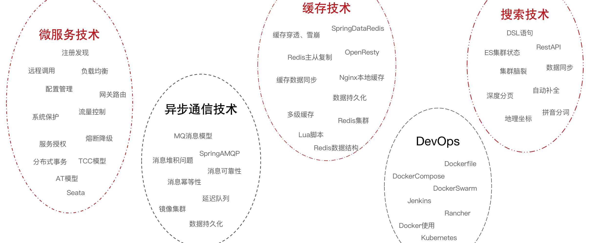
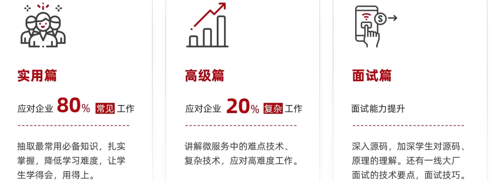
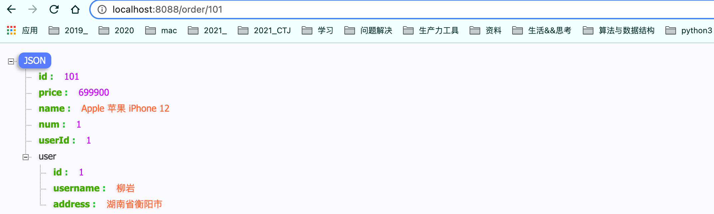
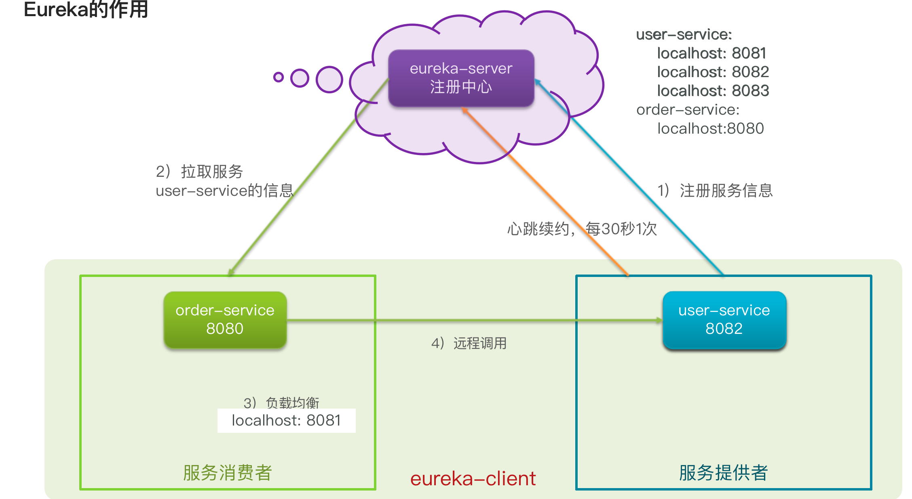
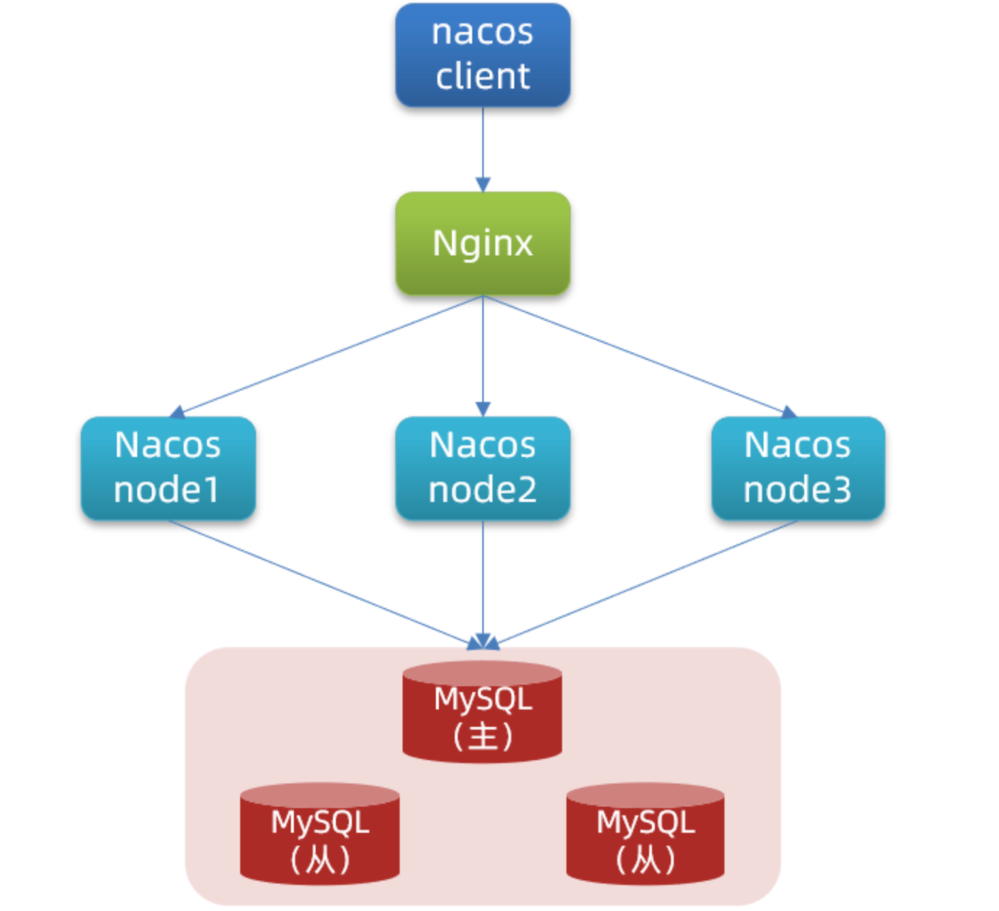

# 写在前面

## 推荐

[SpringCloud+RabbitMQ+Docker+Redis+搜索+分布式_黑马20210811](https://www.bilibili.com/video/BV1LQ4y127n4?p=3)

[[ 动力结点 ]springcloud微服务SpringCloud+SpringCloud Alibaba 双管齐下玩转SpringCloud](https://www.bilibili.com/video/BV1My4y1672a/?spm_id_from=333.788.recommend_more_video.9)


## 常用总结

```lua
项目布局  
cloud_demo -- 父工程：定义版本    　　   
　　├── eureka-server -- 注册中心
　　├── feign-api -- 远程调用接口定义
　　├── gateway -- 网关配置
　　├── order-service -- 订单服务
　　├── user-service -- 用户服务
　　└── pom.xml -- 父pom　
```

<br>

```bash
# 注册中心Eureka
服务消费者该如何获取服务提供者的地址信息？

果有多个服务提供者，消费者该如何选择？

消费者如何得知服务提供者的健康状态？

# 负载均衡

# 配置中心

# feign远程调用
基于RestTemplate发起的http请求实现远程调用，只要知道对方的ip、端口、接口路径、请求参数即可。
一个服务既可以是提供者，也可以是消费者。

# Gateway服务网关
```


## 问题解决


# 服务框架学习路线

**完整微服务技术栈：微服务技术 + 持续集成**

> 微服务并不是等于springcloud技术
>
> 消息队列：异步通信大大提高服务的并发，秒杀等高并发场景利用
>
> 系统监控链路追踪：实时监控每一个服务节点的运行状态、CPU负载、内存的占用等等情况，一旦出现任何的问题，可以直接定位到某一具体的方法栈信息，快速定位异常所在。
>
> 自动化部署：工具Jenkins，Docker打包形成镜像


**需要学习的微服务知识**




**学习路径**


**分层次教学**



<br>

**知识层次**


# springcloud实用篇一

```bash
注册中心

负载均衡器
```


# 一、认识微服务 Microservices

### 服务框架演变

**1、单体架构（单体应用）：将业务的所有功能集中在一个项目中开发，打成一个包部署，从而对外提供服务。**

**2、分布式架构：根据业务功能对系统进行拆分，每个业务模块作为独立项目开发，称为一个服务。**

**3、微服务是一种经过良好架构设计的分布式架构方案，微服务架构特征：**

> 单一职责：微服务拆分粒度更小，每一个服务都对应唯一的业务能力，做到单一职责，避免重复业务开发
>
> 面向服务：微服务对外暴露业务接口
>
> 自治：团队独立、技术独立、数据独立、部署独立
>
> 隔离性强：服务调用做好隔离、容错、降级，避免出现级联问题


```bash
# 关于微服务的概念
- 拆分，HTTP
微服务是系统架构上的一种设计风格，它的主旨是将一个原本独立的系统拆分成多个小型服务。
这些小型服务都在各自独立的进程中运行，服务之间通过基于 HTTP 的 RESTful API 进行通信协作；

- 独立
被拆分后的每一个小型服务都专注于完成系统中的某一项业务功能，职责单一，
并且每个服务都是一个独立的项目，可以进行独立的测试、开发和部署等；

- 语言
由于各个独立的服务之间使用的是基于 HTTP 的 JSON 作为数据通信协作的基础，所以这些微服务也可以使用不同的语言来开发；

# 分布式和微服务有什么区别？
它们的本质的区别体现在 目标 上。
何为目标，就是你采用分布式架构或者采用微服务架构，你最终是为了什么，要达到什么目的？

分布式架构的目标是什么？ 
就是访问量很大一台机器承受不了，或者是成本问题，不得不使用多台机器来完成服务的部署；

而微服务的目标是什么？
只是让各个模块拆分开来，不会被互相影响。
比如模块的升级或者出现BUG或者是重构等等都不要影响到其他模块，微服务它是可以在一台机器上部署；

分布式注重性能，微服务在此基础上更加注重业务

# 微服务与Spring-Cloud的关系或区别？
架构方式、架构理念与技术落地实现
```


### 微服务技术对比

微服务这种方案需要技术框架来落地，全球的互联网公司都在积极尝试自己的微服务落地技术。

在国内最知名的就是 SpringCloud 和阿里巴巴的Dubbo。


### SpringCloud

SpringCloud是目前国内使用最广泛的微服务框架。官网地址：https://spring.io/projects/spring-cloud

SpringCloud集成了各种微服务功能组件，并基于SpringBoot实现了这些**组件的自动装配**，从而提供了良好的开箱即用体验。


<br>

**SpringCloud与SpringBoot的版本兼容关系如下：**

```bash
# 黑马课程
使用的版本是Hoxton.SR10，因此对应的SpringCloud版本是2.3.x版本。

```


| Release Train                                                | Boot Version                          |
| :----------------------------------------------------------- | :------------------------------------ |
| [2021.0.x](https://github.com/spring-cloud/spring-cloud-release/wiki/Spring-Cloud-2021.0-Release-Notes) aka Jubilee | 2.6.x                                 |
| [2020.0.x](https://github.com/spring-cloud/spring-cloud-release/wiki/Spring-Cloud-2020.0-Release-Notes) aka Ilford | 2.4.x, 2.5.x (Starting with 2020.0.3) |
| [Hoxton](https://github.com/spring-cloud/spring-cloud-release/wiki/Spring-Cloud-Hoxton-Release-Notes) | 2.2.x, 2.3.x (Starting with SR5)      |
| [Greenwich](https://github.com/spring-projects/spring-cloud/wiki/Spring-Cloud-Greenwich-Release-Notes) | 2.1.x                                 |
| [Finchley](https://github.com/spring-projects/spring-cloud/wiki/Spring-Cloud-Finchley-Release-Notes) | 2.0.x                                 |
| [Edgware](https://github.com/spring-projects/spring-cloud/wiki/Spring-Cloud-Edgware-Release-Notes) | 1.5.x                                 |
| [Dalston](https://github.com/spring-projects/spring-cloud/wiki/Spring-Cloud-Dalston-Release-Notes) | 1.5.x                                 |


# 二、微服务拆分案例

### 所谓服务拆分

```bash
# 父工程
定义版本

# 注意事项📢
单一职责：不同微服务，不要重复开发相同业务

数据独立：不要访问其它微服务的数据库

面向服务：将自己的业务暴露为接口，供其它微服务调用
```


### 案例cloud-demo（微服务远程调用--查询订单）

#### 1）注册RestTemplate

```java
@MapperScan("cn.itcast.order.mapper")
@SpringBootApplication
public class OrderApplication {

    public static void main(String[] args) {
        SpringApplication.run(OrderApplication.class, args);
    }

    /**
     * 创建RestTemplate并注入Spring容器
     */
    @Bean
    @LoadBalanced
    public RestTemplate restTemplate() {
        return new RestTemplate();
    }
}
```

#### 2）服务远程调用RestTemplate（url中使用硬编码的方式）

修改order-service中 OrderService 的queryOrderById方法：

```bash
基于RestTemplate发起的http请求实现远程调用。

http请求做远程调用是与语言无关的调用，只要知道对方的ip、端口、接口路径、请求参数即可。
```


```java
@Service
public class OrderService {
		@Autowired
    private RestTemplate restTemplate;

    public Order queryOrderById(Long orderId) {
        // 1.查询订单
        Order order = orderMapper.findById(orderId);
        // 2.利用RestTemplate发起http请求，查询用户
        // 2.1.url路径
        String url = "http://localhost:8081/user/" + order.getUserId();
        // 2.2.发送http请求，实现远程调用
        User user = restTemplate.getForObject(url, User.class);
        // 3.封装user到Order
        order.setUser(user);
        // 4.返回
        return order;
    }
}
```





### 服务提供者与服务消费者的概念

```bash
服务提供者：一次业务中，被其它微服务调用的服务。（提供接口给其它微服务）

服务消费者：一次业务中，调用其它微服务的服务。（调用其它微服务提供的接口）

# 服务A调用服务B，服务B调用服务C，那么服务B是什么角色？
一个服务既可以是提供者，也可以是消费者。
```


# 三、Eureka注册中心

### 1、远程调用的一堆问题

```bash
# 服务消费者该如何获取服务提供者的地址信息？

服务提供者启动时向eureka【注册】自己的信息
eureka【保存】这些信息
消费者根据服务名称向eureka【拉取】提供者信息

# 如果有多个服务提供者，消费者该如何选择？

服务消费者利用负载均衡算法，从服务列表中挑选一个

# 消费者如何得知服务提供者的健康状态？

服务提供者会每隔30秒向EurekaServer发送心跳请求，报告健康状态
eureka会更新记录服务列表信息，心跳不正常会被剔除
消费者就可以拉取到最新的信息
```


### 2、Eureka原理




### 3、搭建EurekaServer注册中心

1）创建项目，引入spring-cloud-starter-netflix-eureka-server的依赖

```xml
<!--eureka服务端-->
<dependency>
  <groupId>org.springframework.cloud</groupId>
  <artifactId>spring-cloud-starter-netflix-eureka-server</artifactId>
</dependency>
```

2）编写启动类，添加`@EnableEurekaServer`注解

```java
@EnableEurekaServer
```

3）添加application.yml 配置文件如下

```yaml
server:
  port: 10086 # 服务端口
spring:
  application:
    name: eurekaserver # eureka的服务名称
eureka:
  client:
    service-url:  # eureka的地址信息
      defaultZone: http://127.0.0.1:10086/eureka
```


### 4、服务注册

1）引入`spring-cloud-starter-netflix-eureka-client`的依赖

```xml
<!--eureka客户端依赖-->
<dependency>
		<groupId>org.springframework.cloud</groupId>
		<artifactId>spring-cloud-starter-netflix-eureka-client</artifactId>
</dependency>
```

2）在application.yml文件，配置如下

```yaml
spring:
  application:
    name: userservice
eureka:
  client:
    service-url:  # eureka的地址信息
      defaultZone: http://127.0.0.1:10086/eureka
```

另外，我们可以将user-service多次启动， 模拟多实例部署。

但为了避免端口冲突，需要修改端口设置：


### 5、服务发现

在order-service完成服务拉取（**基于服务名称获取服务列表，然后再对服务列表做负载均衡**。）


修改OrderService代码中访问的url路径，用服务名代替 ip 和端口

```java
String url = "http://userservice/user/" + order.getUserId();
```

在order-service项目的启动类OrderApplication中的RestTemplate添加负载均衡注解：**@LoadBalanced**

```java
@Bean
@LoadBalanced
public RestTemplate restTemplate() {
	return new RestTemplate();
}
```


# 四、Ribbon负载均衡原理

### 1 负载均衡原理


### 2 负载均衡策略（IRule接口）

Ribbon的负载均衡规则是一个叫做`IRule` 的接口来定义的，每一个子接口都是一种规则：


#### 通过定义IRule实现可以修改负载均衡规则，有两种方式：

##### 代码方式：在order-service中的OrderApplication类中，定义一个新的IRule：（全局配置）

```java
@Bean
public IRule randomRule() {
  return new RandomRule();
}
```

##### 配置文件方式：在order-service的application.yml文件中，添加新的配置也可以修改规则：（针对某个微服务而言）

```yaml
userservice:
  ribbon:
    NFLoadBalancerRuleClassName: com.netflix.loadbalancer.RandomRule# 负载均衡规则 
```


### 3 Ribbon默认懒加载

Ribbon默认是采用懒加载，即第一次访问时才会去创建LoadBalanceClient，请求时间会很长。

而饥饿加载则会在项目启动时创建，降低第一次访问的耗时，通过下面配置开启饥饿加载：

```yaml
ribbon:
  eager-load:
    enabled: true # 开启饥饿加载
    clients: # 指定饥饿加载的服务名称
      - userservice
```


<br>

### 4 总结：Ribbon负载均衡规则、自定义、饥饿加载

**Ribbon负载均衡规则**

- 规则接口是IRule
- 默认实现是ZoneAvoidanceRule，根据zone选择服务列表，然后轮询

**负载均衡策略自定义方式**

- 代码方式：配置灵活，但修改时需要重新打包发布
- 配置方式：直观，方便，无需重新打包发布，但是无法做全局配置

**饥饿加载**

- 开启饥饿加载
- 指定饥饿加载的微服务名称


# 五、nacos注册中心

### 1 认识和安装

Nacos是阿里巴巴的产品，现在是SpringCloud中的一个组件。相比Eureka功能更加丰富，在国内受欢迎程度较高。


### 2 快速入门

1）在cloud-demo父工程中添加spring-cloud-alilbaba的坐标

```xml
<!--nacos的坐标-->
<dependency>
  <groupId>com.alibaba.cloud</groupId>
  <artifactId>spring-cloud-alibaba-dependencies</artifactId>
  <version>2.2.5.RELEASE</version>
  <type>pom</type>
  <scope>import</scope>
</dependency>
```


2）服务添加nacos的客户端依赖（注释掉order-service和user-service中原有的eureka依赖。）

```xml
<!-- nacos客户端坐标 -->
<dependency>
  <groupId>com.alibaba.cloud</groupId>
  <artifactId>spring-cloud-starter-alibaba-nacos-discovery</artifactId>
</dependency>
```


3）修改 user-service和order-service 中的application.yml文件，注释eureka地址，添加nacos地址

```yaml
spring:
  cloud:
    nacos:
      server-addr: localhost:8848 # nacos服务地址
```


4）启动并测试


### 3 服务分级存储模型


#### 3.1 服务跨集群调用问题

```bash
服务调用尽可能选择本地集群的服务，跨集群调用延迟较高

本地集群不可访问时，再去访问其它集群
```

​	

#### 3.2 服务集群属性

修改application.yml，添加如下内容：


在Nacos控制台可以看到集群变化：（我们修改user-service集群属性配置，达到下面的效果）


#### 3.3 总结：

- Nacos服务分级存储模型
  - 一级是服务，例如userservice
  - 二级是集群，例如杭州或上海
  - 三级是实例，例如杭州机房的某台部署了userservice的服务器

<br>

- 如何设置实例的集群属性
  - 修改application.yml文件，添加 `spring.cloud.nacos.discovery.cluster-name `属性即可


#### 3.4 根据集群负载均衡

我们希望优先选择HZ集群（8001和8002），进行如下设置：


> 1）修改order-service中的application.yml，设置集群为HZ：
>
> 
>
> 2）然后在order-service中设置负载均衡的IRule为**NacosRule**，这个规则**优先会寻找与自己同集群的服务**：
>
> NacosRule负载均衡策略：先本地，然后本地内随机
>
> 

<br>

跨集群访问的警告信息：


####  3.5 根据权重负载均衡

实际部署中会出现的场景：服务器设备性能有差异，部分实例所在机器性能较好，另一些较差，我们希望性能好的机器承担更多的用户请求。

Nacos提供了权重配置来控制访问频率，权重越大则访问频率越高。

<br>

在Nacos控制台可以设置实例的权重值，首先选中实例后面的编辑按钮


将权重设置为0.1，测试可以发现8081被访问到的频率大大降低


```bash
实例的权重控制

- Nacos控制台可以设置实例的权重值，0~1之间
- 同集群内的多个实例，权重越高被访问的频率越高
- 权重设置为<font color=red>0</font>则完全不会被访问
```


### 4 环境隔离namespace

```bash
# 总结Nacos环境隔离
- 1 每个namespace都有唯一id
- 2 服务设置namespace时要写id而不是名称
- 3 不同namespace下的服务互相不可见
```


#### 4.1如何修改一个服务的命名空间

**1）在Nacos控制台可以创建namespace，用来隔离不同环境**

命名空间 -> 新建命名空间


**2）然后填写一个新的命名空间信息**


**3）保存后会在控制台看到这个命名空间的id**


**4）修改order-service的application.yml，添加namespace**

```yaml
spring:
  datasource:
    url: jdbc:mysql://localhost:3306/cloud_order?useSSL=false
    username: root
    password: 1
    driver-class-name: com.mysql.jdbc.Driver
  application:
    name: orderservice
  cloud:
    nacos:
      server-addr: localhost:8848 # nacos服务地址
      discovery:
        cluster-name: SH # 上海
        namespace: 4d6ce343-9e1b-44df-a90f-2cf2b6b3d177 # dev环境   命名空间，填ID
```

**5）重启order-service后，再来查看控制台：**


**6）此时访问order-service，因为namespace不同，会导致找不到userservice，控制台会报错：**


#### 4.2 临时实例和非临时实例（好好理解）

```bash
服务注册到Nacos时，可以选择注册为临时或非临时实例

# 通过下面的配置来设置
临时实例宕机时，会从nacos的服务列表中剔除，而非临时实例则不会

# 区别
临时实例采用心跳检测，非临时实例nacos主动询问
```


```yaml
spring:
  cloud:
    nacos:
      discovery:
        ephemeral: false # 是否是临时实例
```


### 5 Nacos与Eureka

```bash
# 共同点
都支持服务注册和服务拉取

都支持服务提供者心跳方式做健康检测

# 不同点
Nacos支持服务端主动检测提供者状态：临时实例采用心跳模式，非临时实例采用主动检测模式

临时实例心跳不正常会被剔除，非临时实例则不会被剔除

Nacos支持服务列表变更的消息推送模式，服务列表更新更及时

Nacos集群默认采用AP方式（强调可用性），当集群中存在非临时实例时，采用CP模式；Eureka采用AP方式 [ 重点 ]
```


# springcloud实用篇二

# 六、Nacos配置管理

```bash
# 将配置交给Nacos管理的步骤

- 在Nacos中添加配置文件
- 在微服务中引入nacos的config依赖
- 在微服务中添加bootstrap.yml，配置nacos地址、当前环境、服务名称、文件后缀名。这些决定了程序启动时去nacos读取哪个文件

# Nacos配置更改后，微服务可以实现热更新，2种方式
- 通过@Value注解注入，结合@RefreshScope来刷新
- 通过@ConfigurationProperties注入，自动刷新

# 注意事项
- 不是所有的配置都适合放到配置中心，维护起来比较麻烦
- 建议将一些关键参数，需要运行时调整的参数放到nacos配置中心，一般都是自定义配置


```


### 1 统一配置管理


#### Nacos实现配置管理

在Nacos中添加配置信息


在弹出表单中填写配置信息


#### 微服务配置拉取


（1）引入Nacos的配置管理客户端依赖

```xml
<!--nacos的配置管理依赖-->
<dependency>
  <groupId>com.alibaba.cloud</groupId>
  <artifactId>spring-cloud-starter-alibaba-nacos-config</artifactId>
</dependency>
```

（2）在userservice中的resource目录添加一个`bootstrap.yml`文件，这个文件是引导文件，优先级高于application.yml

```yaml
spring:
  application:
    name: userservice
  profiles:
    active: dev # 环境
  cloud:
    nacos:
      server-addr: localhost:8848 # nacos地址
      config:
        file-extension: yaml # 文件后缀名
```

（3）我们在user-service中将 pattern.dateformat 这个属性注入到UserController中做测试

```java
@RestController
@RequestMapping("/user")
public class UserController {
		
  	// 注入nacos中的配置属性
    @Value("${pattern.dateformat}")
    private String dateformat;
		
  	// 编写controller，通过日期格式化器来格式化现在时间并返回
    @GetMapping("now")
    public String now(){
        return LocalDateTime.now().format(DateTimeFormatter.ofPattern(properties.getDateformat()));
    }
}
```


### 2 配置热更新

Nacos中的配置文件变更后，微服务无需重启就可以感知。不过需要通过下面两种配置实现：

<br>

方式一：在@Value注入的变量所在类上添加注解**@RefreshScope**

```java
@Slf4j
@RestController
@RequestMapping("/user")
@RefreshScope
public class UserController {

    @Value("${pattern.dateformat}")
    private String dateformat;
```

方式二：使用**@ConfigurationProperties**注解（推荐）

```java
@Data
@Component
@ConfigurationProperties(prefix = "pattern")
public class PatternProperties {
    private String dateformat;
    private String envSharedValue;
    private String name;
}
```


### 3 多环境配置共享


**微服务启动时会从nacos读取多个配置文件：**

- [spring.application.name]-[spring.profiles.active].yaml，例如：userservice-dev.yaml，环境配置
- [spring.application.name].yaml，例如：userservice.yaml，默认配置，多环境共享

<br>

无论profile如何变化，[spring.application.name].yaml这个文件一定会加载，因此多环境共享配置可以写入这个文件


**多种配置的优先级：[服务名]-[环境].yaml >[服务名].yaml > 本地配置**


不同微服务之间可以共享配置文件，通过下面的两种方式来指定：


多种配置的优先级：


```bash
# 微服务默认读取的配置文件：
		[服务名]-[spring.profile.active].yaml，默认配置
		[服务名].yaml，多环境共享
# 不同微服务共享的配置文件：
		通过shared-configs指定
		通过extension-configs指定
# 优先级：
		环境配置 >服务名.yaml > extension-config > extension-configs > shared-configs > 本地配置
```


### 4 搭建Nacos集群

```bash
# 搭建步骤

- 搭建数据库，初始化数据库表结构
- 下载nacos安装包
- 配置nacos
- 启动nacos集群
- nginx反向代理
```





**1）初始化数据库**

Nacos默认数据存储在内嵌数据库Derby中，不属于生产可用的数据库。

官方推荐的最佳实践是使用带有主从的高可用数据库集群，主从模式的高可用数据库可以参考**传智教育**的后续高手课程。

这里我们以单点的数据库为例来讲解。

首先新建一个数据库，命名为nacos，而后导入下面的SQL：

```sql
CREATE TABLE `config_info` (
  `id` bigint(20) NOT NULL AUTO_INCREMENT COMMENT 'id',
  `data_id` varchar(255) NOT NULL COMMENT 'data_id',
  `group_id` varchar(255) DEFAULT NULL,
  `content` longtext NOT NULL COMMENT 'content',
  `md5` varchar(32) DEFAULT NULL COMMENT 'md5',
  `gmt_create` datetime NOT NULL DEFAULT CURRENT_TIMESTAMP COMMENT '创建时间',
  `gmt_modified` datetime NOT NULL DEFAULT CURRENT_TIMESTAMP COMMENT '修改时间',
  `src_user` text COMMENT 'source user',
  `src_ip` varchar(50) DEFAULT NULL COMMENT 'source ip',
  `app_name` varchar(128) DEFAULT NULL,
  `tenant_id` varchar(128) DEFAULT '' COMMENT '租户字段',
  `c_desc` varchar(256) DEFAULT NULL,
  `c_use` varchar(64) DEFAULT NULL,
  `effect` varchar(64) DEFAULT NULL,
  `type` varchar(64) DEFAULT NULL,
  `c_schema` text,
  PRIMARY KEY (`id`),
  UNIQUE KEY `uk_configinfo_datagrouptenant` (`data_id`,`group_id`,`tenant_id`)
) ENGINE=InnoDB DEFAULT CHARSET=utf8 COLLATE=utf8_bin COMMENT='config_info';

/******************************************/
/*   数据库全名 = nacos_config   */
/*   表名称 = config_info_aggr   */
/******************************************/
CREATE TABLE `config_info_aggr` (
  `id` bigint(20) NOT NULL AUTO_INCREMENT COMMENT 'id',
  `data_id` varchar(255) NOT NULL COMMENT 'data_id',
  `group_id` varchar(255) NOT NULL COMMENT 'group_id',
  `datum_id` varchar(255) NOT NULL COMMENT 'datum_id',
  `content` longtext NOT NULL COMMENT '内容',
  `gmt_modified` datetime NOT NULL COMMENT '修改时间',
  `app_name` varchar(128) DEFAULT NULL,
  `tenant_id` varchar(128) DEFAULT '' COMMENT '租户字段',
  PRIMARY KEY (`id`),
  UNIQUE KEY `uk_configinfoaggr_datagrouptenantdatum` (`data_id`,`group_id`,`tenant_id`,`datum_id`)
) ENGINE=InnoDB DEFAULT CHARSET=utf8 COLLATE=utf8_bin COMMENT='增加租户字段';


/******************************************/
/*   数据库全名 = nacos_config   */
/*   表名称 = config_info_beta   */
/******************************************/
CREATE TABLE `config_info_beta` (
  `id` bigint(20) NOT NULL AUTO_INCREMENT COMMENT 'id',
  `data_id` varchar(255) NOT NULL COMMENT 'data_id',
  `group_id` varchar(128) NOT NULL COMMENT 'group_id',
  `app_name` varchar(128) DEFAULT NULL COMMENT 'app_name',
  `content` longtext NOT NULL COMMENT 'content',
  `beta_ips` varchar(1024) DEFAULT NULL COMMENT 'betaIps',
  `md5` varchar(32) DEFAULT NULL COMMENT 'md5',
  `gmt_create` datetime NOT NULL DEFAULT CURRENT_TIMESTAMP COMMENT '创建时间',
  `gmt_modified` datetime NOT NULL DEFAULT CURRENT_TIMESTAMP COMMENT '修改时间',
  `src_user` text COMMENT 'source user',
  `src_ip` varchar(50) DEFAULT NULL COMMENT 'source ip',
  `tenant_id` varchar(128) DEFAULT '' COMMENT '租户字段',
  PRIMARY KEY (`id`),
  UNIQUE KEY `uk_configinfobeta_datagrouptenant` (`data_id`,`group_id`,`tenant_id`)
) ENGINE=InnoDB DEFAULT CHARSET=utf8 COLLATE=utf8_bin COMMENT='config_info_beta';

/******************************************/
/*   数据库全名 = nacos_config   */
/*   表名称 = config_info_tag   */
/******************************************/
CREATE TABLE `config_info_tag` (
  `id` bigint(20) NOT NULL AUTO_INCREMENT COMMENT 'id',
  `data_id` varchar(255) NOT NULL COMMENT 'data_id',
  `group_id` varchar(128) NOT NULL COMMENT 'group_id',
  `tenant_id` varchar(128) DEFAULT '' COMMENT 'tenant_id',
  `tag_id` varchar(128) NOT NULL COMMENT 'tag_id',
  `app_name` varchar(128) DEFAULT NULL COMMENT 'app_name',
  `content` longtext NOT NULL COMMENT 'content',
  `md5` varchar(32) DEFAULT NULL COMMENT 'md5',
  `gmt_create` datetime NOT NULL DEFAULT CURRENT_TIMESTAMP COMMENT '创建时间',
  `gmt_modified` datetime NOT NULL DEFAULT CURRENT_TIMESTAMP COMMENT '修改时间',
  `src_user` text COMMENT 'source user',
  `src_ip` varchar(50) DEFAULT NULL COMMENT 'source ip',
  PRIMARY KEY (`id`),
  UNIQUE KEY `uk_configinfotag_datagrouptenanttag` (`data_id`,`group_id`,`tenant_id`,`tag_id`)
) ENGINE=InnoDB DEFAULT CHARSET=utf8 COLLATE=utf8_bin COMMENT='config_info_tag';

/******************************************/
/*   数据库全名 = nacos_config   */
/*   表名称 = config_tags_relation   */
/******************************************/
CREATE TABLE `config_tags_relation` (
  `id` bigint(20) NOT NULL COMMENT 'id',
  `tag_name` varchar(128) NOT NULL COMMENT 'tag_name',
  `tag_type` varchar(64) DEFAULT NULL COMMENT 'tag_type',
  `data_id` varchar(255) NOT NULL COMMENT 'data_id',
  `group_id` varchar(128) NOT NULL COMMENT 'group_id',
  `tenant_id` varchar(128) DEFAULT '' COMMENT 'tenant_id',
  `nid` bigint(20) NOT NULL AUTO_INCREMENT,
  PRIMARY KEY (`nid`),
  UNIQUE KEY `uk_configtagrelation_configidtag` (`id`,`tag_name`,`tag_type`),
  KEY `idx_tenant_id` (`tenant_id`)
) ENGINE=InnoDB DEFAULT CHARSET=utf8 COLLATE=utf8_bin COMMENT='config_tag_relation';

/******************************************/
/*   数据库全名 = nacos_config   */
/*   表名称 = group_capacity   */
/******************************************/
CREATE TABLE `group_capacity` (
  `id` bigint(20) unsigned NOT NULL AUTO_INCREMENT COMMENT '主键ID',
  `group_id` varchar(128) NOT NULL DEFAULT '' COMMENT 'Group ID，空字符表示整个集群',
  `quota` int(10) unsigned NOT NULL DEFAULT '0' COMMENT '配额，0表示使用默认值',
  `usage` int(10) unsigned NOT NULL DEFAULT '0' COMMENT '使用量',
  `max_size` int(10) unsigned NOT NULL DEFAULT '0' COMMENT '单个配置大小上限，单位为字节，0表示使用默认值',
  `max_aggr_count` int(10) unsigned NOT NULL DEFAULT '0' COMMENT '聚合子配置最大个数，，0表示使用默认值',
  `max_aggr_size` int(10) unsigned NOT NULL DEFAULT '0' COMMENT '单个聚合数据的子配置大小上限，单位为字节，0表示使用默认值',
  `max_history_count` int(10) unsigned NOT NULL DEFAULT '0' COMMENT '最大变更历史数量',
  `gmt_create` datetime NOT NULL DEFAULT CURRENT_TIMESTAMP COMMENT '创建时间',
  `gmt_modified` datetime NOT NULL DEFAULT CURRENT_TIMESTAMP COMMENT '修改时间',
  PRIMARY KEY (`id`),
  UNIQUE KEY `uk_group_id` (`group_id`)
) ENGINE=InnoDB DEFAULT CHARSET=utf8 COLLATE=utf8_bin COMMENT='集群、各Group容量信息表';

/******************************************/
/*   数据库全名 = nacos_config   */
/*   表名称 = his_config_info   */
/******************************************/
CREATE TABLE `his_config_info` (
  `id` bigint(64) unsigned NOT NULL,
  `nid` bigint(20) unsigned NOT NULL AUTO_INCREMENT,
  `data_id` varchar(255) NOT NULL,
  `group_id` varchar(128) NOT NULL,
  `app_name` varchar(128) DEFAULT NULL COMMENT 'app_name',
  `content` longtext NOT NULL,
  `md5` varchar(32) DEFAULT NULL,
  `gmt_create` datetime NOT NULL DEFAULT CURRENT_TIMESTAMP,
  `gmt_modified` datetime NOT NULL DEFAULT CURRENT_TIMESTAMP,
  `src_user` text,
  `src_ip` varchar(50) DEFAULT NULL,
  `op_type` char(10) DEFAULT NULL,
  `tenant_id` varchar(128) DEFAULT '' COMMENT '租户字段',
  PRIMARY KEY (`nid`),
  KEY `idx_gmt_create` (`gmt_create`),
  KEY `idx_gmt_modified` (`gmt_modified`),
  KEY `idx_did` (`data_id`)
) ENGINE=InnoDB DEFAULT CHARSET=utf8 COLLATE=utf8_bin COMMENT='多租户改造';


/******************************************/
/*   数据库全名 = nacos_config   */
/*   表名称 = tenant_capacity   */
/******************************************/
CREATE TABLE `tenant_capacity` (
  `id` bigint(20) unsigned NOT NULL AUTO_INCREMENT COMMENT '主键ID',
  `tenant_id` varchar(128) NOT NULL DEFAULT '' COMMENT 'Tenant ID',
  `quota` int(10) unsigned NOT NULL DEFAULT '0' COMMENT '配额，0表示使用默认值',
  `usage` int(10) unsigned NOT NULL DEFAULT '0' COMMENT '使用量',
  `max_size` int(10) unsigned NOT NULL DEFAULT '0' COMMENT '单个配置大小上限，单位为字节，0表示使用默认值',
  `max_aggr_count` int(10) unsigned NOT NULL DEFAULT '0' COMMENT '聚合子配置最大个数',
  `max_aggr_size` int(10) unsigned NOT NULL DEFAULT '0' COMMENT '单个聚合数据的子配置大小上限，单位为字节，0表示使用默认值',
  `max_history_count` int(10) unsigned NOT NULL DEFAULT '0' COMMENT '最大变更历史数量',
  `gmt_create` datetime NOT NULL DEFAULT CURRENT_TIMESTAMP COMMENT '创建时间',
  `gmt_modified` datetime NOT NULL DEFAULT CURRENT_TIMESTAMP COMMENT '修改时间',
  PRIMARY KEY (`id`),
  UNIQUE KEY `uk_tenant_id` (`tenant_id`)
) ENGINE=InnoDB DEFAULT CHARSET=utf8 COLLATE=utf8_bin COMMENT='租户容量信息表';


CREATE TABLE `tenant_info` (
  `id` bigint(20) NOT NULL AUTO_INCREMENT COMMENT 'id',
  `kp` varchar(128) NOT NULL COMMENT 'kp',
  `tenant_id` varchar(128) default '' COMMENT 'tenant_id',
  `tenant_name` varchar(128) default '' COMMENT 'tenant_name',
  `tenant_desc` varchar(256) DEFAULT NULL COMMENT 'tenant_desc',
  `create_source` varchar(32) DEFAULT NULL COMMENT 'create_source',
  `gmt_create` bigint(20) NOT NULL COMMENT '创建时间',
  `gmt_modified` bigint(20) NOT NULL COMMENT '修改时间',
  PRIMARY KEY (`id`),
  UNIQUE KEY `uk_tenant_info_kptenantid` (`kp`,`tenant_id`),
  KEY `idx_tenant_id` (`tenant_id`)
) ENGINE=InnoDB DEFAULT CHARSET=utf8 COLLATE=utf8_bin COMMENT='tenant_info';

CREATE TABLE `users` (
	`username` varchar(50) NOT NULL PRIMARY KEY,
	`password` varchar(500) NOT NULL,
	`enabled` boolean NOT NULL
);

CREATE TABLE `roles` (
	`username` varchar(50) NOT NULL,
	`role` varchar(50) NOT NULL,
	UNIQUE INDEX `idx_user_role` (`username` ASC, `role` ASC) USING BTREE
);

CREATE TABLE `permissions` (
    `role` varchar(50) NOT NULL,
    `resource` varchar(255) NOT NULL,
    `action` varchar(8) NOT NULL,
    UNIQUE INDEX `uk_role_permission` (`role`,`resource`,`action`) USING BTREE
);

INSERT INTO users (username, password, enabled) VALUES ('nacos', '$2a$10$EuWPZHzz32dJN7jexM34MOeYirDdFAZm2kuWj7VEOJhhZkDrxfvUu', TRUE);

INSERT INTO roles (username, role) VALUES ('nacos', 'ROLE_ADMIN');
```


**2）下载nacos（可以选择任意版本下载。本例中采用1.4.1版本。）**

https://github.com/alibaba/nacos/tags


**3）配置nacos**

```bash
1.解压 
- bin：启动脚本  
- conf：配置文件

2.进入nacos的conf目录，修改配置文件cluster.conf.example，重命名为 `cluster.conf`
然后添加内容
```


```
127.0.0.1:8845
127.0.0.1.8846
127.0.0.1.8847
```

3. 然后修改application.properties文件，添加数据库配置

```properties
spring.datasource.platform=mysql

db.num=1

db.url.0=jdbc:mysql://127.0.0.1:3306/nacos?characterEncoding=utf8&connectTimeout=1000&socketTimeout=3000&autoReconnect=true&useUnicode=true&useSSL=false&serverTimezone=UTC
db.user.0=root
db.password.0=123456
```


**4）启动**

将nacos文件夹复制三份，分别命名为：nacos1、nacos2、nacos3

然后分别修改三个文件夹中的application.properties

nacos1:

```properties
server.port=8845
```

nacos2:

```properties
server.port=8846
```

nacos3:

```properties
server.port=8847
```


然后分别启动三个nacos节点：

```
startup.cmd
```


**5）nginx反向代理**

nginx安装包解压

修改conf/nginx.conf文件，配置如下：

```conf
upstream nacos-cluster {
    server 127.0.0.1:8845;
    server 127.0.0.1:8846;
	  server 127.0.0.1:8847;
}

server {
    listen       80;
    server_name  localhost;

    location /nacos {
        proxy_pass http://nacos-cluster;
    }
}
```


# 七、Feign远程调用（HTTP客户端Feign）

```java
// vaule和name 其实是一个属性
public @interface FeignClient {
    @AliasFor("name")
    String value() default "";

    @AliasFor("value")
    String name() default "";
  	......
}

@FeignClient(name="${feign.name.element2:element-server2}")
public interface IBaseDataFeignClient extends IBaseDataFeignController {
}
```


## 7.1 Feign替代RestTemplate

-  `RestTemplate`方式调用存在的问题

```java
String url = "http://userservice/user/" + order.getUserId();
User user = restTemplate.getForObject(url, User.class);
```

代码可读性差，编程体验不统一；参数复杂URL难以维护。


- Feign的介绍
  - 官网：https://github.com/OpenFeign/feign
  - Feign是一个声明式的http客户端，其作用就是帮助我们优雅的实现 http 请求的发送，解决上面提到的问题。

```bash
# 声明式
理解声明式：如spring的声明式事务，对谁加事务规则定义好，spring来实现事务。

feign接口定义：发http请求的信息写出来就可以
```


- 定义和使用Feign客户端

1）引入依赖

```xml
<!--feign客户端依赖-->
<dependency>
  <groupId>org.springframework.cloud</groupId>
  <artifactId>spring-cloud-starter-openfeign</artifactId>
</dependency>
```


2）在order-service的启动类添加注解开启Feign的功能：`@EnableFeignClients`


3）编写Feign客户端


## 7.2 自定义配置Feign日志的2种方式

#### 方式1：配置文件


#### 方式2：java代码方式，需要先声明一个Bean


## 7.3 Figen使用优化（性能调优）

**Feign底层的客户端实现：**

- URLConnection：默认实现，不支持连接池
- Apache HttpClient ：支持连接池
- OKHttp：支持连接池


**因此优化Feign的性能主要包括：**

- 使用连接池代替默认的URLConnection
- 日志级别，最好用 `basic` 或 `none`


#### 连接池配置（以HttpClient为例）

1）引入feign-httpClient依赖

```xml
<!--引入HttpClient依赖-->
<dependency>
  <groupId>io.github.openfeign</groupId>
  <artifactId>feign-httpclient</artifactId>
</dependency>
```

2）配置文件开启httpClient功能，设置连接池参数

```yaml
feign:
  client:
    config:
      default: # default全局的配置
        loggerLevel: BASIC # 日志级别，BASIC就是基本的请求和响应信息 
  httpclient:
    enabled: true # 支持HttpClient的开关
    max-connections: 200 # 最大连接数
    max-connections-per-route: 50 # 单个路径的最大连接数
```


> **Feign的优化：**
>
> **1）日志级别尽量用basic**
>
> **2）使用HttpClient或OKHttp代替URLConnection**
>
> **引入feign-httpClient依赖**
>
> **配置文件开启httpClient功能，设置连接池参数**


## 7.4 Feign最佳实践（我做过的内容）

```bash
所谓继承：让controller和FeignClient继承同一接口

所谓抽取：将FeignClient、POJO、Feign的默认配置都定义到一个项目中，供所有消费者使用
```


#### 方式一（继承）

给消费者的FeignClient和提供者的controller定义统一的父接口作为标准。


#### 方式二（抽取）

将FeignClient抽取为独立模块，并且把接口有关的POJO、默认的Feign配置都放到这个模块中，提供给所有消费者使用


#### 实现Feign最佳实践

```bash
# 实现最佳实践方式二的步骤如下：

（1）首先创建一个module，命名为feign-api，然后引入feign的starter依赖

（2）将order-service中编写的UserClient、User、DefaultFeignConfiguration都复制到feign-api项目中

（3）在order-service中引入feign-api的依赖

（4）修改order-service中的所有与上述三个组件有关的import部分，改成导入feign-api中的包

（5）重启测试
```


**当定义的FeignClient不在SpringBootApplication的扫描包范围时，这些FeignClient无法使用。有两种方式解决：**


# 八、Gateway服务网关

```bash
# 在SpringCloud中网关的实现包括两种：zuul和gateway

Zuul是基于Servlet的实现，属于阻塞式编程。
而 SpringCloudGateway 则是基于Spring5中提供的WebFlux，属于 [ 响应式编程 ]的实现，具备更好的性能。


```


### 1 为什么需要网关


### 2 gateway快速入门（搭建服务网关）

1）创建新的module，引入 SpringCloudGateway 的依赖和nacos的服务发现依赖：

```xml
<!--nacos服务注册发现依赖-->
<dependency>
  <groupId>com.alibaba.cloud</groupId>
  <artifactId>spring-cloud-starter-alibaba-nacos-discovery</artifactId>
</dependency>
<!--网关gateway依赖-->
<dependency>
  <groupId>org.springframework.cloud</groupId>
  <artifactId>spring-cloud-starter-gateway</artifactId>
</dependency>
```

2）编写路由配置及nacos地址

```yaml
server:
  port: 10010
spring:
  application:
    name: gateway
  cloud:
    nacos:
      server-addr: nacos:8848 # nacos地址
    gateway:
      routes: # 网关路由配置
        - id: user-service # 路由id，自定义，必须唯一
          uri: lb://userservice # 路由的目标地址  lb就是负载均衡，后面跟服务名称
          predicates: # 路由断言，也就是判断请求是否符合路由规则的条件
            - Path=/user/** # 路径断言，这个是按照路径匹配，判断路径是否是以/user开头，如果是则符合
        - id: order-service
          uri: lb://orderservice
          predicates:
            - Path=/order/**
```


<br>


```bash
# 网关搭建步骤：
创建项目，引入nacos服务发现和gateway依赖
配置application.yml，包括服务基本信息、nacos地址、路由

# 路由配置包括：
路由id：路由的唯一标示
路由目标（uri）：路由的目标地址，http代表固定地址，lb代表根据服务名负载均衡
路由断言（predicates）：判断路由的规则，
路由过滤器（filters）：对请求或响应做处理
```


### 3 断言工厂

**predicates：路由断言，判断请求是否符合要求，符合则转发到路由目的地**

```bash
# 断言
我们在配置文件中写的断言规则只是字符串，这些字符串会被Predicate Factory读取并处理，转变为路由判断的条件

例如Path=/user/**是按照路径匹配，这个规则是由org.springframework.cloud.gateway.handler.predicate.
PathRoutePredicateFactory类来处理的

像这样的断言工厂在SpringCloudGateway还有十几个

# PredicateFactory的作用是什么？
- 读取用户定义的断言条件，对请求做出判断

# Path=/user/**是什么含义？
- 路径是以/user开头的就认为是符合的	
```


**Spring提供了11种基本的Predicate工厂，要用哪个去官方查一查文档，看怎么写**

https://docs.spring.io/spring-cloud-gateway/docs/3.1.1-SNAPSHOT/reference/html/#gateway-request-predicates-factories


这一块参考官网进行配置就可以：

```yaml
spring:
  cloud:
    gateway:
      routes:
      - id: after_route
        uri: https://example.org
        predicates:
        - After=2017-01-20T17:42:47.789-07:00[America/Denver]
```


### 4 全局过滤器

```bash
# 过滤器的作用是什么？
- 对路由的请求或响应做加工处理，比如添加请求头
- 配置在路由下的过滤器只对当前路由的请求生效

# default Filters的作用是什么？
- 对所有路由都生效的过滤器

# 全局过滤器的作用是什么？
对所有路由都生效的过滤器，并且可以自定义处理逻辑

# 实现全局过滤器的步骤？
- 实现GlobalFilter接口
- 添加@Order注解或实现Ordered接口
- 编写处理逻辑
```


#### 4.1 路由过滤器 GatewayFilter

**GatewayFilter是网关中提供的一种过滤器，可以对进入网关的请求和微服务返回的响应做处理：**


#### 4.2 过滤器工厂 GatewayFilterFactory

**Spring提供了31种不同的路由过滤器工厂。例如：**


#### 4.3 案例：请求添加请求头

给所有进入userservice的请求添加一个请求头：Truth=itcast is freaking awesome!

实现方式：在gateway中修改application.yml文件，给userservice的路由添加过滤器：


**默认过滤器：如果要对所有的路由都生效，则可以将过滤器工厂写到default下。格式如下：**


#### 4.4 全局过滤器 GlobalFilter（实现 `GlobalFilter`接口）

> 全局过滤器的作用也是处理一切进入网关的请求和微服务响应，与GatewayFilter的作用一样。
>
> 区别在于GatewayFilter通过配置定义，处理逻辑是固定的。而GlobalFilter的逻辑需要自己写代码实现。
>
> 定义方式是实现 `GlobalFilter`接口。


#### 4.5 案例：定义全局过滤器，拦截并判断用户身份

> 需求：定义全局过滤器，拦截请求，判断请求的参数是否满足下面条件：
>
> - 参数中是否有authorization，
>
> - authorization参数值是否为admin
>
> 如果同时满足则放行，否则拦截


自定义类，实现GlobalFilter接口，添加@Order注解：

```java
package cn.itcast.gateway;

import org.springframework.cloud.gateway.filter.GatewayFilterChain;
import org.springframework.cloud.gateway.filter.GlobalFilter;
import org.springframework.core.Ordered;
import org.springframework.http.HttpStatus;
import org.springframework.http.server.reactive.ServerHttpRequest;
import org.springframework.stereotype.Component;
import org.springframework.util.MultiValueMap;
import org.springframework.web.server.ServerWebExchange;
import reactor.core.publisher.Mono;

// @Order(-1)
@Component
public class AuthorizeFilter implements GlobalFilter, Ordered {
    @Override
    public Mono<Void> filter(ServerWebExchange exchange, GatewayFilterChain chain) {
        // 1.获取请求参数
        ServerHttpRequest request = exchange.getRequest();
        MultiValueMap<String, String> params = request.getQueryParams();
        // 2.获取参数中的 authorization 参数
        String auth = params.getFirst("authorization");
        // 3.判断参数值是否等于 admin
        if ("admin".equals(auth)) {
            // 4.是，放行
            return chain.filter(exchange);
        }
        // 5.否，拦截
        // 5.1.设置状态码
        exchange.getResponse().setStatusCode(HttpStatus.UNAUTHORIZED);
        // 5.2.拦截请求
        return exchange.getResponse().setComplete();
    }

    @Override
    public int getOrder() {
        return -1;
    }
}
```

打印结果


#### 4.6 过滤器执行顺序

请求进入网关会碰到三类过滤器：当前路由的过滤器、DefaultFilter、GlobalFilter

**请求路由后，会将当前路由过滤器和DefaultFilter、GlobalFilter合并到一个过滤器链（集合）中（设计模式之适配器模式），排序后依次执行每个过滤器**


每一个过滤器都必须指定一个int类型的order值，**order值越小，优先级越高，执行顺序越靠前。**

<br>

GlobalFilter通过实现Ordered接口，或者添加@Order注解来指定order值，由我们自己指定

路由过滤器和defaultFilter的order由Spring指定，默认是按照声明顺序从1递增。

当过滤器的order值一样时，会按照 **defaultFilter > 路由过滤器 > GlobalFilter**的顺序执行。


> **可以参考下面几个类的源码来查看：**


> 路由过滤器、defaultFilter、全局过滤器的执行顺序？
>
> - order值越小，优先级越高
>
> - 当order值一样时，顺序是defaultFilter最先，然后是局部的路由过滤器，最后是全局过滤器


### 5 跨域问题处理


跨域：域名或端口不一致就是跨域

- 域名不同： www.taobao.com 和 www.taobao.org 和 www.jd.com 和 miaosha.jd.com

- 域名相同，端口不同：localhost:8080和localhost8081

<br>

跨域问题：浏览器禁止请求的发起者与服务端发生跨域ajax请求，请求被浏览器拦截的问题

解决方案：CORS

<br>

网关处理跨域采用的同样是CORS方案，并且只需要简单配置即可实现：


```bash
# CORS跨域要配置的参数包括哪几个？

- 允许哪些域名跨域？
- 允许哪些请求头？
- 允许哪些请求方式？
- 是否允许使用cookie？
- 有效期是多久？
```


CTJ网关配置

```yaml
server:
  port: 7002
  max-http-header-size: 65536
#  ssl:
#    enabled: true
#    key-alias: client #证书别名
#    key-store: classpath:keystore.p12  #证书位置
#    key-store-password: 123456  #生成证书时的密码
#    key-store-type: PKCS12  #证书类型
  servlet:
    session:
      timeout: 30m # session会话超时时间，默认情况 下是30分钟（m）,不能小于1分钟
      cookie:
        name: ctjTokenId # 指定浏览器Cookie中关于SessionID保存的那个名称

#http:
#  port: 8080
eureka:
  client:
    enabled: true
    service-url:
      defaultZone: http://127.0.0.1:9502/eureka/
spring:
  application:
    name: gateway-server3
  datasource:
    url: jdbc:oracle:thin:@172.16.101.230:1521/ORCLPDB1
    username: bj_frame
    password: a
    driver-class-name: oracle.jdbc.driver.OracleDriver
  session:
    store-type: redis # session存储方式采用 redis
  redis:
    host: 127.0.0.1
    port: 6379
    #password: 123456
    timeout: 5000
    lettuce:
      pool:
        max-active: 20
        max-idle: 10
        min-idle: 10
  cloud:
    loadbalancer:
      ribbon:
        enabled: false
    gateway:
      httpclient:
        pool:
          maxIdleTime: 10000
        ssl:
          use-insecure-trust-manager: true
      default-filters:
        - PreserveHostHeader
      discovery:
        locator:
          enabled: true #开启服务发现
          lowerCaseServiceId: true  #将请求路径上的服务名配置为小写
      globalcors:
        corsConfigurations:
          '[/**]':
            allowedOrigins: "*"
            allowedMethods:
              - GET
              - POST
              - PUT
              - DELETE
      routes:
        #3.0路由配置-------------------------------------------------------------------------
        #使用内嵌2.2界面时需要配置
        - id: api
          uri: lb://gateway-server3
          predicates:
            - Path=/api/**
          filters:
            - StripPrefix=1
        - id: billtype-server
          order: -2
          uri: lb://billtype-server
          predicates:
            - Path=/billtype-server/restapi/**,/element-server2/restapi/**,/framework-server2/restapi/**,/framework-engin2/restapi/**,/4a-server/**
          filters:
            - StripPrefix=1
        #本地访问前端服务时可不配
        - id: gap3
          #          uri: lb://gap3/gap3
          uri: http://172.30.8.169:8000/gap3/
          predicates:
            - Path=/gap3/**
        #-----------------------------------------------------------------------------------
        - id: framework-web2
          order: -2
          uri: lb://framework-web2
          predicates:
            - Path=/framework-web2/**
          filters:
            - StripPrefix=1
            - AddResponseHeaderExc=Cache-Control, private, /**/*.html
        - id: oauth2-server3
          order: -2
          uri: lb://oauth2-server2
          predicates:
            - Path=/oauth/**,/loginServer/**,/userOnline,/setSn,/,/login,/ctjlogin,/css/**,/fonts/**,/images/**,/js/**,/loginOA/**,/ui/**,/user,/jxca,/jx/**
          filters:
            - StripPrefix=0
            - PreserveHostHeader
            - AddRequestHeader=X-Gateway-Forward, 1
#            - name: RequestRateLimiter
#              args:
#                redis-rate-limiter.replenishRate: 10
#                redis-rate-limiter.burstCapacity: 20
  security:
    oauth2:
      client:
        registration:
          custom:
#            client-id: client
#            client-secret: VpebINQBVLSWuG7+xPpueA==
            client-id: myid
            client-secret: mysecret
            scopes: read
            authorization-grant-type: authorization_code
            #对外访问地址，网关IP端口
            redirect-uri: http://127.0.0.1:7002/login/oauth2/code/custom
#            redirect-uri: http://127.0.0.1:8080/login/oauth2/code/custom
        provider:
          custom:
            token-uri: http://127.0.0.1:${server.port}/oauth/token
            user-info-uri: http://127.0.0.1:${server.port}/oauth/user
            #对外访问地址，网关IP端口
            authorization-uri: http://127.0.0.1:7002/oauth/authorize
            userNameAttribute: userCode
#            token-uri: http://shwardev.yonyougov.top:7000/crux-auth/oauth/token
#            user-info-uri: http://shwardev.yonyougov.top:7000/crux-uc/api/user/me
#            #对外访问地址，网关IP端口
#            authorization-uri: http://shwardev.yonyougov.top:7000/crux-auth/oauth/authorize
#            userNameAttribute: code
  main:
    allow-bean-definition-overriding: true
#    web-application-type: reactive
#ribbon负载配置
ribbon:
  ReadTimeout: 180000
  ConnectTimeout: 3000
  okhttp:
    enabled: true
#断路器配置
hystrix:
  command:
    default:
      execution:
        isolation:
          thread:
            timeoutInMilliseconds: 60000
#management:
#  endpoints:
#    web:
#      exposure:
#        include: gateway
ctj:
  cookieName: X-SESSION-ID
  #登录类型，oauth2:平台oauth2认证中心，ChuangZhi:创智（湖南医保），YunNan:（云南门户--三个），ctjlogin：平台自定义登录，使用redis共享用户信息
  loginType: ctjlogin
  #登录页，token校验失败跳转到此页面，可只配置路径（使用当前访问的IP端口），也可完整url(http://127.0.0.1:9999/login.html)
  loginpage: /ctjlogin
  #自定义单点登录，获取用户信息接口，loginType=oauth2时可不用配置，loginType=ctj时配置oauth2-server2地址，其他类型按第三方厂商提供地址配置
  extGetUserUrl: http://oauth2-server2/user
  # 重定向
  redirect: true
  # 用户信息缓存超时时间（分钟）,默认30
  timeout: 30
  #云南获取用户信息路径
  extGetUserUrlForYunNan:
    OA: http://10.124.14.149:8081/ynsczt/rest/auth/
    CZ: http://10.124.14.204/czmh/kmvc/auth
    DW: http://10.124.14.204/czmh/kmvc/auth
  cas:
    loginUrl: http://192.168.191.1:8089/cas/login
    urlPrefix: http://192.168.191.45:8089/cas
  gateway:
    regionRoute:
      enable: false
    #允许Query参数包含特殊字符
    enableSpecialChar: false
    #静态资源，不进行登录拦截路径
    publicResources:
      - /
      - /**/*.html
      - /**/*.js
      - /**/*.css
      - /**/*.gif
      - /**/*.jpg
      - /**/*.jpeg
      - /**/*.png
      - /**/*.ico
      - /**/*.ttf
      - /**/*.woff
      - /**/*.woff2
      - /css/**
      - /fonts/**
      - /images/**
      - /js/**
      - /loginOA/**
      - /ui/**
      - /jxca
      - /jx/**
      - /login
      - /ctjlogin
      - /favicon.ico
      - /oauth/**
      - /actuator/**
      - /frs-server2/**
      - /loginServer/**
      - /oauth2-server2/**
      - /invalidateSession
      - /framework-engin2/v1/tenant/tenantTreeByType
      - /framework-server2/tenant/tenantTreeByType/**
      - /frs-server2/frs2/file/v2/downloadById
      #3.0-------------------------------------------------------------------------
      - /element-server2/restapi/4a/bas/basmofdiv/order/tenant
      - /4a-server/restapi/4a/bas/basmofdiv/order/tenant
      - /gap3/**
#      - /billtype-server/**
      - /logout
      - /user
      - /api/**
#logging:
#  level:
#    root: debug
      - /billtype-server/**
logging:
  level:
    root: info
    org.springframework.security: debug
#reactor:
#  netty:
#    http:
#      server:
#        accessLogEnabled: true

#redis配置 和接入的环境使用同一个redis
crux:
  redis:
    host: 127.0.0.1
    port: 6379
    password:
  auth:
    # true为调试模式  false为生产模式
    debug: false
    #oauth认证的客户端id
    client-id: myid
    #oauth客户端认证的key
    client-key: mysecret
  #    follower: true
  context:
    #api网关地址
    gateway-url: http://192.168.50.210:8010
    #==auth地址 1.0.5 版本 新增的配置==
    auth-url: http://192.168.50.210:8020

```


# 微服务保护Sentinel

## 初识Sentinel

### 雪崩问题及解决方案

微服务**调用链路中**的某个服务故障，**引起整个链路中的所有微服务都不可用**，这就是雪崩。


<br>

解决雪崩问题的常见方式有四种：

- 超时处理：设定超时时间，请求超过一定时间没有响应就返回错误信息，不会无休止等待
- 舱壁模式：限定每个业务能使用的线程数，避免耗尽整个tomcat的资源，因此也叫线程隔离。
- 熔断降级：由**断路器**统计业务执行的异常比例，如果超出阈值则会**熔断**该业务，拦截访问该业务的一切请求。
- 流量控制：限制业务访问的QPS，避免服务因流量的突增而故障。


```bash
# 什么是雪崩问题？
微服务之间相互调用，因为调用链中的一个服务故障，引起整个链路都无法访问的情况。

# 如何避免因瞬间高并发流量而导致服务故障？
流量控制

# 如何避免因服务故障引起的雪崩问题？
超时处理
线程隔离
降级熔断
```


### 服务保护技术对比

|                | **Sentinel**                                   | **Hystrix**                   |
| -------------- | ---------------------------------------------- | ----------------------------- |
| 隔离策略       | 信号量隔离                                     | 线程池隔离/信号量隔离         |
| 熔断降级策略   | 基于慢调用比例或异常比例                       | 基于失败比率                  |
| 实时指标实现   | 滑动窗口                                       | 滑动窗口（基于 RxJava）       |
| 规则配置       | 支持多种数据源                                 | 支持多种数据源                |
| 扩展性         | 多个扩展点                                     | 插件的形式                    |
| 基于注解的支持 | 支持                                           | 支持                          |
| 限流           | 基于 QPS，支持基于调用关系的限流               | 有限的支持                    |
| 流量整形       | 支持慢启动、匀速排队模式                       | 不支持                        |
| 系统自适应保护 | 支持                                           | 不支持                        |
| 控制台         | 开箱即用，可配置规则、查看秒级监控、机器发现等 | 不完善                        |
| 常见框架的适配 | Servlet、Spring Cloud、Dubbo、gRPC 等          | Servlet、Spring Cloud Netflix |


### Sentinel介绍和安装

Sentinel是阿里巴巴开源的一款微服务流量控制组件。官网地址：https://sentinelguard.io/zh-cn/index.html

<br>

Sentinel 具有以下特征:

- **丰富的应用场景**：Sentinel 承接了阿里巴巴近 10 年的双十一大促流量的核心场景，例如秒杀（即突发流量控制在系统容量可以承受的范围）、消息削峰填谷、集群流量控制、实时熔断下游不可用应用等。
- **完备的实时监控**：Sentinel 同时提供实时的监控功能。您可以在控制台中看到接入应用的单台机器秒级数据，甚至 500 台以下规模的集群的汇总运行情况。
- **广泛的开源生态**：Sentinel 提供开箱即用的与其它开源框架/库的整合模块，例如与 Spring Cloud、Dubbo、gRPC 的整合。您只需要引入相应的依赖并进行简单的配置即可快速地接入 Sentinel。
- **完善的 SPI 扩展点**：Sentinel 提供简单易用、完善的 SPI 扩展接口。您可以通过实现扩展接口来快速地定制逻辑。例如定制规则管理、适配动态数据源等。


<br>

sentinel官方提供了UI控制台，方便我们对系统做限流设置。大家可以在GitHub下载。课前资料提供了下载好的jar包

然后访问：localhost:8080 即可看到控制台页面，默认的账户和密码都是sentinel

如果要修改Sentinel的默认端口、账户、密码，可以通过下列配置：

| **配置项**                       | **默认值** | **说明**   |
| -------------------------------- | ---------- | ---------- |
| server.port                      | 8080       | 服务端口   |
| sentinel.dashboard.auth.username | sentinel   | 默认用户名 |
| sentinel.dashboard.auth.password | sentinel   | 默认密码   |

举例如下

```java
java -jar sentinel-dashboard-1.8.1.jar -D server.port=8090
```

<br>

要使用Sentinel肯定要结合微服务，这里我们使用SpringCloud实用篇中的cloud-demo工程。没有的小伙伴可以在课前资料中找到：


### 微服务整合Sentinel

我们在order-service中整合Sentinel，并且连接Sentinel的控制台，步骤如下

- 引入sentinel依赖：


<br>

- 配置控制台地址：


<br>

- 访问微服务的任意端点，触发sentinel监控


## 流量控制（Sentinel功能1 限流）（预防措施）

### 簇点链路


簇点链路：就是项目内的调用链路，链路中**被监控**的每个接口就是一个资源。默认情况下sentinel会监控SpringMVC的每一个端点（Endpoint），因此SpringMVC的每一个端点（Endpoint）就是调用链路中的一个资源。

流控、熔断等都是**针对簇点链路中的资源**来设置的，因此我们可以点击对应资源后面的按钮来设置规则：


### 快速入门

点击资源/order/{orderId}后面的流控按钮，就可以弹出表单。表单中可以添加流控规则，如下图所示：


其含义是限制 /order/{orderId}这个资源的单机QPS为5，即每秒只允许5次请求，超出的请求会被拦截并报错。

<br>

案例：流控规则入门案例

需求：给 /order/{orderId}这个资源设置流控规则，QPS不能超过 5。然后利用jemeter测试。

- 设置流控规则（如上图）
- jemeter测试


<br>


QPS 不到2000


### 流控模式

在添加限流规则时，点击高级选项，可以选择三种流控模式：

- 直接：统计当前资源的请求，触发阈值时对当前资源直接限流，也是默认的模式
- 关联：统计与当前资源相关的另一个资源，触发阈值时，对当前资源限流
- 链路：统计从指定链路访问到本资源的请求，触发阈值时，对指定链路限流（请求的来源做判断从而限流）


#### 关联（如支付的QPS达到阈值对查询业务限流）

关联模式：统计与当前资源相关的另一个资源，触发阈值时，对当前资源限流

使用场景：比如用户支付时需要修改订单状态，同时用户要查询订单。查询和修改操作会争抢数据库锁，产生竞争。业务需求是**优先支付**

和**更新订单**的业务，因此当修改订单业务触发阈值时，需要**对查询订单业务限流**。


当/write资源访问量触发阈值时，就会对/read资源限流，避免影响/write资源。

<br>

```bash
# 需求：
在OrderController新建两个端点：/order/query和/order/update，无需实现业务
配置流控规则，当/order/update资源被访问的QPS超过5时，对/order/query请求限流
```

<br>

满足下面条件可以使用关联模式：

- 两个有竞争关系的资源

- 一个优先级较高，一个优先级较低


#### 链路

链路模式：只针对从指定链路访问到本资源的请求做统计，判断是否超过阈值。

例如有两条请求链路：

- /test1  -> /common

- /test2   -> /common

如果只希望统计从/test2进入到/common的请求，则可以这样配置：


<br>

```bash
# 需求：有查询订单(并发比较高)和创建订单业务，两者都需要查询商品（有并发上限）。针对从查询订单进入到查询商品的请求统计，并设置限流。

# 步骤：
在OrderService中添加一个queryGoods方法，不用实现业务
在OrderController中，改造/order/query端点，调用OrderService中的queryGoods方法
在OrderController中添加一个/order/save的端点，调用OrderService的queryGoods方法
给queryGoods设置限流规则，从/order/query进入queryGoods的方法限制QPS必须小于2
```


Sentinel默认只标记Controller中的方法为资源，如果要标记其它方法，需要利用@SentinelResource注解，示例

Sentinel默认会将Controller方法做context整合，导致链路模式的流控失效，需要修改application.yml，添加配置


```bash
流控模式有哪些？
直接：对当前资源限流
关联：高优先级资源触发阈值，对低优先级资源限流。
链路：阈值统计时，只统计从指定资源进入当前资源的请求，是对请求来源的限流
```


### 流控效果

流控效果是指请求达到流控阈值时应该采取的措施，包括三种：

- 快速失败：达到阈值后，新的请求会被立即拒绝并抛出FlowException异常。**是默认的处理方式。**
- warm up：预热模式，对超出阈值的请求同样是拒绝并抛出异常。但这种模式阈值会动态变化，从一个较小值逐渐增加到最大阈值
- 排队等待：让所有的请求按照先后次序排队执行，两个请求的间隔不能小于指定时长

<br>


#### 流控效果-warm up

warm up也叫预热模式，是应对服务冷启动的一种方案。请求阈值初始值是 threshold / coldFactor，持续指定时长后，逐渐提高到threshold值。而coldFactor的默认值是3。

例如，我设置QPS的threshold为10，预热时间为5秒，那么初始阈值就是 10 / 3 ，也就是3，然后在5秒后逐渐增长到10。


需求：给/order/{orderId}这个资源设置限流，最大QPS为10，利用warm up效果，预热时长为5秒


#### 流控效果-排队等待

当请求超过QPS阈值时，快速失败和warm up 会拒绝新的请求并抛出异常。而排队等待则是让所有请求进入一个队列中，然后按照阈值允许的时间间隔依次执行。后来的请求必须等待前面执行完成，如果请求**预期的等待时间**超出最大时长，则会被拒绝。

例如：QPS = 5，意味着每200ms处理一个队列中的请求；timeout = 2000，意味着预期等待超过2000ms的请求会被拒绝并抛出异常


> 流量整形，波浪形的变的很平缓


需求：给/order/{orderId}这个资源设置限流，最大QPS为10，利用排队的流控效果，超时时长设置为5s


```bash
# 流控效果有哪些？
快速失败：QPS超过阈值时，拒绝新的请求
warm up： QPS超过阈值时，拒绝新的请求；QPS阈值是逐渐提升的，可以避免冷启动时高并发导致服务宕机。
排队等待：请求会进入队列，按照阈值允许的时间间隔依次执行请求；如果请求预期等待时长大于超时时间，直接拒绝
```


### 热点参数限流

之前的限流是统计访问某个资源的所有请求，判断是否超过QPS阈值。而热点参数限流是**分别统计参数值相同的请求**，判断是否超过QPS阈值。


代表的含义是：对hot这个资源的0号参数（第一个参数）做统计，每1秒相同参数值的请求数不能超过5


在热点参数限流的高级选项中，可以对部分参数设置例外配置：


结合上一个配置，这里的含义是对0号的long类型参数限流，每1秒相同参数的QPS不能超过5，有两个例外：

- 如果参数值是100，则每1秒允许的QPS为10
- 如果参数值是101，则每1秒允许的QPS为15


```bash
# 案例：给/order/{orderId}这个资源添加热点参数限流，规则如下：
默认的热点参数规则是每1秒请求量不超过2
给102这个参数设置例外：每1秒请求量不超过4
给103这个参数设置例外：每1秒请求量不超过10
```

<br>


**注意：热点参数限流对默认的SpringMVC资源无效**


## 隔离和降级（Sentinel功能2和3）


虽然限流可以尽量避免因高并发而引起的服务故障，但服务还会因为其它原因而故障。而要**将这些故障控制在一定范围，避免雪崩**，就要靠线程隔离（舱壁模式）和熔断降级手段了。

不管是线程隔离还是熔断降级，都是对**客户端（调用方）**的保护。


### FeignClient整合Sentinel

**SpringCloud中，微服务调用都是通过Feign来实现的，因此做客户端保护必须整合Feign和Sentinel。**

（1）修改OrderService的application.yml文件，开启Feign的Sentinel功能


（2）给FeignClient编写失败后的降级逻辑

- 方式一：FallbackClass，无法对远程调用的异常做处理

- 方式二：FallbackFactory，可以对远程调用的异常做处理，我们选择这种


<br>

步骤一：在feing-api项目中定义类，实现FallbackFactory：


步骤二：在feing-api项目中的DefaultFeignConfiguration类中将UserClientFallbackFactory注册为一个Bean：


步骤三：在feing-api项目中的UserClient接口中使用UserClientFallbackFactory：


```bash
# Sentinel支持的雪崩解决方案：
线程隔离（仓壁模式）
降级熔断

# Feign整合Sentinel的步骤：
在application.yml中配置：feign.sentienl.enable=true
给FeignClient编写FallbackFactory并注册为Bean
将FallbackFactory配置到FeignClient
```


### 线程隔离（舱壁模式）

线程隔离有两种方式实现：

- 线程池隔离

- 信号量隔离（Sentinel默认采用）


```bash
# 线程隔离的两种手段是？
信号量隔离
线程池隔离

# 信号量隔离的特点是？
基于计数器模式，简单，开销小

# 线程池隔离的特点是？
基于线程池模式，有额外开销，但隔离控制更强
```


### 熔断降级

熔断降级是解决雪崩问题的重要手段。其思路是由断路器统计服务调用的异常比例、慢请求比例，如果**超出阈值则会熔断该服务**。即**拦截访问该服务的一切请求**；而当服务恢复时，断路器会放行访问该服务的请求。


#### 熔断策略-慢调用

慢调用：业务的响应时长（RT）大于指定时长的请求认定为慢调用请求。在指定时间内，如果请求数量超过设定的最小数量，慢调用比例大于设定的阈值，则触发熔断。


#### 熔断策略-异常比例、异常数

异常比例或异常数：统计指定时间内的调用，如果调用次数超过指定请求数，并且出现异常的比例达到设定的比例阈值（或超过指定异常数），则触发熔断。


```bash
# Sentinel熔断降级的策略有哪些？
慢调用比例：超过指定时长的调用为慢调用，统计单位时长内慢调用的比例，超过阈值则熔断
异常比例：统计单位时长内异常调用的比例，超过阈值则熔断
异常数：统计单位时长内异常调用的次数，超过阈值则熔断
```


## 授权规则

授权规则可以对调用方的来源做控制，有白名单和黑名单两种方式。

- 白名单：来源（origin）在白名单内的调用者允许访问

- 黑名单：来源（origin）在黑名单内的调用者不允许访问


例如，我们限定只允许从网关来的请求访问order-service，那么流控应用中就填写网关的名称


## 规则持久化

### 规则管理模式

Sentinel的控制台规则管理有三种模式


```bash
# Sentinel的三种配置管理模式是什么？
原始模式：保存在内存
pull模式：保存在本地文件或数据库，定时去读取
push模式：保存在nacos，监听变更实时更新
```


### 实现push模式（生产环境下）


