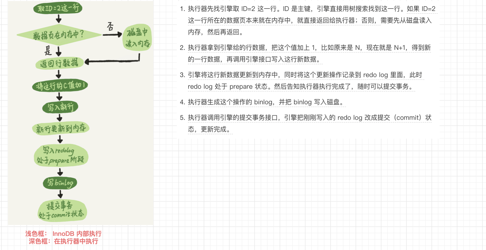
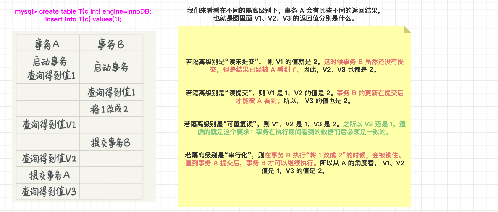

# 写在前面


# 01 | 基础架构：一条SQL查询语句是如何执行的？

看一个事儿千万不要直接陷入细节里，你应该先鸟瞰其全貌，这样能够帮助你从高维度理解问题。

MySQL 的基本架构示意图


你执行 create table 建表的时候，如果不指定引擎类型，默认使用的就是 InnoDB。

不过，你也可以通过指定存储引擎的类型来选择别的引擎，比如在 create table 语句中使用 engine=memory, 来指定使用内存引擎创建表。

不同存储引擎的表数据存取方式不同，支持的功能也不同，在后面的文章中，我们会讨论到引擎的选择。

从图中不难看出，不同的存储引擎共用一个 Server 层，也就是从连接器到执行器的部分。


## 连接器

**连接器负责跟客户端建立连接、获取权限、维持和管理连接。**

<br>

```sql
mysql -h$ip -P$port -u$user -p
```

- 连接命令中的 mysql 是客户端工具，用来跟服务端建立连接。在完成经典的 TCP 握手后，连接器就要开始认证你的身份，这个时候用的就是你输入的用户名和密码。

  - 如果用户名或密码不对，你就会收到一个"Access denied for user"的错误，然后客户端程序结束执行。

  - 如果用户名密码认证通过，连接器会到权限表里面查出你拥有的权限。之后，这个连接里面的权限判断逻辑，都将依赖于此时读到的权限。
  - 这就意味着，一个用户成功建立连接后，即使你用管理员账号对这个用户的权限做了修改，也不会影响已经存在连接的权限。修改完成后，只有再新建的连接才会使用新的权限设置。

<br>

- 连接完成后，如果你没有后续的动作，这个连接就处于空闲状态，你可以在 `show processlist `命令中看到它。

  

  - 下图是 show processlist 的结果，其中的 Command 列显示为“Sleep”的这一行，就表示现在系统里面有一个空闲连接。
  - 客户端如果太长时间没动静，连接器就会自动将它断开。这个时间是由参数 wait_timeout 控制的，默认值是 8 小时。
  - 如果在连接被断开之后，客户端再次发送请求的话，就会收到一个错误提醒： Lost connection to MySQL server during query。这时候如果你要继续，就需要重连，然后再执行请求了。


- 数据库中的长连接和短连接

  

  - 长连接是指连接成功后，如果客户端持续有请求，则一直使用同一个连接。
  - 短连接则是指每次执行完很少的几次查询就断开连接，下次查询再重新建立一个。
  - 建立连接的过程通常是比较复杂的，所以我建议你在使用中要尽量减少建立连接的动作，也就是尽量使用长连接。
  - 长连接的OOM问题：但是全部使用长连接后，你可能会发现，有些时候 MySQL 占用内存涨得特别快，这是因为 MySQL 在执行过程中临时使用的内存是管理在连接对象里面的。这些资源会在连接断开的时候才释放。所以如果长连接累积下来，可能导致内存占用太大，被系统强行杀掉（OOM），从现象看就是 MySQL 异常重启了。
    - 定期断开链接
    - mysql5.7以后可以通过设置mysql_reset_connection来定期重置链接

```bash
考虑以下两种方案解决这个问题：

（1）定期断开长连接。使用一段时间，或者程序里面判断执行过一个占用内存的大查询后，断开连接，之后要查询再重连。
（2）如果你用的是 MySQL 5.7 或更新版本，可以在每次执行一个比较大的操作后，通过执行 mysql_reset_connection 来重新初始化连接资源。
这个过程不需要重连和重新做权限验证，但是会将连接恢复到刚刚创建完时的状态。
```


## 查询缓存

- MySQL 拿到一个查询请求后，会先到查询缓存看看，之前是不是执行过这条语句。之前执行过的语句及其结果可能会以 key-value 对的形式，被直接缓存在内存中。key 是查询的语句，value 是查询的结果。
  - 如果你的查询能够直接在这个缓存中找到 key，那么这个 value 就会被直接返回给客户端。
  - 如果语句不在查询缓存中，就会继续后面的执行阶段。执行完成后，执行结果会被存入查询缓存中。
  - 你可以看到，如果查询命中缓存，MySQL 不需要执行后面的复杂操作，就可以直接返回结果，这个效率会很高。
- 但是大多数情况下我会建议你不要使用查询缓存，为什么呢？因为查询缓存往往弊大于利。
  - 查询缓存的失效非常频繁，只要有对一个表的更新，这个表上所有的查询缓存都会被清空。
  - 除非你的业务就是有一张静态表，很长时间才会更新一次。比如，一个系统配置表，那这张表上的查询才适合使用查询缓存。

- 需要注意的是，**MySQL 8.0 版本直接将查询缓存的整块功能删掉了**，也就是说 8.0 开始彻底没有这个功能了。


## 分析器

如果没有命中查询缓存，就要开始真正执行语句了。首先，MySQL 需要知道你要做什么，因此需要对 SQL 语句做解析。

<br>

- 词法分析
  - MySQL 从你输入的"select"这个关键字识别出来，这是一个查询语句。
  - 它也要把字符串“T”识别成“表名 T”，把字符串“ID”识别成“列 ID”。
- 语法分析
  - 根据词法分析的结果，语法分析器会根据语法规则，判断你输入的这个 SQL 语句是否满足 MySQL 语法。
  - 如果你的语句不对，就会收到“You have an error in your SQL syntax”的错误提醒
  - 一般语法错误会提示第一个出现错误的位置，所以你要关注的是紧接 “use near” 的内容。

```sql
mysql> elect * from t where ID=1;

ERROR 1064 (42000): You have an error in your SQL syntax; check the manual that corresponds to your MySQL server version for the right syntax to use near 'elect * from t where ID=1' at line 1
```


## 优化器（最优执行顺序）

经过了分析器，MySQL 就知道你要做什么了。在开始执行之前，还要先经过优化器的处理。

<br>

- 优化器是在表里面有多个索引的时候，决定使用哪个索引。
- 或者在一个语句有多表关联（join）的时候，决定各个表的连接顺序。


🌸 示例

```sql
mysql> select * from t1 join t2 using(ID)  where t1.c=10 and t2.d=20;
```

- 执行方案：
  - 既可以先从表 t1 里面取出 c=10 的记录的 ID 值，再根据 ID 值关联到表 t2，再判断 t2 里面 d 的值是否等于 20。
  - 也可以先从表 t2 里面取出 d=20 的记录的 ID 值，再根据 ID 值关联到 t1，再判断 t1 里面 c 的值是否等于 10。

这两种执行方法的逻辑结果是一样的，但是执行的效率会有不同，而优化器的作用就是决定选择使用哪一个方案。

优化器阶段完成后，这个语句的执行方案就确定下来了，然后进入执行器阶段。


## 执行器

MySQL 通过分析器知道了你要做什么，通过优化器知道了该怎么做，于是就进入了执行器阶段，开始执行语句。

<br>

- 开始执行的时候，要先判断一下你对这个表 T 有没有执行查询的权限
  - 如果没有，就会返回没有权限的错误（连接器是账号权限校验   分析器是库权限验证   执行器是语句在表中权限验证）
  - 如果有权限，就打开表继续执行。打开表的时候，执行器就会根据表的引擎定义，去使用这个引擎提供的接口。

```sql
mysql> select * from T where ID=10;

ERROR 1142 (42000): SELECT command denied to user 'b'@'localhost' for table 'T'
```

- 比如我们这个例子中的表 T 中，ID 字段没有索引，那么执行器的执行流程是这样的：
  - （1）调用 InnoDB 引擎接口取这个表的第一行，判断 ID 值是不是 10，如果不是则跳过，如果是则将这行存在结果集中；
  - （2）调用引擎接口取“下一行”，重复相同的判断逻辑，直到取到这个表的最后一行。
  - （3）执行器将上述遍历过程中所有满足条件的行组成的记录集作为结果集返回给客户端。

<br>

- 对于有索引的表，执行的逻辑也差不多。
  - 第一次调用的是“取满足条件的第一行”这个接口，之后循环取“满足条件的下一行”这个接口，这些接口都是引擎中已经定义好的。

- 慢查询日志中的 rows_examined 字段记录扫描了多少行。
  - 你会在数据库的慢查询日志中看到一个 rows_examined 的字段，表示这个语句执行过程中扫描了多少行。这个值就是在执行器每次调用引擎获取数据行的时候累加的。
  - 在有些场景下，执行器调用一次，在引擎内部则扫描了多行，因此引擎扫描行数跟 rows_examined 并不是完全相同的。


## 总结


# 02 | 日志系统：一条SQL更新语句是如何执行的？

一条查询语句的执行过程一般是经过连接器、分析器、优化器、执行器等功能模块，最后到达存储引擎。

那么，一条更新语句的执行流程又是怎样的呢？

MySQL 可以恢复到半个月内任意一秒的状态，这是怎样做到的呢？

<br>

从一个表的一条更新语句说起，这个表有一个主键 ID 和一个整型字段 c：

```sql
mysql> create table T(ID int primary key, c int);
```

如果要将 ID=2 这一行的值加 1，SQL 语句就会这么写：

```sql
mysql> update T set c=c+1 where ID=2;
```

首先，可以确定的说，查询语句的那一套流程，更新语句也是同样会走一遍。

```bash
[连接器] 你执行语句前要先连接数据库，这是连接器的工作。

[查询缓存] 前面我们说过，在一个表上有更新的时候，跟这个表有关的查询缓存会失效，所以这条语句就会把表 T 上所有缓存结果都清空。这也就是我们一般不建议使用查询缓存的原因。

[分析器] 接下来，分析器会通过词法和语法解析知道这是一条更新语句。

[优化器] 优化器决定要使用 ID 这个索引。

[执行器] 然后，执行器负责具体执行，找到这一行，然后更新。
```

与查询流程不一样的是，更新流程还涉及两个重要的日志模块

- redo log（重做日志）

- binlog（归档日志）

## 重要的日志模块：redo log（InnoDB 引擎特有）

- 如果有人要赊账或者还账的话，掌柜一般有两种做法：
  - 一种做法是直接把 **账本** 翻出来，把这次赊的账加上去或者扣除掉。
  - 另一种做法是先在 **粉板** 上记下这次的账，等打烊以后再把账本翻出来核算。

- 在 MySQL 里也有这个问题：如果每一次的更新操作都需要写进磁盘，然后磁盘也要找到对应的那条记录，然后再更新，整个过程 IO 成本、查找成本都很高。

<br>

- MySQL 里的 WAL 技术（Write-Ahead Logging）
  - 关键点就是先写日志，再写磁盘，也就是先写粉板，等不忙的时候再写账本。
  - 当有一条记录需要更新的时候，InnoDB 引擎就会先把记录写到 redo log（粉板）里面，并更新内存，这个时候更新就算完成了。
  - 同时，InnoDB 引擎会在适当的时候，将这个操作记录更新到磁盘里面，而这个更新往往是在系统比较空闲的时候做，这就像打烊以后掌柜做的事。


- InnoDB 的 redo log 是固定大小的
  - 比如可以配置为一组 4 个文件，每个文件的大小是 1GB，那么这块“粉板”总共就可以记录 4GB 的操作。

<br>


- 有了 redo log，InnoDB 就可以保证即使数据库发生异常重启，之前提交的记录都不会丢失，这个能力称为 crash-safe。


## 重要的日志模块：binlog（Server 层实现、归档）

MySQL 整体来看，其实就有两块：一块是 Server 层，它主要做的是 MySQL 功能层面的事情；还有一块是引擎层，负责存储相关的具体事宜。

粉板 redo log 是 InnoDB 引擎特有的日志，而 Server 层也有自己的日志，称为 binlog（归档日志）。

为什么会有两份日志呢？

- 因为最开始 MySQL 里并没有 InnoDB 引擎
  - MySQL 自带的引擎是 MyISAM，但是 MyISAM 没有 crash-safe 的能力，binlog 日志只能用于归档。
  - 而 InnoDB 是另一个公司以插件形式引入 MySQL 的，既然只依靠 binlog 是没有 crash-safe 能力的，所以 InnoDB 使用另外一套日志系统——也就是 redo log 来实现 crash-safe 能力。

- 这两种日志有以下三点不同。

|          | redo log                                       | binlog                                                       |
| -------- | ---------------------------------------------- | ------------------------------------------------------------ |
| 层次     | InnoDB 引擎特有的⭐️                             | Server 层实现的，所有引擎都可以使用。                        |
| 记录     | 物理日志，记录的是“在某个数据页上做了什么修改” | 逻辑日志，记录的是这个语句的原始逻辑，比如“给 ID=2 这一行的 c 字段加 1 ” |
| 写的方式 | 循环写的，空间固定会用完                       | 可以追加写入的。“追加写”是指 binlog 文件写到一定大小后会切换到下一个，并不会覆盖以前的日志。 |

- 执行器和 InnoDB 引擎在执行这个简单的 update 语句时的内部流程。

```sql
mysql> update T set c=c+1 where ID=2;
```





将 redo log 的写入拆成了两个步骤：prepare 和 commit，这就是"两阶段提交"。


- binlog还不能去掉
  - 一个原因是，redolog只有InnoDB有，别的引擎没有。
  - 另一个原因是，redolog是循环写的，不持久保存，binlog的“归档”这个功能，redolog是不具备的。 


## 两阶段提交

为什么必须有“两阶段提交”呢？这是为了让两份日志之间的逻辑一致。

### 数据恢复

怎样让数据库恢复到半个月内任意一秒的状态？

- binlog 会记录所有的逻辑操作，并且是采用“追加写”的形式。
  - 如果你的 DBA 承诺说半个月内可以恢复，那么备份系统中一定会保存最近半个月的所有 binlog，同时系统会定期做整库备份。这里的“定期”取决于系统的重要性，可以是一天一备，也可以是一周一备。

- 当需要恢复到指定的某一秒时，比如某天下午两点发现中午十二点有一次误删表，需要找回数据，那你可以这么做（恢复误操作前的数据库状态到一个临时库，然后用临时库当时的数据，选择性的恢复到线上。）

  

  - 首先，找到最近的一次全量备份，如果你运气好，可能就是昨天晚上的一个备份，从这个备份恢复到临时库；
  - 然后，从备份的时间点开始，将备份的 binlog 依次取出来，重放到中午误删表之前的那个时刻。
  - 这样你的临时库就跟误删之前的线上库一样了，然后你可以把表数据从临时库取出来，按需要恢复到线上库去。

### 为什么

为什么日志需要“两阶段提交”。这里不妨用反证法来进行解释。

如果不使用“两阶段提交”，那么数据库的状态就有可能和用它的日志恢复出来的库的状态不一致。

<br>

由于 redo log 和 binlog 是两个独立的逻辑，如果不用两阶段提交，要么就是先写完 redo log 再写 binlog，或者采用反过来的顺序。我们看看这两种方式会有什么问题。

- 先写 redo log 后写 binlog
  - 假设在 redo log 写完，binlog 还没有写完的时候，MySQL 进程异常重启。
  - 由于我们前面说过的，redo log 写完之后，系统即使崩溃，仍然能够把数据恢复回来，所以恢复后这一行 c 的值是 1。
  - 但是由于 binlog 没写完就 crash 了，这时候 binlog 里面就没有记录这个语句。因此，之后备份日志的时候，存起来的 binlog 里面就没有这条语句。
  - 然后你会发现，如果需要用这个 binlog 来恢复临时库的话，由于这个语句的 binlog 丢失，这个临时库就会少了这一次更新，恢复出来的这一行 c 的值就是 0，与原库的值不同。

- 先写 binlog 后写 redo log。

  - 如果在 binlog 写完之后 crash，由于 redo log 还没写，崩溃恢复以后这个事务无效，所以这一行 c 的值是 0。

    但是 binlog 里面已经记录了“把 c 从 0 改成 1”这个日志。所以，在之后用 binlog 来恢复的时候就多了一个事务出来，恢复出来的这一行 c 的值就是 1，与原库的值不同。


简单说，redo log 和 binlog 都可以用于表示事务的提交状态，而两阶段提交就是让这两个状态保持逻辑上的一致。

## 总结

- MySQL 里面最重要的两个日志，即物理日志 redo log 和逻辑日志 binlog。


- redo log 用于保证 crash-safe 能力。
  - nnodb_flush_log_at_trx_commit 这个参数设置成 1 的时候，表示每次事务的 redo log 都直接持久化到磁盘。
  - 这个参数我建议你设置成 1，这样可以保证 MySQL 异常重启之后数据不丢失。

- binlog
  - sync_binlog 这个参数设置成 1 的时候，表示每次事务的 binlog 都持久化到磁盘。
  - 这个参数我也建议你设置成 1，这样可以保证 MySQL 异常重启之后 binlog 不丢失。

- redo log和binlog都是先写入内存buffer再落磁盘的（待整理）
- MySQL 日志系统密切相关的“两阶段提交”。
  - MySQL 日志系统密切相关的“两阶段提交”。


# 03 | 事务隔离：为什么你改了我还看不见？

最经典的例子就是转账，你要给朋友小王转 100 块钱，而此时你的银行卡只有 100 块钱。

简单来说，事务就是要保证一组数据库操作，要么全部成功，要么全部失败。

- 在 MySQL 中，事务支持是在引擎层实现的。
  - MySQL 是一个支持多引擎的系统，但并不是所有的引擎都支持事务。
  - 比如 MySQL 原生的 MyISAM 引擎就不支持事务，这也是 MyISAM 被 InnoDB 取代的重要原因之一。


## 隔离性与隔离级别

- 四大特性
  - 提到事务，你肯定会想到 ACID（Atomicity、Consistency、Isolation、Durability，即原子性、一致性、隔离性、持久性）。

- 三大问题（当数据库上有多个事务同时执行的时候，就可能出现）
  - 脏读（dirty read）、不可重复读（non-repeatable read）、幻读（phantom read）的问题
  - 为了解决这些问题，就有了“隔离级别”的概念。

- 四个隔离级别

  - 你隔离得越严实，效率就会越低。因此很多时候，我们都要在二者之间寻找一个平衡点。

  

  - 读未提交（read uncommitted）：一个事务还没提交时，它做的变更就能被别的事务看到。
  - 读已提交（read committed）：一个事务提交之后，它做的变更才会被其他事务看到。
  - 可重复读（repeatable read）：一个事务执行过程中看到的数据，总是跟这个事务在启动时看到的数据是一致的。⭐️
  - 和串行化（serializable ）：对于同一行记录，“写”会加“写锁”，“读”会加“读锁”。当出现读写锁冲突的时候，后访问的事务必须等前一个事务执行完成，才能继续执行。

```bash
读未提交：别人改数据的事务尚未提交，我在我的事务中也能读到。 

读已提交：别人改数据的事务已经提交，我在我的事务中才能读到。

可重复读：别人改数据的事务已经提交，我在我的事务中也不去读。 

串行：我的事务尚未提交，别人就别想改数据。 这4种隔离级别，并行性能依次降低，安全性依次提高。
```


🌰 举个例子




- 在实现上，数据库里面会创建一个视图，访问的时候以视图的逻辑结果为准。
  - 在“可重复读”隔离级别下，这个视图是在事务启动时创建的，整个事务存在期间都用这个视图。
  - 在“读已提交”隔离级别下，这个视图是在每个 SQL 语句开始执行的时候创建的。
  - “读未提交”隔离级别下直接返回记录上的最新值，没有视图概念；
  - 而“串行化”隔离级别下直接用加锁的方式来避免并行访问。

- 总结来说，存在即合理，每种隔离级别都有自己的使用场景，你要根据自己的业务情况来定。


## 事务隔离的实现

理解了事务的隔离级别，我们再来看看事务隔离具体是怎么实现的。这里我们展开说明“可重复读”。


- 在 MySQL 中，实际上每条记录在更新的时候都会同时记录一条回滚操作。
  - 记录上的最新值，通过回滚操作，都可以得到前一个状态的值。
  - 假设一个值从 1 被按顺序改成了 2、3、4，在回滚日志里面就会有类似下面的记录。


- 回滚日志总不能一直保留吧，什么时候删除呢？
  - 在不需要的时候才删除。也就是说，系统会判断，当没有事务再需要用到这些回滚日志时，回滚日志会被删除。
  - 什么时候才不需要了呢？就是当系统里没有比这个回滚日志更早的 read-view 的时候。


## 事务的启动方式

- MySQL 的事务启动方式有以下几种
  - 显式启动事务语句， begin 或 start transaction。配套的提交语句是 commit，回滚语句是 rollback。
  - set autocommit=0，这个命令会将这个线程的自动提交关掉。
    - 意味着如果你只执行一个 select 语句，这个事务就启动了，而且并不会自动提交。这个事务持续存在直到你主动执行 commit 或 rollback 语句，或者断开连接。


## 总结


# 04 | 深入浅出索引（上）

## 索引的常见模型

索引的出现是为了提高查询效率，但是实现索引的方式却有很多种，所以这里也就引入了索引模型的概念。

可以用于提高读写效率的数据结构很多，如哈希表、有序数组和搜索树。

### （1）哈希表

哈希表是一种以键 - 值（key-value）存储数据的结构，我们只要输入待查找的键即 key，就可以找到其对应的值即 Value。


### （2）有序数组

### （3）搜索树


## InnoDB 的索引模型

InnoDB 使用了 B+ 树索引模型，所以数据都是存储在 B+ 树中的。


## 索引维护

## 总结


# 05 | 深入浅出索引（下）


