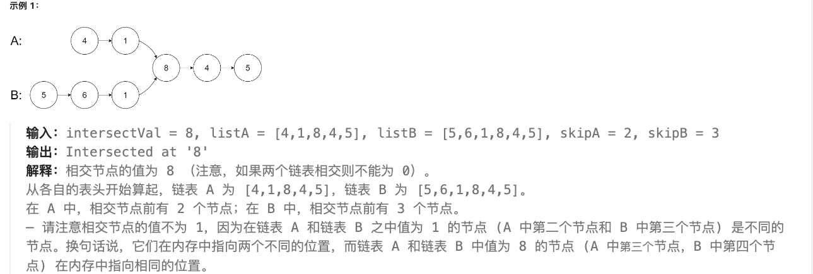
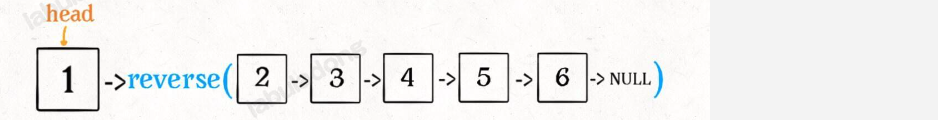
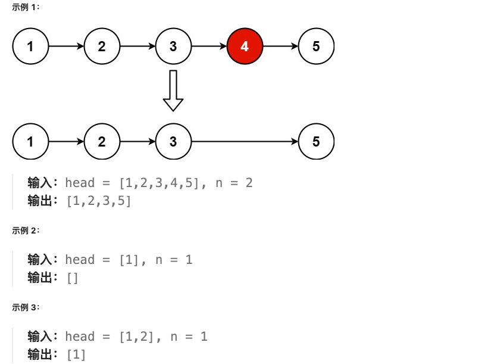
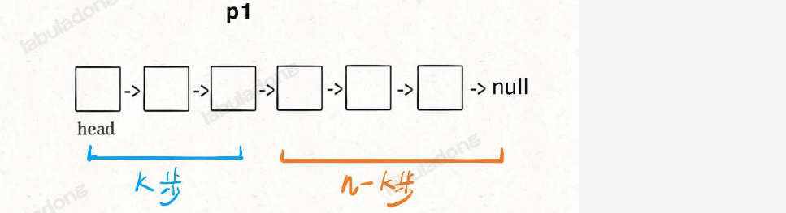

地址：https://leetcode.cn/studyplan/top-100-liked/


# 哈希

## 1.两数之和

### 题目描述

给定一个整数数组 `nums` 和一个整数目标值 `target`，请你在该数组中找出 **和为目标值** *`target`* 的那 **两个** 整数，并返回它们的数组下标。

你可以假设每种输入只会对应一个答案。但是，数组中同一个元素在答案里不能重复出现。

你可以按任意顺序返回答案。

### 问题分析

方法1：考虑暴力枚举法。注意的是，我们寻找和 `target - nums[i]` 匹配的值时，只用匹配 nums[i] 之后的值，因为之前的已经匹配过。

方法2：考虑哈希表 `HashMap<Integer, Integer>`。


### Solution

```java
public static int[] twoSum(int[] nums, int target) {
    int length = nums.length;
    int[] arr = new int[length];
    // 目标数组 [7, 2, -2, -6]
    for(int i = 0;i < length; i++){
        arr[i] = target - nums[i];
    }
    // 遍历
    int a = 0; int b = 0;
    for(int i = 0; i < length; i++){
        if (a != 0 && b != 0){
            break;
        }
        // nums[0] = 2
        for(int j = 0; j < length; j++){
            if(nums[i] == arr[j]){
                a = i;
                b = j;
                break;
            }
        }
    }
    System.out.println(a);
    System.out.println(b);
    return new int[]{a, b};
}
```


```java
public int[] twoSum2(int[] nums, int target) {
    HashMap<Integer, Integer> hashMap = new HashMap<>();
    for (int i = 0; i < nums.length; i++) {
        if (hashMap.containsKey(target - nums[i])){
            return new int[]{hashMap.get(target - nums[i]), i};
        }
        hashMap.put(nums[i], i);
    }
    return new int[]{};
}
```


# 双指针

# 滑动窗口

# 子串

# 普通数组

# 矩阵


# 链表

## [160. 相交链表](https://leetcode.cn/problems/intersection-of-two-linked-lists/) E

给你两个单链表的头节点 `headA` 和 `headB` ，请你找出并返回两个单链表相交的起始节点。如果两个链表不存在相交节点，返回 `null` 。题目数据 **保证** 整个链式结构中不存在环。



- 双指针解法：对于两个链表A和B，我们让它们依次走过 A+B 和 B+A。有相交结点时，它们会同时经过这个相交结点。没有相交结点时，两个结点同时为 `null`，满足条件 `p2=p2` 跳出 `while` 循环。

```java
/**
 * Definition for singly-linked list.
 * public class ListNode {
 *     int val;
 *     ListNode next;
 *     ListNode(int x) {
 *         val = x;
 *         next = null;
 *     }
 * }
 */
public class Solution {
    public ListNode getIntersectionNode(ListNode headA, ListNode headB) {
        ListNode p1 = headA;
        ListNode p2 = headB;

        while(p1 != p2){
            if(p1 == null){
                p1 = headB;
            } else {
                p1 = p1.next; 
            }
            if(p2 == null){
                p2 = headA;
            } else {
                p2 = p2.next;
            }
        }
        return p1;
    }
}
```


## [206. 反转链表](https://leetcode.cn/problems/reverse-linked-list/) E

给你单链表的头节点 `head` ，请你反转链表，并返回反转后的链表。

**进阶：**链表可以选用迭代或递归方式完成反转。你能否用两种方法解决这道题？

- 思路1：用栈

```java
class Solution {
    public ListNode reverseList(ListNode head) {
        if(head == null || head.next == null){
            return head;
        }
        Stack<Integer> stack = new Stack<>();

        ListNode curNode = head;
        while(curNode != null){
            stack.push(curNode.val);
            curNode = curNode.next;
        }

        ListNode curNodeNew = head;
        while (!stack.isEmpty()){
            ListNode itemNode = new ListNode(stack.pop());
            curNodeNew.next = itemNode;
            curNodeNew = itemNode;
        }
        return head.next;
    }
}
```

- 思路2：用递归




```java
class Solution {
    public ListNode reverseList(ListNode head) {
        if(head == null || head.next == null){
            return head;
        }

        ListNode last = reverseList(head.next);
        head.next.next = head;
        head.next = null;
        return last;
    }
}
```

- 思路3：直接修改指针的 next

```java
class Solution {
    public ListNode reverseList(ListNode head) {
        if(head == null || head.next == null){
            return head;
        }

        ListNode p1 = head;
        ListNode p2 = head.next;

        ListNode curNode = null;
        while(p2 != null && p2.next != null){
            curNode = p2.next;
            p2.next = p1;
            p1 = p2;
            p2 = curNode;
        }
        head.next = null;
        p2.next = p1;
        return p2;
    }
}
```


## [234. 回文链表](https://leetcode.cn/problems/palindrome-linked-list/) E

给你一个单链表的头节点 `head` ，请你判断该链表是否为回文链表。如果是，返回 `true` ；否则，返回 `false` 。

**进阶：**你能否用 `O(n)` 时间复杂度和 `O(1)` 空间复杂度解决此题？


- 思路1：用两个栈（不太OK）
- 思路2：将值复制到数组后用双指针

```java
class Solution {
    public boolean isPalindrome(ListNode head) {
        // 将链表复制到数组后，再判断是否回文
        List<Integer> nodeList = new ArrayList();

        ListNode curNode = head;
        while(curNode != null){
            nodeList.add(curNode.val);
            curNode = curNode.next;
        }

        // 判断
        int total = nodeList.size();
        int startPos = 0;
        int endPos = total - startPos - 1;

        while(startPos < endPos){
            if(nodeList.get(startPos) == nodeList.get(endPos)){
                startPos += 1;
                endPos -= 1;
            } else {
                return false;
            }
        }
        return true;
    }
}
```


## [141. 环形链表](https://leetcode.cn/problems/linked-list-cycle/) E

给你一个链表的头节点 `head` ，判断链表中是否有环。

如果链表中有某个节点，可以通过连续跟踪 `next` 指针再次到达，则链表中存在环。 为了表示给定链表中的环，评测系统内部使用整数 `pos` 来表示链表尾连接到链表中的位置（索引从 0 开始）。**注意：`pos` 不作为参数进行传递** 。仅仅是为了标识链表的实际情况。

*如果链表中存在环* ，则返回 `true` 。 否则，返回 `false` 。


## [19. 删除链表的倒数第 N 个结点](https://leetcode.cn/problems/remove-nth-node-from-end-of-list/) M

给你一个链表，删除链表的倒数第 `n` 个结点，并且返回链表的头结点。




- 思路1：获取待删除结点的前一个结点的引用

```java
/**
 * Definition for singly-linked list.
 * public class ListNode {
 *     int val;
 *     ListNode next;
 *     ListNode() {}
 *     ListNode(int val) { this.val = val; }
 *     ListNode(int val, ListNode next) { this.val = val; this.next = next; }
 * }
 */
class Solution {
    public ListNode removeNthFromEnd(ListNode head, int n) {
        if (head.next == null) {
            return null;
        }

        // 获取结点数量
        int total = 1;
        ListNode item = head;
        while (item.next != null){
            total += 1;
            item = item.next;
        }

        // 获取移除元素的位置
        int removePos;
        removePos = (n == total) ? total : total - n + 1;

        // 获取删除结点前一个结点的引用
        ListNode removeItem = head;
        for (int i = 1; i < removePos - 1; i++) {
            removeItem = removeItem.next;
        }
        if (n == total){
            removeItem = removeItem.next;
        }

        // 修改引用删除节点
        if (n == total){
            head = head.next;
        } else if (n == 1){
            removeItem.next = null;
        } else {
            removeItem.next = removeItem.next.next;
        }
        return head;
    }
}
```

- 思路2：双指针（获得倒数第 `n + 1` 个节点的引用）




```java
class Solution {
    public ListNode removeNthFromEnd(ListNode head, int n) {
        ListNode dummy = new ListNode(-1);
        dummy.next = head;
        // 返回第n-k个结点
        ListNode nkNode = getNkNode(dummy, n + 1);
        nkNode.next = nkNode.next.next;
        return dummy.next;
    }

    ListNode getNkNode(ListNode dummy, int k){
        ListNode p1 = dummy;
        // p1走k步
        for(int i = 0; i < k; i++){
            p1 = p1.next;
        }
        ListNode p2 = dummy;
        // p1,p2都走n-k步
        while(p1 != null){
            p1 = p1.next;
            p2 = p2.next;
        }
        return p2;
    }
}
```


# 二叉树

# 回溯

# 二分查找

# 栈

# 堆

# 贪心算法

# 动态规划

# 技巧


