[TOC]

## 课程知识点

```
1、权限系统的整体概念
2、shiro权限框架的核心组件
3、springboot下shiro的使用
4、shiro认证鉴权的缓存机制
5、分布式下使用shrio处理统一会话
6、密码重试次数，并发登录控制
7、前后端分离的鉴权方式
8、建立分布式统一鉴权系统
```

## 第一章  权限概述

### 1、什么是权限

​		权限管理，一般指根据系统设置的安全策略或者安全规则，用户可以访问而且只能访问自己被授权的资源，不多不少。权限管理几乎出现在任何系统里面，只要有用户和密码的系统。 

权限管理在系统中一般分为：

- 访问权限

  ```properties
  一般表示你能做什么样的操作，或者能够访问那些资源。例如：给张三赋予“店铺主管”角色，“店铺主管”具有“查询员工”、“添加员工”、“修改员工”和“删除员工”权限。此时张三能够进入系统，则可以进行这些操作
  ```

- 数据权限

  ```properties
  一般表示某些数据是否属于你，或者属于你可以操作的范围。例如：张三是"店铺主管"角色，他可以看他手下人员所有的服务买家订单信息，他的手下只能看自己负责的订单信息
  ```

### 2、认证概念

#### 【1】什么是认证

​		身份认证，就是判断一个用户是否为合法用户的处理过程。最常用的简单身份认证方式是系统通过核对用户输入的用户名和密码，看其是否与系统中存储的该用户的用户名和密码一致，来判断用户身份是否正确。例如：密码登录，手机短信验证、三方授权等

#### 【2】认证流程


#### 【3】关键对象

​		上边的流程图中需要理解以下关键对象：

​        **Subject**：主体：访问系统的用户，主体可以是用户、程序等，进行认证的都称为主体；

​        **Principal**：身份信息是主体（subject）进行身份认证的标识，标识必须具有唯一性，如用户名、手机号、邮箱地址等，一个主体可以有多个身份，但是必须有一个主身份（Primary Principal）。

​        **credential**：凭证信息：是只有主体自己知道的安全信息，如密码、证书等。

### 3、授权概念

#### 【1】什么是授权

​		授权，即访问控制，控制谁能访问哪些资源。主体进行身份认证后，系统会为其分配对应的权限，当访问资

源时，会校验其是否有访问此资源的权限。

这里首先理解4个对象。

​		用户对象user：当前操作的用户、程序。

​		资源对象resource：当前被访问的对象

​		角色对象role ：一组 "权限操作许可权" 的集合。

​		权限对象permission：权限操作许可权

#### 【2】授权流程


#### 【3】关键对象

**授权可简单理解为who对what进行How操作**

**Who：**主体（Subject），可以是一个用户、也可以是一个程序

**What：**资源（Resource），如系统菜单、页面、按钮、方法、系统商品信息等。

​		访问类型：商品菜单，订单菜单、分销商菜单

​		数据类型：我的商品，我的订单，我的评价

**How：**权限/许可（Permission）

​		我的商品（资源）===>访问我的商品(权限许可)

​		分销商菜单（资源）===》访问分销商列表（权限许可）		

## 第二章 Shiro概述

### 1、Shiro简介

#### 【1】什么是Shiro?

​		Shiro是apache旗下一个开源框架，它将软件系统的安全认证相关的功能抽取出来，实现用户身份认证，权限授权、加密、会话管理等功能，组成了一个通用的安全认证框架。

#### 【2】Shiro 的特点

​		Shiro 是一个强大而灵活的开源安全框架，能够非常清晰的处理认证、授权、管理会话以及密码加密。如下是它所具有的特点：

· 易于理解的 Java Security API；

· 简单的身份认证（登录），支持多种数据源（LDAP，JDBC 等）；

· 对角色的简单的签权（访问控制），也支持细粒度的鉴权；

· 支持一级缓存，以提升应用程序的性能；

· 内置的基于 POJO 企业会话管理，适用于 Web 以及非 Web 的环境；

· 异构客户端会话访问；（十一章）

· 非常简单的加密 API；

· 不跟任何的框架或者容器捆绑，可以独立运行。

### 2、核心组件

- Shiro架构图


- Subject

```properties
Subject主体，外部应用与subject进行交互，subject将用户作为当前操作的主体，这个主体：可以是一个通过浏览器请求的用户，也可能是一个运行的程序。Subject在shiro中是一个接口，接口中定义了很多认证授相关的方法，外部程序通过subject进行认证授，而subject是通过SecurityManager安全管理器进行认证授权
```

- SecurityManager

```properties
SecurityManager权限管理器，它是shiro的核心，负责对所有的subject进行安全管理。通过SecurityManager可以完成subject的认证、授权等，SecurityManager是通过Authenticator进行认证，通过Authorizer进行授权，通过SessionManager进行会话管理等。SecurityManager是一个接口，继承了Authenticator, Authorizer, SessionManager这三个接口
```

- Authenticator

```properties
Authenticator即认证器，对用户登录时进行身份认证
```

- Authorizer

```properties
Authorizer授权器，用户通过认证器认证通过，在访问功能时需要通过授权器判断用户是否有此功能的操作权限。
```

- Realm（数据库读取+认证功能+授权功能实现）

```properties
Realm领域，相当于datasource数据源，securityManager进行安全认证需要通过Realm获取用户权限数据
比如：
	如果用户身份数据在数据库那么realm就需要从数据库获取用户身份信息。
注意：
	不要把realm理解成只是从数据源取数据，在realm中还有认证授权校验的相关的代码。　
```

- SessionManager

```properties
SessionManager会话管理，shiro框架定义了一套会话管理，它不依赖web容器的session，所以shiro可以使用在非web应用上，也可以将分布式应用的会话集中在一点管理，此特性可使它实现单点登录。
```

- SessionDAO

```properties
SessionDAO即会话dao，是对session会话操作的一套接口
比如:
	可以通过jdbc将会话存储到数据库
	也可以把session存储到缓存服务器
```

- CacheManager 

```properties
CacheManager缓存管理，将用户权限数据存储在缓存，这样可以提高性能
```

- Cryptography

```
Cryptography密码管理，shiro提供了一套加密/解密的组件，方便开发。比如提供常用的散列、加/解密等功能
```


## 第三章 Shiro入门

### 1、身份认证（核心）

#### 【1】基本流程


>  流程如下：
>
> ​	1、Shiro把用户的数据封装成标识token，token一般封装着用户名，密码等信息
>
> ​	2、使用Subject门面获取到封装着用户的数据的标识token
>
> ​	3、Subject把标识token交给SecurityManager，在SecurityManager安全中心中，SecurityManager把标识token委托给认证器Authenticator进行身份验证。认证器的作用一般是用来指定如何验证，它规定本次认证用到哪些Realm
>
> ​	4、认证器Authenticator将传入的标识token，与数据源Realm对比，验证token是否合法
>

#### 【2】案例演示

##### 【2.1】需求

```
1、使用shiro完成一个用户的登录
```

##### 【2.2】实现

###### 【2.2.1】新建项目

shiro-day01-01authenticator


###### 【2.2.2】导入依赖

```xml
<?xml version="1.0" encoding="UTF-8"?>

<project xmlns="http://maven.apache.org/POM/4.0.0" xmlns:xsi="http://www.w3.org/2001/XMLSchema-instance"
  xsi:schemaLocation="http://maven.apache.org/POM/4.0.0 http://maven.apache.org/xsd/maven-4.0.0.xsd">
  <modelVersion>4.0.0</modelVersion>

  <groupId>com.itheima.shiro</groupId>
  <artifactId>shiro-day01-01authenticator</artifactId>
  <version>1.0-SNAPSHOT</version>

  <name>shiro-day01-01authenticator</name>
  <!-- FIXME change it to the project's website -->
  <url>http://www.example.com</url>

  <properties>
    <project.build.sourceEncoding>UTF-8</project.build.sourceEncoding>
  </properties>

  <dependencies>

    <dependency>
      <groupId>commons-logging</groupId>
      <artifactId>commons-logging</artifactId>
      <version>1.1.3</version>
    </dependency>

    <dependency>
      <groupId>org.apache.shiro</groupId>
      <artifactId>shiro-core</artifactId>
      <version>1.3.2</version>
    </dependency>

    <dependency>
      <groupId>junit</groupId>
      <artifactId>junit</artifactId>
      <version>4.11</version>
    </dependency>

  </dependencies>

  <build>
    <plugins>
      <!-- compiler插件, 设定JDK版本 -->
      <plugin>
        <groupId>org.apache.maven.plugins</groupId>
        <artifactId>maven-compiler-plugin</artifactId>
        <version>3.1</version>
        <configuration>
          <source>8</source>
          <target>8</target>
          <showWarnings>true</showWarnings>
        </configuration>
      </plugin>
    </plugins>
  </build>
</project>

```

###### 【2.2.3】编写shiro.ini

```ini
#声明用户账号
[users]
jay=123
```

###### 【2.2.4】编写HelloShiro

```java
package com.itheima.shiro;

import org.apache.shiro.SecurityUtils;
import org.apache.shiro.authc.UsernamePasswordToken;
import org.apache.shiro.config.IniSecurityManagerFactory;
import org.apache.shiro.mgt.SecurityManager;
import org.apache.shiro.subject.Subject;
import org.apache.shiro.util.Factory;
import org.junit.Test;

/**
 * @Description：shiro的第一个例子
 */
public class HelloShiro {

    @Test
    public void shiroLogin() {
        //导入权限ini文件构建权限工厂
        Factory<SecurityManager> factory = new IniSecurityManagerFactory("classpath:shiro.ini");
        //工厂构建安全管理器
        SecurityManager securityManager = factory.getInstance();
        //使用SecurityUtils工具生效安全管理器
        SecurityUtils.setSecurityManager(securityManager);
        //使用SecurityUtils工具获得主体
        Subject subject = SecurityUtils.getSubject();
        //构建账号token
        UsernamePasswordToken usernamePasswordToken = new UsernamePasswordToken("jay", "123");
        //登录操作
        subject.login(usernamePasswordToken);
        System.out.println("是否登录成功：" + subject.isAuthenticated());
    }
}

```

【2.2.4】测试


##### 【2.3】小结

```
1、权限定义：ini文件
2、加载过程:
	导入权限ini文件构建权限工厂
	工厂构建安全管理器
	使用SecurityUtils工具生效安全管理器
	使用SecurityUtils工具获得主体
	使构建账号token用SecurityUtils工具获得主体
	构建账号token
	登录操作
```

### 2、Realm

#### 【1】Realm接口


> 所以，一般在真实的项目中，我们不会直接实现Realm接口，我们一般的情况就是直接继承AuthorizingRealm，能够继承到认证与授权功能。它需要强制重写两个方法

```java
public class DefinitionRealm extends AuthorizingRealm {
 
    /**
	 * @Description 认证
	 * @param authcToken token对象
	 * @return 
	 */
	public abstract AuthenticationInfo doGetAuthenticationInfo(AuthenticationToken authcToken) {
        return null;
    }

	/**
	 * @Description 鉴权
	 * @param principals 令牌
	 * @return
	 */
	public abstract AuthorizationInfo doGetAuthorizationInfo(PrincipalCollection principals){
        return null;
    }
}
```

#### 【2】自定义Realm

##### 【2.1】需求

```
1、自定义Realm，取得密码用于比较
```

##### 【2.2】实现

###### 【2.2.1】创建项目 shiro-day01-02realm


###### 【2.2.2】定义SecurityService

SecurityService

```java
package com.itheima.shiro.service;

/**
 * @Description：权限服务接口
 */
public interface SecurityService {

    /**
     * @Description 查找密码按用户登录名
     * @param loginName 登录名称
     * @return
     */
    String findPasswordByLoginName(String loginName);
}

```

SecurityServiceImpl

```java
package com.itheima.shiro.service.impl;

import com.itheima.shiro.service.SecurityService;

/**
 * @Description：权限服务层
 */
public class SecurityServiceImpl implements SecurityService {

    @Override
    public String findPasswordByLoginName(String loginName) {
        return "123";
    }
}

```

###### 【2.2.3】定义DefinitionRealm

```java
package com.itheima.shiro.realm;

import com.itheima.shiro.service.SecurityService;
import com.itheima.shiro.service.impl.SecurityServiceImpl;
import org.apache.shiro.authc.*;
import org.apache.shiro.authz.AuthorizationInfo;
import org.apache.shiro.realm.AuthorizingRealm;
import org.apache.shiro.subject.PrincipalCollection;

/**
 * @Description：声明自定义realm
 */
public class DefinitionRealm extends AuthorizingRealm {

    /**
     * @Description 认证接口
     * @param token 传递登录token
     * @return
     */
    @Override
    protected AuthenticationInfo doGetAuthenticationInfo(AuthenticationToken token) throws AuthenticationException {
        //从AuthenticationToken中获得登录名称
        String loginName = (String) token.getPrincipal();
        SecurityService securityService = new SecurityServiceImpl();
        String password = securityService.findPasswordByLoginName(loginName);
        if ("".equals(password)||password==null){
            throw new UnknownAccountException("账户不存在");
        }
        //传递账号和密码
        return  new SimpleAuthenticationInfo(loginName,password,getName());
    }


    @Override
    protected AuthorizationInfo doGetAuthorizationInfo(PrincipalCollection principals) {
        return null;
    }

}

```

###### 【2.2.4】编辑shiro.ini

```ini
#声明自定义的realm，且为安全管理器指定realms
[main]
definitionRealm=com.itheima.shiro.realm.DefinitionRealm
securityManager.realms=$definitionRealm
#声明用户账号
#[users]
#jay=123
```

#### 【3】认证源码跟踪

（1）通过debug模式追踪源码subject.login(token) 发现。首先是进入Subject接口的默认实现类。果然，Subject将用户的用户名密码委托给了`securityManager`去做。


（2）然后，securityManager说：“卧槽，认证器authenticator小弟，听说你的大学学的专业就是认证呀，那么这个认证的任务就交给你咯”。遂将用户的token委托给内部认证组件`authenticator`去做


（3）事实上，securityManager的内部组件一个比一个懒。内部认证组件authenticator说：“你们传过来的token我需要拿去跟数据源Realm做对比，这样吧，这个光荣的任务就交给`Realm`你去做吧”。Realm对象：“一群大懒虫！”。


（4）Realm在接到内部认证组件authenticator组件后很伤心，最后对电脑前的你说：“大兄弟，对不住了，你去实现一下呗”。从图中的方法体中可以看到，当前对象是Realm类对象，即将调用的方法是doGetAuthenticationInfo(token)。而这个方法，就是你即将要重写的方法。如果帐号密码通过了，那么返回一个认证成功的info凭证。如果认证失败，抛出一个异常就好了。你说：“什么?最终还是劳资来认证？”没错，就是苦逼的你去实现了，谁叫你是程序猿呢。所以，你不得不查询一下数据库，重写doGetAuthenticationInfo方法，查出来正确的帐号密码，返回一个正确的凭证info


（5）好了，这个时候你自己编写了一个类，继承了AuthorizingRealm，并实现了上述doGetAuthenticationInfo方法。你在doGetAuthenticationInfo中编写了查询数据库的代码，并将数据库中存放的用户名与密码封装成了一个AuthenticationInfo对象返回。可以看到下图中，info这个对象是有值的，说明从数据库中查询出来了正确的帐号密码


（6）那么，接下来就很简单了。把用户输入的帐号密码与刚才你从数据库中查出来的帐号密码对比一下即可。**token封装着用户的帐号密码，AuthenticationInfo封装着从数据库中查询出来的帐号密码。**再往下追踪一下代码，最终到了下图中的核心区域。如果没有报异常，说明本次登录成功。


### 3、编码、散列算法

#### 【1】编码与解码

Shiro提供了base64和16进制字符串编码/解码的API支持，方便一些编码解码操作。

Shiro内部的一些数据的【存储/表示】都使用了base64和16进制字符串

##### 【1.1】需求

```
理解base64和16进制字符串编码/解码
```

##### 【1.2】新建项目

新建shiro-day01-03encode-decode


##### 【1.3】新建EncodesUtil

```java
package com.itheima.shiro.tools;

import org.apache.shiro.codec.Base64;
import org.apache.shiro.codec.Hex;

/**
 * @Description：封装base64和16进制编码解码工具类
 */
public class EncodesUtil {

    /**
     * @Description HEX-byte[]--String转换
     * @param input 输入数组
     * @return String
     */
    public static String encodeHex(byte[] input){
        return Hex.encodeToString(input);
    }

    /**
     * @Description HEX-String--byte[]转换
     * @param input 输入字符串
     * @return byte数组
     */
    public static byte[] decodeHex(String input){
        return Hex.decode(input);
    }

    /**
     * @Description Base64-byte[]--String转换
     * @param input 输入数组
     * @return String
     */
    public static String encodeBase64(byte[] input){
        return Base64.encodeToString(input);
    }

    /**
     * @Description Base64-String--byte[]转换
     * @param input 输入字符串
     * @return byte数组
     */
    public static byte[] decodeBase64(String input){
        return Base64.decode(input);
    }

}

```

##### 【1.4】新建ClientTest

```java
package com.itheima.shiro.client;

import com.itheima.shiro.tools.EncodesUtil;
import org.junit.Test;

/**
 * @Description：测试
 */
public class ClientTest {

    /**
     * @Description 测试16进制编码
     */
    @Test
    public void testHex(){
        String val = "holle";
        String flag = EncodesUtil.encodeHex(val.getBytes());
        String valHandler = new String(EncodesUtil.decodeHex(flag));
        System.out.println("比较结果："+val.equals(valHandler));
    }

    /**
     * @Description 测试base64编码
     */
    @Test
    public void testBase64(){
        String val = "holle";
        String flag = EncodesUtil.encodeBase64(val.getBytes());
        String valHandler = new String(EncodesUtil.decodeBase64(flag));
        System.out.println("比较结果："+val.equals(valHandler));
    }


}

```

【1.5】小结

```
1、shiro目前支持的编码与解码：
	base64
 		（HEX）16进制字符串
2、那么shiro的编码与解码什么时候使用呢？又是怎么使用的呢？
```

#### 【2】散列算法

散列算法一般用于生成数据的摘要信息，是一种不可逆的算法，一般适合存储密码之类的数据，常见的散列算法如MD5、SHA等。一般进行散列时最好提供一个salt（盐），比如加密密码“admin”，产生的散列值是“21232f297a57a5a743894a0e4a801fc3”，可以到一些md5解密网站很容易的通过散列值得到密码“admin”，即如果直接对密码进行散列相对来说破解更容易，此时我们可以加一些只有系统知道的干扰数据，如salt（即盐）；这样散列的对象是“密码+salt”，这样生成的散列值相对来说更难破解。

shiro支持的散列算法：

Md2Hash、Md5Hash、Sha1Hash、Sha256Hash、Sha384Hash、Sha512Hash


##### 【2.1】新增DigestsUtil

```java
package com.itheima.shiro.tools;

import com.sun.org.apache.bcel.internal.generic.NEW;
import org.apache.shiro.crypto.SecureRandomNumberGenerator;
import org.apache.shiro.crypto.hash.SimpleHash;
import sun.security.util.Password;

import java.util.HashMap;
import java.util.Map;

/**
 * @Description：摘要
 */
public class DigestsUtil {

    private static final String SHA1 = "SHA-1";

    private static final Integer ITERATIONS =512;

    /**
     * @Description sha1方法
     * @param input 需要散列字符串
     * @param salt 盐字符串
     * @return
     */
    public static String sha1(String input, String salt) {
       return new SimpleHash(SHA1, input, salt,ITERATIONS).toString();
    }

    /**
     * @Description 随机获得salt字符串
     * @return
     */
    public static String generateSalt(){
        SecureRandomNumberGenerator randomNumberGenerator = new SecureRandomNumberGenerator();
        return randomNumberGenerator.nextBytes().toHex();
    }


    /**
     * @Description 生成密码字符密文和salt密文
     * @param
     * @return
     */
    public static Map<String,String> entryptPassword(String passwordPlain) {
       Map<String,String> map = new HashMap<>();
       String salt = generateSalt();
       String password =sha1(passwordPlain,salt);
       map.put("salt", salt);
       map.put("password", password);
       return map;
    }
}

```

##### 【2.2】新增ClientTest

```java
package com.itheima.shiro.client;

import com.itheima.shiro.tools.DigestsUtil;
import com.itheima.shiro.tools.EncodesUtil;
import org.junit.Test;

import java.util.Map;

/**
 * @Description：测试
 */
public class ClientTest {

    /**
     * @Description 测试16进制编码
     */
    @Test
    public void testHex(){
        String val = "holle";
        String flag = EncodesUtil.encodeHex(val.getBytes());
        String valHandler = new String(EncodesUtil.decodeHex(flag));
        System.out.println("比较结果："+val.equals(valHandler));
    }

    /**
     * @Description 测试base64编码
     */
    @Test
    public void testBase64(){
        String val = "holle";
        String flag = EncodesUtil.encodeBase64(val.getBytes());
        String valHandler = new String(EncodesUtil.decodeBase64(flag));
        System.out.println("比较结果："+val.equals(valHandler));
    }

    @Test
    public void testDigestsUtil(){
       Map<String,String> map =  DigestsUtil.entryptPassword("123");
        System.out.println("获得结果："+map.toString());
    }

}

```


### 4、Realm使用散列算法

> 上面我们了解编码，以及散列算法，那么在realm中怎么使用？在shiro-day01-02realm中我们使用的密码是明文的校验方式，也就是SecurityServiceImpl中findPasswordByLoginName返回的是明文123的密码

```java
package com.itheima.shiro.service.impl;

import com.itheima.shiro.service.SecurityService;

/**
 * @Description：权限服务层
 */
public class SecurityServiceImpl implements SecurityService {

    @Override
    public String findPasswordByLoginName(String loginName) {
        return "123";
    }
}

```

#### 【1】新建项目

shiro-day01-05-ciphertext-realm


#### 【2】创建密文密码

使用ClientTest的testDigestsUtil创建密码为“123”的password密文和salt密文

```
password:56265d624e484ca62c6dfbc523e6d6fc7932d0d5
salt:845a66ac80174c0e486db9354cf84f9a
```

#### 【3】修改SecurityService

SecurityService修改成返回salt和password的map

```java
package com.itheima.shiro.service;

import java.util.Map;

/**
 * @Description：权限服务接口
 */
public interface SecurityService {

    /**
     * @Description 查找密码按用户登录名
     * @param loginName 登录名称
     * @return
     */
    Map<String,String> findPasswordByLoginName(String loginName);
}

```

```java
package com.itheima.shiro.service.impl;

import com.itheima.shiro.service.SecurityService;

import java.util.HashMap;
import java.util.Map;

/**
 * @Description：权限服务层
 */
public class SecurityServiceImpl implements SecurityService {

    @Override
    public Map<String,String> findPasswordByLoginName(String loginName) {
        //模拟数据库中存储的密文信息
       return  DigestsUtil.entryptPassword("123");
    }
}

```


#### 【4】指定密码匹配方式

为DefinitionRealm类添加构造方法如下：

```java
	/**
     * @Description 构造函数
     */
public DefinitionRealm() {
    //指定密码匹配方式为sha1
    HashedCredentialsMatcher matcher = new HashedCredentialsMatcher(DigestsUtil.SHA1);
    //指定密码迭代次数
    matcher.setHashIterations(DigestsUtil.ITERATIONS);
    //使用父亲方法使匹配方式生效
    setCredentialsMatcher(matcher);
}
```

修改DefinitionRealm类的认证doGetAuthenticationInfo方法如下

```java
	/**
     * @Description 认证接口
     * @param token 传递登录token
     * @return
     */
@Override
protected AuthenticationInfo doGetAuthenticationInfo(AuthenticationToken token) throws AuthenticationException {
    //从AuthenticationToken中获得登录名称
    String loginName = (String) token.getPrincipal();
    SecurityService securityService = new SecurityServiceImpl();
    Map<String, String> map = securityService.findPasswordByLoginName(loginName);
    if (map.isEmpty()){
        throw new UnknownAccountException("账户不存在");
    }
    String salt = map.get("salt");
    String password = map.get("password");
    //传递账号和密码:参数1：缓存对象，参数2：明文密码，参数三：字节salt,参数4：当前DefinitionRealm名称
    return  new SimpleAuthenticationInfo(loginName,password, ByteSource.Util.bytes(salt),getName());
}
```

#### 【5】测试


### 5、身份授权（核心）

#### 【1】基本流程


> 1、首先调用Subject.isPermitted/hasRole接口，其会委托给SecurityManager。
>
> 2、SecurityManager接着会委托给内部组件Authorizer；
>
> 3、Authorizer再将其请求委托给我们的Realm去做；Realm才是真正干活的；
>
> 4、Realm将用户请求的参数封装成权限对象。再从我们重写的doGetAuthorizationInfo方法中获取从数据库中查询到的权限集合。
>
> 5、Realm将用户传入的权限对象，与从数据库中查出来的权限对象，进行一一对比。如果用户传入的权限对象在从数据库中查出来的权限对象中，则返回true，否则返回false。

> 进行授权操作的前提：用户必须通过认证。

在真实的项目中，角色与权限都存放在数据库中。为了快速上手，我们先创建一个自定义DefinitionRealm，模拟它已经登录成功。直接返回一个登录验证凭证，告诉Shiro框架，我们从数据库中查询出来的密码是也是就是你输入的密码。所以，不管用户输入什么，本次登录验证都是通过的。

```java
  /**
     * @Description 认证接口
     * @param token 传递登录token
     * @return
     */
@Override
protected AuthenticationInfo doGetAuthenticationInfo(AuthenticationToken token) throws AuthenticationException {
    //从AuthenticationToken中获得登录名称
    String loginName = (String) token.getPrincipal();
    SecurityService securityService = new SecurityServiceImpl();
    Map<String, String> map = securityService.findPasswordByLoginName(loginName);
    if (map.isEmpty()){
        throw new UnknownAccountException("账户不存在");
    }
    String salt = map.get("salt");
    String password = map.get("password");
    //传递账号和密码:参数1：用户认证凭证信息，参数2：明文密码，参数三：字节salt,参数4：当前DefinitionRealm名称
    return  new SimpleAuthenticationInfo(loginName,password, ByteSource.Util.bytes(salt),getName());
}
```

好了，接下来，我们要重写我们本小节的核心方法了。在DefinitionRealm中找到下列方法：

```java
@Override
protected AuthorizationInfo doGetAuthorizationInfo(PrincipalCollection principals) {
    return null;
}
```

此方法的传入的参数PrincipalCollection  principals，是一个包装对象，它表示"用户认证凭证信息"。包装的是谁呢？没错，就是认证doGetAuthenticationInfo（）方法的返回值的第一个参数loginName。你可以通过这个包装对象的getPrimaryPrincipal（）方法拿到此值,然后再从数据库中拿到对应的角色和资源，构建SimpleAuthorizationInfo。

```java
/**
     * @Description 授权方法
     */
@Override
protected AuthorizationInfo doGetAuthorizationInfo(PrincipalCollection principals) {
    //拿到用户认证凭证信息
    String loginName = (String) principals.getPrimaryPrincipal();
    //从数据库中查询对应的角色和资源
    SecurityService securityService = new SecurityServiceImpl();
    List<String> roles = securityService.findRoleByloginName(loginName);
    List<String> permissions = securityService.findPermissionByloginName(loginName);
    //构建资源校验
    SimpleAuthorizationInfo authorizationInfo = new SimpleAuthorizationInfo();
    authorizationInfo.addRoles(roles);
    authorizationInfo.addStringPermissions(permissions);
    return authorizationInfo;
}
```

#### 【2】案例演示

##### 【2.1】需求

```
1、实现doGetAuthorizationInfo方法实现鉴权
2、使用subject类实现权限的校验
```

##### 【2.2】实现

###### 【2.2.1】创建项目

拷贝shiro-day01-05-ciphertext-realm新建shiro-day01-06-authentication-realm


###### 【2.2.2】编写SecurityService

在SecurityService中添加

```java
 	/**
     * @Description 查找角色按用户登录名
     * @param  loginName 登录名称
     * @return
     */
List<String> findRoleByloginName(String loginName);

	/**
     * @Description 查找资源按用户登录名
     * @param  loginName 登录名称
     * @return
     */
List<String>  findPermissionByloginName(String loginName);
```

SecurityServiceImpl添加实现

```java
@Override
public List<String> findRoleByloginName(String loginName) {
    List<String> list = new ArrayList<>();
    list.add("admin");
    list.add("dev");
    return list;
}

@Override
public List<String>  findPermissionByloginName(String loginName) {
    List<String> list = new ArrayList<>();
    list.add("order:add");
    list.add("order:list");
    list.add("order:del");
    return list;
}
```

###### 【2.2.3】编写DefinitionRealm

在DefinitionRealm中修改doGetAuthorizationInfo方法如下

```java
/**
  * @Description 授权方法
  */
@Override
protected AuthorizationInfo doGetAuthorizationInfo(PrincipalCollection principals) {
    //拿到用户认证凭证信息
    String loginName = (String) principals.getPrimaryPrincipal();
    //从数据库中查询对应的角色和资源
    SecurityService securityService = new SecurityServiceImpl();
    List<String> roles = securityService.findRoleByloginName(loginName);
    List<String> permissions = securityService.findPermissionByloginName(loginName);
    //构建资源校验
    SimpleAuthorizationInfo authorizationInfo = new SimpleAuthorizationInfo();
    authorizationInfo.addRoles(roles);
    authorizationInfo.addStringPermissions(permissions);
    return authorizationInfo;
}
```

###### 【2.2.4】编写HelloShiro

```java
package com.itheima.shiro;

import org.apache.shiro.SecurityUtils;
import org.apache.shiro.authc.UsernamePasswordToken;
import org.apache.shiro.config.IniSecurityManagerFactory;
import org.apache.shiro.mgt.SecurityManager;
import org.apache.shiro.subject.Subject;
import org.apache.shiro.util.Factory;
import org.junit.Assert;
import org.junit.Test;

/**
 * @Description：shiro的第一个例子
 */
public class HelloShiro {


    @Test
    public void testPermissionRealm() {
        Subject subject = shiroLogin("jay", "123");
        //判断用户是否已经登录
        System.out.println("是否登录成功：" + subject.isAuthenticated());

        //---------检查当前用户的角色信息------------
        System.out.println("是否有管理员角色："+subject.hasRole("admin"));
        //---------如果当前用户有此角色，无返回值。若没有此权限，则抛 UnauthorizedException------------
        try {
            subject.checkRole("coder");
            System.out.println("有coder角色");
        }catch (Exception e){
            System.out.println("没有coder角色");
        }

        //---------检查当前用户的权限信息------------
        System.out.println("是否有查看订单列表资源："+subject.isPermitted("order:list"));
        //---------如果当前用户有此权限，无返回值。若没有此权限，则抛 UnauthorizedException------------
        try {
            subject.checkPermissions("order:add", "order:del");
            System.out.println("有添加和删除订单资源");
        }catch (Exception e){
            System.out.println("没有有添加和删除订单资源");
        }

    }


    /**
     * @Description 登录方法
     */
    private Subject shiroLogin(String loginName,String password) {
        //导入权限ini文件构建权限工厂
        Factory<SecurityManager> factory = new IniSecurityManagerFactory("classpath:shiro.ini");
        //工厂构建安全管理器
        SecurityManager securityManager = factory.getInstance();
        //使用SecurityUtils工具生效安全管理器
        SecurityUtils.setSecurityManager(securityManager);
        //使用SecurityUtils工具获得主体
        Subject subject = SecurityUtils.getSubject();
        //构建账号token
        UsernamePasswordToken usernamePasswordToken = new UsernamePasswordToken(loginName, password);
        //登录操作
        subject.login(usernamePasswordToken);
        return subject;
    }
}

```

##### 【2.3】授权源码追踪

（1）客户端调用 subject.hasRole("admin")，判断当前用户是否有"admin"角色权限。


(2）Subject门面对象接收到要被验证的角色信息"admin"，并将其委托给securityManager中验证。


(3）securityManager将验证请求再次委托给内部的小弟：内部组件Authorizer authorizer


(4)内部小弟authorizer也是个混子，将其委托给了我们自定义的Realm去做


   （5） 先拿到PrincipalCollection principal对象，同时传入校验的角色循环校验,循环中先创建鉴权信息


（6）先看缓存中是否已经有鉴权信息


(7)都是一群懒货！！最后干活的还是我这个猴子！


#### 【3】小结

```
1、鉴权需要实现doGetAuthorizationInfo方法
2、鉴权使用门面subject中方法进行鉴权
	以check开头的会抛出异常
	以is和has开头会返回布尔值
```


## 第四章 Web项目集成Shiro

### 1、Web集成原理分析

#### 【1】web集成的配置

还记得吗，以前我们在没有与WEB环境进行集成的时候，为了生成SecurityManager对象，是通过手动读取配置文件生成工厂对象，再通过工厂对象获取到SecurityManager的。就像下面代码展示的那样

```java
 /**
   * @Description 登录方法
   */
private Subject shiroLogin(String loginName,String password) {
    //导入权限ini文件构建权限工厂
    Factory<SecurityManager> factory = new IniSecurityManagerFactory("classpath:shiro.ini");
    //工厂构建安全管理器
    SecurityManager securityManager = factory.getInstance();
    //使用SecurityUtils工具生效安全管理器
    SecurityUtils.setSecurityManager(securityManager);
    //使用SecurityUtils工具获得主体
    Subject subject = SecurityUtils.getSubject();
    //构建账号token
    UsernamePasswordToken usernamePasswordToken = new UsernamePasswordToken(loginName, password);
    //登录操作
    subject.login(usernamePasswordToken);
    return subject;
}
```

> 不过，现在我们既然说要与WEB集成，那么首先要做的事情就是把我们的shiro.ini这个配置文件交付到WEB环境中，定义shiro.ini文件如下

```ini
#声明自定义的realm，且为安全管理器指定realms
[main]
definitionRealm=com.itheima.shiro.realm.DefinitionRealm
securityManager.realms=$definitionRealm
```

##### 【1.1】新建项目

新建web项目shiro-day01-07web,其中realm、service、resources内容从shiro-day01-06authentication-realm中拷贝即可


##### 【1.2】pom.xml配置

```xml
<?xml version="1.0" encoding="UTF-8"?>

<project xmlns="http://maven.apache.org/POM/4.0.0" xmlns:xsi="http://www.w3.org/2001/XMLSchema-instance"
  xsi:schemaLocation="http://maven.apache.org/POM/4.0.0 http://maven.apache.org/xsd/maven-4.0.0.xsd">
  <modelVersion>4.0.0</modelVersion>

  <groupId>com.itheima.shiro</groupId>
  <artifactId>shiro-day01-07web</artifactId>
  <version>1.0-SNAPSHOT</version>
  <packaging>war</packaging>

  <name>shiro-day01-07web Maven Webapp</name>
  <!-- FIXME change it to the project's website -->
  <url>http://www.example.com</url>

  <dependencies>

    <dependency>
      <groupId>commons-logging</groupId>
      <artifactId>commons-logging</artifactId>
      <version>1.1.3</version>
    </dependency>

    <dependency>
      <groupId>org.apache.shiro</groupId>
      <artifactId>shiro-core</artifactId>
      <version>1.3.2</version>
    </dependency>

    <dependency>
      <groupId>org.apache.shiro</groupId>
      <artifactId>shiro-web</artifactId>
      <version>1.3.2</version>
    </dependency>

    <dependency>
      <groupId>junit</groupId>
      <artifactId>junit</artifactId>
      <version>4.11</version>
    </dependency>

  </dependencies>

  <build>
    <plugins>
      <!-- tomcat7插件,命令： mvn tomcat7:run -DskipTests -->
      <plugin>
        <groupId>org.apache.tomcat.maven</groupId>
        <artifactId>tomcat7-maven-plugin</artifactId>
        <version>2.2</version>
        <configuration>
          <uriEncoding>utf-8</uriEncoding>
          <port>8080</port>
          <path>/platform</path>
        </configuration>
      </plugin>

      <!-- compiler插件, 设定JDK版本 -->
      <plugin>
        <groupId>org.apache.maven.plugins</groupId>
        <artifactId>maven-compiler-plugin</artifactId>
        <version>3.1</version>
        <configuration>
          <source>8</source>
          <target>8</target>
          <showWarnings>true</showWarnings>
        </configuration>
      </plugin>
    </plugins>
  </build>
</project>

```

##### 【1.3】web.xml配置

```xml
<web-app xmlns:xsi="http://www.w3.org/2001/XMLSchema-instance"
         xmlns="http://java.sun.com/xml/ns/javaee"
         xsi:schemaLocation="http://java.sun.com/xml/ns/javaee http://java.sun.com/xml/ns/javaee/web-app_3_0.xsd"
         version="3.0">
  <display-name>shiro-day01-07web</display-name>

  <!-- 初始化SecurityManager对象所需要的环境-->
  <context-param>
    <param-name>shiroEnvironmentClass</param-name>
    <param-value>org.apache.shiro.web.env.IniWebEnvironment</param-value>
  </context-param>

  <!-- 指定Shiro的配置文件的位置 -->
  <context-param>
    <param-name>shiroConfigLocations</param-name>
    <param-value>classpath:shiro.ini</param-value>
  </context-param>

  <!-- 监听服务器启动时，创建shiro的web环境。
       即加载shiroEnvironmentClass变量指定的IniWebEnvironment类-->
  <listener>
    <listener-class>org.apache.shiro.web.env.EnvironmentLoaderListener</listener-class>
  </listener>

  <!-- shiro的l过滤入口，过滤一切请求 -->
  <filter>
    <filter-name>shiroFilter</filter-name>
    <filter-class>org.apache.shiro.web.servlet.ShiroFilter</filter-class>
  </filter>
  <filter-mapping>
    <filter-name>shiroFilter</filter-name>
    <!-- 过滤所有请求 -->
    <url-pattern>/*</url-pattern>
  </filter-mapping>

</web-app>

```

#### 【2】SecurityManager对象创建

> 上面我们集成shiro到web项目了，下面我们来追踪下源码，看下SecurityManager对象是如何创建的

（1）我启动了服务器，监听器捕获到了服务器启动事件。我现在所处的位置EnvironmentLoaderListener监听器的入口处


（2）进入方法内查看，它先根据我们的shiroEnvironmentClass变量的值org.apache.shiro.web.env.IniWebEnvironment，初始化一个shiro环境对象


（3）最后在创建一个SecurityManager对象，再将其绑定到刚才通过字节码创建的Shiro环境对象中


> 到这来SecurityManager就完成了初始化

### 2、Shiro默认过滤器

> Shiro内置了很多默认的过滤器，比如身份验证、授权等相关的。默认过滤器可以参考org.apache.shiro.web.filter.mgt.DefaultFilter中的枚举过滤器


#### 【1】认证相关

| 过滤器 | 过滤器类                 | 说明                                                         | 默认 |
| ------ | ------------------------ | ------------------------------------------------------------ | ---- |
| authc  | FormAuthenticationFilter | 基于表单的过滤器；如“/**=authc”，如果没有登录会跳到相应的登录页面登录 | 无   |
| logout | LogoutFilter             | 退出过滤器，主要属性：redirectUrl：退出成功后重定向的地址，如“/logout=logout” | /    |
| anon   | AnonymousFilter          | 匿名过滤器，即不需要登录即可访问；一般用于静态资源过滤；示例“/static/**=anon” | 无   |

#### 【2】授权相关

| 过滤器 | 过滤器类                       | 说明                                                         | 默认 |
| ------ | ------------------------------ | ------------------------------------------------------------ | ---- |
| roles  | RolesAuthorizationFilter       | 角色授权拦截器，验证用户是否拥有所有角色；主要属性： loginUrl：登录页面地址（/login.jsp）；unauthorizedUrl：未授权后重定向的地址；示例“/admin/**=roles[admin]” | 无   |
| perms  | PermissionsAuthorizationFilter | 权限授权拦截器，验证用户是否拥有所有权限；属性和roles一样；示例“/user/**=perms["user:create"]” | 无   |
| port   | PortFilter                     | 端口拦截器，主要属性：port（80）：可以通过的端口；示例“/test= port[80]”，如果用户访问该页面是非80，将自动将请求端口改为80并重定向到该80端口，其他路径/参数等都一样 | 无   |
| rest   | HttpMethodPermissionFilter     | rest风格拦截器，自动根据请求方法构建权限字符串（GET=read, POST=create,PUT=update,DELETE=delete,HEAD=read,TRACE=read,OPTIONS=read, MKCOL=create）构建权限字符串；示例“/users=rest[user]”，会自动拼出“user:read,user:create,user:update,user:delete”权限字符串进行权限匹配（所有都得匹配，isPermittedAll） | 无   |
| ssl    | SslFilter                      | SSL拦截器，只有请求协议是https才能通过；否则自动跳转会https端口（443）；其他和port拦截器一样； | 无   |

### 3、Web集成完整案例

基于shiro-day01-07web继续集成

#### 【1】编写pom.xml

```xml
<?xml version="1.0" encoding="UTF-8"?>

<project xmlns="http://maven.apache.org/POM/4.0.0" xmlns:xsi="http://www.w3.org/2001/XMLSchema-instance"
  xsi:schemaLocation="http://maven.apache.org/POM/4.0.0 http://maven.apache.org/xsd/maven-4.0.0.xsd">
  <modelVersion>4.0.0</modelVersion>

  <groupId>com.itheima.shiro</groupId>
  <artifactId>shiro-day01-07web</artifactId>
  <version>1.0-SNAPSHOT</version>
  <packaging>war</packaging>

  <name>shiro-day01-07web Maven Webapp</name>
  <!-- FIXME change it to the project's website -->
  <url>http://www.example.com</url>

  <dependencies>

    <dependency>
      <groupId>commons-logging</groupId>
      <artifactId>commons-logging</artifactId>
      <version>1.1.3</version>
    </dependency>

    <dependency>
      <groupId>org.apache.shiro</groupId>
      <artifactId>shiro-core</artifactId>
      <version>1.3.2</version>
    </dependency>

    <dependency>
      <groupId>org.apache.shiro</groupId>
      <artifactId>shiro-web</artifactId>
      <version>1.3.2</version>
    </dependency>

    <dependency>
      <groupId>junit</groupId>
      <artifactId>junit</artifactId>
      <version>4.11</version>
    </dependency>

    <dependency>
      <groupId>javax.servlet</groupId>
      <artifactId>javax.servlet-api</artifactId>
      <version>3.0.1</version>
      <scope>provided</scope>
    </dependency>
    <dependency>
      <groupId>jstl</groupId>
      <artifactId>jstl</artifactId>
      <version>1.2</version>
    </dependency>
    <dependency>
      <groupId>taglibs</groupId>
      <artifactId>standard</artifactId>
      <version>1.1.2</version>
    </dependency>

  </dependencies>

  <build>
    <plugins>
      <!-- tomcat7插件,命令： mvn tomcat7:run -DskipTests -->
      <plugin>
        <groupId>org.apache.tomcat.maven</groupId>
        <artifactId>tomcat7-maven-plugin</artifactId>
        <version>2.2</version>
        <configuration>
          <uriEncoding>utf-8</uriEncoding>
          <port>8080</port>
          <path>/platform</path>
        </configuration>
      </plugin>

      <!-- compiler插件, 设定JDK版本 -->
      <plugin>
        <groupId>org.apache.maven.plugins</groupId>
        <artifactId>maven-compiler-plugin</artifactId>
        <version>3.1</version>
        <configuration>
          <source>8</source>
          <target>8</target>
          <showWarnings>true</showWarnings>
        </configuration>
      </plugin>
    </plugins>
  </build>
</project>

```

#### 【2】编写shiro.ini文件

```ini
#声明自定义的realm，且为安全管理器指定realms
[main]
definitionRealm=com.itheima.shiro.realm.DefinitionRealm
securityManager.realms=$definitionRealm
#用户退出后跳转指定JSP页面
logout.redirectUrl=/login.jsp
#若没有登录，则被authc过滤器重定向到login.jsp页面
authc.loginUrl = /login.jsp
[urls]
/login=anon
#发送/home请求需要先登录
/home= authc
#发送/order/list请求需要先登录
/order-list = roles[admin]
#提交代码需要order:add权限
/order-add = perms["order:add"]
#更新代码需要order:del权限
/order-del = perms["order:del"]
#发送退出请求则用退出过滤器
/logout = logout

```

#### 【3】编写LoginService

```java
package com.itheima.shiro.service;

import org.apache.shiro.authc.UsernamePasswordToken;

import java.lang.management.LockInfo;

/**
 * @Description：登录服务
 */
public interface LoginService {

    /**
     * @Description 登录方法
     * @param token 登录对象
     * @return
     */
    boolean login(UsernamePasswordToken token);

    /**
     * @Description 登出方法
     */
    void logout();
}

```

```java
package com.itheima.shiro.service.impl;

import com.itheima.shiro.service.LoginService;
import org.apache.shiro.SecurityUtils;
import org.apache.shiro.authc.UsernamePasswordToken;
import org.apache.shiro.subject.Subject;


/**
 * @Description：登录服务
 */
public class LoginServiceImpl implements LoginService {

    @Override
    public boolean login(UsernamePasswordToken token) {
        Subject subject = SecurityUtils.getSubject();
        try {
            subject.login(token);
        }catch (Exception e){
            return false;
        }
        return subject.isAuthenticated();
    }

    @Override
    public void logout() {
        Subject subject = SecurityUtils.getSubject();
        subject.logout();
    }
}

```


#### 【4】编写SecurityServiceImpl（方便测试）

```java
package com.itheima.shiro.service.impl;

import com.itheima.shiro.service.SecurityService;

import java.util.ArrayList;
import java.util.HashMap;
import java.util.List;
import java.util.Map;

/**
 * @Description：权限服务层
 */
public class SecurityServiceImpl implements SecurityService {

    @Override
    public Map<String,String> findPasswordByLoginName(String loginName) {
        return DigestsUtil.entryptPassword("123");
        return map;
    }

    @Override
    public List<String> findRoleByloginName(String loginName) {
        List<String> list = new ArrayList<>();
        if ("admin".equals(loginName)){
            list.add("admin");
        }
        list.add("dev");
        return list;
    }

    @Override
    public List<String>  findPermissionByloginName(String loginName) {
        List<String> list = new ArrayList<>();
        if ("jay".equals(loginName)){
            list.add("order:list");
            list.add("order:add");
            list.add("order:del");
        }
        return list;
    }
}

```

#### 【5】添加web层内容（基于Servlet开发）

##### 【5.1】LoginServlet

```java
package com.itheima.shiro.web;

import com.itheima.shiro.service.LoginService;
import com.itheima.shiro.service.impl.LoginServiceImpl;
import org.apache.shiro.authc.UsernamePasswordToken;

import javax.servlet.ServletException;
import javax.servlet.annotation.WebServlet;
import javax.servlet.http.HttpServlet;
import javax.servlet.http.HttpServletRequest;
import javax.servlet.http.HttpServletResponse;
import java.io.IOException;

/**
 * @Description：登录方法
 */
@WebServlet(urlPatterns = "/login")
public class LoginServlet extends HttpServlet {

    @Override
    protected void doGet(HttpServletRequest req, HttpServletResponse resp)
            throws ServletException, IOException {
        doPost(req, resp);
    }

    @Override
    protected void doPost(HttpServletRequest req, HttpServletResponse resp)
            throws ServletException, IOException {
        //获取输入的帐号密码
        String username = req.getParameter("loginName");
        String password = req.getParameter("password");
        //封装用户数据，成为Shiro能认识的token标识
        UsernamePasswordToken token = new UsernamePasswordToken(username, password);
        LoginService loginService = new LoginServiceImpl();
        //将封装用户信息的token进行验证
        boolean isLoginSuccess = loginService.login(token);
        if (!isLoginSuccess) {
            //重定向到未登录成功页面
            resp.sendRedirect("login.jsp");
            return;
        }
        req.getRequestDispatcher("/home").forward(req, resp);
    }

}

```

##### 【5.2】HomeServlet

```java
package com.itheima.shiro.web;

import javax.servlet.ServletException;
import javax.servlet.annotation.WebServlet;
import javax.servlet.http.HttpServlet;
import javax.servlet.http.HttpServletRequest;
import javax.servlet.http.HttpServletResponse;
import java.io.IOException;

/**
 * @Description：系统home页面
 */
@WebServlet(urlPatterns = "/home")
public class HomeServlet extends HttpServlet {

    @Override
    protected void doGet(HttpServletRequest req, HttpServletResponse resp)
            throws ServletException, IOException {
        doPost(req, resp);
    }

    @Override
    protected void doPost(HttpServletRequest req, HttpServletResponse resp)
            throws ServletException, IOException {
        req.getRequestDispatcher("home.jsp").forward(req, resp);
    }
}
```

##### 【5.3】OrderAddServlet

```java
package com.itheima.shiro.web;

import com.itheima.shiro.service.LoginService;
import com.itheima.shiro.service.impl.LoginServiceImpl;
import org.apache.shiro.authc.UsernamePasswordToken;

import javax.servlet.ServletException;
import javax.servlet.annotation.WebServlet;
import javax.servlet.http.HttpServlet;
import javax.servlet.http.HttpServletRequest;
import javax.servlet.http.HttpServletResponse;
import java.io.IOException;

/**
 * @Description：添加页码
 */
@WebServlet(urlPatterns = "/order-add")
public class OrderAddServlet extends HttpServlet {

    @Override
    protected void doGet(HttpServletRequest req, HttpServletResponse resp)
            throws ServletException, IOException {
        doPost(req, resp);
    }

    @Override
    protected void doPost(HttpServletRequest req, HttpServletResponse resp)
            throws ServletException, IOException {
        req.getRequestDispatcher("order-add.jsp").forward(req, resp);
    }

}

```

##### 【5.4】OrderListServlet

```java
package com.itheima.shiro.web;

import com.itheima.shiro.service.LoginService;
import com.itheima.shiro.service.impl.LoginServiceImpl;
import org.apache.shiro.authc.UsernamePasswordToken;

import javax.servlet.ServletException;
import javax.servlet.annotation.WebServlet;
import javax.servlet.http.HttpServlet;
import javax.servlet.http.HttpServletRequest;
import javax.servlet.http.HttpServletResponse;
import java.io.IOException;

/**
 * @Description：订单列表
 */
@WebServlet(urlPatterns = "/order-list")
public class OrderListServlet extends HttpServlet {

    @Override
    protected void doGet(HttpServletRequest req, HttpServletResponse resp)
            throws ServletException, IOException {
        doPost(req, resp);
    }

    @Override
    protected void doPost(HttpServletRequest req, HttpServletResponse resp)
            throws ServletException, IOException {
        req.getRequestDispatcher("order-list.jsp").forward(req, resp);
    }
}

```

##### 【5.5】LogoutServlet

```java
package com.itheima.shiro.web;

import com.itheima.shiro.service.LoginService;
import com.itheima.shiro.service.impl.LoginServiceImpl;
import org.apache.shiro.authc.UsernamePasswordToken;

import javax.servlet.ServletException;
import javax.servlet.annotation.WebServlet;
import javax.servlet.http.HttpServlet;
import javax.servlet.http.HttpServletRequest;
import javax.servlet.http.HttpServletResponse;
import java.io.IOException;

/**
 * @Description：登出
 */
@WebServlet(urlPatterns = "/logout")
public class LogoutServlet extends HttpServlet {

    @Override
    protected void doGet(HttpServletRequest req, HttpServletResponse resp)
            throws ServletException, IOException {
        doPost(req, resp);
    }

    @Override
    protected void doPost(HttpServletRequest req, HttpServletResponse resp)
            throws ServletException, IOException {
        LoginService loginService = new LoginServiceImpl();
        loginService.logout();
    }

}

```

#### 【6】添加JSP

login.jsp登录页面

```html
<%@ page contentType="text/html;charset=UTF-8" language="java" %>
<html>
<head>
    <meta http-equiv="Content-Type" content="text/html; charset=UTF-8">
    <title>Title</title>
</head>
<body>
<form method="post" action="${pageContext.request.contextPath}/login">
    <table>
        <tr>
            <th>登陆名称</th>
            <td><input type="text"  name="loginName"></td>
        </tr>
        <tr>
            <th>密码</th>
            <td><input type="password" name="password"></td>
        </tr>
        <tr>
            <td colspan="2">
                <input type="submit" value="提交"/>
            </td>
        </tr>
    </table>

</form>
</body>
</html>
```

home.jsp系统页

```html
<%@ taglib prefix="c" uri="http://java.sun.com/jsp/jstl/core" %>
<%@ page contentType="text/html;charset=UTF-8" language="java" %>
<html>
<head>
    <title></title>
</head>
<body>
<h6>
    <a href="${pageContext.request.contextPath}/logout">退出</a>
    <a href="${pageContext.request.contextPath}/order-list">列表</a>
    <a href="${pageContext.request.contextPath}/order-add">添加</a>
</h6>
</body>
</html>
```

order-add.jsp订单添加（伪代码）

```html
<%@ page contentType="text/html;charset=UTF-8" language="java" %>
<html>
<head>
    <meta http-equiv="Content-Type" content="text/html; charset=UTF-8">
    <title>Title</title>
</head>
<body>
添加页面
</body>
</html>
```

order-list.jsp订单列表

```html
<%@ page contentType="text/html;charset=UTF-8" language="java" %>
<%--导入jstl标签库--%>
<%@ taglib prefix="c" uri="http://java.sun.com/jsp/jstl/core" %>
<html>
<head>
    <meta http-equiv="Content-Type" content="text/html; charset=UTF-8">
    <title>用户列表jsp页面</title>
    <style>
        table {border:1px solid #000000}
        table th{border:1px solid #000000}
        table td{border:1px solid #000000}
    </style>

</head>
<body>
<table cellpadding="0" cellspacing="0" width="80%">
    <tr>
        <th>编号</th>
        <th>公司名称</th>
        <th>信息来源</th>
        <th>所属行业</th>
        <th>级别</th>
        <th>联系地址</th>
        <th>联系电话</th>
    </tr>
    <tr>
        <td>1</td>
        <td>传智播客</td>
        <td>网络营销</td>
        <td>互联网</td>
        <td>普通客户</td>
        <td>津安创意园</td>
        <td>0208888887</td>
    </tr>
    <tr>
        <td>2</td>
        <td>黑马程序员</td>
        <td>j2ee</td>
        <td>互联网</td>
        <td>VIP客户</td>
        <td>津安创意园</td>
        <td>0208888887</td>
    </tr>
    <tr>
        <td>3</td>
        <td>黑马程序员</td>
        <td>大数据</td>
        <td>互联网</td>
        <td>VIP客户</td>
        <td>津安创意园</td>
        <td>0208888887</td>
    </tr>
</table>
</body>

</html>
```

#### 【7】测试

##### 【7.1】启动


点击apply然后点击OK


##### 【7.2】登录过滤

访问http://localhost:8080/platform/home的时候，会被


##### 【7.3】角色过滤

使用“admin”用户登录，密码：123


根据SecurityServiceImpl我们可以知道使用admin账号


登录成功之后：


> 此时点击“列表”，因为当前admin用户是有admin角色


所有可以正常访问


> 点击“添加”，因为当前admin用户是没有order:add的资源


所以回401


##### 【7.4】资源过滤

点击“退出”


使用“jay”用户登录，密码为123


> 点击“添加”


因为SecurityServiceImpl中为jay用户添加如下的资源


点击“添加”之后正常访问


点击“列表”之后，因为“jay”用户满意“admin”角色，所以访问受限


### 4、web项目授权

> 前面我们学习了基于ini文件配置方式来完成授权，下面我们来看下其他2种方式的授权

#### 【1】基于代码

##### 【1.1】登录相关

| Subject 登录相关方法 | 描述                                   |
| -------------------- | -------------------------------------- |
| isAuthenticated()    | 返回true 表示已经登录，否则返回false。 |

##### 【1.2】角色相关（大致分两类）

| Subject 角色相关方法                     | 描述                                                         |
| ---------------------------------------- | ------------------------------------------------------------ |
| hasRole(String roleName)                 | 返回true 如果Subject 被分配了指定的角色，否则返回false。     |
| hasRoles(List<String> roleNames)         | 返回true 如果Subject 被分配了所有指定的角色，否则返回false。 |
| hasAllRoles(Collection<String>roleNames) | 返回一个与方法参数中目录一致的hasRole 结果的集合。有性能的提高如果许多角色需要执行检查（例如，当自定义一个复杂的视图）。 |
| checkRole(String roleName)               | 安静地返回，如果Subject 被分配了指定的角色，不然的话就抛出AuthorizationException。 |
| checkRoles(Collection<String>roleNames)  | 安静地返回，如果Subject 被分配了所有的指定的角色，不然的话就抛出AuthorizationException。 |
| checkRoles(String… roleNames)            | 与上面的checkRoles 方法的效果相同，但允许Java5 的var-args 类型的参数 |

##### 【1.3】资源相关（大致分两类）

| Subject 资源相关方法                           | 描述                                                         |
| ---------------------------------------------- | ------------------------------------------------------------ |
| isPermitted(Permission p)                      | 返回true 如果该Subject 被允许执行某动作或访问被权限实例指定的资源，否则返回false |
| isPermitted(List<Permission> perms)            | 返回一个与方法参数中目录一致的isPermitted 结果的集合。       |
| isPermittedAll(Collection<Permission>perms)    | 返回true 如果该Subject 被允许所有指定的权限，否则返回false有性能的提高如果需要执行许多检查（例如，当自定义一个复杂的视图） |
| isPermitted(String perm)                       | 返回true 如果该Subject 被允许执行某动作或访问被字符串权限指定的资源，否则返回false。 |
| isPermitted(String…perms)                      | 返回一个与方法参数中目录一致的isPermitted 结果的数组。有性能的提高如果许多字符串权限检查需要被执行（例如，当自定义一个复杂的视图）。 |
| isPermittedAll(String…perms)                   | 返回true 如果该Subject 被允许所有指定的字符串权限，否则返回false。 |
| checkPermission(Permission p)                  | 安静地返回，如果Subject 被允许执行某动作或访问被特定的权限实例指定的资源，不然的话就抛出AuthorizationException 异常。 |
| checkPermission(String perm)                   | 安静地返回，如果Subject 被允许执行某动作或访问被特定的字符串权限指定的资源，不然的话就抛出AuthorizationException 异常。 |
| checkPermissions(Collection<Permission> perms) | 安静地返回，如果Subject 被允许所有的权限，不然的话就抛出AuthorizationException 异常。有性能的提高如果需要执行许多检查（例如，当自定义一个复杂的视图） |
| checkPermissions(String… perms)                | 和上面的checkPermissions 方法效果相同，但是使用的是基于字符串的权限。 |

##### 【1.4】案例

###### 【1.4.1】创建项目

拷贝shiro-day01-07web新建shiro-day01-08web-java

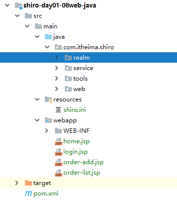

###### 【1.4.2】修改shiro.ini

```ini
#声明自定义的realm，且为安全管理器指定realms
[main]
definitionRealm=com.itheima.shiro.realm.DefinitionRealm
securityManager.realms=$definitionRealm
#用户退出后跳转指定JSP页面
logout.redirectUrl=/login.jsp
#若没有登录，则被authc过滤器重定向到login.jsp页面
authc.loginUrl = /login.jsp
[urls]
/login=anon
#发送/home请求需要先登录
#/home= authc
#发送/order/list请求需要先登录
#/order-list = roles[admin]
#提交代码需要order:add权限
#/order-add = perms["order:add"]
#更新代码需要order:del权限
#/order-del = perms["order:del"]
#发送退出请求则用退出过滤器
/logout = logout
```

###### 【1.4.3】登录相关

修改HomeServlet的doPost方法

```java
package com.itheima.shiro.web;

import org.apache.shiro.SecurityUtils;
import org.apache.shiro.subject.Subject;

import javax.servlet.ServletException;
import javax.servlet.annotation.WebServlet;
import javax.servlet.http.HttpServlet;
import javax.servlet.http.HttpServletRequest;
import javax.servlet.http.HttpServletResponse;
import java.io.IOException;

/**
 * @Description：系统home页面
 */
@WebServlet(urlPatterns = "/home")
public class HomeServlet extends HttpServlet {

    @Override
    protected void doGet(HttpServletRequest req, HttpServletResponse resp)
            throws ServletException, IOException {
        doPost(req, resp);
    }

    @Override
    protected void doPost(HttpServletRequest req, HttpServletResponse resp)
            throws ServletException, IOException {
        //通过subjectd对象去判断是否登录
        Subject subject = SecurityUtils.getSubject();
        boolean flag  = subject.isAuthenticated();
        if (flag){
            resp.sendRedirect("home.jsp");
        }else {
            req.getRequestDispatcher("/login").forward(req, resp);
        }
    }
}

```

访问http://localhost:8080/platform/home   进行debug


> 此时我们通过subject.isAuthenticated()判断是否登录，如果登录则重定向到home.jsp,如果没有登录则转发到/login对应的servlet

###### 【1.4.4】角色相关

> 修改OrderListServlet的doPost方法，判断是否有admin角色，如果有则转发order-list.jsp,没有则转发/login

```java
package com.itheima.shiro.web;

import org.apache.shiro.SecurityUtils;
import org.apache.shiro.subject.Subject;

import javax.servlet.ServletException;
import javax.servlet.annotation.WebServlet;
import javax.servlet.http.HttpServlet;
import javax.servlet.http.HttpServletRequest;
import javax.servlet.http.HttpServletResponse;
import java.io.IOException;

/**
 * @Description：订单列表
 */
@WebServlet(urlPatterns = "/order-list")
public class OrderListServlet extends HttpServlet {

    @Override
    protected void doGet(HttpServletRequest req, HttpServletResponse resp)
            throws ServletException, IOException {
        doPost(req, resp);
    }

    @Override
    protected void doPost(HttpServletRequest req, HttpServletResponse resp)
            throws ServletException, IOException {
        Subject subject = SecurityUtils.getSubject();
        //判断当前角色
        boolean flag = subject.hasRole("admin");
        if (flag){
            req.getRequestDispatcher("order-list.jsp").forward(req, resp);
        }else {
            req.getRequestDispatcher("/login").forward(req, resp);
        }
    }
}
```

访问http://localhost:8080/platform/order-list


因为此时我未登录，也就是说当前没有admin角色，这时通过subject.hasRole("admin")返回false

###### 【1.4.5】资源相关

修改OrderAddServlet

```java
package com.itheima.shiro.web;

import org.apache.shiro.SecurityUtils;
import org.apache.shiro.subject.Subject;

import javax.servlet.ServletException;
import javax.servlet.annotation.WebServlet;
import javax.servlet.http.HttpServlet;
import javax.servlet.http.HttpServletRequest;
import javax.servlet.http.HttpServletResponse;
import java.io.IOException;

/**
 * @Description：添加页码
 */
@WebServlet(urlPatterns = "/order-add")
public class OrderAddServlet extends HttpServlet {

    @Override
    protected void doGet(HttpServletRequest req, HttpServletResponse resp)
            throws ServletException, IOException {
        doPost(req, resp);
    }

    @Override
    protected void doPost(HttpServletRequest req, HttpServletResponse resp)
            throws ServletException, IOException {
        Subject subject = SecurityUtils.getSubject();
        //判断是否有对应资源
        boolean flag = subject.isPermitted("order:add");
        if (flag){
            req.getRequestDispatcher("order-add.jsp").forward(req, resp);
        }else {
            req.getRequestDispatcher("/login").forward(req, resp);
        }
    }

}

```

访问http://localhost:8080/platform/order-add


因为此时我未登录，也就是说当前没有order:add资源，通过 subject.isPermitted("order:add")返回未false

#### 【2】基于Jsp标签（不推荐）

##### 【2.1】使用方式

> Shiro提供了一套JSP标签库来实现页面级的授权控制， 在使用Shiro标签库前，首先需要在JSP引入shiro标签： 

```html
<%@ taglib prefix="shiro" uri="http://shiro.apache.org/tags" %> 

```

#####  【2.2】相关标签

| 标签                                  | 说明                                                         |
| ------------------------------------- | ------------------------------------------------------------ |
| < shiro:guest >                       | 验证当前用户是否为“访客”，即未认证（包含未记住）的用户       |
| < shiro:user >                        | 认证通过或已记住的用户                                       |
| < shiro:authenticated >               | 已认证通过的用户。不包含已记住的用户，这是与user标签的区别所在 |
| < shiro:notAuthenticated >            | 未认证通过用户。与guest标签的区别是，该标签包含已记住用户    |
| < shiro:principal />                  | 输出当前用户信息，通常为登录帐号信息                         |
| **< shiro:hasRole name="角色">**      | **验证当前用户是否属于该角色**                               |
| < shiro:lacksRole name="角色">        | 与hasRole标签逻辑相反，当用户不属于该角色时验证通过          |
| < shiro:hasAnyRoles name="a,b">       | 验证当前用户是否属于以下任意一个角色                         |
| **<shiro:hasPermission name=“资源”>** | **验证当前用户是否拥有指定的权限**                           |
| <shiro:lacksPermission name="资源">   | 与permission标签逻辑相反，当前用户没有制定权限时，验证通过   |

##### 【2.3】案例

###### 【2.3.1】新建项目

拷贝shiro-day01-08web-java新建shiro-day01-09web-jsp-taglib项目


###### 【2.3.2】修改home.jsp

```html
<%@ taglib prefix="c" uri="http://java.sun.com/jsp/jstl/core" %>
<%@ taglib prefix="shiro" uri="http://shiro.apache.org/tags" %>
<%@ page contentType="text/html;charset=UTF-8" language="java" %>
<html>
<head>
    <title></title>
</head>
<body>
<h6>
    <a href="${pageContext.request.contextPath}/logout">退出</a>
  
    <shiro:hasRole name="admin">
    <a href="${pageContext.request.contextPath}/order-list">列表</a>
    </shiro:hasRole>
  
    <shiro:hasPermission name="order:add">
    <a href="${pageContext.request.contextPath}/order-add">添加</a>
    </shiro:hasPermission>
</h6>
</body>
</html>
```

【2.3.3】测试

访问http://localhost:8080/platform/login

> 使用admin/123登录


这个时候我们只能看见“列表”，看不见“添加”，点击“退出”

> 使用jay/123登录


这个时候我们只能看见“添加”，看不见“列表”，点击“退出”

需要注意的是，这里只是页面是否显示内容，不能防止盗链的发生

## 第五章 Springboot集成Shiro

### 1、技术栈

主框架：springboot

响应层：springMVC

持久层：mybatis

事务控制：jta

前端技术：easyui

### 2、数据库设计

#### 【1】数据库图解


sh_user:用户表，一个用户可以有多个角色

sh_role:角色表，一个角色可以有多个资源

sh_resource:资源表

sh_user_role:用户角色中间表

sh_role_resource:角色资源中间表


#### 【2】数据库脚本

> 基本表

sh_user

```sql
CREATE TABLE `sh_user` (
  `ID` varchar(36) NOT NULL COMMENT '主键',
  `LOGIN_NAME` varchar(36) DEFAULT NULL COMMENT '登录名称',
  `REAL_NAME` varchar(36) DEFAULT NULL COMMENT '真实姓名',
  `NICK_NAME` varchar(36) DEFAULT NULL COMMENT '昵称',
  `PASS_WORD` varchar(150) DEFAULT NULL COMMENT '密码（密文）',
  `SALT` varchar(36) DEFAULT NULL COMMENT '加密因子',
  
  `SEX` int(11) DEFAULT NULL COMMENT '性别',
  `ZIPCODE` varchar(36) DEFAULT NULL COMMENT '邮箱',
  `ADDRESS` varchar(36) DEFAULT NULL COMMENT '地址',
  `TEL` varchar(36) DEFAULT NULL COMMENT '固定电话',
  `MOBIL` varchar(36) DEFAULT NULL COMMENT '电话',
  `EMAIL` varchar(36) DEFAULT NULL COMMENT '邮箱',
  `DUTIES` varchar(36) DEFAULT NULL COMMENT '职务',
  `SORT_NO` int(11) DEFAULT NULL COMMENT '排序',
  `ENABLE_FLAG` varchar(18) DEFAULT NULL COMMENT '是否有效',
  PRIMARY KEY (`ID`)
) ENGINE=InnoDB DEFAULT CHARSET=utf8 ROW_FORMAT=COMPACT COMMENT='用户表';

```

sh_role

```sql
CREATE TABLE `sh_role` (
  `ID` varchar(36) NOT NULL COMMENT '主键',
  `ROLE_NAME` varchar(36) DEFAULT NULL COMMENT '角色名称',
  `LABEL` varchar(36) DEFAULT NULL COMMENT '角色标识（重要字段）',
  `DESCRIPTION` varchar(200) DEFAULT NULL COMMENT '角色描述',
  `SORT_NO` int(36) DEFAULT NULL COMMENT '排序',
  `ENABLE_FLAG` varchar(18) DEFAULT NULL COMMENT '是否有效',
  PRIMARY KEY (`ID`)
) ENGINE=InnoDB DEFAULT CHARSET=utf8 ROW_FORMAT=COMPACT COMMENT='用户角色表';
```

sh_resource

```sql
CREATE TABLE `sh_resource` (
  `ID` varchar(36) NOT NULL COMMENT '主键',
  `PARENT_ID` varchar(36) DEFAULT NULL COMMENT '父资源（重要字段）',
  `RESOURCE_NAME` varchar(36) DEFAULT NULL COMMENT '资源名称',
  `REQUEST_PATH` varchar(200) DEFAULT NULL COMMENT '资源路径（重要字段）',
  `LABEL` varchar(200) DEFAULT NULL COMMENT '资源标签（重要字段）',
  `ICON` varchar(20) DEFAULT NULL COMMENT '图标',
  `IS_LEAF` varchar(18) DEFAULT NULL COMMENT '是否叶子节点',
  `RESOURCE_TYPE` varchar(36) DEFAULT NULL COMMENT '资源类型（重要字段）',
  `SORT_NO` int(11) DEFAULT NULL COMMENT '排序',
  `DESCRIPTION` varchar(200) DEFAULT NULL COMMENT '描述',
  `SYSTEM_CODE` varchar(36) DEFAULT NULL COMMENT '系统code（重要字段）',
  `IS_SYSTEM_ROOT` varchar(18) DEFAULT NULL COMMENT '是否根节点',
  `ENABLE_FLAG` varchar(18) DEFAULT NULL COMMENT '是否有效',
  PRIMARY KEY (`ID`)
) ENGINE=InnoDB DEFAULT CHARSET=utf8 ROW_FORMAT=COMPACT COMMENT='资源表';

```

> 中间表

sh_role_resource

```sql
CREATE TABLE `sh_role_resource` (
  `ID` varchar(36) NOT NULL,
  `ENABLE_FLAG` varchar(18) DEFAULT NULL,
  `ROLE_ID` varchar(36) DEFAULT NULL,
  `RESOURCE_ID` varchar(36) DEFAULT NULL,
  PRIMARY KEY (`ID`)
) ENGINE=InnoDB DEFAULT CHARSET=utf8 ROW_FORMAT=COMPACT COMMENT='角色资源表';
```

sh_user_role

```sql
CREATE TABLE `sh_user_role` (
  `ID` varchar(36) NOT NULL,
  `ENABLE_FLAG` varchar(18) DEFAULT NULL,
  `USER_ID` varchar(36) DEFAULT NULL,
  `ROLE_ID` varchar(36) DEFAULT NULL,
  PRIMARY KEY (`ID`)
) ENGINE=InnoDB DEFAULT CHARSET=utf8 ROW_FORMAT=COMPACT COMMENT='用户角色表';
```

### 3、项目骨架


> 'parent.relativePath' points at no local POM @ line 14, column 13
>
> https://blog.csdn.net/u014209205/article/details/79961622


### 4、ShiroDbRealm定义（核心1）

#### 【1】图解


#### 【2】原理分析

（1）、ShiroDbRealmImpl继承ShiroDbRealm向上继承AuthorizingRealm，ShiroDbRealmImpl实例化时会创建密码匹配器HashedCredentialsMatcher实例，HashedCredentialsMatcher指定hash次数与方式，交于AuthenticatingRealm

（2）、调用login方法后，最终调用doGetAuthenticationInfo(AuthenticationToken authcToken)方法，拿到SimpleToken的对象，调用UserBridgeService的查找用户方法，把ShiroUser对象、密码和salt交于SimpleAuthenticationInfo去认证

（3）、访问需要鉴权时，调用doGetAuthorizationInfo(PrincipalCollection principals)方法，然后调用UserBridgeService的授权验证 

#### 【3】核心类代码

##### 【3.1】ShiroDbRealm

```java

package com.itheima.shiro.core;

import org.apache.shiro.authc.AuthenticationInfo;
import org.apache.shiro.authc.AuthenticationToken;
import org.apache.shiro.authz.AuthorizationInfo;
import org.apache.shiro.realm.AuthorizingRealm;
import org.apache.shiro.subject.PrincipalCollection;

import javax.annotation.PostConstruct;


/**
 *
 * @Description shiro自定义realm
 */
public abstract class ShiroDbRealm extends AuthorizingRealm {
	
	/**
	 * @Description 认证
	 * @param authcToken token对象
	 * @return 
	 */
	public abstract AuthenticationInfo doGetAuthenticationInfo(AuthenticationToken authcToken) ;

	/**
	 * @Description 鉴权
	 * @param principals 令牌
	 * @return
	 */
	public abstract AuthorizationInfo doGetAuthorizationInfo(PrincipalCollection principals);
	
	/**
	 * @Description 密码匹配器
	 */
	@PostConstruct
	public abstract void initCredentialsMatcher() ;

	
}

```

##### 【3.2】ShiroDbRealmImpl

```java
package com.itheima.shiro.core.impl;

import com.itheima.shiro.constant.SuperConstant;
import com.itheima.shiro.core.base.ShiroUser;
import com.itheima.shiro.core.base.SimpleToken;
import com.itheima.shiro.core.ShiroDbRealm;
import com.itheima.shiro.core.bridge.UserBridgeService;
import com.itheima.shiro.pojo.User;
import com.itheima.shiro.utils.BeanConv;
import com.itheima.shiro.utils.DigestsUtil;
import com.itheima.shiro.utils.EmptyUtil;
import org.apache.shiro.authc.AuthenticationInfo;
import org.apache.shiro.authc.AuthenticationToken;
import org.apache.shiro.authc.SimpleAuthenticationInfo;
import org.apache.shiro.authc.UnknownAccountException;
import org.apache.shiro.authc.credential.HashedCredentialsMatcher;
import org.apache.shiro.authz.AuthorizationInfo;
import org.apache.shiro.subject.PrincipalCollection;
import org.apache.shiro.util.ByteSource;
import org.springframework.beans.factory.annotation.Autowired;

/**
 * @Description：自定义shiro的实现
 */
public class ShiroDbRealmImpl extends ShiroDbRealm {

    @Autowired
    private UserBridgeService userBridgeService;


    /**
     * @Description 认证方法
     * @param authcToken 校验传入令牌
     * @return AuthenticationInfo
     */
    @Override
    public AuthenticationInfo doGetAuthenticationInfo(AuthenticationToken authcToken) {
        SimpleToken token = (SimpleToken)authcToken;
        User user  = userBridgeService.findUserByLoginName(token.getUsername());
        if(EmptyUtil.isNullOrEmpty(user)){
            throw new UnknownAccountException("账号不存在");
        }
        ShiroUser shiroUser = BeanConv.toBean(user, ShiroUser.class);
        shiroUser.setResourceIds(userBridgeService.findResourcesIdsList(user.getId()));
        String salt = user.getSalt();
        String password = user.getPassWord();
        return new SimpleAuthenticationInfo(shiroUser, password, ByteSource.Util.bytes(salt), getName());
    }

    /**
     * @Description 授权方法
     * @param principals SimpleAuthenticationInfo对象第一个参数
     * @return
     */
    @Override
    public AuthorizationInfo doGetAuthorizationInfo(PrincipalCollection principals) {
        ShiroUser shiroUser = (ShiroUser) principals.getPrimaryPrincipal();
        return userBridgeService.getAuthorizationInfo(shiroUser);
    }

    /**
     * @Description 加密方式
     */
    @Override
    public void initCredentialsMatcher() {
        HashedCredentialsMatcher matcher = new HashedCredentialsMatcher(SuperConstant.HASH_ALGORITHM);
        matcher.setHashIterations(SuperConstant.HASH_INTERATIONS);
        setCredentialsMatcher(matcher);

    }
}

```

##### 【3.3】SimpleToken

```java

package com.itheima.shiro.core.base;

import org.apache.shiro.authc.UsernamePasswordToken;


/**
 * @Description 自定义tooken
 */
public class SimpleToken extends UsernamePasswordToken {
	
	/** serialVersionUID */
	private static final long serialVersionUID = -4849823851197352099L;

	private String tokenType;
	
	private String quickPassword;

	/**
	 * Constructor for SimpleToken
	 * @param tokenType
	 */
	public SimpleToken(String tokenType, String username,String password) {
		super(username,password);
		this.tokenType = tokenType;
	}
	
	public SimpleToken(String tokenType, String username,String password,String quickPassword) {
		super(username,password);
		this.tokenType = tokenType;
		this.quickPassword = quickPassword;
	}

	public String getTokenType() {
		return tokenType;
	}

	public void setTokenType(String tokenType) {
		this.tokenType = tokenType;
	}

	public String getQuickPassword() {
		return quickPassword;
	}

	public void setQuickPassword(String quickPassword) {
		this.quickPassword = quickPassword;
	}
	
	
}

```


##### 【3.4】ShiroUser

```java

package com.itheima.shiro.core.base;

import com.itheima.shiro.utils.ToString;
import lombok.Data;

import java.util.List;


/**
 * @Description 自定义Authentication对象，使得Subject除了携带用户的登录名外还可以携带更多信息
 */
@Data
public class  ShiroUser extends ToString {

	/** serialVersionUID */
	private static final long serialVersionUID = -5024855628064590607L;

	/**
	 * 主键
	 */
	private String id;

	/**
	 * 登录名称
	 */
	private String loginName;

	/**
	 * 真实姓名
	 */
	private String realName;

	/**
	 * 昵称
	 */
	private String nickName;

	/**
	 * 密码
	 */
	private String passWord;

	/**
	 * 加密因子
	 */
	private String salt;

	/**
	 * 性别
	 */
	private Integer sex;

	/**
	 * 邮箱
	 */
	private String zipcode;

	/**
	 * 地址
	 */
	private String address;

	/**
	 * 固定电话
	 */
	private String tel;

	/**
	 * 电话
	 */
	private String mobil;

	/**
	 * 邮箱
	 */
	private String email;

	/**
	 * 职务
	 */
	private String duties;

	/**
	 * 排序
	 */
	private Integer sortNo;

	/**
	 * 是否有效
	 */
	private String enableFlag;
    
	private List<String> resourceIds;

	public ShiroUser() {
		super();
	}

	public ShiroUser(String id, String loginName) {
		super();
		this.id = id;
		this.loginName = loginName;
	}


	@Override
	public int hashCode() {
		final int prime = 31;
		int result = 1;
		result = prime * result + ((email == null) ? 0 : email.hashCode());
		result = prime * result + ((id == null) ? 0 : id.hashCode());
		result = prime * result
				+ ((loginName == null) ? 0 : loginName.hashCode());
		result = prime * result + ((mobil == null) ? 0 : mobil.hashCode());
		return result;
	}

	@Override
	public boolean equals(Object obj) {
		if (this == obj)
			return true;
		if (obj == null)
			return false;
		if (getClass() != obj.getClass())
			return false;
		ShiroUser other = (ShiroUser) obj;
		if (email == null) {
			if (other.email != null)
				return false;
		} else if (!email.equals(other.email))
			return false;
		if (id == null) {
			if (other.id != null)
				return false;
		} else if (!id.equals(other.id))
			return false;
		if (loginName == null) {
			if (other.loginName != null)
				return false;
		} else if (!loginName.equals(other.loginName))
			return false;
		if (mobil == null) {
			if (other.mobil != null)
				return false;
		} else if (!mobil.equals(other.mobil))
			return false;
		return true;
	}
	
	
}

```

##### 【3.5】UserBridgeService

```java
package com.itheima.shiro.core.bridge;

import com.itheima.shiro.core.base.ShiroUser;
import com.itheima.shiro.pojo.User;
import org.apache.shiro.authz.AuthorizationInfo;

import java.util.List;

/**
 * @Description：用户信息桥接（后期会做缓存）
 */
public interface UserBridgeService {


    /**
     * @Description 查找用户信息
     * @param loginName 用户名称
     * @return user对象
     */
    User findUserByLoginName(String loginName);

    /**
     * @Description 鉴权方法
     * @param shiroUser 令牌对象
     * @return 鉴权信息
     */
    AuthorizationInfo getAuthorizationInfo(ShiroUser shiroUser);

    /**
     * @Description 查询用户对应角色标识list
     * @param userId 用户id
     * @return 角色标识集合
     */
    List<String> findRoleList(String userId);

    /**
     * @Description 查询用户对应资源标识list
     * @param userId 用户id
     * @return 资源标识集合
     */
    List<String> findResourcesList(String userId);

    /**
     * @Description 查询资源ids
     * @param userId 用户id
     * @return 资源id集合
     */
    List<String> findResourcesIds(String userId);
}

```

##### 【3.6】UserBridgeServiceImpl

```java
package com.itheima.shiro.core.bridge.impl;

import com.itheima.shiro.core.adapter.UserAdapter;
import com.itheima.shiro.core.base.ShiroUser;
import com.itheima.shiro.core.bridge.UserBridgeService;
import com.itheima.shiro.pojo.Resource;
import com.itheima.shiro.pojo.Role;
import com.itheima.shiro.pojo.User;
import org.apache.shiro.authz.AuthorizationInfo;
import org.apache.shiro.authz.SimpleAuthorizationInfo;
import org.springframework.beans.factory.annotation.Autowired;
import org.springframework.stereotype.Component;

import java.util.ArrayList;
import java.util.List;

/**
 * @Description：用户信息桥接（后期会做缓存）
 */
@Component("userBridgeService")
public class UserBridgeServiceImpl implements UserBridgeService {

    @Autowired
    UserAdapter userAdapter;

    @Override
    public User findUserByLoginName(String loginName) {

        return userAdapter.findUserByLoginName(loginName);
    }

    @Override
    public AuthorizationInfo getAuthorizationInfo(ShiroUser shiroUser) {
        //查询用户对应的角色标识
        List<String> roleList = this.findRoleList(shiroUser.getId());
        //查询用户对于的资源标识
        List<String> resourcesList = this.findResourcesList(shiroUser.getId());
        //构建鉴权信息对象
        SimpleAuthorizationInfo simpleAuthorizationInfo = new SimpleAuthorizationInfo();
        simpleAuthorizationInfo.addRoles(roleList);
        simpleAuthorizationInfo.addStringPermissions(resourcesList);
        return simpleAuthorizationInfo;
    }

    @Override
    public List<String> findRoleList(String userId){
        List<Role> roles = userAdapter.findRoleByUserId(userId);
        List<String> roleLabel = new ArrayList<>();
        for (Role role : roles) {
            roleLabel.add(role.getLabel());
        }
        return roleLabel;
    }

    @Override
    public List<String> findResourcesList(String userId){
        List<Resource> resources = userAdapter.findResourceByUserId(userId);
        List<String> resourceLabel = new ArrayList<>();
        for (Resource resource : resources) {
            resourceLabel.add(resource.getLabel());
        }
        return resourceLabel;
    }

    @Override
    public List<String> findResourcesIds(String userId) {
        List<Resource> resources = userAdapter.findResourceByUserId(userId);
        List<String> ids = new ArrayList<>();
        for (Resource resource : resources) {
            ids.add(resource.getId());
        }
        return ids;
    }

}

```

##### 【3.7】UserAdapter

```java
package com.itheima.shiro.core.adapter;

import com.itheima.shiro.pojo.Resource;
import com.itheima.shiro.pojo.Role;
import com.itheima.shiro.pojo.User;

import java.util.List;


/**
 * @Description 后台登陆用户适配器接口
 */

public interface UserAdapter {
	
	/**
	 * @Description 按用户名查找用户
	 * @param loginName 登录名
	 * @return
	 */
	User findUserByLoginName(String loginName);

	/**
	 * @Description 查找用户所有角色
	 * @param userId 用户Id
	 * @return
	 */
	List<Role> findRoleByUserId(String userId);

	/**
	 * @Description 查询用户有那些资源
	 * @param userId 用户Id
	 * @return
	 */
	List<Resource> findResourceByUserId(String userId);

}

```

##### 【3.8】UserAdapterImpl

```java
package com.itheima.shiro.core.adapter.impl;

import com.itheima.shiro.constant.SuperConstant;
import com.itheima.shiro.core.adapter.UserAdapter;
import com.itheima.shiro.mapper.UserMapper;
import com.itheima.shiro.mappercustom.UserAdapterMapper;
import com.itheima.shiro.pojo.Resource;
import com.itheima.shiro.pojo.Role;
import com.itheima.shiro.pojo.User;
import com.itheima.shiro.pojo.UserExample;
import org.springframework.beans.factory.annotation.Autowired;
import org.springframework.stereotype.Component;

import java.util.HashMap;
import java.util.List;
import java.util.Map;
import java.util.concurrent.TimeUnit;


/**
 * @Description 后台登陆用户适配器接口实现
 */
@Component("userAdapter")
public class UserAdapterImpl implements UserAdapter {

	@Autowired
	private UserMapper userMapper;

	@Autowired
	private UserAdapterMapper userAdapterMapper;

	@Override
	public User findUserByLoginName(String loginName) {
		UserExample userExample = new UserExample();
		userExample.createCriteria().andEnableFlagEqualTo(SuperConstant.YES).andLoginNameEqualTo(loginName);
		List<User> userList = userMapper.selectByExample(userExample);
		if (userList.size()==1) {
			return userList.get(0);
		}else {
			return null;
		}
	}

	@Override
	public List<Role> findRoleByUserId(String userId) {
		Map<String, Object> values = new HashMap<String, Object>();
		values.put("userId", userId);
		values.put("enableFlag", SuperConstant.YES);
		List<Role> list = userAdapterMapper.findRoleByUserId(values);
		return list;
	}

	@Override
	public List<Resource> findResourceByUserId(String userId) {
		Map<String, Object> values = new HashMap<String, Object>();
		values.put("userId", userId);
		values.put("enableFlag", SuperConstant.YES);
		List<Resource> list=userAdapterMapper.findResourceByUserId(values);
		return list;
	}
}

```

### 5、ShiroConfig配置（核心2）

#### 【1】图解

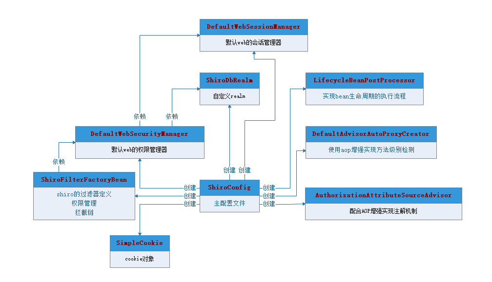

#### 【2】原理分析

> （1）、创建SimpleCookie，访问项目时，会在客户端中cookie中存放ShiroSession的对
>
> （2）、创建DefaultWebSessionManager会话管理器定义cookie机制、定时刷新、全局会话超时时间然后交
>
> 于DefaultWebSecurityManager权限管理器管理
>
> （3）、创建自定义ShiroDbRealm实现，用于权限认证、授权、加密方式的管理，同时从数据库中取得相关的
>
> 角色、资源、用户的信息，然后交于DefaultWebSecurityManager权限管理器管理
>
> （4）、创建DefaultWebSecurityManager权限管理器用于管理DefaultWebSessionManager会话管理器、ShiroDbRealm
>
> （5）、创建lifecycleBeanPostProcessor和DefaultAdvisorAutoProxyCreator相互配合事项注解的权限鉴权
>
> （6）、创建ShiroFilterFactoryBean的shiro过滤器指定权限管理器、同时启动连接链及登录URL、未登录的URL
>
> 的跳转
>

#### 【3】ShiroConfig代码

```java
package com.itheima.shiro.config;


import com.itheima.shiro.core.ShiroDbRealm;
import com.itheima.shiro.core.impl.ShiroDbRealmImpl;
import com.itheima.shiro.properties.PropertiesUtil;
import lombok.extern.log4j.Log4j2;
import org.apache.shiro.spring.LifecycleBeanPostProcessor;
import org.apache.shiro.spring.security.interceptor.AuthorizationAttributeSourceAdvisor;
import org.apache.shiro.spring.web.ShiroFilterFactoryBean;
import org.apache.shiro.web.mgt.DefaultWebSecurityManager;
import org.apache.shiro.web.servlet.SimpleCookie;
import org.apache.shiro.web.session.mgt.DefaultWebSessionManager;
import org.springframework.aop.framework.autoproxy.DefaultAdvisorAutoProxyCreator;
import org.springframework.context.annotation.Bean;
import org.springframework.context.annotation.ComponentScan;
import org.springframework.context.annotation.Configuration;
import org.springframework.context.annotation.DependsOn;

import java.util.LinkedHashMap;
import java.util.List;
import java.util.Map;

/**
 * @Description：权限配置类
 */
@Configuration
@ComponentScan(basePackages = "com.itheima.shiro.core")
@Log4j2
public class ShiroConfig {

    /**
     * @Description 创建cookie对象
     */
    @Bean(name="sessionIdCookie")
    public SimpleCookie simpleCookie(){
        SimpleCookie simpleCookie = new SimpleCookie();
        simpleCookie.setName("ShiroSession");
        return simpleCookie;
    }

    /**
     * @Description 权限管理器
     */
    @Bean(name="securityManager")
    public DefaultWebSecurityManager defaultWebSecurityManager(){
        DefaultWebSecurityManager securityManager = new DefaultWebSecurityManager();
        securityManager.setRealm(shiroDbRealm());
        securityManager.setSessionManager(shiroSessionManager());
        return securityManager;
    }

    /**
     * @Description 自定义RealmImpl
     */
    @Bean(name="shiroDbRealm")
    public ShiroDbRealm shiroDbRealm(){
        return new ShiroDbRealmImpl();
    }


    /**
     * @Description 会话管理器
     */
    @Bean(name="sessionManager")
    public DefaultWebSessionManager shiroSessionManager(){
        DefaultWebSessionManager sessionManager = new DefaultWebSessionManager();
        sessionManager.setSessionValidationSchedulerEnabled(false);
        sessionManager.setSessionIdCookieEnabled(true);
        sessionManager.setSessionIdCookie(simpleCookie());
        sessionManager.setGlobalSessionTimeout(3600000);
        return sessionManager;
    }

    /**
     * @Description 保证实现了Shiro内部lifecycle函数的bean执行
     */
    @Bean(name = "lifecycleBeanPostProcessor")
    public static LifecycleBeanPostProcessor getLifecycleBeanPostProcessor() {
        return new LifecycleBeanPostProcessor();
    }

    /**
     * @Description AOP式方法级权限检查
     */
    @Bean
    @DependsOn("lifecycleBeanPostProcessor")
    public DefaultAdvisorAutoProxyCreator getDefaultAdvisorAutoProxyCreator() {
        DefaultAdvisorAutoProxyCreator defaultAdvisorAutoProxyCreator = new DefaultAdvisorAutoProxyCreator();
        defaultAdvisorAutoProxyCreator.setProxyTargetClass(true);
        return defaultAdvisorAutoProxyCreator;
    }

    /**
     * @Description 配合DefaultAdvisorAutoProxyCreator事项注解权限校验
     */
    @Bean
    public AuthorizationAttributeSourceAdvisor getAuthorizationAttributeSourceAdvisor() {
        AuthorizationAttributeSourceAdvisor aasa = new AuthorizationAttributeSourceAdvisor();
        aasa.setSecurityManager(defaultWebSecurityManager());
        return new AuthorizationAttributeSourceAdvisor();
    }

    /**
     * @Description 过滤器链
     */
    private Map<String, String> filterChainDefinition(){
        List<Object> list  = PropertiesUtil.propertiesShiro.getKeyList();
        Map<String, String> map = new LinkedHashMap<>();
        for (Object object : list) {
            String key = object.toString();
            String value = PropertiesUtil.getShiroValue(key);
            log.info("读取防止盗链控制：---key{},---value:{}",key,value);
            map.put(key, value);
        }
        return map;
    }

    /**
     * @Description Shiro过滤器
     */
    @Bean("shiroFilter")
    public ShiroFilterFactoryBean shiroFilterFactoryBean(){
        ShiroFilterFactoryBean shiroFilter = new ShiroFilterFactoryBean();
        shiroFilter.setSecurityManager(defaultWebSecurityManager());
        shiroFilter.setFilterChainDefinitionMap(filterChainDefinition());
        shiroFilter.setLoginUrl("/login");
        shiroFilter.setUnauthorizedUrl("/login");
        return shiroFilter;
    }

}

```


> 主要原因8.x版本的验证模块和之前版本不同：
>
> 5.x版本是：default_authentication_plugin=mysql_native_password
>
> 8.x版本就是：default_authentication_plugin=caching_sha2_password
>
> 解决方案：更新mysql驱动的jar版本，可以修改为8.0.11版本


> druid 多数据源 整合 Atomikos 事务高版本mysql启动报错      #3880
>
> 如果用springboot 自带的高版本则启动报错，mysql 必须降级到 8.0.11 版本才能正常启动。
>
> 参考：https://blog.csdn.net/qq_41316955/article/details/116486455
>
> https://github.com/alibaba/druid/issues/3880


### 6、Shiro过滤器、过滤器链

#### 【1】过滤器

> Shiro内置了很多默认的过滤器，比如身份验证、授权等相关的。默认过滤器可以参考org.apache.shiro.web.filter.mgt.DefaultFilter中的枚举过滤器

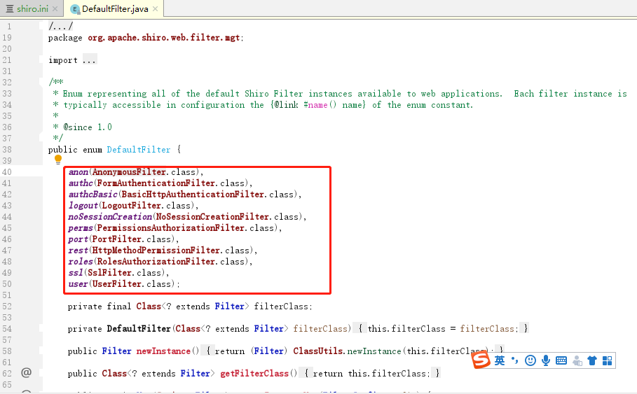

#### 【2】过滤器链

定义：authentication.properties

```properties
#静态资源不过滤
/static/**=anon
#登录链接不过滤
/login/**=anon
#其他链接是需要登录的
/**=authc
```

> 注意：这里定义的过滤器是有执行顺序的，从上向下执行

#### 【3】加载原理分析

定义：PropertiesUtil，从classpath中加载authentication.properties

```java
package com.itheima.shiro.properties;

import com.itheima.shiro.utils.EmptyUtil;
import lombok.extern.log4j.Log4j2;

/**
 * @Description 读取Properties的工具类
 */
@Log4j2
public class PropertiesUtil {

    public static LinkProperties propertiesShiro = new LinkProperties();

    /**
     * 读取properties配置文件信息
     */
    static {
        String sysName = System.getProperty("sys.name");
        if (EmptyUtil.isNullOrEmpty(sysName)) {
            sysName = "application.properties";
        } else {
            sysName += ".properties";
        }
        try {
            propertiesShiro.load(PropertiesUtil.class.getClassLoader()
                    .getResourceAsStream("authentication.properties"));
        } catch (Exception e) {
            log.warn("资源路径中不存在authentication.properties权限文件，忽略读取！");
        }
    }

    /**
     * 根据key得到value的值
     */
    public static String getShiroValue(String key) {
        return propertiesShiro.getProperty(key);
    }

}

```

定义LinkProperties，这个类保证了Properties类的有序

```java
package com.itheima.shiro.properties;

import java.io.*;
import java.util.ArrayList;
import java.util.Enumeration;
import java.util.List;
import java.util.Properties;


/**
 * @Description 有序Properties类
 */

public class LinkProperties extends Properties{

	/** serialVersionUID */
	private static final long serialVersionUID = 7573016303908223266L;
	
	private List<Object> keyList = new ArrayList<Object>();  
    
    /** 
     * 默认构造方法 
     */  
    public LinkProperties() {  
          
    }  
      
    /** 
     * 从指定路径加载信息到Properties 
     * @param path 
     */  
    public LinkProperties(String path) {  
        try {  
            InputStream is = new FileInputStream(path);  
            this.load(is);  
        } catch (FileNotFoundException e) {  
            e.printStackTrace();  
            throw new RuntimeException("指定文件不存在！");  
        } catch (IOException e) {  
            e.printStackTrace();  
        }  
    }  
      
    /** 
     * 重写put方法，按照property的存入顺序保存key到keyList，遇到重复的后者将覆盖前者。 
     */  
    @Override  
    public synchronized Object put(Object key, Object value) {  
        this.removeKeyIfExists(key);  
        keyList.add(key);  
        return super.put(key, value);  
    }  
      
  
    /** 
     * 重写remove方法，删除属性时清除keyList中对应的key。 
     */  
    @Override  
    public synchronized Object remove(Object key) {  
        this.removeKeyIfExists(key);  
        return super.remove(key);  
    }  
      
    /** 
     * keyList中存在指定的key时则将其删除 
     */  
    private void removeKeyIfExists(Object key) {  
        keyList.remove(key);  
    }  
      
    /** 
     * 获取Properties中key的有序集合 
     * @return 
     */  
    public List<Object> getKeyList() {  
        return keyList;  
    }  
      
    /** 
     * 保存Properties到指定文件，默认使用UTF-8编码 
     * @param path 指定文件路径 
     */  
    public void store(String path) {  
        this.store(path, "UTF-8");  
    }  
      
    /** 
     * 保存Properties到指定文件，并指定对应存放编码 
     * @param path 指定路径 
     * @param charset 文件编码 
     */  
    public void store(String path, String charset) {  
        if (path != null && !"".equals(path)) {  
            try {  
                OutputStream os = new FileOutputStream(path);  
                BufferedWriter bw = new BufferedWriter(new OutputStreamWriter(os, charset));  
                this.store(bw, null);  
                bw.close();  
            } catch (FileNotFoundException e) {  
                e.printStackTrace();  
            } catch (IOException e) {  
                e.printStackTrace();  
            }  
        } else {  
            throw new RuntimeException("存储路径不能为空!");  
        }  
    }  
  
    /** 
     * 重写keys方法，返回根据keyList适配的Enumeration，且保持HashTable keys()方法的原有语义， 
     * 每次都调用返回一个新的Enumeration对象，且和之前的不产生冲突 
     */  
    @Override  
    public synchronized Enumeration<Object> keys() {  
        return new EnumerationAdapter<Object>(keyList);  
    }  
      
    /** 
     * List到Enumeration的适配器 
     */  
    private class EnumerationAdapter<T> implements Enumeration<T> {  
        private int index = 0;  
        private final List<T> list;  
        private final boolean isEmpty;  
          
        public EnumerationAdapter(List<T> list) {  
            this.list = list;  
            this.isEmpty = list.isEmpty();  
        }  
          
        public boolean hasMoreElements() {  
            //isEmpty的引入是为了更贴近HashTable原有的语义，在HashTable中添加元素前调用其keys()方法获得一个Enumeration的引用，  
            //之后往HashTable中添加数据后，调用之前获取到的Enumeration的hasMoreElements()将返回false，但如果此时重新获取一个  
            //Enumeration的引用，则新Enumeration的hasMoreElements()将返回true，而且之后对HashTable数据的增、删、改都是可以在  
            //nextElement中获取到的。  
            return !isEmpty && index < list.size();  
        }  
  
        public T nextElement() {  
            if (this.hasMoreElements()) {  
                return list.get(index++);  
            }  
            return null;  
        }  
          
    }  
}

```

查看shirocConfig


> 加载完整之后交于ShiroFilterFactoryBean使用setFilterChainDefinitionMap使得过滤生效


#### 【4】自定义过滤器

上面我们使用了shiro的默认过滤器，但是由于业务需求，咱们可能要定义自己的过滤器，那么咱们定义呢？

这里我们先查看RolesAuthorizationFilter


> 分析该源码表示，例如：/admin/order= roles["admin, root"] ，只有当访问该接口同时具备admin和root两种角色时，才可以被访问。

#### 【5】自定义过滤器使用

##### 【5.1】需求

```
1、实现只要有其中一个角色，则可访问对应路径
```

##### 【5.2】RolesOrAuthorizationFilter

新建filter层，新建类RolesOrAuthorizationFilter

```java
package com.itheima.shiro.filter;

import org.apache.shiro.subject.Subject;
import org.apache.shiro.util.CollectionUtils;
import org.apache.shiro.web.filter.authz.AuthorizationFilter;

import javax.servlet.ServletRequest;
import javax.servlet.ServletResponse;
import java.io.IOException;
import java.util.Set;

/**
 * @Description：角色或关系
 */
public class RolesOrAuthorizationFilter extends AuthorizationFilter {

    //TODO - complete JavaDoc

    @SuppressWarnings({"unchecked"})
    public boolean isAccessAllowed(ServletRequest request, ServletResponse response, Object mappedValue) throws IOException {

        Subject subject = getSubject(request, response);
        String[] rolesArray = (String[]) mappedValue;

        if (rolesArray == null || rolesArray.length == 0) {
            //no roles specified, so nothing to check - allow access.
            return true;
        }

        Set<String> roles = CollectionUtils.asSet(rolesArray);
        //循环roles判断只要有角色则返回true
        for (String role : roles) {
            if(subject.hasRole(role)){
                return true;
            }
        }
        return false;
    }

}

```

##### 【5.3】编辑ShiroConfig

在ShiroConfig类中添加如下内容

```java
/**
     * @Description 自定义过滤器定义
     */
    private Map<String, Filter> filters() {
        Map<String, Filter> map = new HashMap<String, Filter>();
        map.put("role-or", new RolesOrAuthorizationFilter());
        return map;
    }

    /**
     * @Description Shiro过滤器
     */
    @Bean("shiroFilter")
    public ShiroFilterFactoryBean shiroFilterFactoryBean(){
        ShiroFilterFactoryBean shiroFilter = new ShiroFilterFactoryBean();
        shiroFilter.setSecurityManager(defaultWebSecurityManager());
        //使自定义过滤器生效
        shiroFilter.setFilters(filters());
        shiroFilter.setFilterChainDefinitionMap(filterChainDefinition());
        shiroFilter.setLoginUrl("/login");
        shiroFilter.setUnauthorizedUrl("/login");
        return shiroFilter;
    }
```

【2.2.3】编辑authentication.properties（使用role-or）

```ini
#静态资源不过滤
/static/**=anon
#登录链接不过滤
/login/**=anon
#访问/resource/**需要有admin的角色
/resource/**=role-or[admin]
#其他链接是需要登录的
/**=authc
```


```java


```


### 7、注解方式鉴权（第三种）

#### 【1】注解介绍

以下为常用注解

| 注解                    | 说明                               |
| ----------------------- | ---------------------------------- |
| @RequiresAuthentication | 表明当前用户需是经过认证的用户     |
| @ RequiresGuest         | 表明该用户需为”guest”用户          |
| @RequiresPermissions    | 当前用户需拥有指定权限             |
| @RequiresRoles          | 当前用户需拥有指定角色             |
| @ RequiresUser          | 当前用户需为已认证用户或已记住用户 |

例如RoleAction类中我们添加

```java
/**
	 *@Description: 跳转到角色的初始化页面
	 */
	@RequiresRoles(value ={"SuperAdmin","dev"},logical = Logical.OR)
	@RequestMapping(value = "listInitialize")
	public ModelAndView listInitialize(){
		return  new ModelAndView("/role/role-listInitialize");
	}
```

#### 【2】注解原理分析

#### 【2.1】装载过程

#### 【2.2】调用过程

## 第六章 Realm缓存机制

### 1、Realm缓存机制意义

在上面我们自定了自己的realm，但是我们发现


> 在认证和授权的时候，程序需要频繁的访问数据库，这样对于数据库的压力可想而知，那我们怎么处理呢？

### 2、Realm缓存机制实现思路

#### 【1】缓存机制图解


#### 【2】原理分析

> 此时我们对UserBridgeServiceImpl的实现类里面的逻辑加入了自定义的SimpleCacheService缓存服务接口，简单来说实现了在认证和鉴权时不需要每次都去查询数据库，而是把认证和鉴权信息放入到redis缓存中，以减低数据库的访问压力

```properties
1、集成redis服务器，作为集中存储认证和鉴权信息
2、改写UserBridgeServiceImpl使其优先从缓存中读取
```


### 3、redission集成

#### 【1】添加ShiroRedisProperties

此类主要负责yaml文件的配置类

```java
package com.itheima.shiro.config;

import lombok.Data;
import org.springframework.boot.context.properties.ConfigurationProperties;

import java.io.Serializable;

/**
 * @Description  redis配置文件
 */
@Data
@ConfigurationProperties(prefix = "itheima.framework.shiro.redis")
public class ShiroRedisProperties implements Serializable {

	/**
	 * redis连接地址
	 */
	private String nodes ;

	/**
	 * 获取连接超时时间
	 */
	private int connectTimeout ;

	/**
	 * 连接池大小
	 */
	private int connectPoolSize;

	/**
	 * 初始化连接数
	 */
	private int connectionMinimumidleSize ;

	/**
	 * 等待数据返回超时时间
	 */
	private int timeout ;

	/**
	 *  全局超时时间
	 */
	private long globalSessionTimeout;

}

```

#### 【2】编辑ShiroConfig

集成redisson的相关配置，同时启用ShiroRedisProperties的配置

```java
package com.itheima.shiro.config;


import com.itheima.shiro.core.ShiroDbRealm;
import com.itheima.shiro.core.impl.ShiroDbRealmImpl;
import com.itheima.shiro.filter.RolesOrAuthorizationFilter;
import com.itheima.shiro.properties.PropertiesUtil;
import lombok.extern.log4j.Log4j2;
import org.apache.shiro.spring.LifecycleBeanPostProcessor;
import org.apache.shiro.spring.security.interceptor.AuthorizationAttributeSourceAdvisor;
import org.apache.shiro.spring.web.ShiroFilterFactoryBean;
import org.apache.shiro.web.mgt.DefaultWebSecurityManager;
import org.apache.shiro.web.servlet.SimpleCookie;
import org.apache.shiro.web.session.mgt.DefaultWebSessionManager;
import org.redisson.Redisson;
import org.redisson.api.RedissonClient;
import org.redisson.config.Config;
import org.springframework.aop.framework.autoproxy.DefaultAdvisorAutoProxyCreator;
import org.springframework.beans.factory.annotation.Autowired;
import org.springframework.boot.context.properties.EnableConfigurationProperties;
import org.springframework.context.annotation.Bean;
import org.springframework.context.annotation.ComponentScan;
import org.springframework.context.annotation.Configuration;
import org.springframework.context.annotation.DependsOn;

import javax.servlet.Filter;
import java.util.HashMap;
import java.util.LinkedHashMap;
import java.util.List;
import java.util.Map;

/**
 * @Description 权限配置类
 */
@Configuration
@ComponentScan(basePackages = "com.itheima.shiro.core")
@EnableConfigurationProperties({ShiroRedisProperties.class})
@Log4j2
public class ShiroConfig {

    @Autowired
    private ShiroRedisProperties shiroRedisProperties;

    /**
     * @Description redission客户端
     */
    @Bean("redissonClientForShiro")
    public RedissonClient redissonClient() {
        log.info("=====初始化redissonClientForShiro开始======");
        String[] nodeList = shiroRedisProperties.getNodes().split(",");
        Config config = new Config();
        if (nodeList.length == 1) {
            config.useSingleServer().setAddress(nodeList[0])
                    .setConnectTimeout(shiroRedisProperties.getConnectTimeout())
                    .setConnectionMinimumIdleSize(shiroRedisProperties.getConnectionMinimumidleSize())
                    .setConnectionPoolSize(shiroRedisProperties.getConnectPoolSize()).setTimeout(shiroRedisProperties.getTimeout());
        } else {
            config.useClusterServers().addNodeAddress(nodeList)
                    .setConnectTimeout(shiroRedisProperties.getConnectTimeout())
                    .setMasterConnectionMinimumIdleSize(shiroRedisProperties.getConnectionMinimumidleSize())
                    .setMasterConnectionPoolSize(shiroRedisProperties.getConnectPoolSize()).setTimeout(shiroRedisProperties.getTimeout());
        }
        RedissonClient redissonClient =  Redisson.create(config);
        log.info("=====初始化redissonClientForShiro完成======");
        return redissonClient;
    }

    /**
     * @Description 创建cookie对象
     */
    @Bean(name="sessionIdCookie")
    public SimpleCookie simpleCookie(){
        SimpleCookie simpleCookie = new SimpleCookie();
        simpleCookie.setName("ShiroSession");
        return simpleCookie;
    }

    /**
     * @Description 权限管理器
     * @param
     * @return
     */
    @Bean(name="securityManager")
    public DefaultWebSecurityManager defaultWebSecurityManager(){
        DefaultWebSecurityManager securityManager = new DefaultWebSecurityManager();
        securityManager.setRealm(shiroDbRealm());
        securityManager.setSessionManager(shiroSessionManager());
        return securityManager;
    }

    /**
     * @Description 自定义RealmImpl
     */
    @Bean(name="shiroDbRealm")
    public ShiroDbRealm shiroDbRealm(){
        return new ShiroDbRealmImpl();
    }


    /**
     * @Description 会话管理器
     */
    @Bean(name="sessionManager")
    public DefaultWebSessionManager shiroSessionManager(){
        DefaultWebSessionManager sessionManager = new DefaultWebSessionManager();
        sessionManager.setSessionValidationSchedulerEnabled(false);
        sessionManager.setSessionIdCookieEnabled(true);
        sessionManager.setSessionIdCookie(simpleCookie());
        sessionManager.setGlobalSessionTimeout(3600000);
        return sessionManager;
    }

    /**
     * @Description 保证实现了Shiro内部lifecycle函数的bean执行
     */
    @Bean(name = "lifecycleBeanPostProcessor")
    public static LifecycleBeanPostProcessor getLifecycleBeanPostProcessor() {
        return new LifecycleBeanPostProcessor();
    }

    /**
     * @Description AOP式方法级权限检查
     */
    @Bean
    @DependsOn("lifecycleBeanPostProcessor")
    public DefaultAdvisorAutoProxyCreator getDefaultAdvisorAutoProxyCreator() {
        DefaultAdvisorAutoProxyCreator defaultAdvisorAutoProxyCreator = new DefaultAdvisorAutoProxyCreator();
        defaultAdvisorAutoProxyCreator.setProxyTargetClass(true);
        return defaultAdvisorAutoProxyCreator;
    }

    /**
     * @Description 配合DefaultAdvisorAutoProxyCreator事项注解权限校验
     */
    @Bean
    public AuthorizationAttributeSourceAdvisor getAuthorizationAttributeSourceAdvisor() {
        AuthorizationAttributeSourceAdvisor aasa = new AuthorizationAttributeSourceAdvisor();
        aasa.setSecurityManager(defaultWebSecurityManager());
        return new AuthorizationAttributeSourceAdvisor();
    }

    /**
     * @Description 过滤器链
     */
    private Map<String, String> filterChainDefinition(){
        List<Object> list  = PropertiesUtil.propertiesShiro.getKeyList();
        Map<String, String> map = new LinkedHashMap<>();
        for (Object object : list) {
            String key = object.toString();
            String value = PropertiesUtil.getShiroValue(key);
            log.info("读取防止盗链控制：---key{},---value:{}",key,value);
            map.put(key, value);
        }
        return map;
    }

    /**
     * @Description 自定义过滤器定义
     */
    private Map<String, Filter> filters() {
        Map<String, Filter> map = new HashMap<String, Filter>();
        map.put("roleOr", new RolesOrAuthorizationFilter());
        return map;
    }

    /**
     * @Description Shiro过滤器
     */
    @Bean("shiroFilter")
    public ShiroFilterFactoryBean shiroFilterFactoryBean(){
        ShiroFilterFactoryBean shiroFilter = new ShiroFilterFactoryBean();
        shiroFilter.setSecurityManager(defaultWebSecurityManager());
        //使自定义过滤器生效
        shiroFilter.setFilters(filters());
        shiroFilter.setFilterChainDefinitionMap(filterChainDefinition());
        shiroFilter.setLoginUrl("/login");
        shiroFilter.setUnauthorizedUrl("/login");
        return shiroFilter;
    }

}

```


### 4、缓存对象SimpleMapCache

```java

package com.itheima.shiro.core.base;

import com.itheima.shiro.utils.EmptyUtil;
import org.apache.shiro.cache.Cache;
import org.apache.shiro.cache.CacheException;

import java.io.Serializable;
import java.util.Collection;
import java.util.Collections;
import java.util.Map;
import java.util.Set;


/**
 * @Description 缓存实现类, 实现序列 接口方便对象存储于第三方容器(Map存放键值对)
 */
public class SimpleMapCache implements Cache<Object, Object>, Serializable {

    private final Map<Object, Object> attributes;

    private final String name;

    public SimpleMapCache(String name, Map<Object, Object> backingMap) {
        if (name == null)
            throw new IllegalArgumentException("Cache name cannot be null.");
        if (backingMap == null) {
            throw new IllegalArgumentException("Backing map cannot be null.");
        } else {
            this.name = name;
            attributes = backingMap;
        }
    }

    public Object get(Object key) throws CacheException {
        return attributes.get(key);
    }

    public Object put(Object key, Object value) throws CacheException {
        return attributes.put(key, value);
    }

    public Object remove(Object key) throws CacheException {
        return attributes.remove(key);
    }

    public void clear() throws CacheException {
        attributes.clear();
    }

    public int size() {
        return attributes.size();
    }

    public Set<Object> keys() {
        Set<Object> keys = attributes.keySet();
        if (!keys.isEmpty())
            return Collections.unmodifiableSet(keys);
        else
            return Collections.emptySet();
    }

    public Collection<Object> values() {
        Collection<Object> values = attributes.values();
        if (!EmptyUtil.isNullOrEmpty(values))
            return Collections.unmodifiableCollection(values);
        else
            return Collections.emptySet();
    }

    @Override
    public String toString() {
        return "SimpleMapCache [attributes=" + attributes + ", name=" + name
                + ", keys()=" + keys() + ", size()=" + size() + ", values()="
                + values() + "]";
    }
}

```


### 5、ShiroRedissionSerialize序列化工具

```java
package com.itheima.shiro.utils;

import lombok.extern.log4j.Log4j2;
import org.apache.shiro.codec.Base64;

import java.io.*;

/**
 * @Description：实现shiro会话的序列化存储
 */
@Log4j2
public class ShiroRedissionSerialize {

    public static Object deserialize(String str) {
        if (EmptyUtil.isNullOrEmpty(str)) {
            return null;
        }
        ByteArrayInputStream bis = null;
        ObjectInputStream ois = null;
        Object object=null;
        try {
            bis = new ByteArrayInputStream(EncodesUtil.decodeBase64(str));
            ois = new ObjectInputStream(bis);
            object = ois.readObject();
        } catch (IOException |ClassNotFoundException e) {
            log.error("流读取异常：{}",e);
        } finally {
            try {
                bis.close();
                ois.close();
            } catch (IOException e) {
                log.error("流读取异常：{}",e);
            }
        }
        return object;
    }

    public static String serialize(Object obj) {

        if (EmptyUtil.isNullOrEmpty(obj)) {
            return null;
        }
        ByteArrayOutputStream bos = null;
        ObjectOutputStream oos = null;
        String base64String = null;
        try {
            bos = new ByteArrayOutputStream();
            oos = new ObjectOutputStream(bos);
            oos.writeObject(obj);
            base64String = EncodesUtil.encodeBase64(bos.toByteArray());
        } catch (IOException e) {
            log.error("流写入异常：{}",e);
        } finally {
            try {
                bos.close();
                oos.close();
            } catch (IOException e) {
                log.error("流写入异常：{}",e);
            }
        }
        return base64String;
    }
}

```

### 6、缓存服务接口SimpleCacheService

SimpleCacheService

```java

package com.itheima.shiro.core;

import org.apache.shiro.cache.Cache;
import org.apache.shiro.cache.CacheException;

/**
 * @Description 简单的缓存管理接口
 */
public interface SimpleCacheService {

    /**
     * <b>功能说明：</b>：新增缓存堆到管理器<br>
     */
     void createCache(String cacheName, Cache<Object, Object> cache) throws CacheException;

    /**
     * <b>方法名：</b>：getCache<br>
     * <b>功能说明：</b>：获取缓存堆<br>
     */
     Cache<Object, Object> getCache(String cacheName) throws CacheException;

    /**
     * <b>方法名：</b>：removeCache<br>
     * <b>功能说明：</b>：移除缓存堆<br>
     */
     void removeCache(String cacheName) throws CacheException;

    /**
     * <b>方法名：</b>：updateCahce<br>
     * <b>功能说明：</b>：更新缓存堆<br>
     */
     void updateCahce(String cacheName, Cache<Object, Object> cache) throws CacheException;
}

```

SimpleCacheServiceImpl

调用RedissonClient去实现缓存，同时使用ShiroRedissionSerialize实现序列化

```java

package com.itheima.shiro.core.impl;

import com.itheima.shiro.constant.CacheConstant;
import com.itheima.shiro.core.SimpleCacheService;
import com.itheima.shiro.utils.ShiroRedissionSerialize;
import lombok.extern.log4j.Log4j2;
import org.apache.shiro.SecurityUtils;
import org.apache.shiro.cache.Cache;
import org.apache.shiro.cache.CacheException;
import org.redisson.api.RBucket;
import org.redisson.api.RedissonClient;
import org.springframework.stereotype.Component;

import javax.annotation.Resource;
import java.util.concurrent.TimeUnit;


/**
 *
 * @Description 简单的缓存管理接口的实现
 */
@Log4j2
@Component
public class SimpleCacheServiceImpl implements SimpleCacheService {

	@Resource(name = "redissonClientForShiro")
	RedissonClient redissonClient;

	@Override
	public void createCache(String name, Cache<Object, Object> cache){
		RBucket<String> bucket =  redissonClient.getBucket(CacheConstant.GROUP_CAS+name);
		bucket.trySet(ShiroRedissionSerialize.serialize(cache), SecurityUtils.getSubject().getSession().getTimeout()/1000, TimeUnit.SECONDS);
	}

	@SuppressWarnings("unchecked")
	@Override
	public Cache<Object, Object> getCache(String name) throws CacheException {
		RBucket<String> bucket =  redissonClient.getBucket(CacheConstant.GROUP_CAS+name);
		return (Cache<Object, Object>) ShiroRedissionSerialize.deserialize(bucket.get());
	}

	@Override
	public void removeCache(String name) throws CacheException {
		RBucket<String> bucket =  redissonClient.getBucket(CacheConstant.GROUP_CAS+name);
		bucket.delete();
	}

	@Override
	public void updateCahce(String name, Cache<Object, Object> cache){
		RBucket<String> bucket =  redissonClient.getBucket(CacheConstant.GROUP_CAS+name);
		bucket.set(ShiroRedissionSerialize.serialize(cache), SecurityUtils.getSubject().getSession().getTimeout()/1000, TimeUnit.MILLISECONDS);
	}


}

```

### 7、桥接器BridgeService

```java
package com.itheima.shiro.core.bridge;

import com.itheima.shiro.core.base.ShiroUser;
import com.itheima.shiro.pojo.User;
import org.apache.shiro.authz.AuthorizationInfo;

import java.util.List;

/**
 * @Description：用户信息桥接（后期会做缓存）
 */
public interface UserBridgeService {


    /**
     * @Description 查找用户信息
     * @param loginName 用户名称
     * @return user对象
     */
    User findUserByLoginName(String loginName);

    /**
     * @Description 鉴权方法
     * @param shiroUser 令牌对象
     * @return 鉴权信息
     */
    AuthorizationInfo getAuthorizationInfo(ShiroUser shiroUser);

    /**
     * @Description 查询用户对应角色标识list
     * @param userId 用户id
     * @return 角色标识集合
     */
    List<String> findRoleList(String key,String userId);

    /**
     * @Description 查询用户对应资源标识list
     * @param userId 用户id
     * @return 资源标识集合
     */
    List<String> findResourcesList(String key,String userId);

    /**
     * @Description 查询资源ids
     * @param userId 用户id
     * @return 资源id集合
     */
    List<String> findResourcesIds(String userId);

    /**
     * @Description 加载缓存
     * @param shiroUser 令牌对象
     * @return
     */
    void loadUserAuthorityToCache(ShiroUser shiroUser);
}

```

此时我们就可以修改UserBridgeServiceImpl实现缓存了

```java
package com.itheima.shiro.core.bridge.impl;

import com.itheima.shiro.constant.CacheConstant;
import com.itheima.shiro.core.SimpleCacheService;
import com.itheima.shiro.core.adapter.UserAdapter;
import com.itheima.shiro.core.base.ShiroUser;
import com.itheima.shiro.core.base.SimpleMapCache;
import com.itheima.shiro.core.bridge.UserBridgeService;
import com.itheima.shiro.pojo.Resource;
import com.itheima.shiro.pojo.Role;
import com.itheima.shiro.pojo.User;
import com.itheima.shiro.utils.EmptyUtil;
import com.itheima.shiro.utils.ShiroUtil;
import org.apache.shiro.authz.AuthorizationInfo;
import org.apache.shiro.authz.SimpleAuthorizationInfo;
import org.apache.shiro.cache.Cache;
import org.springframework.beans.factory.annotation.Autowired;
import org.springframework.stereotype.Component;

import java.util.ArrayList;
import java.util.HashMap;
import java.util.List;
import java.util.Map;

/**
 * @Description：用户信息桥接（后期会做缓存）
 */
@Component("userBridgeService")
public class UserBridgeServiceImpl implements UserBridgeService {

    @Autowired
    UserAdapter userAdapter;

    @Autowired
    SimpleCacheService simpleCacheService;

    @Override
    public User findUserByLoginName(String loginName) {
        String key = CacheConstant.FIND_USER_BY_LOGINNAME + loginName;
        //获取缓存
        Cache<Object, Object> cache = simpleCacheService.getCache(key);
        //缓存存在
        if (!EmptyUtil.isNullOrEmpty(cache)){
            return (User) cache.get(key);
        }
        //缓存不存在
        User user = userAdapter.findUserByLoginName(loginName);
        if (!EmptyUtil.isNullOrEmpty(user)){
            Map<Object,Object> map = new HashMap<>();
            map.put(key, user);
            SimpleMapCache simpleMapCache = new SimpleMapCache(key, map);
            simpleCacheService.creatCache(key, simpleMapCache);
        }
        return user;
    }

    @Override
    public List<String> findResourcesIds(String userId) {
        String sessionId = ShiroUtil.getShiroSessionId();
        String key = CacheConstant.RESOURCES_KEY_IDS+sessionId;
        List<Resource> resources = new ArrayList<>();
        //获取缓存
        Cache<Object, Object> cache = simpleCacheService.getCache(key);
        //缓存存在
        if (!EmptyUtil.isNullOrEmpty(cache)){
            resources = (List<Resource>) cache.get(key);
        }else {
        //缓存不存在
            resources = userAdapter.findResourceByUserId(userId);
            if (!EmptyUtil.isNullOrEmpty(resources)){
                Map<Object,Object> map = new HashMap<>();
                map.put(key, resources);
                SimpleMapCache simpleMapCache = new SimpleMapCache(key, map);
                simpleCacheService.creatCache(key,simpleMapCache );
            }

        }

        List<String> ids = new ArrayList<>();
        for (Resource resource : resources) {
            ids.add(resource.getId());
        }
        return ids;
    }

    @Override
    public AuthorizationInfo getAuthorizationInfo(ShiroUser shiroUser) {
        String sessionId = ShiroUtil.getShiroSessionId();
        String roleKey = CacheConstant.ROLE_KEY+sessionId;
        String resourcesKey = CacheConstant.RESOURCES_KEY+sessionId;
        //查询用户对应的角色标识
        List<String> roleList = this.findRoleList(roleKey,shiroUser.getId());
        //查询用户对于的资源标识
        List<String> resourcesList = this.findResourcesList(resourcesKey,shiroUser.getId());
        //构建鉴权信息对象
        SimpleAuthorizationInfo simpleAuthorizationInfo = new SimpleAuthorizationInfo();
        simpleAuthorizationInfo.addRoles(roleList);
        simpleAuthorizationInfo.addStringPermissions(resourcesList);
        return simpleAuthorizationInfo;
    }

    @Override
    public List<String> findRoleList(String key,String userId){
        List<Role> roles = new ArrayList<>();
        //获得缓存
        Cache<Object, Object> cache = simpleCacheService.getCache(key);
        //缓存存在
        if (!EmptyUtil.isNullOrEmpty(cache)){
            roles = (List<Role>) cache.get(key);
        }else {
        //缓存不存在
            roles = userAdapter.findRoleByUserId(userId);
            if (!EmptyUtil.isNullOrEmpty(roles)){
                Map<Object,Object> map = new HashMap<>();
                map.put(key, roles);
                SimpleMapCache simpleMapCache = new SimpleMapCache(key, map);
                simpleCacheService.creatCache(key,simpleMapCache );
            }
        }

        List<String> roleLabel = new ArrayList<>();
        for (Role role : roles) {
            roleLabel.add(role.getLabel());
        }
        return roleLabel;
    }

    @Override
    public List<String> findResourcesList(String key,String userId){
        List<Resource> resources = new ArrayList<>();
        //获得缓存
        Cache<Object, Object> cache = simpleCacheService.getCache(key);
        //缓存存在
        if (!EmptyUtil.isNullOrEmpty(cache)){
            resources = (List<Resource>) cache.get(key);
        }else {
            //缓存不存在
            resources = userAdapter.findResourceByUserId(userId);
            if (!EmptyUtil.isNullOrEmpty(resources)){
                Map<Object,Object> map = new HashMap<>();
                map.put(key, resources);
                SimpleMapCache simpleMapCache = new SimpleMapCache(key, map);
                simpleCacheService.creatCache(key,simpleMapCache );
            }
        }
        List<String> resourceLabel = new ArrayList<>();
        for (Resource resource : resources) {
            resourceLabel.add(resource.getLabel());
        }
        return resourceLabel;
    }


    @Override
    public void loadUserAuthorityToCache(ShiroUser shiroUser) {
        String sessionId = ShiroUtil.getShiroSessionId();
        String roleKey = CacheConstant.ROLE_KEY+sessionId;
        String resourcesKey = CacheConstant.RESOURCES_KEY+sessionId;
        //查询用户对应的角色标识
        List<String> roleList = this.findRoleList(roleKey,shiroUser.getId());
        //查询用户对于的资源标识
        List<String> resourcesList = this.findResourcesList(resourcesKey,shiroUser.getId());
    }
}

```

### 8、测试

使用debug模式启动项目，使用admin/pass登录系统，访问资源，进入debug模式

第一次访问走数据库


第二次走缓存


### 9、缓存的清理

我们实现的realm的集中式缓存，那么还有什么问题没有解决呢？

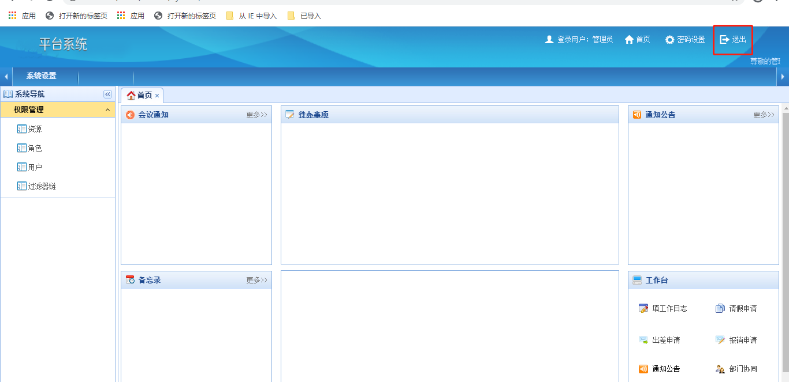

> 用户在点击退出时候，我们还没有清理缓存！如果不清理，在用户量大的时候，可能会有大量的垃圾信息在redis中存在。

重写ShiroConfig

```java
package com.itheima.shiro.core.impl;

import com.itheima.shiro.constant.CacheConstant;
import com.itheima.shiro.constant.SuperConstant;
import com.itheima.shiro.core.ShiroDbRealm;
import com.itheima.shiro.core.SimpleCacheService;
import com.itheima.shiro.core.base.ShiroUser;
import com.itheima.shiro.core.base.SimpleToken;
import com.itheima.shiro.core.bridge.UserBridgeService;
import com.itheima.shiro.pojo.User;
import com.itheima.shiro.utils.BeanConv;
import com.itheima.shiro.utils.EmptyUtil;
import com.itheima.shiro.utils.ShiroUtil;
import org.apache.shiro.authc.*;
import org.apache.shiro.authc.credential.HashedCredentialsMatcher;
import org.apache.shiro.authz.AuthorizationInfo;
import org.apache.shiro.subject.PrincipalCollection;
import org.apache.shiro.util.ByteSource;
import org.springframework.beans.factory.annotation.Autowired;

/**
 * @Description：自定义realm的抽象类实现
 */
public class ShiroDbRealmImpl extends ShiroDbRealm {

    @Autowired
    UserBridgeService userBridgeService;

    @Autowired
    SimpleCacheService simpleCacheService;

    @Override
    public AuthenticationInfo doGetAuthenticationInfo(AuthenticationToken token) throws AuthenticationException {
        //token令牌信息
        SimpleToken simpleToken = (SimpleToken) token;
        //查询user对象
        User user = userBridgeService.findUserByLoginName(simpleToken.getUsername());
        if (EmptyUtil.isNullOrEmpty(user)){
            throw new UnknownAccountException("账号不存在！");
        }
        //构建认证令牌对象
        ShiroUser shiroUser = BeanConv.toBean(user, ShiroUser.class);
        shiroUser.setResourceIds(userBridgeService.findResourcesIds(shiroUser.getId()));
        String slat  = shiroUser.getSalt();
        String password = shiroUser.getPassWord();
        //构建认证信息对象:1、令牌对象 2、密文密码  3、加密因子 4、当前realm的名称
        return new SimpleAuthenticationInfo(shiroUser, password, ByteSource.Util.bytes(slat), getName());
    }

    @Override
    public AuthorizationInfo doGetAuthorizationInfo(PrincipalCollection principals) {
        ShiroUser shiroUser = (ShiroUser) principals.getPrimaryPrincipal();
        return userBridgeService.getAuthorizationInfo(shiroUser);
    }

    @Override
    protected void doClearCache(PrincipalCollection principals) {
        ShiroUser shiroUser = (ShiroUser) principals.getPrimaryPrincipal();
        String sessionId = ShiroUtil.getShiroSessionId();
        String roleKey = CacheConstant.ROLE_KEY+sessionId;
        String resourcesKey = CacheConstant.RESOURCES_KEY+sessionId;
        String loginNamekey = CacheConstant.FIND_USER_BY_LOGINNAME + shiroUser.getLoginName();
        String resourcesIdKey = CacheConstant.RESOURCES_KEY_IDS+sessionId;
        simpleCacheService.removeCache(roleKey);
        simpleCacheService.removeCache(resourcesKey);
        simpleCacheService.removeCache(loginNamekey);
        simpleCacheService.removeCache(resourcesIdKey);
        super.doClearCache(principals);
    }

    @Override
    public void initCredentialsMatcher() {
        //指定密码算法
        HashedCredentialsMatcher hashedCredentialsMatcher = new HashedCredentialsMatcher(SuperConstant.HASH_ALGORITHM);
        //指定迭代次数
        hashedCredentialsMatcher.setHashIterations(SuperConstant.HASH_INTERATIONS);
        //生效密码比较器
        setCredentialsMatcher(hashedCredentialsMatcher);
    }
}

```


## 第七章 实现分布式会话SessionManager

### 1、会话的问题


### 2、分布式会话实现思路

#### 【1】原理分析

​		所有服务器的session信息都存储到了同一个Redis集群中，即所有的服务都将 Session 的信息存储到 Redis 集群中，无论是对 Session 的注销、更新都会同步到集群中，达到了 Session 共享的目的。


​		Cookie 保存在客户端浏览器中，而 Session 保存在服务器上。客户端浏览器访问服务器的时候，服务器把客户端信息以某种形式记录在服务器上，这就是 Session。客户端浏览器再次访问时只需要从该 Session 中查找该客户的状态就可以了。

​		在实际工作中我们建议使用外部的缓存设备(包括Redis)来共享 Session，避免单个服务器节点挂掉而影响服务，共享数据都会放到外部缓存容器中

#### 【2】设计类图详解


### 3、RedisSessionDao

RedisSessionDao继承AbstractSessionDAO，重写了会话的创建、读取、修改等操作，全部缓存与redis中

```java
package com.itheima.shiro.core.impl;

import com.itheima.shiro.constant.CacheConstant;
import com.itheima.shiro.utils.ShiroRedissionSerialize;
import lombok.extern.log4j.Log4j2;
import org.apache.shiro.session.Session;
import org.apache.shiro.session.mgt.eis.AbstractSessionDAO;
import org.redisson.api.RBucket;
import org.redisson.api.RedissonClient;

import javax.annotation.Resource;
import java.io.Serializable;
import java.util.Collection;
import java.util.Collections;
import java.util.concurrent.TimeUnit;

/**
 * @Description 实现shiro session的memcached集中式管理~
 */
@Log4j2
public class RedisSessionDao extends AbstractSessionDAO {

	@Resource(name = "redissonClientForShiro")
	RedissonClient redissonClient;

	private Long globalSessionTimeout;

	@Override
	protected Serializable doCreate(Session session) {
		Serializable sessionId = generateSessionId(session);
		assignSessionId(session, sessionId);
//		log.info("=============创建sessionId:{}",sessionId);
		RBucket<String> sessionIdRBucket = redissonClient.getBucket(CacheConstant.GROUP_CAS+sessionId.toString());
		sessionIdRBucket.trySet(ShiroRedissionSerialize.serialize(session), globalSessionTimeout, TimeUnit.SECONDS);
		return sessionId;
	}

	@Override
	protected Session doReadSession(Serializable sessionId) {
		RBucket<String> sessionIdRBucket = redissonClient.getBucket(CacheConstant.GROUP_CAS+sessionId.toString());
		Session session = (Session) ShiroRedissionSerialize.deserialize(sessionIdRBucket.get());
//		log.info("=============读取sessionId:{}",session.getId().toString());
		return session;
	}

	@Override
	public void delete(Session session) {
//		log.info("=============删除sessionId:{}",session.getId().toString());
		RBucket<String> sessionIdRBucket = redissonClient.getBucket(CacheConstant.GROUP_CAS+session.getId().toString());
		sessionIdRBucket.delete();
	}

	@Override
	public Collection<Session> getActiveSessions() {
		return Collections.emptySet();  
	}

	@Override
	public void update(Session session) {
		RBucket<String> sessionIdRBucket = redissonClient.getBucket(CacheConstant.GROUP_CAS+session.getId().toString());
		sessionIdRBucket.set(ShiroRedissionSerialize.serialize(session), globalSessionTimeout, TimeUnit.SECONDS);
//		log.info("=============修改sessionId:{}",session.getId().toString());
	}

	public void setGlobalSessionTimeout(Long globalSessionTimeout) {
		this.globalSessionTimeout = globalSessionTimeout;
	}
}


```


### 4、重写ShiroConfig

```java
package com.itheima.shiro.config;


import com.itheima.shiro.core.ShiroDbRealm;
import com.itheima.shiro.core.impl.RedisSessionDao;
import com.itheima.shiro.core.impl.ShiroCacheManager;
import com.itheima.shiro.core.impl.ShiroDbRealmImpl;
import com.itheima.shiro.filter.RolesOrAuthorizationFilter;
import com.itheima.shiro.properties.PropertiesUtil;
import lombok.extern.log4j.Log4j2;
import org.apache.shiro.session.mgt.eis.SessionDAO;
import org.apache.shiro.spring.LifecycleBeanPostProcessor;
import org.apache.shiro.spring.security.interceptor.AuthorizationAttributeSourceAdvisor;
import org.apache.shiro.spring.web.ShiroFilterFactoryBean;
import org.apache.shiro.web.mgt.DefaultWebSecurityManager;
import org.apache.shiro.web.servlet.SimpleCookie;
import org.apache.shiro.web.session.mgt.DefaultWebSessionManager;
import org.redisson.Redisson;
import org.redisson.api.RedissonClient;
import org.redisson.config.Config;
import org.springframework.aop.framework.autoproxy.DefaultAdvisorAutoProxyCreator;
import org.springframework.beans.factory.annotation.Autowired;
import org.springframework.boot.context.properties.EnableConfigurationProperties;
import org.springframework.context.annotation.Bean;
import org.springframework.context.annotation.ComponentScan;
import org.springframework.context.annotation.Configuration;
import org.springframework.context.annotation.DependsOn;

import javax.servlet.Filter;
import java.util.HashMap;
import java.util.LinkedHashMap;
import java.util.List;
import java.util.Map;

/**
 * @Description 权限配置类
 */
@Configuration
@ComponentScan(basePackages = "com.itheima.shiro.core")
@EnableConfigurationProperties({ShiroRedisProperties.class})
@Log4j2
public class ShiroConfig {

    @Autowired
    private ShiroRedisProperties shiroRedisProperties;

    /**
     * @Description redission客户端
     */
    @Bean("redissonClientForShiro")
    public RedissonClient redissonClient() {
        log.info("=====初始化redissonClientForShiro开始======");
        String[] nodeList = shiroRedisProperties.getNodes().split(",");
        Config config = new Config();
        if (nodeList.length == 1) {
            config.useSingleServer().setAddress(nodeList[0])
                    .setConnectTimeout(shiroRedisProperties.getConnectTimeout())
                    .setConnectionMinimumIdleSize(shiroRedisProperties.getConnectionMinimumidleSize())
                    .setConnectionPoolSize(shiroRedisProperties.getConnectPoolSize()).setTimeout(shiroRedisProperties.getTimeout());
        } else {
            config.useClusterServers().addNodeAddress(nodeList)
                    .setConnectTimeout(shiroRedisProperties.getConnectTimeout())
                    .setMasterConnectionMinimumIdleSize(shiroRedisProperties.getConnectionMinimumidleSize())
                    .setMasterConnectionPoolSize(shiroRedisProperties.getConnectPoolSize()).setTimeout(shiroRedisProperties.getTimeout());
        }
        RedissonClient redissonClient =  Redisson.create(config);
        log.info("=====初始化redissonClientForShiro完成======");
        return redissonClient;
    }

    /**
     * @Description 创建cookie对象
     */
    @Bean(name="sessionIdCookie")
    public SimpleCookie simpleCookie(){
        SimpleCookie simpleCookie = new SimpleCookie();
        simpleCookie.setName("ShiroSession");
        return simpleCookie;
    }
    /**
     * @Description 权限管理器
     * @param
     * @return
     */
    @Bean(name="securityManager")
    public DefaultWebSecurityManager defaultWebSecurityManager(){
        DefaultWebSecurityManager securityManager = new DefaultWebSecurityManager();
        securityManager.setRealm(shiroDbRealm());
        securityManager.setSessionManager(shiroSessionManager());
        return securityManager;
    }

    /**
     * @Description 自定义RealmImpl
     */
    @Bean(name="shiroDbRealm")
    public ShiroDbRealm shiroDbRealm(){
        return new ShiroDbRealmImpl();
    }


    /**
     * @Description 自定义session会话存储的实现类 ，使用Redis来存储共享session，达到分布式部署目的
     */
    @Bean("redisSessionDao")
    public SessionDAO redisSessionDao(){
        RedisSessionDao sessionDAO =   new RedisSessionDao();
        sessionDAO.setGlobalSessionTimeout(shiroRedisProperties.getGlobalSessionTimeout());
        return sessionDAO;
    }

    /**
     * @Description 会话管理器
     */
    @Bean(name="sessionManager")
    public DefaultWebSessionManager shiroSessionManager(){
        DefaultWebSessionManager sessionManager = new DefaultWebSessionManager();
        sessionManager.setSessionDAO(redisSessionDao());
        sessionManager.setSessionValidationSchedulerEnabled(false);
        sessionManager.setSessionIdCookieEnabled(true);
        sessionManager.setSessionIdCookie(simpleCookie());
        sessionManager.setGlobalSessionTimeout(shiroRedisProperties.getGlobalSessionTimeout());
        return sessionManager;
    }

    /**
     * @Description 保证实现了Shiro内部lifecycle函数的bean执行
     */
    @Bean(name = "lifecycleBeanPostProcessor")
    public static LifecycleBeanPostProcessor getLifecycleBeanPostProcessor() {
        return new LifecycleBeanPostProcessor();
    }

    /**
     * @Description AOP式方法级权限检查
     */
    @Bean
    @DependsOn("lifecycleBeanPostProcessor")
    public DefaultAdvisorAutoProxyCreator getDefaultAdvisorAutoProxyCreator() {
        DefaultAdvisorAutoProxyCreator defaultAdvisorAutoProxyCreator = new DefaultAdvisorAutoProxyCreator();
        defaultAdvisorAutoProxyCreator.setProxyTargetClass(true);
        return defaultAdvisorAutoProxyCreator;
    }

    /**
     * @Description 配合DefaultAdvisorAutoProxyCreator事项注解权限校验
     */
    @Bean
    public AuthorizationAttributeSourceAdvisor getAuthorizationAttributeSourceAdvisor() {
        AuthorizationAttributeSourceAdvisor aasa = new AuthorizationAttributeSourceAdvisor();
        aasa.setSecurityManager(defaultWebSecurityManager());
        return new AuthorizationAttributeSourceAdvisor();
    }

    /**
     * @Description 过滤器链
     */
    private Map<String, String> filterChainDefinition(){
        List<Object> list  = PropertiesUtil.propertiesShiro.getKeyList();
        Map<String, String> map = new LinkedHashMap<>();
        for (Object object : list) {
            String key = object.toString();
            String value = PropertiesUtil.getShiroValue(key);
            log.info("读取防止盗链控制：---key{},---value:{}",key,value);
            map.put(key, value);
        }
        return map;
    }

    /**
     * @Description 自定义过滤器定义
     */
    private Map<String, Filter> filters() {
        Map<String, Filter> map = new HashMap<String, Filter>();
        map.put("roleOr", new RolesOrAuthorizationFilter());
        return map;
    }

    /**
     * @Description Shiro过滤器
     */
    @Bean("shiroFilter")
    public ShiroFilterFactoryBean shiroFilterFactoryBean(){
        ShiroFilterFactoryBean shiroFilter = new ShiroFilterFactoryBean();
        shiroFilter.setSecurityManager(defaultWebSecurityManager());
        //使自定义过滤器生效
        shiroFilter.setFilters(filters());
        shiroFilter.setFilterChainDefinitionMap(filterChainDefinition());
        shiroFilter.setLoginUrl("/login");
        shiroFilter.setUnauthorizedUrl("/login");
        return shiroFilter;
    }

}

```

### 5、测试

> 此时我们需要2个相同的项目shiro-day01-12shiro-redis-SessionManager-A和shiro-day01-13shiro-redis-SessionManager-B


分别启动A,B2个项目

访问http://127.0.0.1:8081/shiro/login，使用admin/pass登录


修改地址栏http://127.0.0.1:8081/shiro/menus/system为http://127.0.0.1:8082/shiro/menus/system，也可以正常访问


此时我们实现了在A服务登录，直接访问B服务则无需登录


## 第八章 限制密码重试次数

### 1、实现原理

保证原子性：

​		单系统：AtomicLong计数

​		集群系统：RedissionClient提供的RAtomicLong计数

```properties
1、获取系统中是否已有登录次数缓存,缓存对象结构预期为："用户名--登录次数"。

2、如果之前没有登录缓存，则创建一个登录次数缓存。

3、如果缓存次数已经超过限制，则驳回本次登录请求。

4、将缓存记录的登录次数加1,设置指定时间内有效

5、验证用户本次输入的帐号密码，如果登录登录成功，则清除掉登录次数的缓存

```

思路有了，那我们在哪里实现呢？我们知道AuthenticatingRealm里有比较密码的入口doCredentialsMatch方法


查看其实现


### 2、自定义密码比较器

新建项目shiro-day01-14shiro-RetryLimit


#### 【1】RetryLimitCredentialsMatcher

```java
package com.itheima.shiro.core.impl;

import com.itheima.shiro.core.base.ShiroUser;
import org.apache.shiro.authc.AuthenticationInfo;
import org.apache.shiro.authc.AuthenticationToken;
import org.apache.shiro.authc.ExcessiveAttemptsException;
import org.apache.shiro.authc.credential.HashedCredentialsMatcher;
import org.redisson.api.RAtomicLong;
import org.redisson.api.RedissonClient;

import java.util.concurrent.TimeUnit;

/**
 * @Description：密码重试比较器
 */
public class RetryLimitCredentialsMatcher extends HashedCredentialsMatcher {

    private RedissonClient redissonClient;

    private static Long RETRY_LIMIT_NUM = 4L;

    /**
     * @Description 构造函数
     * @param hashAlgorithmName 匹配次数
     * @return
     */
    public RetryLimitCredentialsMatcher(String hashAlgorithmName,RedissonClient redissonClient) {
        super(hashAlgorithmName);
        this.redissonClient = redissonClient;
    }

    @Override
    public boolean doCredentialsMatch(AuthenticationToken token, AuthenticationInfo info) {
        //获得登录吗
        String loginName = (String) token.getPrincipal();
        //获得缓存
        RAtomicLong atomicLong = redissonClient.getAtomicLong(loginName);
        long retryFlag = atomicLong.get();
        //判断次数
        if (retryFlag>RETRY_LIMIT_NUM){
            //超过次数设计10分钟后重试
            atomicLong.expire(10, TimeUnit.MICROSECONDS);
            throw new ExcessiveAttemptsException("密码错误5次，请10分钟以后再试");
        }
        //累加次数
        atomicLong.incrementAndGet();
        atomicLong.expire(10, TimeUnit.MICROSECONDS);
        //密码校验
        boolean flag =  super.doCredentialsMatch(token, info);
        if (flag){
            //校验成功删除限制
            atomicLong.delete();
        }
        return flag;
    }


}

```

#### 【2】重写ShiroDbRealmImpl

修改initCredentialsMatcher方法，使用RetryLimitCredentialsMatcher

```java
package com.itheima.shiro.core.impl;

import com.itheima.shiro.constant.CacheConstant;
import com.itheima.shiro.constant.SuperConstant;
import com.itheima.shiro.core.SimpleCacheManager;
import com.itheima.shiro.core.base.ShiroUser;
import com.itheima.shiro.core.base.SimpleToken;
import com.itheima.shiro.core.ShiroDbRealm;
import com.itheima.shiro.core.bridge.UserBridgeService;
import com.itheima.shiro.pojo.User;
import com.itheima.shiro.utils.*;
import org.apache.shiro.authc.AuthenticationInfo;
import org.apache.shiro.authc.AuthenticationToken;
import org.apache.shiro.authc.SimpleAuthenticationInfo;
import org.apache.shiro.authc.UnknownAccountException;
import org.apache.shiro.authc.credential.HashedCredentialsMatcher;
import org.apache.shiro.authz.AuthorizationInfo;
import org.apache.shiro.subject.PrincipalCollection;
import org.apache.shiro.util.ByteSource;
import org.redisson.api.RedissonClient;
import org.springframework.beans.factory.annotation.Autowired;

import javax.annotation.Resource;

/**
 * @Description：自定义shiro的实现
 */
public class ShiroDbRealmImpl extends ShiroDbRealm {

    @Autowired
    private UserBridgeService userBridgeService;

    @Autowired
    private SimpleCacheManager simpleCacheManager;

    @Resource(name = "redissonClientForShiro")
    private RedissonClient redissonClient;


    /**
     * @Description 认证方法
     * @param authcToken 校验传入令牌
     * @return AuthenticationInfo
     */
    @Override
    public AuthenticationInfo doGetAuthenticationInfo(AuthenticationToken authcToken) {
        SimpleToken token = (SimpleToken)authcToken;
        User user  = userBridgeService.findUserByLoginName(token.getUsername());
        if(EmptyUtil.isNullOrEmpty(user)){
            throw new UnknownAccountException("账号不存在");
        }
        ShiroUser shiroUser = BeanConv.toBean(user, ShiroUser.class);
        String sessionId = ShiroUserUtil.getShiroSessionId();
        String cacheKeyResourcesIds = CacheConstant.RESOURCES_KEY_IDS+sessionId;
        shiroUser.setResourceIds(userBridgeService.findResourcesIdsList(cacheKeyResourcesIds,user.getId()));
        String salt = user.getSalt();
        String password = user.getPassWord();
        return new SimpleAuthenticationInfo(shiroUser, password, ByteSource.Util.bytes(salt), getName());
    }

    /**
     * @Description 授权方法
     * @param principals SimpleAuthenticationInfo对象第一个参数
     * @return
     */
    @Override
    public AuthorizationInfo doGetAuthorizationInfo(PrincipalCollection principals) {
        ShiroUser shiroUser = (ShiroUser) principals.getPrimaryPrincipal();
        return userBridgeService.getAuthorizationInfo(shiroUser);
    }

    /**
     * @Description 清理缓存
     */
    @Override
    public void doClearCache(PrincipalCollection principalcollection) {
        String sessionId = ShiroUtil.getShiroSessionId();
        simpleCacheManager.removeCache(CacheConstant.ROLE_KEY+sessionId);
        simpleCacheManager.removeCache(CacheConstant.RESOURCES_KEY+sessionId);
        simpleCacheManager.removeCache(CacheConstant.TOKEN+sessionId);
    }

    /**
     * @Description 加密方式
     */
    @Override
    public void initCredentialsMatcher() {
        RetryLimitCredentialsMatcher matcher = new RetryLimitCredentialsMatcher(SuperConstant.HASH_ALGORITHM,redissonClient);
        matcher.setHashIterations(SuperConstant.HASH_INTERATIONS);
        setCredentialsMatcher(matcher);

    }
}

```

### 3、测试

访问http://127.0.0.1/shiro/login，使用admin账号输入错误密码5次


## 第九章 在线并发登录人数控制

### 1、实现原理

在实际开发中，我们可能会遇到这样的需求，一个账号只允许同时一个在线，当账号在其他地方登陆的时候，会踢出前面登陆的账号，那我们怎么实现

- 自定义过滤器:继承AccessControlFilter

- 使用redis队列控制账号在线数目

  实现步骤：

```properties
1、只针对登录用户处理，首先判断是否登录
2、使用RedissionClien创建队列
3、判断当前sessionId是否存在于此用户的队列=key:登录名 value：多个sessionId
4、不存在则放入队列尾端==>存入sessionId
5、判断当前队列大小是否超过限定此账号的可在线人数
6、超过：
	*从队列头部拿到用户sessionId
	*从sessionManger根据sessionId拿到session
	*从sessionDao中移除session会话
7、未超过：放过操作
```

### 2、代码实现

#### 【1】KickedOutAuthorizationFilter

```java
package com.itheima.shiro.filter;

import com.itheima.shiro.core.impl.RedisSessionDao;
import com.itheima.shiro.utils.EmptyUtil;
import com.itheima.shiro.utils.ShiroUserUtil;
import lombok.extern.log4j.Log4j2;
import org.apache.shiro.session.ExpiredSessionException;
import org.apache.shiro.session.Session;
import org.apache.shiro.session.UnknownSessionException;
import org.apache.shiro.session.mgt.DefaultSessionKey;
import org.apache.shiro.session.mgt.eis.SessionDAO;
import org.apache.shiro.subject.Subject;
import org.apache.shiro.web.filter.AccessControlFilter;
import org.apache.shiro.web.session.mgt.DefaultWebSessionManager;
import org.redisson.api.RDeque;
import org.redisson.api.RedissonClient;
import org.springframework.beans.factory.annotation.Autowired;
import org.springframework.stereotype.Component;

import javax.annotation.Resource;
import javax.servlet.ServletRequest;
import javax.servlet.ServletResponse;

/**
 * @Description：
 */
@Log4j2
public class KickedOutAuthorizationFilter extends AccessControlFilter {

    private RedissonClient redissonClient;

    private SessionDAO redisSessionDao;

    private DefaultWebSessionManager sessionManager;

    public KickedOutAuthorizationFilter(RedissonClient redissonClient, SessionDAO redisSessionDao, DefaultWebSessionManager sessionManager) {
        this.redissonClient = redissonClient;
        this.redisSessionDao = redisSessionDao;
        this.sessionManager = sessionManager;
    }

    @Override
    protected boolean isAccessAllowed(ServletRequest servletRequest, ServletResponse servletResponse, Object o) throws Exception {
        return false;
    }

    @Override
    protected boolean onAccessDenied(ServletRequest servletRequest, ServletResponse servletResponse) throws Exception {
        Subject subject = getSubject(servletRequest, servletResponse);
        if (!subject.isAuthenticated()) {
            //如果没有登录，直接进行之后的流程
            return true;
        }
        //存放session对象进入队列
        String sessionId = ShiroUserUtil.getShiroSessionId();
        String LoginName = ShiroUserUtil.getShiroUser().getLoginName();
        RDeque<String> queue = redissonClient.getDeque("KickedOutAuthorizationFilter:"+LoginName);
        //判断sessionId是否存在于此用户的队列中
        boolean flag = queue.contains(sessionId);
        if (!flag) {
            queue.addLast(sessionId);
        }
        //如果此时队列大于1，则开始踢人
        if (queue.size() > 1) {
            sessionId = queue.getFirst();
            queue.removeFirst();
            Session session = null;
            try {
                session = sessionManager.getSession(new DefaultSessionKey(sessionId));
            }catch (UnknownSessionException ex){
                log.info("session已经失效");
            }catch (ExpiredSessionException expiredSessionException){
                log.info("session已经过期");
            }
            if (!EmptyUtil.isNullOrEmpty(session)){
                redisSessionDao.delete(session);
            }
        }
        return true;
    }
}


```

#### 【2】修改ShiroConfig

```java
/**
  * @Description 自定义过滤器定义
  */
private Map<String, Filter> filters() {
    Map<String, Filter> map = new HashMap<String, Filter>();
    map.put("roleOr", new RolesOrAuthorizationFilter());
    map.put("kickedOut", new KickedOutAuthorizationFilter(redissonClient(), redisSessionDao(), shiroSessionManager()));
    return map;
}
```

#### 【3】修改authentication.properties

```properties
#静态资源不过滤
/static/**=anon
#登录链接不过滤
/login/**=anon
#访问/resource/**需要有admin的角色
/resource/**=role-or[MangerRole,SuperAdmin]
#其他链接是需要登录的
/**=kickedOut,auth
```

### 3、测试

使用谷歌访问http://127.0.0.1/shiro/login，使用admin/pass登陆


使用IE再访问http://127.0.0.1/shiro/login，使用admin/pass登陆


再刷新谷歌浏览器,发现账号被踢出


## 第十章 Springboot+Shiro+Jwt前后端分离鉴权

### 1、前后端分离会话问题

#### 【1】问题追踪

​		前面我们实现分布式的会话缓存，但是我们发现此功能的实现是基于浏览的cookie机制，也就是说用户禁用cookie后，我们的系统会就会产生会话不同的问题

#### 【2】解决方案

​	   我们的前端可能是web、Android、ios等应用，同时我们每一个接口都提供了无状态的应答方式，这里我们提供了基于JWT的token生成方案

```properties
1、用户登陆之后，获得此时会话的sessionId,使用JWT根据sessionId颁发签名并设置过期时间(与session过期时间相同)返回token

2、将token保存到客户端本地，并且每次发送请求时都在header上携带JwtToken

3、ShiroSessionManager继承DefaultWebSessionManager，重写getSessionId方法，从header上检测是否携带JwtToken，如果携带，则进行解码JwtToken，使用JwtToken中的jti作为SessionId。

4、重写shiro的默认过滤器，使其支持jwtToken有效期校验、及对JSON的返回支持
	JwtAuthcFilter:实现是否需要登录的过滤，拒绝时如果header上携带JwtToken,则返回对应json
	JwtPermsFilter:实现是否有对应资源的过滤，拒绝时如果header上携带JwtToken,则返回对应json
	JwtRolesFilter:实现是否有对应角色的过滤，拒绝时如果header上携带JwtToken,则返回对应json
```


### 2、JWT概述

JWT（JSON WEB TOKEN）：JSON网络令牌，JWT是一个轻便的安全跨平台传输格式，定义了一个紧凑的自包含的方式在不同实体之间安全传输信息（JSON格式）。它是在Web环境下两个实体之间传输数据的一项标准。实际上传输的就是一个字符串。

- 广义上：JWT是一个标准的名称；

- 狭义上：JWT指的就是用来传递的那个token字符串


JWT由三部分构成：header（头部）、payload（载荷）和signature（签名）。

1. Header

   存储两个变量

   1. 秘钥（可以用来比对）
   2. 算法（也就是下面将Header和payload加密成Signature）

2. payload

   存储很多东西，基础信息有如下几个

   1. 签发人，也就是这个“令牌”归属于哪个用户。一般是`userId` 
   2. 创建时间，也就是这个令牌是什么时候创建的
   3. 失效时间，也就是这个令牌什么时候失效(session的失效时间)
   4. 唯一标识，一般可以使用算法生成一个唯一标识（jti==>sessionId）

3. Signature

   这个是上面两个经过Header中的算法加密生成的，用于比对信息，防止篡改Header和payload

然后将这三个部分的信息经过加密生成一个`JwtToken`的字符串，发送给客户端，客户端保存在本地。当客户端发起请求的时候携带这个到服务端(可以是在`cookie`，可以是在`header`)，在服务端进行验证，我们需要解密对于的payload的内容

### 3、集成JWT

#### 【1】JwtProperties

​	用于支持yaml文件配置的配置类

```java
package com.itheima.shiro.config;

import lombok.Data;
import org.springframework.boot.context.properties.ConfigurationProperties;

import java.io.Serializable;

/**
 * @Description：jw配置文件
 */
@Data
@ConfigurationProperties(prefix = "itheima.framework.jwt")
public class JwtProperties implements Serializable {

    /**
     * @Description 签名密码
     */
    private String hexEncodedSecretKey;
}

```

#### 【2】JwtTokenManager

负责令牌的颁发、解析、校验

```java
package com.itheima.shiro.core.impl;

import com.auth0.jwt.JWT;
import com.auth0.jwt.JWTVerifier;
import com.auth0.jwt.algorithms.Algorithm;
import com.itheima.shiro.config.JwtProperties;
import com.itheima.shiro.utils.EncodesUtil;
import io.jsonwebtoken.Claims;
import io.jsonwebtoken.JwtBuilder;
import io.jsonwebtoken.Jwts;
import io.jsonwebtoken.SignatureAlgorithm;
import org.springframework.beans.factory.annotation.Autowired;
import org.springframework.boot.context.properties.EnableConfigurationProperties;
import org.springframework.stereotype.Service;

import java.util.Date;
import java.util.HashMap;
import java.util.Map;
import java.util.UUID;

@Service("jwtTokenManager")
@EnableConfigurationProperties({JwtProperties.class})
public class JwtTokenManager {

    @Autowired
    JwtProperties jwtProperties;


    /**
     * @Description 签发令牌
     *      jwt字符串包括三个部分
     *        1. header
     *            -当前字符串的类型，一般都是“JWT”
     *            -哪种算法加密，“HS256”或者其他的加密算法
     *            所以一般都是固定的，没有什么变化
     *        2. payload
     *            一般有四个最常见的标准字段（下面有）
     *            iat：签发时间，也就是这个jwt什么时候生成的
     *            jti：JWT的唯一标识
     *            iss：签发人，一般都是username或者userId
     *            exp：过期时间
     * @param iss 签发人
     * @param ttlMillis 有效时间
     * @param claims jwt中存储的一些非隐私信息
     * @return
     */
    public String IssuedToken(String iss, long ttlMillis,String sessionId, Map<String, Object> claims) {
        if (claims == null) {
            claims = new HashMap<>();
        }
        long nowMillis = System.currentTimeMillis();

        String base64EncodedSecretKey = EncodesUtil.encodeHex(jwtProperties.getBase64EncodedSecretKey().getBytes());

        JwtBuilder builder = Jwts.builder()
                .setClaims(claims)
                .setId(sessionId)//2. 这个是JWT的唯一标识，一般设置成唯一的，这个方法可以生成唯一标识,此时存储的为sessionId,登录成功后回写
                .setIssuedAt(new Date(nowMillis))//1. 这个地方就是以毫秒为单位，换算当前系统时间生成的iat
                .setSubject(iss)//3. 签发人，也就是JWT是给谁的（逻辑上一般都是username或者userId）
                .signWith(SignatureAlgorithm.HS256, base64EncodedSecretKey);//这个地方是生成jwt使用的算法和秘钥
        if (ttlMillis >= 0) {
            long expMillis = nowMillis + ttlMillis;
            Date exp = new Date(expMillis);//4. 过期时间，这个也是使用毫秒生成的，使用当前时间+前面传入的持续时间生成
            builder.setExpiration(exp);
        }
        return builder.compact();
    }

    /**
     * @Description 解析令牌
     * @param jwtToken 令牌
     * @return
     */
    public Claims decodeToken(String jwtToken) {

        String base64EncodedSecretKey = EncodesUtil.encodeHex(jwtProperties.getBase64EncodedSecretKey().getBytes());

        // 得到 DefaultJwtParser
        return Jwts.parser()
                // 设置签名的秘钥
                .setSigningKey(base64EncodedSecretKey)
                // 设置需要解析的 jwt
                .parseClaimsJws(jwtToken)
                .getBody();
    }

    /**
     * @Description 判断令牌是否合法
     * @param jwtToken 令牌
     * @return
     */
    public boolean isVerifyToken(String jwtToken) {

        String base64EncodedSecretKey = EncodesUtil.encodeHex(jwtProperties.getBase64EncodedSecretKey().getBytes());

        //这个是官方的校验规则，这里只写了一个”校验算法“，可以自己加
        Algorithm algorithm = Algorithm.HMAC256(EncodesUtil.decodeBase64(base64EncodedSecretKey));
        JWTVerifier verifier = JWT.require(algorithm).build();
        verifier.verify(jwtToken);  // 校验不通过会抛出异常
        //判断合法的标准：1. 头部和荷载部分没有篡改过。2. 没有过期
        return true;
    }

}
```

### 4、重写DefaultWebSessionManager

ShiroSessionManager主要是添加jwtToken的jti作为会话的唯一标识

```java
package com.itheima.shiro.core.impl;

import com.itheima.shiro.utils.EmptyUtil;
import io.jsonwebtoken.Claims;
import org.apache.shiro.web.servlet.ShiroHttpServletRequest;
import org.apache.shiro.web.session.mgt.DefaultWebSessionManager;
import org.apache.shiro.web.util.WebUtils;
import org.springframework.beans.factory.annotation.Autowired;

import javax.servlet.ServletRequest;
import javax.servlet.ServletResponse;
import java.io.Serializable;

/**
 * @Description 重写Jwt会话管理
 */

public class ShiroSessionManager extends DefaultWebSessionManager {
	
	private static final String AUTHORIZATION = "jwtToken";

    private static final String REFERENCED_SESSION_ID_SOURCE = "Stateless request";

    public ShiroSessionManager(){
        super();
    }

    @Autowired
    JwtTokenManager jwtTokenManager;

    @Override
    protected Serializable getSessionId(ServletRequest request, ServletResponse response){
        String jwtToken = WebUtils.toHttp(request).getHeader(AUTHORIZATION);
        if(EmptyUtil.isNullOrEmpty(jwtToken)){
            //如果没有携带id参数则按照父类的方式在cookie进行获取
            return super.getSessionId(request, response);
        }else{
            //如果请求头中有 authToken 则其值为jwtToken，然后解析出会话session
        	request.setAttribute(ShiroHttpServletRequest.REFERENCED_SESSION_ID_SOURCE,REFERENCED_SESSION_ID_SOURCE);
            Claims decode = jwtTokenManager.decodeToken(jwtToken);
            String id = (String) decode.get("jti");
            request.setAttribute(ShiroHttpServletRequest.REFERENCED_SESSION_ID,id);
            request.setAttribute(ShiroHttpServletRequest.REFERENCED_SESSION_ID_IS_VALID,Boolean.TRUE);
            return id;
        }
    }

}

```

### 5、重写默认过滤器

BaseResponse返回统一json的对象

```java
package com.itheima.shiro.core.base;

import com.itheima.shiro.utils.ToString;
import lombok.AllArgsConstructor;
import lombok.Data;

/**
 * @Description 基础返回封装
 */
@Data
public class BaseResponse extends ToString {
    private Integer code ;

    private String msg ;

    private String date;

    private static final long serialVersionUID = -1;

    public BaseResponse(Integer code, String msg) {
        this.code = code;
        this.msg = msg;
    }

    public BaseResponse(Integer code, String msg, String date) {
        this.code = code;
        this.msg = msg;
        this.date = date;
    }
}

```


#### 【1】JwtAuthcFilter

使用wtTokenManager.isVerifyToken(jwtToken)校验颁发jwtToken是否合法，同时在拒绝的时候返回对应的json数据格式

```java
package com.itheima.shiro.core.filter;

import com.alibaba.fastjson.JSONObject;
import com.itheima.shiro.constant.ShiroConstant;
import com.itheima.shiro.core.base.BaseResponse;
import com.itheima.shiro.core.impl.JwtTokenManager;
import com.itheima.shiro.core.impl.ShiroSessionManager;
import com.itheima.shiro.utils.EmptyUtil;
import org.apache.shiro.web.filter.authc.FormAuthenticationFilter;
import org.apache.shiro.web.util.WebUtils;

import javax.servlet.ServletRequest;
import javax.servlet.ServletResponse;

/**
 * @Description：自定义登录验证过滤器
 */
public class JwtAuthcFilter extends FormAuthenticationFilter {

    private JwtTokenManager jwtTokenManager;

    public JwtAuthcFilter(JwtTokenManager jwtTokenManager) {
        this.jwtTokenManager = jwtTokenManager;
    }

    /**
     * @Description 是否允许访问
     */
    @Override
    protected boolean isAccessAllowed(ServletRequest request, ServletResponse response, Object mappedValue) {
        //判断当前请求头中是否带有jwtToken的字符串
        String jwtToken = WebUtils.toHttp(request).getHeader("jwtToken");
        //如果有：走jwt校验
        if (!EmptyUtil.isNullOrEmpty(jwtToken)){
            boolean verifyToken = jwtTokenManager.isVerifyToken(jwtToken);
            if (verifyToken){
                return super.isAccessAllowed(request, response, mappedValue);
            }else {
                return false;
            }
        }
        //没有没有：走原始校验
        return super.isAccessAllowed(request, response, mappedValue);
    }

    /**
     * @Description 访问拒绝时调用
     */
    @Override
    protected boolean onAccessDenied(ServletRequest request, ServletResponse response) throws Exception {
        //判断当前请求头中是否带有jwtToken的字符串
        String jwtToken = WebUtils.toHttp(request).getHeader("jwtToken");
        //如果有：返回json的应答
        if (!EmptyUtil.isNullOrEmpty(jwtToken)){
            BaseResponse baseResponse = new BaseResponse(ShiroConstant.NO_LOGIN_CODE,ShiroConstant.NO_LOGIN_MESSAGE);
            response.setCharacterEncoding("UTF-8");
            response.setContentType("application/json; charset=utf-8");
            response.getWriter().write(JSONObject.toJSONString(baseResponse));
            return false;
        }
        //如果没有：走原始方式
        return super.onAccessDenied(request, response);
    }
}

```

#### 【2】JwtPermsFilter

```java
package com.itheima.shiro.core.filter;

import com.alibaba.fastjson.JSONObject;
import com.itheima.shiro.constant.ShiroConstant;
import com.itheima.shiro.core.base.BaseResponse;
import com.itheima.shiro.utils.EmptyUtil;
import org.apache.shiro.web.filter.authz.PermissionsAuthorizationFilter;
import org.apache.shiro.web.util.WebUtils;

import javax.servlet.ServletRequest;
import javax.servlet.ServletResponse;
import java.io.IOException;

/**
 * @Description：自定义jwt的资源校验
 */
public class JwtPermsFilter extends PermissionsAuthorizationFilter {

    /**
     * @Description 访问拒绝时调用
     */
    @Override
    protected boolean onAccessDenied(ServletRequest request, ServletResponse response) throws IOException {
        //判断当前请求头中是否带有jwtToken的字符串
        String jwtToken = WebUtils.toHttp(request).getHeader("jwtToken");
        //如果有：返回json的应答
        if (!EmptyUtil.isNullOrEmpty(jwtToken)){
            BaseResponse baseResponse = new BaseResponse(ShiroConstant.NO_AUTH_CODE,ShiroConstant.NO_AUTH_MESSAGE);
            response.setCharacterEncoding("UTF-8");
            response.setContentType("application/json; charset=utf-8");
            response.getWriter().write(JSONObject.toJSONString(baseResponse));
            return false;
        }
        //如果没有：走原始方式
        return super.onAccessDenied(request, response);
    }
}

```

#### 【3】JwtRolesFilter

```java
package com.itheima.shiro.core.filter;

import com.alibaba.fastjson.JSONObject;
import com.itheima.shiro.constant.ShiroConstant;
import com.itheima.shiro.core.base.BaseResponse;
import com.itheima.shiro.utils.EmptyUtil;
import org.apache.shiro.web.filter.authz.RolesAuthorizationFilter;
import org.apache.shiro.web.util.WebUtils;

import javax.servlet.ServletRequest;
import javax.servlet.ServletResponse;
import java.io.IOException;

/**
 * @Description：自定义jwt角色校验
 */
public class JwtRolesFilter extends RolesAuthorizationFilter {

    /**
     * @Description 访问拒绝时调用
     */
    @Override
    protected boolean onAccessDenied(ServletRequest request, ServletResponse response) throws IOException {
        //判断当前请求头中是否带有jwtToken的字符串
        String jwtToken = WebUtils.toHttp(request).getHeader("jwtToken");
        //如果有：返回json的应答
        if (!EmptyUtil.isNullOrEmpty(jwtToken)){
            BaseResponse baseResponse = new BaseResponse(ShiroConstant.NO_ROLE_CODE,ShiroConstant.NO_ROLE_MESSAGE);
            response.setCharacterEncoding("UTF-8");
            response.setContentType("application/json; charset=utf-8");
            response.getWriter().write(JSONObject.toJSONString(baseResponse));
            return false;
        }
        //如果没有：走原始方式
        return super.onAccessDenied(request, response);
    }
}

```


### 6、重写ShiroConfig

1、ShiroSessionManager替换DefaultWebSessionManager

2、生效过滤器

```java
package com.itheima.shiro.config;


import com.itheima.shiro.core.ShiroDbRealm;
import com.itheima.shiro.core.impl.*;
import com.itheima.shiro.filter.*;
import com.itheima.shiro.properties.PropertiesUtil;
import lombok.extern.log4j.Log4j2;
import org.apache.shiro.session.mgt.eis.SessionDAO;
import org.apache.shiro.spring.LifecycleBeanPostProcessor;
import org.apache.shiro.spring.security.interceptor.AuthorizationAttributeSourceAdvisor;
import org.apache.shiro.spring.web.ShiroFilterFactoryBean;
import org.apache.shiro.web.mgt.DefaultWebSecurityManager;
import org.apache.shiro.web.servlet.SimpleCookie;
import org.apache.shiro.web.session.mgt.DefaultWebSessionManager;
import org.redisson.Redisson;
import org.redisson.api.RedissonClient;
import org.redisson.config.Config;
import org.springframework.aop.framework.autoproxy.DefaultAdvisorAutoProxyCreator;
import org.springframework.beans.factory.annotation.Autowired;
import org.springframework.boot.context.properties.EnableConfigurationProperties;
import org.springframework.context.annotation.Bean;
import org.springframework.context.annotation.ComponentScan;
import org.springframework.context.annotation.Configuration;
import org.springframework.context.annotation.DependsOn;

import javax.servlet.Filter;
import java.util.HashMap;
import java.util.LinkedHashMap;
import java.util.List;
import java.util.Map;

/**
 * @Description 权限配置类
 */
@Configuration
@ComponentScan(basePackages = {"com.itheima.shiro.core"})
@EnableConfigurationProperties({ShiroRedisProperties.class})
@Log4j2
public class ShiroConfig {

    @Autowired
    private ShiroRedisProperties shiroRedisProperties;

    @Autowired
    JwtTokenManager jwtTokenManager;

    /**
     * @Description redission客户端
     */
    @Bean("redissonClientForShiro")
    public RedissonClient redissonClient() {
        log.info("=====初始化redissonClientForShiro开始======");
        String[] nodeList = shiroRedisProperties.getNodes().split(",");
        Config config = new Config();
        if (nodeList.length == 1) {
            config.useSingleServer().setAddress(nodeList[0])
                    .setConnectTimeout(shiroRedisProperties.getConnectTimeout())
                    .setConnectionMinimumIdleSize(shiroRedisProperties.getConnectionMinimumidleSize())
                    .setConnectionPoolSize(shiroRedisProperties.getConnectPoolSize()).setTimeout(shiroRedisProperties.getTimeout());
        } else {
            config.useClusterServers().addNodeAddress(nodeList)
                    .setConnectTimeout(shiroRedisProperties.getConnectTimeout())
                    .setMasterConnectionMinimumIdleSize(shiroRedisProperties.getConnectionMinimumidleSize())
                    .setMasterConnectionPoolSize(shiroRedisProperties.getConnectPoolSize()).setTimeout(shiroRedisProperties.getTimeout());
        }
        RedissonClient redissonClient =  Redisson.create(config);
        log.info("=====初始化redissonClientForShiro完成======");
        return redissonClient;
    }

    /**
     * @Description 创建cookie对象
     */
    @Bean(name="sessionIdCookie")
    public SimpleCookie simpleCookie(){
        SimpleCookie simpleCookie = new SimpleCookie();
        simpleCookie.setName("ShiroSession");
        return simpleCookie;
    }

    /**
     * @Description 缓存管理器
     * @param
     * @return
     */
    @Bean(name="shiroCacheManager")
    public ShiroCacheManager shiroCacheManager(){
        return new ShiroCacheManager();
    }

    /**
     * @Description 权限管理器
     * @param
     * @return
     */
    @Bean(name="securityManager")
    public DefaultWebSecurityManager defaultWebSecurityManager(){
        DefaultWebSecurityManager securityManager = new DefaultWebSecurityManager();
        securityManager.setRealm(shiroDbRealm());
        securityManager.setSessionManager(shiroSessionManager());
        securityManager.setCacheManager(shiroCacheManager());
        return securityManager;
    }

    /**
     * @Description 自定义RealmImpl
     */
    @Bean(name="shiroDbRealm")
    public ShiroDbRealm shiroDbRealm(){
        return new ShiroDbRealmImpl();
    }


    /**
     * @Description 自定义session会话存储的实现类 ，使用Redis来存储共享session，达到分布式部署目的
     */
    @Bean("redisSessionDao")
    public SessionDAO redisSessionDao(){
        RedisSessionDao sessionDAO =   new RedisSessionDao();
        sessionDAO.setGlobalSessionTimeout(shiroRedisProperties.getGlobalSessionTimeout());
        return sessionDAO;
    }

    /**
     * @Description 会话管理器
     */
    @Bean(name="sessionManager")
    public ShiroSessionManager shiroSessionManager(){
        ShiroSessionManager sessionManager = new ShiroSessionManager();
        sessionManager.setSessionDAO(redisSessionDao());
        sessionManager.setSessionValidationSchedulerEnabled(false);
        sessionManager.setSessionIdCookieEnabled(true);
        sessionManager.setSessionIdCookie(simpleCookie());
        sessionManager.setGlobalSessionTimeout(shiroRedisProperties.getGlobalSessionTimeout());
        return sessionManager;
    }

    /**
     * @Description 保证实现了Shiro内部lifecycle函数的bean执行
     */
    @Bean(name = "lifecycleBeanPostProcessor")
    public static LifecycleBeanPostProcessor getLifecycleBeanPostProcessor() {
        return new LifecycleBeanPostProcessor();
    }

    /**
     * @Description AOP式方法级权限检查
     */
    @Bean
    @DependsOn("lifecycleBeanPostProcessor")
    public DefaultAdvisorAutoProxyCreator getDefaultAdvisorAutoProxyCreator() {
        DefaultAdvisorAutoProxyCreator defaultAdvisorAutoProxyCreator = new DefaultAdvisorAutoProxyCreator();
        defaultAdvisorAutoProxyCreator.setProxyTargetClass(true);
        return defaultAdvisorAutoProxyCreator;
    }

    /**
     * @Description 配合DefaultAdvisorAutoProxyCreator事项注解权限校验
     */
    @Bean
    public AuthorizationAttributeSourceAdvisor getAuthorizationAttributeSourceAdvisor() {
        AuthorizationAttributeSourceAdvisor aasa = new AuthorizationAttributeSourceAdvisor();
        aasa.setSecurityManager(defaultWebSecurityManager());
        return new AuthorizationAttributeSourceAdvisor();
    }

    /**
     * @Description 过滤器链
     */
    private Map<String, String> filterChainDefinition(){
        List<Object> list  = PropertiesUtil.propertiesShiro.getKeyList();
        Map<String, String> map = new LinkedHashMap<>();
        for (Object object : list) {
            String key = object.toString();
            String value = PropertiesUtil.getShiroValue(key);
            log.info("读取防止盗链控制：---key{},---value:{}",key,value);
            map.put(key, value);
        }
        return map;
    }


    /**
     * @Description 自定义过滤器定义
     */
    private Map<String, Filter> filters() {
        Map<String, Filter> map = new HashMap<String, Filter>();
        map.put("roleOr", new RolesOrAuthorizationFilter());
        map.put("kicked-out", new KickedOutAuthorizationFilter(redissonClient(), redisSessionDao(), shiroSessionManager()));
        map.put("jwt-authc", new JwtAuthcFilter(jwtTokenManager));
        map.put("jwt-perms", new JwtPermsFilter());
        map.put("jwt-roles", new JwtRolesFilter());
        return map;
    }

    /**
     * @Description Shiro过滤器
     */
    @Bean("shiroFilter")
    public ShiroFilterFactoryBean shiroFilterFactoryBean(){
        ShiroFilterFactoryBean shiroFilter = new ShiroFilterFactoryBean();
        shiroFilter.setSecurityManager(defaultWebSecurityManager());
        //使自定义过滤器生效
        shiroFilter.setFilters(filters());
        shiroFilter.setFilterChainDefinitionMap(filterChainDefinition());
        shiroFilter.setLoginUrl("/login");
        shiroFilter.setUnauthorizedUrl("/login");
        return shiroFilter;
    }

}

```

### 7、业务代码

#### 【1】LoginAction

添加LoginForJwt方法

```java
/**
	 * @Description jwt的json登录方式
	 * @param loginVo
	 * @return
	 */
	@RequestMapping("login-jwt")
	@ResponseBody
	public BaseResponse LoginForJwt(@RequestBody LoginVo loginVo){
		return loginService.routeForJwt(loginVo);
	}
```

#### 【2】LoginService

添加routeForJwt方法

```java
package com.itheima.shiro.service;

import com.itheima.shiro.core.base.BaseResponse;
import com.itheima.shiro.vo.LoginVo;
import org.apache.shiro.authc.IncorrectCredentialsException;
import org.apache.shiro.authc.UnknownAccountException;

import java.util.Map;

/**
 * @Description 登陆业务接口
 */

public interface LoginService {
	
	/**
	 * @Description 登陆路由
	 * @param loginVo 登录参数
	 * @return
	 */
	public Map<String, String> route(LoginVo loginVo) throws UnknownAccountException,IncorrectCredentialsException;

	/**
	 * @Description jwt方式登录
	 @param loginVo 登录参数
	 * @return
	 */
	public BaseResponse routeForJwt(LoginVo loginVo) throws UnknownAccountException,IncorrectCredentialsException;

}


```

#### 【3】LoginServiceImpl

```java


package com.itheima.shiro.service.impl;

import com.alibaba.fastjson.JSONObject;
import com.itheima.shiro.constant.CacheConstant;
import com.itheima.shiro.constant.ShiroConstant;
import com.itheima.shiro.core.base.BaseResponse;
import com.itheima.shiro.core.base.ShiroUser;
import com.itheima.shiro.core.base.SimpleToken;
import com.itheima.shiro.core.bridge.UserBridgeService;
import com.itheima.shiro.core.impl.JwtTokenManager;
import com.itheima.shiro.pojo.User;
import com.itheima.shiro.service.LoginService;
import com.itheima.shiro.utils.BeanConv;
import com.itheima.shiro.utils.ShiroUserUtil;
import com.itheima.shiro.utils.ShiroUtil;
import com.itheima.shiro.vo.LoginVo;
import lombok.extern.log4j.Log4j2;
import org.apache.shiro.SecurityUtils;
import org.apache.shiro.authc.IncorrectCredentialsException;
import org.apache.shiro.authc.UnknownAccountException;
import org.apache.shiro.subject.Subject;
import org.redisson.api.RedissonClient;
import org.springframework.beans.factory.annotation.Autowired;
import org.springframework.stereotype.Service;

import javax.annotation.Resource;
import java.util.HashMap;
import java.util.Map;
import java.util.concurrent.TimeUnit;

/**
 * @Description 登陆业务实现
 */
@Service("loginService")
@Log4j2
public class LoginServiceImpl implements LoginService {

    @Resource(name = "redissonClientForShiro")
    RedissonClient redissonClient;

    @Autowired
    UserBridgeService userBridgeService;

    @Autowired
    JwtTokenManager jwtTokenManager;

    /* (non-Javadoc)
     * @see LoginService#route(com.yz.commons.vo.LoginVo)
     */
    @Override
    public Map<String, String> route(LoginVo loginVo) throws UnknownAccountException, IncorrectCredentialsException {
        Map<String, String> map = new HashMap<>();
        try {
            SimpleToken token = new SimpleToken(null, loginVo.getLoginName(), loginVo.getPassWord());
            Subject subject = SecurityUtils.getSubject();
            subject.login(token);
            //创建缓存
            this.loadAuthorityToCache();
        } catch (UnknownAccountException ex) {
            log.error("登陆异常:{}", ex);
            throw new UnknownAccountException(ex);
        } catch (IncorrectCredentialsException ex) {
            log.error("登陆异常:{}", ex);
            throw new IncorrectCredentialsException(ex);
        }
        return map;
    }

    @Override
    public BaseResponse routeForJwt(LoginVo loginVo) throws UnknownAccountException, IncorrectCredentialsException {
        Map<String, String> map = new HashMap<>();
        String jwtToken = null;
        try {
            SimpleToken token = new SimpleToken(null, loginVo.getLoginName(), loginVo.getPassWord());
            Subject subject = SecurityUtils.getSubject();
            subject.login(token);
            String shiroSessionId = ShiroUserUtil.getShiroSessionId();
            //登录后颁发的令牌
            ShiroUser shiroUser = ShiroUserUtil.getShiroUser();
            Map<String, Object> claims = new HashMap<>();
            claims.put("shiroUser", JSONObject.toJSONString(shiroUser));
            jwtToken = jwtTokenManager.IssuedToken("system", subject.getSession().getTimeout(),shiroSessionId,claims);
            map.put("jwtToken",jwtToken );
            log.info("jwtToken:{}",map.toString());
            //创建缓存
            this.loadAuthorityToCache();
        } catch (Exception ex) {
            BaseResponse baseResponse = new BaseResponse(ShiroConstant.LOGIN_FAILURE_CODE, ShiroConstant.LOGIN_FAILURE_MESSAGE);
            return baseResponse;
        }
        BaseResponse baseResponse = new BaseResponse(ShiroConstant.LOGIN_SUCCESS_CODE,ShiroConstant.LOGIN_SUCCESS_MESSAGE,jwtToken);
        return baseResponse;
    }

    /**
     *
     * <b>方法名：</b>：loadAuthorityToCache<br>
     * <b>功能说明：</b>：加载缓存<br>
     */
    private void loadAuthorityToCache(){
        //登陆成功后缓存用户的权限信息进入缓存
        ShiroUser shiroUser = ShiroUserUtil.getShiroUser();
        User user = BeanConv.toBean(shiroUser, User.class);
        userBridgeService.loadUserAuthorityToCache(user);

    }

}

```

【5】authentication.properties

```properties
#静态资源不过滤
/static/**=anon
#登录链接不过滤
/login/**=anon
#访问/resource/**需要有admin的角色
#/resource/**=roleOr[MangerRole,SuperAdmin]
/role/** =jwt-roles[SuperAdmin]
/resource/** =jwt-perms[role:listInitialize]
#其他链接是需要登录的
/**=kicked-out,jwt-authc
```

### 8、测试

1、测试登录后，jwtToken的生成，且校验会话是否使用新的jwtToken里的会话jti

2、测试自定义过滤器是否生效

使用jay/pass登录


使用admin/pass登录


## 第十一章 分布式统一权限系统

### 1、系统需求

#### 【1】前后端分离

在第十章中我们已经实现，使用jwt的令牌实现，重写DefaultWebSessionManager,从ServletRequest获得jwtToken作为会话sessionId

```java
package com.itheima.shiro.core.impl;

import com.itheima.shiro.utils.EmptyUtil;
import io.jsonwebtoken.Claims;
import org.apache.shiro.web.servlet.ShiroHttpServletRequest;
import org.apache.shiro.web.session.mgt.DefaultWebSessionManager;
import org.apache.shiro.web.util.WebUtils;
import org.springframework.beans.factory.annotation.Autowired;

import javax.servlet.ServletRequest;
import javax.servlet.ServletResponse;
import java.io.Serializable;

/**
 * @Description 重写Jwt会话管理
 */

public class ShiroSessionManager extends DefaultWebSessionManager {
	
	private static final String AUTHORIZATION = "jwtToken";

    private static final String REFERENCED_SESSION_ID_SOURCE = "Stateless request";

    public ShiroSessionManager(){
        super();
    }

    @Autowired
    JwtTokenManager jwtTokenManager;

    @Override
    protected Serializable getSessionId(ServletRequest request, ServletResponse response){
        String jwtToken = WebUtils.toHttp(request).getHeader(AUTHORIZATION);
        if(EmptyUtil.isNullOrEmpty(jwtToken)){
            //如果没有携带id参数则按照父类的方式在cookie进行获取
            return super.getSessionId(request, response);
        }else{
            //如果请求头中有 authToken 则其值为jwtToken，然后解析出会话session
        	request.setAttribute(ShiroHttpServletRequest.REFERENCED_SESSION_ID_SOURCE,REFERENCED_SESSION_ID_SOURCE);
            Claims decode = jwtTokenManager.decodeToken(jwtToken);
            String id = (String) decode.get("jti");
            request.setAttribute(ShiroHttpServletRequest.REFERENCED_SESSION_ID,id);
            request.setAttribute(ShiroHttpServletRequest.REFERENCED_SESSION_ID_IS_VALID,Boolean.TRUE);
            return id;
        }
    }

}

```

#### 【2】集中式会话

在第七章中RedisSessionDao继承AbstractSessionDAO，重写了会话的创建、读取、修改等操作，全部缓存于redis中

```java
package com.itheima.shiro.core.impl;

import com.itheima.shiro.constant.CacheConstant;
import com.itheima.shiro.utils.ShiroRedissionSerialize;
import lombok.extern.log4j.Log4j2;
import org.apache.shiro.session.Session;
import org.apache.shiro.session.mgt.eis.AbstractSessionDAO;
import org.redisson.api.RBucket;
import org.redisson.api.RedissonClient;

import javax.annotation.Resource;
import java.io.Serializable;
import java.util.Collection;
import java.util.Collections;
import java.util.concurrent.TimeUnit;

/**
 * @Description 实现shiro session的memcached集中式管理~
 */
@Log4j2
public class RedisSessionDao extends AbstractSessionDAO {

	@Resource(name = "redissonClientForShiro")
	RedissonClient redissonClient;

	private Long globalSessionTimeout;

	@Override
	protected Serializable doCreate(Session session) {
		Serializable sessionId = generateSessionId(session);
		assignSessionId(session, sessionId);
//		log.info("=============创建sessionId:{}",sessionId);
		RBucket<String> sessionIdRBucket = redissonClient.getBucket(CacheConstant.GROUP_CAS+sessionId.toString());
		sessionIdRBucket.trySet(ShiroRedissionSerialize.serialize(session), globalSessionTimeout, TimeUnit.SECONDS);
		return sessionId;
	}

	@Override
	protected Session doReadSession(Serializable sessionId) {
		RBucket<String> sessionIdRBucket = redissonClient.getBucket(CacheConstant.GROUP_CAS+sessionId.toString());
		Session session = (Session) ShiroRedissionSerialize.deserialize(sessionIdRBucket.get());
//		log.info("=============读取sessionId:{}",session.getId().toString());
		return session;
	}

	@Override
	public void delete(Session session) {
//		log.info("=============删除sessionId:{}",session.getId().toString());
		RBucket<String> sessionIdRBucket = redissonClient.getBucket(CacheConstant.GROUP_CAS+session.getId().toString());
		sessionIdRBucket.delete();
	}

	@Override
	public Collection<Session> getActiveSessions() {
		return Collections.emptySet();  
	}

	@Override
	public void update(Session session) {
		RBucket<String> sessionIdRBucket = redissonClient.getBucket(CacheConstant.GROUP_CAS+session.getId().toString());
		sessionIdRBucket.set(ShiroRedissionSerialize.serialize(session), globalSessionTimeout, TimeUnit.SECONDS);
//		log.info("=============修改sessionId:{}",session.getId().toString());
	}

	public void setGlobalSessionTimeout(Long globalSessionTimeout) {
		this.globalSessionTimeout = globalSessionTimeout;
	}
}


```

#### 【3】认证与鉴权服务化

第六章中，我们实现了realm的缓存机制，这里我们会把UserBridgeService使用dubbo服务化


其目的使得实际项目中的认证与鉴权走dubbo，减少服务器压力

#### 【4】动态过滤器链

在第十章中，我们加载过滤器链的方式

```properties
#静态资源不过滤
/static/**=anon
#登录链接不过滤
/login/**=anon
#访问/resource/**需要有admin的角色
#/resource/**=role-or[MangerRole,SuperAdmin]
#/role/** =jwt-roles[SuperAdmin]
/resource/** =jwt-perms[role:listInitialize]
#其他链接是需要登录的
/**=kicked-out,jwt-authc
```

在统一鉴权系统中，我们不可能每次发布新的过滤器链，就去重启服务器，我们更希望可以动态管理过滤器链

#### 【5】权限客户端

shiro-client作为jar的依赖，满足以下需求：

1、非侵入式：使用者只需要对jar依赖和做少量的配置，就可以达到统一鉴权的目标

2、可扩展性：用户除使用提供的过滤器外，可以轻松安自己的业务去定义过滤器

3、集中式管理：依赖jar之后，shiro-mgt后台可以同时管控多个平台的权限的认证、鉴权、及动态配置过滤器链

#### 【6】网关平台

springboot-shiro-gateway:

1、依赖shiro-client项目作为权限的被控制层

2、实现dubbo传输协议到HTTP传输协议的转化，当然这里提供的为通用的转换方式。

3、可复制、复制后只需要在shiro-mgt后台中做简单的配置，就可以实现一个新网关的接入

### 2、架构设计

#### 【1】系统网络通讯


1、网关服务集群性，同时实现会话的统一管理

2、鉴权服务集群化，提供统一鉴权服务

3、管理后台集群化

#### 【2】模块依赖关系

##### 【1.1】springboot-shiro-parent

springboot-shiro-parent:项目统一jar和plugIn的POM定义


##### 【1.2】springboot-shiro-gateway-handler

​		1、dubbo业务服务转换http通讯

​		2、认证与鉴权服务化消费者

​		3、生成业务服务化消费者


##### 【1.3】springboot-shiro-producer

​		认证与鉴权服务化的生成者


##### 【1.4】springboot-shiro-mgt

​		认证与鉴权服务化消费者


##### 【1.5】springboot-shiro-dubbo-app-handler

​		生产业务服务化生产者

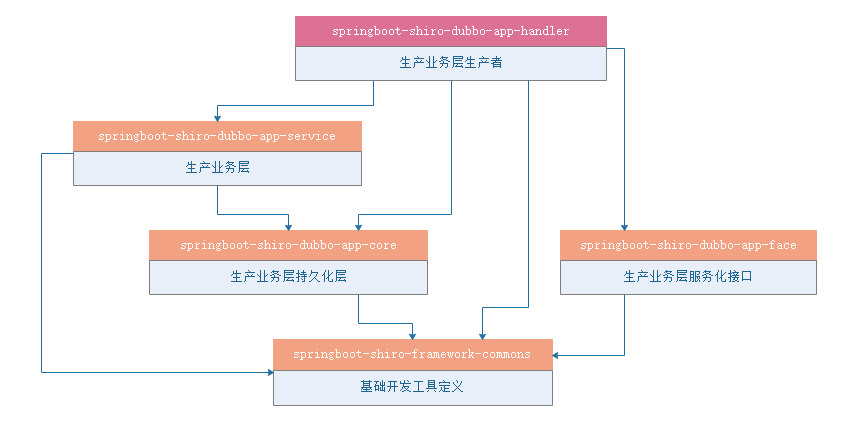


### 3、认证鉴权服务化


上面的图解中我们可以看到，这里服务化的为UserAdapterFace

模块springboot-shiro-face中的接口定义UserAdapterFace

```java
package com.itheima.shiro.face;

import com.itheima.shiro.vo.ResourceVo;
import com.itheima.shiro.vo.RoleVo;
import com.itheima.shiro.vo.UserVo;

import java.util.List;

/**
 * @Description：用户服务接口定义
 */
public interface UserAdapterFace {

    /**
     * @Description 按用户名查找用户
     * @param loginName 登录名
     * @return
     */
    UserVo findUserByLoginName(String loginName);

    /**
     * @Description 查找用户所有角色
     * @param userId 用户Id
     * @return
     */
    List<RoleVo> findRoleByUserId(String userId);

    /**
     * @Description 查询用户有那些资源
     * @param userId 用户Id
     * @return
     */
    List<ResourceVo> findResourceByUserId(String userId);

}

```

springboot-shiro-producer模块中的生产者UserAdapterFaceImpl

```java
package com.itheima.shiro.faceImpl;

import com.itheima.shiro.adapter.UserAdapter;
import com.itheima.shiro.face.UserAdapterFace;
import com.itheima.shiro.pojo.Resource;
import com.itheima.shiro.pojo.Role;
import com.itheima.shiro.pojo.User;
import com.itheima.shiro.utils.BeanConv;
import com.itheima.shiro.utils.EmptyUtil;
import com.itheima.shiro.vo.ResourceVo;
import com.itheima.shiro.vo.RoleVo;
import com.itheima.shiro.vo.UserVo;
import org.apache.dubbo.config.annotation.Service;
import org.springframework.beans.factory.annotation.Autowired;

import java.util.List;

/**
 * @Description：
 */
@Service(version = "1.0.0", retries = 3,timeout = 5000)
public class UserAdapterFaceImpl implements UserAdapterFace {

    @Autowired
    UserAdapter userAdapter;


    @Override
    public UserVo findUserByLoginName(String loginName) {
        User user = userAdapter.findUserByLoginName(loginName);
        if (!EmptyUtil.isNullOrEmpty(user)){
            return BeanConv.toBean(user,UserVo.class);
        }
        return null;
    }

    @Override
    public List<RoleVo> findRoleByUserId(String userId) {
        List<Role> list = userAdapter.findRoleByUserId(userId);
        if (!EmptyUtil.isNullOrEmpty(list)){
            return BeanConv.toBeanList(list, RoleVo.class);
        }
        return null;
    }

    @Override
    public List<ResourceVo> findResourceByUserId(String userId) {
        List<Resource> list = userAdapter.findResourceByUserId(userId);
        if (!EmptyUtil.isNullOrEmpty(list)){
            return BeanConv.toBeanList(list, ResourceVo.class);
        }
        return null;
    }
}

```

springboot-shiro-handler模块下的消费者UserBridgeServiceImpl

```java
package com.itheima.shiro.client;

import com.itheima.shiro.constant.CacheConstant;
import com.itheima.shiro.core.SimpleCacheManager;
import com.itheima.shiro.core.base.ShiroUser;
import com.itheima.shiro.core.base.SimpleMapCache;
import com.itheima.shiro.core.base.SimpleToken;
import com.itheima.shiro.core.bridge.UserBridgeService;
import com.itheima.shiro.face.UserAdapterFace;
import com.itheima.shiro.utils.BeanConv;
import com.itheima.shiro.utils.EmptyUtil;
import com.itheima.shiro.utils.ShiroUserUtil;
import com.itheima.shiro.vo.ResourceVo;
import com.itheima.shiro.vo.RoleVo;
import com.itheima.shiro.vo.UserVo;
import lombok.extern.slf4j.Slf4j;
import org.apache.dubbo.config.annotation.Reference;
import org.apache.shiro.authc.AuthenticationInfo;
import org.apache.shiro.authc.AuthenticationToken;
import org.apache.shiro.authc.SimpleAuthenticationInfo;
import org.apache.shiro.authc.UnknownAccountException;
import org.apache.shiro.authz.SimpleAuthorizationInfo;
import org.apache.shiro.util.ByteSource;
import org.redisson.api.RBucket;
import org.redisson.api.RedissonClient;
import org.springframework.beans.factory.annotation.Autowired;
import org.springframework.stereotype.Component;

import java.util.ArrayList;
import java.util.HashMap;
import java.util.List;
import java.util.Map;
import java.util.concurrent.TimeUnit;


/**
 * @Description 权限桥接器
 */
@Slf4j
@Component("userBridgeService")
public class UserBridgeServiceImpl implements UserBridgeService {

    @Reference(version = "1.0.0")
    private UserAdapterFace userAdapterFace;

    @Autowired
    private SimpleCacheManager simpleCacheManager;

    @javax.annotation.Resource(name = "redissonClientForShiro")
    private RedissonClient redissonClient;

    public AuthenticationInfo doGetAuthenticationInfo(AuthenticationToken authcToken,String realmName) {
        SimpleToken token = (SimpleToken)authcToken;
        UserVo user  = this.findUserByLoginName(token.getUsername());
        if(EmptyUtil.isNullOrEmpty(user)){
            throw new UnknownAccountException("账号不存在");
        }
        ShiroUser shiroUser = BeanConv.toBean(user, ShiroUser.class);
        String sessionId = ShiroUserUtil.getShiroSessionId();
        String cacheKeyResourcesIds = CacheConstant.RESOURCES_KEY_IDS+sessionId;
        shiroUser.setResourceIds(this.findResourcesIdsList(cacheKeyResourcesIds,user.getId()));
        String salt = user.getSalt();
        String password = user.getPassWord();
        return new SimpleAuthenticationInfo(shiroUser, password, ByteSource.Util.bytes(salt), realmName);
    }

    @Override
    public SimpleAuthorizationInfo getAuthorizationInfo(ShiroUser shiroUser) {
        UserVo user = BeanConv.toBean(shiroUser, UserVo.class);
        SimpleAuthorizationInfo info = new SimpleAuthorizationInfo();
        String sessionId = ShiroUserUtil.getShiroSessionId();
        //查询用户拥有的角色
        String cacheKeyRole = CacheConstant.ROLE_KEY + sessionId;
        info.addRoles(this.findRoleList(cacheKeyRole, user.getId()));

        //查询用户拥有的资源
        String cacheKeyResources = CacheConstant.RESOURCES_KEY + sessionId;
        info.addStringPermissions(this.findResourcesList(cacheKeyResources, user.getId()));
        return info;
    }


    @Override
    public List<String> findRoleList(String cacheKeyRole, String userId) {
        List<RoleVo> roles = new ArrayList<RoleVo>();
        if (simpleCacheManager.getCache(cacheKeyRole) != null) {
            roles = (List<RoleVo>) simpleCacheManager.getCache(cacheKeyRole).get(cacheKeyRole);
        } else {
            roles = userAdapterFace.findRoleByUserId(userId);
            if (roles.size() > 0) {
                //用户角色存放到map
                Map<Object, Object> mapRole = new HashMap<Object, Object>();
                mapRole.put(cacheKeyRole, roles);
                //新建SimpleMapCache实例并放入缓存管理器
                SimpleMapCache cacheRole = new SimpleMapCache(cacheKeyRole, mapRole);
                simpleCacheManager.createCache(cacheKeyRole, cacheRole);
            }
        }
        List<String> rolesLabel = new ArrayList<String>();
        for (RoleVo role : roles) {
            rolesLabel.add(role.getLabel());
        }
        return rolesLabel;
    }


    @Override
    public List<String> findResourcesList(String cacheKeyResources,String userId) {
        List<ResourceVo> resourcesList = new ArrayList<ResourceVo>();
        if (simpleCacheManager.getCache(cacheKeyResources) != null) {
            resourcesList = (List<ResourceVo>) simpleCacheManager.getCache(cacheKeyResources).get(cacheKeyResources);
        } else {
            resourcesList = userAdapterFace.findResourceByUserId(userId);
            if (resourcesList.size() > 0) {
                //用户资源存放到map
                Map<Object, Object> mapResource = new HashMap<Object, Object>();
                mapResource.put(cacheKeyResources, resourcesList);
                //新建SimpleMapCache实例并放入缓存管理器
                SimpleMapCache cacheResource = new SimpleMapCache(cacheKeyResources, mapResource);
                simpleCacheManager.createCache(cacheKeyResources, cacheResource);
            }
        }
        List<String> resourcesLabel = new ArrayList<String>();
        for (ResourceVo resources : resourcesList) {
            resourcesLabel.add(resources.getLabel());
        }
        return resourcesLabel;
    }


    @Override
    public UserVo findUserByLoginName(String loginName) {
        String key = CacheConstant.FIND_USER_BY_LOGINNAME+loginName;
        RBucket<UserVo> rBucket = redissonClient.getBucket(key);
        UserVo user = rBucket.get();
        if (!EmptyUtil.isNullOrEmpty(user)) {
            return user;
        }else {
            user = userAdapterFace.findUserByLoginName(loginName);
            if (!EmptyUtil.isNullOrEmpty(user)) {
                rBucket.set(user, 300, TimeUnit.SECONDS);
                return user;
            }
        }
        rBucket.set(new UserVo(), 3, TimeUnit.SECONDS);
        return null;
    }

    @Override
    public List<String> findResourcesIdsList(String cacheKeyResources,String userId) {
        List<ResourceVo> resourcesList = new ArrayList<ResourceVo>();
        if (simpleCacheManager.getCache(cacheKeyResources) != null) {
            resourcesList = (List<ResourceVo>) simpleCacheManager.getCache(cacheKeyResources).get(cacheKeyResources);
        } else {
            resourcesList = userAdapterFace.findResourceByUserId(userId);
            if (resourcesList.size() > 0) {
                //用户资源存放到map
                Map<Object, Object> mapResource = new HashMap<Object, Object>();
                mapResource.put(cacheKeyResources, resourcesList);
                //新建SimpleMapCache实例并放入缓存管理器
                SimpleMapCache cacheResource = new SimpleMapCache(cacheKeyResources, mapResource);
                simpleCacheManager.createCache(cacheKeyResources, cacheResource);
            }
        }
        List<String> resourcesLabel = new ArrayList<String>();
        for (ResourceVo resources : resourcesList) {
            resourcesLabel.add(resources.getId());
        }
        return resourcesLabel;
    }

    @Override
    public void loadUserAuthorityToCache(ShiroUser user) {
        String sessionId = user.getSessionId();
        List<RoleVo> roles = userAdapterFace.findRoleByUserId(user.getId());
        //创建角色cachaeKey
        String cacheKeyRole = CacheConstant.ROLE_KEY + sessionId;
        //用户角色存放到map
        Map<Object, Object> mapRole = new HashMap<Object, Object>();
        mapRole.put(cacheKeyRole, roles);
        //新建SimpleMapCache实例并放入缓存管理器
        SimpleMapCache cacheRole = new SimpleMapCache(cacheKeyRole, mapRole);
        simpleCacheManager.createCache(cacheKeyRole, cacheRole);

        List<ResourceVo> resourcesList = userAdapterFace.findResourceByUserId(user.getId());
        if (resourcesList.size() > 0) {
            //创建资源cachaeKey
            String cacheKeyResources = CacheConstant.RESOURCES_KEY + sessionId;
            //用户资源存放到map
            Map<Object, Object> mapResource = new HashMap<Object, Object>();
            mapResource.put(cacheKeyResources, resourcesList);
            //新建SimpleMapCache实例并放入缓存管理器
            SimpleMapCache cacheResource = new SimpleMapCache(cacheKeyResources, mapResource);
            simpleCacheManager.createCache(cacheKeyResources, cacheResource);
        }
    }
}

```

通过上面的改造，我们可以发现：用户在认证与鉴权时走的都是dubbo的服务，而在实际业务项目中不会再去操作鉴权相关的内容

### 4、动态过滤器链

在第十章中，我们加载过滤器链的方式

```properties
#静态资源不过滤
/static/**=anon
#登录链接不过滤
/login/**=anon
#访问/resource/**需要有admin的角色
#/resource/**=roleOr[MangerRole,SuperAdmin]
#/role/** =jwt-roles[SuperAdmin]
/resource/** =jwt-perms[role:listInitialize]
#其他链接是需要登录的
/**=kicked-out,jwt-authc
```

在统计鉴权系统中，我们不可能每次发布新的过滤器链，就去重启服务器，我们更希望可以动态管理过滤器链

#### 【1】需求分析

实现动态过滤器链，我们需要保证以下几个特性：

1、持久化：原有的properties内容放入数据库，

2、有序性：因过滤器链有序加载的特性，读取过滤器链的时保证其有序性

3、服务化：过滤器链的服务做成dubbo服务，做到集中式管理

4、同步性：不同业务系统对于过滤器链的加载需要同步

5、热加载：过滤器链修改之后，各个业务系统不需要重启服务，以达到热加载的目的


#### 【2】代码实现

##### 【2.1】持久化、有序化


主要是对FilterChain类的CRUD这里就不做赘述，需要注意的是排序：升序排列，以保障过滤器链的有序加载

##### 【2.2】服务化

服务化过滤器链加载

```properties
FilterChainFace:过滤器链桥接器dubbo接口层
FilterChainFaceImpl:过滤器链桥接器dubbo接口层实现
```

FilterChainFace接口

```java
package com.itheima.shiro.face;

import com.itheima.shiro.vo.FilterChainVo;

import java.util.List;

/**
 * @Description：过滤器查询接口
 */
public interface FilterChainFace {

    public List<FilterChainVo> findFilterChainList();
}

```

FilterChainFaceImpl

```java
package com.itheima.shiro.faceImpl;

import com.itheima.shiro.face.FilterChainFace;
import com.itheima.shiro.pojo.FilterChain;
import com.itheima.shiro.service.FilterChainService;
import com.itheima.shiro.utils.BeanConv;
import com.itheima.shiro.utils.EmptyUtil;
import com.itheima.shiro.vo.FilterChainVo;
import org.apache.dubbo.config.annotation.Service;
import org.springframework.beans.factory.annotation.Autowired;

import java.util.List;

/**
 * @Description：
 */
@Service(version = "1.0.0", retries = 3,timeout = 5000)
public class FilterChainFaceImpl implements FilterChainFace {

    @Autowired
    FilterChainService filterChainService;

    @Override
    public List<FilterChainVo> findFilterChainList() {
        List<FilterChain> filterChainList = filterChainService.findFilterChainList();
        if (!EmptyUtil.isNullOrEmpty(filterChainList)){
            return BeanConv.toBeanList(filterChainList, FilterChainVo.class);
        }
        return null;
    }
}

```

这里只是简单的dubbo服务，也不做赘述

##### 【2.3】同步性

定义启动加载过滤器链服务同步：

```properties
FilterChainBridgeService:过滤器链桥接器service接口层
FilterChainBridgeServiceImpl:过滤器链桥接器service接口层实现

ShiroFilerChainService:shiro过滤器链服务加载接口
ShiroFilerChainService:shiro过滤器链服务加载接口实现

```

FilterChainBridgeService

```java
package com.itheima.shiro.core.bridge;

import com.itheima.shiro.vo.FilterChainVo;

import java.lang.reflect.InvocationTargetException;
import java.util.List;

/**
 * @Description 过滤器链service接口层
 */
public interface FilterChainBridgeService {

    /**
     * @Description 查询所有有效的过滤器链
     * @return
     */
    List<FilterChainVo> findFilterChainList();


}
```

FilterChainBridgeServiceImpl

```java
package com.itheima.shiro.client;

import com.itheima.shiro.core.bridge.FilterChainBridgeService;
import com.itheima.shiro.face.FilterChainFace;
import com.itheima.shiro.vo.FilterChainVo;
import org.apache.dubbo.config.annotation.Reference;
import org.springframework.stereotype.Component;

import java.util.List;

/**
 * @Description：
 */
@Component("filterChainBridgeService")
public class FilterChainBridgeServiceImpl implements FilterChainBridgeService {

    @Reference(version = "1.0.0")
    private FilterChainFace filterChainFace;

    @Override
    public List<FilterChainVo> findFilterChainList() {

        return filterChainFace.findFilterChainList();
    }
}

```

ShiroFilerChainService过滤器链同步接口

```java
package com.itheima.shiro.service;

import com.itheima.shiro.vo.FilterChainVo;

import javax.annotation.PostConstruct;
import java.util.List;

/**
 * @Description：过滤器链同步接口
 */
public interface ShiroFilerChainService {

    /**
     * @Description 启动时加载数据库中的过滤器链
     */
    void init();

    /**
     * @Description 初始化过滤器链
     * @param
     * @return
     */
    void initFilterChains(List<FilterChainVo> FilterChainVos);
}

```

ShiroFilerChainServiceImpl过滤器链同步接口实现

```java
package com.itheima.shiro.service.impl;

import com.itheima.shiro.core.impl.CustomDefaultFilterChainManager;
import com.itheima.shiro.service.ShiroFilerChainService;
import com.itheima.shiro.core.bridge.FilterChainBridgeService;
import com.itheima.shiro.vo.FilterChainVo;
import lombok.extern.log4j.Log4j2;
import org.apache.shiro.web.filter.mgt.DefaultFilterChainManager;
import org.apache.shiro.web.filter.mgt.NamedFilterList;
import org.springframework.beans.factory.annotation.Autowired;
import org.springframework.stereotype.Service;

import javax.annotation.PostConstruct;
import java.util.LinkedHashMap;
import java.util.List;
import java.util.Map;
import java.util.concurrent.Executors;
import java.util.concurrent.ScheduledExecutorService;
import java.util.concurrent.TimeUnit;

/**
 * @Description：过滤器链同步接口实现
 */
@Service("shiroFilerChainManager")
@Log4j2
public class ShiroFilerChainServiceImpl implements ShiroFilerChainService {

    //此时注入的为CustomDefaultFilterChainManager
    @Autowired
    private CustomDefaultFilterChainManager filterChainManager;

    @Autowired
    FilterChainBridgeService filterChainBridgeService;

    private Map<String, NamedFilterList> defaultFilterChains;

    private ScheduledExecutorService executor = Executors.newScheduledThreadPool(1);

    /**
     * @Description 启动定时器，间隔2分钟同步数据库的过滤器链
     */
    @Override
    @PostConstruct
    public void init() {
        defaultFilterChains = new LinkedHashMap<>();
        executor.scheduleAtFixedRate(new Runnable() {
            @Override
            public void run() {
                try {
                    initFilterChains(filterChainBridgeService.findFilterChainList());
                } catch (Exception e) {
                    log.error(e.getMessage(), e);
                }
            }
        }, 0, 120, TimeUnit.SECONDS);

    }

    @Override
    public void initFilterChains(List<FilterChainVo> FilterChainVos) {

        //1、首先删除以前老的filter chain并注册默认的
        filterChainManager.getFilterChains().clear();

        //2、循环URL Filter 注册filter chain
        for (FilterChainVo urlFilterVo : FilterChainVos) {
            String url = urlFilterVo.getUrl();
            String filterName = urlFilterVo.getFilterName();
            String[] filterNames = filterName.split(",");
            for (String name : filterNames) {
                //注册所有filter，包含自定义的过滤器
                switch(name){
                    case "anon":
                        filterChainManager.addToChain(url, name);
                        break;
                    case "authc":
                        filterChainManager.addToChain(url, name);
                        break;
                    case "roles":
                        filterChainManager.addToChain(url, name, urlFilterVo.getRoles());
                        break;
                    case "perms":
                        filterChainManager.addToChain(url, name,urlFilterVo.getPermissions());
                        break;
                    case "role-or":
                        filterChainManager.addToChain(url, name,urlFilterVo.getRoles());
                        break;
                    case "kicked-out":
                        filterChainManager.addToChain(url, name);
                        break;
                    case "jwt-authc":
                        filterChainManager.addToChain(url, name);
                        break;
                    case "jwt-roles":
                        filterChainManager.addToChain(url, name, urlFilterVo.getRoles());
                        break;
                    case "jwt-perms":
                        filterChainManager.addToChain(url, name,urlFilterVo.getPermissions());
                        break;
                    default:
                        break;
                }
            }
        }
    }
}

```


##### 【2.4】热加载

为了实现热加载我们需要定义以下3个类

```properties
CustomDefaultFilterChainManager:自定义的默认过滤器链管理者
CustomPathMatchingFilterChainResolver:自定义的路径匹配过滤器链解析器
CustomShiroFilterFactoryBean:自定义shiro过滤器工厂bean
```

###### 【2.4.1】CustomDefaultFilterChainManager


咱们来看下顶级接口FilterChainManager 

```java
package com.itheima.shiro.core.impl;

import org.apache.shiro.config.Ini;
import org.apache.shiro.util.CollectionUtils;
import org.apache.shiro.util.Nameable;
import org.apache.shiro.util.StringUtils;
import org.apache.shiro.web.config.IniFilterChainResolverFactory;
import org.apache.shiro.web.filter.AccessControlFilter;
import org.apache.shiro.web.filter.authc.AuthenticationFilter;
import org.apache.shiro.web.filter.authz.AuthorizationFilter;
import org.apache.shiro.web.filter.mgt.DefaultFilterChainManager;
import org.apache.shiro.web.filter.mgt.NamedFilterList;
import org.apache.shiro.web.filter.mgt.SimpleNamedFilterList;

import javax.annotation.PostConstruct;
import javax.servlet.Filter;
import javax.servlet.FilterChain;
import java.util.LinkedHashMap;
import java.util.List;
import java.util.Map;

/**
 * @Description：自定义默认过滤器管理者
 */
public class CustomDefaultFilterChainManager extends DefaultFilterChainManager {

    //登录地址
    private String loginUrl;

    //登录成功后默认跳转地址
    private String successUrl;

    //未授权跳转地址
    private String unauthorizedUrl;

    public CustomDefaultFilterChainManager() {
        //构建过滤器
        setFilters(new LinkedHashMap<String, Filter>());
        //构建过滤器链
        setFilterChains(new LinkedHashMap<String, NamedFilterList>());
        //构建默认过滤器
        addDefaultFilters(true);
    }


    /**
     * @Description 注册我们自定义的过滤器，相当于ShiroFilterFactoryBean的filters属性
     * @param customFilters 过滤器
     * @return
     */
    public void setCustomFilters(Map<String, Filter> customFilters) {
        for(Map.Entry<String, Filter> entry : customFilters.entrySet()) {
            addFilter(entry.getKey(), entry.getValue(), false);
        }
    }


    /**
     * @Description Spring容器启动时调用
     */
    @PostConstruct
    public void init() {
        //配置默认过滤器
        Map<String, Filter> filters = getFilters();

        //为过滤器链配置全局URL处理属性
        for (Filter filter : filters.values()) {
            applyGlobalPropertiesIfNecessary(filter);
        }
    }

    /**
     * @Description 此时交于spring容器出事化，这里忽略
     */
    @Override
    protected void initFilter(Filter filter) {
    }

    private void applyGlobalPropertiesIfNecessary(Filter filter) {
        applyLoginUrlIfNecessary(filter);
        applySuccessUrlIfNecessary(filter);
        applyUnauthorizedUrlIfNecessary(filter);
    }

    private void applyLoginUrlIfNecessary(Filter filter) {
        String loginUrl = getLoginUrl();
        if (StringUtils.hasText(loginUrl) && (filter instanceof AccessControlFilter)) {
            AccessControlFilter acFilter = (AccessControlFilter) filter;
            //only apply the login url if they haven't explicitly configured one already:
            String existingLoginUrl = acFilter.getLoginUrl();
            if (AccessControlFilter.DEFAULT_LOGIN_URL.equals(existingLoginUrl)) {
                acFilter.setLoginUrl(loginUrl);
            }
        }
    }

    private void applySuccessUrlIfNecessary(Filter filter) {
        String successUrl = getSuccessUrl();
        if (StringUtils.hasText(successUrl) && (filter instanceof AuthenticationFilter)) {
            AuthenticationFilter authcFilter = (AuthenticationFilter) filter;
            //only apply the successUrl if they haven't explicitly configured one already:
            String existingSuccessUrl = authcFilter.getSuccessUrl();
            if (AuthenticationFilter.DEFAULT_SUCCESS_URL.equals(existingSuccessUrl)) {
                authcFilter.setSuccessUrl(successUrl);
            }
        }
    }

    private void applyUnauthorizedUrlIfNecessary(Filter filter) {
        String unauthorizedUrl = getUnauthorizedUrl();
        if (StringUtils.hasText(unauthorizedUrl) && (filter instanceof AuthorizationFilter)) {
            AuthorizationFilter authzFilter = (AuthorizationFilter) filter;
            //only apply the unauthorizedUrl if they haven't explicitly configured one already:
            String existingUnauthorizedUrl = authzFilter.getUnauthorizedUrl();
            if (existingUnauthorizedUrl == null) {
                authzFilter.setUnauthorizedUrl(unauthorizedUrl);
            }
        }
    }


    public String getLoginUrl() {
        return loginUrl;
    }

    public void setLoginUrl(String loginUrl) {
        this.loginUrl = loginUrl;
    }

    public String getSuccessUrl() {
        return successUrl;
    }

    public void setSuccessUrl(String successUrl) {
        this.successUrl = successUrl;
    }

    public String getUnauthorizedUrl() {
        return unauthorizedUrl;
    }

    public void setUnauthorizedUrl(String unauthorizedUrl) {
        this.unauthorizedUrl = unauthorizedUrl;
    }

}

```

CustomDefaultFilterChainManager：主要是把原来对象的创建交于spring容器，同时指定过滤器，然后构建过滤器链

```java
package com.itheima.shiro.core.impl;

import org.apache.shiro.config.Ini;
import org.apache.shiro.util.CollectionUtils;
import org.apache.shiro.util.Nameable;
import org.apache.shiro.util.StringUtils;
import org.apache.shiro.web.config.IniFilterChainResolverFactory;
import org.apache.shiro.web.filter.AccessControlFilter;
import org.apache.shiro.web.filter.authc.AuthenticationFilter;
import org.apache.shiro.web.filter.authz.AuthorizationFilter;
import org.apache.shiro.web.filter.mgt.DefaultFilterChainManager;
import org.apache.shiro.web.filter.mgt.NamedFilterList;
import org.apache.shiro.web.filter.mgt.SimpleNamedFilterList;

import javax.annotation.PostConstruct;
import javax.servlet.Filter;
import javax.servlet.FilterChain;
import java.util.LinkedHashMap;
import java.util.List;
import java.util.Map;

/**
 * @Description：自定义默认过滤器管理者
 */
public class CustomDefaultFilterChainManager extends DefaultFilterChainManager {

    //登录地址
    private String loginUrl;

    //登录成功后默认跳转地址
    private String successUrl;

    //未授权跳转地址
    private String unauthorizedUrl;

    public CustomDefaultFilterChainManager() {
        //构建过滤器
        setFilters(new LinkedHashMap<String, Filter>());
        //构建过滤器链
        setFilterChains(new LinkedHashMap<String, NamedFilterList>());
        //构建默认过滤器
        addDefaultFilters(true);
    }


    /**
     * @Description 注册我们自定义的过滤器，相当于ShiroFilterFactoryBean的filters属性
     * @param customFilters 过滤器
     * @return
     */
    public void setCustomFilters(Map<String, Filter> customFilters) {
        for(Map.Entry<String, Filter> entry : customFilters.entrySet()) {
            addFilter(entry.getKey(), entry.getValue(), false);
        }
    }


    /**
     * @Description Spring容器启动时调用
     */
    @PostConstruct
    public void init() {
        //配置默认过滤器
        Map<String, Filter> filters = getFilters();
        if (!CollectionUtils.isEmpty(filters)) {
            //注册过滤器
            for (Map.Entry<String, Filter> entry : filters.entrySet()) {
                //过滤器名称
                String name = entry.getKey();
                //过滤器
                Filter filter = entry.getValue();
                if (filter instanceof Nameable) {
                    ((Nameable) filter).setName(name);
                }
                //配置3个URL
                applyGlobalPropertiesIfNecessary(filter);
            }
        }
    }

    /**
     * @Description 此时交于spring容器出事化，这里忽略
     */
    @Override
    protected void initFilter(Filter filter) {
    }

    private void applyGlobalPropertiesIfNecessary(Filter filter) {
        applyLoginUrlIfNecessary(filter);
        applySuccessUrlIfNecessary(filter);
        applyUnauthorizedUrlIfNecessary(filter);
    }

    private void applyLoginUrlIfNecessary(Filter filter) {
        String loginUrl = getLoginUrl();
        if (StringUtils.hasText(loginUrl) && (filter instanceof AccessControlFilter)) {
            AccessControlFilter acFilter = (AccessControlFilter) filter;
            //only apply the login url if they haven't explicitly configured one already:
            String existingLoginUrl = acFilter.getLoginUrl();
            if (AccessControlFilter.DEFAULT_LOGIN_URL.equals(existingLoginUrl)) {
                acFilter.setLoginUrl(loginUrl);
            }
        }
    }

    private void applySuccessUrlIfNecessary(Filter filter) {
        String successUrl = getSuccessUrl();
        if (StringUtils.hasText(successUrl) && (filter instanceof AuthenticationFilter)) {
            AuthenticationFilter authcFilter = (AuthenticationFilter) filter;
            //only apply the successUrl if they haven't explicitly configured one already:
            String existingSuccessUrl = authcFilter.getSuccessUrl();
            if (AuthenticationFilter.DEFAULT_SUCCESS_URL.equals(existingSuccessUrl)) {
                authcFilter.setSuccessUrl(successUrl);
            }
        }
    }

    private void applyUnauthorizedUrlIfNecessary(Filter filter) {
        String unauthorizedUrl = getUnauthorizedUrl();
        if (StringUtils.hasText(unauthorizedUrl) && (filter instanceof AuthorizationFilter)) {
            AuthorizationFilter authzFilter = (AuthorizationFilter) filter;
            //only apply the unauthorizedUrl if they haven't explicitly configured one already:
            String existingUnauthorizedUrl = authzFilter.getUnauthorizedUrl();
            if (existingUnauthorizedUrl == null) {
                authzFilter.setUnauthorizedUrl(unauthorizedUrl);
            }
        }
    }


    public String getLoginUrl() {
        return loginUrl;
    }

    public void setLoginUrl(String loginUrl) {
        this.loginUrl = loginUrl;
    }

    public String getSuccessUrl() {
        return successUrl;
    }

    public void setSuccessUrl(String successUrl) {
        this.successUrl = successUrl;
    }

    public String getUnauthorizedUrl() {
        return unauthorizedUrl;
    }

    public void setUnauthorizedUrl(String unauthorizedUrl) {
        this.unauthorizedUrl = unauthorizedUrl;
    }

}

```

###### 【2.4.2】CustomPathMatchingFilterChainResolver


```java

package org.apache.shiro.web.filter.mgt;

import javax.servlet.FilterChain;
import javax.servlet.ServletRequest;
import javax.servlet.ServletResponse;


public interface FilterChainResolver {

	//根据请求获得对应的过滤器链
    FilterChain getChain(ServletRequest request, ServletResponse response, FilterChain originalChain);

}

```

CustomPathMatchingFilterChainResolver

这里主要核心内容是：指定使用过滤器链管理器为自己定的过滤器管理器

```java
package com.itheima.shiro.core.impl;

import org.apache.shiro.web.filter.mgt.FilterChainManager;
import org.apache.shiro.web.filter.mgt.PathMatchingFilterChainResolver;
import org.springframework.beans.factory.annotation.Autowired;

import javax.servlet.FilterChain;
import javax.servlet.ServletRequest;
import javax.servlet.ServletResponse;
import java.util.ArrayList;
import java.util.List;


public class CustomPathMatchingFilterChainResolver extends PathMatchingFilterChainResolver {

    private CustomDefaultFilterChainManager customDefaultFilterChainManager;

    public void setCustomDefaultFilterChainManager(CustomDefaultFilterChainManager customDefaultFilterChainManager) {
        this.customDefaultFilterChainManager = customDefaultFilterChainManager;
    }

    public CustomDefaultFilterChainManager getCustomDefaultFilterChainManager() {
        return customDefaultFilterChainManager;
    }

    @Override
    public FilterChain getChain(ServletRequest request, ServletResponse response, FilterChain originalChain) {
        //指定使用过滤器链管理器为自己定的过滤器管理器
        FilterChainManager filterChainManager = getCustomDefaultFilterChainManager();
        if (!filterChainManager.hasChains()) {
            return null;
        }

        String requestURI = getPathWithinApplication(request);

        List<String> chainNames = new ArrayList<String>();
        //the 'chain names' in this implementation are actually path patterns defined by the user.  We just use them
        //as the chain name for the FilterChainManager's requirements
        for (String pathPattern : filterChainManager.getChainNames()) {

            // If the path does match, then pass on to the subclass implementation for specific checks:
            if (pathMatches(pathPattern, requestURI)) {
                return filterChainManager.proxy(originalChain, pathPattern);
            }
        }
        return null;
    }
}

```

###### 【2.4.3】CustomShiroFilterFactoryBean


```java
protected AbstractShiroFilter createInstance() throws Exception {

        log.debug("Creating Shiro Filter instance.");

        SecurityManager securityManager = getSecurityManager();
        if (securityManager == null) {
            String msg = "SecurityManager property must be set.";
            throw new BeanInitializationException(msg);
        }

        if (!(securityManager instanceof WebSecurityManager)) {
            String msg = "The security manager does not implement the WebSecurityManager interface.";
            throw new BeanInitializationException(msg);
        }

        FilterChainManager manager = createFilterChainManager();

        //Expose the constructed FilterChainManager by first wrapping it in a
        // FilterChainResolver implementation. The AbstractShiroFilter implementations
        // do not know about FilterChainManagers - only resolvers:
        PathMatchingFilterChainResolver chainResolver = new PathMatchingFilterChainResolver();
        chainResolver.setFilterChainManager(manager);

        //Now create a concrete ShiroFilter instance and apply the acquired SecurityManager and built
        //FilterChainResolver.  It doesn't matter that the instance is an anonymous inner class
        //here - we're just using it because it is a concrete AbstractShiroFilter instance that accepts
        //injection of the SecurityManager and FilterChainResolver:
        return new SpringShiroFilter((WebSecurityManager) securityManager, chainResolver);
    }
```

ShiroFilterFactoryBean源码我们发现PathMatchingFilterChainResolver未暴露set方法，我们改写一下

```java
package com.itheima.shiro.core.impl;

import org.apache.shiro.mgt.SecurityManager;
import org.apache.shiro.spring.web.ShiroFilterFactoryBean;
import org.apache.shiro.web.filter.mgt.FilterChainManager;
import org.apache.shiro.web.filter.mgt.FilterChainResolver;
import org.apache.shiro.web.filter.mgt.PathMatchingFilterChainResolver;
import org.apache.shiro.web.mgt.WebSecurityManager;
import org.apache.shiro.web.servlet.AbstractShiroFilter;
import org.springframework.beans.factory.BeanInitializationException;

/**
 * @Description：
 */
public class CustomShiroFilterFactoryBean extends ShiroFilterFactoryBean {

    PathMatchingFilterChainResolver chainResolver ;

    public void setChainResolver(PathMatchingFilterChainResolver chainResolver) {
        this.chainResolver = chainResolver;
    }

    @Override
    protected AbstractShiroFilter createInstance() throws Exception {


        SecurityManager securityManager = getSecurityManager();
        if (securityManager == null) {
            String msg = "SecurityManager property must be set.";
            throw new BeanInitializationException(msg);
        }

        if (!(securityManager instanceof WebSecurityManager)) {
            String msg = "The security manager does not implement the WebSecurityManager interface.";
            throw new BeanInitializationException(msg);
        }

        FilterChainManager manager = createFilterChainManager();


        chainResolver.setFilterChainManager(manager);

        //Now create a concrete ShiroFilter instance and apply the acquired SecurityManager and built
        //FilterChainResolver.  It doesn't matter that the instance is an anonymous inner class
        //here - we're just using it because it is a concrete AbstractShiroFilter instance that accepts
        //injection of the SecurityManager and FilterChainResolver:
        return new SpringShiroFilter((WebSecurityManager) securityManager, chainResolver);
    }

    private static final class SpringShiroFilter extends AbstractShiroFilter {

        protected SpringShiroFilter(WebSecurityManager webSecurityManager, FilterChainResolver resolver) {
            super();
            if (webSecurityManager == null) {
                throw new IllegalArgumentException("WebSecurityManager property cannot be null.");
            }
            setSecurityManager(webSecurityManager);
            if (resolver != null) {
                setFilterChainResolver(resolver);
            }
        }
    }
}

```

###### 【2.4.4】ShiroConfig改造

```java
package com.itheima.shiro.config;


import com.itheima.shiro.constant.SuperConstant;
import com.itheima.shiro.core.ShiroDbRealm;
import com.itheima.shiro.core.filter.*;
import com.itheima.shiro.core.impl.*;
import lombok.extern.log4j.Log4j2;
import org.apache.shiro.authc.credential.HashedCredentialsMatcher;
import org.apache.shiro.session.mgt.eis.SessionDAO;
import org.apache.shiro.spring.LifecycleBeanPostProcessor;
import org.apache.shiro.spring.security.interceptor.AuthorizationAttributeSourceAdvisor;
import org.apache.shiro.web.mgt.DefaultWebSecurityManager;
import org.apache.shiro.web.servlet.SimpleCookie;
import org.redisson.Redisson;
import org.redisson.api.RedissonClient;
import org.redisson.config.Config;
import org.springframework.aop.framework.autoproxy.DefaultAdvisorAutoProxyCreator;
import org.springframework.beans.factory.annotation.Autowired;
import org.springframework.boot.context.properties.EnableConfigurationProperties;
import org.springframework.context.annotation.Bean;
import org.springframework.context.annotation.ComponentScan;
import org.springframework.context.annotation.Configuration;
import org.springframework.context.annotation.DependsOn;

import javax.servlet.Filter;
import java.util.HashMap;
import java.util.Map;

/**
 * @Description 权限配置类
 */
@Configuration
@ComponentScan(basePackages = {"com.itheima.shiro.core"})
@EnableConfigurationProperties({ShiroRedisProperties.class})
@Log4j2
public class ShiroConfig {

    @Autowired
    private ShiroRedisProperties shiroRedisProperties;

    @Autowired
    JwtTokenManager jwtTokenManager;

    /**
     * @Description redission客户端
     */
    @Bean("redissonClientForShiro")
    public RedissonClient redissonClient() {
        log.info("=====初始化redissonClientForShiro开始======");
        String[] nodeList = shiroRedisProperties.getNodes().split(",");
        Config config = new Config();
        if (nodeList.length == 1) {
            config.useSingleServer().setAddress(nodeList[0])
                    .setConnectTimeout(shiroRedisProperties.getConnectTimeout())
                    .setConnectionMinimumIdleSize(shiroRedisProperties.getConnectionMinimumidleSize())
                    .setConnectionPoolSize(shiroRedisProperties.getConnectPoolSize()).setTimeout(shiroRedisProperties.getTimeout());
        } else {
            config.useClusterServers().addNodeAddress(nodeList)
                    .setConnectTimeout(shiroRedisProperties.getConnectTimeout())
                    .setMasterConnectionMinimumIdleSize(shiroRedisProperties.getConnectionMinimumidleSize())
                    .setMasterConnectionPoolSize(shiroRedisProperties.getConnectPoolSize()).setTimeout(shiroRedisProperties.getTimeout());
        }
        RedissonClient redissonClient =  Redisson.create(config);
        log.info("=====初始化redissonClientForShiro完成======");
        return redissonClient;
    }

    /**
     * @Description 创建cookie对象
     */
    @Bean(name="sessionIdCookie")
    public SimpleCookie simpleCookie(){
        SimpleCookie simpleCookie = new SimpleCookie();
        simpleCookie.setName("ShiroSession");
        return simpleCookie;
    }

    /**
     * @Description 缓存管理器
     * @param
     * @return
     */
    @Bean(name="shiroCacheManager")
    public ShiroCacheManager shiroCacheManager(){
        return new ShiroCacheManager(shiroRedisProperties.getGlobalSessionTimeout());
    }

    /**
     * @Description 权限管理器
     * @param
     * @return
     */
    @Bean(name="securityManager")
    public DefaultWebSecurityManager defaultWebSecurityManager(){
        DefaultWebSecurityManager securityManager = new DefaultWebSecurityManager();
        securityManager.setRealm(shiroDbRealm());
        securityManager.setSessionManager(shiroSessionManager());
        securityManager.setCacheManager(shiroCacheManager());
        return securityManager;
    }

    /**
     * @Description 密码比较器
     */
    @Bean
    public HashedCredentialsMatcher hashedCredentialsMatcher (){
        RetryLimitCredentialsMatcher matcher = new RetryLimitCredentialsMatcher(SuperConstant.HASH_ALGORITHM);
        matcher.setHashIterations(SuperConstant.HASH_INTERATIONS);
        return matcher;
    }
    /**
     * @Description 自定义RealmImpl
     */
    @Bean(name="shiroDbRealm")
    public ShiroDbRealm shiroDbRealm(){
        ShiroDbRealm shiroDbRealm =new ShiroDbRealmImpl();
        shiroDbRealm.setCredentialsMatcher(hashedCredentialsMatcher());
        return shiroDbRealm;
    }


    /**
     * @Description 自定义session会话存储的实现类 ，使用Redis来存储共享session，达到分布式部署目的
     */
    @Bean("redisSessionDao")
    public SessionDAO redisSessionDao(){
        RedisSessionDao sessionDAO =   new RedisSessionDao();
        sessionDAO.setGlobalSessionTimeout(shiroRedisProperties.getGlobalSessionTimeout());
        return sessionDAO;
    }

    /**
     * @Description 会话管理器
     */
    @Bean(name="sessionManager")
    public ShiroSessionManager shiroSessionManager(){
        ShiroSessionManager sessionManager = new ShiroSessionManager();
        sessionManager.setSessionDAO(redisSessionDao());
        sessionManager.setSessionValidationSchedulerEnabled(false);
        sessionManager.setSessionIdCookieEnabled(true);
        sessionManager.setSessionIdCookie(simpleCookie());
        sessionManager.setGlobalSessionTimeout(shiroRedisProperties.getGlobalSessionTimeout());
        return sessionManager;
    }

    /**
     * @Description 保证实现了Shiro内部lifecycle函数的bean执行
     */
    @Bean(name = "lifecycleBeanPostProcessor")
    public static LifecycleBeanPostProcessor getLifecycleBeanPostProcessor() {
        return new LifecycleBeanPostProcessor();
    }

    /**
     * @Description AOP式方法级权限检查
     */
    @Bean
    @DependsOn("lifecycleBeanPostProcessor")
    public DefaultAdvisorAutoProxyCreator getDefaultAdvisorAutoProxyCreator() {
        DefaultAdvisorAutoProxyCreator defaultAdvisorAutoProxyCreator = new DefaultAdvisorAutoProxyCreator();
        defaultAdvisorAutoProxyCreator.setProxyTargetClass(true);
        return defaultAdvisorAutoProxyCreator;
    }

    /**
     * @Description 配合DefaultAdvisorAutoProxyCreator事项注解权限校验
     */
    @Bean
    public AuthorizationAttributeSourceAdvisor getAuthorizationAttributeSourceAdvisor() {
        AuthorizationAttributeSourceAdvisor aasa = new AuthorizationAttributeSourceAdvisor();
        aasa.setSecurityManager(defaultWebSecurityManager());
        return new AuthorizationAttributeSourceAdvisor();
    }

    /**
     * @Description 自定义拦截器定义
     */
    private Map<String, Filter> filters() {
        Map<String, Filter> map = new HashMap<String, Filter>();
        map.put("role-or", new RolesOrAuthorizationFilter());
        map.put("kicked-out", new KickedOutAuthorizationFilter(redissonClient(), redisSessionDao(), shiroSessionManager()));
        map.put("jwt-authc", new JwtAuthcFilter(jwtTokenManager));
        map.put("jwt-perms", new JwtPermsFilter());
        map.put("jwt-roles", new JwtRolesFilter());
        return map;
    }

    /**
     * @Description Shiro过滤器
     */
    @Bean("shiroFilter")
    public CustomShiroFilterFactoryBean shiroFilterFactoryBean(){
        CustomShiroFilterFactoryBean shiroFilter = new CustomShiroFilterFactoryBean();
        shiroFilter.setSecurityManager(defaultWebSecurityManager());
        shiroFilter.setChainResolver(filterChainResolver());
        return shiroFilter;
    }

    @Bean
    public CustomDefaultFilterChainManager defaultFilterChainManager(){
        CustomDefaultFilterChainManager filterChainManager = new CustomDefaultFilterChainManager();
        filterChainManager.setLoginUrl("/login");
        filterChainManager.setUnauthorizedUrl("/login");
        filterChainManager.setCustomFilters(filters());
        return filterChainManager;
    }

    @Bean
    CustomPathMatchingFilterChainResolver filterChainResolver(){
        CustomPathMatchingFilterChainResolver pathMatchingFilterChainResolver = new CustomPathMatchingFilterChainResolver();
        pathMatchingFilterChainResolver.setCustomDefaultFilterChainManager(defaultFilterChainManager());
        return pathMatchingFilterChainResolver;
    }

}

```


### 5、shiro-client客户端

shiro-client作为jar的依赖，满足以下需求：

1、非侵入式：使用者只需要对jar依赖和做少量的配置，就可以达到统一鉴权的目标

2、可扩展性：用户除使用提供的过滤器外，可以轻松安自己的业务区定义过滤器

3、集中式管理：依赖jar之后，shiro-mgt后台可以同时管控多个平台的权限的认证、鉴权、及动态配置过滤器链

#### 【1】模块依赖关系


#### 【2】原理分析

springboot-shiro-framework-client项目向上继承了springboot-shiro-framework-core项目，springboot-shiro-framework-core是主要实现认证、鉴权、过滤器定义、会话统一、realm缓存的核心项目。

springboot-shiro-framework-client项目以jar的方式被需要做权限控制的gateway项目所依赖，再由gateway通过对springboot-shiro-producer的dubbo消费，以达到统一认证、鉴权

springboot-shiro-framework-client模块实现了springboot-shiro-framework-core接口的3个类：

```properties
UserBridgeServiceImpl:提供用户基本资源操作的业务实现
FilterChainBridgeServiceImpl:提供过滤器链接口的查询
ResourceBridgeServiceImpl:提供资源查询
```

UserBridgeServiceImpl

```java
package com.itheima.shiro.client;

import com.itheima.shiro.constant.CacheConstant;
import com.itheima.shiro.core.SimpleCacheManager;
import com.itheima.shiro.core.base.ShiroUser;
import com.itheima.shiro.core.base.SimpleMapCache;
import com.itheima.shiro.core.base.SimpleToken;
import com.itheima.shiro.core.bridge.UserBridgeService;
import com.itheima.shiro.face.UserAdapterFace;
import com.itheima.shiro.utils.BeanConv;
import com.itheima.shiro.utils.EmptyUtil;
import com.itheima.shiro.utils.ShiroUserUtil;
import com.itheima.shiro.vo.ResourceVo;
import com.itheima.shiro.vo.RoleVo;
import com.itheima.shiro.vo.UserVo;
import lombok.extern.slf4j.Slf4j;
import org.apache.dubbo.config.annotation.Reference;
import org.apache.shiro.authc.AuthenticationInfo;
import org.apache.shiro.authc.AuthenticationToken;
import org.apache.shiro.authc.SimpleAuthenticationInfo;
import org.apache.shiro.authc.UnknownAccountException;
import org.apache.shiro.authz.SimpleAuthorizationInfo;
import org.apache.shiro.util.ByteSource;
import org.redisson.api.RBucket;
import org.redisson.api.RedissonClient;
import org.springframework.beans.factory.annotation.Autowired;
import org.springframework.stereotype.Component;

import java.util.ArrayList;
import java.util.HashMap;
import java.util.List;
import java.util.Map;
import java.util.concurrent.TimeUnit;


/**
 * @Description 权限桥接器
 */
@Slf4j
@Component("userBridgeService")
public class UserBridgeServiceImpl implements UserBridgeService {

    @Reference(version = "1.0.0")
    private UserAdapterFace userAdapterFace;

    @Autowired
    private SimpleCacheManager simpleCacheManager;

    @javax.annotation.Resource(name = "redissonClientForShiro")
    private RedissonClient redissonClient;

    public AuthenticationInfo doGetAuthenticationInfo(AuthenticationToken authcToken,String realmName) {
        SimpleToken token = (SimpleToken)authcToken;
        UserVo user  = this.findUserByLoginName(token.getUsername());
        if(EmptyUtil.isNullOrEmpty(user)){
            throw new UnknownAccountException("账号不存在");
        }
        ShiroUser shiroUser = BeanConv.toBean(user, ShiroUser.class);
        String sessionId = ShiroUserUtil.getShiroSessionId();
        String cacheKeyResourcesIds = CacheConstant.RESOURCES_KEY_IDS+sessionId;
        shiroUser.setResourceIds(this.findResourcesIdsList(cacheKeyResourcesIds,user.getId()));
        String salt = user.getSalt();
        String password = user.getPassWord();
        return new SimpleAuthenticationInfo(shiroUser, password, ByteSource.Util.bytes(salt), realmName);
    }

    @Override
    public SimpleAuthorizationInfo getAuthorizationInfo(ShiroUser shiroUser) {
        UserVo user = BeanConv.toBean(shiroUser, UserVo.class);
        SimpleAuthorizationInfo info = new SimpleAuthorizationInfo();
        String sessionId = ShiroUserUtil.getShiroSessionId();
        //查询用户拥有的角色
        String cacheKeyRole = CacheConstant.ROLE_KEY + sessionId;
        info.addRoles(this.findRoleList(cacheKeyRole, user.getId()));

        //查询用户拥有的资源
        String cacheKeyResources = CacheConstant.RESOURCES_KEY + sessionId;
        info.addStringPermissions(this.findResourcesList(cacheKeyResources, user.getId()));
        return info;
    }


    @Override
    public List<String> findRoleList(String cacheKeyRole, String userId) {
        List<RoleVo> roles = new ArrayList<RoleVo>();
        if (simpleCacheManager.getCache(cacheKeyRole) != null) {
            roles = (List<RoleVo>) simpleCacheManager.getCache(cacheKeyRole).get(cacheKeyRole);
        } else {
            roles = userAdapterFace.findRoleByUserId(userId);
            if (roles.size() > 0) {
                //用户角色存放到map
                Map<Object, Object> mapRole = new HashMap<Object, Object>();
                mapRole.put(cacheKeyRole, roles);
                //新建SimpleMapCache实例并放入缓存管理器
                SimpleMapCache cacheRole = new SimpleMapCache(cacheKeyRole, mapRole);
                simpleCacheManager.createCache(cacheKeyRole, cacheRole);
            }
        }
        List<String> rolesLabel = new ArrayList<String>();
        for (RoleVo role : roles) {
            rolesLabel.add(role.getLabel());
        }
        return rolesLabel;
    }


    @Override
    public List<String> findResourcesList(String cacheKeyResources,String userId) {
        List<ResourceVo> resourcesList = new ArrayList<ResourceVo>();
        if (simpleCacheManager.getCache(cacheKeyResources) != null) {
            resourcesList = (List<ResourceVo>) simpleCacheManager.getCache(cacheKeyResources).get(cacheKeyResources);
        } else {
            resourcesList = userAdapterFace.findResourceByUserId(userId);
            if (resourcesList.size() > 0) {
                //用户资源存放到map
                Map<Object, Object> mapResource = new HashMap<Object, Object>();
                mapResource.put(cacheKeyResources, resourcesList);
                //新建SimpleMapCache实例并放入缓存管理器
                SimpleMapCache cacheResource = new SimpleMapCache(cacheKeyResources, mapResource);
                simpleCacheManager.createCache(cacheKeyResources, cacheResource);
            }
        }
        List<String> resourcesLabel = new ArrayList<String>();
        for (ResourceVo resources : resourcesList) {
            resourcesLabel.add(resources.getLabel());
        }
        return resourcesLabel;
    }


    @Override
    public UserVo findUserByLoginName(String loginName) {
        String key = CacheConstant.FIND_USER_BY_LOGINNAME+loginName;
        RBucket<UserVo> rBucket = redissonClient.getBucket(key);
        UserVo user = rBucket.get();
        if (!EmptyUtil.isNullOrEmpty(user)) {
            return user;
        }else {
            user = userAdapterFace.findUserByLoginName(loginName);
            if (!EmptyUtil.isNullOrEmpty(user)) {
                rBucket.set(user, 300, TimeUnit.SECONDS);
                return user;
            }
        }
        rBucket.set(new UserVo(), 3, TimeUnit.SECONDS);
        return null;
    }

    @Override
    public List<String> findResourcesIdsList(String cacheKeyResources,String userId) {
        List<ResourceVo> resourcesList = new ArrayList<ResourceVo>();
        if (simpleCacheManager.getCache(cacheKeyResources) != null) {
            resourcesList = (List<ResourceVo>) simpleCacheManager.getCache(cacheKeyResources).get(cacheKeyResources);
        } else {
            resourcesList = userAdapterFace.findResourceByUserId(userId);
            if (resourcesList.size() > 0) {
                //用户资源存放到map
                Map<Object, Object> mapResource = new HashMap<Object, Object>();
                mapResource.put(cacheKeyResources, resourcesList);
                //新建SimpleMapCache实例并放入缓存管理器
                SimpleMapCache cacheResource = new SimpleMapCache(cacheKeyResources, mapResource);
                simpleCacheManager.createCache(cacheKeyResources, cacheResource);
            }
        }
        List<String> resourcesLabel = new ArrayList<String>();
        for (ResourceVo resources : resourcesList) {
            resourcesLabel.add(resources.getId());
        }
        return resourcesLabel;
    }

    @Override
    public void loadUserAuthorityToCache(ShiroUser user) {
        String sessionId = user.getSessionId();
        List<RoleVo> roles = userAdapterFace.findRoleByUserId(user.getId());
        //创建角色cachaeKey
        String cacheKeyRole = CacheConstant.ROLE_KEY + sessionId;
        //用户角色存放到map
        Map<Object, Object> mapRole = new HashMap<Object, Object>();
        mapRole.put(cacheKeyRole, roles);
        //新建SimpleMapCache实例并放入缓存管理器
        SimpleMapCache cacheRole = new SimpleMapCache(cacheKeyRole, mapRole);
        simpleCacheManager.createCache(cacheKeyRole, cacheRole);

        List<ResourceVo> resourcesList = userAdapterFace.findResourceByUserId(user.getId());
        if (resourcesList.size() > 0) {
            //创建资源cachaeKey
            String cacheKeyResources = CacheConstant.RESOURCES_KEY + sessionId;
            //用户资源存放到map
            Map<Object, Object> mapResource = new HashMap<Object, Object>();
            mapResource.put(cacheKeyResources, resourcesList);
            //新建SimpleMapCache实例并放入缓存管理器
            SimpleMapCache cacheResource = new SimpleMapCache(cacheKeyResources, mapResource);
            simpleCacheManager.createCache(cacheKeyResources, cacheResource);
        }
    }
}

```

FilterChainBridgeServiceImpl

```java
package com.itheima.shiro.client;

import com.itheima.shiro.core.bridge.FilterChainBridgeService;
import com.itheima.shiro.face.FilterChainFace;
import com.itheima.shiro.vo.FilterChainVo;
import org.apache.dubbo.config.annotation.Reference;
import org.springframework.stereotype.Component;

import java.util.List;

/**
 * @Description：过滤器链查询
 */
@Component("filterChainBridgeService")
public class FilterChainBridgeServiceImpl implements FilterChainBridgeService {

    @Reference(version = "1.0.0")
    private FilterChainFace filterChainFace;


    @Override
    public List<FilterChainVo> findFilterChainList() {

        return filterChainFace.findFilterChainList();
    }
}

```

ResourceBridgeServiceImpl

```java
package com.itheima.shiro.client;

import com.itheima.shiro.core.bridge.ResourceBridgeService;
import com.itheima.shiro.face.ResourceAdapterFace;
import com.itheima.shiro.vo.ResourceVo;
import org.apache.dubbo.config.annotation.Reference;
import org.springframework.beans.factory.annotation.Value;
import org.springframework.stereotype.Component;

import java.util.List;

/**
 * @Description：查询资源
 */
@Component("resourceBridgeService")
public class ResourceBridgeServiceImpl implements ResourceBridgeService {

    @Value("${itheima.resource.systemcode}")
    private String systemCode;

    @Reference(version = "1.0.0")
    ResourceAdapterFace resourceAdapterFace;

    @Override
    public List<ResourceVo> findValidResourceVoAll(String systemCode) {
        return resourceAdapterFace.findValidResourceVoAll(systemCode);
    }
}

```

从中我们可以看到3个类调用了springboot-shiro-handler中提供的dubbo鉴权服务化内容

### 6、shiro-gateway网关

#### 【1】原理分析

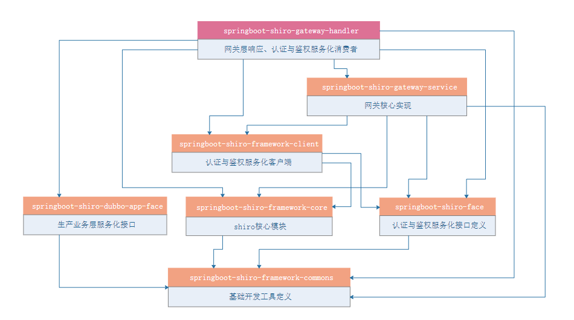

​	1、依赖springboot-shiro-framework-client实现认证、鉴权、过滤器定义、会话统一、realm缓存等功能

​	2、springboot-shiro-mgt管理后台持久化网关资源

​	3、springboot-shiro-handler实现网关资源查询服务化

​	4、gateway-service依据持久化的网关资源，动态创建消费端服务

#### 【2】代码实现

##### 【2.1】网关资源持久化

这里在原有资源的基础上，增加的网关资源的管理：

​		1、定义网关systemcode，用以区分不同网关系统

​		2、定义访问的路径

​		3、定义资源的唯一标识，作为权限控制的标识

​		4、定义业务端dubbo服务端接口、目标方法、传入阐述、轮训算法、超时时间、重试次数等参数，这些内容会在gateway-service项目中解析

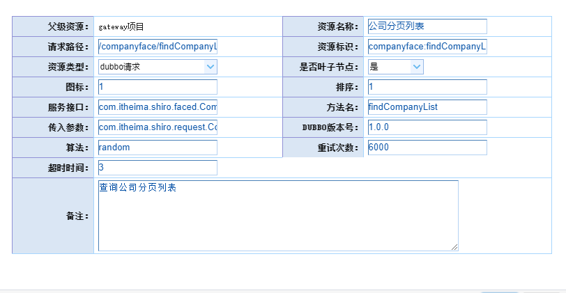


##### 【2.2】网关资源服务化

```properties
ResourceAdapterFace:网关资源服务接口
ResourceAdapterFaceImpl:网关资源服务接口实现

ResourceBridgeService:网关资源桥接器接口
ResourceBridgeServiceImpl:网关资源桥接器接口实现
```

ResourceAdapterFace

```java
package com.itheima.shiro.face;

import com.itheima.shiro.vo.ResourceVo;

import java.util.List;

/**
 * @Description：网关资源服务接口
 */
public interface ResourceAdapterFace {

    /**
     * @Description 获得当前系统是由有效的dubbo的资源
     */
    List<ResourceVo> findValidResourceVoAll(String systemCode);
}

```

ResourceAdapterFaceImpl

```java
package com.itheima.shiro.faceImpl;

import com.itheima.shiro.face.ResourceAdapterFace;
import com.itheima.shiro.pojo.Resource;
import com.itheima.shiro.service.ResourceService;
import com.itheima.shiro.utils.BeanConv;
import com.itheima.shiro.utils.EmptyUtil;
import com.itheima.shiro.vo.ResourceVo;
import org.apache.dubbo.config.annotation.Service;
import org.springframework.beans.factory.annotation.Autowired;

import java.util.List;

/**
 * @Description：网关资源服务接口实现
 */
@Service(version = "1.0.0", retries = 3,timeout = 5000)
public class ResourceAdapterFaceImpl implements ResourceAdapterFace {

    @Autowired
    ResourceService resourceService;

    @Override
    public List<ResourceVo> findValidResourceVoAll(String systemCode) {
        List<Resource> resourceList =  resourceService.findValidResourceVoAll(systemCode);
        if (!EmptyUtil.isNullOrEmpty(resourceList)){
            return BeanConv.toBeanList(resourceList, ResourceVo.class);
        }
        return  null;
    }
}

```

ResourceBridgeService

```java
package com.itheima.shiro.core.bridge;

import com.itheima.shiro.vo.ResourceVo;

import java.util.List;

/**
 * @Description：网关资源桥接器接口
 */
public interface ResourceBridgeService {

    /**
     * @Description 查询当前系统所有有效的DUBBO类型的服务
     * @param systemCode 系统编号：与mgt添加系统编号相同
     * @return
     */
    public List<ResourceVo> findValidResourceVoAll(String systemCode);
}

```

ResourceBridgeServiceImpl

```java
package com.itheima.shiro.client;

import com.itheima.shiro.core.bridge.ResourceBridgeService;
import com.itheima.shiro.face.ResourceAdapterFace;
import com.itheima.shiro.vo.ResourceVo;
import org.apache.dubbo.config.annotation.Reference;
import org.springframework.beans.factory.annotation.Value;
import org.springframework.stereotype.Component;

import java.util.List;

/**
 * @Description：网关资源桥接器接口实现
 */
@Component("resourceBridgeService")
public class ResourceBridgeServiceImpl implements ResourceBridgeService {

    @Value("${itheima.resource.systemcode}")
    private String systemCode;

    @Reference(version = "1.0.0")
    ResourceAdapterFace resourceAdapterFace;

    @Override
    public List<ResourceVo> findValidResourceVoAll(String systemCode) {
        return resourceAdapterFace.findValidResourceVoAll(systemCode);
    }
}

```


##### 【2.3】动态消费端

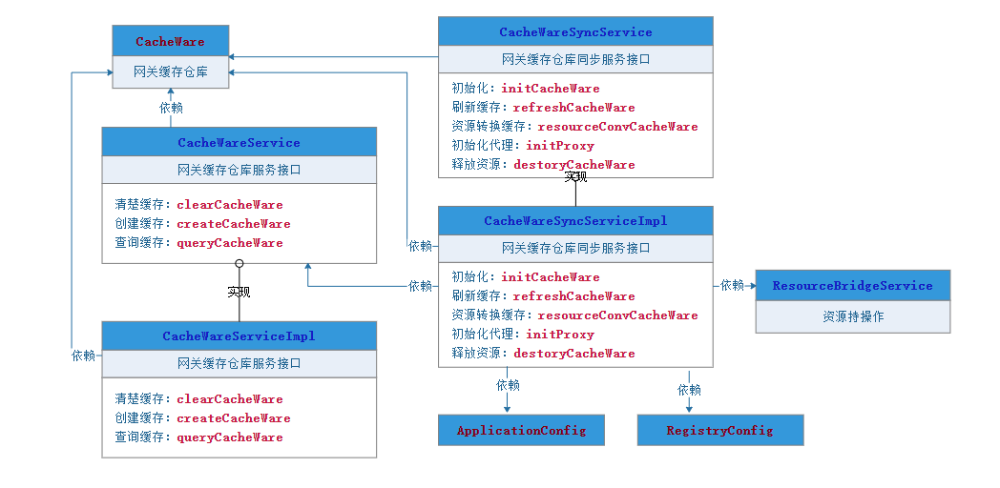

```properties
CacheWare:缓存仓库

CacheWareService:缓存仓库服务接口
CacheWareServiceImpl:缓存仓库服务接口实现

CacheWareSyncService:缓存仓库同步服务接口
CacheWareSyncServiceImpl:缓存仓库同步服务接口实现

LoginAction:登录相应接口
GateWayController:相应层的统一入口
```


###### 【2.3.1】CacheWareService

其主要负责：

1、缓存的清除

2、向map容器中创建缓存

3、获得缓存仓库执行对象

```java
package com.itheima.shiro.cache;

import com.google.common.collect.Multimap;
import com.itheima.shiro.pojo.CacheWare;

/**
 * @Description：缓存仓库服务
 */
public interface CacheWareService {

    /**
     * @Description 清除缓存
     */
    void clearCacheWare();

    /**
     * @Description 向map容器中创建缓存
     * @param CacheWareMap
     */
    void createCacheWare(Multimap<String, CacheWare> CacheWareMap);

    /**
     * @Description 获得缓存仓库执行对象
     * @param serviceName 服务名
     * @param methodName  方法名
     * @return {@link CacheWare}
     *
     */
    CacheWare queryCacheWare(String serviceName, String methodName);


}


```

CacheWareServiceImpl

```java
package com.itheima.shiro.cache.impl;

import com.google.common.collect.ArrayListMultimap;
import com.google.common.collect.Multimap;
import com.itheima.shiro.cache.CacheWareService;
import com.itheima.shiro.pojo.CacheWare;
import com.itheima.shiro.utils.EmptyUtil;
import org.springframework.stereotype.Service;

import java.util.Collection;
import java.util.concurrent.locks.ReentrantLock;

/**
 * @Description：
 */
@Service("cacheWareService")
public class CacheWareServiceImpl implements CacheWareService {

    private Multimap<String, CacheWare> cacheWareMaps = ArrayListMultimap.create();

    /**
     * 数据锁
     */
    private static ReentrantLock reentrantLock = new ReentrantLock();


    @Override
    public void clearCacheWare() {
        try {
            reentrantLock.lock();
            cacheWareMaps.clear();
        } finally {
            reentrantLock.unlock();
        }
    }


    @Override
    public void createCacheWare(Multimap<String, CacheWare> CacheWareMap) {
        try {
            reentrantLock.lock();
            this.cacheWareMaps = CacheWareMap;
        } finally {
            reentrantLock.unlock();
        }
    }

    @Override
    public CacheWare queryCacheWare(String serviceName, String methodName) {
        if (EmptyUtil.isNullOrEmpty(serviceName) || EmptyUtil.isNullOrEmpty(serviceName)) {
            return null;
        }
        StringBuffer serviceNameStringBuffer = new StringBuffer(serviceName);
        StringBuffer methodNameStringBuffer = new StringBuffer(methodName);
        String key = serviceNameStringBuffer.append(":").append(methodName).toString();
        Collection<CacheWare> cacheWares = cacheWareMaps.get(key);
        return EmptyUtil.isNullOrEmpty(cacheWares) ? null : cacheWares.iterator().next();
    }

}


```

###### 【2.3.2】CacheWareSyncService

其主要职责：

1、启动时、调用CacheWareService的创建缓存方法初始化缓存仓库

2、同步缓存仓库

3、网关资源转化缓存仓库可执行对象

4、从dubbo中，初始化代理对象

注意：为了在多个网关系统下，接口转换的无干扰，读取的只是本网关所对应的资源

```java
package com.itheima.shiro.cache;

import com.itheima.shiro.pojo.CacheWare;
import com.itheima.shiro.vo.ResourceVo;

/**
 * @Description：缓存仓库同步刷新
 */
public interface CacheWareSyncService {

    /**
     * @Description 初始化缓存仓库
     */
    void initCacheWare();

    /**
     * @Description 同步缓存仓库
     */
    void refreshCacheWare();

    /**
     * @Description 资源转换缓存仓库对象
     */
    CacheWare resourceConvCacheWare(ResourceVo resource);

    /**
     * @Description 初始化代理对象
     * @param interfaceClass 接口
     * @param loadbalance 算法
     * @param version 版本
     * @param timeout 超时时间
     * @param retries 重试次数
     */
    Object initProxy(Class<?> interfaceClass,
                     String loadbalance,
                     String version,
                     Integer timeout,
                     Integer retries);

    /**
     * @Description 回收资源
     */
    void destoryCacheWare();
}


```

CacheWareSyncServiceImpl

```java
package com.itheima.shiro.cache.impl;

import com.google.common.collect.ArrayListMultimap;
import com.google.common.collect.Multimap;
import com.itheima.shiro.cache.CacheWareService;
import com.itheima.shiro.cache.CacheWareSyncService;
import com.itheima.shiro.core.bridge.ResourceBridgeService;
import com.itheima.shiro.face.ResourceAdapterFace;
import com.itheima.shiro.pojo.CacheWare;
import com.itheima.shiro.utils.EmptyUtil;
import com.itheima.shiro.vo.ResourceVo;
import lombok.extern.log4j.Log4j2;
import org.apache.dubbo.config.ApplicationConfig;
import org.apache.dubbo.config.ReferenceConfig;
import org.apache.dubbo.config.RegistryConfig;
import org.apache.dubbo.config.annotation.Reference;
import org.apache.dubbo.config.utils.ReferenceConfigCache;
import org.springframework.beans.factory.annotation.Autowired;
import org.springframework.beans.factory.annotation.Value;
import org.springframework.stereotype.Service;
import org.springframework.util.CollectionUtils;

import javax.annotation.PostConstruct;
import javax.annotation.PreDestroy;
import java.lang.reflect.Method;
import java.util.List;
import java.util.concurrent.Executors;
import java.util.concurrent.ScheduledExecutorService;
import java.util.concurrent.TimeUnit;

/**
 * @Description：
 */
@Service("cacheWareSyncService")
@Log4j2
public class CacheWareSyncServiceImpl implements CacheWareSyncService {

    @Value("${itheima.resource.systemcode}")
    private String systemCode;

    @Autowired
    ResourceBridgeService resourceBridgeService;

    @Autowired
    CacheWareService cacheWareService;

    @Autowired
    private ApplicationConfig applicationConfig;

    @Autowired
    private RegistryConfig registryConfig;

    private ScheduledExecutorService executor = Executors.newScheduledThreadPool(1);


    @Override
    @PostConstruct
    public void initCacheWare() {
        executor.scheduleAtFixedRate(new Runnable() {
            @Override
            public void run() {
                try {
                    refreshCacheWare();
                } catch (Exception e) {
                    log.error(e.getMessage(), e);
                }
            }
        }, 0, 2, TimeUnit.MINUTES);
    }

    @Override
    public void refreshCacheWare()  {
        List<ResourceVo> resources = resourceBridgeService.findValidResourceVoAll(systemCode);
        //如果当前系统没有资源，则清空
        if (CollectionUtils.isEmpty(resources)) {
            log.warn("No apis can be used.");
            cacheWareService.clearCacheWare();
            return;
        }
        //构建执行集合
        Multimap<String, CacheWare> cacheWareMaps = ArrayListMultimap.create();
        for (ResourceVo resource : resources) {
            if (EmptyUtil.isNullOrEmpty(resource.getServiceName())
            ||EmptyUtil.isNullOrEmpty(resource.getMethodName())){
                log.warn("{} not found serviceName or methodName",resources.toString());
                continue;
            }
            CacheWare cacheWare = resourceConvCacheWare(resource);
            if (!EmptyUtil.isNullOrEmpty(cacheWare)){
                cacheWareMaps.put(cacheWare.getServiceName()+":"+cacheWare.getMethodName(), cacheWare);
            }
        }
        cacheWareService.createCacheWare(cacheWareMaps);
    }

    @Override
    public CacheWare resourceConvCacheWare(ResourceVo resource)  {
        //获得类型
        Class<?> serviceClass = null;
        try {
            serviceClass = Class.forName(resource.getServiceName());
        } catch (ClassNotFoundException e) {
            log.error("容器中未发现：{}接口类",resource.getServiceName());
            return null;
        }
        String serviceName = resource.getServiceName().substring(resource.getServiceName().lastIndexOf(".")+1).toLowerCase();
        Method[] methods = serviceClass.getDeclaredMethods();
        Method methodTarget = null;
        //获得方法
        for (Method method : methods) {
            if (method.getName().equals(resource.getMethodName())) {
                methodTarget = method;
                break;
            }
        }
        // 未在接口类中找到方法
        if (methodTarget == null) {
            log.warn("{} not found in {}", resource.getMethodName(), resource.getServiceName());
            return null;
        }
        //获得方法上的参数
        Class<?>[] methodParamsClasss = methodTarget.getParameterTypes();
        Class<?> methodParamClasssTarget = null;
        for (Class<?> methodParamsClass : methodParamsClasss) {
            if (methodParamsClass.getName().equals(resource.getMethodParam())) {
                methodParamClasssTarget = methodParamsClass;
                break;
            }
        }
        //初始化代理类
        Object proxy = initProxy(serviceClass, resource.getLoadbalance(), resource.getDubboVersion(), resource.getTimeout(), resource.getRetries());
        if (proxy == null) {
            log.warn("{} not found in proxy", resource.getServiceName());
            return null;
        }
       	//构建CacheWare对象
        CacheWare cacheWare = CacheWare.builder()
                .serviceName(serviceName)
                .methodName(resource.getMethodName())
                .method(methodTarget)
                .methodParamsClass(methodParamClasssTarget)
                .proxy(proxy)
                .build();
        return cacheWare;
    }

    @Override
    public Object initProxy(Class<?> interfaceClass,
                            String loadbalance,
                            String version,
                            Integer timeout,
                            Integer retries) {
        ReferenceConfig<Object> reference = new ReferenceConfig<Object>();
        reference.setApplication(applicationConfig);
        reference.setRegistry(registryConfig);
        reference.setLoadbalance(EmptyUtil.isNullOrEmpty(loadbalance)?"random":loadbalance);
        reference.setInterface(interfaceClass);
        reference.setVersion(version);
        reference.setTimeout(EmptyUtil.isNullOrEmpty(timeout)?20000:timeout);
        reference.setCheck(false);
        reference.setRetries(EmptyUtil.isNullOrEmpty(retries)?0:retries);
        ReferenceConfigCache cache = ReferenceConfigCache.getCache();
        return cache.get(reference);
    }

    @Override
    @PreDestroy
    public void destoryCacheWare() {
        executor.shutdownNow();
    }
}


```

##### 【2.4】网关资源解析

其主要负责：

1、传入参数处理

2、获得可执行缓存仓库

3、执行远程服务

4、处理返回结果

```java
package com.itheima.shiro.web;

import com.alibaba.fastjson.JSON;
import com.alibaba.fastjson.JSONObject;
import com.itheima.shiro.base.BaseRequest;
import com.itheima.shiro.cache.CacheWareService;
import com.itheima.shiro.constant.GateWayConstant;
import com.itheima.shiro.pojo.CacheWare;
import com.itheima.shiro.response.MultiResponse;
import com.itheima.shiro.response.PageResponse;
import com.itheima.shiro.response.SingleResponse;
import com.itheima.shiro.utils.EmptyUtil;
import com.itheima.shiro.view.JsonResult;
import lombok.extern.log4j.Log4j2;
import org.springframework.beans.BeanUtils;
import org.springframework.beans.factory.annotation.Autowired;
import org.springframework.stereotype.Controller;
import org.springframework.web.bind.annotation.*;

import javax.servlet.http.HttpServletRequest;
import javax.websocket.server.PathParam;
import java.lang.reflect.Method;

/**
 * @Description：网关统一入口
 */
@Controller
@Log4j2
public class GateWayController {

    @Autowired
    CacheWareService cacheWareService;


    @RequestMapping(value = "{serviceName}/{methodName}", method = RequestMethod.POST)
    @ResponseBody
    public JsonResult postGateWay(@PathVariable("serviceName") String serviceName,
                                  @PathVariable("methodName") String methodName,
                                  @RequestBody BaseRequest baseRequest) throws Exception {
        Object datas = baseRequest.getDatas();
        JsonResult jsonResult = null;
        if (EmptyUtil.isNullOrEmpty(serviceName)||EmptyUtil.isNullOrEmpty(methodName)){
            jsonResult = JsonResult.builder()
                    .result(GateWayConstant.FAIL)
                    .msg("参数缺失")
                    .code(GateWayConstant.PARAMETERS_MISSING)
                    .build();
            return jsonResult;
        }
        //1、传入参数处理
        JSONObject datasJson = null;
        if (!EmptyUtil.isNullOrEmpty(datas)){
            datasJson = JSONObject.parseObject(JSONObject.toJSONString(datas));
        }
        //2、获得可执行缓存仓库可执行对象
        CacheWare cacheWare = cacheWareService.queryCacheWare(serviceName, methodName);
        if (EmptyUtil.isNullOrEmpty(serviceName)||EmptyUtil.isNullOrEmpty(methodName)){
            jsonResult = JsonResult.builder()
                    .result(GateWayConstant.FAIL)
                    .msg("请求链接异常")
                    .code(GateWayConstant.URL_MISSING)
                    .build();
            return jsonResult;
        }
        //3、执行远程服务
        Object proxy = cacheWare.getProxy();
        Method method = cacheWare.getMethod();
        Class<?> methodParamsClass = cacheWare.getMethodParamsClass();
        Object result;
        if (EmptyUtil.isNullOrEmpty(methodParamsClass)){
            result = method.invoke(proxy);
        }else {
            Object arguments = JSONObject.toJavaObject(datasJson, methodParamsClass);
            result = method.invoke(proxy,arguments);
        }
        //4、处理返回结果
        return convResult(result);
    }

    /**
     * @Description 处理请求结果
     */
    private JsonResult convResult(Object result) {
        JsonResult jsonResult = JsonResult.builder()
                .result(GateWayConstant.SUCCEED)
                .msg("相应正常")
                .code(GateWayConstant.SUCCEED_CODE)
                .build();
        if (EmptyUtil.isNullOrEmpty(result)) {
            jsonResult = JsonResult.builder()
                    .result(GateWayConstant.FAIL)
                    .msg("返回结果为空")
                    .code(GateWayConstant.RESULT_ISNULLOREMPTY)
                    .build();
            return jsonResult;
        }
        if (result instanceof SingleResponse) {
            BeanUtils.copyProperties(result, jsonResult);
            @SuppressWarnings("rawtypes")
            SingleResponse singleResponse = (SingleResponse) result;
            jsonResult.setDatas(singleResponse.getValue());
        } else if (result instanceof MultiResponse) {
            BeanUtils.copyProperties(result, jsonResult);
            @SuppressWarnings("rawtypes")
            MultiResponse multiResponse = (MultiResponse) result;
            jsonResult.setDatas(multiResponse.getValues());
        } else if (result instanceof PageResponse) {
            BeanUtils.copyProperties(result, jsonResult);
            PageResponse pageResponse = (PageResponse)result;
            jsonResult.setDatas( pageResponse.getValues());
        } else {
            jsonResult = JsonResult.builder()
                    .result(GateWayConstant.FAIL)
                    .msg("返回结果格式不正确")
                    .code(GateWayConstant.RESULT_MISSING)
                    .build();
            return jsonResult;
        }
        return jsonResult;
    }
}

```

### 7、shiro-mgt管理平台

#### 【1】模块依赖关系

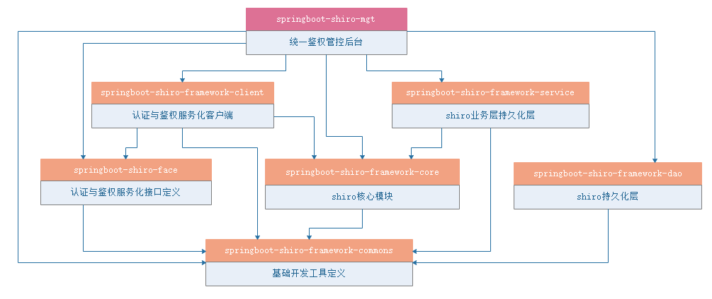

#### 【2】原理分析

​		通过上面的模块依赖关系，我们可以看出，shiro-mgt管理平台也是依赖springboot-shiro-framework-client项目实现权限的校验，而他本身主要是负责对角色、资源、用户、过滤器链的CRUD，来实现各个网关平台的权限控制。

资源：


1、定义了网关systemcode，用以区分不同网关、系统

2、定义了访问的路径

3、定义了资源的唯一标识，作为过滤器过滤的标记

4、定义dubbo服务端接口的解析、同时为每个服务定义：轮训算法、超时时间、重试次数等参数，这些参数会在shiro-gateway中解析

角色：

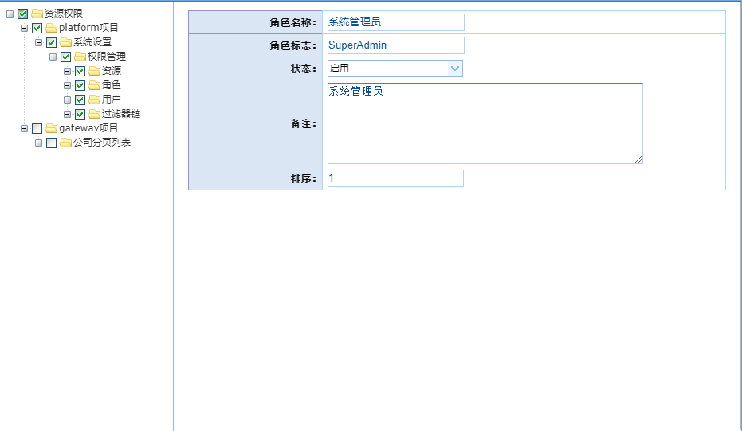

1、定义角色的唯一标识，作为过滤器过滤的标记

2、为角色定义多个资源

用户：

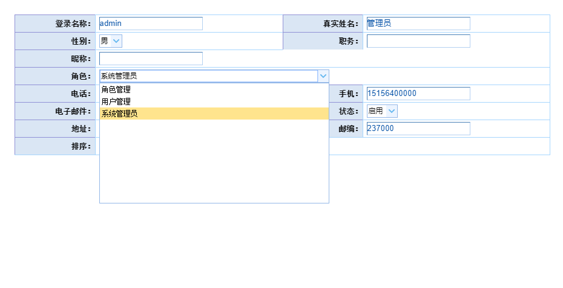

1、用户基本信息

2、为用户定义多个角色

过滤器链：

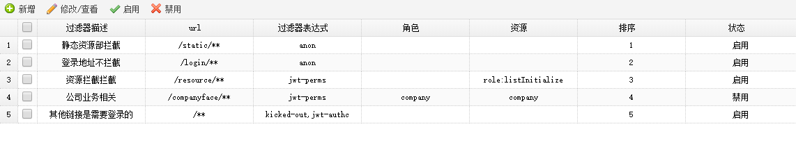

1、为所有系统定义统一的过滤器链路管理（可以扩展：按资源类型那样为每个网关系统定义过滤器链）

2、保证过滤器器链的有序性


