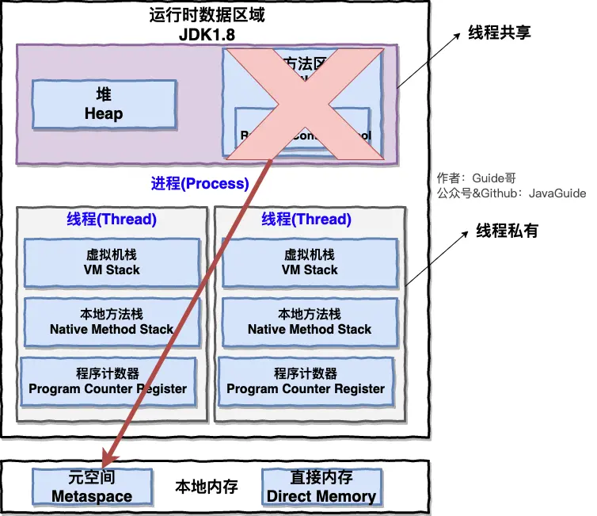

# 

# 写在前面

比较重要的操作系统相关的问题如**进程管理、内存管理、虚拟内存**等等。

关于如何学习操作系统，推荐这篇回答：https://www.zhihu.com/question/270998611/answer/1640198217

# 一、操作系统基础

## 1.1 什么是操作系统

👨‍💻**面试官** ： 先来个简单问题吧！**什么是操作系统？**

🙋 **我** ：我通过以下四点向您介绍一下什么是操作系统吧！

1. **操作系统（Operating System，简称 OS）是管理计算机硬件与软件资源的程序，是计算机的基石。**
2. **操作系统本质上是一个运行在计算机上的软件程序 ，用于管理计算机硬件和软件资源。** 举例：运行在你电脑上的所有应用程序都通过操作系统来调用系统内存以及磁盘等等硬件。
3. **操作系统存在屏蔽了硬件层的复杂性。** 操作系统就像是硬件使用的负责人，统筹着各种相关事项。
4. **操作系统的内核（Kernel）是操作系统的核心部分，它负责系统的内存管理，硬件设备的管理，文件系统的管理以及应用程序的管理**。 内核是连接应用程序和硬件的桥梁，决定着系统的性能和稳定性。

# 二、进程和线程

## 2.1 进程和线程的区别

👨‍💻**面试官**: 好的！我明白了！那你再说一下： **进程和线程的区别**。

🙋 **我：** 好的！ 下图是 Java 内存区域，我们从 JVM 的角度来说一下线程和进程之间的关系吧！

从上图可以看出：一个进程中可以有多个线程，多个线程共享进程的**堆**和**方法区 (JDK1.8 之后的元空间)资源，但是每个线程有自己的程序计数器**、**虚拟机栈** 和 **本地方法栈**。

总结一下：

- 线程是进程划分成的**更小的运行单位**,一个进程在其执行的过程中可以产生多个线程。

- 线程和进程最大的不同在于基本上**各进程是独立的，而各线程则不一定**，因为同一进程中的线程极有可能会相互影响。
- 线程**执行开销小**，但不利于资源的管理和保护；而进程正相反。

##  2.6 什么是死锁

👨‍💻**面试官** ：**你知道什么是死锁吗?**

🙋 **我** ：死锁描述的是这样一种情况：多个进程/线程同时被阻塞，它们中的一个或者全部都在等待某个资源被释放。由于进程/线程被无限期地阻塞，因此程序不可能正常终止。

##  2.7 死锁的四个条件

👨‍💻**面试官** ：**产生死锁的四个必要条件是什么?**

🙋 **我** ：如果系统中以下四个条件同时成立，那么就能引起死锁：

- **互斥**：资源必须处于非共享模式，即一次只有一个进程可以使用。如果另一进程申请该资源，那么必须等待直到该资源被释放为止。
- **占有并等待**：一个进程至少应该占有一个资源，并等待另一资源，而该资源被其他进程所占有。
- **非抢占**：资源不能被抢占。只能在持有资源的进程完成任务后，该资源才会被释放。
- **循环等待**：有一组等待进程 `{P0, P1,..., Pn}`， `P0` 等待的资源被 `P1` 占有，`P1` 等待的资源被 `P2` 占有，......，`Pn-1` 等待的资源被 `Pn` 占有，`Pn` 等待的资源被 `P0` 占有。

注意，只有四个条件同时成立时，死锁才会出现。

# 三、操作系统内存管理基础

## 3.1 内存管理介绍

👨‍💻 **面试官**: **操作系统的内存管理主要是做什么？**

🙋 **我：** 操作系统的内存管理主要负责内存的分配与回收（malloc 函数：申请内存，free 函数：释放内存），另外地址转换也就是将逻辑地址转换成相应的物理地址等功能也是操作系统内存管理做的事情。

## 3.5 逻辑(虚拟)地址和物理地址

👨‍💻**面试官** ：你刚刚还提到了**逻辑地址和物理地址**这两个概念，我不太清楚，你能为我解释一下不？

🙋 **我：** em...好的嘛！我们编程一般只有可能和逻辑地址打交道，比如在 C 语言中，指针里面存储的数值就可以理解成为内存里的一个地址，这个地址也就是我们说的逻辑地址，逻辑地址由操作系统决定。物理地址指的是真实物理内存中地址，更具体一点来说就是内存地址寄存器中的地址。物理地址是内存单元真正的地址。

# 四、虚拟内存

## 4.1 什么是虚拟内存(Virtual Memory)?

👨‍💻**面试官** ：再问你一个常识性的问题！**什么是虚拟内存(Virtual Memory)?**

🙋 **我** ：这个在我们平时使用电脑特别是 Windows 系统的时候太常见了。很多时候我们使用了很多占内存的软件，这些软件占用的内存可能已经远远超出了我们电脑本身具有的物理内存。**为什么可以这样呢？** 正是因为 **虚拟内存** 的存在，通过 **虚拟内存** 可以让程序可以拥有超过系统物理内存大小的可用内存空间。另外，**虚拟内存为每个进程提供了一个一致的、私有的地址空间，它让每个进程产生了一种自己在独享主存的错觉（每个进程拥有一片连续完整的内存空间）**。这样会更加有效地管理内存并减少出错。

**虚拟内存**是计算机系统内存管理的一种技术，我们可以手动设置自己电脑的虚拟内存。不要单纯认为虚拟内存只是“使用硬盘空间来扩展内存“的技术。**虚拟内存的重要意义是它定义了一个连续的虚拟地址空间**，并且 **把内存扩展到硬盘空间**。推荐阅读：[《虚拟内存的那点事儿》](https://juejin.im/post/59f8691b51882534af254317)

## 4.2 局部性原理

👨‍💻**面试官** ：要想更好地理解虚拟内存技术，必须要知道计算机中著名的**局部性原理**。另外，局部性原理既适用于程序结构，也适用于数据结构，是非常重要的一个概念。

🙋 **我** ：局部性原理是虚拟内存技术的基础，正是因为程序运行具有局部性原理，才可以只装入部分程序到内存就开始运行。

局部性原理表现在以下两个方面：

1. **时间局部性** ：如果程序中的某条指令一旦执行，不久以后该指令可能再次执行；如果某数据被访问过，不久以后该数据可能再次被访问。产生时间局部性的典型原因，是由于在程序中存在着大量的循环操作。
2. **空间局部性** ：一旦程序访问了某个存储单元，在不久之后，其附近的存储单元也将被访问，即程序在一段时间内所访问的地址，可能集中在一定的范围之内，这是因为指令通常是顺序存放、顺序执行的，数据也一般是以向量、数组、表等形式簇聚存储的。

# Reference

- 《计算机操作系统—汤小丹》第四版
- [《深入理解计算机系统》](https://book.douban.com/subject/1230413/)
- [https://zh.wikipedia.org/wiki/输入输出内存管理单元](https://zh.wikipedia.org/wiki/输入输出内存管理单元)
- [https://baike.baidu.com/item/快表/19781679](https://baike.baidu.com/item/快表/19781679)
- https://www.jianshu.com/p/1d47ed0b46d5
- [https://www.studytonight.com/operating-system](https://www.studytonight.com/operating-system)
- [https://www.geeksforgeeks.org/interprocess-communication-methods/](https://www.geeksforgeeks.org/interprocess-communication-methods/)
- [https://juejin.im/post/59f8691b51882534af254317](https://juejin.im/post/59f8691b51882534af254317)
- 王道考研操作系统知识点整理： https://wizardforcel.gitbooks.io/wangdaokaoyan-os/content/13.html

