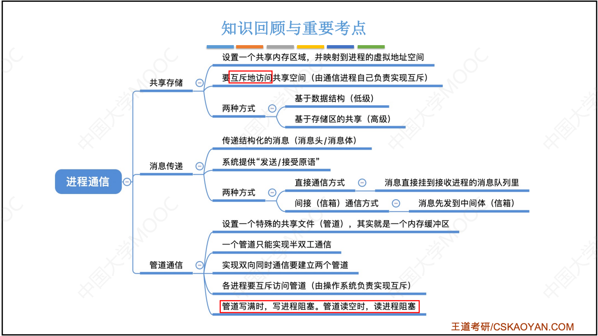

# 计算机系统概述

## 1 操作系统的概念（定义）、功能

本节思维导图


### 1.1 操作系统的概念（定义）

操作系统（Operating System, OS）是指控制和管理整个计算机系统的硬件与软件资源，合理地组织、调度计算机的工作与资源的分配，进而为用户和其它软件提供方便接口与环境的程序集合。操作系统是计算机系统中最基本的系统软件。

<br/>

理解：

① 操作系统是系统资源的管理者;

② 向上层提供方便易用的服务（封装思想）;

③ 是最接近硬件的一层软件。

<br/>

脱机命令接口

联机命令接口=批处理命令接口

程序接口：程序中使用**系统调用**来请求操作系统为其提供服务。普通用户不能直接使用系统接口，只能通过程序代码**间接**调用。

> 系统调用（广义指令）类似于函数调用，是应用程序请求操作系统服务的唯一方式。


### 1.2 功能和目标

#### 资源的管理者（重点）

处理机管理、存储器管理、文件管理、设备管理

#### 向上层提供方便易用的服务

- 直接给用户使用的
  - GUI（图形用户界面）
  - 命令接口（用户可以直接使用）：联机命令接口、脱机命令接口
- 给软件/程序员使用的
  - 程序接口，即系统调用，用户通过程序间接使用。

#### 对硬件机器的扩展


## 2 操作系统的特征

并发和共享是两个最基本的特征，二者互为存在条件。

<br/>

### 并发

并发：指同一时间间隔内发生。宏观上同时发生，微观上交替发生。

并行：指多个事件同一时刻发生。


操作系统的并发性：计算机系统中的多个程序，宏观上同时运行，微观上交替运行。

```sh
单核CPU 同一时刻只能执行一个程序，各个程序只能并发地执行。
多核CPU 同一时刻可以同时执行多个程序，多个程序可以并行执行。
```


### 共享

即资源共享，指系统中的资源可供内存中多个并发执行的进程共同使用。

分互斥共享（QQ和微信视频，摄像头同一时间段内只能分配给其中一个进程）和同时共享（QQ发送文件A，微信发送文件B）。


### 虚拟

指一个物理上的实体变为若干个逻辑上的对应物。 

分为空分复用技术和时分复用技术。

### 异步

在多道程序环境下，允许多个程序并发执行，但由于资源有限，进程的执行不是一贯到底的，而是走走停停，以不可预知的速度推进，这就是进程的异步性。

只有系统拥有并发性，才有可能导致异步性。


## 3 操作系统的发展与分类

> 重点关注各类操作系统主要想解决什么问题，优缺点。

| 阶段               | 特点                                                         | 缺点                                                         | 优点                                                         |
| ------------------ | ------------------------------------------------------------ | ------------------------------------------------------------ | ------------------------------------------------------------ |
| 手工操作阶段       | 纸带机、计算机、结果输出纸带机                               | 用户独占全机、人机速度矛盾导致资源利用率极低                 |                                                              |
| 【单道】批处理阶段 | 脱机输入/输出技术、监督程序                                  | 内存中仅能有一道程序运行，CPU大量时间是在等待空闲I/O完成，资源利用率依然很低。 | 缓解了一定程度的人机速度矛盾、<br/>资源利用率有所提升        |
| 【多道】批处理阶段 | 每次忘内存中读入多道程序<br/>操作系统诞生                    | 用户响应时间长，没有人机交互功能。                           | 多道程序并发执行，共享计算机资源，资源利用率大幅提升。CPU和其它资源能保持忙碌状态，系统吞吐量增大。 |
| 分时操作系统       | 以时间片为单位轮流为各个用户/作业服务，各用户可通过终端与计算机进行交互。 | 不能优先处理一些紧急任务（完全公平）                         | 用户请求可及时响应（解决了人机交互问题）                     |
| 实时操作系统       | 及时性和可靠性，分为硬实时系统和软实时系统                   |                                                              | 可优先响应一些紧急任务（不需时间片排队）                     |


## 4 操作系统的运行机制


处于内核态（核心态/管态）时，说明此时正在运行的是内核程序，此时可以执行特权指令。

处于用户态（目态）时，说明此时正在运行的是应用程序，此时只能执行非特权指令。


## 5 中断和异常


## 6 系统调用


## 7 操作系统体系结构


## 8 操作系统引导

## 9 虚拟机


# 进程与线程

## 1 进程与线程


### 进程的状态与转换


### 进程控制


### 进程的通信IPC





### 线程和多线程模型


## 2 处理机调度


## 3 同步与互斥

## 4 死锁


# 内存管理


## 1 内存管理概念

## 2 虚拟内存管理


# 文件管理

## 文件系统基础

## 目录

## 文件系统


# I/O（输入/输出）管理

## IO管理概述

## 设备独立性软件

## 磁盘和固态硬盘

