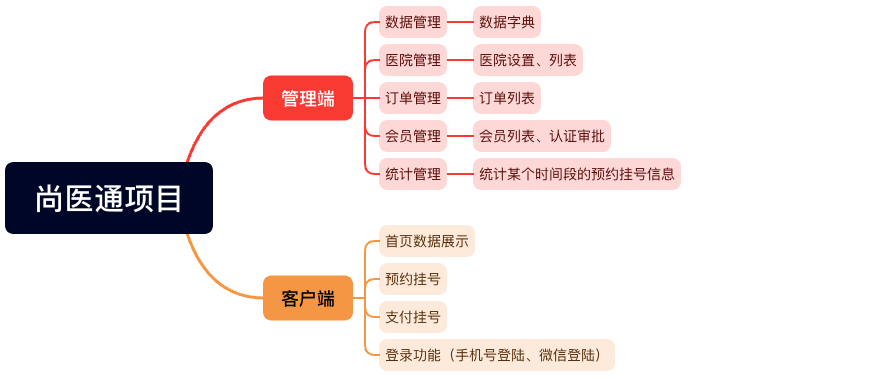
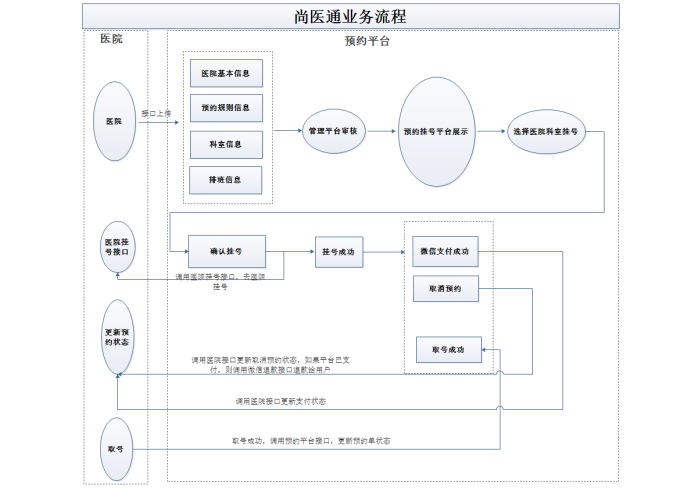
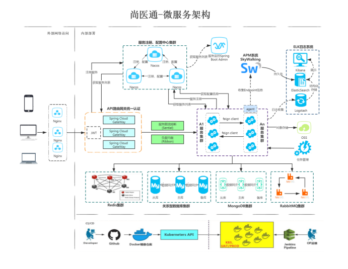

✔️P1-项目概述

- JavaSE
- JavaWEB
- SSM
- 框架高级：SpringBoot、SpringCloud、redis、mq、Linux、git...

✔️P2-项目模块介绍



✔️P3-项目技术和架构

| 技术         | 概述                        | 其它 |
| ------------ | --------------------------- | ---- |
| SpringBoot   | 简化Spring应用开发          |      |
| SpringCloud  | Gateway、Nacos、Fegin、Task |      |
| Mybatis-Plus | 持久层框架                  |      |
| Redis        | 内存缓存                    |      |
| RabbitMQ     | 消息中间件                  |      |
| HTTPClient   | HTTP协议客户端              |      |
| Swagger2     | API接口文档                 |      |
| Nginx        | 负载均衡                    |      |
| Lombok       |                             |      |
| MySQL        | 关系型数据库                |      |
| MongoDB      | 面向文档的NoSQL数据库       |      |
|              |                             |      |


| 技术    | 概述                | 其它 |
| ------- | ------------------- | ---- |
| Vue.js  | web界面的渐进式框架 |      |
| Node.js | JS运行环境          |      |
| Axiso   | HTTP库              |      |
| NPM     | 包管理器            |      |
| bable   | 转码器              |      |
| webpack | 打包工具            |      |
|         |                     |      |


| 技术       |                        |      |
| ---------- | ---------------------- | ---- |
| docker     | 容器技术               |      |
| git        | 代码管理工具           |      |
| dockerfile | 管理docker镜像命令文本 |      |
| jenkins    | 持续集成工具           |      |


业务流程




微服务架构（架构图后续自己画一下）




✔️P4-MybatisPlus

官网：https://baomidou.com/pages/223848/

Mybatis 的增强工具，只做增强不做改变。简化开发，提高效率。


✔️P5-MybatisPlus-添加主键策略

```java
@TableId
```


✔️P6-MybatisPlus-修改和自动填充

- 注解填充字段 `@TableField(.. fill = FieldFill.INSERT)` 生成器策略部分也可以配置！

```java
@TableField(fill=Field.INSERT)
private Data createTime;
```

- 实现元对象处理器接口：com.baomidou.mybatisplus.core.handlers.MetaObjectHandler
- 自定义实现类 MyMetaObjectHandler


✔️P7-MybatisPlus-乐观锁

实现线程安全的数据更新。具体实现见官方介绍。

> - 取出记录时，获取当前 version
> - 更新时，带上这个 version
> - 执行更新时， set version = newVersion where version = oldVersion
> - 如果 version 不对，就更新失败


✔️P8-MybatisPlus-简单查询

- id 批量查询
- 简单的条件查询
- 分页查询
  - 配置分页插件
  - page 分页查询

```java
// 查询（根据ID 批量查询）
List<T> selectBatchIds(@Param(Constants.COLLECTION) Collection<? extends Serializable> idList);

// 根据 entity 条件，查询全部记录
List<T> selectByMap(@Param(Constants.COLUMN_MAP) Map<String, Object> columnMap);

// 根据 entity 条件，查询全部记录（并翻页）
IPage<T> selectPage(IPage<T> page, @Param(Constants.WRAPPER) Wrapper<T> queryWrapper);
```

✔️P9-MybatisPlus-删除

- 根据id删除
- 批量删除
- 简单条件删除
- 逻辑删除

✔️P10-MybatisPlus-条件查询

- AbstractWrapper 是 QueryWrapper(LambdaQueryWrapper) 和 UpdateWrapper(LambdaUpdateWrapper) 的父类
- 用于生成 sql 的 where 条件, entity 属性也用于生成 sql 的 where 条件


✔️P11-前后端概念介绍

前端 ajax 调用后端，后端 json 返回前端。


✔️P12-搭建项目后端环境

✔️P13-提交git仓库

✔️P14-后台系统-医院设置接口


