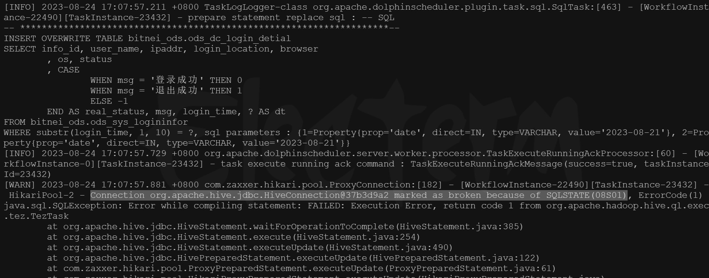
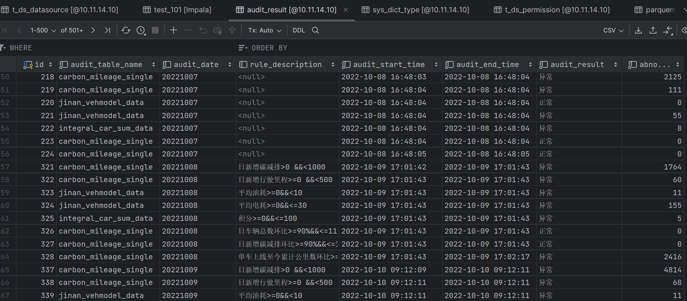
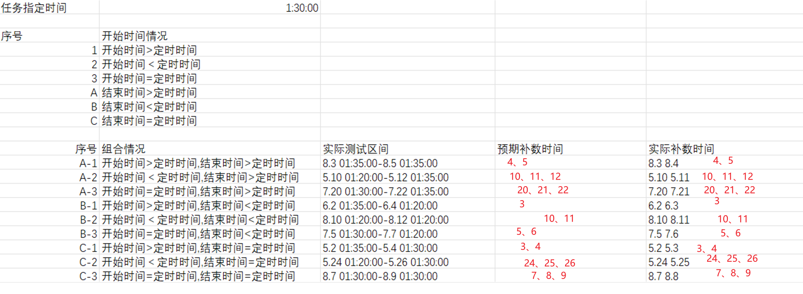
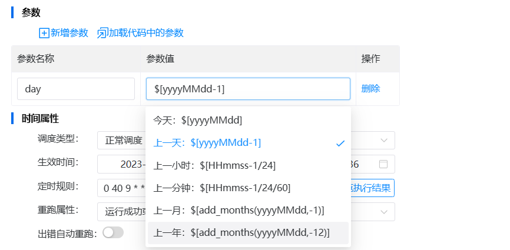

# maven

```sh
mvn clean install package -Dmaven.test.skip=true

mvn clean install package -Dmaven.test.skip=true  -P dev
```


# docker

```sh
#将容器中的文件拷贝出来
sudo docker cp d68be37f3461:/etc/clickhouse-server/users.xml /opt/

#将容器中的文件拷贝回去
sudo docker cp /opt/users.xml  d68be37f3461:/etc/clickhouse-server/


#将容器中的文件拷贝出来
sudo docker cp d68be37f3461:/etc/clickhouse-server/config.xml /opt/

#将容器中的文件拷贝回去
sudo docker cp /opt/config.xml  d68be37f3461:/etc/clickhouse-server/


```


# clickhouse

```sh
clickhouse-client -u default --password default
```


# 数据源

hive、mysql、Tidb、Oracle、clickhouse


- 依赖

```xml
<dependency>
    <groupId>com.oracle</groupId>
    <artifactId>ojdbc8</artifactId>
    <version>8</version>
</dependency>
```


```sh
# 安装 oracle 驱动
mvn install:install-file -DgroupId=com.oracle -DartifactId=ojdbc8 -Dversion=8 -Dpackaging=jar -Dfile=ojdbc-8.jar
```


# 表问题

- 建表时下拉数据库数量问题：列表是从hive底层元数据库获取的，需要t_ds_datasource表存在对应配置才可用（后续改进，是否有必要为每个库配置一条记录）。


# dolphinscheduler 部署

安装路径：/opt/dolphinscheduler/

实际路径：/opt/services/dolphinscheduler/


```
/opt/services/dolphinscheduler
/opt/services/asserts
/opt/services/dolphinExt
/opt/services/nacos
```

# datax

官方地址：https://github.com/alibaba/DataX


# Json

- com.alibaba.fastjson
- com.fasterxml.jackson

## fastjson

`JSONObject ` 是对象的json形式，`JSONArry` 是对象集合的JSON形式。

- JsonObect

```java
public class JSONObject extends JSON implements Map<String, Object>, Cloneable, Serializable, InvocationHandler {
    
    private final Map<String, Object> map;
    
    public JSONObject fluentPut(String key, Object value) {
        map.put(key, value);
        return this;
    }
}
=======
重试
```


## jackson

想要代替FastJson的 `JsonObect`，需要用到 `ObjectNode` 和 `JsonNode`。

如果需要对JSON数据进行修改操作，应该使用ObjectNode类；如果只需要读取JSON数据，可以使用JsonNode类。

- JsonNode：是一个抽象类，不能实例化。

```java
public abstract class JsonNode extends JsonSerializable.Base implements TreeNode, Iterable<JsonNode> {
    
    public JsonNode get(String fieldName);
    public abstract JsonNode get(int var1);
    public abstract String asText();
    
}
```

- ObjectNode：JsonNode的子类，添加了一些操作JSON对象的方法，例如put()、remove()、set()、replace()等。

```java
public class ObjectNode extends ContainerNode<ObjectNode> implements Serializable {
    
    protected final Map<String, JsonNode> _children;
    
    @Deprecated
    public JsonNode put(String propertyName, JsonNode value{
        return _children.put(propertyName, value);
    }
                        
    public JsonNode replace(String propertyName, JsonNode value){
        return _children.put(propertyName, value);
    }
                        
    public <T extends JsonNode> T set(String propertyName, JsonNode value){
        _children.put(propertyName, value);
        return (T) this;
    }
    
}
```

- ArrayNode

```java
public class ArrayNode extends ContainerNode<ArrayNode> implements java.io.Serializable {
    
    private final List<JsonNode> _children;
    
    public ArrayNode(JsonNodeFactory nf) {
        super(nf);
        _children = new ArrayList<JsonNode>();
    }
    
    public ArrayNode add(JsonNode value){
        _children.add(value);
        return this;
    }
    
}
```


- ObjectMapper

```java
JsonNode readTree(String content);

public String writeValueAsString(Object value);
```

生成 JsonNode

```java
ObjectMapper frontObjectMapper = new ObjectMapper();
JsonNode frontJsonNode;
try {
    frontJsonNode = frontObjectMapper.readTree(frontStr);
} catch (JsonProcessingException e) {
    throw new RuntimeException(e);
}
```

生成 ObjectNode、ArrayNode

```java
ObjectNode objectNode = frontObjectMapper.createObjectNode();
	
ArrayNode arrayNode = frontObjectMapper.createArrayNode();
=======
## 一些参数

高可用：cnbjfcysjztnn01、cnbjfcysjztnn02 为hdfs NameNode节点。读写hdfs 要与namenode 的8020端口通讯。

```
"defaultFS":"hdfs://nameservice1",

"hadoopConfig":{
							"dfs.client.failover.proxy.provider.nameservice1":"org.apache.hadoop.hdfs.server.namenode.ha.ConfiguredFailoverProxyProvider",
							"dfs.ha.namenodes.nameservice1":"cnbjfcysjztnn01,cnbjfcysjztnn02",
							"dfs.namenode.rpc-address.nameservice1.cnbjfcysjztnn01":"cnbjfcysjztnn01:8020",
							"dfs.namenode.rpc-address.nameservice1.cnbjfcysjztnn02":"cnbjfcysjztnn02:8020",
							"dfs.nameservices":"nameservice1"
						}

```


## 系统修改记录

- sp2版本：由datax单节点处理任务 改为前置sql节点（创建一个同目标表相同的临时表）+同步datax节点（同步内容改为同步至临时表）+后置shell节点 （rm -f / mv hdfs文件）
  - 带来的问题：额外的sql、shell任务在查询上游可依赖任务节点、周期任务/实例查询是否屏蔽掉？选择了一个datax任务作为依赖是否存在问题？

字段顺序问题先按照hive侧：实现了还没使用


## 导出功能

```sh
hadoop fs -rm -r /warehouse/tablespace/managed/hive/bitnei_ods.db/ods_dcsy_nation_screen_t_veh_sale_info/*;

hadoop fs -mv /warehouse/tablespace/managed/hive/bitnei_ods.db/ods_dcsy_nation_screen_t_veh_sale_info_tmp/* /warehouse/tablespace/managed/hive/bitnei_ods.db/ods_dcsy_nation_screen_t_veh_sale_info;

hive -e 'MSCK REPAIR TABLE bitnei_ods.ods_dcsy_nation_screen_t_veh_sale_info';

hive -e 'ANALYZE TABLE bitnei_ods.ods_dcsy_nation_screen_t_veh_sale_info COMPUTE STATISTICS'
```


# 导出功能

导出功能添加表头

```java
// @Scheduled(cron = "0 */3 * * * ?")
@Scheduled(fixedDelay = 120000)
public void downloadFromHdfs() {
    // process_instance_status = 6 and file_export_status != 2
    List<Integer> instances6 = dataExportMapper.getInstanceStatusIs6();
    instances6.forEach(instance -> dataExportMapper.updateInstanceStatusFail(instance));
    // process_instance_status = 0
    List<Integer> instances = dataExportMapper.getInstanceStatusIs0();
    instances.forEach(instance -> dataExportMapper.updateInstanceStatus(instance));

    // 下载hdfs文件到linux服务器
    // 获取要下载的列表
    List<ExportDateDto> exportDateDtoList = dataExportMapper.getExportDateDtoList();
    log.info("exportDateDtoList size: {}", exportDateDtoList.size());
    // 获取下载超过7天待删除的文件列表
    List<ExportDateDto> expiredFileList = dataExportMapper.getExpiredFileList();
    log.info("expiredFileList size: {}", expiredFileList.size());
    if (exportDateDtoList.isEmpty() && expiredFileList.isEmpty()) {
        return;
    }
    try {
        // 创建 SSH 会话
        JSch jsch = new JSch();
        for (String linuxAddress : ntlAddresses) {
            log.info("linuxAddress: {}", linuxAddress);
            Session session = jsch.getSession(linuxUserName, linuxAddress, 22);
            session.setPassword(linuxPassword);
            session.setConfig("StrictHostKeyChecking", "no");
            // 建立会话连接。打开一个 SSH 通道，用于执行远程命令。
            session.connect();

            // 从hdfs下载文件到服务器本地
            for (ExportDateDto exportDateDto : exportDateDtoList) {
                Channel channel = session.openChannel("exec");
                log.info("exportDateDto: {}", exportDateDto);
                String shCommand = "sh " + ntlShellPath + " " + exportDateDto.getHdfsPath() + "/* " + exportDateDto.getLinuxPath() + "/" + exportDateDto.getFileName() + ".csv";
                log.info("command: {}", shCommand);

                ((ChannelExec) channel).setCommand(shCommand);
                channel.setInputStream(null);
                ((ChannelExec) channel).setErrStream(System.err);
                InputStream in = channel.getInputStream();
                channel.connect();

                BufferedReader mergeReader = new BufferedReader(new InputStreamReader(in));
                String line;
                long fileSize = 0;
                while ((line = mergeReader.readLine()) != null) {
                    log.info("line: {}", line);
                    if (Long.parseLong(line) != 0L){
                        fileSize = Long.parseLong(line);
                    }
                }
                mergeReader.close();

                log.info("fileSize: {}", fileSize);
                String formatFileSize = formatFileSize(fileSize);
                log.info("formatFileSize: {}", formatFileSize);
                int dateDtoId = exportDateDto.getId();
                dataExportMapper.updateInfo(dateDtoId, formatFileSize, LocalDateTime.now());
                channel.disconnect();
            }

            for (ExportDateDto exportDateDto : exportDateDtoList) {
                String linuxPath = exportDateDto.getLinuxPath();
                String fileName = exportDateDto.getFileName();
                String filePath = linuxPath + "/" + fileName + ".csv";
                log.info("filePath: {}", filePath);
                log.info(System.getProperty("user.name"));

                Channel channel = session.openChannel("exec");
                String shCommand = "sh " + chmodShellPath + " " + filePath;
                log.info("command: {}", shCommand);
                ((ChannelExec) channel).setCommand(shCommand);
                channel.setInputStream(null);
                ((ChannelExec) channel).setErrStream(System.err);
                channel.connect();
                channel.disconnect();
            }

            for (ExportDateDto expiredFile : expiredFileList) {
                String command = "rm -f " + expiredFile.getLinuxPath() + "/" + expiredFile.getFileName() + ".csv";
                log.info("command: {}", command);
                executeCommand(command);
            }
            // 关闭通道和会话
            session.disconnect();
        }
    } catch (Exception e) {
        log.error("失败", e);
        throw new RuntimeException("失败，请联系管理员");
    }

}
```


# kerberos

```sh
kinit -kt D:/kerberos/keytab/zhangjianlin.keytab zhangjianlin

kadmin.local -q "ktadd -k /opt/keytab/wangkewei.keytab -norandkey wangkewei"
scp wangkewei.keytab kerberos@cnbjsjztpdp02:/opt/keytab

useradd sjzn

kadmin.local -q "addprinc -pw 139976 zhangjianlin"
```


# shell

```sh
sh /opt/lyk/ssh_do_all.sh "usermod -a -G sjzt liuxingping"
```


# cdp


```sql
SELECT pending_memory_mb_cumulative WHERE entityName = "yarn:root" AND category = YARN_POOL

```


# hadoop 命令

```sh
hadoop fs -put /opt/data_analysis_forecast_new_history1030.csv /dolphinscheduler/dolphinscheduler/resources/;


hadoop fs -cat /dolphinscheduler/dolphinscheduler/resources/demo999.csv | head -3
```


# bug 修改记录

20230908 solv 15个
18、【数据中台--数据工厂】数据表管理页面，别人的表只给了select权限，基础属性权限没有控制住，我可以修改中文名和责任人（添加校验）
13、【我的数据】所属数据库进行搜索，搜索失败
("DESCRIBE " + "``" + tableName + "``")
26、【数据中台--数据工厂】管理员用户，数据表管理--全部页面点击表，提示：Internal Server Error: java.lang.RuntimeException: JDBC connect failed（确实admin.keytab）

20、[有效用户]在有效用户模块下，查看详情，会报错 where u.user_id = #{userId} and sur.flag = 1
22、[数据授权]使用当前用户对自己所拥有的库权限进行回收，回收失败（回收权限后有几秒的延迟）
15、【我的数据】在编辑表时，添加字段描述但未勾选公开按钮，提示语不合适
25、【数据中台--数据工厂】运维中心--周期实例的责任人，数据集市--全部数据和我的数据的责任人都有admin，要过滤掉
001、【数据中台--数据工厂】管理员用户，运维中心--周期实例的责任人选择后查询条件没有生效

27、【数据中台--数据工厂】管理员用户，运维中心---周期任务，选择没有任务的责任人当查询条件，提示信息错误，不应该是：您还未上线任务，请前往 数据开发 中上线任务。而是：该用户还未上线任务（转前端）
2、被禁用的用户，不仅可以登录系统，仍可以在系统中进相应操作


1、创建表的人  安全中心没有表的权限（建表时增加ranger权限、mysql记录）
21、[数据授权]当前登录用户进入到自己所建的表，授权列表无数据（建表时增加ranger权限、mysql记录）
8、【安全中心】用户自己创建的数据表或者负责的数据表，应该具备资源类型的最高权（建表时增加ranger权限、mysql记录）
23、【数据中台--数据工厂】数据表管理，在全部页面新建表，表属于该责任人，点击内容不显示，安全中心显示该数据权限责任人为本人。数据权限未完全控制。（建表时增加ranger权限、mysql记录）
19、【数据中台--数据工厂】数据表管理页面1、别人的表只给我select权限，我进行编辑提交，提示信息错误，应该是没有权限，而不是操作成功，并且变更时间不应该进行更新。2、权限控制逻辑控制后，也应该控制到前端，没有编辑功能权限，编辑提交按钮应该灰显不可点击，或者不显示；没有删除权限，删除按钮应该灰显或者不显示（建表时增加ranger权限、mysql记录）
2、被禁用的用户，不仅可以登录系统，仍可以在系统中进相应操作

10、【安全中心】数据工厂部分数据表负责人更改，安全中心数据权限管理中的对应表责任人没有变更
17、【数据中台--数据工厂】数据开发--离线同步任务，点击提交后定时任务报错，点击运行任务成功

7、【数据中台--提醒】运维中心--点击实例重跑，或者定时任务执行，执行中任务数未加1
9、【数据中台--提醒】1、邮箱提醒功能，邮件的调度时间在补数操作下是错误的；2、补数操作的周期实例页面调度时间有时显示为空
11、【数据中台--提醒】运维中心--生产环境，周期实例页面执行的定时任务，为简单的错误sql：select * from boomtest；错误为：表不存在，定时执行后一直在loading，没有结果。

12、【数据中台--提醒】中台的提示信息都变为英文

6、【缺陷】数据开发/临时查询，对离线同步后的表使用count函数等有异常

16、【数据中台--数据工厂】生产环境的数据开发--已存在的任务，调度配置修改定时任务时间后，点击提交，提示错误
14、【数据中台--调度】数据工厂--开发中心--调度配置，一个已存在的任务，修改配置定时任务时间后点击提交，然后再重新打开调度配置，定时规则和预览执行结果中当前任务计划和所有计划预览都显示的是上一次的结果


# Json

- com.alibaba.fastjson
- com.fasterxml.jackson

## fastjson

`JSONObject ` 是对象的json形式，`JSONArry` 是对象集合的JSON形式。

- JsonObect

```java
public class JSONObject extends JSON implements Map<String, Object>, Cloneable, Serializable, InvocationHandler {
    
    private final Map<String, Object> map;
    
    public JSONObject fluentPut(String key, Object value) {
        map.put(key, value);
        return this;
    }
}
```


## jackson

想要代替FastJson的 `JsonObect`，需要用到 `ObjectNode` 和 `JsonNode`。

如果需要对JSON数据进行修改操作，应该使用ObjectNode类；如果只需要读取JSON数据，可以使用JsonNode类。

- JsonNode：是一个抽象类，不能实例化。

```java
public abstract class JsonNode extends JsonSerializable.Base implements TreeNode, Iterable<JsonNode> {
    
    public JsonNode get(String fieldName);
    public abstract JsonNode get(int var1);
    public abstract String asText();
    
}
```

- ObjectNode：JsonNode的子类，添加了一些操作JSON对象的方法，例如put()、remove()、set()、replace()等。

```java
public class ObjectNode extends ContainerNode<ObjectNode> implements Serializable {
    
    protected final Map<String, JsonNode> _children;
    
    @Deprecated
    public JsonNode put(String propertyName, JsonNode value{
        return _children.put(propertyName, value);
    }
                        
    public JsonNode replace(String propertyName, JsonNode value){
        return _children.put(propertyName, value);
    }
                        
    public <T extends JsonNode> T set(String propertyName, JsonNode value){
        _children.put(propertyName, value);
        return (T) this;
    }
    
}
```

- ArrayNode

```java
public class ArrayNode extends ContainerNode<ArrayNode> implements java.io.Serializable {
    
    private final List<JsonNode> _children;
    
    public ArrayNode(JsonNodeFactory nf) {
        super(nf);
        _children = new ArrayList<JsonNode>();
    }
    
    public ArrayNode add(JsonNode value){
        _children.add(value);
        return this;
    }
    
}
```


- ObjectMapper

```java
JsonNode readTree(String content);

public String writeValueAsString(Object value);
```

生成 JsonNode

```java
ObjectMapper frontObjectMapper = new ObjectMapper();
JsonNode frontJsonNode;
try {
    frontJsonNode = frontObjectMapper.readTree(frontStr);
} catch (JsonProcessingException e) {
    throw new RuntimeException(e);
}
```

生成 ObjectNode、ArrayNode

```java
ObjectNode objectNode = frontObjectMapper.createObjectNode();
	
ArrayNode arrayNode = frontObjectMapper.createArrayNode();
```


>>>>>>> 810ca01e266f730c5c749bf8b01b3fc27100b404
参考：

JackSon的ObjectNode和JsonNode：https://blog.csdn.net/cxywangshun/article/details/130557348


# nginx

反向代理：

```sh
http {
  proxy_connect_timeout 300; #单位秒 
    proxy_send_timeout 300; #单位秒 
    proxy_read_timeout 300; #单位秒 
}
```


# Linux

## cmd

```sh
ls | grep '\.json$'
```


## user issue





```sh
sh /opt/lyk/ssh_do_all.sh "usermod -a -G sjzt liuxingping"


```


# 离线同步

## Datax


```java
public enum DbType {
    
    MYSQL(0, "mysql"),
    HIVE(2, "hive"),
    CLICKHOUSE(4, "clickhouse"),
    ORACLE(5, "oracle"),
    MONGODB(12, "mongodb"),
    TIDB(13,"tidb")
    
    @EnumValue
    private final int code;
    private final String descp;
    
    public static DbType of(int type) {
        if (DB_TYPE_MAP.containsKey(type)) {
            return DB_TYPE_MAP.get(type);
        }
      	return null;
    }
    
}
```


## Json

重要的类

```java
com.alibaba.fastjson.JSONObject、
com.fasterxml.jackson.databind.ObjectMapper
com.fasterxml.jackson.databind.JsonNode
```


```java
public abstract class JSON{
    JSONObject parseObject(String text)
}
```


## 获取表/字段

获取连接

```java
Class.forName(getDriverClassName(type));
try {
    if (type != DbType.HIVE.getCode()){
        connection = DriverManager.getConnection(url, username, password);
    } else {
        HiveConnectionParam baseConnectionParam = JSON.parseObject(connectionInfo, HiveConnectionParam.class);
        baseConnectionParam.setJdbcUrl(url);
        try {
            connection = DataSourceClientProvider.getInstance().getConnection(DbType.HIVE, baseConnectionParam);
        } catch (ExecutionException e) {
            log.error("获取hive连接错误, " + e, e);
            throw new RuntimeException(e);
        }
    }
} catch (SQLException e) {
    log.error(e.toString(), e);
}
```


获取表字段

```java
if (type == DbType.MYSQL.getCode() || type == DbType.TIDB.getCode()){
    statement.execute(this.getUseDatabaseSql(type, datasourceName));
    rs = statement.executeQuery("DESCRIBE " + tableName);
    while (rs.next()) {
        columnNameList.add(rs.getString("Field"));
        columnTypeList.add(rs.getString("Type"));
    }
}
if (type == DbType.ORACLE.getCode()){
    columnNameList = dataBaseUtils.getColumnNameList(connection, tableName);
    columnTypeList = dataBaseUtils.getColumnTypeList(connection, tableName, columnNameList.size());
}
```


## MySQL_to_hive

| 来源                    | 去向       | 备注 |
| ----------------------- | ---------- | ---- |
| audit_result （carbon） | bitnei_ods |      |





## Oracle_to_hive


## tidb_to_hive


## MongoDB_to_hive


## hive_to_hive


# 数据表管理


# 生产环境

```sql
$ sudo mysql -u root -p

CREATE USER 'new_user'@'localhost' IDENTIFIED BY 'password';
GRANT SELECT, INSERT, UPDATE, DELETE ON database.* TO 'new_user'@'localhost
FLUSH PRIVILEGES;
```


```java
20.20.5.11:default
20.20.5.12:default
20.20.5.13:default
scp dirs to 20.20.5.11//opt/services/dolphinscheduler starting

start to scp bin to 20.20.5.11//opt/services/dolphinscheduler
start to scp master-server to 20.20.5.11//opt/services/dolphinscheduler
start to scp worker-server to 20.20.5.11//opt/services/dolphinscheduler
start to scp alert-server to 20.20.5.11//opt/services/dolphinscheduler
start to scp api-server to 20.20.5.11//opt/services/dolphinscheduler
start to scp ui to 20.20.5.11//opt/services/dolphinscheduler
start to scp tools to 20.20.5.11//opt/services/dolphinscheduler

scp dirs to 20.20.5.11//opt/services/dolphinscheduler complete


scp dirs to 20.20.5.12//opt/services/dolphinscheduler starting
```


# 补数据

Apache DolpinScheduler 补数功能


补数的主要策略是生成对应的工作流，包括串行补数和并行补数。

未配置定时或已配置定时并定时状态下线：根据所选的时间范围结合定时默认配置(每天0点)进行补数。

已配置定时并定时状态上线：根据所选的时间范围结合定时配置进行补数，比如该工作流调度日期为7月7号到7月10号，配置了定时（每日凌晨5点运行）


```java
// 并行流程
start-process-instance->createCommand->RUN_MODE_PARALLEL->insertCommand->MasterSchedulerBootstrap:findCommands->WorkflowExecuteRunnable:handleEvents->processComplementData->needComplementProcess->finish

// 串行流程
start-process-instance->createCommand->RUN_MODE_SERIAL->insertCommand->MasterSchedulerBootstrap:findCommands->WorkflowExecuteRunnable:handleEvents->processComplementData->needComplementProcess->finish
```





任务内容

```sql
select ${day}
```

参数设置



补数2-4号

实际执行打印1-2号，符合预期


```java
protected int createComplementCommandList(String scheduleTimeParam, RunMode runMode, Command command,
                                              Integer expectedParallelismNumber,
                                              ComplementDependentMode complementDependentMode)
```


```
{"complementStartDate":"2023-09-07 00:00:00","complementEndDate":"2023-09-09 00:00:00"}

RUN_MODE_SERIAL

Command(id=null, commandType=COMPLEMENT_DATA, processDefinitionCode=10724463913984, executorId=1859, commandParam={}, taskDependType=TASK_POST, failureStrategy=CONTINUE, warningType=NONE, warningGroupId=0, scheduleTime=null, startTime=Tue Sep 26 11:01:24 CST 2023, processInstancePriority=MEDIUM, updateTime=Tue Sep 26 11:01:24 CST 2023, workerGroup=default, environmentCode=null, dryRun=0, processInstanceId=0, processDefinitionVersion=4)

null

OFF_MODE
```


# 接口梳理

## 数据工厂

### 任务详情查询接口

```sql
SELECT t.code                                                                              taskCode,
       t.name                                                                              taskName,
       case when online.task_params is null then t.task_params else online.task_params end taskParams,
       p.process_definition_code                                                           processCode,
       t.description,
       u.user_name                                                                         userName,
       t.user_id                                                                           userId,
       t.task_type                                                                         taskType
FROM t_ds_task_definition_not_online t
         LEFT JOIN t_ds_process_task_relation p ON t.code = p.post_task_code
         LEFT JOIN t_ds_user u ON t.user_id = u.id
         LEFT JOIN t_ds_task_definition online ON t.relation_code = online.code
WHERE t.code =10853860273440 AND t.project_code=9063908292224
```


```sh
taskDefinitionJson: [{"code":10745667140096,"delayTime":"0","description":"","environmentCode":8500162445248,"failRetryInterval":"1","failRetryTimes":"0","flag":"YES","name":"canshu_shengchan_001","taskGroupId":null,"taskGroupPriority":null,"taskParams":{"localParams":[{"prop":"day01","direct":"IN","type":"INTEGER","value":"123456"}],"resourceList":[],"type":"MYSQL","datasource":120,"sql":"select ${day01}","sqlType":"0","preStatements":[],"postStatements":[],"segmentSeparator":"","displayRows":10},"taskPriority":"MEDIUM","taskType":"SQL","timeout":0,"timeoutFlag":"CLOSE","timeoutNotifyStrategy":"","workerGroup":"default","cpuQuota":-1,"memoryMax":-1,"taskExecuteType":"BATCH","version":1,"id":2641}]
taskRelationJson: [{"name":"","preTaskCode":0,"preTaskVersion":0,"postTaskCode":10745667140096,"postTaskVersion":1,"conditionType":"NONE","conditionParams":{}}]
locations: [{"taskCode":10745667140096,"x":251.13189697265625,"y":154.91433715820312}]
name: canshu_shengchan0001
tenantCode: default
executionType: PARALLEL
description: 
globalParams: []
timeout: 0
releaseState: OFFLINE
```


### 上游任务


添加条件 `INNER JOIN t_ds_task_definition_not_online tn ON td.code = tn.relation_code`

```xml
<select id="getUpstreamTaskNode" resultType="java.util.Map">
    SELECT distinct td.code taskCode, td.name taskName,tu.user_name userName,td.version taskVersion,td.create_time taskCreateTime
    FROM t_ds_task_definition td
    LEFT JOIN t_ds_process_task_relation pt ON ((td.code=pt.post_task_code AND td.version=pt.post_task_version) OR (td.code=pt.pre_task_code AND td.version=pt.pre_task_version))
    LEFT JOIN t_ds_process_definition pd ON pt.process_definition_code = pd.code AND pt.process_definition_version=pd.version
    LEFT JOIN t_ds_user tu ON td.user_id=tu.id
    INNER JOIN t_ds_task_definition_not_online tn ON td.code = tn.relation_code
    WHERE td.project_code = #{projectCode} AND td.flag=1 AND pd.release_state=1 AND td.task_type!='DEPENDENT'
</select>
```


### 删除任务还原后再上线

```sh
[ERROR] 2023-09-15 13:10:29.625 +0800 org.apache.dolphinscheduler.api.exceptions.ApiExceptionHandler:[58] - start process instance error
org.apache.ibatis.binding.BindingException: Mapper method 'org.apache.dolphinscheduler.dao.mapper.ProcessTaskRelationMapper.queryRelationCode attempted to return null from a method with a primitive return type (long).
```


```java
long processDefinitionCode = this.queryRelationCode(projectCode, relationCode);
```

xml

```xml
<select id="queryRelationCode" resultType="java.lang.Long">
    SELECT process_definition_code FROM t_ds_process_task_relation WHERE project_code=#{projectCode}
                                                            AND post_task_code =#{postTaskCode}
                                                            OR pre_task_code =#{postTaskCode} LIMIT 1
</select>
```


### sql校验

`HiveSqlParseUtils` 类


### 重跑参数

```xml
<update id="updateRetryParameter">
    UPDATE t_ds_task_definition
        SET rerun_code= #{failureStrategy} ,
            fail_retry_times = #{failRetryTimes} ,
            fail_retry_interval = #{failRetryInterval},
            update_time = sysdate()
    WHERE project_code = #{projectCode} AND code = #{taskDefinitionCode}
</update>
```


# 失败任务邮件报警

- `org.springframework.mail.javamail` 包的 `JavaMailSender` 来发送邮件

  - ```
    javaMailSender.send(mimeMessage);
    ```

- `MimeMessage`是 `JavaMail API` 中的一个类，提供了用于设置和获取电子邮件消息的各种属性和内容。


```yml
spring:
  mail:
    host: smtp.qq.com
    username: 872767407@qq.com
    password: ocpweizqaidmbgaa
    port: 587
    default-encoding: UTF-8
    properties:
      mail:
        #配置SSL 加密工厂
        smtp:
          ssl:
            #本地测试，先放开ssl
            enable: false
            required: false
        #开启debug模式，这样邮件发送过程的日志会在控制台打印出来，方便排查错误
        debug: true
  thymeleaf:
    cache: true
    prefix: classpath:/templates/
    suffix: html
```


```yml
spring:
  mail:
    host: smtp.exmail.qq.com
    username: sjzt@bitnei.cn
    password: Samsung.123
    port: 465
    default-encoding: UTF-8
    properties:
      mail:
        #配置SSL 加密工厂
        smtp:
          ssl:
            #本地测试，先放开ssl
            enable: false
            required: false
        #开启debug模式，这样邮件发送过程的日志会在控制台打印出来，方便排查错误
        debug: true
```


报错

```sh
javax.mail.MessagingException: Could not connect to SMTP host: smtp.xxx.com, port: 465, response: -1
```

解决

```java
props.setProperty("mail.smtp.socketFactory.class", "javax.net.ssl.SSLSocketFactory");
props.put("mail.smtp.ssl.enable", true);
//设置安全证书
props.put("mail.smtp.ssl.protocols", "TLSv1.2");
```

参考：https://www.cnblogs.com/luoxiao1104/p/16672860.html


```java
@Configuration
public class MyConfig {

    @Value("${spring.mail.host:smtp.exmail.qq.com}")
    private String host;

    @Value("${spring.mail.username:sjzt@bitnei.cn}")
    private String username;

    @Value("${spring.mail.password:Samsung.123}")
    private String password;

    @Value("${spring.mail.port:465}")
    private String port;

    @Bean
    public JavaMailSender javaMailSender() {
        JavaMailSenderImpl mailSender = new JavaMailSenderImpl();
        mailSender.setHost(host);
        mailSender.setUsername(username);
        mailSender.setPassword(password);
        mailSender.setPort(Integer.parseInt(port));
        Properties props = new Properties();
        // 其他属性设置
        props.setProperty("mail.smtp.socketFactory.class", "javax.net.ssl.SSLSocketFactory");
        props.put("mail.smtp.ssl.enable", "true");
        props.put("mail.smtp.ssl.protocols", "TLSv1.2");

        mailSender.setJavaMailProperties(props);
        return mailSender;
    }
}
```


# 安全中心

部门


## kebors

```sh
kadmin.local -q "ktadd -k /home/yanglu/yanglu.keytab -norandkey yanglu"


```


# 数据集市

bug 我的数据 根据数据库id搜索无效


# 导入数据

```sh
hadoop fs -put /opt/demo.csv /dolphinscheduler/dolphinscheduler/resources/;

truncate table ods_dcsy_data_analysis_forecast_history_tmp;

load data inpath '/dolphinscheduler/dolphinscheduler/resources/demo.csv' into table bitnei_ods.ods_dcsy_data_analysis_forecast_history_tmp;


```


## MultipartFile

`org.springframework.web.multipart` 下，

```java
public interface MultipartFile extends InputStreamSource {
    String getName();
    
    @Nullable
	String getOriginalFilename();
}
```


## ServletFileUpload


## JsonNode

```java
public abstract class JsonNode
    extends JsonSerializable.Base // i.e. implements JsonSerializable
    implements TreeNode, Iterable<JsonNode>
{
}
```


## 上传csv/txt文件导入数据

控制层

```java
/**
 * 数据表导入数据
 * @param tableId 数据表ID
 * @param uploadFile 上传文件
 * @param fileType 文件类型
 * @param separator 分隔符
 * @param isFirstTitle 是否首行标题
 */
@PostMapping("/importQualityData")
public Result<Object> importQualityData(@ApiIgnore @RequestAttribute(value = Constants.SESSION_USER) User loginUser,
                                        @RequestParam("tableId") int tableId,
                                        @RequestParam("uploadFile") MultipartFile uploadFile,
                                        @RequestParam("fileType") int fileType,
                                        @RequestParam("separator") String separator,
                                        @RequestParam("startLine") int startLine,
                                        @RequestParam("isFirstTitle") boolean isFirstTitle
) throws SQLException, IOException {
    return customizationTableManageService.importQualityDataByType(loginUser, tableId, uploadFile, fileType,
            separator, startLine, isFirstTitle);
}
```


service 层

```java
@Transactional
@Override
public Result<Object> importQualityDataByType(User loginUser, int tableId, MultipartFile uploadFile, int fileType,
                                              String separator, int startLine, boolean isFirstTitle) {
    Result<Object> result = new Result<>();
    // separator 处理
    if (separator.equals("逗号")) {
        separator = ",";
    }
    if (separator.equals("分号")) {
        separator = ";";
    }
    if (separator.equals("Tab")) {
        separator = "\\t";
    }
    if (separator.equals("空格")) {
        separator = " ";
    }
    // 用户输入分隔符校验
    String delimiterStr = getDelimiter(uploadFile);
    if (!delimiterStr.equals(separator)){
        result.setCode(200);
        result.setMsg("所选分隔符与文件分隔符不匹配，请重新校验。");
        return result;
    }
    // 文件处理
    uploadFile = processUploadFile(uploadFile, separator, startLine, isFirstTitle, tableId);
    // 数据导入
    logger.info("processUploadFile finished");
    result = importData(loginUser, tableId, uploadFile, fileType, separator, startLine, isFirstTitle);

    return result;
}
```


文件处理 `processUploadFile`

```java
// 文件处理
private MultipartFile processUploadFile(MultipartFile file, String separator, int startLine, boolean isFirstTitle, int tableId) {
    // 获取文件名
    String fileName = file.getOriginalFilename();
    // 从MultipartFile获取输入流
    BufferedReader reader = null;
    try {
        reader = new BufferedReader(new InputStreamReader(file.getInputStream()));
    } catch (IOException e) {
        logger.error(e.getMessage(), e);
    }
    // 创建一个新的MultipartFile来保存修改后的内容
    ByteArrayOutputStream outputStream = new ByteArrayOutputStream();
    BufferedWriter writer = new BufferedWriter(new OutputStreamWriter(outputStream));
    String line = "";

    int count = 0;
    // 是否首行为标题
    if (isFirstTitle) {
        try {
            if (reader != null) {
                line = reader.readLine();
            }
        } catch (IOException e) {
            logger.error(e.getMessage(), e);
        }
        count = 1;
    }

    // 跳过行数
    for (int i = 0; i < startLine - count; i++) {
        try {
            if (reader != null) {
                reader.readLine();
            }
        } catch (IOException e) {
            logger.error(e.getMessage(), e);
        }
    }

    while (true) {
        try {
            if (!((line = reader.readLine()) != null)) break;
        } catch (IOException e) {
            logger.error(e.getMessage(), e);
        }
        // 将修改后的行写入输出流
        try {
            writer.write(line);
            writer.newLine();
        } catch (IOException e) {
            logger.error(e.getMessage(), e);
        }
    }
    try {
        writer.flush();
        writer.close();
    } catch (IOException e) {
        logger.error(e.getMessage(), e);
    }
    // 将修改后的内容转换为字节数组并创建新的MultipartFile对象
    byte[] bytes = outputStream.toByteArray();
    return new MultipartFile() {
        @Override
        public String getName() {
            return file.getName();
        }

        @Override
        public String getOriginalFilename() {
            return fileName;
        }

        @Override
        public String getContentType() {
            return file.getContentType();
        }

        @Override
        public boolean isEmpty() {
            return bytes.length == 0;
        }

        @Override
        public long getSize() {
            return bytes.length;
        }

        @Override
        public byte[] getBytes() throws IOException {
            return bytes;
        }

        @Override
        public InputStream getInputStream() throws IOException {
            return new ByteArrayInputStream(bytes);
        }

        @Override
        public void transferTo(File file) throws IOException, IllegalStateException {
            FileOutputStream fileOutputStream = new FileOutputStream(file);
            fileOutputStream.write(bytes);
            fileOutputStream.close();
        }
    };
}
```


导入数据 `importData`

```java
@Transactional
public Result<Object> importData(User loginUser, int tableId, MultipartFile uploadFile, int fileType,
                                 String separator, int startLine, boolean isFirstTitle) {
    Table table = customizationTableManageMapper.selectById(tableId);
    //1 creat tmp as/like a
    // 获取元数据
    String databaseName = table.getDatabaseName();
    String ddl = getTableDdl(table.getTableName(), table.getDatabaseName());
    logger.info("table ddl is: {}", ddl);

    int startIndex = ddl.indexOf("(");
    int endIndex = ddl.indexOf(")", startIndex);
    String fieldStr = ddl.substring(startIndex, endIndex + 1);
    logger.info("fieldStr is: {}", fieldStr);

    // 如果存在PARTITIONED BY，则提取PARTITIONED BY后面的括号内容
    int partitionedByIndex = ddl.indexOf("PARTITIONED BY");
    if (partitionedByIndex != -1) {
        int secondBracketStartIndex = ddl.indexOf("(", partitionedByIndex);
        int secondBracketEndIndex = ddl.indexOf(")", secondBracketStartIndex);
        String secondContent = ddl.substring(secondBracketStartIndex + 1, secondBracketEndIndex).trim();

        // 拼接两个内容
        fieldStr = fieldStr.substring(0, fieldStr.length() - 1) + ", " + secondContent + ")";
    }
    logger.info("fieldStr is: {}", fieldStr);


    StringBuilder sb = new StringBuilder();
    sb.append("CREATE TABLE ").append("`")
            .append(table.getTableName())
            .append("_tmp` ")
            .append(fieldStr)
            .append(" ROW FORMAT DELIMITED FIELDS TERMINATED BY '")
            .append(separator)
            .append("'")
            .append(" stored as textfile");
    logger.info("create tmp table with sql: {}", sb);

    //2 load
    //上传文件到HDFS
    String fullName = getFullName("/", uploadFile.getOriginalFilename());
    if (!upload(loginUser, fullName, uploadFile, FILE)) {
        logger.error("upload resource: {} file: {} failed.", RegexUtils.escapeNRT(uploadFile.getOriginalFilename()),
                RegexUtils.escapeNRT(uploadFile.getOriginalFilename()));
        throw new ServiceException(
                String.format("upload resource: %s file: %s failed.", uploadFile.getOriginalFilename(), uploadFile.getOriginalFilename()));
    }

    // 建表
    DatabaseUtils dataBase = new DatabaseUtils();
    Connection connection = null;
    Statement statement = null;

    String realDatabaseName = getDatabaseName(table);
    StringBuilder loadSqlSb = new StringBuilder();
    loadSqlSb.append("load data inpath '/dolphinscheduler/dolphinscheduler/resources/")
            .append(uploadFile.getOriginalFilename())
            .append("' into table ")
            .append(realDatabaseName)
            .append(".")
            .append(table.getTableName())
            .append("_tmp");
    //String loadSql = "load data inpath '/dolphinscheduler/dolphinscheduler/resources/" + uploadFile.getOriginalFilename() + "' into table " + realDatabaseName + "." + table.getTableName() + "_tmp";
    String insertSql = "insert into " + realDatabaseName + "." + table.getTableName() + " select * from " + table.getTableName() + "_tmp";
    String deleteSql = "drop table " + table.getTableName() + "_tmp";

    try {
        // 建立JDBC连接
        connection = getConnection(dataBase, databaseName);
        statement = connection.createStatement();
        // 执行建表
        statement.execute(getUseDatabaseSql(databaseName));
        logger.info("drop table with sql: {}", deleteSql);
        statement.execute(deleteSql);
        logger.info("create table with sql: {}", sb);
        statement.execute(sb.toString());

        statement.execute(loadSqlSb.toString());
        //3 insert A select tmp
        statement.execute(insertSql);
        //4 drop
        statement.execute(deleteSql);

    } catch (SQLException e) {
        logger.error(e.getMessage(), e);
        throw new RuntimeException("sql 错误！");
    } finally {
        DatabaseUtils.closeResources(connection, statement, null);
    }

    Result<Object> result = new Result<>();
    result.setCode(Status.SUCCESS.getCode());
    result.setMsg(Status.SUCCESS.getMsg());
    return result;
}
```


## Streaming API

- apache commons-fileupload：https://commons.apache.org/proper/commons-fileupload/streaming.html
- stackoverflow answer：https://stackoverflow.com/questions/32782026/springboot-large-streaming-file-upload-using-apache-commons-fileupload


## OOM

```shell
JAVA_OPTS=${JAVA_OPTS:-"-server -Duser.timezone=${SPRING_JACKSON_TIME_ZONE} -Dspring.profiles.active=dev -Xms2g -Xmx2g -Xmn1g -agentlib:jdwp=transport=dt_socket,server=y,suspend=n,address=5004 -XX:+PrintGCDetails -Xloggc:gc.log -XX:+HeapDumpOnOutOfMemoryError -Dsun.security.krb5.debug=true -XX:HeapDumpPath=dump.hprof"}
```


## 参数校验

```java
if (selectUsers.size() == 0){
    throw new RuntimeException("未选择授权对象！");
}
if (selectResources.size() == 0){
    throw new RuntimeException("未选择待授权资源");
}

// 使用isEmpty()方法来判断集合是否为空，与size()方法相比，isEmpty()方法更加简洁和直观
if (selectUsers.isEmpty()){
    throw new RuntimeException("未选择授权对象！");
}
if (selectResources.isEmpty()){
    throw new RuntimeException("未选择待授权资源");
}
```


## 日志

```java
log.info("待授权资源为：" + selectResource);
log.info("待授权资源为：{}", selectResource);
```


## Json

```java
@NotNull
private String getUseDatabaseSql(String databaseName) {
    String connectionInfo = dataSourceService.getConnectionInfo(DATASOURCE_TYPE, databaseName);
    LinkedHashMap<String, Object> json = JSON.parseObject(connectionInfo, LinkedHashMap.class, Feature.OrderedField);
    JSONObject jsonObject = new JSONObject(true);
    jsonObject.putAll(json);
    String database = jsonObject.getString("database");
    String useDatabaseSql = "USE " + database;
    return useDatabaseSql;
}
```


## 关于分页

mybatis

```java
List<Map> selectAllUser();
```


```xml
<select id="selectAllUser" resultType="java.util.HashMap">
    SELECT id,user_name userName
    FROM t_ds_user
    WHERE state = 1
</select>
```

# Java8

```java
// 报错
List<Map> usersMap = (List<Map>) map.get("users");

// 处理后
Object object = map.get("users");
List<LinkedHashMap<String, Object>>  usersMap = new ArrayList<>();
if (object instanceof LinkedHashMap){
    LinkedHashMap<String, Object> usersLinkedHashMap = (LinkedHashMap<String, Object>) object;
    usersMap.add(usersLinkedHashMap);
} else {
    usersMap = (List<LinkedHashMap<String, Object>>) object;
}
log.info("usersMap: {}", usersMap);
```


# 参考


接口报错504 Time out：https://www.cnblogs.com/expiator/p/16391789.html
=======
# 其它


```java
public LdapContext getServiceLdapContext(){
    if (serviceLdapContextInstance == null){
        synchronized (this){
            if (serviceLdapContextInstance == null){
                serviceLdapContextInstance = getLdapContext(String.format(userDomainPattern, serviceUser), password);
            }
        }
    }

    return serviceLdapContextInstance;
}
```


这段代码是一个单例模式的实现，用于获取一个 LdapContext 对象。

首先，代码检查 `serviceLdapContextInstance` 是否为 null，如果是，则进入同步代码块并再次检查 `serviceLdapContextInstance` 是否为 null。这是为了防止在多线程环境下可能会创建多个 `serviceLdapContextInstance` 实例。

如果 `serviceLdapContextInstance` 仍然是 null，则调用 `getLdapContext` 方法创建一个新的 LdapContext 对象，并将其赋值给 `serviceLdapContextInstance`。

最后，方法返回 `serviceLdapContextInstance`。

值得注意的是，这段代码采用了双重检查锁定（Double-Checked Locking）来保证线程安全性和性能。通过使用同步块和双重检查，只有第一次访问时才会进行同步，后续访问将直接返回已创建的实例，避免了不必要的同步开销。

在多线程环境中，这种实现方式可以确保只有一个 LdapContext 实例被创建，并且能够提供高并发性能。


# 24年1月

## 1.datax原理梳理


## 2.电池溯源datax任务迁移

26张表


# 交接


# 参考

接口报错504 Time out：https://www.cnblogs.com/expiator/p/16391789.html


