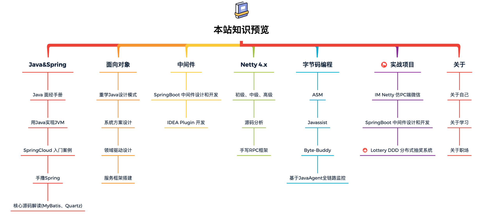

# 写在前面

只有你遇到了困难的时候，才能看得出来你是不是真正有上进心的人。

不要光有雄心壮志，这个是远远不够的，真正遇到了困难，那个苦头吃不吃的下去，才能决定你是否成功，而不是你的目标是否远大，而不是你的道德是否高尚。

腹有诗书气自华。

没有这里面的辛酸，人们是记不住这样的岁月的，希望大家好好努力。

我们是怎样的，取决于我们一路走来点点滴滴的心血和汗水，请大家在未来，更加努力，更加真诚实意的待人。

<br>

今年呢我想大概，我们用这样一个心情来表达：如果再见，换个身份见。如果再也不见，那就把挂念藏在心间。

[宇哥](https://www.bilibili.com/video/BV19L4y1g7z3?spm_id_from=333.337.header_right.fav_list.click)


# 所有笔记

## 一、Java 基础

- [00_Typora使用](01.Java语言基础/00_Typora使用.md)
- [01_Java基础-总](01.Java语言基础/01_Java基础-总.md)
- [02_并发编程juc](01.Java语言基础/02_并发编程juc.md)
- 03_JVM
- 04_设计模式


### 推荐 🚀

- [尚硅谷Java入门基础视频 717P](https://www.bilibili.com/video/BV1Kb411W75N)


```bash
# 尚硅谷宋红康课程目录
1.概述
2.Java基本语法
3.数组
4.面向对象（上）
5.面向对象（中）
6.面向对象（下）
7.异常处理
8.多线程
9.Java常用类
10.枚举类与注解
11.Java集合
12.泛型
13.IO流
14.网络编程
15.Java反射机制
16.Java8的其它特性
17.Java9&Java10&Java11新特性
```


- 《Java核心技术卷I》

```bash
# 本书将详细介绍以下内容
面向对象程序设计
反射与代理
接口与内部类
异常处理
泛型程序设计
集合
事件监听器模型
图形用户界面设计
并发
```

- [尚硅谷宋红康JVM全套教程（详解java虚拟机）](https://www.bilibili.com/video/BV1PJ411n7xZ?p=94)

```bash
# 内存与垃圾回收篇
# 字节码与类的加载篇
# 性能监控与调优篇
```


### JDK

```bash
# 常用的包
java.lang：这个是系统的基础类；
java.io：这里面是所有输入输出有关的类，比如文件操作等；
java.nio：为了完善 io 包中的功能，提高 io 包中性能而写的一个新包；
java.net：这里面是与网络有关的类；
java.util：这个是系统辅助类，特别是集合类；
java.sql：这个是数据库操作的类。
```


### 线程池

Java 提供的线程池相关的工具类中，最核心的是 **ThreadPoolExecutor**，其构造函数如下（有 7 个参数）

```java

ThreadPoolExecutor(
  int corePoolSize,
  int maximumPoolSize,
  long keepAliveTime,
  TimeUnit unit,
  BlockingQueue<Runnable> workQueue,
  ThreadFactory threadFactory,
  RejectedExecutionHandler handler) 
```


| 序号 | 参数            | 说明                                             |
| ---- | --------------- | ------------------------------------------------ |
| 1    | corePoolSize    | 核心线程数量                                     |
| 2    | maximumPoolSize | 最大线程数量                                     |
| 3    | keepAliveTime   | 当前线程数大于corePoolSize时，空闲线程的存活时间 |
| 4    | unit            | keepAliveTime的时间单位                          |
| 5    | workQueue       | 任务队列，被提交但尚未被执行的任务存放的地方     |
| 6    | threadFactory   | 线程工厂，用于创建线程                           |
| 7    | handler         | 任务拒绝策略                                     |


### JVM


### 常见面试问题

```bash
# 8种基本数据类型
# 说下面向对象三大特征
    - 重载和重写
    - 包装类
    - 接口和抽象类
    - 说下final关键字
    - 说下static关键字
    - Object类的方法
# 异常体系结构
    - 受检异常和非受检异常，分别列举几个
    - 异常处理
# 常用类
    - String
# 集合
    - HashMap实现
    - list接口实现类对比
# IO流
    - 列举
    - BIO、NIO等等
# 新特性
    - Lambda表达式
    - Stream API
    - Optional类
```


## 二、Spring


<br>


## 三、数据库

- 01_MySQL笔记-总.md
- 02_Redis笔记-总.md
- 03_MyBatis笔记-总.md


### 推荐


- [手写几万行的Mybatis，把原理搞的透透的！（小傅哥）](https://www.bilibili.com/video/BV1nY4y1B7eT?from=search&seid=13067334712884217946&spm_id_from=333.337.0.0)
  - [仓库](https://github.com/fuzhengwei/small-mybatis)


像我们之前完成[手写 Spring](https://mp.weixin.qq.com/s/g7YdIe_FSrk-WE8nQRO3TA)一样，拆解功能、简化流程、渐进实现，让读者能够更容易的学习到最有价值的知识。


在手写的过程中学习 Mybatis 从解析、绑定、反射、缓存，到回话和事务操作，以及如何与 Spring 进行关联注册 Bean 对象，完成整合部分功能逻辑。通过这些内容的拆解实现，读者伙伴就可以非常清楚的知道这些核心功能都是如何实现的了，以后再阅读 Mybatis 源码也就知道从哪开始到哪结束了。

### MySQL

MySQL 隔离级别

| 隔离级别                | 脏读 | 不可重复读 | 幻读 |
| ----------------------- | ---- | ---------- | ---- |
| Read uncommitted        | √    | √          | √    |
| Read committed          | ×    | √          | √    |
| Repeatable Read（默认） | ×    | ×          | √    |
| Serializable            | ×    | ×          | ×    |


### MyBatis

### Jdbc


## 四、数据结构与算法⭐️

[leetcode](https://leetcode-cn.com/problemset/all/)

[labuladong 的算法小抄](https://labuladong.gitee.io/algo/)


| 阶段     | 练剑                                                         | 学习算法的过程                                               |
| -------- | ------------------------------------------------------------ | ------------------------------------------------------------ |
| 第⼀阶段 | ⻘光利剑，凌厉刚猛，⽆坚不摧，弱冠前以之与河朔群雄争锋。     | 虽然算法技巧的储备⽐较匮乏，刷题⽐较吃⼒，但每每遇到新的算法技巧，都会⼤呼精妙，学习 的乐趣会抵消挫败感。 |
| 第⼆阶段 | 紫薇软剑，三⼗岁前所⽤，误伤义⼠不祥，悔恨⽆已，乃弃之深⾕。 | 对常⻅的算法技巧都已有了⼀定的知识储备，却苦于⽆法⾃如运⽤这些技巧，看到⼀道算法题很 难洞悉其本质，⽆法转化成⾃⼰熟悉的题型来解决。 |
| 第三阶段 | ⽞铁剑，重剑⽆锋，⼤巧不⼯。四⼗岁前恃之横⾏天下。           | 各种算法技巧已⽐较纯熟，理解到计算机算法的本质即为穷举，看到⼀道题⽬，⼤致就知道要⽤ 什么技巧来解决。 |
| 第四阶段 | 四⼗岁后，不滞于物，草⽊⽵⽯均可为剑。⾃此精修，渐进于⽆剑胜有剑之境。 | 随着持续刷题精进，通汇贯通，不只把算法当做⾯试的⼯具，进⽽将算法融⼊⼯作和⽣活，解决 实际问题。 |


## 五、应用框架

- 01_Linux笔记-总

- docker


## 六、前端开发


## 七、计算机基础


## 八、面试


## 九、杂记&其它项目


## 十一、项目


# 推荐参考⭐

## 网站

| 名称  | 地址                       | 主要功能   |
| ----- | -------------------------- | ---------- |
| Maven | https://mvnrepository.com/ | maven repo |
|       |                            |            |
|       |                            |            |


| 名称     | 地址                             | 主要功能   |
| -------- | -------------------------------- | ---------- |
| 谷歌翻译 | https://translate.google.com.hk/ | 翻译       |
| 掘金     | https://juejin.cn/               | 程序员平台 |
|          |                                  |            |


## 平台

- [Java 学习 + 面试指南（JavaGuide）](https://javaguide.cn/)

- [bugstack 虫洞栈（小傅哥）](https://bugstack.cn/)




- [陌溪的学习笔记](https://gitee.com/moxi159753/LearningNotes)


- [芋道源码_知识星球](http://svip.iocoder.cn/index/index.html)

- 微信公众号【芋道源码】发送对应关键字

| 项目             | 描述                 | 关键字    |
| ---------------- | -------------------- | --------- |
| Dubbo            | 分布式 RPC 服务框架  | github000 |
| RocketMQ         | 分布式消息队列       | github001 |
| Sharding-JDBC    | 数据库分库分表中间件 | github002 |
| MyCAT            | 数据库分库分表中间件 | github003 |
| Elasti-Job-Lite  | 分布式作业系统       | github004 |
| Elasti-Job-Cloud | 分布式作业系统       | github005 |
| TCC-Transaction  | 分布式事务中间件     | github006 |
| Eureka           | 注册中心             | github007 |
| Hystrix          | 熔断器               | github008 |
| SkyWalking       | 分布式追踪 && APM    | github009 |
| Netty            | 网络应用框架         | github010 |
| Spring           | J2EE 框架            | github011 |
| MyBatis          | 数据持久层框架       | github012 |
| Spring MVC       | MVC 框架             | github014 |
| Spring Boot      | Spring 应用开发框架  | github015 |
| JDK              | Java 开发工具包      | github016 |


## 书籍

- 《Offer来了 Java面试核心知识点精讲 原理篇》 <u>进行中</u>
  - JVM
  - Java基础
  - Java并发编程
  - 数据结构
  - Java中的常用算法
  - 网络与负载均衡
  - 数据库及分布式事务
  - 分布式缓存的原理及引用
  - 设计模式


```bash
本书是对Java程序员面试必备知识点的总结，详细讲解了JVM原理、多线程、数据结构和算法、分布式缓存、设计模式等内容。

1 JVM原理：涉及JVM运行机制、JVM内存模型、常用垃圾回收算法、JVM类加载机制等
2 Java基础：涉及集合、异常分类及处理、反射、注解、内部类、泛型和序列化等内容
3 Java并发编程：涉及Java多线程的工作原理及应用、Java线程池的工作原理及应用，以及锁、进程调度算法等内容
4 数据结构知识：涉及栈、队列、链表、散列表、二叉树、红黑树、图和位图等内容
5 Java中的常用算法

```


- 《Java核心技术 卷①》
  - 对象与类
  - 继承（进行中）
  - 接口
  - 异常、断言和日志
  - 泛型
  - 集合


- 《深入理解Java虚拟机》


## 优秀文章记录


[如何用Elasticsearch实现Word、PDF，TXT文件的全文内容检索？](https://mp.weixin.qq.com/s/aLD-rbJCXWK8K2aJWj-DYA)


[北京大学肖臻老师《区块链技术与应用》公开课系列笔记——目录导航页](https://blog.csdn.net/Mu_Xiaoye/article/details/104299664)


[一文帮你整理掌握Nginx](https://mp.weixin.qq.com/s?__biz=MzAwNjQwNzU2NQ==&mid=2650360785&idx=1&sn=69a9d557d687f7ea9ebface5e6eab4d2&chksm=83003f33b477b62597918bf7011a4e8cc9316071b8101d2ab27da75e99c64abd10c2c8f7b790&scene=132#wechat_redirect)


[Linux 安装mysql8详细教程](https://blog.csdn.net/u010565545/article/details/104961184)


[Linux安装Jdk 8](https://www.cnblogs.com/tdxm/p/16038014.html)


